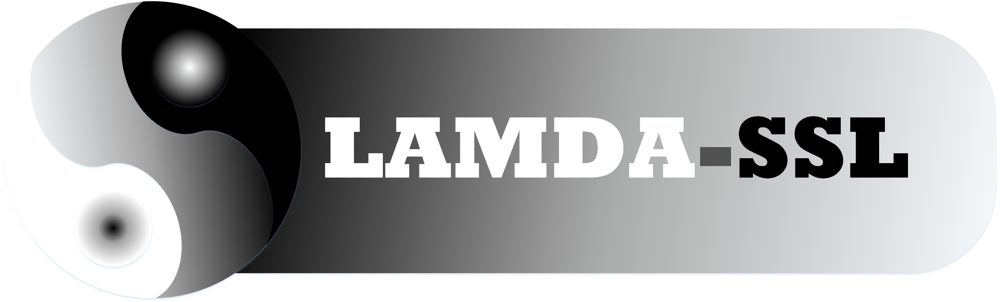
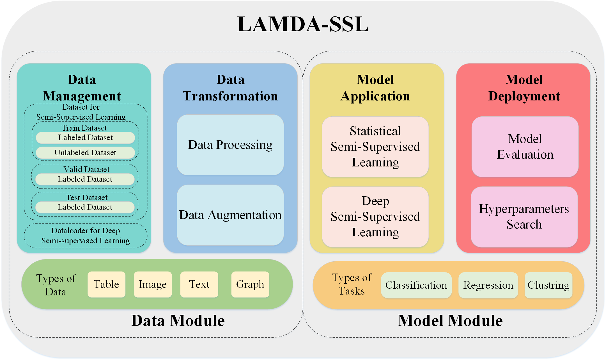
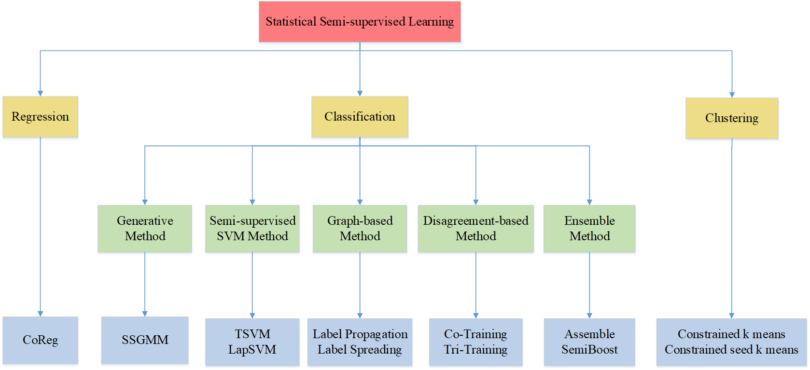

<div align=center>
 


[](https://coveralls.io/github/YGZWQZD/LAMDA-SSL?branch=jialh)
[](https://pepy.tech/project/lamda-ssl)


**[Documentation](https://ygzwqzd.github.io/LAMDA-SSL)** | **[Paper](https://arxiv.org/pdf/2208.04610.pdf)** |  **[Examples](https://github.com/ygzwqzd/LAMDA-SSL/tree/master/Examples)** | **[Slide](https://maipdf.com/doc/a15855342874@pdf)**

</div>

#  Introduction

In order to promote the research and application of semi-supervised learning (SSL) algorithms, we have developed LAMDA-SSL which is a comprehensive and easy-to-use toolkit for SSL in python. LAMDA-SSL has powerful functions, simple interfaces, and extensive documentation. It integrates statistical SSL algorithms and deep SSL algorithms into the same framework. At present, LAMDA-SSL contains 30 semi-supervised learning algorithms, including 12 algorithms based on statistical machine learning models and 18 algorithms based on deep learning models. LAMDA-SSL also contains 45 data processing methods used for 4 types of data: tabular, image, text, graph and 15 model evaluation criterias used for 3 types of task: classification, regression, and clustering. It is compatible with the popular machine learning toolkit scikit-learn and the popular deep learning toolkit Pytorch. It supports Pipeline mechanism and parameter search functions like scikit-learn and also supports GPU acceleration and distributed training functions like Pytorch. LAMDA-SSL includes multiple modules, such as data management, data transformation, model application, and model deployment, which facilitates the implementation of end-to-end SSL.

<div align=center>
 
</div>

At present, LAMDA-SSL has implemented 30 SSL algorithms, including 12 statistical SSL algorithms and 18 deep SSL algorithms. 

For statistical SSL, algorithms in LAMDA-SSL can be used for classification, regression and clustering. The algorithms used for classification task include generative method SSGMM; semi-supervised support vector machine methods TSVM and LapSVM; graph-based methods Label Propagation and Label Spreading; disagrement-based methods Co-Training and Tri-Training; ensemble methods SemiBoost and Assemble. The algorithm used for regression task is CoReg. The algorithms used for clustering task include Constrained K Means, Constrained Seed K Means.
<div align=center>
 
</div>
For deep SSL, algorithms in LAMDA-SSL can be used for classification and regression. The algorithms used for classification task include consistency methods Ladder Network, Π Model, Temporal Ensembling, Mean Teacher, VAT and UDA; Pseudo label-based methods Pseudo Label and S4L; hybrid methods ICT, MixMatch, ReMixMatch, FixMatch and FlexMatch; deep generative methods ImprovedGAN and SSVAE; deep graph-based methods SDNE and GCN. The algorithms for regression task include consistency method Π Model Reg, Mean Teacher Reg; hybrid method ICT Reg. These 3 deep SSL regression algorithms are our extensions of their prototypes used for classification.
<div align=center>
 
</div>


# Superiority

- LAMDA-SSL contains 30 SSL algorithms.
- LAMDA-SSL can handle 4 types of data and provides 45 functions for data processing and data augmentation.
- LAMDA-SSL can handle 3 types of tasks and supports 16 metrics for model evaluation.
- LAMDA-SSL supports 5 hyperparameter search methods including random search, grid search, Bayesian optimization, evolution strategy, and meta-learner.
- LAMDA-SSL supports both statistical SSL algorithms and deep SSL algorithms and uses a unified implementation framework.
- LAMDA-SSL is compatible with the popular machine learning toolkit scikit-learn and the popular deep learning toolkit Pytorch.
- LAMDA-SSL has simple interfaces similar to scikit-learn so that it is easy to use.
- LAMDA-SSL has powerful functions. It supports Pipeline mechanism and parameter search functions like scikit-learn and also supports GPU acceleration and distributed training functions like Pytorch.
- LAMDA-SSL considers the needs of different user groups. It provides well tuned default parameters and modules for entry-level users. It also supports flexible module replacement and customization for professional users.
- LAMDA-SSL has strong extensibility, which is convenient for users to customize new modules and algorithms.
- LAMDA-SSL has been verified by a large number of experiments and has strong reliability.
- LAMDA-SSL has comprehensive user documentation.


# Dependencies

LAMDA-SSL requires:

> - python (>= 3.7)
> - scikit-learn (>= 1.0.2)
> - torch (>= 1.9.0)
> - torchvision (>= 0.11.2)
> - torchtext (>= 0.11.1)
> - torch-geometric(>= 2.0.3)
> - Pillow(>= 8.4.0)
> - numpy(>= 1.19.2)
> - scipy(>= 1.5.2)
> - pandas(>= 1.3.4)
> - matplotlib(>= 3.5.0)

You can create the environment directly by anaconda.

```
conda env create -f environment.yaml
```

# Installation

## Install from pip

You can download LAMDA-SSL directly from pypi.
```
pip install LAMDA-SSL
```

## Install from anaconda

You can also download LAMDA-SSL directly from anaconda.
```
conda install -c ygzwqzd LAMDA-SSL
```


## Install from the source

If you want to try the latest features that have not been released yet, you can install LAMDA-SSL from the source.
```
git clone https://github.com/ygzwqzd/LAMDA-SSL.git
cd LAMDA-SSL
pip install .
```

# Quick Start

For example, train a FixMatch classifier for CIFAR10.

Firstly, import and initialize CIFAR10.

```python
from LAMDA_SSL.Dataset.Vision.CIFAR10 import CIFAR10

dataset = CIFAR10(root='..\Download\CIFAR10',
                  labeled_size=4000,download=True)
labeled_X, labeled_y = dataset.labeled_X, dataset.labeled_y
unlabeled_X = dataset.unlabeled_X
test_X, test_y = dataset.test_X, dataset.test_y
```

Then import and initialize FixMatch.

```python
from LAMDA_SSL.Algorithm.Classification.FixMatch import FixMatch
model=FixMatch(threshold=0.95,lambda_u=1.0,mu=7,T=0.5,epoch=1,num_it_epoch=2**20,device='cuda:0')
```

Next, call the fit() method to complete the training process of the model.
```python
model.fit(X=labeled_X,y=labeled_y,unlabeled_X=unlabeled_X)
```

Finally, call the predict() method to predict the labels of new samples.
```python
pred_y=model.predict(X=test_X)
```

# Performance

We have evaluated the performance of LAMDA-SSL for semi-supervised classification task on table data using BreastCancer dataset. In this experiment, 30% of the instances are randomly sampled to form the testing dataset by the class distribution. Then 10% of the remaining instances are randomly sampled to form the labeled training dataset and the others are used to form the unlabeled training dataset by dropping their labels. For detailed parameter settings of each method, please refer to the 'Config' module of LAMDA-SSL.

<div align=center>

| Method | Accuracy(%) | F1 Score |
| :-: | :-: | :-: |
| SSGMM | 87.13 | 86.85 |
| TSVM | 95.91 | 95.56 |
| LapSVM | 96.49| 96.20 |
| Label Propagation| 95.32| 94.86|
| Label Spreading | 95.32 | 94.90 |
| Co-Training| 94.74| 94.20 |
| Tri-Training| 97.66| 97.47 |
| Assemble | 94.15| 93.75 |
| SemiBoost | 96.49 | 96.20 |

</div>

We have evaluated the performance of LAMDA-SSL for semi-supervised regression task on table data using Boston dataset. In this experiment, 30% of the instances are randomly sampled to form the testing dataset by the class distribution. Then 10% of the remaining instances are randomly sampled to form the labeled training dataset and the others are used to form the unlabeled training dataset by dropping their labels. For detailed parameter settings of each method, please refer to the 'Config' module of LAMDA-SSL.

<div align=center>

| Method | Mean Absolute Error | Mean Squared Error |
| :-: | :-: | :-: |
|CoReg|	4.66|	59.52|
|Π Model Reg|	4.32|	37.64|
|ICT Reg	|4.11|	37.14|
|Mean Teacher Reg	|4.51|	45.56|

</div>

We have evaluated the performance of LAMDA-SSL for semi-supervised clustring task on table data using Wine dataset. In this experiment, 20% of the instances are randomly sampled to form the labeled dataset and the others are used to form the unlabeled dataset by dropping their labels. For detailed parameter settings of each method, please refer to the 'Config' module of LAMDA-SSL.

<div align=center>

| Method | Davies Bouldin Score | Fowlkes Mallows Score |
| :-: | :-: | :-: |
|Constrained k-means	|1.76	|0.75|
|Constrained Seed k-means	|1.38|	0.93|

</div>

We have evaluated the performance of LAMDA-SSL for semi-supervised clustring task on simple vision data using MNIST dataset. In this experiment, 10% of the instances in training dataset are randomly sampled to form the labeled dataset and the others are used to form the unlabeled dataset by dropping their labels. For detailed parameter settings of each method, please refer to the 'Config' module of LAMDA-SSL.

<div align=center>

| Method | Accuracy(%) | F1 Score |
| :-: | :-: | :-: |
|Ladder Network	|97.37	|97.36|
|ImprovedGAN	|98.81|	98.81|
|SSVAE|	96.69|	96.67|

</div>

We have evaluated the performance of LAMDA-SSL for semi-supervised classification task on complex vision data using CIFAR10 dataset. In this experiment, 4000 instances in training dataset are randomly sampled to form the labeled training dataset and the others are used to form the unlabeled training dataset by dropping their labels. WideResNet is used as the backbone network. For detailed parameter settings of each method, please refer to the 'Config' module of LAMDA-SSL.

<div align=center>

| Method | Accuracy(%) | F1 Score |
| :-: | :-: | :-: |
|UDA	|95.41|	95.40|
|Π Model	|87.09|	87.07|
|Temporal Ensembling|	89.30|	89.31|
|Mean Teacher|	92.01	|91.99|
|VAT	|88.22	|88.19|
|Pseudo Label|	85.90|	85.85|
|S4L	|89.59	|89.54|
|ICT	|92.64	|92.62|
|MixMatch	|93.43	|93.43|
|ReMixMatch	|96.24	|96.24|
|FixMatch	|95.34	|95.33|
|FlexMatch|	95.39	|95.40|


</div>

We have evaluated the performance of LAMDA-SSL for semi-supervised classification task on graph data using Cora dataset. In this experiment, 20% of the instances are randomly sampled to form the labeled training dataset and the others are used to form the unlabeled training dataset by dropping their labels. For detailed parameter settings of each method, please refer to the 'Config' module of LAMDA-SSL.

<div align=center>

| Method | Accuracy(%) | F1 Score |
| :-: | :-: | :-: |
|SDNE|	73.78|	69.85|
|GCN|	82.04|	80.52|
|GAT|	79.13|	77.36|


</div>

# Citation
Please cite our paper if you find LAMDA-SSL useful in your work:
```
@article{jia2022lamdassl,
      title={LAMDA-SSL: Semi-Supervised Learning in Python}, 
      author={Lin-Han Jia and Lan-Zhe Guo and Zhi Zhou and Yu-Feng Li},
      journal={arXiv preprint arXiv:2208.04610},
      year={2022}
}
```

# Contribution
Feel free to contribute in any way you like, we're always open to new ideas and approaches.
- [Open a discussion](https://github.com/YGZWQZD/LAMDA-SSL/discussions/new) if you have any question.
- Feel welcome to [open an issue](https://github.com/YGZWQZD/LAMDA-SSL/issues/new) if you've spotted a bug or a performance issue.
- Fork our project and create a pull request after committing your modifications.
- Learn more about how to customize modules of LAMDA-SSL from the [Usage](https://ygzwqzd.github.io/LAMDA-SSL/#/README?id=usage) section of the [documentation](https://ygzwqzd.github.io/LAMDA-SSL/#/).

# Team
 LAMDA-SSL is developed by [LAMDA](https://www.lamda.nju.edu.cn/MainPage.ashx)@[NJU](https://www.nju.edu.cn/en/main.psp). Contributors are [Lin-Han Jia](https://github.com/YGZWQZD), [Lan-Zhe Guo](https://www.lamda.nju.edu.cn/guolz/), [Zhi Zhou](https://www.lamda.nju.edu.cn/zhouz/) and [Yu-Feng Li](https://www.lamda.nju.edu.cn/liyf/).

# Contact
If you have any questions, please contact us: Lin-Han Jia[jialh@lamda.nju.edu.cn].
