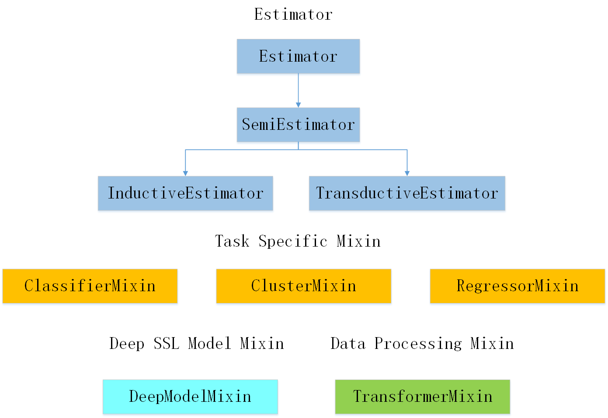
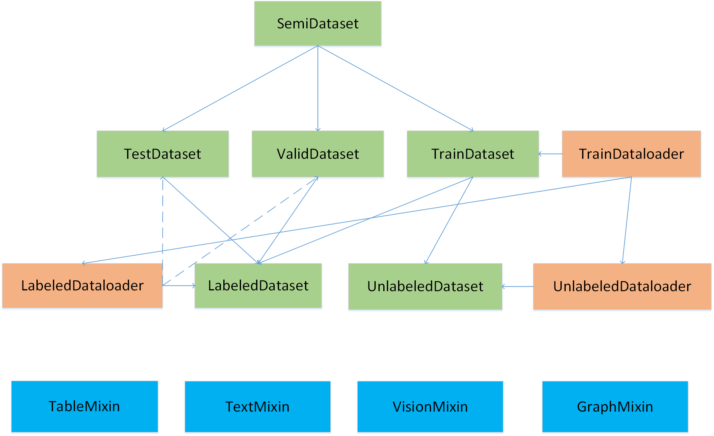

[TOC]

#  Introduction

Semi-sklearn is an efficient tool for semi-supervised learning which is easy to use.

#  Base Structure

#  Data Management

#  Model

##  Classical  Method

###  Semi Supervised SVM

####  S3VM(TSVM) (√)

###  Graphed Based Method

####  Label Propagation (√)

####  Label Spreading (√)

### Generative Method

####  Semi Supervised Gaussian Mixture Model (√)

###  Wrapper Method 

#### Self Training (√)

####  Co Training (√)

####  Tri Training (√)

###  Semi Supervised Cluster

#### Constrained K Means (√)

#### Constrained Seed K Means (√)

###  Semi Supervised Regression

####  CoReg (√)

###  Ensemble Learning

####  Semi Boost ()

####  SSM Boost ()

## Deep Learning Method

####  Consistency Regularization

####  Pi Model (√)

####  Temporal Ensembling (√)

#### Mean Teacher (√)

####  VAT (√)

####  UDA (√)

####  Ladder Network ()

###  Pseudo Labeling

####  Pseudo Label (√)

####  S4L ()

####  Tri Net ()

###  Generative Method

####  CatGan ()

####  SSVAE ()

### Graph-based methods

####  SDNE ()

####  GCN ()

###  Hybrid Method

####  FixMatch (√)

####  MixMatch (√)

####  ReMixMatch (√)

#### FlexMatch (√)

####  ICT ()

