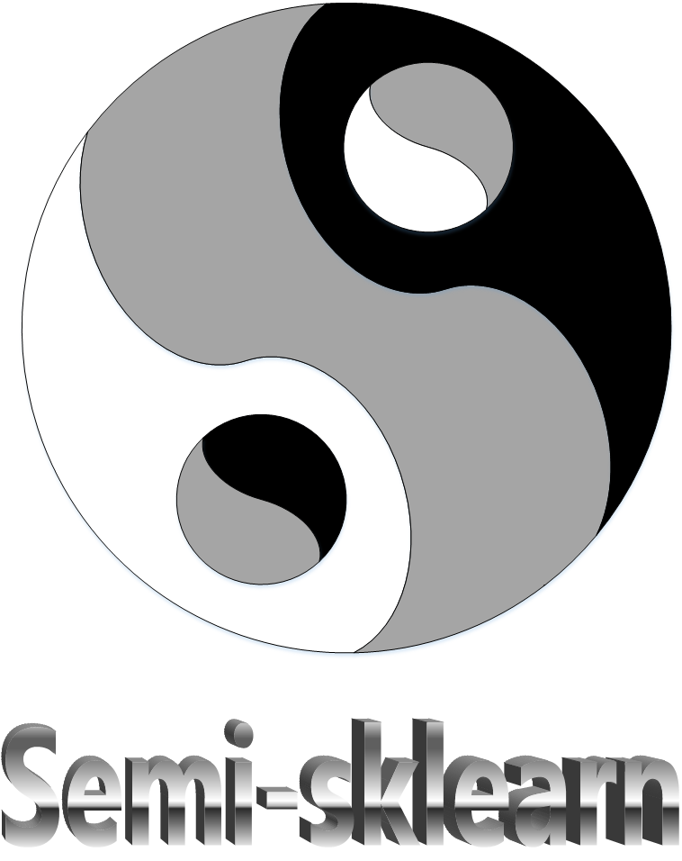

<!-- (width="50%") -->
<div align=center>
 


**[Documentation](https://ygzwqzd.github.io/LAMDA-SSL)** | **[Paper]()** |  **[Examples](https://github.com/ygzwqzd/LAMDA-SSL/tree/master/Examples)**

</div>

#  Introduction

In order to promote the research and application of semi-supervised learning algorithms, we has developed LAMDA which is a convenient and practical semi-supervised learning toolkit. LAMDA-SSL has complete functions, convenient interfaces and detailed documentations. It integrates statistical machine learning algorithms and deep learning algorithms into the same framework. It is compatible with the popular machine learning toolkit sklearn and the popular deep learning toolkit pytorch.  It supports Pipeline mechanism and parameter search functions of sklearn and also supports GPU acceleration and distributed training functions of pytorch. At present, LAMDA-SSL contains 30 semi-supervised learning algorithms, including 13 algorithms based on statistical machine learning models and 17 algorithms based on deep learning models. LAMDA-SSL also contains 45 data processing methods used for 4 types of data: table, image, text, graph and 15 model evaluation criterias used for 3 types of task: classification, regression and clustering. LAMDA-SSL includes multiple modules such as data management, data transformation, algorithm application, model evaluation and so on, which facilitates the completion of the end-to-end semi-supervised learning process.
<div align=center>
 
</div>

# Advantages

> - LAMDA-SSL contains 30 semi-supervised learning algorithms.
> - LAMDA-SSL can handle 4 types of data and has rich data processing functions.
> - LAMDA-SSL can handle 3 types of tasks and has rich metrics for model evaluation.
> - LAMDA-SSL supports both statistical semi-supervised learning algorithms and deep semi-supervised learning algorithms.
> - LAMDA-SSL is compatible with the popular machine learning toolkit sklearn and the popular deep learning toolkit pytorch.
> - LAMDA-SSL has simple interfaces similiar to sklearn so that it is easy to use.
> - LAMDA-SSL has powerful functions. It supports Pipeline mechanism and parameter search functions of sklearn and also supports GPU acceleration and distributed training functions of pytorch.
> - LAMDA-SSL considers the needs of different user groups. It provides well tuned default parameters and modules for low-proficiency users. It also supports flexible module replacement for high-proficiency users.
> - LAMDA-SSL has strong extensibility, which is convenient for users to customize new modules and algorithms.
> - LAMDA-SSL has been verified by a large number of experiments and has strong reliability.
> - LAMDA-SSL has complete user documentations.


# Dependencies

LAMDA-SSL requires:

> - python (>= 3.7)
> - scikit-learn (>= 1.0.2)
> - pytorch (>= 1.9.0)
> - torchvision (>= 0.10.0)
> - torchtext (>= 0.10.0)
> - torch-geometric(>= 2.0.3)
> - Pillow(>= 8.4.0)
> - numpy(>= 1.21.5)
> - scipy(>= 1.7.3)
> - pandas(>= 1.3.4)
> - matplotlib(>= 3.5.0) 

# Installation
## Install from pip

You can download LAMDA-SSL directly from pip.
```
pip install LAMDA-SSL
```

## Install from anaconda

You can also download LAMDA-SSL directly from anaconda.
```
conda install LAMDA-SSL
```


## Install from the source

If you want to try the latest features that have not been released yet, you can install LAMDA-SSL from the source.
```
git clone https://github.com/ygzwqzd/LAMDA-SSL.git
cd LAMDA-SSL
pip install .
```

# Quick Start

For example, train a FixMatch classifier for CIFAR10.

Firstly, import and initialize CIFAR10.

```python
from LAMDA_SSL.Dataset.Vision.cifar10 import CIFAR10
dataset=CIFAR10(root='..\Download\cifar-10-python',
                labeled_size=4000,stratified=False,
                shuffle=True,download=True)
labeled_X=dataset.labeled_X
labeled_y=dataset.labeled_y
unlabeled_X=dataset.unlabeled_X
test_X=dataset.test_X
test_y=dataset.test_y
```

Then import and initialize FixMatch.
```python
from LAMDA_SSL.Algorithm.Classifier.Fixmatch import Fixmatch
model=Fixmatch(threshold=0.95,lambda_u=1.0,mu=7,T=0.5,epoch=1,num_it_epoch=2**20,num_it_total=2**20，device='cuda:0')
```

Next, call the fit() method to complete the training process of the model.
```python
model.fit(X=labeled_X,y=labeled_y,unlabeled_X=unlabeled_X)
```

Finally, call the predict() method to predict the labels of new samples.
```python
pred_y=model.predict(X=test_X)
```

# Performance

<div align=center>

| Method | Accuracy(%) | F1 Score |
| :-: | :-: | :-: |
| SSGMM | 94.74 | 94.43 |
| TSVM | 92.40 | 91.62 |
| LapSVM | 96.49| 96.20 |
| Label Propagation| 93.57| 92.85 |
| Label Spreading | 95.32 | 94.90 |
| Self-Training| 97.66| 97.49 |
| Co-Training| 97.08| 99.07 |
| Tri-Training| 97.66| 97.47 |
| Assemble | 94.15| 93.75 |
| SemiBoost | 97.08 | 96.85 |

</div>

# Citation
Please cite our paper if you find LAMDA-SSL useful in your work:
```
```

# Contribution
Feel free to contribute in any way you like, we're always open to new ideas and approaches.
- [Open a discussion](https://github.com/YGZWQZD/LAMDA-SSL/discussions/new) if you have any question.
- Feel welcome to [open an issue](https://github.com/YGZWQZD/LAMDA-SSL/issues/new) if you've spotted a bug or a performance issue.
- Learn more about how to customize modules of LAMDA-SSL from the [Usage](https://ygzwqzd.github.io/LAMDA-SSL/#/README?id=usage) section of the [documentation](https://ygzwqzd.github.io/LAMDA-SSL/#/).

# The Team
 LAMDA-SSL is developed by [LAMDA](https://www.lamda.nju.edu.cn/MainPage.ashx)12@[NJU](https://www.nju.edu.cn/en/main.psp). Contributors are .

# Contact
If you have any questions, please contact us: Lin-Han Jia[jialh2118@gmail.com].