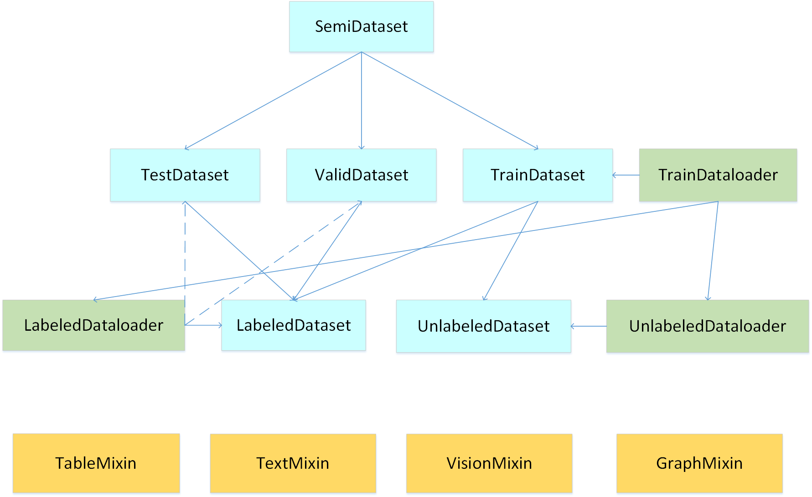

#  Introduction

LAMDA-SSL is an useful and efficient toolbox for semi-supervised learning[1-3]. At present, LAMDA-SSL contains 30 semi-supervised learning algorithms, including 13 algorithms based on classical machine learning models and 17 algorithms based on deep neural network models. LAMDA-SSL can be used to process four types of data: structured data, image data, text data and graph data, and can be used for three types of task: classification, regression and clustering. LAMDA-SSL includes multiple modules such as data management, data transformation, algorithm application, model evaluation and so on, which facilitates the completion of the end-to-end semi-supervised learning process, and is compatible with the current popular machine learning toolkit scikit-learn and deep learning toolkit pytorch.

## Design Idea

The overall design idea of LAMDA-SSL is shown in the figure. LAMDA-SSL refers to the underlying implementation of sklearn[33]. All Algorithms in LAMDA-SSL have interfaces similar to that Algorithms in sklearn.The learners in sklearn all inherit the parent class Estimator. Estimator uses known data to build a model to make predictions on unknown data. There are usually two usual methods in Estimator: fit() and transform(). fit() method is an adaptation process using existing data to build a model, which corresponds to the training process in machine learning. transform() method is a transformation process using the fitted model to predict results of new instances, which corresponds to the predicting process in machine learning.

<div align=center>

</div>

Learners in LAMDA-SSL indirectly inherits Estimator in sklearn by inheriting the semi-supervised predictor class SemiEstimator. Data used for fit() method in sklearn usually includes samples and labels.However, in semi-supervised learning, labeled samples, labels and unlabeled samples are used in the training process of the model, so Estimator's fit() method is inconvenient directly used in semi-supervised learning algorithms. Although sklearn also implements two types of semi-supervised learning algorithms, self-training methods and graph-based methods, which also inherit the Estimator class, in order to use the interface of the fit() method, sklearn combines labeled samples and unlabeled data samples as samples input of fit() method, mark the labels corresponding to the unlabeled samples as -1 in labels input of fit() method. Although this processing method can be adapted to the Estimator interface, it also has limitations, especially in some binary classification scenario using -1 to indicate negative labels of labeled samples, which will conflict with unlabeled samples. Therefore, it is necessary to re-establish a new class SemiEstimator on the basis of Estimator for semi-supervised learning. There are three parts in the input of SemiEstimator's fit() method: labeled samples, labels and unlabeled samples, which better adapts the application scenario of semi-supervised learning. It doesn't require users combining data by themselves, and avoids the conflict between marks of unlabeled samples and labels of negative samples in binary classification. Compared with Estimator it's more convenient.

Semi-supervised learning is generally divided into inductive learning and transductive learning. The difference is whether the samples to be predicted is directly used as the unlabeled samples in the training process. LAMDA-SSL uses two classes InductiveEstimator and TransductiveEstimator, which correspond to two types of semi-supervised learning methods: inductive learning and transductive learning respectively. InductiveEstimator and TransductiveEstimator both inherit SemiEstimator.

<div align=center>
 
</div>

In order to enable estimators to have corresponding functions for different tasks, sklearn has developed components (Mixin) corresponding to the scene for different usage scenarios of estimators. Estimators in sklearn often inherit both Estimator and corresponding components, so that they have the most basic fitting and prediction capabilities and also have the function of processing tasks corresponding to specific components. The key components include ClassifierMixin for classification tasks, RegressorMixin for regression tasks, ClusterMixin for clustering tasks, and TransformerMixin for data transformation, which are also used in LAMDA-SSL.

In addition, different from sklearn framework commonly used in classical machine learning, deep learning often uses pytorch framework. There are lots of dependencies between the components of pytorch such as Dataset coupling with Dataloader, Optimizer coupling with Scheduler, Sampler coupling with BatchSampler, etc. In pytorch, there is no simple logic and interfaces like sklearn which causes great difficulty in integrating both classical machine learning methods and deep learning methods into a same toolkit. In order to solve this problem LAMDA-SSL uses DeepModelMixin component to enable deep semi-supervised models developed based on pytorch to have the same interface and usage as classical machine learning methods. Deep semi-supervised learning algorithms in LAMDA-SSL all inherit this component. DeepModelMixin decouples each module of pytorch, which is convenient for users to independently replace data loader, network structure, optimizer and other modules in deep learning without considering the impact of replacement on other modules. Deep semi-supervised learning algorithms can be called as easily as classical semi-supervised learning algorithms in LAMDA-SSL.

<div align=center>
 
</div>


## Data Management

LAMDA-SSL has powerful data management and data processing functions. In LAMDA-SSL, a semi-supervised dataset can be managed by SemiDataset class. The SemiDataset class can manage three sub-datasets: TrainDataset, ValidDataset, and TestDataset corresponding to training dataset, validation dataset and test dataset in machine learning tasks respectively. The most basic classes for data management are LabeledDataset and UnlabeledDataset, which correspond to labeled data and unlabeled data in semi-supervised learning respectively. Training datasets often contains both labeled data and unlabeled data. Therefore, TrainDataset simultaneously manage a LabeledDataset and an UnlabeledDataset.

LAMDA-SSL designs two most basic data loaders: LabeledDataloader and UnlabeledDataloader for LabeledDataset and UnlabeledDataset respectively.Semi-sklarn uses TrainDataloader class to manage the two loaders in the training process of semi-supervised learning and adjust the relationship between the two loaders, such as adjusting the ratio of labeled data and unlabeled data in each batch.

LAMDA-SSL can process structured data, image data, text data, and graph data, which are four common data types in practical applications. LAMDA-SSL uses four components corresponding to data types: StructuredDataMixin, VisionMixin, TextMixin, and GraphMixin. Every Dataset can inherit the component corresponding to its data type to obtain the data processing function in the component.

<div align=center>
 
</div>


## Data Transformation

Before using data to learn models and using models to predict labels of new data, it is usually necessary to preprocess or augment data, especially in the field of semi-supervised learning. To meet the needs of adding noise, the data transformation module of LAMDA-SSL provides various data preprocessing and data augmentation methods for different types of data, such as normalization, standardization, MinMaxScale for structured data, Rotation, cropping, flipping for visual data, word segmentation, word embedding, length adjustment for text data, node feature standardization, k-nearest neighbor graph construction, graph diffusion[36] for graph data, etc. All data transformation methods inherit TransformerMixin class from sklearn. Transformation method can be called using the interface of either sklearn or pytorch. For multi transformations in turn, both Pipeline mechanism in sklearn and Compose   mechanism in pytorch can be used.

## Algorithm Usage

At present, LAMDA-SSL contains 30 semi-supervised learning algorithms. There are 13 algorithms based on classical machine learning models, including generative method: SSGMM; semi-supervised support vector machine methods: TSVM, LapSVM; graph-based methods: Label Propagation, Label Spreading;  wrappers methods: Self-Training, Co-Training, Tri-Training; ensemble methods: Assemble, SemiBoost; semi-supervised regression method: CoReg; semi-supervised clustering method: Constrained K Means, Constrained Seed K Means. There are 17 algorithms based on deep neural network models, including Consistency regularization methods: Ladder Network, Pi Model, Temporal Ensembling, Mean Teacher, VAT, UDA; pseudo-label-based methods: Pseudo Label, S4L; hybird methods: ICT , MixMatch, ReMixMatch, FixMatch, FlexMatch; deep generative methods: ImprovedGAN, SSVAE; deep graph based methods: SDNE, GCN.

<div align=center>

</div>


<div align=center> 
 
</div>


## Model Evaluation

LAMDA-SSL provides different evaluation indicators for different tasks, such as accuracy, precision, recall for classification tasks, mean squared error, mean squared logarithmic error, mean absolute error for regression tasks and Davies Bouldin Index[37], Fowlkes and Mallows Index[38], Rand Index[39] for clustering tasks etc. In LAMDA-SSL, the evaluation method can be called after getting the prediction results directly passed to the model in the form of a python dictionary as a parameter.

# Quick Start

## Load Data

Take CIFAR10 dataset as an example, firstly import the CIFAR10 class.

```python
from LAMDA_SSL.Dataset.Vision.cifar10 import CIFAR10
```

Instantiate a CIFAR10 dataset, which is equivalent to a data manager. The parameter 'root' indicates the storage path of the dataset. The parameter 'labeled_size' indicates the number or proportion of labeled samples. The parameter 'stratified' indicates whether to divide the dataset according to the category ratio. The parameter 'shuffle' indicates whether the dataset needs to be shuffled and The parameter 'download' indicates whether the dataset needs to be downloaded.

```python
dataset=CIFAR10(root='..\LAMDA_SSL\Download\cifar-10-python',labeled_size=4000,stratified=False,shuffle=True,download=False)
```

Initialize the internal structure of the dataset through the method 'init_dataset'. If you use the datasets in LAMDA-SSL, you do not need to set parameters. If you use a custom dataset, you need to input specific data.

```python
dataset.init_dataset()
```

The data preprocessing method is initialized through the method 'init_transform' and the default setting is directly used here.

```python
dataset.init_transform()
```

The specific data in the dataset can be obtained by accessing the parameters of the encapsulated dataset.

```python
labeled_dataset=getattr(dataset,'labeled_dataset')
unlabeled_dataset=getattr(dataset,'unlabeled_dataset')
unlabeled_X=getattr(unlabeled_dataset,'X')
labeled_X=getattr(labeled_dataset,'X')
labeled_y=getattr(labeled_dataset,'y')
valid_X=getattr(dataset.valid_dataset,'X')
valid_y=getattr(dataset.valid_dataset,'y')
test_X=getattr(dataset.test_dataset,'X')
test_y=getattr(dataset.test_dataset,'y')
```

## Transform Data

Taking RandAugment[40] data augmentation as an example. firstly import the RandAugment class.

```python
from LAMDA_SSL.Transform.RandAugment import RandAugment
```

Instantiate RandAugment class. The parameter 'n' is the number of random augmentation. The parameter 'm' is the magnitude of augmentation. The parameter 'num_bins' is the number of levels of magnitude division. This setting divides the augmentation magnitude into 10 levels, and uses the 10-th level augmentation augmentation twice.

```python
augmentation=RandAugment(n=2,m=10,num_bins=10)
```

Then input the data to complete the data augmentation. There are two ways: you can call the method 'fit_transform'.

```python
augmented_X=augmentation.fit_transform(X)
```

Or call the methed '\_\_call\_\_' directly.

```python
augmented_X=augmentation(X)
```

## Use Pipeline Mechanism

LAMDA-SSL supports Pipeline mechanism, which uses multiple data processing methods for data processing in turn.
Such as strong data augmentation and weak data augmentation in the FixMatch algorithm.

```python
from sklearn.pipeline import Pipeline
from LAMDA_SSL.Transform.RandomHorizontalFlip import RandomHorizontalFlip
from LAMDA_SSL.Transform.RandomCrop import RandomCrop
from LAMDA_SSL.Transform.RandAugment import RandAugment
from LAMDA_SSL.Transform.Cutout import Cutout
weakly_augmentation=Pipeline([('RandomHorizontalFlip',RandomHorizontalFlip()),
                              ('RandomCrop',RandomCrop(padding=0.125,padding_mode='reflect')),
                              ])

strongly_augmentation=Pipeline([('RandAugment',RandAugment(n=2,m=5,num_bins=10,random=True)),
                              ('Cutout',Cutout(v=0.5,fill=(127,127,127))),
                              ('RandomHorizontalFlip',RandomHorizontalFlip()),
                              ('RandomCrop',RandomCrop(padding=0.125,padding_mode='reflect')),
                              ])
```

You can directly call the method 'fit_transform' to complete data processing.

```python
weakly_augmented_X=weakly_augmentation.fit_transform(X)
strongly_augmented_X=strongly_augmentation.fit_transform(X)
```

## Train a Classical SSL Model

Take the Self-training algorithm as an example.
Firstly import and initialize the BreastCancer dataset.

```python
from LAMDA_SSL.Dataset.Table.BreastCancer import BreastCancer
dataset=BreastCancer(test_size=0.3,labeled_size=0.1,stratified=True,shuffle=True,random_state=0)
dataset.init_dataset()
dataset.init_transforms()
```

Preprocess the data.

```python
labeled_X=dataset.pre_transform.fit_transform(dataset.labeled_X)
labeled_y=dataset.labeled_y
unlabeled_X=dataset.pre_transform.fit_transform(dataset.unlabeled_X)
unlabeled_y=dataset.unlabeled_y
test_X=dataset.pre_transform.fit_transform(dataset.test_X)
test_y=dataset.test_y
```

Call and initialize the Self-training model using  SVM model as the base learner.

```python
from LAMDA_SSL.Algorithm.Classifier.Self_Training import Self_training
from sklearn.svm import SVC

SVM = SVC(C=1.0, kernel='linear', probability=True, gamma='auto')
model = Self_training(base_estimator=SVM, threshold=0.8, criterion="threshold", max_iter=100)
```

Call the method 'fit' for model training.

```python
model.fit(X=labeled_X,y=labeled_y,unlabeled_X=unlabeled_X)
```

Make predictions on test data.

```python
result=model.predict(X=test_X)
```

Evaluate model performance.

```python
from LAMDA_SSL.Evaluation.Classification.Accuracy import Accuracy
from LAMDA_SSL.Evaluation.Classification.Recall import Recall
print(Accuracy().scoring(test_y,result))
print(Recall().scoring(test_y,result))
```

## Train a Deep SSL Model

Take FixMatch algorithm as an example.
Firstly import and initialize CIFAR10 dataset.

```python
from lamda_ssl.Dataset.Vision.cifar10 import CIFAR10
dataset=CIFAR10(root='..\LAMDA_SSL\Download\cifar-10-python',labeled_size=4000,stratified=True,shuffle=True,download=False)
dataset.init_dataset()
dataset.init_transforms()
```

Obtain the specific data in the dataset by accessing the parameters of the encapsulated dataset.

```python
labeled_dataset=getattr(dataset,'labeled_dataset')
unlabeled_dataset=getattr(dataset,'unlabeled_dataset')
unlabeled_X=getattr(unlabeled_dataset,'X')
labeled_X=getattr(labeled_dataset,'X')
labeled_y=getattr(labeled_dataset,'y')
valid_X=getattr(dataset.valid_dataset,'X')
valid_y=getattr(dataset.valid_dataset,'y')
test_X=getattr(dataset.test_dataset,'X')
test_y=getattr(dataset.test_dataset,'y')
```

In deep learning, dataloaders need to be used. Firstly, it is necessary to encapsulate the specific data into a data maneger and determine the processing method during the data loading process.

```python
from LAMDA_SSL.Dataset.TrainDataset import TrainDataset
from LAMDA_SSL.Dataset.UnlabeledDataset import UnlabeledDataset
train_dataset=TrainDataset(transforms=dataset.transforms,transform=dataset.transform,pre_transform=dataset.pre_transform,
                           target_transform=dataset.target_transform,unlabeled_transform=dataset.unlabeled_transform)

valid_dataset=UnlabeledDataset(transform=dataset.valid_transform)

test_dataset=UnlabeledDataset(transform=dataset.test_transform)
```

Before initializing the data loader, you can set the sampler according to your requirements. Here, random sampling is used for training and sequential sampling is used for test and Validation.

```python
from LAMDA_SSL.Sampler.RandomSampler import RandomSampler
from LAMDA_SSL.Sampler.SequentialSampler import SequentialSampler
from LAMDA_SSL.Sampler.BatchSampler import SemiBatchSampler
train_sampler=RandomSampler(replacement=True,num_samples=64*(2**20))
train_batch_sampler=SemiBatchSampler(batch_size=64,drop_last=True)
valid_sampler=SequentialSampler()
test_sampler=SequentialSampler()
```

Set the data augmentation method in the form of Pipeline. If there are multiple augmentation methods, it can be stored in a python dictionary or a list.

```python
from sklearn.pipeline import Pipeline
from LAMDA_SSL.Transform.RandomHorizontalFlip import RandomHorizontalFlip
from LAMDA_SSL.Transform.RandomCrop import RandomCrop
from LAMDA_SSL.Transform.RandAugment import RandAugment
from LAMDA_SSL.Transform.Cutout import Cutout
weakly_augmentation=Pipeline([('RandomHorizontalFlip',RandomHorizontalFlip()),
                              ('RandomCrop',RandomCrop(padding=0.125,padding_mode='reflect')),
                              ])

strongly_augmentation=Pipeline([('RandAugment',RandAugment(n=2,m=5,num_bins=10,random=True)),
                              ('Cutout',Cutout(v=0.5,fill=(127,127,127))),
                              ('RandomHorizontalFlip',RandomHorizontalFlip()),
                              ('RandomCrop',RandomCrop(padding=0.125,padding_mode='reflect')),
                              ])
augmentation={
    'weakly_augmentation':weakly_augmentation,
    'strongly_augmentation':strongly_augmentation
}
```

Set the neural network structure in deep learning. Here, WideResNet is used as the basic structure of the neural network.

```python
from LAMDA_SSL.Network.WideResNet import WideResNet
network=WideResNet(num_classes=10,depth=28,widen_factor=2,drop_rate=0)
```

Set the optimizer in deep learning, here the SGD optimizer is used.

```python
from LAMDA_SSL.Opitimizer.SGD import SGD
optimizer=SGD(lr=0.03,momentum=0.9,nesterov=True)
```
Set the scheduler in deep learning to adjust the learning rate during training.

```python
from LAMDA_SSL.Scheduler.CosineAnnealingLR import CosineAnnealingLR
scheduler=CosineAnnealingLR(eta_min=0,T_max=2**20)
```

In the deep semi-supervised learning algorithms, a dictionary can be used to store multiple evaluation indicators, which are directly used as parameters during model initialization to verify the model performence during the training process.

```python
from LAMDA_SSL.Evaluation.Classification.Accuracy import Accuracy
from LAMDA_SSL.Evaluation.Classification.Top_k_Accuracy import Top_k_accurary
from LAMDA_SSL.Evaluation.Classification.Precision import Precision
from LAMDA_SSL.Evaluation.Classification.Recall import Recall
from LAMDA_SSL.Evaluation.Classification.F1 import F1
from LAMDA_SSL.Evaluation.Classification.AUC import AUC
from LAMDA_SSL.Evaluation.Classification.Confusion_Matrix import Confusion_matrix

evaluation = {
    'accuracy': Accuracy(),
    'top_5_accuracy': Top_k_accurary(k=5),
    'precision': Precision(average='macro'),
    'Recall': Recall(average='macro'),
    'F1': F1(average='macro'),
    'AUC': AUC(multi_class='ovo'),
    'Confusion_matrix': Confusion_matrix(normalize='true')
}
```

Initialize Fixmatch algorithm and set components and parameters.

```python
from LAMDA_SSL.Algorithm.Classifier.FixMatch import Fixmatch

model = Fixmatch(train_dataset=train_dataset, valid_dataset=valid_dataset, test_dataset=test_dataset,
                 train_sampler=train_sampler, valid_sampler=valid_sampler, test_sampler=test_sampler,
                 train_batch_sampler=train_batch_sampler,
                 train_dataloader=train_dataloader, valid_dataloader=valid_dataloader, test_dataloader=test_dataloader,
                 augmentation=augmentation, network=network, optimizer=optimizer, scheduler=scheduler,
                 evaluation=evaluation,
                 epoch=1, num_it_epoch=1, num_it_total=1, eval_it=2000, device='cpu', mu=7,
                 T=1, weight_decay=0, threshold=0.95, lambda_u=1.0, ema_decay=0.999)
```

Train the model and validate the model while training.

```python
model.fit(X=labeled_X,y=labeled_y,unlabeled_X=unlabeled_X,valid_X=valid_X,valid_y=valid_y)
```

Finally, make predictions on the test data.

```python
model.predict(test_X)
```

## Search Params

LAMDA-SSL supports the parameter search mechanism in sklearn.
Firstly initialize a model with incomplete parameters.

```python
model=Fixmatch(train_dataset=train_dataset,test_dataset=test_dataset,
               train_dataloader=train_dataloader,test_dataloader=test_dataloader,
               augmentation=augmentation,network=network,epoch=1,num_it_epoch=2,num_it_total=2,
               optimizer=optimizer,scheduler=scheduler,device='cpu',eval_it=1,
               mu=7,T=1,weight_decay=0,evaluation=evaluation,train_sampler=train_sampler,
               test_sampler=test_sampler,train_batch_sampler=train_batchsampler,ema_decay=0.999)
```

Set the parameters to be searched in the form of a dictionary.
    
```python
param_dict = {"threshold": [0.7, 1],
              "lambda_u":[0.8, 1]
              }
```

Parameter search is performed in a random search manner.
Firstly, initialize the search mode.

```python
from sklearn.model_selection import RandomizedSearchCV
random_search = RandomizedSearchCV(model, param_distributions=param_dict,n_iter=1, cv=4,scoring='accuracy')
```

Start the search.

```python
random_search.fit(X=labeled_X,y=labeled_y,unlabeled_X=unlabeled_X)
```

## Train Distributedly

Distributed training can be used to train models simultaneously with multiple GPUs. Take Fixmatch as an example.
Import and initialize the DataParallel module. The GPUs required for distributed training need to be set up.

```python
from LAMDA_SSL.Distributed.DataParallel import DataParallel
parallel=DataParallel(device_ids=['cuda:0','cuda:1'],output_device='cuda:0')
```

Initialize the Fixmatch algorithm for distributed training.

```python
model=Fixmatch(train_dataset=train_dataset,valid_dataset=valid_dataset,test_dataset=test_dataset,
               train_sampler=train_sampler,valid_sampler=valid_sampler,test_sampler=test_sampler,train_batch_sampler=train_batch_sampler,
               train_dataloader=train_dataloader,valid_dataloader=valid_dataloader,test_dataloader=test_dataloader,
               augmentation=augmentation,network=network,optimizer=optimizer,scheduler=scheduler,evaluation=evaluation,
               epoch=1,num_it_epoch=1,num_it_total=1,eval_it=2000,device='cpu',mu=7,parallel=parallel,
               T=1,weight_decay=0,threshold=0.95,lambda_u=1.0,ema_decay=0.999)
```

Start distributed training

```python
model.fit(X=labeled_X,y=labeled_y,unlabeled_X=unlabeled_X,valid_X=valid_X,valid_y=valid_y)
```

## Save and Load Model

Semi-supervised learning models can be saved and loaded using pickle.

Set the path.

```python
path='../save/Fixmatch.pkl'
```

Save the model.

```python
with open(path, 'wb') as f:
    pickle.dump(model, f)
```

Load the model.

```python
with open(path, 'rb') as f:
    model = pickle.load(f)
```

# User Guide


## Classical Semi-supervised Learning

### Generative Model

Generative semi-supervised learning methods are based on generative models, which assume that data is generated from a potential distribution. Generative methods establish the relationship between samples and generative model parameters. In semi-supervised generative methods, labels are regarded as the latent variables of the model, The expectation-maximization (EM) algorithm can be used for maximum likelihood estimation.

#### SSGMM

SSGMM[4] model was proposed by Shahshahani et al. SSGMM is a semi-supervised Gaussian mixture model. It is assumed that data is generated by a Gaussian mixture model, that is, the marginal distribution of samples can be expressed as the result of mixing several Gaussian distributions together, and each Gaussian distribution is given a weight. SSGMM maps the feature distribution of each class to a Gaussian mixture component. For each labeled instance, the Gaussian mixture component corresponding to its class is known. For each unlabeled instance, the Gaussian mixture component is represented by a probability distribution, and it can be classified into the class corresponding to the Gaussian mixture component with the highest probability. SSGMM assumes that the samples obey the assumption of independent and identical distribution, and its likelihood function is the product of joint probabilities of all labeled examples and marginal probabilities of all unlabeled data samples. The maximum likelihood estimation is used to maximize the likelihood function to get the parameters of the generative model including the variance, mean, and weight of each part of the Gaussian mixture model with the highest probability of co-occurrence of labeled data and unlabeled data. Since this method has unobservable hidden variables corresponding labels of unlabeled samples, it cannot directly get maximum likelihood parameters, so SSGMM adopts the EM algorithm to solve this problem. The EM algorithm is divided into two steps. In E step, conditional distribution or expectation of the unobserved data are obtained according to the current parameters and the observable data. In the SSGMM model, this step uses the Bayesian formula to get the conditional distribution of the labels of the unlabeled samples according to the observed samples and the parameters of the current model. The M-step makes a maximum likelihood estimation of the model parameters according to the value of the currently observed variable and the expectation or probability distribution of the latent variable, that is, the original The hidden variables are unknown and the maximum likelihood estimation cannot be performed. After the E step, the expectation or conditional probability distribution of the hidden variables is obtained, and the maximum likelihood estimation becomes feasible. In the SSGMM model, this step uses the observed labeled samples and labels, unlabeled samples and class conditional distributions obtained in step E update the parameters of the Gaussian mixture model. Step E and step M are carried out alternately in an iterative form until convergence, which can realize the simultaneous use of labeled data and unlabeled data to train a Gaussian mixture model and the classifier based on this Gaussian mixture model can be obtained through the Bayesian formula.

### Semi-supervised Support Vactor Machine

Support vector machine is one of the most representative algorithms in the field of machine learning. This class of algorithms treats the binary classification problem as finding a suitable partitioning hyperplane in the feature space. In the case of linear separability, among all the hyperplanes that can complete the correct classification, the optimal dividing hyperplane should be located in the middle of the samples from different classes, which can improve the robustness of the model for predicting unknown samples. In each class, the sample closest to the hyperplane is called the support vector. Support vectors of different classes are equidistant from the hyperplane. The purpose of the support vector machine algorithm is to find the hyperplane closest to its corresponding support vectors. However, in real tasks, there are often no hyperplanes that can correctly divide all training samples. Even if there are, it is most likely due to overfitting. Therefore, a class of support vector machine methods introduces Soft Margin mechanism , which allows the hyperplane to not necessarily classify all samples correctly, but adds a penalty for misclassifying samples in the optimization objective.

Semi-supervised support vector machine is a generalization of the support vector machine algorithm in the field of semi-supervised learning. The semi-supervised support vector machine introduces a low-density assumption, that is, the learned hyperplane not only needs to separate the classifications as much as possible based on the labeled samples, but also needs to pass through the low-density regions of the distribution of all samples as much as possible. It make reasonable use of the unlabeled samples. LAMDA-SSL includes two semi-supervised SVM methods: TSVM and LapSVM.

#### TSVM

TSVM[5] was proposed by Joachims et al. TSVM is the most basic transductive semi-supervised support vector machine method. TSVM needs to infer labels of unlabeled samples and find a dividing hyperplane that maximizes the distance from support vectors. Since the labels assigned to the unlabeled samples are not necessarily real labels, the unlabeled samples and the labeled samples cannot be treated the same in the initial stage of training. $C_l$ and $C_u$ are magnitudes of the penalty reflecting the importance attached to the labeled samples and the unlabeled samples. Since the number of possible situations where labels of all unlabeled samples may appear increases exponentially with the increase of the number of unlabeled samples, it is impossible to determine the labels of unlabeled samples in an exhaustive way to find the global optimal solution. The optimization goal of TSVM is to find an approximate solution using an iterative search method. Firstly an SVM is trained based on the labeled samples, and the SVM is used to predict the labels of unlabeled samples. Then $C_l\ll C_u $ is initialized, and the iteration is started. In the iterative process, all the samples are used to solve the new hyperplane. TSVM algorithm continuously finds pairs of unlabeled heterogeneous samples that may be mispredicted and exchange labels and retrain the SVM model until no more qualified pairs can be found. The importance of unlabeled samples is increased by doubling the value of $C_u$ in each iteration. Iteration continues until $C_u$ is equal to $ C_l$. Finally, the prediction results of the unlabeled samples obtained by the final SVM model and the transductive process is completed.

<div align=center>

</div>

<!-- ##### <font color=blue size=56>LapSVM</font> -->
#### LapSVM
 
LapSVM[6] was proposed by Belkin et al. LapSVM is based on the manifold assumption. The classical SVM algorithm seeks to maximize the margin between the dividing hyperplane and support vectors, which only considers the distribution of samples in the feature space. However, in practical applications, samples in high-dimensional space are often distributed on low-dimensional Riemannian manifolds. Classical SVM based on original feature space tends to ignore the essential characteristics of samples. LapSVM adds a manifold regularization term to the optimization objective of SVM for learning the essential distribution of samples. LapSVM builds a graph model using all samples, obtains the weight matrix of the graph model through the similarity between the features of the samples and calculates its Laplace matrix. The Laplace regularization term guides the predicted results of the adjacent samples in the graph to be as consistent as possible. Unlike TSVM, LapSVM only penalizes the misclassification of labeled samples, but uses all samples when building a graph model, so that unlabeled samples participate in the learning process by the distribution of samples on the manifold.

### Graph Based Method

The graph-based semi-supervised learning method represents the data set as a graph model with samples as nodes and relationships among samples as edges. In semi-supervised learning, there are labeled data and unlabeled data, so some points have labels, while others haven't. Graph-based transductive semi-supervised learning can be regarded as the process of label propagation or spreading in the graph.

#### Label Propagation

Label Propagation[7] was proposed by Zhu et al. Label Propagation uses samples as nodes, and the relationship between the samples as edges. The graph can be constructed fully connected or based on k-nearest neighbors. The purpose of Label Propagation algorithm is to propagate the labels from labeled data to unlabeled data through the graph. The optimization goal of Label Propagation is the Laplacian consistency, that is the weighted mean square error of the difference of labels between pairs of adjacent nodes. Since the labels of labeled samples are fixed, Label Propogation only needs to solve the labels of unlabeled data to minimize the optimization goal. So the model's predictions for adjacent points on the graph should be as consistent as possible. Label Propagation makes the partial derivative of the optimization objective to the labels of unlabeled samples to be 0 and the optimal solution can be obtained. It has been proved that this closed-form optimal solution obtained by direct calculation is consistent with the final convergence result of infinite and continuous iterations. An accurate solution can be obtained through direct derivation, without simulating the process of label propagation and performing multiple iterations for convergence, which is the advantage of Label Propagation over other graph based semi-supervised learning methods.

#### Label Spreading

 Label Spreading[8] was proposed by Zhou et al. Different from Label Propagation algorithm in which the labels of the labeled samples are fixed during the spreading process to protect the influence of the real labels on the model, Label Spreading penalizes misclassified labeled samples rather than banning it completely. For the existence of data noise, Label Prapogation has certain limitations and does not performs well. An labels in Label Propagation algorithm can only flow to unlabeled nodes, which may block some paths that need to be propagated through labeled nodes, which limits the propagation of information in the graph. Label Spreading algorithm enables labels to be broadcast to all adjacent nodes to improve this problem.  There are two optimization goals for Label Spreading. The first is the same as that of Label Propagation, but there is no restriction that the model's prediction results for labeled samples must be equal to its true label. The second is the prediction loss for labeled data with a penalty parameter as its weight. Due to different optimization goals, Label Propagation has a closed-form solution, while Label Spreading needs to be solved iteratively. In each iteration, a trade-off parameter is required to weight spreading results and initial labels of samples as the current prediction results.

### Wrapper Method

Unlike other semi-supervised learning methods that use unlabeled data and labeled data to train a learner together, Wrapper methods is based on one or more wrapper supervised learners. These supervised learners can often only process labeled data, so they are always closely related to pseudo-labels of unlabeled data. In addition, unlike other methods that require a fixed learner, wrapper methods can arbitrarily choose its supervised learner, which is very flexible and facilitates the extension of existing supervised learning methods to semi-supervised learning tasks. It has strong practical value and Low application threshold.

#### Self-Training

Self-Training[9] was proposed by Yarowsky et al. The Self-Training is the most classical wrapper method. It is an iterative method. Firstly, a supervised classifier is trained with labeled data. Then in each round of iteration, the current learner is used to make prediction on unlabeled samples to obtain its pseudo labels. Unlabeled samples with their pseudo labels whose confidence higher than a certain threshold are combined  with labeled dataset to form a new mixed dataset. Lately a new classifier trained on the mixed data set is used in the next iteration process. The training pocess of Self-Traing is so convenient that any supervised learner which provides soft labels can be used. Self-Training provides a basis for subsequent research on other wrapper methods.

#### Co-Training

Co-Training[10] was proposed by Blum et al. In Co-Training, two basic learners are used to cooperate with each other to assist each other's training. For unlabeled samples with high confidence on one learner, Co-Training will pass them and their pseudo-labels to another learner, through this form of interaction, the knowledge learned on one learner is passed on to another learner. Due to the difference between the two base learners, their learning difficulty for same samples is different. Co-Training effectively takes advantage of this difference, so that a learner can not only use its own confident pseudo-labels, but also use another learner's confident pseudo-labels to increase the utilization of unlabeled data. Finally the two learners are ensembled to be used for prediction. In order to make the two base learners have a certain difference, Co-Training adopts the multi-view assumption, that is, models trained based on different feature sets should have the same prediction results for the same samples. Co-Training divides the features of the samples into two sets, which are used as observations of the samples from two different views. The training data of the two learners in the initial state are only labeled data in different views. In the initial state, the training datasets of the two learners are only labeled dataset in different views. In the iterative process, Unlabeled samples with high pseudo-label confidence on one learner are added to the training datasets of two learners at the same time, which will be used for the next round of training. The iteration continues until the predictions of both learners no longer change.

<div align=center>

</div>

#### Tri-Training

Tri-Training[11] is proposed by Zhou et al. Because multi-learner training methods such as Co-Training must require differences between basic learners, such as different data views or different models. However, in practical applications, there may only be a single view of data, and artificially cutting the original data will lose the information of the relationship between the features in different views. The division method for views requires expert knowledge because wrong division may lead to serious performance degradation. The use of different models for co-training requires setting up multiple supervised learners. Considering that the advantage of wrapper methods over other semi-supervised learning methods is that the supervised learning algorithm can be directly extended to semi-supervised learning tasks, so there is often only one supervised learning algorithm in the scenarios where the wrapper methods are used. Designing additional supervised learning algorithms loses the convenience of wrapper methods. Tri-Training solves this problem from the perspective of data sampling. Only one supervised learning algorithm is used, and the dataset is randomly sampled multiple times to generate multiple different training datasets to achieve the purpose of learning to get multiple different models. In other wrapper methods, the model's confidence in unlabeled samples is used to decide whether to incorporate unlabeled data into the training data set. However, in some cases, the model may be overconfident in the misclassification, resulting in a large deviation. Tri-Training uses three base learners for training. During the training process of one base learner, for unlabeled samples, the other two base learners can be used to judge whether they should be added in the training dataset. If in one iteration, the common prediction error rate of the two learners is low and they have the same prediction result for the unlabeled sample, the unlabeled sample and its pseudo-label are more likely to produce positive effect to the current training base learner. Using the prediction consistency of the two models to determine whether to use unlabeled samples is more robust than using the confidence of only one model. In addition, in other wrapper methods, the selected unlabeled samples will always exist in the training dataset, which may cause the unlabeled samples that are mispredicted to have a lasting impact on the learner and can never be corrected. In Tri-Training, the unlabeled samples and their pseudo-labels used in each iteration of the algorithm are reselected. Tri-Training has a solid theoretical foundation and adds restrictions on the use of unlabeled data in each iteration based on the theoretical foundation. Strict constraints on the use of unlabeled data greatly increase the security of the semi-supervised model, which can effectively alleviate the problem of model performance degradation caused by erroneously using unlabeled data.

### Ensemble Method

In the field of machine learning, the use of a single learner is likely to cause high deviation or variance due to underfitting or overfitting, resulting in insufficient model generalization ability. Ensemble learning combines multiple weak learners, which not only improves the model's ability to represent the hypothesis space, but also reduces the impact of errors caused by a single learner and improves the reliability of the model. In the field of semi-supervised learning, due to the addition of unlabeled data, using a single learner to set pseudo-labels for unlabeled samples further exacerbates the instability of a single learner and has a stronger reliance on effective ensemble learning methods.

#### Assemble

Assemble[12] is proposed by Bennett et al. Assemble is an extension of AdaBoost method in the field of semi-supervised learning. The Boosting method is an important method in ensemble learning. This method samples the data set through the prediction effect of the current ensemble learner. The sampling process will pay more attention to the samples whose results of the current ensemble learner is not good. This strategy enables the model to pay more attention to the samples with poor learning effect of the current ensmeble learner in each round of new weak learner learning process, and continuously improve the generalization ability and robustness of the model. AdaBoost is the most representative method in the Boosting methods. This method adaptively adjusts the sample weight according to the difference between the prediction results and the samples' real labels. The weak learners with higher accuracy have higher ensemble weights. ASSEMBLE promotes the AdaBoost method in the field of semi-supervised learning by adding pseudo-labels to unlabeled data. In the initial stage, the pseudo-labels of unlabeled samples are the labels of the closest labeled samples and the unlabeled data and labeled data have different weights. In the iterative process, the pseudo-labels of unlabeled data are updated to the prediction results of the ensemble learner in each round. As the iteration progresses, the effect of the ensemble learner is getting better and better and the pseudo-labels are more and more accurate, which further have a more beneficial impact on the ensemble learner.

#### SemiBoost

SemiBoost[13] are proposed by Mallapragada et al. Unlike Assemble, which only uses the difference between the prediction results of the model and the real labels or pseudo-labels to weight samples and does not consider the relationship between samples, SemiBoost is based on graph semi-supervised learning method, which points out that the similarity between samples also should be taken into consideration and a larger weight should be set for the samples with high similarity in feature space and high inconsistency in prediction results to other samples. The generalization ability and robustness of model are improved. Unlabeled samples play a greater role in this process. SemiBooost learns a new weak learner in each round of iteration. Its optimization objective consists of two items. The first item punishes the discrepancy between pseudo-labels of unlabeled samples and real labels of labeled samples which uses the similarity in feature space as weights. It is close to the effect of Label Propagation so that the model can obtain pseudo-labels of unlabeled samples according to the graph structure. The second term penalizes the prediction between unlabeled samples which uses the similarity within the unlabeled samples as weights. Te second item alleviates the impact of noise to the model.
<div align=center>

</div>

### Semi-supervised Regression

Most of the current semi-supervised learning algorithms are designed for classification tasks and cannot be naturally extended to regression tasks. Only a few works are aimed at semi-supervised learning regression tasks. It is because in regression tasks, reasonable assumption are more difficult to be made compared to classification tasks. At present, there are few research results in this field and the semi-supervised regression task still has great demand and application value in real scenarios.

#### CoReg

CoReg[14] is proposed by Zhou et al. CoReg introduces the Co-Training algorithm into regression tasks. In wrapper methods originally used for classification, it is often assumed that samples with higher confidence will have a more positive impact on subsequent training. Some unlabeled samples and their pseudo-labels are selected as training data according to the confidence. However it is difficult to get the confidence in the regression task. CoReg solves this problem, thereby applying the Co-Training algorithm to regression tasks. CoReg uses the kNN model as the type of base learner. For two base learners, in order to maintain the difference between them, different orders are used to calculate the Minkowsky distance between samples in the k-nearest neighbor model. In order to measure the confidence of the model on the samples, for each unlabeled sample, the model first predicts the real-valued pseudo-label. CoReg then combines its pseudo-label with all the samples participating in the training process to retrain a learner and uses the mean squared error loss to evaluate to evaluate the impact of the sample on its k nearest neighbors. If the mean square error of these k-nearest neighbor nodes decreases, it means that adding the unlabeled sample is more likely to have a positive impact on subsequent training. Therefore, CoReg uses the difference between the mean square error before and after adding the unlabeled sample as the evaluation standard of confidence. The unlabeled sample with the highest confidence and its real value pseudo-label are added to the training dataset of another learner, thus completing the training process of Co-Training.

### Semi-supervised Cluster

Unlike semi-supervised classification and semi-supervised regression tasks, which use unlabeled data to assist the process of supervised learning, semi-supervised clustering tasks introduce supervision information to assist the process of unsupervised learning. Supervision information is not necessarily labeled data, but may also be other knowledge related to real labels. Due to the difference of supervised information, various semi-supervised clustering methods have also been proposed.

#### Constrained k-means

Constrained k-means[15] was proposed by Wagstaff et al. Based on k-means clustering algorithm, the algorithm introduces constraints called Must Link and Connot Link as supervision information. The Must Link constraint restricts that some samples must belong to the same cluster. The Connot Link constraint restricts that some samples must belong to different clusters. There is transfer mechanisms in constraints. For example, if A and B must be linked and B and C must be linked, then A and C must be linked and if A and B must be linked and B and C can not be linked, then A and C can not linked. K-means algorithm assigns a sample to the cluster whose cluster center is closest to the sample. Similarly, Constrained k-means also give priority to the cluster whose center is closest to the sample, but the difference is that Constrained k-means algorithm should judge whether the Must Link and Cannot Link constraints are violated between the sample and the samples which are already in the cluster. If violated, Constrained k-means will reconsider the next eligible cluster. If all clusters fail to satisfy the constraints, a warning of clustering failure is issued and different cluster centers are needed to be selected randomly to reinitialize the process.

#### Constrained Seed k-means

Constrained Seed k-means[16] was proposed by Basu et al. This algorithm is different from Constrained k-means, which uses Must Link and Connect Link constraints as supervision information, but directly uses labeled data as supervision information. Since there are some labeled data, the cluster center can be calculated directly on the labeled dataset, which effectively alleviates the cluster instability caused by the randomness of the initial cluster centers selection. The number of classes of the labeled dataset can be used as the number of clusters in the clustering algorithm, which avoids the bad clustering results caused by unreasonable k value selection. Unlike k-means algorithm, in which all samples are judged to which cluster they should belong in the iterative process, Constrained Seed k-means algorithm only updates the cluster labels of unlabeled data. For labeled samples, their cluster labels are fixed with their real labels and not change as the change of cluster centers. The clusterer is more reliable when using labeled data to participate in the clustering process, which alleviates the blindness of unsupervised clustering and effectively reduces the large gap between the clustering results and the real labels of the samples. It also alleviates the instability caused by randomness.

## Deep Semi-supervised Learning

### Consistency Regularization

Deep learning methods guide the direction of model training by setting the loss function with gradient descent. Consistency regularization methods are based on the assumption of consistency, which assumes if a certain degree of disturbance is added to samples, the prediction results should be consistent with the previous. These methods often introduces a consistency regularization term into the loss function which enables unlabeled samples to participate in the model training process to improve the robustness of the model to noise

#### Ladder Network

LadderNetwork[17] was proposed by Rasmus et al. This method adopts an autoencoder structure, in which the outputs of the last layer of the encoder are soft labels. The LadderNetwork adopts two encoding methods, the first is the classical encoder without noise, that is, and the second is the encoder with noise, which add noise to inputs of each layer of the classical encoder.   LadderNetwork firstly performs noise encoding and non-noise encoding on the samples respectively and obtains the noisy representation and the non-noisy representation of each layer. Then the decoder is used to decode the noisy encoding result, and the noisy decoding representations of each layer are obtained. Finally, mean square error(MSE) loss is used to calculate the inconsistency between the non-noisy encoded representation and the noisy decoded representation at each layer, including the original input data as the zeroth layer. The previously determined weights are used to determine the weights of inconsistency of each layer. Hierarchical inconsistencies are weighted as an unsupervised loss function, thereby improving the robustness of model. The consistency regularization of LadderNetwork uses the noisy encoded representation as a bridge to penalize the inconsistency between the non-noisy encoded representation and the noisy decoded representation. On the one hand, an auto-encoder can be obtained to make the representations of the encoder and the decoder consistent at all levels. On the other hand, the hidden layer representations keep consistent regardless weather noise is added, which makes the model can against disturbances.
<div align=center>

</div>

#### UDA

UDA[18] was proposed by Xie et al. Unlike LadderNetwork, UDA only perturbs the input samples instead of all inputs of hidden layers. And UDA does not necessarily use Gaussian noise for perturbation, but may use various data augmentation methods. Compared with Gaussian noise, data augmentation used by UDA, such as image rotation or text replacement have a greater impact on the data, which can further improve the robustness of the model. UDA performs data augmentation on the unlabeled samples and then compares the prediction results before and after the augmentation. The mean square error loss is used to calculate the consistency regularization term as the unsupervised loss.
<div align=center>

</div>

#### Pi Model

Pi Model[19] was proposed by Laine et al. Unlike UDA, which augments the unlabeled data once and compares the prediction results before and after the augmentation and calculates the consistency regular term. Pi Model augments the data twice randomly and respectively uses the results of the two augmentations as inputs of the neural network model to get prediction results. The inconsistency of the prediction results are used as the unsupervised loss. Due to the randomness of the augmentation process, the two augmentations of this method will obtain two pieces of samples that are semantically similar but may have slightly difference in features. Through the consistency regularization, the model can produce similar prediction results for different augmentations with a certain range. 
<div align=center>

</div>

#### Temporal Ensembling

Temporal Ensembling[19] are proposed by Laine et al. This method makes some improvements to Pi Model. In Pi Model, for each unlabeled sample, Pi Model needs to perform two augmentations and calculate the inconsistency of their prediction results, which brings a large consumption of computing power. Temporal Ensembling method changes one of the pseudo-label predictions to exponential moving average(EMA) of historical pseudo-labels, which is a weighted average of historical results. The weights of pseudo-labels decay exponentially in each round. This ensemble method effectively preserves the historical pseudo-labels information and get unsupervised loss by calculating the consistency between the current pseudo-label and the ensemble of historical pseudo-labels. Tthe historical ensemble is updated at the end of each epoch. EMA guarantees the robustness of the model. It avoids the model being overly affected by a single round of prediction and slows down the model’s forgetting speed of historical information. Temporal Ensembling only needs to augment and predict once for each sample in each round. Historical information can be maintained with only one weighted average calculation, which greatly reduces computing power consumption compared to Pi Model.
<div align=center>

</div>

#### Mean Teacher

Mean Teacher[20] was proposed by Tarvainen et al. This method relies on the idea of ​​knowledge distillation, where the prediction results of the teacher model are used as pseudo-labels to train the student model to ensure the consistency of the prediction results of the teacher model and the student model, thereby distilling knowledge from a more complex model to a simpler one. The purpose of the classical knowledge distillation method is to simplify the model, but the purpose of Mean Teacher is to make unlabeled data participate in the learning process and improve the robustness of the model. Therefore, the teacher model is not a complex model, but performs exponential moving average on the parameters based on the student model, which reduces the computational cost compared to the classical knowledge distillation method. Temporal Ensembling method performs EMA on the prediction results of each round, but the overall historical information only can be updated at the end of each round. Especially for large data sets, the historical information cannot be updated in time. Different from Temporal Ensembling, Mean Teacher uses EMA for model parameters and updates the historical information of model parameters in time after each batch of training. Mean Teacher is more flexible and general because it effectively solves the problem of untimely update and utilization of historical information. 
<div align=center>

</div>

#### VAT

VAT[21] was proposed by Miyato et al. Different from the methods of adding random noise to the data, the idea of ​​VAT is to add adversarial noise to the data, so that the worst performance of the model can be better when the data is affected by noise within a certain range, which corresponds to the zero-sum game in game theory and Min-Max problem in optimization. For classical supervised adversarial algorithms, the cross-entropy loss between the real labels and prediction results is usually used as the goal of adversarial optimization. The noise that maximizes the loss for the current model and data is obtained through the inner layer optimization. The outer layer optimization is used to obtain the model parameters which minimizes the loss. Inner and outer optimization are alternately performed, so that the model can not perform too bad in the worst case when dealing with data noise. The outer optimization is to optimize the model parameters, which is often carried out by gradient descent, while the inner optimization is optimized for data noise, in which there is no closed-form solution. The inner optimization is not suitable to use gradient optimization and it is necessary to approximate the optimal noise. Linear approximation is often used in classical supervised adversarial algorithms. It firstly predicts on the clear data and calculate the value of the loss function. Then it carries out the gradient backward to obtain the gradient. Finally it takes the product of the normalized gradient and the noise upper bound as the adversarial noise. Different from classical supervised adversarial algorithms, VAT needs to solve the problem in semi-supervised scenarios where loss of unlabeled data cannot be calculated supervisely and then adversarial noise cannot be obtained by gradient. In order to solve this problem, VAT adopts the consistency strategy. It changes the supervised loss to the consistency loss which uses the model to predict on the clear data and the noisy data respectively to obtain the clear pseudo-labels and the noisy pseudo-labels. Then it calculates the consistency between them. In VAT, linear approximation cannot be used for the inner optimization on unlabeled data because it is necessary to calculate the classification loss with real labels and VAT replaces real labels with pseudo-labels resulting in the gradient returned is always 0. So VAT uses second-order Taylor approximation instead of linear approximation, so the problem of computing against noise is transformed into the problem of computing the principal eigenvectors of the Hessian matrix of the loss function for noise. When the noise of data is d-dimensional, the time complexity of calculating the eigenvector of Hessian matrix is O\left(d^3\right). In order to solve the problem of excessive computational complexity, VAT adopts power iteration method to solve the approximate matrix eigenvectors, which randomly samples the approximated eigenvectors and continuously multiply the matrix and the current approximated eigenvectors to obtain new ones. Continuously performing this process can consume less time. In order to further avoid the direct calculation of the Hessian matrix, VAT adopts the Finite Difference method to approximate the product of the matrix and the approximate eigenvector. Compared with other methods based on consistency regularity, the use of anti-noise in the VAT method can further improve the robustness of the model than random noise and avoid excessive interference of randomness on the experimental results because the performance in the worst case has a better theoretical basis. VAT avoids excessive additional computational overhead through approximation methods when calculating adversarial noise and solves the dilemma that supervised adversarial algorithms cannot be directly applied to unlabeled data.
<div align=center>

</div>

### Pseudo Labeling

Methods based on pseudo-labeling make unlabeled data affect the learning process by assigning pseudo-labels to unlabeled data. Since the confidence levels of the model for different samples are different, the method based on pseudo-labels usually takes samples with higher confidence and their pseudo-labels to participate in the training process.

#### Pseudo Label

Pseudo Label[22] was proposed by Lee et al. This method is the most basic pseudo-labeling method. Its loss function includes two items supervised loss and unsupervised loss, both of which are cross-entropy loss functions. For unlabeled data, the Pseudo Label performs softmax operation on the output of the neural network to obtain the confidence of classification. Pseudo Label takes the category with the highest confidence as the pseudo-label of the sample and uses the pseudo-label to calculate the cross-entropy loss. In addition, in each round, not all unlabeled samples will participate in the training process. They participate in the training process only when the confidence of them in this round are greater than the set threshold. Pseudo Label also sets hyperparameters to control the proportion of unsupervised loss and supervised loss and adopts a warmup mechanism. At the beginning of training, the proportion of unsupervised loss is low and as the training goes on, the proportion is increasing.
<div align=center>

</div>

#### S4L

S4L[23] was proposed by Beyer et al. This method uses self-supervised technology. The basic idea is that unlabeled data cannot directly participate in the training of classifiers, but self-supervision can be used to affect the representation layer, so that the model can learn better hidden layer representations. This method is mainly used for image data. One of 0^\circle, 90^\circle, 180^\circle, and 270^\circle is randomly selected as the degree to rotate the image, and the angle is used as a pseudo-label. A neural network model can be trained to classify angles. Although the final classification layer of the neural network is different from the target task, the learned hidden layer representation is helpful for learning the real task. For labeled data, S4L uses two labels, a pseudo label representing the degree of rotation and a real label for the target task. S4L uses two classification layers for labeled data, one of which is the degree classifier shared with unlabeled data, and the other is the true classifier for the target task, and both classification layers share the same hidden layer. Through the above methods, S4L enables the model to learn better representations while training the self-supervised classifier, thereby improving the classification effect of the model on the target task. Different from the pre-training and fine-tuning paradigms, S4L does not need to train the model in advance, but can process labeled data and unlabeled data at the same time to promote each other. Labeled data also participates in the self-supervised learning process of S4L. S4L can also be generalized to other types of data, and corresponding self-supervised training methods need to be adopted.
<div align=center>

</div>

### Hybird Method

There are often no conflicts among different semi-supervised learning techniques. Many commonly used semi-supervised learning algorithms are not limited to using only one type of techniques, but combine techniques such as consistency and pseudo-annotation et al and use their own strengths to generate new hybrid methods. Hybrid methods can leverage the advantages of different techniques simultaneously to achieve better training results.

#### ICT

ICT[24] was proposed by Verma et al. The full name of  ICT is Interpolation Consistency Training. The data and prediction results are linearly interpolated by Mixup [34] which is a data augmentation method. ICT introduces unlabeled data into the training process by using the consistency between the model's predictions on the interpolated samples and the interpolation of the model's predictions on the original data. Mixup generates a parameter which means mixing ratio from the Beta distribution, and linearly interpolates two samples using the ratio parameter to obtain the mixed sample. The loss function of ICT is divided into two parts: supervised loss and unsupervised loss. The supervised loss is calculated by the cross entropy function and the unsupervised loss is calculated by the interpolation consistency. For each batch of data, ICT firstly samples a mixing parameter according to the Beta distribution. Then ICT randomly scrambles the batch of samples, and mixes the scrambled batch data with the unscrambled batch data in proportion to the mixing parameter. The model predicts on the unscrambled batch data and the mixed batch data to get the unscrambled prediction results and the mixed prediction results. Finally ICT linearly interpolates the unscrambled prediction results and the scrambled prediction results with the same mixing parameters as the samples and takes the inconsistency as the unsupervised loss. For mixed unlabeled data, ICT makes the soft labels output by the model close to the mix of pseudo-labels and combines consistency technology with pseudo-label technology to make the model more robust.
<div align=center>

</div>

#### MixMatch

MixMatch[25] was proposed by Berthelot et al. This method also uses Mixup method, but unlike ICT which only mixes unlabeled data samples, MixMatch mixes both labeled data and unlabeled data. MixMatch firstly augments the unlabeled data multiple times and makes multiple predictions. By averaging and sharpening the results of multiple predictions, the pseudo-labels of the unlabeled data are obtained. Multiple augmentations make the pseudo-labels more reliable. Sharpening the pseudo-labels reduces the entropy of the label distribution, allowing the classification boundaries to pass through the low-density regions of the samples as much as possible. Then MixMatch combines and shuffles the labeled data set and the unlabeled data set to form a new mixed data set. The same amount of samples as the original labeled samples are taken out from the mixed data set to form a new labeled data set by Mixup and the remaining samples in the mixed data set forms a new labeled data set by Mixup too. Finally, MixMatch predicts on the new labeled data set and the new unlabeled data set respectively. It uses the prediction results of the new labeled data set to calculate the cross entropy as the supervised loss and uses the new unlabeled data set to calculate the mean square error as the unsupervised loss. The two terms are combined by a weight parameter. Different from other methods which calculate the loss of labeled data and unlabeled data separately, MixMatch combines, shuffles, and re-partitions labeled data set and unlabeled data set, which reduces the risk of model performance degradation due to wrong pseudo-labels. MixMatch is helpful to use real labels to assist the training of unlabeled data and guide the correct training direction of unlabeled consistency which not only ensures the original robustness of the consistency regularization, but also prevents the model from excessive target deviation due to the inconsistency between pseudo-labels and real labels.
<div align=center>

</div>

#### ReMixMatch

ReMixMatch[26] was proposed by Berthelot et al. ReMixMatch is an improved version of MixMatch. It introduces two techniques: distribution alignment and augmented anchoring. The purpose of distribution alignment is to make the pseudo-labels predicted by the model for unlabeled data have the same marginal probability distribution as the real labels of labeled data. In deep learning, the label distribution of the labeled data and the pseudo-label distribution of the unlabeled data are different because the model's predictions are often biased towards the categories which have more samples and the use of a sharpening operation reduces the entropy of the label distribution to force the classification boundaries to pass through low-density regions as much as possible. There is an unfair phenomenon among categories in the pseudo-labels of data and the distribution alignment technology effectively alleviates this problem. The distribution alignment technology calculates the true label distribution of the labeled data. In each batch of training, the soft label distribution is calculated. For the soft label of a sample, ReMixMatch multiplys it by the ratio of the real label distribution and the current batch soft label distribution to obtain the aligned soft label and sharpens the aligned soft label to obtain the pseudo label of the sample. Augmented anchoring is to adapt the model to stronger data augmentation. For supervised learning methods, applying stronger data augmentation to the data can further improve the generalization ability of the model because no matter whether strong or weak augmentation is applied to the sample, its label will not change. In semi-supervised learning, pseudo-labels are often obtained from the prediction results on unlabeled data by the model. The pseudo-labels will change with the form of data augmentation. If a strong augmentation is applied to the samples, it is easy to make the pseudo-labels deviate too much from the real labels. It makes MixMatch incompatible with strong data augmentation methods. By introducing augmented anchoring technology, ReMixMatch performs weak data augmentation on unlabeled samples. The model predicts for weakly augmented unlabeled samples to get pseudo-labels and fixes them as "anchors", so that no matter what kind of data augmentation is performed on the unlabeled data in the future, the pseudo-labels will not change. ReMixMatch performs one weak data augmentation and multiple strong data augmentation on the unlabeled data, and uses the model's prediction results for the weakly augmented data as pseudo-labels after alignment and sharpening. The augmented dataset composes a larger unlabeled dataset. ReMixMatch uses the same strategy as MixMatch to combine, shuffle and re-partition the labeled and unlabeled datasets. In addition, the loss function of ReMixMatch is quite different from that of MixMatch. The supervised loss and unsupervised loss of ReMixMatch are both calculated by cross entropy and different from MixMatch's loss function which only includes supervised loss and unsupervised loss, ReMixMatch adds two items. Although Mixup makes the model have better generalization performance, only using the data after Mixup may ignore some information of the data set before Mixup, so ReMixMatch takes one out of multiple augmented data sets before Mixup and uses it to calculate the unsupervised loss of pre-Mixup dataset as the third term of the loss function. ReMixMatch also draws on the self-supervised strategy of S4L. Samples from the augmented dataset are randomly rotated and their rotation angles are predicted to promote the learning of the hidden layer of the model. The cross-entropy loss for classifying the rotation angle is used as the fourth term of the loss function. ReMixMatch integrates multiple techniques in a more complex framework that not only combines the strengths of each method, but is more general because of its comprehensiveness.
<div align=center>

</div>

#### FixMatch

FixMatch[27] was proposed by Sohn et al. FixMatch also uses strong data augmentation and weak data augmentation. Unlike ReMixMatch, which uses augmented anchoring to fix pseudo-labels of unlabeled data by weak data augmentation. FixMatch pays more attention to the consistency of prediction results between weakly augmented data and strong augmented data. Similar to ReMixMatch, FixMatch also obtains hard pseudo-labels according to the prediction results of the model for weakly augmented data. After that, FixMatch augments the unlabeled data strongly to obtain the prediction results. FixMatch only uses the unlabeled data with which the model is confident for training using a threshold parameter. Only when the confidence is greater than the threshold parameter, the data will participate in the training process. FixMatch calculates the cross-entropy using the pseudo-labels obtained by the model for weakly augmented samples and the prediction results obtained by the model for strong augmented samples as unsupervised loss. Fixmatch combines the unsupervised loss and the supervised loss by a weight parameter as the final loss.
<div align=center>

</div>

#### FlexMatch

FlexMatch[28] was proposed by Zhang et al. FlexMatch is an improvement version of FixMatch and focuses on solving the unfair phenomenon between categories in semi-supervised learning. FixMatch selects unlabeled samples with high confidence and their pseudo-labels according to fixed threshold to participate in the training process. But sometimes although the original The dataset is class-balanced, due to the different learning difficulty of each class, using a fixed threshold for selecting will cause some classes which are difficult to learn to be less used in the training process than which are easy to learn. The model has lower confidence in the samples whose classes are more difficult to learn, which further exacerbates the class imbalance of the unlabeled data participating in the training. This unfairness forms a vicious circle and causes Matthew effect in Fixmatch. This unfairness forms a vicious circle, resulting in the Matthew effect, which causes the model to learn less and less well for the categories which are hard to learn. Therefore, different selecting criteria should be used for different categories to alleviate the class imbalance caused by different learning difficulties. FlexMatch uses dynamic threshold on the basis of FixMatch. It sets a lower confidence threshold for the classes that are more difficult to learn. One of the most basic methods is to set a validation dataset thresholds according to the accuracy rates on the validation dataset. However, since the labeled training data is relatively scarce, and the verification accuracy of the model is continuously updated during the training process, it will cause a large computational. Therefore, FlexMatch adopts the method of approximately evaluating the accuracy. Flexmatch firstly counts the number of times for each class that the class is consider as the pseudo-label and the confidence is greater than the threshold respectively for each batch of unlabeled data. After that, the statistics of different categories are divided by their maximum value and normalized as the evaluation of the classification difficulty. Finally, Flexmatch multiplys the fixed threshold by the classification difficulty metric of each category to get the dynamic thresholds for each category in current batch of unlabeled data. FlexMatch better alleviates the problem of class imbalance caused by different learning difficulties after unlabeled data is selected according to the confidence and does not cause excessive extra computing time and storage.
<div align=center>

</div>

### Deep Generative Model

Generative methods use real data to model a data distribution, and this distribution can be used to generate new data. Unlike classical generative models, deep generative models generate data based on deep neural networks. Generative Adversarial Network(GAN) and Variational Autoencoder(VAE) are the most commonly used generative models.

#### ImprovedGAN

Generative Adversarial Network is divided into two parts: the generator and the discriminator, where the generator assumes that the data can be generated by low-dimensional latent variables generated from a specific distribution and is used to generate simulated data by randomly sampling from the latent variable distribution. The generator is a classifier, which is used to distinguish whether the input sample is real data or simulated data generated by the generator. The generator is optimized to make the generated samples as close as possible to the real samples to deceive the discriminator and the discriminator is optimized to distinguish real data or simulated data as accurately as possible to avoid being deceived by the generator. The two are trained together in an adversarial manner, so as to achieve the purpose of obtaining a better generator and discriminator at the same time.

ImprovedGAN[29] was proposed by Salimans et al. Classical GAN model can be trained only with unlabeled data, and its discriminator only needs to judge whether the sample is a real sample or a generated sample. ImprovedGAN adds the use of labeled data, requiring the discriminator not only to distinguish the authenticity of the samples, but also to complete the classification of the samples. So the discriminator is changed to a k+1 class classifier, where k is the number of classes in the original dataset. Both data generation and classification can be achieved through the alternate training of the generator and the discriminator.
<div align=center>

</div>

#### SSVAE

Variational Autoencoder integrates the deep autoencoder into the generative model. It also assumes that there are low-dimensional latent variables generated from a specific distribution. The latent variable is used as the representation vector of the original feature, and establish the mapping of latent variables to the original features as the decoder through the deep neural network. Since the posterior probability of meta-features to latent variables cannot be directly obtained, it also needs to be approximated by a neural network. As an encoder, the learning goal is to maximize the marginal probability of the original sample. VAT can learn a distribution that approximates the true posterior distribution and using it as an encoder can get a reasonable sample representation because when the approximate posterior distribution is equal to the true posterior distribution, the marginal probability can reach its upper bound.

SSVAE[30] was proposed by Kingma et al. Classical VAE model can be trained only with unlabeled data, and its goal is to complete the learning of data representation through the encoder, and realize data generation through the decoder. SSVAE adds the application of labeled samples, and divides the encoder into two parts. The first part encodes the original data to obtain the probability distribution of the soft labels of the samples, and the second part uses the raw data and soft labels as input to obtain probability distributions of the hidden variables. The encoder of the classical VAE model only learns the representation of the data. The encoder of the SSVAE can firstly classify the samples and then can combine the sample information and the category information to learn the representation of the samples.
<div align=center>

</div>

### Deep Graph Based Method

When the raw data is a graph, since the instances are not independent but connected by edges, the classical deep learning method cannot effectively utilize the structural information of the graph model, so it cannot be directly applied to the graph data. However, graph data is very common in practical applications and it is of great significance to study deep learning methods that can be used for graph data. At present, graph deep learning has achieved certain research results. The classical semi-supervised learning methods ignores the structural information of the graph, so the effect of directly applying them to graph-structured data is not ideal. In reality, graph data tasks are often semi-supervised, because the nodes to be predicted and the training nodes are on the same graph. There are both labeled data and unlabeled data in the graph.

#### SDNE

SDNE[31] was proposed by Wang et al. SDNE is a deep graph based semi-supervised learning method that can learn the embedding vector of nodes in the graph when there is no feature representation for the nodes in the graph and only graph structure information. This method adopts an autoencoder structure, takes the corresponding row of the node in the adjacency matrix as the adjacency vector of the node and inputs the adjacency vector of the node as the feature of the node into the self-encoder. SDNE obtains the embedded representation of the node through the encoder and restores the adjacency vector through the decoder. The loss function of SDNE mainly includes three items. The first item penalizes the inconsistency between the input and output of the autoencoder. In addition, unlike the classical autoencoder, the input of SDNE is an adjacency vector. Due to the sparseness of the adjacency matrix, there are a large number of zero values ​​in the input features. SDNE points out that more attention should be paid to the restoration of non-zero values, so zero and non-zero values ​​are given different weights. The second item is the Laplacian regularization which punishes the inconsistency of the hidden layer representation between adjacent nodes based on the graph structure information. The adjacency matrix is ​​used as the weight to obtain the Laplace regularization term. The third term is the L2 regularization, which penalizes the parameter complexity of the self-encoder to avoid overfitting. In SDNE, the first term of the loss function pays more attention to the characteristics of the node itself, while the second term pays more attention to the information between adjacent nodes which effectively solves the problem that the classical semi-supervised learning algorithm cannot effectively utilize the structural information of graphs.
<div align=center>

</div>

#### GCN

GCN[32] was proposed by Kipf et al. Unlike SDNE, which uses the adjacency vector of the node as the node feature to learn the embedding representation, GCN is more suitable for the situation that the node itself has features. In GCN, both the feature information and graph structure information of the node itself are available, which significantly improves the performance of the model. In graph deep learning, graph neural network(GNN)[35] is the most commonly used class of methods. These methods usually take graphs with node features as input and can learn the deep representation of nodes to complete the learning assignment. The classical GNN method is divided into two steps: the first step is aggregation in which the information of the adjacent nodes are aggregated through the graph structure; the second step is update in which the nodes' representations are updated with their own representations and the information of their neighbors. By repeating these two steps, the deep representations of each node can be obtained. Due to the propagation effect of the aggregation operation, the deep representation of the node not only contains the information of the node itself, but also contains the information of the graph structure. The classical aggregation operation is linear aggregation which takes the linear combination of the representations of the neighbor nodes as the neighbor representation of the node. The classical update operation is to use the perceptron model to obtain new node representations from the nodes' own representations and their neighbor representations. The classical GNN model has some limitations. For examples, the aggregation method which linearly combines the representations of neighbor nodes makes nodes with larger numbers of degree have more influence while nodes with smaller numbers of degree have less influence on the entire training process. The GCN method directly adds the normalized neighbor representation to its own representation for each node and uses the result as the input of the perceptron to get a new representation. For each node, the normalization process divides the representation of its neighbor nodes and itself by the normalization factor, where the normalization factor of its neighbor nodes is the geometric mean of the degree of itself and its neighbor nodes while the normalization factor of itself is its own degree. GCN has excellent performance on graph structure tasks and its update process avoids the learning of linear combination weights of neighboring nodes so it has fewer parameters and higher efficiency.
<div align=center>

</div>

# API

## LAMDA_SSL.Algorithm

### LAMDA_SSL.Algorithm.Classifiar

#### LAMDA_SSL.Algorithm.Classifier.Assemble

> CLASS LAMDA_SSL.Algorithm.Classifier.Assemble.Assemble(base_model=SVC(probability=True),T=100,alpha=1,beta=0.9)
>> Parameter:
>> - base_model: A base learner for ensemble learning.
>> - T: the number of base learners. It is also the number of iterations.
>> - alpha: the weight of each sample when the sampling distribution is updated.
>> - Beta: used to initialize the sampling distribution of labeled data and unlabeled data.

#### LAMDA_SSL.Algorithm.Classifier.Co_training

> CLASS LAMDA_SSL.Algorithm.Classifier.Co_training.Co_training(base_estimator, base_estimator_2=None, p=5, n=5, k=30, s=75)
>> Parameter:
>> - base_estimator: the first learner for co-training.
>> - base_estimator_2: the second learner for co-training.
>> - p: In each round, each base learner selects at most p positive samples to assign pseudo-labels.
>> - n: In each round, each base learner selects at most n negative samples to assign pseudo-labels.
>> - k: iteration rounds.
>> - s: the size of the buffer pool in each iteration.

#### LAMDA_SSL.Algorithm.Classifier.Fixmatch

> CLASS LAMDA_SSL.Algorithm.Classifier.Fixmatch.Fixmatch(self,train_dataset=None,
                 valid_dataset=None,
                 test_dataset=None,
                 train_dataloader=None,
                 valid_dataloader=None,
                 test_dataloader=None,
                 augmentation=None,
                 network=None,
                 train_sampler=None,
                 train_batch_sampler=None,
                 valid_sampler=None,
                 valid_batch_sampler=None,
                 test_sampler=None,
                 test_batch_sampler=None,
                 labeled_dataset=None,
                 unlabeled_dataset=None,
                 labeled_dataloader=None,
                 unlabeled_dataloader=None,
                 labeled_sampler=None,
                 unlabeled_sampler=None,
                 labeled_batch_sampler=None,
                 unlabeled_batch_sampler=None,
                 parallel=None,
                 epoch=1,
                 num_it_epoch=None,
                 num_it_total=None,
                 eval_epoch=None,
                 eval_it=None,
                 optimizer=None,
                 weight_decay=5e-4,
                 ema_decay=0.999,
                 scheduler=None,
                 device='cpu',
                 evaluation=None,
                 mu=1.0,
                 parallel=None,
                 file=None,
                 threshold=0.95,
                 lambda_u=1.0,
                 T=0.5)
>> Parameter:
>> - threshold: choose the confidence threshold for the sample.
>> - lambda_u: The weight of unsupervised loss.
>> - T: the sharpening temperature.

#### LAMDA_SSL.Algorithm.Classifier.Flexmatch
> CLASS LAMDA_SSL.Algorithm.Classifier.Flexmatch.Flexmatch(self,train_dataset=None,
                 valid_dataset=None,
                 test_dataset=None,
                 train_dataloader=None,
                 valid_dataloader=None,
                 test_dataloader=None,
                 augmentation=None,
                 network=None,
                 train_sampler=None,
                 train_batch_sampler=None,
                 valid_sampler=None,
                 valid_batch_sampler=None,
                 test_sampler=None,
                 test_batch_sampler=None,
                 labeled_dataset=None,
                 unlabeled_dataset=None,
                 labeled_dataloader=None,
                 unlabeled_dataloader=None,
                 labeled_sampler=None,
                 unlabeled_sampler=None,
                 labeled_batch_sampler=None,
                 unlabeled_batch_sampler=None,
                 epoch=1,
                 num_it_epoch=None,
                 num_it_total=None,
                 eval_epoch=None,
                 eval_it=None,
                 optimizer=None,
                 weight_decay=5e-4,
                 scheduler=None,
                 device='cpu',
                 evaluation=None,
                 threshold=None,
                 mu=1.0,
                 ema_decay=None,
                 parallel=None,
                 file=None,
                 lambda_u=None,
                 T=None,
                 num_classes=10,
                 thresh_warmup=None,
                 use_hard_labels=False,
                 use_DA=False,
                 p_target=None)
>> Parameter:
>> - threshold: The confidence threshold for choosing samples.
>> - lambda_u: The weight of unsupervised loss.
>> - T: Sharpening temperature.
>> - num_classes: The number of classes for the classification task.
>> - thresh_warmup: Whether to use threshold warm-up mechanism.
>> - use_hard_labels: Whether to use hard labels in the consistency regularization.
>> - use_DA: Whether to perform distribution alignment for soft labels.
>> - p_target: p(y) based on the labeled examples seen during training

#### LAMDA_SSL.Algorithm.Classifier.GCN
> CLASS LAMDA_SSL.Algorithm.Classifier.GCN(
                 epoch=1,
                 eval_epoch=None,
                 network=None,
                 optimizer=None,
                 weight_decay=None,
                 scheduler=None,
                 parallel=None,
                 file=None,
                 device='cpu',
                 evaluation=None,
                 num_features=1433,
                 num_classes=7,
                 normalize=True)
>> Parameter:
>> - num_features: Node feature dimension.
>> - num_classes: Number of classes.
>> - normalize: Whether to use symmetric normalization.

#### LAMDA_SSL.Algorithm.Classifier.ICT
> CLASS LAMDA_SSL.Algorithm.Classifier.ICT(train_dataset=None,
                 valid_dataset=None,
                 test_dataset=None,
                 train_dataloader=None,
                 valid_dataloader=None,
                 test_dataloader=None,
                 augmentation=None,
                 network=None,
                 train_sampler=None,
                 train_batch_sampler=None,
                 valid_sampler=None,
                 valid_batch_sampler=None,
                 test_sampler=None,
                 test_batch_sampler=None,
                 labeled_dataset=None,
                 unlabeled_dataset=None,
                 labeled_dataloader=None,
                 unlabeled_dataloader=None,
                 labeled_sampler=None,
                 unlabeled_sampler=None,
                 labeled_batch_sampler=None,
                 unlabeled_batch_sampler=None,
                 eval_epoch=None,
                 eval_it=None,
                 optimizer=None,
                 weight_decay=None,
                 scheduler=None,
                 device='cpu',
                 evaluation=None,
                 epoch=1,
                 num_it_epoch=None,
                 num_it_total=None,
                 ema_decay=None,
                 mu=None,
                 parallel=None,
                 file=None,
                 warmup=None,
                 lambda_u=None,
                 alpha=None)
>> Parameter:
>> - warmup: Warm up ratio for unsupervised loss.
>> - lambda_u: The weight of unsupervised loss.
>> - alpha: the parameter of Beta distribution in Mixup.

#### LAMDA_SSL.Algorithm.Classifier.ImprovedGAN
> CLASS LAMDA_SSL.Algorithm.Classifier.ImprovedGAN(
                 train_dataset=None,
                 valid_dataset=None,
                 test_dataset=None,
                 train_dataloader=None,
                 labeled_dataloader=None,
                 unlabeled_dataloader=None,
                 valid_dataloader=None,
                 test_dataloader=None,
                 augmentation=None,
                 epoch=1,
                 network=None,
                 num_it_epoch=None,
                 num_it_total=None,
                 eval_epoch=None,
                 eval_it=None,
                 mu=None,
                 optimizer=None,
                 weight_decay=0,
                 ema_decay=None,
                 scheduler=None,
                 device=None,
                 evaluation=None,
                 train_sampler=None,
                 labeled_sampler=None,
                 unlabeled_sampler=None,
                 train_batch_sampler=None,
                 labeled_batch_sampler=None,
                 unlabeled_batch_sampler=None,
                 valid_sampler=None,
                 valid_batch_sampler=None,
                 test_sampler=None,
                 test_batch_sampler=None,
                 parallel=None,
                 file=None,
                 dim_in=(28,28),
                 num_classes=10,
                 dim_z=500,
                 hidden_G=[500,500],
                 hidden_D=[1000,500,250,250,250],
                 noise_level=[0.3, 0.5, 0.5, 0.5, 0.5, 0.5],
                 activations_G=[nn.Softplus(), nn.Softplus(), nn.Softplus()],
                 activations_D=[nn.ReLU(), nn.ReLU(), nn.ReLU(), nn.ReLU(), nn.ReLU()],
                 lambda_u=1.0,
                 num_labeled=None)
>> Parameter:
>> - dim_in: The dimension of a single instance.
>> - num_classes: The number of classes.
>> - dim_z: The dimension of the latent variables used to generate the data.
>> - hidden_G: The hidden layer dimension of the neural network as the generator. If there are multiple hidden layers, it is represented by a list.
>> - hidden_D: The hidden layer dimension of the neural network as the discriminator. If there are multiple hidden layers, it is represented by a list.。
>> - noise_level: The noise level of each layer of the discriminator.
>> - activations_G: The activation function of each layer of the generator.
>> - activations_D: The activation function of each layer of the discriminator.
>> - lambda_u: The weight of unsupervised loss.
>> - num_labeled: The number of labeled samples.

#### LAMDA_SSL.Algorithm.Classifier.LabelPropagation
> CLASS LAMDA_SSL.Algorithm.Classifier.LabelPropagation(kernel="rbf",
        gamma=20,
        n_neighbors=7,
        max_iter=30,
        tol=1e-3,
        n_jobs=None,
    )
>> Parameter:
>> - kernel: The kernel function which can be inputted as a string 'rbf' or 'knn' or as a callable function.
>> - gamma: The gamma value when the kernel function is rbf kernel.
>> - n_neighbors: The n value when the kernel function is n_neighbors kernel.
>> - max_iter: The maximum number of iterations.
>> - tol: Convergence tolerance.
>> - n_jobs: The number of parallel jobs.

#### LAMDA_SSL.Algorithm.Classifier.LabelSpreading
> CLASS LAMDA_SSL.Algorithm.Classifier.LabelSpreading(
        kernel="rbf",
        gamma=10,
        n_neighbors=7,
        alpha=0.2,
        max_iter=30,
        tol=1e-3,
        n_jobs=None,
    )
>> Parameter:
>> - kernel: 'rbf'、'knn' or callable. Specifies the kernel type to be used in the algorithm.
>> - gamma: The gamma value when the kernel function is rbf kernel.
>> - n_neighbors: The n value when the kernel function is n_neighbors kernel.
>> - alpha: The proportion of labels updates in each iteration.
>> - max_iter: The maximum number of iterations.
>> - tol: Convergence tolerance.
>> - n_jobs: The number of parallel jobs.


#### LAMDA_SSL.Algorithm.Classifier.LadderNetwork
> CLASS LAMDA_SSL.Algorithm.Classifier.LadderNetwork(train_dataset=None,
                 valid_dataset=None,
                 test_dataset=None,
                 train_dataloader=None,
                 labeled_dataloader=None,
                 unlabeled_dataloader=None,
                 valid_dataloader=None,
                 test_dataloader=None,
                 augmentation=None,
                 epoch=1,
                 network=None,
                 num_it_epoch=None,
                 num_it_total=None,
                 eval_epoch=None,
                 eval_it=None,
                 mu=None,
                 optimizer=None,
                 weight_decay=5e-4,
                 ema_decay=None,
                 scheduler=None,
                 device=None,
                 evaluation=None,
                 train_sampler=None,
                 labeled_sampler=None,
                 unlabeled_sampler=None,
                 train_batch_sampler=None,
                 labeled_batch_sampler=None,
                 unlabeled_batch_sampler=None,
                 valid_sampler=None,
                 valid_batch_sampler=None,
                 test_sampler=None,
                 test_batch_sampler=None,
                 parallel=None,
                 file=None,
                 dim_in=(28,28),
                 num_classes=10,
                 noise_std=0.2,
                 lambda_u=[0.1, 0.1, 0.1, 0.1, 0.1, 10., 1000.],
                 encoder_sizes=[1000, 500, 250, 250, 250],
                 encoder_activations=[nn.ReLU(), nn.ReLU(), nn.ReLU(), nn.ReLU(), nn.ReLU()]
                 )
>> Parameter:
>> - dim_in: The dimension of a single instance.
>> - num_classes: The number of classes.
>> - noise_std: The noise level of each layer of the discriminator.
>> - lambda_u: The proportion of consistency loss of each layer in LadderNetwork.
>> - encoder_sizes: The dimension of each layer of the encoder.
>> - encoder_activations: The activation function of each layer of the encoder.

#### LAMDA_SSL.Algorithm.Classifier.LapSVM
> CLASS LAMDA_SSL.Algorithm.Classifier.LapSVM(
distance_function = rbf_kernel,
           gamma_d=0.01,
           neighbor_mode =None,
           n_neighbor= 5,
           kernel_function= rbf_kernel,
           gamma_k=0.01,
           gamma_A= 0.03125,
           gamma_I= 0)
>> Parameter:
>> - distance_function: The distance function for building the graph. This Pamater is valid when neighbor_mode is None.
>> - gamma_d: Kernel parameters related to distance_function.
>> - neighbor_mode: The edge weight after constructing the graph model by k-nearest neighbors. There are two options 'connectivity' and 'distance', 'connectivity' returns a 0-1 matrix, and 'distance' returns a distance matrix.
>> - n_neighbor: k value of k-nearest neighbors.
>> - kernel_function: The kernel function corresponding to SVM.
>> - gamma_k: The gamma parameter corresponding to kernel_function.
>> - gamma_A: Penalty weight for function complexity.
>> - gamma_I: Penalty weight for smoothness of data distribution.

#### LAMDA_SSL.Algorithm.Classifier.MeanTeacher
> CLASS LAMDA_SSL.Algorithm.Classifier.MeanTeacher(
train_dataset=None,
                 valid_dataset=None,
                 test_dataset=None,
                 train_dataloader=None,
                 valid_dataloader=None,
                 test_dataloader=None,
                 labeled_dataset=None,
                 unlabeled_dataset=None,
                 labeled_dataloader=None,
                 unlabeled_dataloader=None,
                 labeled_sampler=None,
                 unlabeled_sampler=None,
                 labeled_batch_sampler=None,
                 unlabeled_batch_sampler=None,
                 augmentation=None,
                 network=None,
                 train_sampler=None,
                 train_batch_sampler=None,
                 valid_sampler=None,
                 valid_batch_sampler=None,
                 test_sampler=None,
                 test_batch_sampler=None,
                 epoch=1,
                 num_it_epoch=None,
                 num_it_total=None,
                 eval_epoch=None,
                 eval_it=None,
                 optimizer=None,
                 weight_decay=None
                 scheduler=None,
                 device='cpu',
                 evaluation=None,
                 mu=None,
                 parallel=None,
                 file=None,
                 ema_decay=None,
                 warmup=None,
                 lambda_u=None)
>> Parameter:
>> - ema_decay: Update weights for the exponential moving average.
>> - warmup: The end position of warmup. For example, num_it_total is 100 and warmup is 0.4, then warmup is performed in the first 40 iterations.
>> - lambda_u: The weight of unsupervised loss.

#### LAMDA_SSL.Algorithm.Classifier.Mixmatch
> CLASS LAMDA_SSL.Algorithm.Classifier.Mixmatch(train_dataset=None,
                 valid_dataset=None,
                 test_dataset=None,
                 train_dataloader=None,
                 valid_dataloader=None,
                 test_dataloader=None,
                 augmentation=None,
                 network=None,
                 train_sampler=None,
                 train_batch_sampler=None,
                 valid_sampler=None,
                 valid_batch_sampler=None,
                 test_sampler=None,
                 test_batch_sampler=None,
                 labeled_dataset=None,
                 unlabeled_dataset=None,
                 labeled_dataloader=None,
                 unlabeled_dataloader=None,
                 labeled_sampler=None,
                 unlabeled_sampler=None,
                 labeled_batch_sampler=None,
                 unlabeled_batch_sampler=None,
                 epoch=1,
                 num_it_epoch=None,
                 num_it_total=None,
                 warmup=None,
                 eval_epoch=None,
                 eval_it=None,
                 optimizer=None,
                 weight_decay=None,
                 scheduler=None,
                 mu=None,
                 ema_decay=None,
                 device='cpu',
                 evaluation=None,
                 parallel=None,
                 file=None,
                 lambda_u=None,
                 T=None,
                 num_classes=10,
                 alpha=None
                 )
>> Parameter:
>> - lambda_u: The weight of unsupervised loss.
>> - T: Sharpening temperature for soft labels.
>> - num_classes: The number of classes.
>> - alpha: The parameter of the beta distribution in Mixup.

#### LAMDA_SSL.Algorithm.Classifier.PiModel
> CLASS LAMDA_SSL.Algorithm.Classifier.PiModel(train_dataset=None,
                 valid_dataset=None,
                 test_dataset=None,
                 train_dataloader=None,
                 valid_dataloader=None,
                 test_dataloader=None,
                 augmentation=None,
                 network=None,
                 train_sampler=None,
                 train_batch_sampler=None,
                 valid_sampler=None,
                 valid_batch_sampler=None,
                 test_sampler=None,
                 test_batch_sampler=None,
                 labeled_dataset=None,
                 unlabeled_dataset=None,
                 labeled_dataloader=None,
                 unlabeled_dataloader=None,
                 labeled_sampler=None,
                 unlabeled_sampler=None,
                 labeled_batch_sampler=None,
                 unlabeled_batch_sampler=None,
                 epoch=1,
                 num_it_epoch=None,
                 num_it_total=None,
                 eval_epoch=None,
                 eval_it=None,
                 optimizer=None,
                 weight_decay=None
                 scheduler=None,
                 device='cpu',
                 mu=None,
                 ema_decay=None,
                 evaluation=None,
                 parallel=None,
                 file=None,
                 warmup=0.4,
                 lambda_u=None,
                 )
>> Parameter:
>> - lambda_u: The weight of unsupervised loss.
>> - warmup: The end position of warmup. For example, num_it_total is 100 and warmup is 0.4, then warmup is performed in the first 40 iterations.

#### LAMDA_SSL.Algorithm.Classifier.PseudoLabel
> CLASS LAMDA_SSL.Algorithm.Classifier.PseudoLabel(self,train_dataset=None,
                 valid_dataset=None,
                 test_dataset=None,
                 train_dataloader=None,
                 valid_dataloader=None,
                 test_dataloader=None,
                 augmentation=None,
                 network=None,
                 train_sampler=None,
                 train_batch_sampler=None,
                 valid_sampler=None,
                 valid_batch_sampler=None,
                 test_sampler=None,
                 test_batch_sampler=None,
                 labeled_dataset=None,
                 unlabeled_dataset=None,
                 labeled_dataloader=None,
                 unlabeled_dataloader=None,
                 labeled_sampler=None,
                 unlabeled_sampler=None,
                 labeled_batch_sampler=None,
                 unlabeled_batch_sampler=None,
                 epoch=1,
                 num_it_epoch=None,
                 num_it_total=None,
                 warmup=None,
                 eval_epoch=None,
                 eval_it=None,
                 optimizer=None,
                 weight_decay=None,
                 scheduler=None,
                 device='cpu',
                 mu=None,
                 ema_decay=None,
                 evaluation=None,
                 parallel=None,
                 file=None,
                 lambda_u=None,
                 threshold=0.95
                 )
>> Parameter:
>> - lambda_u: The weight of unsupervised loss.
>> - threshold: Confidence threshold for selecting samples.

#### LAMDA_SSL.Algorithm.Classifier.ReMixmatch
> CLASS LAMDA_SSL.Algorithm.Classifier.ReMixmatch（train_dataset=None,
                 valid_dataset=None,
                 test_dataset=None,
                 train_dataloader=None,
                 valid_dataloader=None,
                 test_dataloader=None,
                 augmentation=None,
                 network=None,
                 train_sampler=None,
                 train_batch_sampler=None,
                 valid_sampler=None,
                 valid_batch_sampler=None,
                 test_sampler=None,
                 test_batch_sampler=None,
                 labeled_dataset=None,
                 unlabeled_dataset=None,
                 labeled_dataloader=None,
                 unlabeled_dataloader=None,
                 labeled_sampler=None,
                 unlabeled_sampler=None,
                 labeled_batch_sampler=None,
                 unlabeled_batch_sampler=None,
                 epoch=1,
                 num_it_epoch=None,
                 num_it_total=None,
                 warmup=None,
                 eval_epoch=None,
                 eval_it=None,
                 optimizer=None,
                 weight_decay=None,
                 scheduler=None,
                 device='cpu',
                 evaluation=None,
                 mu=None,
                 ema_decay=None,
                 parallel=None,
                 file=None,
                 lambda_u=None,
                 T=None,
                 num_classes=10,
                 alpha=None,
                 p_target=None,
                 lambda_s=None,
                 lambda_rot=None,
                 rotate_v_list=None
                 )
>> Parameter:
>> - lambda_u: The weight of unsupervised loss.
>> - T: Sharpening temperature for soft labels.
>> - num_classes: The number of classes.
>> - alpha: The parameter of the beta distribution in Mixup.
>> - p_target: The target distribution of labeled data.
>> - lambda_s: The weight for unsupervised loss computed based on pre-mixup data.
>> - lambda_rot: The weight of rotation angle classification loss.
>> - rotate_v_list: A list of rotation angles.


#### LAMDA_SSL.Algorithm.Classifier.S4L
> CLASS LAMDA_SSL.Algorithm.Classifier.S4L(train_dataset=None,
                 valid_dataset=None,
                 test_dataset=None,
                 train_dataloader=None,
                 valid_dataloader=None,
                 test_dataloader=None,
                 augmentation=None,
                 network=None,
                 train_sampler=None,
                 train_batch_sampler=None,
                 valid_sampler=None,
                 valid_batch_sampler=None,
                 test_sampler=None,
                 test_batch_sampler=None,
                 labeled_dataset=None,
                 unlabeled_dataset=None,
                 labeled_dataloader=None,
                 unlabeled_dataloader=None,
                 labeled_sampler=None,
                 unlabeled_sampler=None,
                 labeled_batch_sampler=None,
                 unlabeled_batch_sampler=None,
                 epoch=1,
                 num_it_epoch=None,
                 num_it_total=None,
                 eval_epoch=None,
                 eval_it=None,
                 optimizer=None,
                 weight_decay=None,
                 scheduler=None,
                 device='cpu',
                 mu=None,
                 ema_decay=None,
                 evaluation=None,
                 parallel=None,
                 file=None,
                 lambda_u=None,
                 num_classes=10,
                 p_target=None,
                 rotate_v_list=None,
                 labeled_usp=True,
                 all_rot=True)
>> Parameter:
>> - lambda_u: The weight of unsupervised loss.
>> - num_classes: The number of classes.
>> - p_target: The target distribution of labeled data.
>> - rotate_v_list: A list of rotation angles.
>> - labeled_usp: Whether to use labeled data when computing the unsupervised loss.
>> - all_rot: Whether to rotate samples by all angles in rotate_v_list.

#### LAMDA_SSL.Algorithm.Classifier.SDNE
> CLASS LAMDA_SSL.Algorithm.Classifier.SDNE(epoch=1,
                 eval_epoch=None,
                 optimizer=None,
                 scheduler=None,
                 device='cpu',
                 evaluation=None,
                 weight_decay=None,
                 network=None,
                 parallel=None,
                 file=None,
                 xeqs=True,
                 input_dim=None,
                 num_nodes=None,
                 hidden_layers=[250, 250],
                 alpha=1e-2,
                 gamma=0.9,
                 beta=5,
                 base_estimator=None)
>> Parameter:
>> - xeqs: Whether to use the adjacency matrix as the feature matrix of the node.
>> - input_dim: The dimension of node features. It is valid when xeqs is False.
>> - num_nodes: The number of nodes.
>> - hidden_layers: Encoder hidden layer dimension.
>> - alpha: The weight of Laplacian regularization.
>> - gamma: The weight of L2 regularation.
>> - beta: The weight of the edges in the graph that are not 0 in the loss of consistency between the input and output of the autoencoder.
>> - base_estimator: A supervised learner that classifies using the node features obtained by the encoder.

#### LAMDA_SSL.Algorithm.Classifier.Self_training
> CLASS LAMDA_SSL.Algorithm.Classifier.Self_training(base_estimator,
                threshold=0.75,
                criterion="threshold",
                k_best=10,
                max_iter=10,
                verbose=False)
>> Parameter:
>> - base_estimator: The base supervised learner used in the Self_training algorithm.
>> - criterion: There are two forms: 'threshold' and 'k_best', the former selects samples according to the threshold, and the latter selects samples according to the ranking.
>> - threshold: When criterion is 'threshold', the threshold used for selecting samples during training.
>> - k_best: When criterion is 'k_best', select the top k samples of confidence from training.
>> - max_iter: The maximum number of iterations.
>> - verbose: Whether to allow redundant output.

#### LAMDA_SSL.Algorithm.Classifier.SemiBoost
> CLASS LAMDA_SSL.Algorithm.Classifier.SemiBoost(base_estimator =SVC(),
similarity_kernel = 'rbf',
                        n_neighbors=4, 
                        gamma=0.1, 
                        max_models = 300,
                        sample_percent = 0.01,
                        sigma_percentile = 90,
                        n_jobs = 1
                        )
>> Parameter:
>> - base_estimator: The base supervised learner used in the algorithm.
>> - similarity_kernel: 'rbf'、'knn' or callable. Specifies the kernel type to be used in the algorithm.
>> - n_neighbors: It is valid when the kernel function is 'knn', indicating the value of k in the k nearest neighbors.
>> - n_jobs: It is valid when the kernel function is 'knn', indicating the number of parallel jobs.
>> - gamma: It is valid when the kernel function is 'rbf', indicating the gamma value of the rbf kernel.
>> - max_models: The most number of models in the ensemble.
>> - sample_percent: The number of samples sampled at each iteration as a proportion of the remaining unlabeled samples.
>> - sigma_percentile: Scale parameter used in the 'rbf' kernel.

#### LAMDA_SSL.Algorithm.Classifier.SSGMM
> CLASS LAMDA_SSL.Algorithm.Classifier.SSGMM(num_classes, tolerance=1e-8, max_iterations=300)
>> Parameter
>> - num_classes: The number of classes.
>> - tolerance: Tolerance for iterative convergence.
>> - max_iterations: The maximum number of iterations.

#### LAMDA_SSL.Algorithm.Classifier.SSVAE
> CLASS LAMDA_SSL.Algorithm.Classifier.SSVAE(
                 alpha,
                 dim_in,
                 num_classes=10,
                 dim_z=50,
                 dim_hidden_de=[ 500,500],
                 dim_hidden_en_y=[ 500,500], dim_hidden_en_z=[ 500,500],
                 activations_de=[nn.Softplus(), nn.Softplus()],
                 activations_en_y=[nn.Softplus(), nn.Softplus()],
                 activations_en_z=[nn.Softplus(), nn.Softplus()],
                 num_labeled=None,
                 train_dataset=None,
                 valid_dataset=None,
                 test_dataset=None,
                 train_dataloader=None,
                 labeled_dataloader=None,
                 unlabeled_dataloader=None,
                 valid_dataloader=None,
                 test_dataloader=None,
                 augmentation=None,
                 epoch=1,
                 network=None,
                 num_it_epoch=None,
                 num_it_total=None,
                 eval_epoch=None,
                 eval_it=None,
                 mu=None,
                 optimizer=None,
                 weight_decay=0,
                 ema_decay=None,
                 scheduler=None,
                 device=None,
                 evaluation=None,
                 train_sampler=None,
                 labeled_sampler=None,
                 unlabeled_sampler=None,
                 train_batch_sampler=None,
                 labeled_batch_sampler=None,
                 unlabeled_batch_sampler=None,
                 valid_sampler=None,
                 valid_batch_sampler=None,
                 test_sampler=None,
                 test_batch_sampler=None,
                 parallel=None,
                 file=None)
>> Parameter
>> - alpha: The weight of classification loss.
>> - dim_in: The dimension of the input sample.
>> - num_classes: The number of classes.
>> - dim_z: The dimension of the hidden variable z.
>> - dim_hidden_de: The hidden layer dimension of the decoder.
>> - dim_hidden_en_y: The hidden layer dimension of the encoder for y.
>> - dim_hidden_en_z: The hidden layer dimension of the encoder for z.
>> - activations_de: The activation functions of the decoder.
>> - activations_en_y: The activation functions of the encoder for y.
>> - activations_en_z: The activation functions of the encoder for z.
>> - num_labeled: The number of labeled samples.

#### LAMDA_SSL.Algorithm.Classifier.TemporalEnsembling
> CLASS LAMDA_SSL.Algorithm.Classifier.TemporalEnsembling(valid_dataset=None,
                 test_dataset=None,
                 train_dataloader=None,
                 valid_dataloader=None,
                 test_dataloader=None,
                 augmentation=None,
                 network=None,
                 train_sampler=None,
                 train_batch_sampler=None,
                 valid_sampler=None,
                 valid_batch_sampler=None,
                 test_sampler=None,
                 test_batch_sampler=None,
                 labeled_dataset=None,
                 unlabeled_dataset=None,
                 labeled_dataloader=None,
                 unlabeled_dataloader=None,
                 labeled_sampler=None,
                 unlabeled_sampler=None,
                 labeled_batch_sampler=None,
                 unlabeled_batch_sampler=None,
                 epoch=1,
                 num_it_epoch=None,
                 num_it_total=None,
                 mu=None,
                 eval_epoch=None,
                 eval_it=None,
                 optimizer=None,
                 weight_decay=None,
                 scheduler=None,
                 device='cpu',
                 evaluation=None,
                 ema_decay=None,
                 parallel=None,
                 file=None,
                 lambda_u=None,
                 warmup=None,
                 ema_weight=None,
                 num_classes=None,
                 num_samples=None
                 )
>> Parameter
>> - lambda_u: The weight of unsupervised loss.
>> - warmup: The end position of warmup. For example, num_it_total is 100 and warmup is 0.4, then warmup is performed in the first 40 iterations.
>> - ema_weight: Update weight for exponential moving average pseudo labels。
>> - num_classes: The number of classes.
>> - num_samples: The number of samples.

#### LAMDA_SSL.Algorithm.Classifier.TriTraining
> CLASS LAMDA_SSL.Algorithm.Classifier.TriTraining(base_estimator,base_estimator_2=None,base_estimator_3=None)
>> Parameter:
>> - base_estimator: The first base learner in TriTraining.
>> - base_estimator_2: The second base learner in TriTraining.
>> - base_estimator_3: The third base learner in TriTraining.

#### LAMDA_SSL.Algorithm.Classifier.TSVM
> CLASS LAMDA_SSL.Algorithm.Classifier.TSVM（Cl=1.0,
            Cu=0.001,
            kernel=rbf_kernel,
            degree=3,
            gamma="scale",
            shrinking=True,
            probability=False,
            tol=1e-3,
            cache_size=200,
            class_weight=None,
            verbose=False,
            max_iter=-1,
            decision_function_shape="ovr",
            break_ties=False,
            random_state=None)
>> Parameter:
>> - Cl: The weight of labeled samples.
>> - Cu: The weight of unlabeled samples.
>> - kernel: 'rbf'、'knn' or callable. Specifies the kernel type to be used in the algorithm.
>> - degree: The polynomial order corresponding to the 'poly' kernel.
>> - gamma: The gamma parameter corresponding to the kernel. It is valid when kernel is 'rbf', 'poly' or 'sigmoid'.
>> - coef0: The constant term of the kernel function. It is valid when kernel is 'poly' or 'sigmoid'.
>> - shrinking: Whether to use the shrinking heuristic method.
>> - probability: Weights for rotation angle classification loss.
>> - tol: Tolerance to stop training, default is 1e-3.
>> - cache_size: The cache size of the Kernel function.
>> - class_weight: The weights of different classes. 
>> - verbose: Whether to allow redundant output.
>> - max_iter: The maximum number of iterations. -1 for unlimited.
>> - decision_function_shape: {'ovo', 'ovr'}, default='ovr'. Whether to return a one-vs-rest ('ovr') decision function of shape(n_samples, n_classes) as all other classifiers, or the original one-vs-one ('ovo') decision function of libsvm which has shape (n_samples, n_classes * (n_classes - 1) / 2). However, one-vs-one ('ovo') is always used as multi-class strategy. The parameter is ignored for binary classification.
>> - break_ties: Whether to classify by calculating confidence in the event of a tie.
>> - random_state: A random seed for data shuffling.

#### LAMDA_SSL.Algorithm.Classifier.UDA
> CLASS LAMDA_SSL.Algorithm.Classifier.UDA(train_dataset=None,
                 valid_dataset=None,
                 test_dataset=None,
                 train_dataloader=None,
                 valid_dataloader=None,
                 test_dataloader=None,
                 augmentation=None,
                 network=None,
                 train_sampler=None,
                 train_batch_sampler=None,
                 valid_sampler=None,
                 valid_batch_sampler=None,
                 test_sampler=None,
                 test_batch_sampler=None,
                 labeled_dataset=None,
                 unlabeled_dataset=None,
                 labeled_dataloader=None,
                 unlabeled_dataloader=None,
                 labeled_sampler=None,
                 unlabeled_sampler=None,
                 labeled_batch_sampler=None,
                 unlabeled_batch_sampler=None,
                 epoch=1,
                 num_it_epoch=None,
                 num_it_total=None,
                 eval_epoch=None,
                 eval_it=None,
                 optimizer=None,
                 weight_decay=None,
                 scheduler=None,
                 device='cpu',
                 mu=None,
                 evaluation=None,
                 ema_decay=None,
                 parallel=None,
                 file=None,
                 lambda_u=None,
                 threshold=0.95,
                 num_classes=None,
                 tsa_schedule=None,
                 T=0.4)
>> Parameter
>> - lambda_u: The weight of unsupervised loss.
>> - threshold: The confidence threshold for choosing samples.
>> - num_classes: The number of classes.
>> - tsa_schedule: Threshold adjustment strategy, optional 'linear', 'exp' or 'log'.
>> - T: Sharpening temperature for soft labels.

#### LAMDA_SSL.Algorithm.Classifier.VAT
> CLASS LAMDA_SSL.Algorithm.Classifier.VAT(train_dataset=None,
                 valid_dataset=None,
                 test_dataset=None,
                 train_dataloader=None,
                 valid_dataloader=None,
                 test_dataloader=None,
                 augmentation=None,
                 network=None,
                 train_sampler=None,
                 train_batch_sampler=None,
                 valid_sampler=None,
                 valid_batch_sampler=None,
                 test_sampler=None,
                 test_batch_sampler=None,
                 labeled_dataset=None,
                 unlabeled_dataset=None,
                 labeled_dataloader=None,
                 unlabeled_dataloader=None,
                 labeled_sampler=None,
                 unlabeled_sampler=None,
                 labeled_batch_sampler=None,
                 unlabeled_batch_sampler=None,
                 epoch=1,
                 num_it_epoch=None,
                 num_it_total=None,
                 eval_epoch=None,
                 eval_it=None,
                 optimizer=None,
                 weight_decay=None,
                 scheduler=None,
                 mu=None,
                 ema_decay=None,
                 device='cpu',
                 evaluation=None,
                 parallel=None,
                 file=None,
                 lambda_u=None,
                 num_classes=None,
                 tsa_schedule=None,
                 eps=6,
                 warmup=None,
                 it_vat=1,
                 xi=1e-6,
                 lambda_entmin=0.06)
>> Parameter
>> - lambda_u: The weight of unsupervised loss.
>> - num_classes: The number of classes.
>> - tsa_schedule: Threshold adjustment strategy, optional 'linear', 'exp' or 'log'.
>> - eps: noise level.
>> - warmup: The end position of warmup. For example, num_it_total is 100 and warmup is 0.4, then warmup is performed in the first 40 iterations.
>> - xi:The scale parameter used when initializing the disturbance variable r, $r=\xi d$. d is a random unit vector.
>> - lambda_entmin: Entropy minimizes the weight of the loss.

### LAMDA_SSL.Algorithm.Regressor

#### LAMDA_SSL.Algorithm.Regressor.CoReg
> CLASS LAMDA_SSL.Algorithm.Regressor.CoReg(k1=3, k2=3, p1=2, p2=5, max_iters=100, pool_size=100)
>> Parameter
>> - k1: The k value for the k-nearest neighbors in the first base learner.
>> - k2: The k value for the k-nearest neighbors in the second base learner.
>> - p1: The order of the distance calculated in the first base learner.
>> - p2: The order of the distance calculated in the second base learner.
>> - max_iters: The maximum number of iterations.
>> - pool_size: The size of the buffer pool.

#### LAMDA_SSL.Algorithm.Regressor.ICTReg
> CLASS LAMDA_SSL.Algorithm.Regressor.ICTReg(train_dataset=None,
                 valid_dataset=None,
                 test_dataset=None,
                 train_dataloader=None,
                 valid_dataloader=None,
                 test_dataloader=None,
                 augmentation=None,
                 network=None,
                 train_sampler=None,
                 train_batch_sampler=None,
                 valid_sampler=None,
                 valid_batch_sampler=None,
                 test_sampler=None,
                 test_batch_sampler=None,
                 labeled_dataset=None,
                 unlabeled_dataset=None,
                 labeled_dataloader=None,
                 unlabeled_dataloader=None,
                 labeled_sampler=None,
                 unlabeled_sampler=None,
                 labeled_batch_sampler=None,
                 unlabeled_batch_sampler=None,
                 eval_epoch=None,
                 eval_it=None,
                 optimizer=None,
                 weight_decay=None,
                 scheduler=None,
                 device='cpu',
                 evaluation=None,
                 epoch=1,
                 num_it_epoch=None,
                 num_it_total=None,
                 ema_decay=None,
                 mu=None,
                 parallel=None,
                 file=None,
                 warmup=None,
                 lambda_u=None,
                 alpha=None,
                 dim_in=None)
>> Parameter:
>> - warmup: Warm up ratio for unsupervised loss.
>> - lambda_u: The weight of unsupervised loss.
>> - alpha: the parameter of Beta distribution in Mixup.
>> - dim_in: the dim of the instances.

#### LAMDA_SSL.Algorithm.Regressor.MeanTeacherReg
> CLASS LAMDA_SSL.Algorithm.Regressor.MeanTeacherReg(train_dataset=None,
                 valid_dataset=None,
                 test_dataset=None,
                 train_dataloader=None,
                 valid_dataloader=None,
                 test_dataloader=None,
                 augmentation=None,
                 network=None,
                 train_sampler=None,
                 train_batch_sampler=None,
                 valid_sampler=None,
                 valid_batch_sampler=None,
                 test_sampler=None,
                 test_batch_sampler=None,
                 labeled_dataset=None,
                 unlabeled_dataset=None,
                 labeled_dataloader=None,
                 unlabeled_dataloader=None,
                 labeled_sampler=None,
                 unlabeled_sampler=None,
                 labeled_batch_sampler=None,
                 unlabeled_batch_sampler=None,
                 eval_epoch=None,
                 eval_it=None,
                 optimizer=None,
                 weight_decay=None,
                 scheduler=None,
                 device='cpu',
                 evaluation=None,
                 epoch=1,
                 num_it_epoch=None,
                 num_it_total=None,
                 ema_decay=None,
                 mu=None,
                 parallel=None,
                 file=None,
                 warmp=0.4,
                 lamda_u=0.001,
                 dim_in=None)
>> Parameter:
>> - ema_decay: Update weights for the exponential moving average.
>> - warmup: The end position of warmup. For example, num_it_total is 100 and warmup is 0.4, then warmup is performed in the first 40 iterations.
>> - lambda_u: The weight of unsupervised loss.
>> - dim_in: the dim of the instances.

#### LAMDA_SSL.Algorithm.Regressor.PiModelReg
> CLASS LAMDA_SSL.Algorithm.Regressor.PiModelReg(train_dataset=None,
                 valid_dataset=None,
                 test_dataset=None,
                 train_dataloader=None,
                 valid_dataloader=None,
                 test_dataloader=None,
                 augmentation=None,
                 network=None,
                 train_sampler=None,
                 train_batch_sampler=None,
                 valid_sampler=None,
                 valid_batch_sampler=None,
                 test_sampler=None,
                 test_batch_sampler=None,
                 labeled_dataset=None,
                 unlabeled_dataset=None,
                 labeled_dataloader=None,
                 unlabeled_dataloader=None,
                 labeled_sampler=None,
                 unlabeled_sampler=None,
                 labeled_batch_sampler=None,
                 unlabeled_batch_sampler=None,
                 eval_epoch=None,
                 eval_it=None,
                 optimizer=None,
                 weight_decay=None,
                 scheduler=None,
                 device='cpu',
                 evaluation=None,
                 epoch=1,
                 num_it_epoch=None,
                 num_it_total=None,
                 ema_decay=None,
                 mu=None,
                 parallel=None,
                 file=None,
                 warmp=0.4,
                 lamda_u=0.001,
                 dim_in=None)
>> Parameter:
>> - lambda_u: The weight of unsupervised loss.
>> - warmup: The end position of warmup. For example, num_it_total is 100 and warmup is 0.4,
                then warmup is performed in the first 40 iterations.
>> - dim_in: the dim of the instances.

### LAMDA_SSL.Algorithm
#### LAMDA_SSL.Algorithm.Cluster.Constrained_k_means
> CLASS LAMDA_SSL.Algorithm.Cluster.Constrained_k_means(k, tolerance=1e-7, max_iterations=300)
>> Parameter
>> - k: The k value for the k-means clustering algorithm.
>> - tolerance: Tolerance of iterative convergence.
>> - max_iterations: The maximum number of iterations.

#### LAMDA_SSL.Algorithm.Cluster.Constrained_Seed_k_means
> CLASS LAMDA_SSL.Algorithm.Cluster.Constrained_Seed_k_means(k, tolerance=0.00001, max_iterations=300)
>> Parameter
>> - k: The k value for the k-means clustering algorithm.
>> - tolerance: Tolerance of iterative convergence.
>> - max_iterations: The maximum number of iterations.

## Base

### LAMDA_SSL.DeepModelMixin.DeepModelMixin
> CLASS LAMDA_SSL.Base.DeepModelMixin.DeepModelMixin(train_dataset=None,
                 labeled_dataset=None,
                 unlabeled_dataset=None,
                 valid_dataset=None,
                 test_dataset=None,
                 train_dataloader=None,
                 labeled_dataloader=None,
                 unlabeled_dataloader=None,
                 valid_dataloader=None,
                 test_dataloader=None,
                 augmentation=None,
                 network=None,
                 epoch=1,
                 num_it_epoch=None,
                 num_it_total=None,
                 eval_epoch=None,
                 eval_it=None,
                 mu=None,
                 optimizer=None,
                 weight_decay=5e-4,
                 ema_decay=None,
                 scheduler=None,
                 device=None,
                 evaluation=None,
                 train_sampler=None,
                 labeled_sampler=None,
                 unlabeled_sampler=None,
                 train_batch_sampler=None,
                 labeled_batch_sampler=None,
                 unlabeled_batch_sampler=None,
                 valid_sampler=None,
                 valid_batch_sampler=None,
                 test_sampler=None,
                 test_batch_sampler=None,
                 parallel=None,
                 file=None)
>> Parameter
>> - train_dataset: Data manager for training data.
>> - labeled_dataset: Data manager for labeled data.
>> - unlabeled_dataset: Data manager for unlabeled data.
>> - valid_dataset: Data manager for valid data.
>> - test_dataset: Data manager for test data.
>> - augmentation: Augmentation method, if there are multiple augmentation methods, you can use a dictionary or a list to pass parameters.
>> - network: The backbone neural network.
>> - epoch: Number of training epochs.
>> - num_it_epoch: The number of iterations in each round, that is, the number of batches of data.
>> - num_it_total: The total number of batches.
>> - eval_epoch: Model evaluation is performed every eval_epoch epochs.
>> - eval_it: Model evaluation is performed every eval_it iterations.
>> - mu: The ratio of the number of unlabeled data to the number of labeled data.
>> - optimizer: The optimizer used in training.
>> - weight_decay: The optimizer's learning rate decay parameter.
>> - ema_decay: The update scale for the exponential moving average of the model parameters.
>> - scheduler: Learning rate scheduler.
>> - device: Training equipment.
>> - evaluation: Model evaluation metrics. If there are multiple metrics, a dictionary or a list can be used.
>> - train_sampler: Sampler of training data.
>> - labeled_sampler=None: Sampler of labeled data.
>> - unlabeled_sampler=None: Sampler of unlabeled data.
>> - train_batch_sampler=None: Batch sampler of training data
>> - labeled_batch_sampler: Batch sampler of labeled data
>> - unlabeled_batch_sampler: Batch sampler of unlabeled data
>> - valid_sampler: sampler of valid data.
>> - valid_batch_sampler: Batch sampler of valid data.
>> - test_sampler: Sampler of test data.
>> - test_batch_sampler: Batch sampler of test data.
>> - parallel: Distributed training method.
>> - file: Output file.

### LAMDA_SSL.SemiEstimator.SemiEstimator
> CLASS LAMDA_SSL.Base.SemiEstimator.SemiEstimator()
>> fit(X,y,unlabeled_X): Train a SSL model.
>> - X: Instances of labeled data.
>> - y: Labels of labeled data.
>> - unlabeled_X: Instances of unlabeled data.

### LAMDA_SSL.InductiveEstimator.InductiveEstimator
> CLASS LAMDA_SSL.Base.InductiveEstimator.InductiveEstimator()
>> predict(X): Make predictions on the new data.
>> - X: Samples to be predicted.

### LAMDA_SSL.TransductiveEstimator.TransductiveEstimator
> CLASS LAMDA_SSL.Base.TransductiveEstimator.TransductiveEstimator()
>> predict(X=None,Transductive=True): Output the result of transductive learning or make predictions on the new data.
>> - X: The samples to be predicted. It is only valid when Transductive is False.
>> - Transductive: Whether to use transductive learning mechanism to directly output the prediction result of unlabeled_X input during fit.

## Dataloader
### LAMDA_SSL.DataLoader.LabeledDataLoader.
#### LAMDA_SSL.DataLoader.LabeledDataLoader.LabeledDataLoader
> CLASS LAMDA_SSL.DataLoader.LabeledDataLoader.LabeledDataLoader(batch_size= 1, shuffle: bool = False,
                 sampler = None, batch_sampler= None,
                 num_workers: int = 0, collate_fn= None,
                 pin_memory: bool = False, drop_last: bool = False,
                 timeout: float = 0, worker_init_fn = None,
                 multiprocessing_context=None, generator=None,
                 prefetch_factor: int = 2, persistent_workers: bool = False)
>> Parameter
>> - batch_size: How many samples per batch to load.
>> - shuffle: Whether to shuffle the data.
>> - sampler: The sampler used when loading data.
>> - batch_sampler: set to True to have the data reshuffled at every epoch.
>> - num_workers: How many subprocesses to use for data loading. 0 means that the data will be loaded in the main process.
>> - collate_fn: Merges a list of samples to form a mini-batch of Tensor(s).  Used when using batched loading from a map-style dataset.
>> - pin_memory: If True, the data loader will copy Tensors into CUDA pinned memory before returning them.  If your data elements are a custom type, or your :attr:'collate_fn' returns a batch that is a custom type, see the example below.
>> - drop_last: Whether to discard redundant data that is not enough for a batch.
>> - timeout: If positive, the timeout value for collecting a batch from workers. Should always be non-negative.
>> - worker_init_fn: If not None, this will be called on each worker subprocess with the worker id (an int in [0, num_workers - 1]) as input, after seeding and before data loading.
>> - multiprocessing_context: The context of multiprocessing.
>> - generator: If not None, this RNG will be used by RandomSampler to generate random indexes and multiprocessing to generate base_seed for workers.
>> - prefetch_factor: Number of samples loaded in advance by each worker. '2' means there will be a total of 2 * num_workers samples prefetched across all workers.
>> - persistent_workers: If True, the data loader will not shutdown the worker processes after a dataset has been consumed once. This allows to maintain the workers 'Dataset' instances alive.

#### LAMDA_SSL.DataLoader.TrainDataLoader.TrainDataLoader
> CLASS LAMDA_SSL.DataLoader.TrainDataLoader.TrainDataLoader(
batch_size=1,
                 shuffle = False, sampler = None,
                 batch_sampler=None, Iterable = None,
                 num_workers = 0, collate_fn = None,
                 pin_memory = False, drop_last = True,
                 timeout = 0, worker_init_fn = None,
                 multiprocessing_context=None, generator=None,
                 prefetch_factor = 2,
                 persistent_workers= False,
                 batch_size_adjust=False,labeled_dataloader=None,unlabeled_dataloader=None)

>> Parameter
>> - batch_size: How many samples per batch to load.
>> - shuffle: Whether to shuffle the data.
>> - sampler: The sampler used when loading data.
>> - batch_sampler: set to True to have the data reshuffled at every epoch.
>> - num_workers: How many subprocesses to use for data loading. 0 means that the data will be loaded in the main process.
>> - collate_fn: Merges a list of samples to form a mini-batch of Tensor(s).  Used when using batched loading from a map-style dataset.
>> - pin_memory: If True, the data loader will copy Tensors into CUDA pinned memory before returning them.  If your data elements are a custom type, or your :attr:'collate_fn' returns a batch that is a custom type, see the example below.
>> - drop_last: Whether to discard redundant data that is not enough for a batch.
>> - timeout: If positive, the timeout value for collecting a batch from workers. Should always be non-negative.
>> - worker_init_fn: If not None, this will be called on each worker subprocess with the worker id (an int in [0, num_workers - 1]) as input, after seeding and before data loading.
>> - multiprocessing_context: The context of multiprocessing.
>> - generator: If not None, this RNG will be used by RandomSampler to generate random indexes and multiprocessing to generate base_seed for workers.
>> - prefetch_factor: Number of samples loaded in advance by each worker. '2' means there will be a total of 2 * num_workers samples prefetched across all workers.
>> - persistent_workers: If True, the data loader will not shutdown the worker processes after a dataset has been consumed once. This allows to maintain the workers 'Dataset' instances alive.
>> - batch_size_adjust: Whether to automatically adjust the batch_size of labeled_dataloader and unlabeled_dataloader according to the ratio of unlabeled samples to labeled samples.
>> - labeled_dataloader: The dataloader of labeled data.
>> - unlabeled_dataloader: The dataloader of unlabeled data.

#### LAMDA_SSL.DataLoader.UnlabeledDataLoader.UnlabeledDataLoader
> CLASS LAMDA_SSL.DataLoader.UnlabeledDataLoader.UnlabeledDataLoader(batch_size= 1,
                 shuffle: bool = False, sampler = None,
                 batch_sampler= None,
                 num_workers: int = 0, collate_fn= None,
                 pin_memory: bool = False, drop_last: bool = False,
                 timeout: float = 0, worker_init_fn = None,
                 multiprocessing_context=None, generator=None,
                 prefetch_factor: int = 2,
                 persistent_workers: bool = False)
>> Parameter
>> - batch_size: How many samples per batch to load.
>> - shuffle: Whether to shuffle the data.
>> - sampler: The sampler used when loading data.
>> - batch_sampler: set to True to have the data reshuffled at every epoch.
>> - num_workers: How many subprocesses to use for data loading. 0 means that the data will be loaded in the main process.
>> - collate_fn: Merges a list of samples to form a mini-batch of Tensor(s).  Used when using batched loading from a map-style dataset.
>> - pin_memory: If True, the data loader will copy Tensors into CUDA pinned memory before returning them.  If your data elements are a custom type, or your :attr:'collate_fn' returns a batch that is a custom type, see the example below.
>> - drop_last: Whether to discard redundant data that is not enough for a batch.
>> - timeout: If positive, the timeout value for collecting a batch from workers. Should always be non-negative.
>> - worker_init_fn: If not None, this will be called on each worker subprocess with the worker id (an int in [0, num_workers - 1]) as input, after seeding and before data loading.
>> - multiprocessing_context: The context of multiprocessing.
>> - generator: If not None, this RNG will be used by RandomSampler to generate random indexes and multiprocessing to generate base_seed for workers.
>> - prefetch_factor: Number of samples loaded in advance by each worker. '2' means there will be a total of 2 * num_workers samples prefetched across all workers.
>> - persistent_workers: If True, the data loader will not shutdown the worker processes after a dataset has been consumed once. This allows to maintain the workers 'Dataset' instances alive.

## Dataset

### LAMDA_SSL.Dataset.LabeledDataset.LabeledDataset

> CLASS LAMDA_SSL.Dataset.LabeledDataset.LabeledDataset(transforms=None, transform=None, target_transform=None, pre_transform=None)
>> Parameter
>> - pre_transform: The way to preprocess X before augmentation.
>> - transforms: The way to transform X and y at the same time after data augmentation.
>> - transform: The way to transform X after data augmentation.
>> - target_transform: The way to transform y after data augmentation.

### LAMDA_SSL.Dataset.UnlabeledDataset.UnlabeledDataset

> CLASS LAMDA_SSL.Dataset.UnlabeledDataset.UnlabeledDataset(transforms=None, transform=None, target_transform=None, pre_transform=None)
>> Parameter
>> - pre_transform: The way to preprocess X before augmentation.
>> - transform: The way to transform X after data augmentation.

### LAMDA_SSL.Dataset.TrainDataset.TrainDataset

> CLASS LAMDA_SSL.Dataset.TrainDataset.TrainDataset(transforms=None,
                 transform=None,
                 pre_transform=None,
                 target_transform=None,
                 unlabeled_transform=None,
                 labeled_size=None,
                 stratified=False,
                 shuffle=True,
                 random_state=None,
                 labeled_dataset=None,
                 unlabeled_dataset=None
                 )
>> Parameter
>> - pre_transform: The way to preprocess X before augmentation.
>> - transforms: The way to transform X and y at the same time after data augmentation.
>> - transform: The way to transform X after data augmentation.
>> - target_transform: The way to transform y after data augmentation.
>> - unlabeled_transform: The way to transform unlabeled_X after data augmentation.
>> - labeled_size: The number or proportion of labeled samples.
>> - stratified: Whether to sample by class scale.
>> - shuffle: Whether to shuffle the data.
>> - random_state: The random seed.
>> - labeled_dataset: The labeled dataset.
>> - unlabeled_dataset: The unlabeled dataset.

### LAMDA_SSL.Dataset.SemiDataset.SemiDataset

> CLASS LAMDA_SSL.Dataset.SemiDataset.SemiDataset(transforms=None,
                 transform=None,
                 pre_transform=None,
                 target_transform=None,
                 unlabeled_transform=None,
                 valid_transform=None,
                 test_transform=None,
                 test_size=None,
                 valid_size=None,
                 labeled_size=None,
                 stratified=False,
                 shuffle=True,
                 random_state=None):
>> Parameter
>> - pre_transform: The way to preprocess X before augmentation.
>> - transforms: The way to transform X and y at the same time after data augmentation.
>> - transform: The way to transform X after data augmentation.
>> - target_transform: The way to transform y after data augmentation.
>> - unlabeled_transform: The way to transform unlabeled_X after data augmentation.
>> - valid_transform: The way to transform valid X after data augmentation.
>> - test_transform: The way to transform test X after data augmentation.
>> - test_size: The number or proportion of test samples.
>> - valid_size: The number or proportion of valid samples.
>> - labeled_size: The number or proportion of labeled samples.
>> - stratified: Whether to sample by class scale.
>> - shuffle: Whether to shuffle the data.
>> - random_state: The random seed.

### LAMDA_SSL.Dataset.TableMixin.TableMixin
> CLASS LAMDA_SSL.Dataset.TableMixin.TableMixin():
>> init_default_transform: Initialize the data transformation method.

### LAMDA_SSL.Dataset.VisionMixin.VisionMixin
> CLASS LAMDA_SSL.Dataset.VisionMixin.VisionMixin(mean=None,std=None):
>> Parameter
>> - mean: Mean of the dataset.
>> - std: Standard deviation of the dataset.
>> init_default_transform: Initialize the default data transformation method.

### LAMDA_SSL.Dataset.TextMixin.TextMixin
> CLASS LAMDA_SSL.Dataset.Text.Text(word_vocab=None,vectors=None,length=300,unk_token='<unk>',pad_token='<pad>',
                 min_freq=1,special_first=True,default_index=None):
>> parameter:
>> - word_vocab: A map that converts words to indexes.
>> - vectors: Word vectors.
>> - length: Length of each sentence.
>> - unk_token: The token used to represent unknown words.
>> - pad_token: The token used to represent padding.
>> - min_freq: The minimum frequency required for a word to be used as a token in the word_vocab. It is valid when word_vocab is None and a mapping table needs to be constructed.
>> - special_first: Whether to put special characters at the top of the mapping table.
>> - default_index: The default value that should be used when converting a word to an index if it cannot be converted.
>> init_default_transform: Initialize the data transformation method.

### LAMDA_SSL.Dataset.GraphMixin.GraphMixin
> CLASS LAMDA_SSL.Dataset.GraphMixin.GraphMixin()
>> init_default_transform: Initialize the data transformation method.

## Distributed
### LAMDA_SSL.Distributed.DataParallel.DataParallel
> CLASS LAMDA_SSL.DataParallel.DataParallel(device_ids=None, output_device=None, dim=0)
>> Parameter
>> - device_ids: Available GPUs.
>> - output_device: The GPU where the output result is stored.
>> - dim: The dimension of data aggregation from each device.

### LAMDA_SSL.Distributed.DistributedDataParallel.DistributedDataParallel
> CLASS LAMDA_SSL.DistributedDataParallel.DistributedDataParallel(device_ids=None,
        output_device=None,
        dim=0,
        broadcast_buffers=True,
        process_group=None,
        bucket_cap_mb=25,
        find_unused_parameters=False,
        gradient_as_bucket_view=False)
>> Parameter
>> - device_ids: Available GPUs.
>> - output_device: The GPU where the output result is stored.
>> - dim: The dimension of data aggregation from each device.
>> - broadcast_buffers: Flag that enables syncing (broadcasting) buffers of the module at beginning of the 'forward' function. 
>> - process_group: The process group to be used for distributed data all-reduction. If None, the default process group, which is created by :func:'torch.distributed.init_process_group', will be used.
>> - bucket_cap_mb: 'DistributedDataParallel' will bucket parameters into multiple buckets so that gradient reduction of each bucket can potentially overlap with backward computation. :attr:'bucket_cap_mb' controls the bucket size in MegaBytes (MB).
>> - find_unused_parameters: Traverse the autograd graph from all tensors contained in the return value of the wrapped module's 'forward' function. Parameters that don't receive gradients as part of this graph are preemptively marked as being ready to be reduced. In addition, parameters that may have been used in the wrapped module's 'forward' function but were not part of loss computation and thus would also not receive gradients are preemptively marked as ready to be reduced.
>> - gradient_as_bucket_view: When set to True, gradients will be views pointing to different offsets of 'allreduce' communication buckets. This can reduce peak memory usage, where the saved memory size will be equal to the total gradients size. Moreover, it avoids the overhead of copying between gradients and 'allreduce' communication buckets. When gradients are views, detach_() cannot be called on the gradients. If hitting such errors, please fix it by referring to the :meth: '~torch.optim.Optimizer.zero_grad' function in 'torch/optim/optimizer.py' as a solution.


## Evaluation
### LAMDA_SSL.Evaluation.Classification
#### LAMDA_SSL.Evaluation.Classification.EvaluationClassification
> CLASS LAMDA_SSL.Evaluation.Classification.EvaluationClassification()
>> scoring(y_true,y_pred=None,y_score=None): Initialize the data transformation method.
>> - y_true: Ground-truth labels.
>> - y_pred: Hard labels for model predictions.
>> - y_score: Soft labels for model predictions.

#### LAMDA_SSL.Evaluation.Classification.Accuracy
> CLASS LAMDA_SSL.Evaluation.Classification.Accuracy(normalize=True, sample_weight=None)
>> Parameter
>> - normalize: If False, returns the number of correctly classified samples.
>> - sample_weight: The weight of each sample.

#### LAMDA_SSL.Evaluation.Classification.Recall
> CLASS LAMDA_SSL.Evaluation.Classification.Recall(labels=None,
                 pos_label=1,
                 average="binary",
                 sample_weight=None,
                 zero_division="warn")
>> Parameter
> - labels: The set of contained labels.
>> - pos_label: Positive label for binary classification.
>> - average: The calculation method for multi-classification, optional 'micro', 'macro', 'samples', 'weighted', 'binary'.
>> - sample_weight: The weight of each sample.
>> - zero_division: The return value when the denominator is 0.

#### LAMDA_SSL.Evaluation.Classification.Precision
> CLASS LAMDA_SSL.Evaluation.Classification.Precision(labels=None,
                pos_label=1,
                average="binary",
                sample_weight=None,
                zero_division="warn")
>> Parameter
>> - labels: The set of contained labels.
>> - pos_label: Positive label for binary classification.
>> - average: The calculation method for multi-classification, optional 'micro', 'macro', 'samples', 'weighted', 'binary'.
>> - sample_weight: The weight of each sample.
>> - zero_division: The return value when the denominator is 0.

#### LAMDA_SSL.Evaluation.Classification.Top_k_accurary
> CLASS LAMDA_SSL.Evaluation.Classification.Top_k_accurary(k=2, normalize=True, sample_weight=None, labels=None)
>> Parameter
>> - k: The k value of Top_k_accurary.
>> - normalize: If False, returns the number of correctly classified samples.
>> - sample_weight: The weight of each sample.
>> - labels: The set of contained labels.

#### LAMDA_SSL.Evaluation.Classification.AUC
> CLASS LAMDA_SSL.Evaluation.Classification.AUC(average="macro",
                 sample_weight=None,
                 max_fpr=None,
                 multi_class="raise",
                 labels=None)
>> Parameter
>> - average: The way to calculate the AUC mean, optional 'micro', 'macro', 'samples', 'weighted' or None.
>> - sample_weight: The weight of each sample.
>> - max_fpr: Used to determine the range when only a partial AUC is calculated.
>> - multi_class: Method for handling multiple classes, optional 'raise', 'ovr', 'ovo'.
>> - labels: The set of contained labels.

#### LAMDA_SSL.Evaluation.Classification.F1
> CLASS LAMDA_SSL.Evaluation.Classification.F1(
labels=None,
                 pos_label=1,
                 average="binary",
                 sample_weight=None,
                 zero_division="warn")
>> Parameter
>> - labels: The set of contained labels.
>> - pos_label: Positive label for binary classification.
>> - average: The calculation method for multi-classification, optional 'micro', 'macro', 'samples', 'weighted', 'binary'.
>> - sample_weight: The weight of each sample.
>> - zero_division: The return value when the denominator is 0.

### LAMDA_SSL.Evaluation.Regression

#### LAMDA_SSL.Evaluation.Regression.EvaluationRegressor
> CLASS LAMDA_SSL.Evaluation.Regression.EvaluationRegressor()
> scoring(y_true,y_pred=None): Score the performace of the model.
>> - y_true: Ground-truth labels.
>> - y_pred: The results of model's predictions.

#### LAMDA_SSL.Evaluation.Regression.Mean_absolute_error
> CLASS LAMDA_SSL.Evaluation.Regression.Mean_absolute_error(sample_weight=None, multioutput="uniform_average")
>> Parameter
>> - sample_weight: The weight of each sample.
>> - multioutput: Aggregation method for multiple outputs.

#### LAMDA_SSL.Evaluation.Regression.Mean_Squared_Error
> CLASS LAMDA_SSL.Evaluation.Regression.Mean_Squared_Error(sample_weight=None, multioutput="uniform_average",squared=True)
>> Parameter
>> - sample_weight: The weight of each sample.
>> - multioutput: Aggregation method for multiple outputs.
>> - squared: If True, output the MSE loss, otherwise output the RMSE loss.


#### LAMDA_SSL.Evaluation.Regression.Mean_squared_log_error
> CLASS LAMDA_SSL.Evaluation.Regression.Mean_squared_log_error(sample_weight=None, multioutput="uniform_average")
>> Parameter
>> - sample_weight: The weight of each sample.
>> - multioutput: Aggregation method for multiple outputs.
>> - squared: If True, output the MSLE loss, otherwise output the RMSLE loss.

### LAMDA_SSL.Evaluation.Cluster

#### LAMDA_SSL.Evaluation.Cluster.EvaluationCluster
> CLASS LAMDA_SSL.Evaluation.Regression.EvaluationCluster()
> scoring(y_true=None,clusters=None,X=None): Initialize the data transformation method.
>> - y_true: Ground-truth labels.
>> - clusters: Clustering results.
>> - X: Sample features used in clustering.

#### LAMDA_SSL.Evaluation.Cluster.Davies_Bouldin_Score
> CLASS LAMDA_SSL.Evaluation.Davies_Bouldin_Score.Davies_Bouldin_Score()

#### LAMDA_SSL.Evaluation.Cluster.Fowlkes_Mallows_Score
> CLASS LAMDA_SSL.Evaluation.Fowlkes_Mallows_Score.Fowlkes_Mallows_Score(sparse=False)
>> Parameter
>> - sparse: Whether to use sparse matrices for computation.

#### LAMDA_SSL.Evaluation.Cluster.Jaccard_Score
> CLASS LAMDA_SSL.Evaluation.Jaccard_Score.Jaccard_Score(labels=None, pos_label=1,average="binary",sample_weight=None,zero_division="warn")

>> Parameter
>> - labels: The set of contained labels.
>> - pos_label: Positive label for binary classification.
>> - average: The calculation method for multi-classification, optional 'micro', 'macro', 'samples', 'weighted', 'binary'.
>> - sample_weight: The weight of each sample.
>> - zero_division: The return value when the denominator is 0.

#### LAMDA_SSL.Evaluation.Cluster.Silhouette_Score
> CLASS LAMDA_SSL.Evaluation.Silhouette_Score.Silhouette_Score(metric="euclidean", sample_size=None, random_state=None)
>> Parameter
>> - metric : The metric to use when calculating distance between instances in a feature array. If metric is a string, it must be one of the options allowed by <sklearn.metrics.pairwise.pairwise_distances>. If ``X`` of the `scoring` method is the distance array itself, use ``metric="precomputed"``.
>> - sample_size: The size of the sample to use when computing the Silhouette Coefficient on a random subset of the data.
>> - random_state : Determines random number generation for selecting a subset of samples.

## Loss
### LAMDA_SSL.LOSS.Consistency
> CLASS LAMDA_SSL.LOSS.Consistency(reduction='mean',activation_1=None,activation_2=None)
>> Parameter
>> - reduction: How to handle the output.
>> forward(logits_1,logits_2): Perform loss calculations.
>> - logits_1: The first input to compute consistency.
>> - logits_2: The second input to compute consistency.

### LAMDA_SSL.LOSS.Cross_Entropy
> CLASS LAMDA_SSL.LOSS.Cross_Entropy(use_hard_labels=True, reduction='none')
>> Parameter
>> - use_hard_labels: Whether the target is hard labels.
>> - reduction: How to handle the output.
>> forward(logits, targets): Perform loss calculations.
>> - logits: The result of the model output.
>> - targets: The target result.

### LAMDA_SSL.LOSS.KL_div
> CLASS LAMDA_SSL.LOSS.KL_div(softmax_1=True, softmax_2=True)
>> Parameter
>> - softmax_1: Whether to softmax the first input.
>> - softmax_2: Whether to softmax the second input.
>> forward(logits_1,logits_2): Perform loss calculations.
>> - logits_1: The first input for KL Divergence calculation.
>> - logits_2: The second input for KL Divergence calculation.

### LAMDA_SSL.LOSS.MSE
> CLASS LAMDA_SSL.LOSS.MSE(reduction='mean',activation_1=None,activation_2=None)
>> Parameter
>> - reduction: How to handle the output.
>> - softmax_1: Whether to softmax the first input.
>> - softmax_2: Whether to softmax the second input.
>> forward(logits_1,logits_2): Perform loss calculations.
>> - logits_1: The first input for KL Divergence calculation.
>> - logits_2: The second input for KL Divergence calculation.

### LAMDA_SSL.LOSS.EntMin
> CLASS LAMDA_SSL.LOSS.EntMin(reduction='mean', activation=None)
>> Parameter
>> - reduction: How to handle the output.
>> - reduction: How to handle the output.
>> - activation: The activation function to process on the logits.
>> forward(logits): Perform loss calculations.
>> -logits: The logits to calculate the loss.

### LAMDA_SSL.LOSS.Semi_supervised_loss
> CLASS LAMDA_SSL.LOSS.Semi_supervised_loss(lambda_u)
>> Parameter
>> - lambda_u: The weight of unsupervised loss.
>> forward(sup_loss,unsup_loss): Perform loss calculations.
>> - sup_loss: The supervised loss.
>> - unsup_loss: The unsupervised loss.

## Network
### LAMDA_SSL.Network.GCN
> CLASS LAMDA_SSL.Network.GCN(num_features,num_classes,normalize=False)
>> Parameter
>> - num_features: The number of features.
>> - num_classes: The number of classes.
>> - normalize: Whether to add self-loops and compute symmetric normalization coefficients on the fly.

### LAMDA_SSL.Network.ImprovedGAN

> CLASS LAMDA_SSL.Network.ImprovedGAN
(G=None, D=None,dim_in = 28 ** 2,
                 hidden_G=[1000,500,250,250,250],
                 hidden_D=[1000,500,250,250,250],
                 noise_level=[0.3, 0.5, 0.5, 0.5, 0.5, 0.5],
                 activations_G=[nn.Softplus(), nn.Softplus(), nn.Softplus(),nn.Softplus(), nn.Softplus(), nn.Softplus()],
                 activations_D=[nn.ReLU(), nn.ReLU(), nn.ReLU(), nn.ReLU(), nn.ReLU()],
                 output_dim = 10,z_dim=100,device='cpu')
>> Parameter
>> - G: The neural network of generator.
>> - D: The neural network of discriminator
>> - dim_in: The dimension of the inputted samples.
>> - hidden_G: The dimension of the generator's hidden layers.
>> - hidden_D: The dimension of the discriminator's hidden layers.
>> - activations_G: The activation functions for each layer of the generator.
>> - activations_D: The activation functions for each layer of the discriminator.
>> - output_dim: The dimension of outputs.
>> - z_dim: The dimension of the hidden variable used to generate data.
>> - device: The device to train the model.

### LAMDA_SSL.Network.Ladder

> CLASS LAMDA_SSL.Network.Ladder
(encoder_sizes=[1000, 500, 250, 250, 250],
                 encoder_activations=[nn.ReLU(), nn.ReLU(), nn.ReLU(), nn.ReLU(), nn.ReLU()],
                 noise_std=0.2,dim_in=28*28,num_classes=10,device='cpu')
>> Parameter
>> - encoder_sizes: The neural network of generator.
>> - encoder_activations: The activation functions of the encoder.
>> - noise_std: The standard deviation of the noise.
>> - dim_in: The dimension of the input samples。
>> - num_classes: The number of classes.
>> - device: The device to train the model.

### LAMDA_SSL.Network.MLP_Reg

> CLASS LAMDA_SSL.Network.MLP_Reg(input_dim = 28 ** 2,hidden_dim=[10],activations=[nn.ReLU()])
>> Parameter
>> - input_dim: The dimension of input samples.
>> - hidden_dim: The dimension of hidden layers.
>> - activations: The activation functions used in the hidden layers.

### LAMDA_SSL.Network.ResNet50

> CLASS LAMDA_SSL.Network.ResNet50(block= Bottleneck,
            layers = [3, 4, 6, 3],
            num_classes = 1000,
            zero_init_residual= False,
            groups = 1,
            width_per_group = 64,
            replace_stride_with_dilation = None,
            norm_layer = None)
>> Parameter:
>> - block: The basic network module.
>> - layers: The number of repetitions of modules with hidden layers of 64, 128, 256, and 512 dimensions.
>> - num_classes: The number of classes.
>> - zero_init_residual: Whether to initialize residual with 0.
>> - groups: The number of groups to compute in parallel.
>> - width_per_group: The number of convolution kernels in each group.
>> - replace_stride_with_dilation: A list or tuple of 3 bool variables. It represents whether to perform convolution expansion for 64, 128, and 256-dimensional modules.
>> - norm_layer: Regularization method. The default is BatchNorm2d.

### LAMDA_SSL.Network.SDNE
> CLASS LAMDA_SSL.Network.SDNE(input_dim, hidden_layers, device="cpu")
>> Parameter:
>> - input_dim: The dimension of the input samples.
>> - hidden_layers: The dimension of the hidden layers.
>> - device: The device to train the model.

### LAMDA_SSL.Network.SSVAE
> CLASS LAMDA_SSL.Network.SSVAE(dim_in,num_classes,dim_z,dim_hidden_de=[500,500],
                 dim_hidden_en_y=[500,500],dim_hidden_en_z=[500,500],
                 activations_de=[nn.Softplus(),nn.Softplus()],
                 activations_en_y=[nn.Softplus(),nn.Softplus()],
                 activations_en_z=[nn.Softplus(),nn.Softplus()],
                 device='cpu')
>> Parameter:
>> - dim_in: The dimension of the input sample.
>> - num_classes: The number of classes.
>> - dim_z: The dimension of the hidden variable z.
>> - dim_hidden_de: The hidden layer dimension of the decoder.
>> - dim_hidden_en_y: The hidden layer dimension of the encoder for y.
>> - dim_hidden_en_z: The hidden layer dimension of the encoder for z.
>> - activations_de: The activation functions of the decoder.
>> - activations_en_y: The activation functions of the encoder for y.
>> - activations_en_z: The activation functions of the encoder for z.
>> - device: The device to train the model.

### LAMDA_SSL.Network.TextRCNN
> CLASS LAMDA_SSL.Network.TextRCNN(n_vocab,embedding_dim=300,len_seq=300, padding_idx=None, hidden_size=256, num_layers=1,
                 dropout=0.0, pretrained_embeddings=None,num_class=2)
>> Parameter:
>> - n_vocab: The size of the dictionary.
>> - embedding_dim: The dimension of the word embedding.
>> - len_seq: The length of the sentence.
>> - padding_idx: If specified, the entries at 'padding_idx' do not contribute to the gradient; therefore, the embedding vector at 'padding_idx' is not updated during training, i.e. it remains as a fixed "pad". For a newly constructed Embedding, the embedding vector at 'padding_idx' will default to all zeros, but can be updated to another value to be used as the padding vector.
>> - hidden_size: The dimension of the hidden layer.
>> - num_layers: The number of network layers.
>> - dropout: The dropout rate.
>> - pretrained_embeddings: The pretrained word embeddings.

### LAMDA_SSL.Network.WideResNet
> CLASS LAMDA_SSL.Network.WideResNet(num_classes=10, depth=28, widen_factor=2, drop_rate=0.0)
>> Parameter:
>> - num_classes: The number of classes.
>> - depth: The depth of network.
>> - widen_factor: The width of the network.It is used to determine hidden layer dimensions.
>> - dropout: The dropout rate.

## Optimizer

### LAMDA_SSL.Optimizer.BaseOptimizer
> CLASS LAMDA_SSL.Optimizer.BaseOptimizer(defaults)
>> Parameter:
>> - defaults: A dict containing default values of optimization options (used when a parameter group doesn't specify them).
>> init_optimizer(params): Put the parameters that need to be optimized into the optimizer.
>> - params: The parameters to be optimized.

### LAMDA_SSL.Optimizer.Adam
> CLASS LAMDA_SSL.Optimizer.Adam(lr=1e-3, betas=(0.9, 0.999), eps=1e-8, weight_decay=0, amsgrad=False)
>> Parameter:
>> - lr: learning rate.
>> - betas: Coefficients used for computing running averages of gradient and its square.
>> - eps: Term added to the denominator to improve numerical stability
>> - weight_decay: Weight decay (L2 penalty)
>> - amsgrad: whether to use the AMSGrad variant of this algorithm from the paper 'On the Convergence of Adam and Beyond'.

### LAMDA_SSL.Optimizer.SGD
> CLASS LAMDA_SSL.Optimizer.SGD(lr=0.01, momentum=0, dampening=0, weight_decay=0, nesterov=False)
>> Parameter:
>> - lr: Learning rate.
>> - momentum: Momentum factor.
>> - dampening: Dampening for momentum.
>> - weight_decay: Weight decay (L2 penalty).
>> - nesterov: Enables Nesterov momentum.

## Sampler

### LAMDA_SSL.Sampler.BaseSampler
> CLASS LAMDA_SSL.Sampler.BaseSampler()
>> init_sampler(data_source):  Initialize the sampler with data.
>> - data_source: The data to be sampled.

### LAMDA_SSL.Sampler.BatchSampler
> CLASS LAMDA_SSL.Sampler.BatchSampler(batch_size, drop_last)
>> Parameter:
>> - batch_size: The number of samples in each batch.
>> - drop_last: Whether to discard samples less than one batch.
>> init_sampler(sampler): Initialize batch sampler with sampler.
>> sampler: The sampler used to initial batch sampler.

### LAMDA_SSL.Sampler.SequentialSampler
> CLASS LAMDA_SSL.Sampler.SequentialSampler()
>> init_sampler(data_source):  Initialize the sampler with data.
>> - data_source: The data to be sampled.

### LAMDA_SSL.Sampler.RandomSampler
> CLASS LAMDA_SSL.Sampler.RandomSampler(replacement: bool = False, num_samples = None, generator=None)
>> Parameter:
>> - replacement: samples are drawn on-demand with replacement if True.
>> - num_samples: The number of samples
>> - generator: Generator used in sampling.
>> init_sampler(data_source):  Initialize the sampler with data.
>> - data_source: The data to be sampled.

## Scheduler
### LAMDA_SSL.Scheduler.BaseScheduler
> CLASS LAMDA_SSL.Scheduler.BaseScheduler(last_epoch=-1, verbose=False)
>> Parameter:
>> - last_epoch: The index of last epoch.
>> - verbose: If 'True', prints a message to stdout for each update.
>> init_scheduler(optimizer): Initialize the scheduler with the optimizer.
>> - optimizer: The optimizer used by the model.

### LAMDA_SSL.Scheduler.BaseScheduler.LambdaLR
> CLASS LAMDA_SSL.Scheduler.BaseScheduler.LambdaLR(lr_lambda, last_epoch=-1,verbose=False)
>> Parameter:
>> - lr_lambda: A function which computes a multiplicative factor given an integer parameter epoch, or a list of such functions, one for each group in optimizer.param_groups.
>> - last_epoch: The index of last epoch.
>> - verbose: If 'True', prints a message to stdout for each update.

### LAMDA_SSL.Scheduler.CosineAnnealingLR
> CLASS LAMDA_SSL.Scheduler.CosineAnnealingLR(T_max, eta_min=0, last_epoch=-1, verbose=False)
>> Parameter:
>> - T_max: Maximum number of iterations.
>> - eta_min: Minimum learning rate.
>> - last_epoch: The index of last epoch.
>> - verbose: If 'True', prints a message to stdout for each update.

### LAMDA_SSL.Scheduler.StepLR
> CLASS LAMDA_SSL.Scheduler.StepLR(step_size, gamma=0.1, last_epoch=-1, verbose=False)
>> Parameter:
>> - step_size: Period of learning rate decay.
>> - gamma: Multiplicative factor of learning rate decay.
>> - last_epoch: The index of last epoch.
>> - verbose: If 'True', prints a message to stdout for each update.

### LAMDA_SSL.Scheduler.Linear_Warmup
> CLASS LAMDA_SSL.Scheduler.Linear_warmup(num_training_steps,
                 num_warmup_steps=0,
                 start_factor=0,
                 end_factor=1,
                 last_epoch=-1，verbose=True)
>> Parameter:
>> - num_training_steps: The total number of iterations for training.
>> - num_warmup_steps: The number of iterations to warm up.
>> - start_factor: The initialchange factor of the learning rate.
>> - end_factor: The final change factor of the learning rate.
>> - last_epoch: The index of the last epoch.
>> - verbose: Whether to output redundant information.

### LAMDA_SSL.Scheduler.Cosine_Warmup
> CLASS LAMDA_SSL.Scheduler.Cosine_Warmup(num_training_steps, num_training_steps, num_warmup_steps=0, num_cycles=7./16, last_epoch=-1,verbose=True) 
>> Parameter:
>> - num_training_steps: The total number of iterations for training.
>> - num_warmup_steps: The number of iterations to warm up.
>> - num_cycles: The upperbound of the multiplicative factor is ``num_cycles``$\pi$.
>> - last_epoch: The index of the last epoch.
>> - verbose: Whether to output redundant information.

## Split

### LAMDA_SSL.Scheduler.Split.Data_Split
> Function LAMDA_SSL.Scheduler.Split.Data_Split(stratified, shuffle, random_state=None, X=None, y=None,labeled_size=None)
>> Parameter
>> - stratified: Whether to stratify by classes.
>> - shuffle: Whether to shuffle the data. 
>> - random_state: The random seed.
>> - X: Samples of the data to be split.
>> - y: Labels of the data to be split.
>> - labeled_size: The scale or size of the labeled data.

### LAMDA_SSL.Scheduler.Split.View_Split
> Function LAMDA_SSL.Scheduler.Split.View_Split(X,num_splits=2,axis=1,mode='random')
>> Parameter
>> - X: Samples of the data to be split.
>> - num_splits: The number of views 
>> - axis: The axis of the dimension to be splited.
>> - mode: The mode to split, 'random' or 'sequential'.

## Transform

### LAMDA_SSL.Transform.Transformer
> CLASS LAMDA_SSL.Transform.Transformer()
>> fit(X,y=None): Obtain the processing function through existing data.
>> - X: Samples for learning the function of transformation.
>> - y: Labels for learning the function of transformation.

>> transform(X): Process the new data.
>> - X: Data to be converted.

>> fit_transform(X,y=None): Firstly perform fit() on the existing samples X and labels y, and then directly transform y.
>> - X: Samples for learning and transformation.
>> - y: Labels fo learning

### LAMDA_SSL.Transform.Normalization
> CLASS LAMDA_SSL.Transform.Normalization(mean=None,std=None)
>> - mean: The mean of normalization.
>> - std: The standard deviation of normalization.

### LAMDA_SSL.Transform.MinMaxScalar
> CLASS LAMDA_SSL.Transform.MinMaxScalar(min_val=None,max_val=None)
>> Parameter:
>> - min_val: The minimum value.
>> - max_val: The maximum value.

### LAMDA_SSL.Transform.Noise
> CLASS LAMDA_SSL.Transform.Noise(noise_level)
>> Parameter:
>> - noise_level: the level of noise.

### LAMDA_SSL.Transform.AutoContrast
> CLASS LAMDA_SSL.Transform.AutoContrast()

### LAMDA_SSL.Transform.Brightness
> CLASS LAMDA_SSL.Transform.Brightness(min_v,max_v,num_bins,magnitude,v=None)
>> Parameter:
>> - min_v: The minimum value of the augmentation.
>> - max_v: The maximum value of the augmentation.
>> - num_bins: The number of intervals  division for the value of the augmentation.
>> - magnitude: The level of the augmentation.
>> - v: Specify the value of the augmentation directly.

### LAMDA_SSL.Transform.Color
> CLASS LAMDA_SSL.Transform.Color(min_v,max_v,num_bins,magnitude,v=None)
>> Parameter:
>> - min_v: The minimum value of the augmentation.
>> - max_v: The maximum value of the augmentation.
>> - num_bins: The number of intervals  division for the value of the augmentation.
>> - magnitude: The level of the augmentation.
>> - v: Specify the value of the augmentation directly.

### CLASS LAMDA_SSL.Transform.Contrast
> CLASS LAMDA_SSL.Transform.Contrast(min_v,max_v,num_bins,magnitude,v=None)
>> Parameter:
>> - min_v: The minimum value of the augmentation.
>> - max_v: The maximum value of the augmentation.
>> - num_bins: The number of intervals  division for the value of the augmentation.
>> - magnitude: The level of the augmentation.
>> - v: Specify the value of the augmentation directly.

### CLASS LAMDA_SSL.Transform.Equalize
> CLASS LAMDA_SSL.Transform.Equalize()

### LAMDA_SSL.Transform.Identity
> CLASS LAMDA_SSL.Transform.Identity()

### LAMDA_SSL.Transform.Invert
> CLASS LAMDA_SSL.Transform.Invert()

### LAMDA_SSL.Transform.Posterize
> CLASS LAMDA_SSL.Transform.Posterize(min_v,max_v,num_bins,magnitude,v=None)
>> Parameter:
>> - min_v: The minimum value of the augmentation.
>> - max_v: The maximum value of the augmentation.
>> - num_bins: The number of intervals  division for the value of the augmentation.
>> - magnitude: The level of the augmentation.
>> - v: Specify the value of the augmentation directly.

### LAMDA_SSL.Transform.Rotate
> CLASS LAMDA_SSL.Transform.Rotate(min_v=None,max_v=None,num_bins=None,magnitude=None,v=None)
>> Parameter:
>> - min_v: The minimum value of the augmentation.
>> - max_v: The maximum value of the augmentation.
>> - num_bins: The number of intervals  division for the value of the augmentation.
>> - magnitude: The level of the augmentation.
>> - v: Specify the value of the augmentation directly.

### LAMDA_SSL.Transform.Sharpness
> CLASS LAMDA_SSL.Transform.Sharpness(min_v=None,max_v=None,num_bins=None,magnitude=None,v=None)
>> Parameter:
>> - min_v: The minimum value of the augmentation.
>> - max_v: The maximum value of the augmentation.
>> - num_bins: The number of intervals  division for the value of the augmentation.
>> - magnitude: The level of the augmentation.
>> - v: Specify the value of the augmentation directly.

### LAMDA_SSL.Transform.ShearX
> CLASS LAMDA_SSL.Transform.ShearX(min_v=None,max_v=None,num_bins=None,magnitude=None,v=None)
>> Parameter:
>> - min_v: The minimum value of the augmentation.
>> - max_v: The maximum value of the augmentation.
>> - num_bins: The number of intervals  division for the value of the augmentation.
>> - magnitude: The level of the augmentation.
>> - v: Specify the value of the augmentation directly.

### LAMDA_SSL.Transform.ShearY
> CLASS LAMDA_SSL.Transform.ShearY(min_v=None,max_v=None,num_bins=None,magnitude=None,v=None)
>> Parameter:
>> - min_v: The minimum value of the augmentation.
>> - max_v: The maximum value of the augmentation.
>> - num_bins: The number of intervals  division for the value of the augmentation.
>> - magnitude: The level of the augmentation.
>> - v: Specify the value of the augmentation directly.

### LAMDA_SSL.Transform.Solarize
> CLASS LAMDA_SSL.Transform.Solarize(min_v=None,max_v=None,num_bins=None,magnitude=None,v=None)
>> Parameter:
>> - min_v: The minimum value of the augmentation.
>> - max_v: The maximum value of the augmentation.
>> - num_bins: The number of intervals  division for the value of the augmentation.
>> - magnitude: The level of the augmentation.
>> - v: Specify the value of the augmentation directly.

### LAMDA_SSL.Transform.TranslateX
> CLASS LAMDA_SSL.Transform.TranslateX(min_v=None,max_v=None,num_bins=None,magnitude=None,v=None)
>> Parameter:
>> - min_v: The minimum value of the augmentation.
>> - max_v: The maximum value of the augmentation.
>> - num_bins: The number of intervals  division for the value of the augmentation.
>> - magnitude: The level of the augmentation.
>> - v: Specify the value of the augmentation directly.

### LAMDA_SSL.Transform.TranslateY
> CLASS LAMDA_SSL.Transform.TranslateY(min_v=None,max_v=None,num_bins=None,magnitude=None,v=None)
>> Parameter:
>> - min_v: The minimum value of the augmentation.
>> - max_v: The maximum value of the augmentation.
>> - num_bins: The number of intervals  division for the value of the augmentation.
>> - magnitude: The level of the augmentation.
>> - v: Specify the value of the augmentation directly.

### LAMDA_SSL.Transform.RandomCrop
> CLASS LAMDA_SSL.Transform.RandomCrop(padding=None, pad_if_needed=False, fill=0, padding_mode="constant")
>> Parameter:
>> - padding: Optional padding on each border of the image. Default is None. If a single int is provided this is used to pad all borders. If sequence of length 2 is provided this is the padding on left/right and top/bottom respectively. If a sequence of length 4 is provided this is the padding for the left, top, right and bottom borders respectively.
>> - pad_if_needed: It will pad the image if smaller than the desired size to avoid raising an exception. Since cropping is done after padding, the padding seems to be done at a random offset.
>> - fill: Pixel fill value for constant fill. Default is 0. If a tuple of length 3, it is used to fill R, G, B channels respectively. This value is only used when the padding_mode is constant. Only number is supported for torch Tensor. Only int or str or tuple value is supported for PIL Image.
>> - padding_mode: Type of padding. Should be: constant, edge, reflect or symmetric. Default is constant.

### LAMDA_SSL.Transform.RandomHorizontalFlip
> CLASS LAMDA_SSL.Transform.RandomHorizontalFlip()

### LAMDA_SSL.Transform.CutoutAbs
> CLASS LAMDA_SSL.Transform.CutoutAbs(v,fill,random_v)
>> Parameter:
>> - v: The absolute value of the crop size.
>> - fill: The padding value.
>> - random_v: Whether to randomly determine the crop size.

### LAMDA_SSL.Transform.Cutout
> CLASS LAMDA_SSL.Transform.Cutout(v,fill,random_v=True)
>> Parameter:
>> - v: The relative value of crop size.
>> - fill: The padding value.
>> - random_v: Whether to randomly determine the crop size.

### LAMDA_SSL.Transform.RandAugment
> CLASS LAMDA_SSL.Transform.RandAugment(n, m, num_bins,random=False,augment_list=None)
>> Parameter:
>> - n: The times of Random augmentation.
>> - m: The magnitude of Random augmentation.
>> - num_bins: The number of intervals  division for the value of the augmentation.
>> - random: Whether to use random value for augmentation.
>> - augment_list: The list of augmentations and their minimum and maximum values.

### LAMDA_SSL.Transform.Tokenizer
> CLASS LAMDA_SSL.Transform.Tokenizer(tokenizer, language='en')
>> Parameter:
>> - tokenizer: Function name for word segmentation, such as basic_english, spacy, moses, toktok, revtok, subword, etc.
>> - language: The language of the text.

### LAMDA_SSL.Transform.Vocab
> CLASS LAMDA_SSL.Transform.Vocab(word_vocab=None,vectors=None,text=None,min_freq=1,specials=["<unk>","<pad>"],special_first=True,default_index=None,tokenizer=None)
>> Parameter:
>> - word_vocab: A map that converts words to indexes.
>> - vectors: Word vectors. 
>> - text: When word_vocab is None, use text to create a mapping table.
>> - min_freq: The minimum frequency required for a word to be used as a token in the word_vocab. It is valid when word_vocab is None and a mapping table needs to be constructed. 
>> - specials: List of special characters.
>> - special_first: Whether to put special characters at the top of the mapping table.
>> - default_index: The default value that should be used when converting a word to an index if it cannot be converted.
>> - tokenizer: The word segmentation method used.

### LAMDA_SSL.Transform.Vectors
> CLASS LAMDA_SSL.Transform.Vectors(name, cache=None, url=None, unk_init=None,pad_init=None, max_vectors=None,lower_case_backup=True, pad_token='<pad>',unk_token='<unk>')
>> Parameter:
>> - name: The name of the word vector.
>> - cache: Directory for cached vectors。
>> - url: The download address of the word vector.
>> - unk_init: By default, initialize out-of-vocabulary word vectors to zero vectors; can be any function that takes in a Tensor and returns a Tensor of the same size.
>> - pad_init: By default, initialize out-of-vocabulary word vectors to zero vectors; can be any function that takes in a Tensor and returns a Tensor of the same size.
>> - max_vectors: The maximum number of word vectors.
>> - lower_case_backup: Whether to convert all to lowercase when looking up words.
>> - pad_token: The default padding token.
>> - unk_token: The default token represents unknown words.

### LAMDA_SSL.Transform.CharNGram
> CLASS LAMDA_SSL.Transform.CharNGram(lower_case_backup=True,unk_init=None,pad_init=None,pad_token='<pad>',unk_token='<unk>')
>> Parameter:
>> - lower_case_backup: Whether to convert all to lowercase when looking up words.
>> - unk_init: By default, initialize out-of-vocabulary word vectors to zero vectors; can be any function that takes in a Tensor and returns a Tensor of the same size.
>> - pad_init: By default, initialize out-of-vocabulary word vectors to zero vectors; can be any function that takes in a Tensor and returns a Tensor of the same size.
>> - pad_token: The default padding token.
>> - unk_token: The default token represents unknown words.

### LAMDA_SSL.Transform.FastText
> CLASS LAMDA_SSL.Transform.FastText(language="en",lower_case_backup=True,unk_init=None,pad_init=None,pad_token='<pad>',unk_token='<unk>')
>> Parameter:
>> - language: Language type.
>> - lower_case_backup: Whether to convert all to lowercase when looking up words.
>> - unk_init: By default, initialize out-of-vocabulary word vectors to zero vectors; can be any function that takes in a Tensor and returns a Tensor of the same size.
>> - pad_init: By default, initialize out-of-vocabulary word vectors to zero vectors; can be any function that takes in a Tensor and returns a Tensor of the same size.
>> - pad_token: The default padding token.
>> - unk_token: The default token represents unknown words.

### LAMDA_SSL.Transform.GloVe
> CLASS LAMDA_SSL.Transform.GloVe(name="840B", dim=300,lower_case_backup=True,unk_init=None,pad_init=None,pad_token='<pad>',unk_token='<unk>')
>> Parameter:
>> - name: The name of the word vector.
>> - dim: The dimension of the word vector.
>> - lower_case_backup: Whether to convert all to lowercase when looking up words.
>> - unk_init: By default, initialize out-of-vocabulary word vectors to zero vectors; can be any function that takes in a Tensor and returns a Tensor of the same size.
>> - pad_init: By default, initialize out-of-vocabulary word vectors to zero vectors; can be any function that takes in a Tensor and returns a Tensor of the same size.
>> - pad_token: The default padding token.
>> - unk_token: The default token represents unknown words.

### LAMDA_SSL.Transform.Truncate
> CLASS LAMDA_SSL.Transform.Truncate(length=100,pos=0)
>> Paraameter:
>> - length: The length of the truncated text .
>> - pos: The position to start truncating.

### LAMDA_SSL.Transform.Pad_sequence
> CLASS LAMDA_SSL.Transform.Pad_sequence(length,pad_val=None)
>> Parameter:
>> - length: The length of the text after padding.
>> - pad_val: The padding value for insufficient length of text.

### LAMDA_SSL.Transform.Adjust_length
> CLASS LAMDA_SSL.Transform.Adjust_length(length, pad_val=None, pos=0)
>> Parameter:
>> - length: Length of adjusted sentence.
>> - pad_val: The padding value for insufficient length of text.
>> - pos；If the sentence is too long and needs to be cut, this parameter specifies the position to start cutting.

### LAMDA_SSL.Transform.Random_deletion
> CLASS LAMDA_SSL.Transform.Random_deletion(p,tokenizer=None)
>> Parameter:
>> - p: The proportion of random deletions.
>> - tokenizer: The tokenizer used when the text is not untokenized.

### LAMDA_SSL.Transform.Random_insertion
> CLASS LAMDA_SSL.Transform.Random_insertion(n=1,tokenizer=None)
>> Parameter:
>> - n: The number of times to add words.
>> - tokenizer: The tokenizer used when the text is not untokenized.

### LAMDA_SSL.Transform.Random_swap
> CLASS LAMDA_SSL.Transform.Random_swap(n=1,tokenizer=None)
>> Parameter:
>> - n: The number of times to swap words.
>> - tokenizer: The tokenizer used when the text is not untokenized.

### LAMDA_SSL.Transform.TFIDF_replacement
> CLASS LAMDA_SSL.Transform.TFIDF_replacement(text,p=0.7,tokenizer=None,cache_len=100000)
>> Parameter:
>> - text: The text that needs to be augmented.
>> - p: Basic replacement probability.
>> - tokenizer: The tokenizer used when the text is not untokenized.
>> - cache_len: buffer size of Random numbers.

### LAMDA_SSL.Transform.NormalizeFeatures
> CLASS LAMDA_SSL.Transform.NormalizeFeatures(attrs=["x"])
>> Parameter:
>> - attrs: Properties that require regularization.

### LAMDA_SSL.Transform.GDC
> CLASS LAMDA_SSL.Transform.GDC(self_loop_weight=1, normalization_in='sym',
                 normalization_out='col',
                 diffusion_kwargs=dict(method='ppr', alpha=0.15),
                 sparsification_kwargs=dict(method='threshold',avg_degree=64),
                 exact=True)
>> Parameter:
>> - self_loop_weight: Weight of the added self-loop. Set to None to add no self-loops. 
>> - normalization_in: Normalization of the transition matrix on the original (input) graph. Possible values: "sym", "col", and "row"`.
>> - normalization_out: Normalization of the transition matrix on the transformed GDC (output) graph. Possible values: "sym", "col", and "row"`.
>> - diffusion_kwargs: Dictionary containing the parameters for diffusion.
>> - sparsification_kwargs: Dictionary containing the parameters for sparsification.
>> - exact: Whether to accurately calculate the diffusion matrix.

### LAMDA_SSL.Transform.Mixup
> CLASS LAMDA_SSL.Transform.Mixup(alpha)
>> Parameter:
>> - alpha: The parameter of the beta distribution.

### LAMDA_SSL.Transform.ToImage
> CLASS LAMDA_SSL.Transform.ToImage()

### LAMDA_SSL.Transform.ImageToTensor
> CLASS LAMDA_SSL.Transform.ImageToTensor()

### LAMDA_SSL.Transform.ToTensor
> CLASS LAMDA_SSL.Transform.ToTensor()

# FAQ
1. What is the difference of interfaces between LAMDA-SSL and the semi-supervised learning module of sklearn?

The fit() method of sklearn generally has two items, X and y. The label y corresponding to the unlabeled X is represented by -1. But in many binary classification tasks, -1 represents a negative class, which is easy to conflict. So the fit() method of LAMDA-SSL has three inputs of X, y and unlabeled_X.

2. How to understand the DeepModelMixin module?

This module mainly makes deep learning and classical machine learning have the same interface. And in order to facilitate users to replace the corresponding components of deep learning, DeepModelMixin decouples components of pytorch.

# Reference

[1]	VAN ENGELEN J E, HOOS H H. A survey on semi-supervised learning[J]. Machine Learning, 2020, 109(2): 373-440.

[2]	OUALI Y, HUDELOT C, TAMI M. An Overview of Deep Semi-Supervised Learning[J/OL]. arXiv:2006.05278 [cs, stat], 2020[2022-03-01]. http://arxiv.org/abs/2006.05278.

[3]	YANG X, SONG Z, KING I, et al. A Survey on Deep Semi-supervised Learning[J/OL]. arXiv:2103.00550 [cs], 2021[2022-03-01]. http://arxiv.org/abs/2103.00550.

[4]	SHAHSHAHANI B M, LANDGREBE D A. The Effect of Unlabeled Samples in Reducing the Small Sample Size Problem and Mitigating the Hughes Phenomenon[J]. IEEE Transactions on Geoscience and remote sensing, 1994, 32(5): 1087-1095.

[5]	JOACHIMS T. Transductive Inference for Text Classi cation using Support Vector Machines[C].  International Conference on Machine Learning, 1999, 99.

[6]	BELKIN M, NIYOGI P, SINDHWANI V. Manifold Regularization: A Geometric Framework for Learning from Labeled and Unlabeled Examples[J]. Journal of machine learning research, 2006, 7(11).

[7]	ZHU X, GHAHRAMANI Z. Learning from Labeled and Unlabeled Data with Label Propagation[R], 2002.

[8]	ZHOU D, BOUSQUET O, LAL T, et al. Learning with Local and Global Consistency[C]. Advances in Neural Information Processing Systems, 2003, Vol. 16.

[9]	YAROWSKY D. Unsupervised Word Sense Disambiguation Rivaling Supervised Methods[C]. 33rd Annual Meeting of the Association for Computational Linguistics. Cambridge, Massachusetts, USA: Association for Computational Linguistics, 1995: 189-196.

[10]	BLUM A, MITCHELL T. Combining labeled and unlabeled data with co-training[C]. Proceedings of the eleventh annual conference on Computational learning theory. Conference on Learning Theory, 1998: 92-100.

[11]	ZHI-HUA ZHOU, MING LI. Tri-training: exploiting unlabeled data using three classifiers[J]. IEEE Transactions on Knowledge and Data Engineering, 2005, 17(11): 1529-1541. 

[12]	BENNETT K P, DEMIRIZ A, MACLIN R. Exploiting Unlabeled Data in Ensemble Methods[C]. Proceedings of the eighth ACM SIGKDD international conference on Knowledge discovery and data mining, 2002.

[13]	MALLAPRAGADA P K, RONG JIN, JAIN A K, et al. SemiBoost: Boosting for Semi-Supervised Learning[J]. IEEE Transactions on Pattern Analysis and Machine Intelligence, 2009, 31(11): 2000-2014.

[14]	ZHOU Z H, LI M. Semi-Supervised Regression with Co-Training[C]. International Joint Conference on Artificial Intelligence, 2005, 5.

[15]	WAGSTAFF K, CARDIE C, ROGERS S, et al. Constrained K-means Clustering with Background Knowledge[C]. International Conference on Machine Learning, 2001, 1.

[16]	BASU S, BANERJEE A, MOONEY R. Semi-supervised Clustering by Seeding[C]//In Proceedings of 19th International Conference on Machine Learning. 2002.

[17]	RASMUS A, BERGLUND M, HONKALA M, et al. Semi-supervised Learning with Ladder Networks[C]. Advances in Neural Information Processing Systems, 2015, 28.

[18]	XIE Q, DAI Z, HOVY E, et al. Unsupervised Data Augmentation for Consistency Training[C]. Advances in Neural Information Processing Systems, 2020, 33: 6256-6268.

[19]	LAINE S, AILA T. Temporal Ensembling for Semi-Supervised Learning[C]. International Conference on Learning Representations, 2017, 4(5): 6.

[20]	TARVAINEN A, VALPOLA H. Mean teachers are better role models: Weight-averaged consistency targets improve semi-supervised deep learning results[C]. Advances in Neural Information Processing Systems, 2017, 30.

[21]	MIYATO T, MAEDA S ichi, KOYAMA M, et al. Virtual Adversarial Training: A Regularization Method for Supervised and Semi-Supervised Learning[J]. IEEE transactions on pattern analysis and machine intelligence, 2018, 41(8): 1979-1993.

[22]	LEE D H. Pseudo-Label : The Simple and Efficient Semi-Supervised Learning Method for Deep Neural Networks[C]. ICML 2013 Workshop : Challenges in Representation Learning (WREPL), 2013, 3(2): 869.

[23]	ZHAI X, OLIVER A, KOLESNIKOV A, et al. S4L: Self-Supervised Semi-Supervised Learning[C]. Proceedings of the IEEE/CVF International Conference on Computer Vision. 2019: 1476-1485.

[24]	VERMA V, KAWAGUCHI K, LAMB A, et al. Interpolation Consistency Training for Semi-Supervised Learning[C]. International Joint Conference on Artificial Intelligence, 2019: 3635-3641

[25]	BERTHELOT D, CARLINI N, GOODFELLOW I, et al. MixMatch: A Holistic Approach to Semi-Supervised Learning[C]. Advances in Neural Information Processing Systems, 2019, 32.

[26]	ZHANG B, WANG Y, HOU W, et al. Flexmatch: Boosting semi-supervised learning with curriculum pseudo labeling[J]. Advances in Neural Information Processing Systems, 2021, 34.

[27]	SOHN K, BERTHELOT D, LI C L, et al. FixMatch: Simplifying Semi-Supervised Learning with Consistency and Confidence[J]. 21.

[28]	BERTHELOT D, CARLINI N, CUBUK E D, et al. ReMixMatch: Semi-Supervised Learning with Distribution Alignment and Augmentation Anchoring[J/OL]. arXiv:1911.09785 [cs, stat], 2020[2022-03-02]. http://arxiv.org/abs/1911.09785.

[29]	SALIMANS T, GOODFELLOW I, ZAREMBA W, et al. Improved Techniques for Training GANs[C]. Advances in Neural Information Processing Systems, 2016, 29.

[30]	KINGMA D P, REZENDE D J, MOHAMED S, et al. Semi-Supervised Learning with Deep Generative Models[C]. Advances in neural information processing systems, 2014, 27.

[31]	WANG D, CUI P, ZHU W. Structural Deep Network Embedding[C]. Proceedings of the 22nd ACM SIGKDD International Conference on Knowledge Discovery and Data Mining, 2016: 1225-1234.

[32]	KIPF T N, WELLING M. Semi-Supervised Classification with Graph Convolutional Networks[C]. International Conference on Learning Representations, 2017.

[33]	PEDREGOSA F, VAROQUAUX G, GRAMFORT A, et al. Scikit-learn: Machine Learning in Python[J]. The Journal of Machine Learning Research, 2001, 12: 2825-2830.

[34]	ZHANG H, CISSE M, DAUPHIN Y N, et al. mixup: Beyond Empirical Risk Minimization[C]. International Conference on Learning Representations, 2018. 

[35]	SCARSELLI F, GORI M, TSOI A C, et al. The graph neural network model[J]. IEEE transactions on neural networks, 2008, 20(1): 61-80.

[36]	GASTEIGER J, WEISSENBERGER S, GÜNNEMANN S. Diffusion Improves Graph Learning[J/OL]. arXiv:1911.05485 [cs, stat], 2022. http://arxiv.org/abs/1911.05485.

[37]	DAVIES D, BOULDIN D. A Cluster Separation Measure[J]. IEEE Transactions on Pattern Analysis and Machine Intelligence, 1979, 2: 224-227.

[38]	FOWLKES E B, MALLOWS C L. A Method for Comparing Two Hierarchical Clusterings[J]. Journal of the American Statistical Association, 1983, 78(383): 553-569.

[39]	RAND W M. Objective Criteria for the Evaluation of Clustering Methods[J]. Journal of the American Statistical Association, 2012, 66(336): 846-850.

[40]	CUBUK E D, ZOPH B, SHLENS J, et al. Randaugment: Practical automated data augmentation with a reduced search space[C]. IEEE/CVF Conference on Computer Vision and Pattern Recognition Workshops (CVPRW), 2020: 3008-3017.