#  Introduction

In order to promote the research and applications of semi-supervised learning algorithms[1-3], we has developed LAMDA which is a convenient and practical semi-supervised learning toolkit. LAMDA-SSL has ample functions, simple interfaces and detailed documentation. It integrates statistical machine learning algorithms and deep learning algorithms into the same framework. It is compatible with the popular machine learning toolkit sklearn[34] and the popular deep learning toolkit pytorch. It supports Pipeline mechanism and parameter search functions of sklearn and also supports GPU acceleration and distributed training functions of pytorch. At present, LAMDA-SSL contains 30 semi-supervised learning algorithms, including 12 statistical semi-supervised learning algorithms and 18 deep semi-supervised learning algorithms. LAMDA-SSL also contains plentiful data processing and augmentation methods used for 4 types of data: tabular, image, text, graph and plentiful model evaluation metrics used for 3 types of task: classification, regression and clustering. LAMDA-SSL includes multiple modules such as data management, data transformation, model application and model deployment, which facilitates the end-to-end semi-supervised learning process.

##  Background

In recent years, the research on machine learning algorithms has achieved fruitful results, but there are still many difficulties in real-world scenarios because it is often impossible to obtain sufficient and high quality data resources. The scarcity of labels is particularly serious. Especially in the fields of automatic operation, finance, medical care etc, the acquisition of labels is limited by privacy, cost and risk, which seriously degrades the performance of machine learning algorithms that rely on a large amount of labeled data.

<div align=center>

<br>
Figure 1: Labeled Data is Often Lacking in Real-World Machine Learning Applications
</div>

Supervised learning and unsupervised learning are two classical machine learning paradigms. The success of supervised learning relies on a large amount of high-quality labeled data. When labeled data is limited, the performance of supervised learning models often falls short of expectations. This makes it naturally incompatible with application scenarios where labels are difficult to obtain. In these scenarios, labeling large amounts of data artificially will not only cost a lot of manpower, but also take a long time. Unsupervised learning completely discards the information from the labels so it cannot establish the connection between the feature space and the target space. It is difficult to be applied to tasks such as classification and regression. In order to deal with the scarcity of labels in real application scenarios, semi-supervised learning which uses a small amount of labeled data and a large amount of unlabeled data for learning emerges and breaks the existing learning paradigms by establishing the connection between the feature space and the target space through prior knowledge and assumptions.

<div align=center>
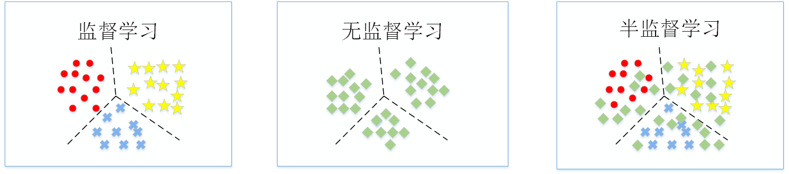
<br>
Figure 2: Classical Machine Learning Paradigms and Semi-Supervised Learning Paradigm
</div>

Semi-supervised learning is highly suitable for real-world application scenarios and the learning mode of human beings so it has a wide range of application prospects. However, compared with classical machine learning paradigms, the development of the semi-supervised learning currently has many difficulties such as more complex learning process, more difficult algorithm design and implementation, and relative lack of reference documents, which seriously limits the popularity of this field in practical applications. Therefore, designing and implementing a convenient toolkit for semi-supervised learning can promote wider implementations of semi-supervised learning algorithms in practical scenarios. It can help semi-supervised learning go from laboratory to industry.

## Purpose

The complexity of semi-supervised learning problems has created serious knowledge and skill barriers for toolkit developers, resulting in a lack of convenient semi-supervised learning toolkits. In order to meet the needs of users for semi-supervised learning technology in practical applications, a mature and easy-to-use semi-supervised learning toolkit should have the following characteristics:
1) It should have advanced design pattern considering user needs from the perspectives of both data and model to make the interfaces as simple as possible and the functions as powerful as possible;
2) The scope of application should be wide enough, such as supporting multiple common data types such as tables, images, texts and graphs and supporting multiple common task types such as classification, regression, and clustering;
4) It should be easy to use and expandable. Taking into account the needs of different user groups, it should provide convenient usage methods, default parameters and interfaces for users with low proficiency and support flexible module replacement and customization for users with high proficiency;
5) Its effectiveness should be verified through a large number of experiments and the performances of different algorithms in various scenarios should be compared;
6) There should be rich and convenient documents for users to reference.

In order to solve the above problems, we developed LAMDA-SSL, a semi-supervised learning toolkit with advanced design pattern, wide application scenarios, rich algorithms, convenient functional interfaces, excellent model effect and detailed documentation. At present, this toolkit covers 30 semi-supervised learning algorithms, including 12 algorithms based on statistical machine learning models and 18 algorithms based on deep neural network models. It includes a variety of data transformation techniques, which can be used to process 4 data types of data: table, image, text and data. It includes a variety of model evaluation methods, which can be used for classification, regression, and clustering tasks. It includes multiple modules such as data management, data transformation, model application, and model deployment, which is easy to complete end-to-end Semi-supervised learning process. It is compatible with popular machine learning toolkit sklearn and deep learning toolkit pytorch, supporting sklearn's Pipeline and parameter search functions and pytorch's GPU acceleration and distributed training functions. It provides users with convenient toolkit usage documents, detailed API documents and rich introduction documents for semi-supervised learning algorithms. It provides good default parameters for non-professional users, and provides convenient and low-coupling module replacement and customization interfaces for professional users.

LAMDA-SSL is currently a semi-supervised learning toolkit with the largest number of algorithms, the most supported data types, the most supported tasks, the most abundant functions, the most convenient interface, and the most detailed documentation. It is also the first semi-supervised learning toolkit which integrates statistical machine learning algorithms and deep learning algorithms into a same framework and is compatible with both sklearn and pytorch.

## Design Mode

Compared with other semi-supervised learning tools, LAMDA-SSL is more advanced in design mode, and has the advantages of low coupling, high flexibility, strong scalability and simple interfaces. Based on these advantages, LAMDA-SSL can help users in the industry quickly get started with semi-supervised learning technology and enjoy the performance improvement brought by semi-supervised learning in business with almost zero cost.

LAMDA-SSL is divided into two modules: data module and model module in design (as shown in Figure 3). The data module includes data management and data transformation, which can be used for four data types: table, image, text and graph. The model module includes model application and model deployment for three task types: classification, regression, and clustering.

<div align=center>

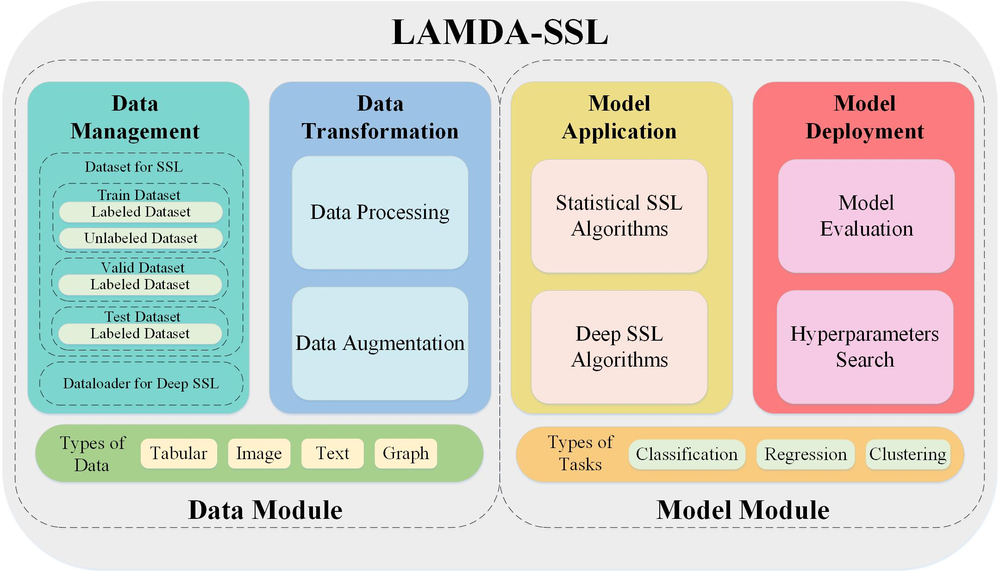

<br>

Figure 3: The structure of LAMDA-SSL

</div>


### Data Module

The design idea of the data module of LAMDA-SSL is shown in Figure 4.

<div align=center>

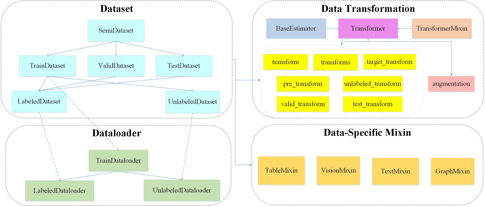

<br>
Figure 4: Data Module of LAMDA-SSL

</div>

Dataset: In LAMDA-SSL, all datasets inherit from pytorch's Dataset class. There are two methods to use a dataset, one of which is using the whole dataset directly and the other one is loading the dataset batch by batch. A whole semi-supervised dataset can be managed by a SemiDataset class. The SemiDataset class can manage three sub-datasets: TrainDataset, ValidDataset, and TestDataset at the same time. At the bottom, the datasets are divided into LabeledDataset and UnlabeledDataset. The training dataset often contains both labeled data and unlabeled data, so TrainDataset manages both LabeledDataset and UnlabeledDataset.

Data Transformation: In sklearn, data transformers inherit both BaseEstimator and TransformerMixin class. The former is the base estimator class of sklearn and the latter is the data transformer component of sklearn. Data transformers generally have two methods: fit() and transform(). The fit() method learns data processing methods based on existing data and the transform() method is used to transform new data. A large number of data transformers can omit fit() method and transform the data directly. The data transformers can also continuously complete the fit() and transform() processes by the fit_transform() interface. In sklearn, data transformers support Pipeline mechanism, which enables pipelined encapsulation and management for multiple processing steps. The data processing and data augmentation methods in LAMDA-SSL have the same mechanism with data transformers in sklearn by inheriting the Transformer class. In deep semi-supervised learning, because the amount of data is huge and data augmentation may be required according to algorithm requirements, usually not all instances are processed before model training, but are processed during the data loading process. So it is necessary to set the data processing method for the dataset class in advance and automatically process the data loaded by the data loader during the training process. In TorchVision which is an expansion toolkit of pytorch in computer vision field, there are three types of data processing: transform, target_transform and transforms, which are used to transform X, transform y, and transform both X and y at the same time respectively. In semi-supervised learning, these three methods are not universal in all cases, so LAMDA-SSL adds unlabeled_transform, valid_transform and test_transform for unlabeled samples, validation samples and test samples. In addition, the pre_transform process is added for the situation where data augmentations are required in the data transformation process. The pre_transform process and the transform process represent the processing of data before and after data augmentation respectively. For example, for CIFAR10 dataset, the original data type is numpy.ndarray. In the case when data augmentations are needed, it is necessary to convert the samples from numpy.ndarray to image before data augmentations and convert the samples from image to torch.Tensor after data augmentations. The conversion process from numpy.ndarray to image corresponds to the pre_transform process and the conversion process from image to torch.Tensor corresponds to the transform process. User-specified data augmentation methods can be flexibly added according to algorithm requirements between the pre_transform process and the transform process.

Dataloader: In deep semi-supervised learning, the amount of data is usually large so the data needs to be loaded in batches by the sampler. In each iteration, a batch of instances is sampled and indexed by the __getitem__() method. Then the indexed instances are combined into torch.Tensor. LAMDA-SSL designs LabeledDataloader and UnlabeledDataloader for LabeledDataset and UnlabeledDataset respectively and uses a TrainDataloader class to manage the training process of the two dataloaders for semi-supervised learning. In addition to including two dataloaders at the same time, TrainDataloader also plays a role in adjusting the relationship between them, such as adjusting the ratio of of the number of samples and the batch size between unlabeled instances and labeled instances.

Data-specific Mixin: LAMDA-SSL can handle four common data types in practical applications: table, image, text, and graph. It designs four components corresponding to the data types: TabularMixin, VisionMixin, TextMixin, and GraphMixin. For a dataset, you can inherit the component corresponding to its data type to obtain the default data processing function in the component. For example, CIFAR10 inherits two modules: SemiDataset and VisionMixin and thus has the default image data processing function. For custom datasets, users can set the data source of the dataset by overriding the init_dataset() method in SemiDataset and set the default data processing flow by overriding the init_default_transform() method of the Mixin module.

### Model Module

The design idea of the model module of LAMDA-SSL is shown in Figure 5.

<div align=center>

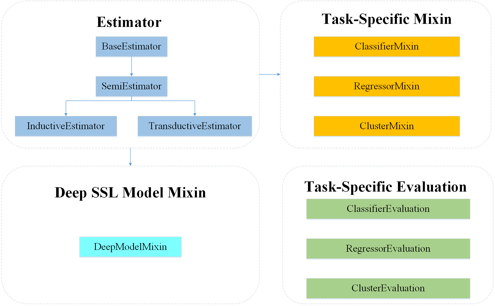

<br>
Figure 5: Model Module of LAMDA-SSL

</div>

Estimator: LAMDA-SSL refers to the implementation of sklearn and all learners use the similar interfaces to sklearn. In sklearn, learners all inherit the parent class BaseEstimator and usually have two methods: fit() and predict(). The fit() method uses existing data to train a model, which corresponds to the training process in machine learning. The predict() method uses the model after fit() to predict the labels of new samples which corresponds to the prediction process in machine learning. The learner in LAMDA-SSL indirectly inherits BaseEstimator in sklearn by inheriting SemiEstimator. Since the input of the fit() method in sklearn only includes samples and labels but in semi-supervised learning, the model needs to use labeled samples, labels and unlabeled samples at the same time during the training process. Therefore, BaseEstimator's fit() method interface is not convenient for direct use in semi-supervised learning algorithms. Although sklearn also implements two types of semi-supervised learning algorithms by combining the labeled samples and unlabeled samples and mark the labels corresponding to the unlabeled sample as -1. This processing method can adapt to the interface of BaseEstimator but it also has limitations, especially in some binary classification scenarios, -1 is often used to indicate the negative class of the labeled samples. So it is necessary to re-establish a new class SemiEstimator based on BaseEstimator for semi-supervised learning. The fit() method of SemiEstimator includes three parts of input: labeled samples, labels and unlabeled samples, which better fits the application scenario of semi-supervised learning avoiding requirements for users to combine data and conflicts between negative samples and unlabeled samples. Semi-supervised learning is generally divided into inductive learning and transductive learning. The difference is whether the data to be predicted is directly used as the unlabeled data in the training process. Inductive learning uses labeled instances and known unlabeled samples to train a learner to predict the labels of unknown unlabeled data; while transductive learning uses labeled instances and known unlabeled samples to directly predict the labels of known unlabeled samples. Usually, a transductive methods can also be extended to an inductive method by adding some new mechanisms on the basis of the original algorithm. The two classes InductiveEstimator and TransductiveEstimator used in LAMDA-SSL correspond to two semi-supervised learning paradigms respectively and both inherit the SemiEstimator class. The predict() method of InductiveEstimator needs to input new samples to be predicted. While the predict() method of TransductiveEstimator determines whether to use transductive prediction by a BOOL type parameter 'Transductive'. If it is True, no new samples need to be input and the learner output the transductive prediction result directly, otherwise the expansion mechanism will be triggered to predict for newly input samples.

```python
from sklearn.base import BaseEstimator
from abc import ABC,abstractmethod
class SemiEstimator(ABC,BaseEstimator):
    @abstractmethod
    def fit(self,X,y,unlabeled_X):
        raise NotImplementedError(
            "The fit() method of SemiEstimator must be implemented."
        )
```

Task-specific Mixin: In sklearn, in order to enable learners to have corresponding functions for different tasks, sklearn develops components corresponding to tasks for learners. The learners in sklearn often inherit BaseEstimator and corresponding components at the same time, so that in addition to the basic training and prediction functions, the learner can also have the function of completing the task corresponding to the component. The commonly used components include ClassifierMixin for classification tasks, RegressorMixin for regression tasks, and ClusterMixin for clustering tasks which are also used in LAMDA-SSL. Taking the TSVM algorithm as an example, it inherits TransductiveEstimator and ClassifierMixin and can be used for transductive semi-supervised classification tasks.

Deep SSL Model Mixin: Different from the framework of sklearn which is commonly used in statistical machine learning, the framework of pytorch is often used in deep learning and its interfaces are quite different from that of sklearn, making it difficult to integrate deep learning algorithms and statistical machine learning algorithms into the same framework. In addition, there are large dependency and hign coupling among the components of pytorch. In the data module, the Sampler module depends on the Dataset module and the Dataloader module depends on both the Sampler module and the Dataset module. In the model module , the Scheduler module depends on the Optimizer module, the Optimizer module and the Parallel module depend on the Network module. Compared with sklearn, the logic and interfaces of Pytorch are more complex, so the requirements for users themselves are higher. In order to solve the problem that statistical machine learning methods and deep learning methods are difficult to be integrated into a same framework, LAMDA-SSL uses the DeepModelMixin component to enable the deep semi-supervised learning model developed based on pytorch to have the same interface and usage as the statistical semi-supervised learning method. DeepModelMixin decouples each module of pytorch, which is convenient for users to independently replace or customize the dataloader, network, optimizer and other modules in deep learning without considering the impact of replacement on other modules. It enables users to call deep semi-supervised learning algorithms as easily as calling statistical semi-supervised learning algorithms. In addition, DeepModelMixin not only supports users to replace components in deep learning, but also deconstructs the training and prediction process of deep semi-supervised learning models into multiple modules such as data processing, forward propagation, computational loss, model optimization etc. It is convenient for users to adjust existing deep semi-supervised learning algorithms or customize new deep semi-supervised learning algorithms avoiding a lot of repetitive work. The structure of DeepModelMixin is shown in Figure 6.

<div align=center>

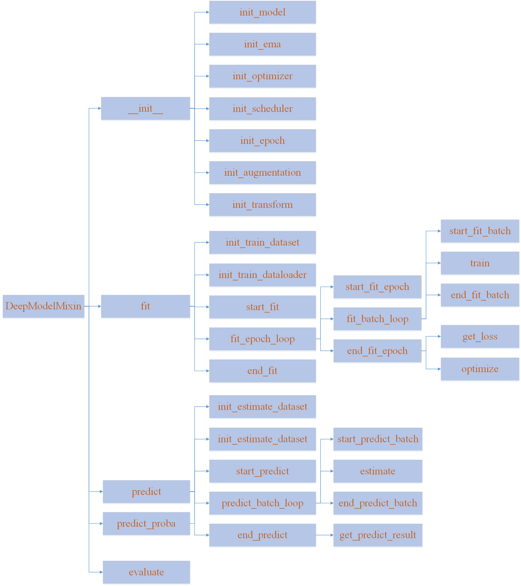 

<br>
Figure 6: The structure of DeepModolMixin
</div>

Task-specific Evaluation: LAMDA-SSL provides a variety of evaluation indicators for classification, regression, and clustering tasks for model evaluation and monitoring. The model evaluation of LAMDA-SSL has two forms. The first is to call the evaluation module after the prediction result is obtained. The second is to directly use the evaluation metrics as the attribute of the learner when the learner is initialized, so that the model can be evaluated after the prediction is completed and for deep semi-supervised learning algorithms, real-time evaluation can be performed during the model training process. The evaluation metrics for three different tasks inherit three base classes: ClassifierEvaluation, RegressorEvaluation and ClusterEvaluation.


## Application Scenarios

LAMDA-SSL has a wide range of application scenarios. It can support four types of data: tables, images, texts and graphs (as shown in Figure 7) and three types of task: classification, regression and clustering (as shown in Figure 8). LAMDA-SSL can leverage the value of semi-supervised algorithms in various real-world businesses.

### Data Types

<div align=center>
 
<br>
Figure 7: Data scenarios of LAMDA-SSL
</div>

Table is the most basic form of data. There is no spatial and temporal connection between features and samples for this type of data. A large part of statistical machine learning algorithms are designed for table data. It is widely used in applications such as stock analysis and network anomaly detection. For table data, the preprocessing module in sklearn has already provided rich enough processing methods, such as 'StandardScaler', 'MinMaxScaler', 'MaxAbsScaler' etc. LAMDA-SSL supplements it on the basis. The TabularMixin module provides the default processing method for table data, using 'StandardScaler' as the default pre-transformation method. After pre-transformation, data augmentation is performed according to requirements. If it is applied to deep learning, the data will be converted into torch.Tensor form. In order to perform data augmentation on table data, LAMDA-SSL implements the augmentation method 'Noise' which apply a noise disturbance that obeys normal distribution is to the standardized data and the disturbance amplitude is controlled by the standard deviation of the normal distribution.

Image data is one of the most commonly used data types in the field of deep learning. It is used in the learning process in the form of tensors and there are spatial relationships among its features. This data type is widely used in medical imaging, automatic driving, security recognition and other fields. For image data, TorchVision has provided processing some methods for image data, such as cropping, rotation, sharpening, etc. LAMDA-SSL supplements it on the basis. The VisionMixin module provides a default processing method for image data. During the pre-transformation process, the samples stored in other forms are converted into images. After the pre-transformation, the samples are augmented according to requirements. Finally the images are converted into the types can be processed by models. For data augmentation of image data, LAMDA-SSL provides a variety of weak augmentation methods such as 'RandomCrop' and 'RandomHorizontalFlip' and strong augmentation methods such as 'RandAugment' and 'Cutout'.

Text data is another data type with a wide range of application scenarios in the field of deep learning, which drives the rapid development of natural language processing. Texts are often converted into vectors through various embedding methods and there are temporal relationships among its features. This data type has a wide range of applications in machine translation, sentiment analysis and information retrieval. For text data, TorchText has provided some text data processing methods, such as tokenization, word embedding, etc.  LAMDA-SSL supplements it on the basis. The TextMixin module provides the default processing method for text data. Firstly, the text is tokenized in the preprocessing stage. Then the data is augmented according to the requirements. Finally, the text length is adjusted, and tokens are converted into indexes through a dictionary to constitutes the Tensor as the input of the model. For data augmentation of text data, LAMDA-SSL provides a variety of weak augmentation methods such as 'Random Swap' and 'Random Delete' and strong augmentation methods such as 'TF-IDF Replacement' whose basic idea is replacing unimportant words whose TF-IDF value is low will not have too much influence on text semantics.

Graph data has been the focus of deep learning in recent years. Unlike other data types which only have spatial and temporal relationships between features, graph data needs to consider the spatial relationships between samples, that is the structural information of the graph. This data type has important application prospects in social networks, drug discovery, recommender systems etc.
For graph data, LAMDA-SSL uses the data form in torch_geometric as the standard which encapsulates the graph structure information, node features information, node labels information in the Dataset class and divides nodes into training set, validation set and test set by masks. LAMDA-SSL further divides the training set on this basis by parameters 'labeled_mask' and 'unlabeled_mask'. The GraphMixin module takes the standardization of node features in the graph as the default data transformation method and provides transformation methods such as 'Graph Diffusion Convolution'[37], 'SVD Feature Reduction', 'GCNNorm', etc. Data augmentations for graph are performed by removing nodes or edges in the graph.

<style>
.center 
{
  width: auto;
  display: table;
  margin-left: auto;
  margin-right: auto;
}
</style>

<div align=center class="center">

Table 1: Data processing and data augmentation in LAMDA-SSL

|Types of data|Data Processing|Data Augmentation|
|:-:|:-:|:-:|
|Tabular|StandardScaler<br>MinMaxScaler<br>MaxAbsScaler|Noise|
|Vision|Resize<br>Normlization|RandomCrop<br>RandomHorizontalFlip<br>AutoContrast<br>Brightness<br>Color<br>Contrast<br>Rotate<br>Sharpness<br>Equalize<br>Solarize<br>Posterize<br>Invert<br>ShearX<br>ShearY<br>TranslateX<br>TranslateY<br>RandAugment<br>Cutout<br>CutoutAbs<br>Mixup|
|Text|Tokenizer<br>Truncate<br>PadSquence<br>AdjustLength<br>Vocab<br>Vectors<br>Glove<br>FastText<br>CharNGram|RandomDeletion<br>RandomSwap<br>TFIDFReplacement|
|Graph|GCNNorm<br> GDC<br> SVDFeatureReduction<br> NormalizeFeatures|DropNodes<br>DropEdges|
</div>

### Task Types

<div align=center>
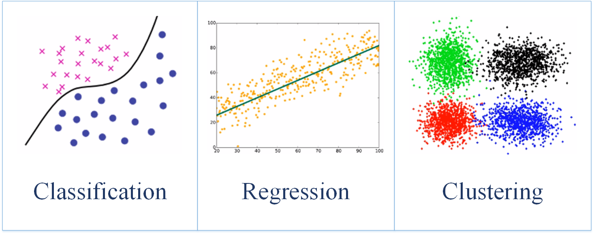 
<br>
Figure 8: Task scenarios of LAMDA-SSL
</div>

The classification task is one of the most basic tasks in the field of machine learning. The prediction result of the model is a discrete value, which is often used in scenarios such as behavior prediction, target recognition and content filtering. For classification tasks, LAMDA-SSL provides a large number of algorithms as well as various evaluation metrics such as 'Accuracy', 'Recall', 'Precision', 'F1 Score' which can utilize ground-truth labels, model-predicted hard labels and soft labels to evaluate the model's performance.

The regression task is another basic task in the field of machine learning. The prediction result of the model is a continuous value, which is often used in scenarios such as price forecasting, sales forecasting and credit scoring. At present, the related research in the field of semi-supervised regression is immature and there are few algorithms available, especially deep semi supervised learning algorithms. In addition to the semi-supervised regression algorithm CoReg, LAMDA-SSL also extends some deep semi-supervised learning algorithms for classification, making them suitable for regression tasks. LAMDA-SSL also provides a variety of evaluation metrics such as 'Mean Absolute Error', 'Mean Squared Error' and 'Mean Square Log Error'.

The clustering task is the most classical application of unsupervised learning. It cannot use real labels to establish the connection between the feature space and the target space. It is widely used in scenarios where real labels do not exist, such as anomaly detection, customers management and value combination. For clustering tasks, the algorithms in LAMDA-SSL all introduce some supervised information based on the original unsupervised clustering algorithms to guide the clustering process, so that the clustering results are more consistent with the real labels. LAMDA-SSL provides two types of clustering evaluation metrics. The first type is external metrics such as ‘Fowlkes Mallows Score’[39] and ‘Rand Score’[40], which are used when there are reliable reference results. The models' performance are evaluated by comparing the difference between the clustering results and the reference results. They are more suitable for the situation where the samples itself have labels. The second type is the internal metrics such as 'Davies Bouldin Score'[38] and 'Silhouette Score' which do not depend on the reference result and evaluate the models' performance only according to the features of the samples and the clustering results.

<div align=center class="center">

Table 2: Evaluation Metrics in LAMDA-SSL

|Type of Task|Evaluation Metric|
|:-:|:-:|
|Classification|Accuracy<br>Top k Accuracy<br>Recall<br>Precision<br>F1 Score<br>AUC<br>Confusion Matrix|
|Regression|Mean Absolute Error<br>Median Absolute Error<br>Mean Squared Error<br>Mean Squared Log Error|
|Clustring|Davies Bouldin Score<br>Fowlkes Mallows Score<br>Jaccard Score<br>Rand Score<br>Silhouette Score|

</div>

## Algorithms

LAMDA-SSL implements up to 30 semi-supervised learning algorithms, including 12 statistical machine learning algorithms and 18 deep learning algorithms, providing users with a variety of choices.

### Statistical Learning Algorithms

LAMDA-SSL contains 12 semi-supervised learning algorithms based on statistical machine learning models (as shown in Figure 9), among which the algorithms used for classification tasks include generative method SSGMM, semi-supervised support vector machine methods TSVM, LapSVM, graph-based methods Label Propagation, Label Spreading, disagreement-based methods Co-Training, Tri-Training, ensemble methods SemiBoost, Assemble; the algorithms used for regression tasks include CoReg; the algorithms used for clustering tasks include Constrained K Means, Constrained Seed K Means.

<div align=center>

 

<br>

Figure 9: Statistical Semi-Supervised Learning Algorithms in LAMDA-SSL
</div>

Generative semi-supervised learning methods are based on generative models, which assume that the data is generated from a latent distribution, while semi-supervised generative methods treat the labels of unlabeled samples as latent variables and use expectation-maximization(EM) algorithm to solve. SSGMM stands for Semi-Supervised Gaussian Mixture Model. It is assumed that the data is generated by a Gaussian mixture model, which means the marginal distribution of sample features can be expressed as the result of mixing several Gaussian distributions together and each Gaussian distribution is given a weight. For unlabeled samples, each Gaussian mixture component can be corresponding to a category and the samples can be classified into the category corresponding to the Gaussian mixture component with the highest weight.

Semi-supervised support vector machine is a generalization of the support vector machine algorithm in the field of semi-supervised learning. The semi-supervised support vector machine introduces a low-density assumption, that is the learned hyperplane should not only make the classification interval as large as possible, but also pass through the low-density area of ​​the distribution of all samples as much as possible. TSVM is the most basic semi-supervised support vector machine method, which completes the learning by continuously swaping pseudo-labels of unlabeled sample pairs which don't belong to the same class currently and may be misclassified in each iteration. LapSVM introduces manifold regularization, constructs a graph model and guides the model to predict the results of adjacent samples in the graph as consistent as possible through the Laplace regular term, so that the unlabeled samples can participate in the learning process by using the distribution of samples on the manifold.

The graph-based semi-supervised learning methods represent the dataset as a graph structure model which have both labeled nodes and unlabeled nodes. Therefore, graph-based semi-supervised learning can be regarded as the process of label propagation in the graph. Label Propagation is the most basic method. It takes the Laplace regular term as the optimization goal, and solves the labels of the unlabeled data to make the optimization goal minimum. Based on Label Propagation, Label Spreading cancels the limitation that the model's prediction results for labeled samples must be equal to their true labels during the propagation process, but penalizes erroneous results.

Disagreement-based semi-supervised learning methods depend on multiple learners with significant divergence and use the disagreement between learners to utilize unlabeled data. Such methods are less affected by model assumptions, non-convexity of loss function and data scale problems. These methods are simple and effective and have solid theoretical foundation relatively. The Co-Training algorithm uses two basic learners to generate divergence through different data views and uses the compatibility and complementarity of multiple views to promote each other's training. Tri-training uses three basic learners to generate pseudo-labels through "minority obeys majority", and ensembles the learners to produce the final prediction results.

Ensemble learning methods combine multiple weak learners to improve the reliability of the model. In the field of semi-supervised learning, due to the addition of unlabeled data, the instability of a single learner is further exacerbated, so there is a stronger reliance on effective ensemble learning methods. Assemble stands for adaptive semi-supervised ensemble. which is an extension of the adaptive boosting(AdaBoost). In each round of iterations, pseudo-labels are assigned to unlabeled samples by the current ensemble learner and the sampling weights are adjusted adaptively according to the difference between the model prediction results and the current pseudo-labels obtained by the ensemble learner. SemiBoost further considers the relationships among samples based on the graph semi-supervised learning methods. It points out that larger sampling weights should be set for the samples with high similarity but large inconsistency in the prediction results compared with other samples.

Compared with classification algorithms, semi-supervised regression algorithms are more difficult to make reasonable assumptions. Research on semi-supervised regression is more difficult than semi-supervised classification. CoReg introduces the Co-Training algorithm into the regression task. Co-Training can't complete the traning process of regression tasks since it is difficult to evaluate the confidence of the learner to each sample, CoReg takes the difference in mean square error before and after adding an unlabeled sample as the evaluation criterion for confidence of the learner to this sample.

The semi-supervised clustering algorithms introduce supervised information to assist the process of unsupervised clustering. The supervised information is not necessarily labeled data, but may also be other knowledge related to real labels. Constrained k-means introduces constraints called must-link and connot-link as supervision information based on the k-means clustering algorithm. The must-link constraints restrict that some samples must belong to the same cluster. The must-link constraints restrict that some samples must belong to different clusters. Constrained Seed k-means is different from Constrained k-means which uses must-link and connot-link constraints as supervision information, but directly uses a small amount of labels as supervision information.

### Deep Learning Algorithms

LAMDA-SSL contains 18 deep model-based semi-supervised learning algorithms (as shown in Figure 10): the algorithms used for classification tasks include the consistency regularization method Ladder Network, Π Model, Temporal Ensembling, Mean Teacher, VAT, UDA, Pseudo label-based methods Pseudo Label, S4L, hybrid methods ICT, MixMatch, ReMixMatch, FixMatch, FlexMatch, generative methods ImprovedGAN, SSVAE, deep graph based methods SDNE, GCN and GAT; the algorithms for regression tasks include consistency regularization method Π Model Reg, Mean Teacher Reg and hybrid method ICT Reg.

<div align=center>

 

<br>

Figure 10: Deep Semi-Supervised Learning Algorithms in LAMDA-SSL
</div>

Consistency methods are based on the consistency assumption which assumps that the prediction result should remain unchanged as much as possible when a certain range of disturbance is added to the samples. In these methods, a large amount of unlabeled data can be used to improve the robustness of the model. The Ladder network adopts the symmetric autoencoder structure and takes the inconsistency of each hidden layer between the decoding results after the data is encoded with noise and the encoding results without noise as the unsupervised loss. UDA stands for unsupervised data augmentation. After performing data augmentations on the unlabeled samples, the prediction results for the samples before and after the augmentation are compared, and the mean square error loss is used to calculate the consistency regular term as the unsupervised loss. Π Model performs random data augmentation twice on the same samples, and uses the results of the two augmentations as the inputs of the neural network model respectively. The inconsistency of the predicted results are used as the unsupervised loss. Temporal Ensembling has made some improvements to the Π Model, changing one of the two augmented prediction results to an exponential moving average(EMA) for historical pseudo-labels which alleviates the model's forgetting of historical information and reduces computing power consumption. Mean Teacher uses the idea of ​​knowledge distillation and the teacher model is not a complex model, but a model based on the student model using the exponential moving average parameters. Unlike other methods adds random noise to the samples, VAT adds adversarial noise, so that the worst performance of the model will not be too bad when the data is affected by noise under certain constraints.

The pseudo-labels based methods make the unlabeled samples affect the learning process by assigning pseudo-labels to the unlabeled data. Since the confidences of the model for different samples are different, methods based on pseudo-labels usually take samples with higher confidence to participate in the training process. Pseudo Label sets a confidence threshold. In each iteration, the part of samples with confidence higher than the threshold are selected to calculate the cross-entropy loss as the unsupervised loss. S4L uses self-supervised technology to construct self-supervised tasks. The target task and the self-supervised task share the same representation layer. So that the model can use unlabeled data to learn better hidden layers using self-supervised labels as pseudo-labels.

The hybrid methods are not limited to using only one type of technology, but combine consistency and pseudo-label technology together. Hybrid approaches tend to be more general because of the use of multiple techniques simultaneously. ICT stands for interpolation consistency training. The data and prediction results are linearly interpolated by Mixup and the inconsistency between the model's prediction result for the interpolated sample and the interpolation of model's prediction results for the original samples is used as an unsupervised loss. MixMatch also uses Mixup, but unlike ICT which only Interpolates unlabeled samples and their pseudo-labels, MixMatch mixes labeled data and unlabeled data together and interpolates the mixed samples and their labels or pseudo-labels. ReMixMatch is an improved version of MixMatch, which introduces two techniques: distribution alignment and augmented anchoring. The purpose of distribution alignment is to make the pseudo-labels predicted by the model for unlabeled samples have the same probability distribution as the labels of labeled samples. The purpose of augmented anchoring is to adapt the model to stronger data augmentation, so that pseudo-labels do not change with increasing augmentation strength. FixMatch performs strong data augmentation and weak data augmentation on the samples respectively and takes the inconsistency of the model's prediction results as the unsupervised loss. FlexMatch is an improvement to FixMatch. It focuses on solving the unfairness between categories in semi-supervised learning. Different confidence thresholds are used to select samples for different classes which alleviates the class imbalance caused by different learning difficulties.

Deep generative methods use real data to model a data distribution, and this distribution can be used to generate new data. Unlike classical generative methods, deep generative methods generate data based on deep neural networks. Most of them are variations of Generative Adversarial Network(GAN) and Variational AutoEncoder(VAE). The discriminator of ImprovedGAN is different from GAN because it need not only discriminate whether the sample is a real sample or a generated sample, but also calssify the real samples. SSVAE divides the encoder of VAE into two parts. The first part encodes the original samples to obtain the probability distribution of their labels, and the second part uses the original samples and pseudo-labels as input to obtain the probability distribution of latent variables.

Deep Graph-based methods are mainly used when the original data is graph data. Instances in the graph are not independent, but are connected by edges. In reality, learning tasks on graph data are often semi-supervised, that is, there are both labeled and unlabeled nodes in the graph. SDNE is a semi-supervised graph deep learning method that can learn the embedding vector of nodes in the graph when there are no features for the nodes. The adjacency vectors are used as the feature vectors input to learn the representations of the nodes by the encoder. GCN is more suitable for the situation that the nodes itself have features. It can use the features information of the nodes and the graph structure information to learn at the same time. It can aggregate the information of the adjacent nodes by graph convolution to update the node representation. GAT is also applicable to the case where the node itself has features. Unlike the graph convolution operation of GCN, GAT introduces the  attention mechanism. In each iteration, the attention weight of each node is calculated according to the representations of itself and its neighboring nodes and its representation is updated with the weight.

# Usage Tutorial

## Dataset Initialization

Taking the CIFAR10 dataset as an example, firstly import the CIFAR10 class.

```python
from LAMDA_SSL.Dataset.Vision.CIFAR10 import CIFAR10
```

Instantiate a CIFAR10 class. The parameter 'root' indicates the storage address of the dataset, the parameter 'labeled_size' indicates the number or proportion of labeled samples and the parameter 'stratified' indicates whether to divide the dataset according to the class distribution. The parameter 'shuffle' indicates whether the dataset needs to be shuffled and the parameter 'download' indicates whether the dataset needs to be downloaded.

```python
dataset=CIFAR10(root='..\LAMDA_SSL\Download\cifar-10-python',labeled_size=4000,stratified=False,shuffle=True,download=False)
```

The specific data in the dataset can be obtained by the parameters of the encapsulated dataset.

```python
labeled_X=dataset.labeled_X
labeled_y=dataset.labeled_y
unlabeled_X=dataset.unlabeled_X
unlabeled_y=dataset.unlabeled_y
test_X=dataset.test_X
test_y=dataset.test_y
```

## Data Transformation

Taking RandAugment[41] data augmentation as an example, firstly import the RandAugment class.

```python
from LAMDA_SSL.Augmentation.Vision.RandAugment import RandAugment
```

Instantiate a RandAugment class. the parameter 'n' is the number of random augmentations, the parameter 'm' is the magnitude of augmentation and the parameter 'num_bins' is the number of levels of magnitude division. This setting divides the augmentation into 10 levels, and uses the 10th level augmentation twice.

```python
augmentation=RandAugment(n=2,m=10,num_bins=10)
```

Then input data to complete data augmentation. There are two ways. you can call the fit_transform() method:

```python
augmented_X=augmentation.fit_transform(X)
```

You can also call the \_\_call\_\_() method directly:

```python
augmented_X=augmentation(X)
```

## Pipeline Mechanism

LAMDA-SSL supports the Pipeline mechanism. You can use multiple data processing methods for data processing in the form of pipelines.
Such as strong data augmentation and weak data augmentation in FixMatch algorithm.

```python
from sklearn.pipeline import Pipeline
from LAMDA_SSL.Augmentation.Vision.RandomHorizontalFlip import RandomHorizontalFlip
from LAMDA_SSL.Augmentation.Vision.RandomCrop import RandomCrop
from LAMDA_SSL.Augmentation.Vision.RandAugment import RandAugment
from LAMDA_SSL.Augmentation.Vision.Cutout import Cutout

weak_augmentation = Pipeline([('RandomHorizontalFlip', RandomHorizontalFlip()),
                                ('RandomCrop', RandomCrop(padding=0.125, padding_mode='reflect')),
                                ])

strong_augmentation = Pipeline([('RandAugment', RandAugment(n=2, m=5, num_bins=10, random=True)),
                                  ('Cutout', Cutout(v=0.5, fill=(127, 127, 127))),
                                  ('RandomHorizontalFlip', RandomHorizontalFlip()),
                                  ('RandomCrop', RandomCrop(padding=0.125, padding_mode='reflect')),
                                  ])
```

You can directly call the fit_transform() method to complete data processing.

```python
weak_augmented_X=weak_augmentation.fit_transform(X)
strong_augmented_X=strong_augmentation.fit_transform(X)
```

## Train an Inductive Statistical Semi-Supervised classification Model

Taking the SSGMM algorithm as an example, firstly import the BreastCancer data set. The parameter 'labeled_size' indicates the number(int) or ratio(float) of the labeled data set. The parameter 'stratified' and 'shuffle' respectively indicate whether the data set needs to be divided according to the class distribution and whether the data needs to be shuffled.

```python
from LAMDA_SSL.Dataset.Tabular.BreastCancer import BreastCancer
dataset=BreastCancer(test_size=0.3,labeled_size=0.1,stratified=True,shuffle=True,random_state=0)
```

Preprocess the data.

```python
pre_transform=dataset.pre_transform
pre_transform.fit(np.vstack([labeled_X, unlabeled_X]))
labeled_X=pre_transform.transform(labeled_X)
unlabeled_X=pre_transform.transform(unlabeled_X)
test_X=pre_transform.transform(test_X)
```

Call and initialize the SSGMM model.

```python
from LAMDA_SSL.Algorithm.Classification.SSGMM import SSGMM

model=SSGMM(tolerance=0.000001)
```

Call the fit() method for model training.

```python
model.fit(X=labeled_X,y=labeled_y,unlabeled_X=unlabeled_X)
```

Make predictions on test data.

```python
pred_y=model.predict(X=test_X)
```

The model performance can be evaluated by calling the accuracy evaluation metric from the evaluation module.

```python
from LAMDA_SSL.Evaluation.Classifier.Accuracy import Accuracy
performance=Accuracy().scoring(test_y,result)
```

The probability that samples belong to different classes can also be obtained by the 'predict_proba' method.

```python
score_y=model.predict_proba(X=test_X)
```

The model performance can be evaluated by calling the accuracy evaluation metric from the evaluation module.

```python
from LAMDA_SSL.Evaluation.Classifier.AUC import AUC
performance=AUC(multi_class='ovo').scoring(test_y,pred_y,score_y)
```

## Train a Transductive Statistical Semi-Supervised Classification Model

Taking the TSVM algorithm as an example, firstly import the BreastCancer data set. The parameter 'labeled_size' indicates the number(int) or ratio(float) of the labeled data set. The parameter 'stratified' and 'shuffle' respectively indicate whether the data set needs to be divided according to the class distribution and whether the data needs to be shuffled.

```python
from LAMDA_SSL.Dataset.Tabular.BreastCancer import BreastCancer
dataset=BreastCancer(labeled_size=0.1, stratified=True,
shuffle=True)
labeled_X=dataset.labeled_X
labeled_y=dataset.labeled_y
unlabeled_X=dataset.unlabeled_X
unlabeled_y=dataset.unlabeled_y
```

The samples are preprocessed by sklearn's StandardScaler module.

```python
from sklearn import preprocessing
pre_transform=preprocessing.StandardScaler()
pre_transform.fit(np.vstack([labeled_X, unlabeled_X]))
labeled_X=pre_transform.transform(labeled_X)
unlabeled_X=pre_transform.transform(unlabeled_X)
```

Then import and initialize TSVM algorithm, where the parameter 'Cl' represents the weight of the labeled samples and the parameter 'Cu' represents the weight of the unlabeled samples in the initial state. The parameter 'kernel' represents the kernel function used in the algorithm.

```python
from LAMDA_SSL.Algorithm.Classification.TSVM import TSVM
model=TSVM(Cl=15,Cu=0.0001,kernel='linear')
```

Model training can be done through the fit() method.

```python
model.fit(X=labeled_X,y=labeled_y,unlabeled_X=unlabeled_X)
```

The prediction result is obtained by the predict() method. Since TSVM is a transductive model, the predict() method can not input new data.

```python
pred_y=model.predict()
```

Finally, the accuracy evaluation index can be called from the evaluation module to evaluate the model performance.

```python
from LAMDA_SSL.Evaluation.Classifier.Accuracy import Accuracy
score=Accuracy().scoring(unlabeled_y,pred_y)
```

You can also choose to extend an transductive method to an inductive method, you need to set the parameter 'Transductive' to False.

```python
test_X=dataset.test_X
pred_y=model.predict(X=test_X, Transductive=False)
from LAMDA_SSL.Evaluation.Classifier.Accuracy import Accuracy
score=Accuracy().scoring(test_y,pred_y)
```

## Train a Multi-View Statistical Semi-Supervised Classification Model

Taking the Co-Training algorithm as an example, firstly import the BreastCancer data set. The parameter 'labeled_size' indicates the number(int) or ratio(float) of the labeled data set. The parameter 'stratified' and 'shuffle' respectively indicate whether the data set needs to be divided according to the class distribution and whether the data needs to be shuffled.

```python
from LAMDA_SSL.Dataset.Tabular.BreastCancer import BreastCancer
dataset=BreastCancer(labeled_size=0.1, stratified=True,
shuffle=True)
labeled_X=dataset.labeled_X
labeled_y=dataset.labeled_y
unlabeled_X=dataset.unlabeled_X
unlabeled_y=dataset.unlabeled_y
```

The samples are preprocessed by sklearn's StandardScaler module.

```python
from sklearn import preprocessing
pre_transform=preprocessing.StandardScaler()
pre_transform.fit(np.vstack([labeled_X, unlabeled_X]))
labeled_X=pre_transform.transform(labeled_X)
unlabeled_X=pre_transform.transform(unlabeled_X)
```

View partitioning of data is required.

```python
from LAMDA_SSL.Split.ViewSplit import ViewSplit

split_labeled_X = ViewSplit(labeled_X, shuffle=False)
split_unlabeled_X = ViewSplit(unlabeled_X, shuffle=False)
split_test_X = ViewSplit(test_X, shuffle=False)
```

Then import and initialize Co-Training algorithm.

```python
from sklearn.svm import SVC
from LAMDA_SSL.Algorithm.Classification.Co_Training import Co_Training
SVM=SVC(C=1.0,kernel='linear',probability=True,gamma='auto')
model=Co_Training(base_estimator=SVM,s=(len(labeled_X)+len(unlabeled_X))//10)
```

Model training can be completed through the fit() method, and data from different views can be passed in separately.

```python
model.fit(X=labeled_X,y=labeled_y,unlabeled_X=unlabeled_X)
```

It is also possible to pass data under different views through a parameter in the form of a dictionary or a list.

```python
model.fit(X=labeled_X,y=labeled_y,unlabeled_X=unlabeled_X)
```

The prediction result is obtained by the predict() method.

```python
pred_y=model.predict(X=test_X)
```

Finally, the accuracy evaluation index can be called from the evaluation module to evaluate the model performance.

```python
from LAMDA_SSL.Evaluation.Classifier.Accuracy import Accuracy
score=Accuracy().scoring(test_y,pred_y)
```

## Train a Statistical Semi-Supervised Regression Model

Taking the CoReg algorithm as an example, firstly import the Boston data set. The parameter 'labeled_size' indicates the number(int) or ratio(float) of the labeled data set. The parameter 'stratified' and 'shuffle' respectively indicate whether the data set needs to be divided according to the class distribution and whether the data needs to be shuffled.

```python
from LAMDA_SSL.Dataset.Tabular.Boston import Boston
dataset=Boston(labeled_size=0.3,test_size=0.1,stratified=False,shuffle=True,random_state=0,default_transforms=True)
labeled_X=dataset.labeled_X
labeled_y=dataset.labeled_y
unlabeled_X=dataset.unlabeled_X
unlabeled_y=dataset.unlabeled_y
test_X=dataset.test_X
test_y=dataset.test_y
```

The samples are preprocessed by sklearn's StandardScaler module.

```python
from sklearn import preprocessing
pre_transform=preprocessing.StandardScaler()
pre_transform.fit(np.vstack([labeled_X, unlabeled_X]))
labeled_X=pre_transform.transform(labeled_X)
unlabeled_X=pre_transform.transform(unlabeled_X)
```

Then import and initialize the CoReg algorithm.

```python
from LAMDA_SSL.Algorithm.Regression.CoReg import CoReg
model=CoReg()
```

Model training can be done through the fit() method.

```python
model.fit(X=labeled_X,y=labeled_y,unlabeled_X=unlabeled_X)
```

The prediction results can be obtained by the predict() method.

```python
pred_y=model.predict(X=test_X)
```

Finally, the mean square error evaluation metric can be called from the evaluation module to evaluate the model performance.

```python
from LAMDA_SSL.Evaluation.Regressor.Mean_Squared_Error import Mean_Squared_Error

performance = Mean_Squared_Error().scoring(test_y, pred_y)
```

## Train a Statistical Semi-Supervised Clustering Model

Take Constrained Seed k Means and Constrained k Means algorithms as examples. Firstly import the Wine dataset.

```python
from LAMDA_SSL.Dataset.Tabular.Wine import Wine
dataset = Wine(labeled_size=0.2, stratified=True, shuffle=True,random_state=0,default_transforms=True)
labeled_X=dataset.labeled_X
labeled_y=dataset.labeled_y
unlabeled_X=dataset.unlabeled_X
unlabeled_y=dataset.unlabeled_y
```

The samples are preprocessed by sklearn's StandardScaler module.

```python
from sklearn import preprocessing
pre_transform=preprocessing.StandardScaler()
pre_transform.fit(np.vstack([labeled_X, unlabeled_X]))
labeled_X=pre_transform.transform(labeled_X)
unlabeled_X=pre_transform.transform(unlabeled_X)
```

Then import and initialize the Constrained Seed k Means algorithm.

```python
from LAMDA_SSL.Algorithm.Clustering.Constrained_Seed_k_means import Constrained_Seed_k_means

model = Constrained_Seed_k_means(k=3)
```

Perform model training.

```python
model.fit(X=labeled_X,y=labeled_y,unlabeled_X=unlabeled_X)
```

It is also possible to import and initialize Constrained k means algorithm.

```python
from LAMDA_SSL.Algorithm.Clustering.Constrained_k_means import Constrained_k_means

model = Constrained_k_means(k=3)
```

But for Constrained k Means algorithm, the supervision information is the must-link and cannot-link constraints. If there are constraints provided by users, the training can be performed directly.

```python
model.fit(X=X,ml=ml,cl=cl)
```

If there is no constraint information provided by users and only part of the labels are available, the labels can be used to construct the constraints for training.

```python
ml=[]
cl=[]
for i in range(labeled_X.shape[0]):
    for j in range(i+1,labeled_X.shape[0]):
        if labeled_y[i]==labeled_y[j]:
            ml.append({i,j})
        else:
            cl.append({i,j})
model.fit(X=np.vstack((labeled_X,unlabeled_X)), ml=ml,cl=cl)
```

Or directly input data in the form of a standard interface, and the labeled data will be automatically converted into constraints inside the model.

```python
model.fit(X=labeled_X,y=labeled_y,unlabeled_X=unlabeled_X)
```

The clustering results can be obtained by the predict() method.

```python
pred_y=model.predict()
```

The results of clustering can be evaluated using external metrics or internal metrics. The external metrics such as Fowlkes Mallows Score require reference clustering results(true labels). The internal metrics such as Davies Bouldin Score require features of samples.

```python
from LAMDA_SSL.Evaluation.Cluster.Fowlkes_Mallows_Score import Fowlkes_Mallows_Score
from LAMDA_SSL.Evaluation.Cluster.Davies_Bouldin_Score import Davies_Bouldin_Score

outer_performence=Fowlkes_Mallows_Score()(y_true=np.hstack([labeled_y, unlabeled_y]),clusters=pred_y)

inner_performence=Davies_Bouldin_Score()(clusters=pred_y,X=np.vstack((labeled_X,unlabeled_X)))
```

## Train a Deep Semi-Supervised Model with Default Configuration

Take the FixMatch algorithm as an example. Firstly import and initialize the CIFAR10 dataset.

```python
from LAMDA_SSL.Dataset.Vision.CIFAR10 import CIFAR10

dataset = CIFAR10(root='..\Download\cifar-10-python',
                  labeled_size=4000, stratified=False, shuffle=True, download=True)
```

Obtain the specific data in the dataset by accessing the parameters of the encapsulated dataset.

```
labeled_X=dataset.labeled_X
labeled_y=dataset.labeled_y
unlabeled_X=dataset.unlabeled_X
test_X=dataset.test_X
test_y=dataset.test_y
```

Then import and initialize the algorithm. The parameter 'threshold' represents the confidence threshold for selecting unlabeled samples to participate in the unsupervised loss calculation. The parameter 'lamda_u' represents the weight of the unsupervised loss. The parameter 'mu' represents the ratio of unlabeled samples to labeled samples in each batch. The parameter 'T' represents the sharpening temperature for soft labels. The parameter 'device' represents the device for training the model. The parameters 'epoch', 'num_it_epoch', and 'num_it_total' represent the number of model training epochs, the number of iterations in each epoch, and the total number of iterations in all epochs, respectively. You only need to set two of the three to automatically complete the other. Other parameters and modules are set by default.

```python
from LAMDA_SSL.Algorithm.Classification.FixMatch import FixMatch
model=FixMatch(threshold=0.95,lambda_u=1.0,mu=7,T=0.5,epoch=1,num_it_epoch=2**20,num_it_total=2**20，device='cuda:0')
```

Model training can be done through the fit() method.

```python
model.fit(X=labeled_X,y=labeled_y,unlabeled_X=unlabeled_X)
```

The prediction for the test samples can be completed by the predict() method.

```python
pred_y=model.predict(X=test_X)
```

Finally, the accuracy evaluation index can be called from the evaluation module to evaluate the model performance.

```python
from LAMDA_SSL.Evaluation.Classifier.Accuracy import Accuracy
score=Accuracy().scoring(test_y,pred_y)
```

## Train a Custom-Configured Deep Semi-Supervised Model

For components in pytorch, such as Dataset, Sampler, BatchSampler, Dataloader, Network, Optimizer, Scheduler and Parallel, LAMDA-SSL supports users to flexibly replace or customize these components according to needs.

Take the FixMatch algorithm as an example.
First import and initialize the CIFAR10 dataset.

```python
from LAMDA_SSL.Dataset.Vision.CIFAR10 import CIFAR10

dataset = CIFAR10(root='..\Download\cifar-10-python',
                  labeled_size=4000, stratified=False, shuffle=True, download=True)
```

Obtain the specific data in the dataset by accessing the parameters of the encapsulated dataset.

```python
labeled_X=dataset.labeled_X
labeled_y=dataset.labeled_y
unlabeled_X=dataset.unlabeled_X
test_X=dataset.test_X
test_y=dataset.test_y
```

In pytorch, all specific data needs to be encapsulated in a Dataset to build a Dataloader. The Dataset module of pytorch should contain specific data, data transformation methods and index functions, but the specific data is unknown when the model is initialized until the fit() method is called. Therefore, in LAMDA-SSL, when the algorithm is initialized, Dataset as a deep learning component, is only a container that does not contain specific data. After the data is input by the fit() method, DeepModelMixin module will automatically construct the complete Dataset. Therefore, users can flexibly replace the Dataset module when the algorithm is initialized without being affected by the specific data.

```python
from LAMDA_SSL.Dataset.LabeledDataset import LabeledDataset
from LAMDA_SSL.Dataset.UnlabeledDataset import UnlabeledDataset
from LAMDA_SSL.Transform.Vision.Normalization import Normalization
from LAMDA_SSL.Transform.ToTensor import ToTensor
from LAMDA_SSL.Transform.ToImage import ToImage

pre_transform = ToImage()
transform = Pipeline([('ToTensor', ToTensor(dtype='float',image=True)),
                      ('Normalization', Normalization(mean=dataset.mean, std=dataset.std))])
labeled_dataset = LabeledDataset(pre_transform=pre_transform, transform=transform)
unlabeled_dataset = UnLabeledDataset(pre_transform=pre_transform, transform=transform)
valid_dataset = UnlabeledDataset(pre_transform=pre_transform, transform=transform)
test_dataset = UnlabeledDataset(pre_transform=pre_transform, transform=transform)
```

LAMDA-SSL also supports users to select data sampling methods according to their needs. For example, you can randomly sample the labeled data and unlabeled data during training and sequentially sample the validation and testing data. The parameter 'replacement' represents whether to repeat the sampling. The parameter 'num_samples' represents the total number of samples. The number of samples of unlabeled data can be unspecified. After the ratio of unlabeled samples to labeled samples is determined when the algorithm is initialized, DeepModelMixin module will complete the processing.

```python
from LAMDA_SSL.Sampler.RandomSampler import RandomSampler
from LAMDA_SSL.Sampler.SequentialSampler import SequentialSampler
labeled_sampler=RandomSampler(replacement=True,num_samples=64*(2**20))
unlabeled_sampler=RandomSampler(replacement=True)
valid_sampler=SequentialSampler()
test_sampler=SequentialSampler()
```

For users who are accustomed to using BatchSampler, LAMDA-SSL also supports.

```python
labeled_sampler=RandomSampler(replacement=True,num_samples=64*(2**20))
labeled_batchsampler=BatchSampler(batch_size=64,drop_last=True)
```

Dataloader can also be replaced according to user needs and is not affected by datasets and samplers. The parameter 'batch_size' represents the size of each batch of data. The parameter 'num_workers' represents the number of sub-processes that load data. The parameter 'drop_last' represents whether to discard data less than one batch. The parameter 'batch_size' of unlabeled dataloader can also be temporarily unspecified.

```python
from LAMDA_SSL.Dataloader.LabeledDataloader import LabeledDataLoader
from LAMDA_SSL.Dataloader.UnlabeledDataloader import UnlabeledDataLoader
labeled_dataloader=LabeledDataLoader(batch_size=64,num_workers=0,drop_last=True)
unlabeled_dataloader=UnlabeledDataLoader(num_workers=0,drop_last=True)
valid_dataloader=UnlabeledDataLoader(batch_size=64,num_workers=0,drop_last=False)
test_dataloader=UnlabeledDataLoader(batch_size=64,num_workers=0,drop_last=False)
```

LAMDA-SSL supports users to replace or customize the neural network structure according to their own needs. The neural network is built by pytorch and inherits torch.nn.Module. Here, a WideResNet network with a depth of 28 and a width factor of 2 is used as the backbone network of the FixMatch classifier.

```python
from LAMDA_SSL.Network.WideResNet import WideResNet
network=WideResNet(num_classes=10,depth=28,widen_factor=2,drop_rate=0)
```

LAMDA-SSL supports users to use different optimizers to complete the training of deep semi-supervised models, and unlike pytorch, it is not necessary to input the model parameters to be optimized when the optimizer is initialized, only the basic information of the optimizer can be determined to avoid The coupling between the optimizer and the network structure.

```python
from LAMDA_SSL.Opitimizer.SGD import SGD
optimizer=SGD(lr=0.03,momentum=0.9,nesterov=True)
```

The scheduler can also be replaced arbitrarily without relying on the optimizer and network structure. Subsequent processing is done internally by DeepModelMixin.

```python
from LAMDA_SSL.Scheduler.CosineAnnealingLR import CosineAnnealingLR

scheduler = CosineAnnealingLR(eta_min=0, T_max=2 ** 20)
```

For algorithms with data augmentations, users can freely change the data augmentation process to adapt to different task scenarios and data types. Like data transformation, LAMDA-SSL's augmentation module supports both sklearn's Pipeline mechanism and pytorch's Compose mechanism. For cases that require multiple augmentation methods, such as weak augmentation and strong augmentation in FixMatch, you only need to use lists, tuples or dictionaries in python to pass parameters and the algorithm will complete the processing internally.

```python
from LAMDA_SSL.Augmentation.Vision.RandomHorizontalFlip import RandomHorizontalFlip
from LAMDA_SSL.Augmentation.Vision.RandomCrop import RandomCrop
from LAMDA_SSL.Augmentation.Vision.RandAugment import RandAugment
from LAMDA_SSL.Augmentation.Vision.Cutout import Cutout

weak_augmentation = Pipeline([('RandomHorizontalFlip', RandomHorizontalFlip()),
                                ('RandomCrop', RandomCrop(padding=0.125, padding_mode='reflect'))])
strong_augmentation = Pipeline([('RandomHorizontalFlip', RandomHorizontalFlip()),
                                  ('RandomCrop', RandomCrop(padding=0.125, padding_mode='reflect')),
                                  ('RandAugment', RandAugment(n=2, m=5, num_bins=10, random=True)),
                                  ('Cutout', Cutout(v=0.5, fill=(127, 127, 127)))])
augmentation = {
    'weak_augmentation': weak_augmentation,
    'strong_augmentation': strong_augmentation
}
```

Through the above components configuration, users can flexibly replace components and parameters and combine them into the FixMatch algorithm, so that the same algorithm can be used in a wider range of application scenarios.

```python
from LAMDA_SSL.Algorithm.Classification.FixMatch import FixMatch
model=FixMatch(labeled_dataset=labeled_dataset,unlabeled_dataset=unlabeled_dataset,valid_dataset=valid_dataset,test_dataset=test_dataset,labeled_sampler=labeled_sampler,unlabeled_sampler=unlabeled_sampler,valid_sampler=valid_sampler,test_sampler=test_sampler,labeled_dataloader=labeled_dataloader,unlabeled_dataloader=unlabeled_dataloader,valid_dataloader=valid_dataloader,test_dataloader=test_dataloader,augmentation=augmentation,network=network,optimizer=optimizer,scheduler=scheduler,epoch=1,num_it_epoch=2**20,num_it_total=2**20,device='cuda:0',mu=7,T=0.5,weight_decay=5e-4,threshold=0.95,lambda_u=1.0,ema_decay=0.999)
```

In order to simplify the parameters, the four training data modules: TrainDataset, TrainBatchSampler, TrainSampler and TrainDataloader can also be used to replace the labeled data module and the unlabeled data module. Training data modules include a labeled data module and an unlabeled data module and both are managed and scheduled. Even if the parameters of the labeled data module and the unlabeled data module are passed separately, they will be automatically merged into the training data module by DeepModelMixin. This is because the training data module additionally has the function of adjusting the ratio of the number of samples and batch size between labeled data and unlabeled data. In most scenarios of semi-supervised learning, when the labeled data module and the unlabeled data module are the same except for the sampling number and batch size, only one module needs to be initialized and the number of samples and the size of each batch are the same as the labeled data module.

```python
train_dataset=TrainDataset(transform=dataset.transform,unlabeled_transform=dataset.unlabeled_transform)
train_batchsampler=BatchSampler(batch_size=64,drop_last=True)
train_sampler=RandomSampler(replacement=True,num_samples=64*(2**20))
train_dataloader=TrainDataLoader(num_workers=0)
```

For the case where there are other inconsistencies between the labeled data module and the unlabeled data module except the number of samples and batch size, parameters can be passed through lists, tuples, or dicts.

```python
train_dataset=TrainDataset(transform=dataset.transform,unlabeled_transform=dataset.unlabeled_transform)
train_batchsampler=BatchSampler(batch_size=100,drop_last=True)
train_sampler={
    "Labeled":RandomSampler(replacement=True,num_samples=540*100),
    "Unlabeled":RandomSampler(replacement=False)
}
train_dataloader=TrainDataLoader(num_workers=0)
```

The model can be configured through the training data module replacing the original method of configuring through the labeled data module and unlabeled data.

```python
from LAMDA_SSL.Algorithm.Classification.FixMatch import FixMatch
model=FixMatch(train_dataset=train_dataset,valid_dataset=valid_dataset,test_dataset=test_dataset,train_sampler=train_sampler,valid_sampler=valid_sampler,test_sampler=test_sampler,train_dataloader=train_dataloader,valid_dataloader=valid_dataloader,test_dataloader=test_dataloader,augmentation=augmentation,network=network,optimizer=optimizer,scheduler=scheduler,epoch=1,num_it_epoch=2**20,num_it_total=2**20,device='cuda:0',mu=7,T=0.5,weight_decay=5e-4,threshold=0.95,lambda_u=1.0,ema_decay=0.999)
```

Model training can be done through the fit() method.

```python
model.fit(X=labeled_X,y=labeled_y,unlabeled_X=unlabeled_X)
```

The fit() method supports direct input of complete labeled datasets and unlabeled datasets for training.

```python
model.fit(X=dataset.labeled_dataset,unlabeled_X=dataset.unlabeled_dataset)
```

The fit() method also supports passing in the entire training dataset directly.

```python
model.fit(X=dataset.train_dataset)
```

The prediction for the test samples can be completed by the predict() method.

```python
pred_y=model.predict(X=test_X)
```

The predict() method supports directly passing in the dataset to be predicted.

```python
pred_y=model.predict(X=dataset.test_dataset)
```

Finally, the accuracy evaluation metric can be called from the evaluation module to evaluate the model performance.

```python
from LAMDA_SSL.Evaluation.Classifier.Accuracy import Accuracy
score=Accuracy().scoring(test_y,pred_y)
```

## Train a Deep Semi-Supervised Text Classification Model

Taking FixMatch algorithm as an example, firstly import and initialize the SST2 dataset.

```python
from LAMDA_SSL.Dataset.Text.SST2 import SST2
dataset=SST2(root='..\Download\SST2',stratified=True,shuffle=True,download=False,length=50,default_transforms=True)
```

Obtain the specific data in the dataset by accessing the parameters of the encapsulated dataset.

```python
labeled_X=dataset.labeled_X
labeled_y=dataset.labeled_y
unlabeled_X=dataset.unlabeled_X
test_X=dataset.test_X
test_y=dataset.test_y
```

Initialize the data processing flow and the dataset class. Here, Tokenizer is used for word segmentation in the preprocessing flow of text data. After the text is augmented, the length of the text is adjusted firstly. Then the Glove word vectors is used to map words into indexs according to the dictionary. Finally the index are converted to torch.Tensor.

```python
from LAMDA_SSL.Transform.Text.Vocab import Vocab
from LAMDA_SSL.Transform.Text.Tokenizer import Tokenizer
from LAMDA_SSL.Transform.Text.AdjustLength import AdjustLength
from LAMDA_SSL.Transform.ToTensor import ToTensor
from LAMDA_SSL.Transform.Text.GloVe import Glove
from sklearn.pipeline import Pipeline
from LAMDA_SSL.Dataset.LabeledDataset import LabeledDataset
from LAMDA_SSL.Dataset.UnlabeledDataset import UnlabeledDataset

pre_transform = Tokenizer('basic_english')
vectors = Glove()
transform = Pipeline([('Adjust_length', AdjustLength(length=dataset.length)),
                      ('Vocab', Vocab(vectors.vec)),
                      ('ToTensor', ToTensor())])
labeled_dataset = LabeledDataset(pre_transform=pre_transform, transform=transform)

unlabeled_dataset = UnlabeledDataset(pre_transform=pre_transform, transform=transform)

valid_dataset = UnlabeledDataset(pre_transform=pre_transform, transform=transform)

test_dataset = UnlabeledDataset(pre_transform=pre_transform, transform=transform)
```

Specific weak data augmentation and strong data augmentation for text data. Weak data augmentation randomly swaps adjacent words in the text and the parameter 'n' represents the number of exchanges. Strong data augmentation replaces words in the text. The words with lower TF-IDF values have a higher probability of being replaced.

```python
from LAMDA_SSL.Augmentation.Text.RandomSwap import RandomSwap
from LAMDA_SSL.Augmentation.Text.TFIDFReplacement import TFIDFReplacement
weak_augmentation=RandomSwap(n=1)

strong_augmentation=TFIDFReplacement(text=labeled_X,p=0.7)

augmentation={
    'weak_augmentation':weak_augmentation,
    'strong_augmentation':strong_augmentation
}
```

Use the TextRCNN model as the backbone network.

```python
from LAMDA_SSL.Network.TextRCNN import TextRCNN
network=TextRCNN(n_vocab=vectors.vec.vectors.shape[0],embedding_dim=vectors.vec.vectors.shape[1],
                 pretrained_embeddings=vectors.vec.vectors,len_seq=50,
                 num_classes=2)
```

Import and initialize FixMatch algorithm.

```python
from LAMDA_SSL.Algorithm.Classification.FixMatch import FixMatch
model=FixMatch(labeled_dataset=labeled_dataset,unlabeled_dataset=unlabeled_dataset,valid_dataset=valid_dataset,test_dataset=test_dataset,augmentation=augmentation,network=network,mu=7,T=0.5,weight_decay=5e-4,threshold=0.95,lambda_u=1.0,epoch=1,num_it_epoch=2**20,device='cuda:0')
```

Model training can be done through the fit() method.

```python
model.fit(X=labeled_X,y=labeled_y,unlabeled_X=unlabeled_X)
```

The prediction of the test samples can be completed by the predict() method.

```python
pred_y=model.predict(X=test_X)
```

Finally, the accuracy evaluation metric can be called from the evaluation module to evaluate the model performance.

```python
from LAMDA_SSL.Evaluation.Classifier.Accuracy import Accuracy
score=Accuracy().scoring(test_y,pred_y)
```

## Train a Deep Semi-Supervised Regression Model

Take PiModelReg algorithm as an example. Firstly import the Boston dataset.

```python
from LAMDA_SSL.Dataset.Tabular.Boston import Boston
dataset=Boston(test_size=0.3,labeled_size=0.1,stratified=False,shuffle=True,random_state=0,default_transforms=True)
```

Obtain the specific data in the dataset by accessing the parameters of the encapsulated dataset.

```python
labeled_X=dataset.labeled_X
labeled_y=dataset.labeled_y
unlabeled_X=dataset.unlabeled_X
test_X=dataset.test_X
test_y=dataset.test_y
```

Preprocess the Data with StandardScaler.

```python
from sklearn import preprocessing
pre_transform=preprocessing.StandardScaler()
pre_transform.fit(np.vstack([labeled_X, unlabeled_X]))
labeled_X=pre_transform.transform(labeled_X)
unlabeled_X=pre_transform.transform(unlabeled_X)
test_X=pre_transform.transform(test_X)
```

Initialize the data processing flow and initialize the dataset module.

```python
from LAMDA_SSL.Dataset.LabeledDataset import LabeledDataset
from LAMDA_SSL.Dataset.UnlabeledDataset import UnlabeledDataset
from LAMDA_SSL.Transform.ToTensor import ToTensor
transform=ToTensor()
labeled_dataset=LabeledDataset(transform=transform)

unlabeled_dataset=UnlabeledDataset(transform=transform)

valid_dataset=UnlabeledDataset(transform=transform)

test_dataset=UnlabeledDataset(transform=transform)
```

Gaussian noise is used as the data augmentation method.

```python
from LAMDA_SSL.Augmentation.Tabular.Noise import Noise

augmentation = Noise(noise_level=0.01)
```

The multilayer perceptron is used as the backbone neural network.

```python
network=MLP_Reg(hidden_dim=[100,50,10],activations=[nn.ReLU(),nn.ReLU(),nn.ReLU()],dim_in=labeled_X.shape[-1])
```

Import and initialize the PiModelReg algorithm.

```python
model=PiModelReg(labeled_dataset=labeled_dataset,
                unlabeled_dataset=unlabeled_dataset,
                valid_dataset=valid_dataset,
                test_dataset=test_dataset,
                augmentation=augmentation,
                network=network,lambda_u=0.1,
                warmup=0.4,mu=1,weight_decay=5e-4,
                epoch=1,num_it_epoch=4000,device='cuda:0')
```

Model training can be done through the fit() method.

```python
model.fit(X=labeled_X,y=labeled_y,unlabeled_X=unlabeled_X)
```

The prediction of the test samples can be completed by the predict() method.

```python
pred_y=model.predict(X=test_X)
```

Finally, the mean square error metric can be called from the evaluation module to evaluate the model performance.

```python
from LAMDA_SSL.Evaluation.Regressor.Mean_Squared_Error import Mean_Squared_Error 
score=Mean_Squared_Error().scoring(test_y,pred_y)
```

## Train a Deep Generative Model

Taking the ImprovedGAN algorithm as an example, firstly import the MNIST dataset.

```python
from LAMDA_SSL.Dataset.Vision.Mnist import Mnist
dataset=Mnist(root='..\Download\mnist',labeled_size=6000,shuffle=True,download=False,random_state=0,default_transforms=True)
```

Get specific data by accessing the dataset properties.

```python
labeled_X=dataset.labeled_X
labeled_y=dataset.labeled_y
unlabeled_X=dataset.unlabeled_X
test_X=dataset.test_X
test_y=dataset.test_y
valid_X=dataset.valid_X
valid_y=dataset.valid_y
```

Import and initialize ImprovedGAN algorithm.

```python
from LAMDA_SSL.Algorithm.Classification.ImprovedGAN import ImprovedGAN
ImprovedGAN=ImprovedGAN(lambda_u=1,dim_z=100,dim_in=(28,28),mu=1,epoch=100,num_it_epoch=540,num_it_total=540*100,device='cuda:0')
```

Train the model.

```python
model.fit(X=labeled_X,y=labeled_y,unlabeled_X=unlabeled_X)
```

Make predictions on test data.

```python
pred_y=model.predict(X=test_X)
```

Finally, the accuracy evaluation metric can be called from the evaluation module to evaluate the model performance.

```python
from LAMDA_SSL.Evaluation.Classifier.Accuracy import Accuracy
score=Accuracy().scoring(test_y,pred_y)
```

Compared with other deep semi-supervised learning methods, deep generative methods can generate data by calling the generate() method.

```python
fake_X=model.generate(100)
```

## Train a Deep Graph-based Model

The graph data in LAMDA-SSL is encapsulated using the torch_geometric.data.data class of torch_geometric. This class contains information such as node features, node labels, and edges between nodes in the graph. Whether the nodes in the graph data are labeled, used for training, validation or testing are divided in the form of masks. Taking the GCN algorithm as an example, firstly import and initialize the Cora dataset.

```python
from LAMDA_SSL.Dataset.Graph.Cora import Cora
dataset=Cora(labeled_size=0.2,root='..\Download\Cora',random_state=0,default_transforms=True)
```

Get the graph data and preprocess it.

```python
from LAMDA_SSL.Transform.Graph.NormalizeFeatures import NormalizeFeatures

transform = NormalizeFeatures
data = dataset.transform.fit_transform(dataset.data)
```

Set the optimizer.

```python
from LAMDA_SSL.Opitimizer.Adam import Adam
optimizer=Adam(lr=0.01)
```

Import and initialize the GCN model.

```python
from LAMDA_SSL.Algorithm.Classification.GCN import GCN
model=GCN(num_features=1433,
          normalize=True,
          epoch=2000,
          weight_decay=5e-4,
          optimizer=optimizer)
```

Users can directly input the encapsulated graph data to train the model.

```python
model.fit(X=data)
```

The fit() method also supports separate parameters for various types of information in the graph and the algorithm will automatically complete the encapsulation of the graph data.

```python
model.fit(X=data.X,y=data.y,edge_index=data.edge_index,
          labeled_mask=data.labeled_mask,
          unlabeled_mask=data.unlabeled_mask,val_mask=data.val_mask,
          test_mask=data.test_mask)
```

The prediction is done by the predict() method. For the graph data with the test_mask attribute after encapsulation, it is no longer necessary to pass new parameters.

```python
pred_y=model.predict()
```

For graph data that does not have the test_mask attribute after encapsulation the nodes to be predicted need to be re-specified, the mask of the test nodes should be input.

```python
pred_y=model.predict(X=test_mask)
```

Finally, the accuracy evaluation metric can be called from the evaluation module to evaluate the model performance.

```python
from LAMDA_SSL.Evaluation.Classifier.Accuracy import Accuracy
score=Accuracy().scoring(data.y[data.test_mask],pred_y)
```

## Train a Distributed Deep Semi-Supervised Model

Taking FixMatch algorithm as an example, firstly import and initialize the CIFAR10 dataset.

```python
from LAMDA_SSL.Dataset.Vision.CIFAR10 import CIFAR10

dataset = CIFAR10(root='..\Download\cifar-10-python',
                  labeled_size=4000, stratified=False, shuffle=True, download=True)
```

Obtain the specific data in the dataset by accessing the parameters of the encapsulated dataset.

```python
labeled_X=dataset.labeled_X
labeled_y=dataset.labeled_y
unlabeled_X=dataset.unlabeled_X
test_X=dataset.test_X
test_y=dataset.test_y
```

Then import the DataParallel module. There is an example training with a single machine and multiple cards. The parameter 'device_ids' represents the available GPU devices. The parameter 'output_device' represents the GPU device where the model output results are stored.

```python
from LAMDA_SSL.Distributed.DataParallel import DataParallel
parallel=DataParallel(device_ids=['cuda:0','cuda:1'],output_device='cuda:0')
```

Then import and initialize the FixMatch algorithm and set up the parallel module.

```python
from LAMDA_SSL.Algorithm.Classification.FixMatch import FixMatch
model=FixMatch(threshold=0.95,lambda_u=1.0,mu=7,T=0.5,device='cuda:0',parallel=parallel)
```

The prediction is done by the predict() method.

```python
pred_y=model.predict(X=test_X)
```

Finally, the accuracy evaluation metric can be called from the evaluation module to evaluate the model performance.

```python
from LAMDA_SSL.Evaluation.Classifier.Accuracy import Accuracy
score=Accuracy().scoring(test_y,pred_y)
```

## Model Evaluation

LAMDA-SSL supports the evaluation of model performance using the prediction results after the prediction is over.

```python
from LAMDA_SSL.Evaluation.Classifier.Accuracy import Accuracy
pred_y=model.predict(X=test_X)
score=Accuracy().scoring(test_y,pred_y)
```

It is also possible to use evaluation metrics as parameters of the model, so that multiple evaluation metrics can be stored in tuples, lists or dicts.

```python
from LAMDA_SSL.Evaluation.Classifier.Accuracy import Accuracy
from LAMDA_SSL.Evaluation.Classifier.Top_k_Accuracy import Top_k_Accurary
from LAMDA_SSL.Evaluation.Classifier.Precision import Precision
from LAMDA_SSL.Evaluation.Classifier.Recall import Recall
from LAMDA_SSL.Evaluation.Classifier.F1 import F1
from LAMDA_SSL.Evaluation.Classifier.AUC import AUC
from LAMDA_SSL.Evaluation.Classifier.Confusion_Matrix import Confusion_Matrix

evaluation={
    'Accuracy':Accuracy(),
    'Top_5_Accuracy':Top_k_Accurary(k=5),
    'Precision':Precision(average='macro'),
    'Recall':Recall(average='macro'),
    'F1':F1(average='macro'),
    'AUC':AUC(multi_class='ovo'),
    'Confusion_Matrix':Confusion_Matrix(normalize='true')
}
```

Initialize the model containing the evaluation module.

```python
from LAMDA_SSL.Algorithm.Classification.FixMatch import FixMatch
model=FixMatch(threshold=0.95,lambda_u=1.0,T=0.5,mu=7,ema_decay=0.999,device='cuda:0',evaluation=evaluation)
```

Model training is performed through the fit() method.

```python
model.fit(X=labeled_X,y=labeled_y,unlabeled_X=unlabeled_X)
```

The model is evaluated directly through the evaluate() method of the model. The evaluation results in the form of a tuple, list or dict corresponds to the evaluation module of the model are finally returned.

```python
performance=model.evaluate(X=test_X,y=test_y)
```

The evaluate() method also supports direct input of the complete dataset.

```python
performance=model.evaluate(X=dataset.test_dataset)
```

The prediction results can be obtained by accessing the y_pred attribute.

```python
y_pred=model.y_pred
```

## Model Validation

For deep semi-supervised learning models, LAMDA-SSL supports validation during model training.

```python
from LAMDA_SSL.Evaluation.Classifier.Accuracy import Accuracy
from LAMDA_SSL.Evaluation.Classifier.Top_k_Accuracy import Top_k_Accurary
from LAMDA_SSL.Evaluation.Classifier.Precision import Precision
from LAMDA_SSL.Evaluation.Classifier.Recall import Recall
from LAMDA_SSL.Evaluation.Classifier.F1 import F1
from LAMDA_SSL.Evaluation.Classifier.AUC import AUC
from LAMDA_SSL.Evaluation.Classifier.Confusion_Matrix import Confusion_Matrix

evaluation={
    'Accuracy':Accuracy(),
    'Top_5_Accuracy':Top_k_Accurary(k=5),
    'Precision':Precision(average='macro'),
    'Recall':Recall(average='macro'),
    'F1':F1(average='macro'),
    'AUC':AUC(multi_class='ovo'),
    'Confusion_Matrix':Confusion_Matrix(normalize='true')
}
```

Initializes a deep semi-supervised model with an evaluation module. Users can set the parameter 'eval_epoch' and the model will be validation every 'eval_epoch' epochs.

```python
from LAMDA_SSL.Algorithm.Classification.FixMatch import FixMatch
model=FixMatch(threshold=0.95,lambda_u=1.0,T=0.5,mu=7,  ema_decay=0.999,weight_decay=5e-4,epoch=100,num_it_epoch=1000,num_it_total=100*1000,eval_epoch=10,device='cuda:0',evaluation=evaluation)
```

You can also set the parameter 'eval_it', and the model will be validated every 'eval_it' iterations.

```python
from LAMDA_SSL.Algorithm.Classification.FixMatch import FixMatch
model=FixMatch(threshold=0.95,lambda_u=1.0,T=0.5,mu=7,  ema_decay=0.999,weight_decay=5e-4,epoch=1,num_it_epoch=2**20,num_it_total=2**20,eval_it=2000,device='cuda:0',evaluation=evaluation)
```

The validation of the model during the training process can be completed by inputting the validation data while calling the fit() method.

```python
model.fit(X=labeled_X,y=labeled_y,unlabeled_X=unlabeled_X,valid_X=valid_X,valid_y=valid_y)
```

The full validation dataset can also be input directly.

```python
model.fit(X=dataset.labeled_dataset,unlabeled_X=dataset.unlabeled_dataset,valid_X=dataset.valid_dataset)
```

For the depth graph model, the nodes to be validated can be specified in the form of masks.

```python
model.fit(data,valid_X=data.val_mask)
```

The validation results can be obtained by accessing the valid_performance parameter.

```python
valid_result=model.valid_performance
```

If you need to track the validation results in real time during the model training process, you can set the parameter 'verbose' to True to output the validation results in real time and you can set the parameter 'file' to complete output redirection.

```python
file = open("../Unused/Result/ImprovedGAN_MNIST.txt", "w")
model = FixMatch(threshold=0.95, lambda_u=1.0, T=0.5, mu=7, ema_decay=0.999, weight_decay=5e-4, epoch=1,
                 num_it_epoch=2 ** 20, num_it_total=2 ** 20, eval_it=2000, device='cuda:0', evaluation=evaluation,
                 verbose=True, file=file)
```

## HyperParameters Search

LAMDA-SSL supports the parameter search mechanism in sklearn.
First initialize a model with incomplete parameters.

```python
from LAMDA_SSL.Algorithm.Classification.FixMatch import FixMatch
model=Fixmatch(train_dataset=train_dataset,test_dataset=test_dataset,
               train_dataloader=train_dataloader,test_dataloader=test_dataloader,
               augmentation=augmentation,network=network,epoch=1,num_it_epoch=2,num_it_total=2,
               optimizer=optimizer,scheduler=scheduler,device='cpu',eval_it=1,
               mu=7,T=1,weight_decay=0,evaluation=evaluation,train_sampler=train_sampler,
               test_sampler=test_sampler,train_batch_sampler=train_batchsampler,ema_decay=0.999)
```

Set the parameters to be searched in the form of a dictionary.

```python
param_dict = {"threshold": [0.7, 1],
              "lambda_u":[0.8, 1]
              }
```

HyperParameters search is performed in a random search manner.
First, initialize the search module.

```python
from sklearn.model_selection import RandomizedSearchCV
random_search = RandomizedSearchCV(model, param_distributions=param_dict,n_iter=1, cv=4,scoring='accuracy')
```

Start the hyperparameters search process.

```python
random_search.fit(X=labeled_X,y=labeled_y,unlabeled_X=unlabeled_X)
```

Finally, the search results are obtained by the 'best_params_' parameter.

```python
best_params=random_search.best_params_
```

## Save and Load Models

Semi-supervised learning models can be saved and loaded using pickle.

Set the path.

```python
path='../save/FixMatch.pkl'
```

Save the model.

```python
with open(path, 'wb') as f:
    pickle.dump(model, f)
```

Load the model.

```python
with open(path, 'rb') as f:
    model = pickle.load(f)
```

## Custom Data

In addition to the datasets provided by LAMDA-SSL, users can easily use their own datasets. When the dataset needs to be divided, the DataSplit function of the Split module in LAMDA-SSL can be called.

```python
from LAMDA_SSL.Split.DataSplit import DataSplit

labeled_X, labeled_y, unlabeled_X, unlabeled_y = DataSplit(X=X, y=y, size_split=self.labeled_size,
                                                            stratified=self.stratified, shuffle=self.shuffle,
                                                            random_state=self.random_state)
```

In statistical semi-supervised learning algorithms, the preprocessed data can be directly passed into the fit() method.

```python
model.fit(X=labeled_X,y=labeled_y,unlabeled_X=unlabeled_X)
```

In deep semi-supervised learning algorithms, if data augmentations are not required, the preprocessed data can also be directly passed into fit(). Users can also specify the data processing method by setting parameters such as pre_transform, transform, transforms, target_transform in the dataset, so that the corresponding processing can be performed when the data is loaded. Among them, transforms represents the transformation flow for processing X and y at the same time, target_transform represents the transformation flow for processing y, and pre_transform and transform respectively represent the transformation flowfor processing X before and after data augmentation respectively. For example, for CIFAR10 dataset, the original data is in numpy.ndarray format, which needs to be converted into image format before data augmentation. After the image is augmented, it needs to be converted into torch.Tensor format and normalized.

```python
from LAMDA_SSL.Transform.Vision.Normalization import Normalization
from LAMDA_SSL.Transform.ToTensor import ToTensor
from LAMDA_SSL.Transform.ToImage import ToImage

transforms=None
target_transform=None
pre_transform=ToImage()
transform=Pipeline([('ToTensor',ToTensor(dtype='float',image=True)),
                        ('Normalization',Normalization(mean=dataset.mean,std=dataset.std))
                        ])
unlabeled_transform=Pipeline([('ToTensor',ToTensor(dtype='float',image=True)),
                        ('Normalization',Normalization(mean=dataset.mean,std=dataset.std))
                        ])
test_transform=Pipeline([('ToTensor',ToTensor(dtype='float',image=True)),
                        ('Normalization',Normalization(mean=dataset.mean,std=dataset.std))
                        ])
valid_transform=Pipeline([('ToTensor',ToTensor(dtype='float',image=True)),
                        ('Normalization',Normalization(mean=dataset.mean,std=dataset.std))
                        ])
```

Users can pass a custom data transformation method into the dataset module, as a component in deep learning. the model will load and process the original data during the learning process.

```python
labeled_dataset=LabeledDataset(pre_transform=pre_transform,transforms=transforms,
                               transform=transform,target_transform=target_transform)
unlabeled_dataset=UnlabeledDataset(pre_transform=pre_transform,transform=unlabeled_transform)
valid_dataset=UnlabeledDataset(pre_transform=pre_transform,transform=valid_transform)
test_dataset=UnlabeledDataset(pre_transform=pre_transform,transform=test_transform)

model=FixMatch(labeled_dataset=labeled_dataset,unlabeled_dataset=unlabeled_dataset,valid_dataset=valid_dataset,test_dataset=test_dataset)
```

When data augmentation is required, users can customize the augmentation method for their own data. When multiple data augmentations are required, tuple, list or dict can be used to pass parameters.

```python
from LAMDA_SSL.Algorithm.Classification.FixMatch import FixMatch
from LAMDA_SSL.Augmentation.Vision.RandomHorizontalFlip import RandomHorizontalFlip
from LAMDA_SSL.Augmentation.Vision.RandomCrop import RandomCrop
from LAMDA_SSL.Augmentation.Vision.RandAugment import RandAugment
from LAMDA_SSL.Augmentation.Vision.Cutout import Cutout
weak_augmentation=Pipeline([('RandomHorizontalFlip',RandomHorizontalFlip()),
                              ('RandomCrop',RandomCrop(padding=0.125,padding_mode='reflect')),
                              ])

strong_augmentation=Pipeline([('RandomHorizontalFlip',RandomHorizontalFlip()),
                              ('RandomCrop',RandomCrop(padding=0.125,padding_mode='reflect')),
                              ('RandAugment',RandAugment(n=2,m=10,num_bins=10)),
                              ('Cutout',Cutout(v=0.5,fill=(127, 127, 127))),
                              ])
augmentation={
    'weak_augmentation':weak_augmentation,
    'strong_augmentation':strong_augmentation
}

model=FixMatch(augmentation=augmentation)
```

## Custom Data Transformation

Custom data transformation methods need to inherit the LAMDA_SSL.Transform.Transformer class. Similar to the data transformation module in sklearn, only two methods fit() and transform() need to be implemented. For some transformers that do not require the fit() process, the fit() method can be omitted. Take Normalization as an example.

```python
from torchvision.transforms import transforms
from LAMDA_SSL.Base.Transformer import Transformer


class Normalization(Transformer):
    def __init__(self, mean=None, std=None):
        super().__init__()
        self.mean = mean
        self.std = std
        self.normalize = transforms.Normalize(mean=self.mean, std=self.std)

    def transform(self, X):
        X = self.normalize(X.float())
        return X
```

## Custom Sampler

The custom sampler needs to inherit the BaseSampler class and implement the init_sampler() method which needs the real dataset as input and returns a torch.utils.data.sampler.Sampler object. Take RandomSampler as an example.

```python
from LAMDA_SSL.Base.BaseSampler import BaseSampler
from torch.utils.data import sampler


class RandomSampler(BaseSampler):
    def __init__(self, replacement: bool = False,
                 num_samples=None, generator=None):
        super().__init__()
        self.replacement = replacement
        self.num_samples = num_samples
        self.generator = generator

    def init_sampler(self, data_source):
        return sampler.RandomSampler(data_source=data_source, replacement=self.replacement,num_samples=self.num_samples, generator=self.generator)
```

LAMDA_SSL supports the use of the BatchSampler class. Users need to implement the init_sampler() method which can convert a torch.utils.data.sampler.Sampler object into a torch.utils.data.sampler.BatchSampler object.

```python
from LAMDA_SSL.Base.BaseSampler import BaseSampler
import torch.utils.data.sampler as torchsampler


class BatchSampler(BaseSampler):
    def __init__(self, batch_size: int, drop_last: bool):
        super().__init__()
        self.batch_size = batch_size
        self.drop_last = drop_last

    def init_sampler(self, sampler):
        return torchsampler.BatchSampler(sampler=sampler, batch_size=self.batch_size, drop_last=self.drop_last)
```

## Custom Optimizer

The custom sampler needs to inherit the BaseOptimizer class. Ussers need to implement the init_optimizer() method which needs the parameters to be optimized as input, and outputs a torch.optim.optimizer.Optimizer object. Take the Adam optimizer as an example.

```python
from LAMDA_SSL.Base.BaseOptimizer import BaseOptimizer
from torch.optim import adam


class Adam(BaseOptimizer):
    def __init__(self, lr=1e-3, betas=(0.9, 0.999), eps=1e-8, weight_decay=0, amsgrad=False):
        self.lr = lr
        self.betas = betas
        self.eps = eps
        self.weight_decay = weight_decay
        self.amsgrad = amsgrad
        defaults = dict(lr=lr, betas=betas, eps=eps,
                        weight_decay=weight_decay, amsgrad=amsgrad)
        super().__init__(defaults=defaults)

    def init_optimizer(self, params):
        return adam.Adam(params=params, lr=self.lr, betas=self.betas, eps=self.eps,
                         weight_decay=self.weight_decay, amsgrad=self.amsgrad)

```

## Custom Learning Rate Scheduler

Custom schedulers need to inherit the LAMDA_SSL.Scheduler.BaseScheduler class,
And you need to implement the init_scheduler() method, input a torch.optim.optimizer.Optimizer object, and output a torch.optim.lr_scheduler._LRScheduler object. Take StepLR as an example.

```python
from torch.optim import lr_scheduler
class BaseScheduler:
    def __init__(self, last_epoch=-1, verbose=False):
        self.last_epoch=last_epoch
        self.verbose=verbose

    def init_scheduler(self,optimizer):
        return lr_scheduler._LRScheduler(optimizer,last_epoch=self.last_epoch,verbose=self.verbose)
```

LAMDA-SSL supports the LambdaLR scheduler in pytorch. It needs to inherit the LambdaLR class and implement the _lr_lambda method which requires the current number of steps to be input and returns the learning rate change factor. The scheduling rule is $new_{lr}=lambda(current\_step)\times initial_{lr}$。Take Linear_Warmup as an example.

```python
from LAMDA_SSL.Base.LambdaLR import LambdaLR


class Linear_Warmup(LambdaLR):
    def __init__(self,
                 num_training_steps,
                 num_warmup_steps=0,
                 start_factor=0,
                 end_factor=1,
                 last_epoch=-1,
                 verbose=False):
        self.start_factor = start_factor
        self.end_factor = end_factor
        self.num_warmup_steps = num_warmup_steps
        self.num_training_steps = num_training_steps
        self.verbose = verbose
        super().__init__(lr_lambda=self._lr_lambda, last_epoch=last_epoch, verbose=self.verbose)

    def _lr_lambda(self, current_step):
        if current_step > self.num_warmup_steps:
            return self.start_factor + float(self.num_training_steps - current_step)
            / (self.num_training_steps - self.num_warmup_steps) * (self.end_factor - self.start_factor)
        return 1
```

## Custom Loss Function

The loss functions implemented by LAMDA-SSL all inherit the torch.nn.Module module and the forward() method needs to be implemented to return the calculation result of the loss function.

```python
import torch.nn as nn
import torch.nn.functional as F
import torch

class Consistency(nn.Module):
    def __init__(self,reduction='mean'):
        super().__init__()
        self.reduction = reduction

    def forward(self,logits_1,logits_2):
        assert logits_1.size() == logits_2.size()
        return F.mse_loss(torch.softmax(logits_1, dim=-1), torch.softmax(logits_2, dim=-1), reduction='mean')
```

## Custom Evaluation Metrics

Custom classification evaluation metrics need to inherit the ClassifierEvaluation class. The scoring method needs to be implemented and the real labels, hard and soft labels predicted by the model are input for scoring. Take the accuracy metric as an example.

```python
from LAMDA_SSL.Base.ClassifierEvaluation import ClassifierEvaluation
from sklearn.metrics import accuracy_score
from LAMDA_SSL.utils import partial


class Accuracy(ClassifierEvaluation):
    def __init__(self, normalize=True, sample_weight=None):
        super().__init__()
        self.normalize = normalize
        self.sample_weight = sample_weight
        self.score = partial(accuracy_score, normalize=self.normalize, sample_weight=self.sample_weight)

    def scoring(self, y_true, y_pred=None, y_score=None):
        return self.score(y_true=y_true, y_pred=y_pred)
```

Custom Regression evaluation metrics need to inherit the RegressorEvaluation class. The scoring method needs to be implemented and the real labels and results predicted by the model are input for scoring. Take the accuracy metric as an example.

```python
from LAMDA_SSL.Base.RegressorEvaluation import RegressorEvaluation
from sklearn.metrics import mean_squared_error
from LAMDA_SSL.utils import partial

class Mean_Squared_Error(RegressorEvaluation):
    def __init__(self,sample_weight=None, multioutput="uniform_average",squared=True):
        super().__init__()
        self.sample_weight=sample_weight
        self.multioutput=multioutput
        self.squared=squared
        self.score=partial(mean_squared_error,sample_weight=self.sample_weight,
                           multioutput=self.multioutput,squared=squared)
    def scoring(self,y_true,y_pred=None):
        return self.score(y_true=y_true,y_pred=y_pred)
```

The custom cluster evaluation metrics need to inherit the ClusterEvaluation class. The scoring method needs to be implemented and the real labels, clustering results and sample features are input for scoring. Take the Davies_Bouldin metric as an example.

```python
from LAMDA_SSL.Base.ClusterEvaluation import ClusterEvaluation
from sklearn.metrics import davies_bouldin_score
class Davies_Bouldin_Score(ClusterEvaluation):
    def __init__(self):
        super().__init__()
        self.score=davies_bouldin_score

    def scoring(self,y_true=None,clusters=None,X=None):
        return self.score(labels=clusters,X=X)
```

## Custom Statistical Semi-Supervised Learning Algorithms

Users can customize new semi-supervised learning algorithms through LAMDA-SSL and can build custom learners by combining InductiveEstimator, TransductiveEstimator, DeepModelMixin and other modules of LAMDA-SSL and ClassifierMixin, RegressorMixin, ClusterMixin and other modules of sklearn, which can inherit Functions corresponding to each module.

For the statistical semi-supervised learning algorithm. You can directly implement the fit() method and the predict() method. You can further implement the predict_proba() method to obtain the soft labels predicted by the model. Take SSGMM algorithm as an example.

```python
from LAMDA_SSL.Base.InductiveEstimator import InductiveEstimator
from sklearn.base import ClassifierMixin
import numpy as np
from LAMDA_SSL.utils import class_status
import LAMDA_SSL.Config.SSGMM as config

class SSGMM(InductiveEstimator,ClassifierMixin):
    def __init__(self,tolerance=config.tolerance, max_iterations=config.max_iterations, num_classes=config.num_classes,
                 evaluation=config.evaluation,verbose=config.verbose,file=config.file):
        self.num_classes=num_classes
        self.tolerance=tolerance
        self.max_iterations=max_iterations
        self.evaluation = evaluation
        self.verbose = verbose
        self.file = file
        self.y_pred=None
        self.y_score=None
        self._estimator_type = ClassifierMixin._estimator_type

    def normfun(self,x, mu, sigma):
        k = len(x)
        dis = np.expand_dims(x - mu, axis=0)
        pdf = np.exp(-0.5 * dis.dot(np.linalg.inv(sigma)).dot(dis.T)) / np.sqrt(
            ((2 * np.pi) ** k) * np.linalg.det(sigma))
        return pdf

    def fit(self,X,y,unlabeled_X):
        self.num_classes = self.num_classes if self.num_classes is not None else \
            class_status(y).num_classes
        L=len(X)
        U=len(unlabeled_X)
        m=L+U
        labele_set={}
        for _ in range(self.num_classes):
            labele_set[_]=set()
        for _ in range(L):
            labele_set[y[_]].add(_)
        self.mu=[]
        self.alpha=[]
        self.gamma=np.empty((U,self.num_classes))
        self.alpha = np.random.rand(self.num_classes)
        self.alpha = self.alpha / self.alpha.sum()
        self.mu = np.random.rand(self.num_classes, X.shape[1])
        self.sigma = np.empty((self.num_classes, X.shape[1], X.shape[1]))
        for i in range(self.num_classes):
            self.sigma[i] = np.eye(X.shape[1])
        for _ in range(self.max_iterations):
            # E Step
            pre=copy.copy(self.alpha)
            for j in range(U):
                _sum=0
                for i in range(self.num_classes):
                    _sum+=self.alpha[i]*self.normfun(unlabeled_X[j],self.mu[i],self.sigma[i])
                for i in range(self.num_classes):
                    self.gamma[j][i]=self.alpha[i]*self.normfun(unlabeled_X[j],self.mu[i],self.sigma[i])/_sum
            # M step
            for i in range(self.num_classes):
                _sum_mu=0
                _sum_sigma=np.zeros((X.shape[1],X.shape[1]))
                _norm=0
                _norm+=len(labele_set[i])
                for j in labele_set[i]:
                    _sum_mu+=X[j]
                for j in range(U):
                    _sum_mu+=self.gamma[j][i]*unlabeled_X[j]
                    _norm+=self.gamma[j][i]
                self.mu[i]=_sum_mu/_norm
                self.alpha[i]=_norm/m
                for j in labele_set[i]:
                    _sum_sigma+=np.outer(X[j]-self.mu[i],X[j]-self.mu[i])
                for j in range(U):
                    _sum_sigma += self.gamma[j][i]*np.outer(unlabeled_X[j] - self.mu[i], unlabeled_X[j] - self.mu[i])
                self.sigma[i]=_sum_sigma/_norm
            isOptimal = True
            for i in range(self.num_classes):
                if abs((self.alpha[i] - pre[i])/pre[i])>self.tolerance:
                    isOptimal=False
            if isOptimal:
                break
        return self

    def predict_proba(self,X):
        y_proba=np.empty((len(X),self.num_classes))
        for i in range(len(X)):
            _sum=0
            for j in range(self.num_classes):
                _sum+=self.normfun(X[i],self.mu[j],self.sigma[j])
            for j in range(self.num_classes):
                y_proba[i][j]=self.normfun(X[i],self.mu[j],self.sigma[j])/_sum
        return y_proba

    def predict(self,X):
        y_proba=self.predict_proba(X)
        y_pred=np.argmax(y_proba, axis=1)
        return y_pred
```

## Custom Deep Semi-Supervised Learning Algorithm

For deep semi-supervised learning models, users can implement the fit() method and predict() method by themselves, but this is too cumbersome. Many repetitive operations can be simplified by directly inheriting DeepModelMixin. DeepModelMixin module subdivides the training and prediction process of the deep learning model and provides a default processing mode for each subdivision process. Users only need to replace the changed parts to complete the customization of the algorithm with a small amount of code.

The init_model() method needs to complete the neural network initialization, including placing the network on the specified device or initializing distributed processing module if necessary.

```python
def init_model(self):
    if self.device is not None and self.device is not 'cpu':
        torch.cuda.set_device(self.device)
    self._network=self._network.to(self.device)
    if self._parallel is not None:
        self._network=self._parallel.init_parallel(self._network)
```

The init_ema() method is mainly aimed at the situation where the exponential moving averaging mechanism needs to be used for the model parameters. When the 'ema_decay' parameter is not None, an EMA model will be initialized.

```python
def init_ema(self):
    if self.ema_decay is not None:
        self.ema=EMA(model=self._network,decay=self.ema_decay)
        self.ema.register()
    else:
        self.ema=None
```

The init_optimizer() method initializes the optimizer used in model training. The model parameters to be optimized are specified in the process.

```python
def init_optimizer(self):
    if isinstance(self._optimizer,BaseOptimizer):
        no_decay = ['bias', 'bn']
        grouped_parameters = [
            {'params': [p for n, p in self._network.named_parameters() if not any(
                nd in n for nd in no_decay)], 'weight_decay': self.weight_decay},
            {'params': [p for n, p in self._network.named_parameters() if any(
                nd in n for nd in no_decay)], 'weight_decay': 0.0}
        ]
        self._optimizer=self._optimizer.init_optimizer(params=grouped_parameters)
```

The init_scheduler() method initializes the learning rate scheduler used in model training. The optimizer is specified in the process.

```python
def init_scheduler(self):
    if isinstance(self._scheduler,BaseScheduler):
        self._scheduler=self._scheduler.init_scheduler(optimizer=self._optimizer)
```

The init_epoch() method will adaptively complete the three parameters: 'epoch', 'num_it_epoch' and 'num_it_total'.

```python
def init_epoch(self):
    if self.num_it_epoch is not None and self.epoch is not None:
        self.num_it_total=self.epoch*self.num_it_epoch
    elif self.num_it_total is not None and self.epoch is not None:
        self.num_it_epoch=ceil(self.num_it_total/self.epoch)
    elif self.num_it_total is not None and self.num_it_epoch is not None:
        self.epoch=ceil(self.num_it_total/self.num_it_epoch)
```

The init_augmentation() method initializes the augmentation method of the model.

```python
def init_augmentation(self):
    if self._augmentation is not None:
        if isinstance(self._augmentation, dict):
            self.weak_augmentation = self._augmentation['augmentation'] \
                if 'augmentation' in self._augmentation.keys() \
                else self._augmentation['weak_augmentation']
            if 'strong_augmentation' in self._augmentation.keys():
                self.strong_augmentation = self._augmentation['strong_augmentation']
        elif isinstance(self._augmentation, (list, tuple)):
            self.weak_augmentation = self._augmentation[0]
            if len(self._augmentation) > 1:
                self.strong_augmentation = self._augmentation[1]
        else:
            self.weak_augmentation = copy.deepcopy(self._augmentation)
        if self.strong_augmentation is None:
            self.strong_augmentation = copy.deepcopy(self.weak_augmentation)
```

The init_transform() method initializes the transformation method of the data and adds data augmentation to the data processing flow. The add_transform() method represents adding a new processing method to the labeled samples. The data processing of LAMDA-SSL can be regarded as a two-dimensional list. When dim=0, it means adding horizontal data processing, that is, adding a new independent data processing process on the basis of the original data processing, which will cause the original data to be copied one more time for the new process and the data obtained after processing will also be one more copy than the original. When dim=1, it means adding vertical data processing and the data will be further processed after the original processing and the data will not be copied. The parameters 'x' and 'y' are used to indicate the position of the newly added data processing method in the two-dimensional list. The add_unlabeled_transform() method represents adding a new processing method to the unlabeled samples, which is the same as the add_transform() method.

Taking the ICT algorithm as an example, the implementation of its init_transform() method is:

```python
def init_transform(self):
    if self.weak_augmentation is not None:
        self._train_dataset.add_transform(self.weak_augmentation,dim=1,x=0,y=0)
        self._train_dataset.add_unlabeled_transform(self.weak_augmentation, dim=1, x=0, y=0)
```

The original processing flow for both labeled samples and unlabeled samples is:

```python
[
    [Pipeline([('ToTensor',ImageToTensor()),('Normalization',Normalization(mean=dataset.mean,std=dataset.std))])]
]
```

After adding weak data augmentation in the first position of the first data processing flow, both the data processing flow for labeled data and unlabeled data become:

```python
[
    [Pipeline([('RandomHorizontalFlip',RandomHorizontalFlip()),('RandomCrop',RandomCrop(padding=0.125,padding_mode='reflect')),]), 
    Pipeline([('ToTensor',ImageToTensor()),('Normalization',Normalization(mean=dataset.mean,std=dataset.std))])]
]
```

In this way, during data loading, weak augmentation and original transformation are sequentially performed to the data and the number of data copies does not increase.

```python
lb_X = lb_X
ulb_X = ulb_X
```

Taking the FixMatch algorithm as an example, the implementation of its init_transform() method is:

```python
def init_transform(self):
    self._train_dataset.add_unlabeled_transform(copy.deepcopy(self.train_dataset.unlabeled_transform),dim=0,x=1)
    self._train_dataset.add_transform(self.weak_augmentation,dim=1,x=0,y=0)
    self._train_dataset.add_unlabeled_transform(self.weak_augmentation,dim=1,x=0,y=0)
    self._train_dataset.add_unlabeled_transform(self.strong_augmentation,dim=1,x=1,y=0)
```

The original processing flow for both labeled samples and unlabeled samples is:

```python
[
    [Pipeline([('ToTensor',ImageToTensor()),('Normalization',Normalization(mean=dataset.mean,std=dataset.std))])]
]
```

FixMatch algorithm adds weak data augmentation to the first data processing flow with labeled data. Its data processing flow becomes:

```python
[
    [Pipeline([('RandomHorizontalFlip',RandomHorizontalFlip()),('RandomCrop',RandomCrop(padding=0.125,padding_mode='reflect')),]), 
    Pipeline([('ToTensor',ImageToTensor()),('Normalization',Normalization(mean=dataset.mean,std=dataset.std))])]
]
```

FixMatch algorithm replicates the first data processing flow of unlabeled data forming two independent processing flows and adds weak data augmentation and strong data augmentation respectively. Its data processing flow becomes:

```python
[
    [Pipeline([('RandomHorizontalFlip',RandomHorizontalFlip()),('RandomCrop',RandomCrop(padding=0.125,padding_mode='reflect')),]), 
    Pipeline([('ToTensor',ImageToTensor()),('Normalization',Normalization(mean=dataset.mean,std=dataset.std))])],
    
    [Pipeline([('RandomHorizontalFlip',RandomHorizontalFlip()),('RandomCrop',RandomCrop(padding=0.125,padding_mode='reflect')),('RandAugment',RandAugment(n=2,m=10,num_bins=10)),('Cutout',Cutout(v=0.5,fill=(127, 127, 127)))]), 
    Pipeline([('ToTensor',ImageToTensor()),('Normalization',Normalization(mean=dataset.mean,std=dataset.std))])]
]
```

This increases the number of copies of unlabeled data when the data is loaded.

```python
lb_X = lb_X
w_ulb_X, s_ulb_X = ulb_X[0], ulb_X[1]
```

The fit() method of DeepModelMixin consists of 5 parts: init_train_dataset(), init_train_dataloader(), start_fit(), fit_epoch_loop(), end_fit().

```python
def fit(self,X=None,y=None,unlabeled_X=None,valid_X=None,valid_y=None):
    self.init_train_dataset(X,y,unlabeled_X)
    self.init_train_dataloader()
    self.start_fit()
    self.fit_epoch_loop(valid_X,valid_y)
    self.end_fit()
    return self
```

The init_train_dataset() method encapsulates the data input by the fit() method. A packaged training dataset is obtained through this method.

```python
def init_train_dataset(self,X=None,y=None,unlabeled_X=None, *args, **kwargs):
    if isinstance(X,TrainDataset):
        self._train_dataset=X
    elif isinstance(X,Dataset) and y is None:
        self._train_dataset.init_dataset(labeled_dataset=X, unlabeled_dataset=unlabeled_X)
    else:
        self._train_dataset.init_dataset(labeled_X=X, labeled_y=y,unlabeled_X=unlabeled_X)
```

The init_train_dataloader() method obtains a complete data loader based on the training data set, training data sampler, and the ratio of unlabeled data to labeled data in each batch.

```python
def init_train_dataloader(self):
    if self._train_dataloader is not None:
        self._labeled_dataloader,self._unlabeled_dataloader=self._train_dataloader.init_dataloader(dataset=self._train_dataset,
                                                                                    sampler=self._train_sampler,
                                                                                    batch_sampler=self._train_batch_sampler,
                                                                                    mu=self.mu)
    else:
        self._train_dataloader=TrainDataLoader(labeled_dataloader=self._labeled_dataloader,unlabeled_dataloader=self._unlabeled_dataloader)
        self._train_sampler={'labeled':self._labeled_sampler,'unlabeled':self._unlabeled_sampler}
        self._train_batch_sampler={'labeled':self._labeled_batch_sampler,'unlabeled':self._unlabeled_batch_sampler}
        self._labeled_dataloader, self._unlabeled_dataloader = self._train_dataloader.init_dataloader(
            dataset=self._train_dataset,
            sampler=self._train_sampler,
            batch_sampler=self._train_batch_sampler,
            mu=self.mu)
```

The start_fit() method is an operation that deep learning needs to complete before training through iterations.

```python
def start_fit(self, *args, **kwargs):
    self._network.zero_grad()
    self._network.train()
```

The fit_epoch_loop() method is the process of iterative training of the model. The model performance needs to be verified when the conditions are met. This method is the process of the outer loop for each round of training. The inner training process of the same round can be divided into three parts: start_fit_epoch(), fit_batch_loop(), end_fit_epoch().

```python
def fit_epoch_loop(self,valid_X=None,valid_y=None):
    self.valid_performance={}
    self.it_total = 0
    for self._epoch in range(1,self.epoch+1):
        self.it_epoch=0
        if self.it_total >= self.num_it_total:
            break
        self.start_fit_epoch()
        self.fit_batch_loop(valid_X,valid_y)
        self.end_fit_epoch()
        if valid_X is not None and self.eval_epoch is not None and self._epoch % self.eval_epoch==0:
            self.evaluate(X=valid_X,y=valid_y,valid=True)
            self.valid_performance.update({"epoch_" + str(self._epoch) + "_it_" + str(self.it_epoch): self.performance})

    if valid_X is not None and self.epoch%self.eval_epoch!=0:
        self.evaluate(X=valid_X, y=valid_y, valid=True)
        self.valid_performance.update({"epoch_" + str(self._epoch) + "_it_" + str(self.it_epoch): self.performance})
```

The start_fit_epoch() method is an operation that needs to be performed before each epoch training starts. There are no operations by default. It can be added according to algorithm requirements.

```python
def start_fit_epoch(self, *args, **kwargs):
    pass
```

The fit_batch_loop() method is the inner loop for each round of training. In each step of the loop, a batch of data is processed and the model is validated when the conditions are met. It also includes three methods: start_fit_batch(), train(), and end_fit_batch().

```python
def fit_batch_loop(self,valid_X=None,valid_y=None):
    for (lb_idx, lb_X, lb_y), (ulb_idx, ulb_X, _) in zip(self._labeled_dataloader, self._unlabeled_dataloader):
        if self.it_epoch >= self.num_it_epoch or self.it_total >= self.num_it_total:
            break
        self.start_fit_batch()
        lb_idx = to_device(lb_idx,self.device)
        lb_X = to_device(lb_X,self.device)
        lb_y = to_device(lb_y,self.device)
        ulb_idx = to_device(ulb_idx,self.device)
        ulb_X  = to_device(ulb_X,self.device)
        train_result = self.train(lb_X=lb_X, lb_y=lb_y, ulb_X=ulb_X, lb_idx=lb_idx, ulb_idx=ulb_idx)
        self.end_fit_batch(train_result)
        self.it_total += 1
        self.it_epoch += 1
        if self.verbose:
            print(self.it_total,file=self.file)
        if valid_X is not None and self.eval_it is not None and self.it_total % self.eval_it == 0:
            self.evaluate(X=valid_X, y=valid_y,valid=True)
            self.valid_performance.update({"epoch_" + str(self._epoch) + "_it_" + str(self.it_epoch): self.performance})
```

The start_fit_batch() method is the operation before each batch of training starts. There are no operations by default. It can be added according to algorithm requirements.

```python
def start_fit_batch(self, *args, **kwargs):
    pass
```

The train() method is the process of training each batch of data and returns the training results in the form of tuples, which is a process that all deep semi-supervised learning algorithms should have.

```python
def train(self,lb_X=None,lb_y=None,ulb_X=None,lb_idx=None,ulb_idx=None,*args,**kwargs):
    raise NotImplementedError
```

The end_fit_batch() method is an operation after each batch of training. It concludes two parts by default: get_loss() and optimize().

```python
def end_fit_batch(self, train_result,*args, **kwargs):
    self.loss = self.get_loss(train_result)
    self.optimize(self.loss)
```

The get_loss() method is a process in which the model calculates the loss function according to the training results, and returns the loss calculation results, which is also a process that all deep semi-supervised learning algorithms should have.

```python
def get_loss(self,train_result,*args,**kwargs):
    raise NotImplementedError
```

The optimize() method is a process of backpropagation, parameter optimization and learning rate scheduling after the loss is obtained.

```python
def optimize(self,loss,*args,**kwargs):
    self._network.zero_grad()
    loss.backward()
    self._optimizer.step()
    if self._scheduler is not None:
        self._scheduler.step()
    if self.ema is not None:
        self.ema.update()
```

The end_fit_epoch() method is an operation that needs to be performed at the end of each epoch training. There are no operations by default. It can be added according to algorithm requirements.

```python
def end_fit_epoch(self, *args, **kwargs):
    pass
```

The end_fit() method is what needs to be done at the end of the fit() method. There are no operations by default and it can be added according to algorithm requirements.

```python
def end_fit(self, *args, **kwargs):
    pass
```

The predict() method of DeepModelMixin is divided into 5 parts: init_estimate_dataset(), init_estimate_dataloader(), start_predict(), predict_batch_loop() and end_predict().

```python
@torch.no_grad()
def predict(self,X=None,valid=False):
    self.init_estimate_dataset(X,valid)
    self.init_estimate_dataloader(valid)
    self.start_predict()
    self.predict_batch_loop()
    self.end_predict()
    return self.y_pred
```

The predict_proba() method for classification tasks has the same structure as the predict() method, but returns a different value.

```python
@torch.no_grad()
def predict_proba(self,X=None,valid=False):
    self.init_estimate_dataset(X,valid)
    self.init_estimate_dataloader(valid)
    self.start_predict()
    self.predict_batch_loop()
    self.end_predict()
    return self.y_score
```

The init_estimate_dataset() method needs to encapsulate the data to be estimated and finally form a complete dataset.

```python
def init_estimate_dataset(self, X=None,valid=False):
    if valid:
        if isinstance(X,Dataset):
            self._valid_dataset=X
        else:
            self._valid_dataset=self._valid_dataset.init_dataset(X=X)
    else:
        if isinstance(X,Dataset):
            self._test_dataset=X
        else:
            self._test_dataset=self._test_dataset.init_dataset(X=X)
```

The init_estimate_dataloader() method is a process to obtain the data loader for estimation based on the estimated dataset and estimated sampler.

```python
def init_estimate_dataloader(self,valid=False):
    if valid:
        self._estimate_dataloader=self._valid_dataloader.init_dataloader(self._valid_dataset,sampler=self._valid_sampler,batch_sampler=self._valid_batch_sampler)
    else:
        self._estimate_dataloader=self._test_dataloader.init_dataloader(self._test_dataset,sampler=self._test_sampler,batch_sampler=self._test_batch_sampler)
```

The start_predict() method is what the algorithm needs to do when the predict() method starts.

```python
def start_predict(self, *args, **kwargs):
    self._network.eval()
    if self.ema is not None:
        self.ema.apply_shadow()
    self.y_est = torch.Tensor().to(self.device)
```

The predict_batch_loop() method is a process of predicting for all the samples to be predicted by looping. It includes three methods: start_predict_batch(), estimate() and end_predict_batch().

```python
def predict_batch_loop(self):
    with torch.no_grad():
        for idx,X,_ in self._estimate_dataloader:
            self.start_predict_batch()
            idx=to_device(idx,self.device)
            X=X[0] if isinstance(X,(list,tuple)) else X
            X=to_device(X,self.device)
            _est=self.estimate(X=X,idx=idx)
            _est = _est[0] if  isinstance(_est,(list,tuple)) else _est
            self.y_est=torch.cat((self.y_est,_est),0)
            self.end_predict_batch()
```

The start_predict_batch() method is the operation before each batch of data prediction starts.
There are no operations by default. It can be added according to algorithm requirements.

```python
def start_predict_batch(self, *args, **kwargs):
    pass
```

The estimate() method is the process of making predictions for each batch of data.

```python
@torch.no_grad()
def estimate(self, X, idx=None, *args, **kwargs):
    outputs = self._network(X)
    return outputs
```

The end_predict_batch() method is the operation after each batch of data is predicted.
There are no operations by default and it can be added according to algorithm requirements.

```python
def end_predict_batch(self, *args, **kwargs):
    pass
```

The end_predict() method is the operation that needs to be performed at the end of the predict() method. It includes the get_predict_result() method.

```python
def end_predict(self, *args, **kwargs):
    self.y_pred = self.get_predict_result(self.y_est)
    if self.ema is not None:
        self.ema.restore()
    self._network.train()
```

The get_predict_result() method is the process for obtaining the prediction results according to the network's outputs.

```python
@torch.no_grad()
def get_predict_result(self, y_est, *args, **kwargs):
    if self._estimator_type == 'classifier' or 'classifier' in self._estimator_type:
        y_score = Softmax(dim=-1)(y_est)
        max_probs, y_pred = torch.max(y_score, dim=-1)
        y_pred = y_pred.cpu().detach().numpy()
        self.y_score = y_score.cpu().detach().numpy()
        return y_pred
    else:
        self.y_score = y_est.cpu().detach().numpy()
        y_pred = self.y_score
        return y_pred
```

The evaluate() method is the evaluation process of the model. When the parameter 'valid' is True, it is used for verification during model training, otherwise it is used for performance evaluation after the model training process.

```python
@torch.no_grad()
def evaluate(self,X,y=None,valid=False):

    if isinstance(X,Dataset) and y is None:
        y=getattr(X,'y')

    self.y_pred=self.predict(X,valid=valid)
    self.y_score=self.y_score

    if self.evaluation is None:
        return None
    elif isinstance(self.evaluation,(list,tuple)):
        performance=[]
        for eval in self.evaluation:
            if self._estimator_type == 'classifier' or 'classifier' in self._estimator_type:
                score=eval.scoring(y,self.y_pred,self.y_score)
            else:
                score = eval.scoring(y,self.y_pred)
            performance.append(score)
            if self.verbose:
                print(score, file=self.file)
        self.performance = performance
        return performance
    elif isinstance(self.evaluation,dict):
        performance={}
        for key,val in self.evaluation.items():
            if self._estimator_type == 'classifier' or 'classifier' in self._estimator_type:
                performance[key]=val.scoring(y,self.y_pred,self.y_score)
            else:
                performance[key] = val.scoring(y, self.y_pred)
            if self.verbose:
                print(key,' ',performance[key],file=self.file)
            self.performance = performance
        return performance
    else:
        if self._estimator_type == 'classifier' or 'classifier' in self._estimator_type:
            performance=self.evaluation.scoring(y,self.y_pred,self.y_score)
        else:
            performance = self.evaluation.scoring(y, self.y_pred)
        if self.verbose:
            print(performance, file=self.file)
        self.performance=performance
        return performance
```

Taking FixMatch algorithm as an example, since it inherits a large number of modules in DeepModelMixin. Only the three methods: init_transform(), train() and get_loss() are changed to complete the complete implementation of FixMatch algorithm. It can be seen that it is very convenient to customize a deep semi-supervised learning algorithm under the framework of LAMDA-SSL.

```python
import copy
from LAMDA_SSL.Base.InductiveEstimator import InductiveEstimator
from LAMDA_SSL.Base.DeepModelMixin import DeepModelMixin
from sklearn.base import ClassifierMixin
import LAMDA_SSL.Config.FixMatch as config
from LAMDA_SSL.Loss.Cross_Entropy import Cross_Entropy
from LAMDA_SSL.Loss.Semi_Supervised_Loss import Semi_supervised_loss
import torch


class FixMatch(InductiveEstimator, DeepModelMixin, ClassifierMixin):
    def __init__(self,
                 threshold=config.threshold,
                 lambda_u=config.lambda_u,
                 T=config.T,
                 mu=config.mu,
                 weight_decay=config.weight_decay,
                 ema_decay=config.ema_decay,
                 epoch=config.epoch,
                 num_it_epoch=config.num_it_epoch,
                 num_it_total=config.num_it_total,
                 eval_epoch=config.eval_epoch,
                 eval_it=config.eval_it,
                 optimizer=config.optimizer,
                 scheduler=config.scheduler,
                 device=config.device,
                 train_dataset=config.train_dataset,
                 labeled_dataset=config.labeled_dataset,
                 unlabeled_dataset=config.unlabeled_dataset,
                 valid_dataset=config.valid_dataset,
                 test_dataset=config.test_dataset,
                 train_dataloader=config.train_dataloader,
                 valid_dataloader=config.valid_dataloader,
                 test_dataloader=config.test_dataloader,
                 augmentation=config.augmentation,
                 network=config.network,
                 train_sampler=config.train_sampler,
                 train_batch_sampler=config.train_batch_sampler,
                 valid_sampler=config.valid_sampler,
                 valid_batch_sampler=config.valid_batch_sampler,
                 test_sampler=config.test_sampler,
                 test_batch_sampler=config.test_batch_sampler,
                 labeled_dataloader=config.labeled_dataloader,
                 unlabeled_dataloader=config.unlabeled_dataloader,
                 labeled_sampler=config.labeled_sampler,
                 unlabeled_sampler=config.unlabeled_sampler,
                 labeled_batch_sampler=config.labeled_batch_sampler,
                 unlabeled_batch_sampler=config.unlabeled_batch_sampler,
                 parallel=config.parallel,
                 evaluation=config.evaluation,
                 file=config.file,
                 verbose=config.verbose
                 ):
        DeepModelMixin.__init__(self, train_dataset=train_dataset,
                                valid_dataset=valid_dataset,
                                labeled_dataset=labeled_dataset,
                                unlabeled_dataset=unlabeled_dataset,
                                test_dataset=test_dataset,
                                train_dataloader=train_dataloader,
                                valid_dataloader=valid_dataloader,
                                test_dataloader=test_dataloader,
                                augmentation=augmentation,
                                network=network,
                                train_sampler=train_sampler,
                                train_batch_sampler=train_batch_sampler,
                                valid_sampler=valid_sampler,
                                valid_batch_sampler=valid_batch_sampler,
                                test_sampler=test_sampler,
                                test_batch_sampler=test_batch_sampler,
                                labeled_dataloader=labeled_dataloader,
                                unlabeled_dataloader=unlabeled_dataloader,
                                labeled_sampler=labeled_sampler,
                                unlabeled_sampler=unlabeled_sampler,
                                labeled_batch_sampler=labeled_batch_sampler,
                                unlabeled_batch_sampler=unlabeled_batch_sampler,
                                epoch=epoch,
                                num_it_epoch=num_it_epoch,
                                num_it_total=num_it_total,
                                eval_epoch=eval_epoch,
                                eval_it=eval_it,
                                mu=mu,
                                weight_decay=weight_decay,
                                ema_decay=ema_decay,
                                optimizer=optimizer,
                                scheduler=scheduler,
                                device=device,
                                evaluation=evaluation,
                                parallel=parallel,
                                file=file,
                                verbose=verbose
                                )
        self.lambda_u = lambda_u
        self.threshold = threshold
        self.T = T
        self.weight_decay = weight_decay
        self._estimator_type = ClassifierMixin._estimator_type

    def init_transform(self):
        self._train_dataset.add_unlabeled_transform(copy.deepcopy(self.train_dataset.unlabeled_transform), dim=0, x=1)
        self._train_dataset.add_transform(self.weak_augmentation, dim=1, x=0, y=0)
        self._train_dataset.add_unlabeled_transform(self.weak_augmentation, dim=1, x=0, y=0)
        self._train_dataset.add_unlabeled_transform(self.strong_augmentation, dim=1, x=1, y=0)

    def train(self, lb_X, lb_y, ulb_X, lb_idx=None, ulb_idx=None, *args, **kwargs):
        w_lb_X = lb_X[0] if isinstance(lb_X, (tuple, list)) else lb_X
        lb_y = lb_y[0] if isinstance(lb_y, (tuple, list)) else lb_y
        w_ulb_X, s_ulb_X = ulb_X[0], ulb_X[1]
        batch_size = w_lb_X.shape[0]
        inputs = torch.cat((w_lb_X, w_ulb_X, s_ulb_X))
        logits = self._network(inputs)
        lb_logits = logits[:batch_size]
        w_ulb_logits, s_ulb_logits = logits[batch_size:].chunk(2)
        train_result = (lb_logits, lb_y, w_ulb_logits, s_ulb_logits)
        return train_result

    def get_loss(self, train_result, *args, **kwargs):
        lb_logits, lb_y, w_ulb_logits, s_ulb_logits = train_result
        sup_loss = Cross_Entropy(reduction='mean')(logits=lb_logits, targets=lb_y)
        pseudo_label = torch.softmax(w_ulb_logits.detach() / self.T, dim=-1)
        max_probs, targets_u = torch.max(pseudo_label, dim=-1)
        mask = max_probs.ge(self.threshold).float()
        unsup_loss = (Cross_Entropy(reduction='none')(s_ulb_logits, targets_u) * mask).mean()
        loss = Semi_supervised_loss(lambda_u=self.lambda_u)(sup_loss, unsup_loss)
        return loss
```

# User Guide

LAMDA-SSL implements up to 30 semi-supervised learning algorithms, including 12 statistical machine learning algorithms and 18 deep learning algorithms, providing users with a variety of choices.

## Statistical Semi-supervised Learning

LAMDA-SSL contains 12 semi-supervised learning algorithms based on statistical machine learning models (as shown in Figure 9), among which the algorithms used for classification tasks include generative method SSGMM, semi-supervised support vector machine methods TSVM, LapSVM, graph-based methods Label Propagation, Label Spreading, divergence-based methods Co-Training, Tri-Training, ensemble methods SemiBoost, Assemble; the algorithms used for regression tasks include CoReg; the algorithms used for clustering tasks include Constrained K Means, Constrained Seed K Means.

### Generative Model

Generative semi-supervised learning methods are based on generative models, which assume that data is generated from a potential distribution. Generative methods establish the relationship between samples and generative model parameters. In semi-supervised generative methods, labels are regarded as the latent variables of the model, The expectation-maximization (EM) algorithm can be used for maximum likelihood estimation.

#### SSGMM

SSGMM[4] model was proposed by Shahshahani et al. SSGMM is a semi-supervised Gaussian mixture model. It is assumed that data is generated by a Gaussian mixture model, that is, the marginal distribution of samples can be expressed as the result of mixing several Gaussian distributions together, and each Gaussian distribution is given a weight. SSGMM maps the feature distribution of each class to a Gaussian mixture component. For each labeled instance, the Gaussian mixture component corresponding to its class is known. For each unlabeled instance, the Gaussian mixture component is represented by a probability distribution, and it can be classified into the class corresponding to the Gaussian mixture component with the highest probability. SSGMM assumes that the samples obey the assumption of independent and identical distribution, and its likelihood function is the product of joint probabilities of all labeled examples and marginal probabilities of all unlabeled data samples. The maximum likelihood estimation is used to maximize the likelihood function to get the parameters of the generative model including the variance, mean, and weight of each part of the Gaussian mixture model with the highest probability of co-occurrence of labeled data and unlabeled data. Since this method has unobservable hidden variables corresponding labels of unlabeled samples, it cannot directly get maximum likelihood parameters, so SSGMM adopts the EM algorithm to solve this problem. The EM algorithm is divided into two steps. In E step, conditional distribution or expectation of the unobserved data are obtained according to the current parameters and the observable data. In the SSGMM model, this step uses the Bayesian formula to get the conditional distribution of the labels of the unlabeled samples according to the observed samples and the parameters of the current model. The M-step makes a maximum likelihood estimation of the model parameters according to the value of the currently observed variable and the expectation or probability distribution of the latent variable, that is, the original The hidden variables are unknown and the maximum likelihood estimation cannot be performed. After the E step, the expectation or conditional probability distribution of the hidden variables is obtained, and the maximum likelihood estimation becomes feasible. In the SSGMM model, this step uses the observed labeled samples and labels, unlabeled samples and class conditional distributions obtained in step E update the parameters of the Gaussian mixture model. Step E and step M are carried out alternately in an iterative form until convergence, which can realize the simultaneous use of labeled data and unlabeled data to train a Gaussian mixture model and the classifier based on this Gaussian mixture model can be obtained through the Bayesian formula.

### Semi-supervised Support Vactor Machine

Support vector machine is one of the most representative algorithms in the field of machine learning. This class of algorithms treats the binary classification problem as finding a suitable partitioning hyperplane in the feature space. In the case of linear separability, among all the hyperplanes that can complete the correct classification, the optimal dividing hyperplane should be located in the middle of the samples from different classes, which can improve the robustness of the model for predicting unknown samples. In each class, the sample closest to the hyperplane is called the support vector. Support vectors of different classes are equidistant from the hyperplane. The purpose of the support vector machine algorithm is to find the hyperplane closest to its corresponding support vectors. However, in real tasks, there are often no hyperplanes that can correctly divide all training samples. Even if there are, it is most likely due to overfitting. Therefore, a class of support vector machine methods introduces Soft Margin mechanism , which allows the hyperplane to not necessarily classify all samples correctly, but adds a penalty for misclassifying samples in the optimization objective.

Semi-supervised support vector machine is a generalization of the support vector machine algorithm in the field of semi-supervised learning. The semi-supervised support vector machine introduces a low-density assumption, that is, the learned hyperplane not only needs to separate the classifications as much as possible based on the labeled samples, but also needs to pass through the low-density regions of the distribution of all samples as much as possible. It make reasonable use of the unlabeled samples. LAMDA-SSL includes two semi-supervised SVM methods: TSVM and LapSVM.

#### TSVM

TSVM[5] was proposed by Joachims et al. TSVM is the most basic transductive semi-supervised support vector machine method. TSVM needs to infer labels of unlabeled samples and find a dividing hyperplane that maximizes the distance from support vectors. Since the labels assigned to the unlabeled samples are not necessarily real labels, the unlabeled samples and the labeled samples cannot be treated the same in the initial stage of training. $C_l$ and $C_u$ are magnitudes of the penalty reflecting the importance attached to the labeled samples and the unlabeled samples. Since the number of possible situations where labels of all unlabeled samples may appear increases exponentially with the increase of the number of unlabeled samples, it is impossible to determine the labels of unlabeled samples in an exhaustive way to find the global optimal solution. The optimization goal of TSVM is to find an approximate solution using an iterative search method. Firstly an SVM is trained based on the labeled samples, and the SVM is used to predict the labels of unlabeled samples. Then $C_l \ll C_u$ is initialized, and the iteration is started. In the iterative process, all the samples are used to solve the new hyperplane. TSVM algorithm continuously finds pairs of unlabeled heterogeneous samples that may be mispredicted and exchange labels and retrain the SVM model until no more qualified pairs can be found. The importance of unlabeled samples is increased by doubling the value of $C_u$ in each iteration. Iteration continues until $C_u$ is equal to $ C_l$. Finally, the prediction results of the unlabeled samples obtained by the final SVM model and the transductive process is completed.

<div align=center>
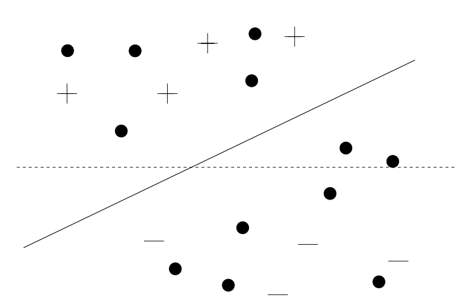

<br>
Figure 11[5]: TSVM Algorithm
</div>

<!-- ##### <font color=blue size=56>LapSVM</font> -->
#### LapSVM
 
LapSVM[6] was proposed by Belkin et al. LapSVM is based on the manifold assumption. The classical SVM algorithm seeks to maximize the margin between the dividing hyperplane and support vectors, which only considers the distribution of samples in the feature space. However, in practical applications, samples in high-dimensional space are often distributed on low-dimensional Riemannian manifolds. Classical SVM based on original feature space tends to ignore the essential characteristics of samples. LapSVM adds a manifold regularization term to the optimization objective of SVM for learning the essential distribution of samples. LapSVM builds a graph model using all samples, obtains the weight matrix of the graph model through the similarity between the features of the samples and calculates its Laplace matrix. The Laplace regularization term guides the predicted results of the adjacent samples in the graph to be as consistent as possible. Unlike TSVM, LapSVM only penalizes the misclassification of labeled samples, but uses all samples when building a graph model, so that unlabeled samples participate in the learning process by the distribution of samples on the manifold.

### Graph Based Method

The graph-based semi-supervised learning method represents the data set as a graph model with samples as nodes and relationships among samples as edges. In semi-supervised learning, there are labeled data and unlabeled data, so some points have labels, while others haven't. Graph-based transductive semi-supervised learning can be regarded as the process of label propagation or spreading in the graph.

#### Label Propagation

Label Propagation[7] was proposed by Zhu et al. Label Propagation uses samples as nodes, and the relationship between the samples as edges. The graph can be constructed fully connected or based on k-nearest neighbors. The purpose of Label Propagation algorithm is to propagate the labels from labeled data to unlabeled data through the graph. The optimization goal of Label Propagation is the Laplacian consistency, that is the weighted mean square error of the difference of labels between pairs of adjacent nodes. Since the labels of labeled samples are fixed, Label Propogation only needs to solve the labels of unlabeled data to minimize the optimization goal. So the model's predictions for adjacent points on the graph should be as consistent as possible. Label Propagation makes the partial derivative of the optimization objective to the labels of unlabeled samples to be 0 and the optimal solution can be obtained. It has been proved that this closed-form optimal solution obtained by direct calculation is consistent with the final convergence result of infinite and continuous iterations. An accurate solution can be obtained through direct derivation, without simulating the process of label propagation and performing multiple iterations for convergence, which is the advantage of Label Propagation over other graph based semi-supervised learning methods.

#### Label Spreading

 Label Spreading[8] was proposed by Zhou et al. Different from Label Propagation algorithm in which the labels of the labeled samples are fixed during the spreading process to protect the influence of the real labels on the model, Label Spreading penalizes misclassified labeled samples rather than banning it completely. For the existence of data noise, Label Prapogation has certain limitations and does not performs well. An labels in Label Propagation algorithm can only flow to unlabeled nodes, which may block some paths that need to be propagated through labeled nodes, which limits the propagation of information in the graph. Label Spreading algorithm enables labels to be broadcast to all adjacent nodes to improve this problem.  There are two optimization goals for Label Spreading. The first is the same as that of Label Propagation, but there is no restriction that the model's prediction results for labeled samples must be equal to its true label. The second is the prediction loss for labeled data with a penalty parameter as its weight. Due to different optimization goals, Label Propagation has a closed-form solution, while Label Spreading needs to be solved iteratively. In each iteration, a trade-off parameter is required to weight spreading results and initial labels of samples as the current prediction results.

### Disagreement Based Method

Disagreement-based semi-supervised learning methods depend on multiple learners with significant divergence and use the disagreement between learners to utilize unlabeled data. Such methods are less affected by model assumptions, non-convexity of loss function and data scale problems. These methods are simple and effective and have solid theoretical foundation relatively.

<!-- #### Self-Training

Self-Training[9] was proposed by Yarowsky et al. The Self-Training is the most classical wrapper method. It is an iterative method. Firstly, a supervised classifier is trained with labeled data. Then in each round of iteration, the current learner is used to make prediction on unlabeled samples to obtain its pseudo labels. Unlabeled samples with their pseudo labels whose confidence higher than a certain threshold are combined  with labeled dataset to form a new mixed dataset. Lately a new classifier trained on the mixed data set is used in the next iteration process. The training pocess of Self-Traing is so convenient that any supervised learner which provides soft labels can be used. Self-Training provides a basis for subsequent research on other wrapper methods. -->


#### Co-Training

Co-Training[10] was proposed by Blum et al. In Co-Training, two basic learners are used to cooperate with each other to assist each other's training. For unlabeled samples with high confidence on one learner, Co-Training will pass them and their pseudo-labels to another learner, through this form of interaction, the knowledge learned on one learner is passed on to another learner. Due to the difference between the two base learners, their learning difficulty for same samples is different. Co-Training effectively takes advantage of this difference, so that a learner can not only use its own confident pseudo-labels, but also use another learner's confident pseudo-labels to increase the utilization of unlabeled data. Finally the two learners are ensembled to be used for prediction. In order to make the two base learners have a certain difference, Co-Training adopts the multi-view assumption, that is, models trained based on different feature sets should have the same prediction results for the same samples. Co-Training divides the features of the samples into two sets, which are used as observations of the samples from two different views. The training data of the two learners in the initial state are only labeled data in different views. In the initial state, the training datasets of the two learners are only labeled dataset in different views. In the iterative process, Unlabeled samples with high pseudo-label confidence on one learner are added to the training datasets of two learners at the same time, which will be used for the next round of training. The iteration continues until the predictions of both learners no longer change.

<div align=center>


<br>

Figure 12[3]: Co-Training Algorithm
</div>

#### Tri-Training

Tri-Training[11] is proposed by Zhou et al. Because multi-learner training methods such as Co-Training must require differences between basic learners, such as different data views or different models. However, in practical applications, there may only be a single view of data, and artificially cutting the original data will lose the information of the relationship between the features in different views. The division method for views requires expert knowledge because wrong division may lead to serious performance degradation. The use of different models for co-training requires setting up multiple supervised learners. Considering that the advantage of wrapper methods over other semi-supervised learning methods is that the supervised learning algorithm can be directly extended to semi-supervised learning tasks, so there is often only one supervised learning algorithm in the scenarios where the wrapper methods are used. Designing additional supervised learning algorithms loses the convenience of wrapper methods. Tri-Training solves this problem from the perspective of data sampling. Only one supervised learning algorithm is used, and the dataset is randomly sampled multiple times to generate multiple different training datasets to achieve the purpose of learning to get multiple different models. In other wrapper methods, the model's confidence in unlabeled samples is used to decide whether to incorporate unlabeled data into the training data set. However, in some cases, the model may be overconfident in the misclassification, resulting in a large deviation. Tri-Training uses three base learners for training. During the training process of one base learner, for unlabeled samples, the other two base learners can be used to judge whether they should be added in the training dataset. If in one iteration, the common prediction error rate of the two learners is low and they have the same prediction result for the unlabeled sample, the unlabeled sample and its pseudo-label are more likely to produce positive effect to the current training base learner. Using the prediction consistency of the two models to determine whether to use unlabeled samples is more robust than using the confidence of only one model. In addition, in other wrapper methods, the selected unlabeled samples will always exist in the training dataset, which may cause the unlabeled samples that are mispredicted to have a lasting impact on the learner and can never be corrected. In Tri-Training, the unlabeled samples and their pseudo-labels used in each iteration of the algorithm are reselected. Tri-Training has a solid theoretical foundation and adds restrictions on the use of unlabeled data in each iteration based on the theoretical foundation. Strict constraints on the use of unlabeled data greatly increase the security of the semi-supervised model, which can effectively alleviate the problem of model performance degradation caused by erroneously using unlabeled data.

### Ensemble Method

In the field of machine learning, the use of a single learner is likely to cause high deviation or variance due to underfitting or overfitting, resulting in insufficient model generalization ability. Ensemble learning combines multiple weak learners, which not only improves the model's ability to represent the hypothesis space, but also reduces the impact of errors caused by a single learner and improves the reliability of the model. In the field of semi-supervised learning, due to the addition of unlabeled data, using a single learner to set pseudo-labels for unlabeled samples further exacerbates the instability of a single learner and has a stronger reliance on effective ensemble learning methods.

#### Assemble

Assemble[12] is proposed by Bennett et al. Assemble is an extension of AdaBoost method in the field of semi-supervised learning. The Boosting method is an important method in ensemble learning. This method samples the data set through the prediction effect of the current ensemble learner. The sampling process will pay more attention to the samples whose results of the current ensemble learner is not good. This strategy enables the model to pay more attention to the samples with poor learning effect of the current ensmeble learner in each round of new weak learner learning process, and continuously improve the generalization ability and robustness of the model. AdaBoost is the most representative method in the Boosting methods. This method adaptively adjusts the sample weight according to the difference between the prediction results and the samples' real labels. The weak learners with higher accuracy have higher ensemble weights. ASSEMBLE promotes the AdaBoost method in the field of semi-supervised learning by adding pseudo-labels to unlabeled data. In the initial stage, the pseudo-labels of unlabeled samples are the labels of the closest labeled samples and the unlabeled data and labeled data have different weights. In the iterative process, the pseudo-labels of unlabeled data are updated to the prediction results of the ensemble learner in each round. As the iteration progresses, the effect of the ensemble learner is getting better and better and the pseudo-labels are more and more accurate, which further have a more beneficial impact on the ensemble learner.

#### SemiBoost

SemiBoost[13] are proposed by Mallapragada et al. Unlike Assemble, which only uses the difference between the prediction results of the model and the real labels or pseudo-labels to weight samples and does not consider the relationship between samples, SemiBoost is based on graph semi-supervised learning method, which points out that the similarity between samples also should be taken into consideration and a larger weight should be set for the samples with high similarity in feature space and high inconsistency in prediction results to other samples. The generalization ability and robustness of model are improved. Unlabeled samples play a greater role in this process. SemiBooost learns a new weak learner in each round of iteration. Its optimization objective consists of two items. The first item punishes the discrepancy between pseudo-labels of unlabeled samples and real labels of labeled samples which uses the similarity in feature space as weights. It is close to the effect of Label Propagation so that the model can obtain pseudo-labels of unlabeled samples according to the graph structure. The second term penalizes the prediction between unlabeled samples which uses the similarity within the unlabeled samples as weights. Te second item alleviates the impact of noise to the model.
<div align=center>
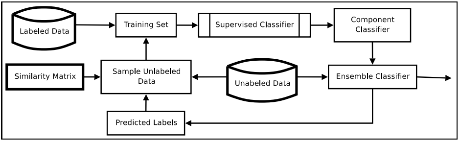

<br>

Figure 13[13]: SemiBoost Algorithm

</div>

### Semi-supervised Regression

Most of the current semi-supervised learning algorithms are designed for classification tasks and cannot be naturally extended to regression tasks. Only a few works are aimed at semi-supervised learning regression tasks. It is because in regression tasks, reasonable assumption are more difficult to be made compared to classification tasks. At present, there are few research results in this field and the semi-supervised regression task still has great demand and application value in real scenarios.

#### CoReg

CoReg[14] is proposed by Zhou et al. CoReg introduces the Co-Training algorithm into regression tasks. In wrapper methods originally used for classification, it is often assumed that samples with higher confidence will have a more positive impact on subsequent training. Some unlabeled samples and their pseudo-labels are selected as training data according to the confidence. However it is difficult to get the confidence in the regression task. CoReg solves this problem, thereby applying the Co-Training algorithm to regression tasks. CoReg uses the kNN model as the type of base learner. For two base learners, in order to maintain the difference between them, different orders are used to calculate the Minkowsky distance between samples in the k-nearest neighbor model. In order to measure the confidence of the model on the samples, for each unlabeled sample, the model first predicts the real-valued pseudo-label. CoReg then combines its pseudo-label with all the samples participating in the training process to retrain a learner and uses the mean squared error loss to evaluate to evaluate the impact of the sample on its k nearest neighbors. If the mean square error of these k-nearest neighbor nodes decreases, it means that adding the unlabeled sample is more likely to have a positive impact on subsequent training. Therefore, CoReg uses the difference between the mean square error before and after adding the unlabeled sample as the evaluation standard of confidence. The unlabeled sample with the highest confidence and its real value pseudo-label are added to the training dataset of another learner, thus completing the training process of Co-Training.

### Semi-supervised Cluster

Unlike semi-supervised classification and semi-supervised regression tasks, which use unlabeled data to assist the process of supervised learning, semi-supervised clustering tasks introduce supervision information to assist the process of unsupervised learning. Supervision information is not necessarily labeled data, but may also be other knowledge related to real labels. Due to the difference of supervised information, various semi-supervised clustering methods have also been proposed.

#### Constrained k-means

Constrained k-means[15] was proposed by Wagstaff et al. Based on k-means clustering algorithm, the algorithm introduces constraints called Must Link and Connot Link as supervision information. The Must Link constraint restricts that some samples must belong to the same cluster. The Connot Link constraint restricts that some samples must belong to different clusters. There is transfer mechanisms in constraints. For example, if A and B must be linked and B and C must be linked, then A and C must be linked and if A and B must be linked and B and C can not be linked, then A and C can not linked. K-means algorithm assigns a sample to the cluster whose cluster center is closest to the sample. Similarly, Constrained k-means also give priority to the cluster whose center is closest to the sample, but the difference is that Constrained k-means algorithm should judge whether the Must Link and Cannot Link constraints are violated between the sample and the samples which are already in the cluster. If violated, Constrained k-means will reconsider the next eligible cluster. If all clusters fail to satisfy the constraints, a warning of clustering failure is issued and different cluster centers are needed to be selected randomly to reinitialize the process.

#### Constrained Seed k-means

Constrained Seed k-means[16] was proposed by Basu et al. This algorithm is different from Constrained k-means, which uses Must Link and Connect Link constraints as supervision information, but directly uses labeled data as supervision information. Since there are some labeled data, the cluster center can be calculated directly on the labeled dataset, which effectively alleviates the cluster instability caused by the randomness of the initial cluster centers selection. The number of classes of the labeled dataset can be used as the number of clusters in the clustering algorithm, which avoids the bad clustering results caused by unreasonable k value selection. Unlike k-means algorithm, in which all samples are judged to which cluster they should belong in the iterative process, Constrained Seed k-means algorithm only updates the cluster labels of unlabeled data. For labeled samples, their cluster labels are fixed with their real labels and not change as the change of cluster centers. The clusterer is more reliable when using labeled data to participate in the clustering process, which alleviates the blindness of unsupervised clustering and effectively reduces the large gap between the clustering results and the real labels of the samples. It also alleviates the instability caused by randomness.

## Deep Semi-supervised Learning

LAMDA-SSL contains 18 deep model-based semi-supervised learning algorithms (as shown in Figure 10): the algorithms used for classification tasks include the consistency regularization method Ladder Network, Π Model, Temporal Ensembling, Mean Teacher, VAT, UDA, Pseudo label-based methods Pseudo Label, S4L, hybrid methods ICT, MixMatch, ReMixMatch, FixMatch, FlexMatch, generative methods ImprovedGAN, SSVAE, deep graph based methods SDNE, GCN; the algorithms for regression tasks include consistency regularization method Π Model Reg, Mean Teacher Reg and hybrid method ICT Reg.

### Consistency Regularization

Deep learning methods guide the direction of model training by setting the loss function with gradient descent. Consistency regularization methods are based on the assumption of consistency, which assumes if a certain degree of disturbance is added to samples, the prediction results should be consistent with the previous. These methods often introduces a consistency regularization term into the loss function which enables unlabeled samples to participate in the model training process to improve the robustness of the model to noise

#### Ladder Network

LadderNetwork[17] was proposed by Rasmus et al. This method adopts an autoencoder structure, in which the outputs of the last layer of the encoder are soft labels. The LadderNetwork adopts two encoding methods, the first is the classical encoder without noise, that is, and the second is the encoder with noise, which add noise to inputs of each layer of the classical encoder.   LadderNetwork firstly performs noise encoding and non-noise encoding on the samples respectively and obtains the noisy representation and the non-noisy representation of each layer. Then the decoder is used to decode the noisy encoding result, and the noisy decoding representations of each layer are obtained. Finally, mean square error(MSE) loss is used to calculate the inconsistency between the non-noisy encoded representation and the noisy decoded representation at each layer, including the original input data as the zeroth layer. The previously determined weights are used to determine the weights of inconsistency of each layer. Hierarchical inconsistencies are weighted as an unsupervised loss function, thereby improving the robustness of model. The consistency regularization of LadderNetwork uses the noisy encoded representation as a bridge to penalize the inconsistency between the non-noisy encoded representation and the noisy decoded representation. On the one hand, an auto-encoder can be obtained to make the representations of the encoder and the decoder consistent at all levels. On the other hand, the hidden layer representations keep consistent regardless weather noise is added, which makes the model can against disturbances.

<div align=center>


<br>

Figure 14[3]: LadderNetwork Algorithm

</div>

#### UDA

UDA[18] was proposed by Xie et al. Unlike LadderNetwork, UDA only perturbs the input samples instead of all inputs of hidden layers. And UDA does not necessarily use Gaussian noise for perturbation, but may use various data augmentation methods. Compared with Gaussian noise, data augmentation used by UDA, such as image rotation or text replacement have a greater impact on the data, which can further improve the robustness of the model. UDA performs data augmentation on the unlabeled samples and then compares the prediction results before and after the augmentation. The mean square error loss is used to calculate the consistency regularization term as the unsupervised loss.

<div align=center>


<br>

Figure 15[3]: UDA Algorithm

</div>

#### Pi Model

Pi Model[19] was proposed by Laine et al. Unlike UDA, which augments the unlabeled data once and compares the prediction results before and after the augmentation and calculates the consistency regular term. Pi Model augments the data twice randomly and respectively uses the results of the two augmentations as inputs of the neural network model to get prediction results. The inconsistency of the prediction results are used as the unsupervised loss. Due to the randomness of the augmentation process, the two augmentations of this method will obtain two pieces of samples that are semantically similar but may have slightly difference in features. Through the consistency regularization, the model can produce similar prediction results for different augmentations with a certain range.

<div align=center>


<br>

Figure 16[3]: Π Model Algorithm

</div>

#### Temporal Ensembling

Temporal Ensembling[19] are proposed by Laine et al. This method makes some improvements to Pi Model. In Pi Model, for each unlabeled sample, Pi Model needs to perform two augmentations and calculate the inconsistency of their prediction results, which brings a large consumption of computing power. Temporal Ensembling method changes one of the pseudo-label predictions to exponential moving average(EMA) of historical pseudo-labels, which is a weighted average of historical results. The weights of pseudo-labels decay exponentially in each round. This ensemble method effectively preserves the historical pseudo-labels information and get unsupervised loss by calculating the consistency between the current pseudo-label and the ensemble of historical pseudo-labels. Tthe historical ensemble is updated at the end of each epoch. EMA guarantees the robustness of the model. It avoids the model being overly affected by a single round of prediction and slows down the model’s forgetting speed of historical information. Temporal Ensembling only needs to augment and predict once for each sample in each round. Historical information can be maintained with only one weighted average calculation, which greatly reduces computing power consumption compared to Pi Model.

<div align=center>


<br>

Figure 17[3]: Temporal Ensembling Algorithm

</div>

#### Mean Teacher

Mean Teacher[20] was proposed by Tarvainen et al. This method relies on the idea of ​​knowledge distillation, where the prediction results of the teacher model are used as pseudo-labels to train the student model to ensure the consistency of the prediction results of the teacher model and the student model, thereby distilling knowledge from a more complex model to a simpler one. The purpose of the classical knowledge distillation method is to simplify the model, but the purpose of Mean Teacher is to make unlabeled data participate in the learning process and improve the robustness of the model. Therefore, the teacher model is not a complex model, but performs exponential moving average on the parameters based on the student model, which reduces the computational cost compared to the classical knowledge distillation method. Temporal Ensembling method performs EMA on the prediction results of each round, but the overall historical information only can be updated at the end of each round. Especially for large data sets, the historical information cannot be updated in time. Different from Temporal Ensembling, Mean Teacher uses EMA for model parameters and updates the historical information of model parameters in time after each batch of training. Mean Teacher is more flexible and general because it effectively solves the problem of untimely update and utilization of historical information.

<div align=center>


<br>

Figure 18[3]: MeanTeacher Algorithm

</div>

#### VAT

VAT[21] was proposed by Miyato et al. Different from the methods of adding random noise to the data, the idea of ​​VAT is to add adversarial noise to the data, so that the worst performance of the model can be better when the data is affected by noise within a certain range, which corresponds to the zero-sum game in game theory and Min-Max problem in optimization. For classical supervised adversarial algorithms, the cross-entropy loss between the real labels and prediction results is usually used as the goal of adversarial optimization. The noise that maximizes the loss for the current model and data is obtained through the inner layer optimization. The outer layer optimization is used to obtain the model parameters which minimizes the loss. Inner and outer optimization are alternately performed, so that the model can not perform too bad in the worst case when dealing with data noise. The outer optimization is to optimize the model parameters, which is often carried out by gradient descent, while the inner optimization is optimized for data noise, in which there is no closed-form solution. The inner optimization is not suitable to use gradient optimization and it is necessary to approximate the optimal noise. Linear approximation is often used in classical supervised adversarial algorithms. It firstly predicts on the clear data and calculate the value of the loss function. Then it carries out the gradient backward to obtain the gradient. Finally it takes the product of the normalized gradient and the noise upper bound as the adversarial noise. Different from classical supervised adversarial algorithms, VAT needs to solve the problem in semi-supervised scenarios where loss of unlabeled data cannot be calculated supervisely and then adversarial noise cannot be obtained by gradient. In order to solve this problem, VAT adopts the consistency strategy. It changes the supervised loss to the consistency loss which uses the model to predict on the clear data and the noisy data respectively to obtain the clear pseudo-labels and the noisy pseudo-labels. Then it calculates the consistency between them. In VAT, linear approximation cannot be used for the inner optimization on unlabeled data because it is necessary to calculate the classification loss with real labels and VAT replaces real labels with pseudo-labels resulting in the gradient returned is always 0. So VAT uses second-order Taylor approximation instead of linear approximation, so the problem of computing against noise is transformed into the problem of computing the principal eigenvectors of the Hessian matrix of the loss function for noise. When the noise of data is d-dimensional, the time complexity of calculating the eigenvector of Hessian matrix is O\left(d^3\right). In order to solve the problem of excessive computational complexity, VAT adopts power iteration method to solve the approximate matrix eigenvectors, which randomly samples the approximated eigenvectors and continuously multiply the matrix and the current approximated eigenvectors to obtain new ones. Continuously performing this process can consume less time. In order to further avoid the direct calculation of the Hessian matrix, VAT adopts the Finite Difference method to approximate the product of the matrix and the approximate eigenvector. Compared with other methods based on consistency regularity, the use of anti-noise in the VAT method can further improve the robustness of the model than random noise and avoid excessive interference of randomness on the experimental results because the performance in the worst case has a better theoretical basis. VAT avoids excessive additional computational overhead through approximation methods when calculating adversarial noise and solves the dilemma that supervised adversarial algorithms cannot be directly applied to unlabeled data.

<div align=center>


<br>

Figure 19[3]: VAT Algorithm

</div>

### Pseudo Labeling

Methods based on pseudo-labeling make unlabeled data affect the learning process by assigning pseudo-labels to unlabeled data. Since the confidence levels of the model for different samples are different, the method based on pseudo-labels usually takes samples with higher confidence and their pseudo-labels to participate in the training process.

#### Pseudo Label

Pseudo Label[22] was proposed by Lee et al. This method is the most basic pseudo-labeling method. Its loss function includes two items supervised loss and unsupervised loss, both of which are cross-entropy loss functions. For unlabeled data, the Pseudo Label performs softmax operation on the output of the neural network to obtain the confidence of classification. Pseudo Label takes the category with the highest confidence as the pseudo-label of the sample and uses the pseudo-label to calculate the cross-entropy loss. In addition, in each round, not all unlabeled samples will participate in the training process. They participate in the training process only when the confidence of them in this round are greater than the set threshold. Pseudo Label also sets hyperparameters to control the proportion of unsupervised loss and supervised loss and adopts a warmup mechanism. At the beginning of training, the proportion of unsupervised loss is low and as the training goes on, the proportion is increasing.

<div align=center>

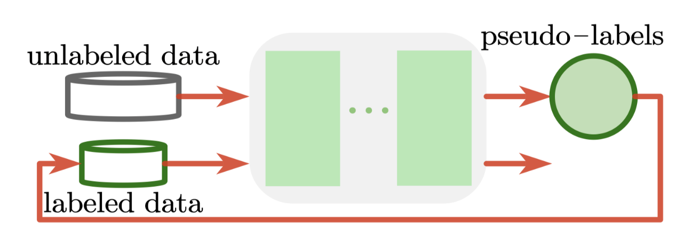

<br>

Figure 20[3]: Pseudo Label Algorithm

</div>

#### S4L

S4L[23] was proposed by Beyer et al. This method uses self-supervised technology. The basic idea is that unlabeled data cannot directly participate in the training of classifiers, but self-supervision can be used to affect the representation layer, so that the model can learn better hidden layer representations. This method is mainly used for image data. One of 0^\circle, 90^\circle, 180^\circle, and 270^\circle is randomly selected as the degree to rotate the image, and the angle is used as a pseudo-label. A neural network model can be trained to classify angles. Although the final classification layer of the neural network is different from the target task, the learned hidden layer representation is helpful for learning the real task. For labeled data, S4L uses two labels, a pseudo label representing the degree of rotation and a real label for the target task. S4L uses two classification layers for labeled data, one of which is the degree classifier shared with unlabeled data, and the other is the true classifier for the target task, and both classification layers share the same hidden layer. Through the above methods, S4L enables the model to learn better representations while training the self-supervised classifier, thereby improving the classification effect of the model on the target task. Different from the pre-training and fine-tuning paradigms, S4L does not need to train the model in advance, but can process labeled data and unlabeled data at the same time to promote each other. Labeled data also participates in the self-supervised learning process of S4L. S4L can also be generalized to other types of data, and corresponding self-supervised training methods need to be adopted.

<div align=center>

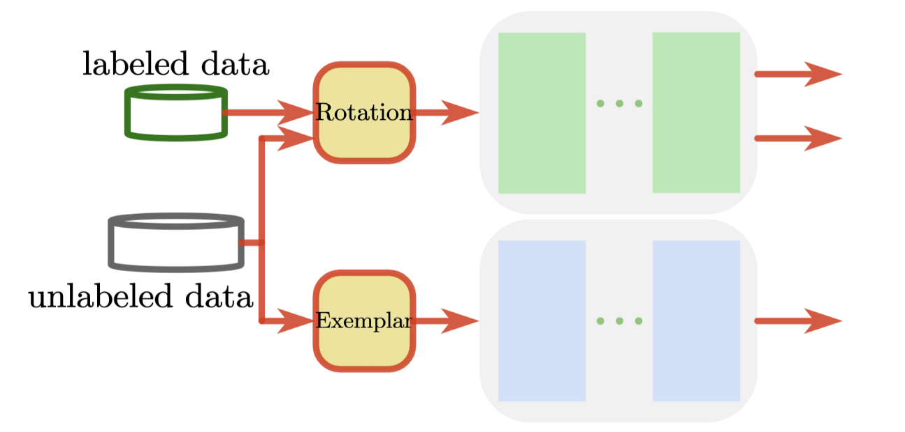

<br>

Figure 21[3]: S4L Algorithm

</div>

### Hybird Method

There are often no conflicts among different semi-supervised learning techniques. Many commonly used semi-supervised learning algorithms are not limited to using only one type of techniques, but combine techniques such as consistency and pseudo-annotation et al and use their own strengths to generate new hybrid methods. Hybrid methods can leverage the advantages of different techniques simultaneously to achieve better training results.

#### ICT

ICT[24] was proposed by Verma et al. The full name of  ICT is Interpolation Consistency Training. The data and prediction results are linearly interpolated by Mixup [35] which is a data augmentation method. ICT introduces unlabeled data into the training process by using the consistency between the model's predictions on the interpolated samples and the interpolation of the model's predictions on the original data. Mixup generates a parameter which means mixing ratio from the Beta distribution, and linearly interpolates two samples using the ratio parameter to obtain the mixed sample. The loss function of ICT is divided into two parts: supervised loss and unsupervised loss. The supervised loss is calculated by the cross entropy function and the unsupervised loss is calculated by the interpolation consistency. For each batch of data, ICT firstly samples a mixing parameter according to the Beta distribution. Then ICT randomly scrambles the batch of samples, and mixes the scrambled batch data with the unscrambled batch data in proportion to the mixing parameter. The model predicts on the unscrambled batch data and the mixed batch data to get the unscrambled prediction results and the mixed prediction results. Finally ICT linearly interpolates the unscrambled prediction results and the scrambled prediction results with the same mixing parameters as the samples and takes the inconsistency as the unsupervised loss. For mixed unlabeled data, ICT makes the soft labels output by the model close to the mix of pseudo-labels and combines consistency technology with pseudo-label technology to make the model more robust.

<div align=center>


<br>

Figure 22[3]: ICT Algorithm

</div>

#### MixMatch

MixMatch[25] was proposed by Berthelot et al. This method also uses Mixup method, but unlike ICT which only mixes unlabeled data samples, MixMatch mixes both labeled data and unlabeled data. MixMatch firstly augments the unlabeled data multiple times and makes multiple predictions. By averaging and sharpening the results of multiple predictions, the pseudo-labels of the unlabeled data are obtained. Multiple augmentations make the pseudo-labels more reliable. Sharpening the pseudo-labels reduces the entropy of the label distribution, allowing the classification boundaries to pass through the low-density regions of the samples as much as possible. Then MixMatch combines and shuffles the labeled data set and the unlabeled data set to form a new mixed data set. The same amount of samples as the original labeled samples are taken out from the mixed data set to form a new labeled data set by Mixup and the remaining samples in the mixed data set forms a new labeled data set by Mixup too. Finally, MixMatch predicts on the new labeled data set and the new unlabeled data set respectively. It uses the prediction results of the new labeled data set to calculate the cross entropy as the supervised loss and uses the new unlabeled data set to calculate the mean square error as the unsupervised loss. The two terms are combined by a weight parameter. Different from other methods which calculate the loss of labeled data and unlabeled data separately, MixMatch combines, shuffles, and re-partitions labeled data set and unlabeled data set, which reduces the risk of model performance degradation due to wrong pseudo-labels. MixMatch is helpful to use real labels to assist the training of unlabeled data and guide the correct training direction of unlabeled consistency which not only ensures the original robustness of the consistency regularization, but also prevents the model from excessive target deviation due to the inconsistency between pseudo-labels and real labels.

<div align=center>

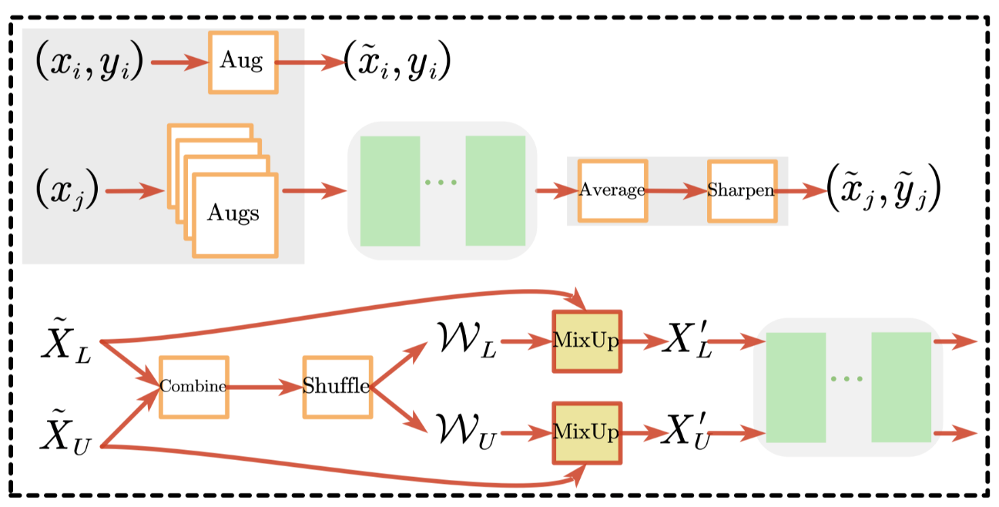

<br>

Figure 23[3]: MixMatch Algorithm

</div>

#### ReMixMatch

ReMixMatch[26] was proposed by Berthelot et al. ReMixMatch is an improved version of MixMatch. It introduces two techniques: distribution alignment and augmented anchoring. The purpose of distribution alignment is to make the pseudo-labels predicted by the model for unlabeled data have the same marginal probability distribution as the real labels of labeled data. In deep learning, the label distribution of the labeled data and the pseudo-label distribution of the unlabeled data are different because the model's predictions are often biased towards the categories which have more samples and the use of a sharpening operation reduces the entropy of the label distribution to force the classification boundaries to pass through low-density regions as much as possible. There is an unfair phenomenon among categories in the pseudo-labels of data and the distribution alignment technology effectively alleviates this problem. The distribution alignment technology calculates the true label distribution of the labeled data. In each batch of training, the soft label distribution is calculated. For the soft label of a sample, ReMixMatch multiplys it by the ratio of the real label distribution and the current batch soft label distribution to obtain the aligned soft label and sharpens the aligned soft label to obtain the pseudo label of the sample. Augmented anchoring is to adapt the model to stronger data augmentation. For supervised learning methods, applying stronger data augmentation to the data can further improve the generalization ability of the model because no matter whether strong or weak augmentation is applied to the sample, its label will not change. In semi-supervised learning, pseudo-labels are often obtained from the prediction results on unlabeled data by the model. The pseudo-labels will change with the form of data augmentation. If a strong augmentation is applied to the samples, it is easy to make the pseudo-labels deviate too much from the real labels. It makes MixMatch incompatible with strong data augmentation methods. By introducing augmented anchoring technology, ReMixMatch performs weak data augmentation on unlabeled samples. The model predicts for weakly augmented unlabeled samples to get pseudo-labels and fixes them as "anchors", so that no matter what kind of data augmentation is performed on the unlabeled data in the future, the pseudo-labels will not change. ReMixMatch performs one weak data augmentation and multiple strong data augmentation on the unlabeled data, and uses the model's prediction results for the weakly augmented data as pseudo-labels after alignment and sharpening. The augmented dataset composes a larger unlabeled dataset. ReMixMatch uses the same strategy as MixMatch to combine, shuffle and re-partition the labeled and unlabeled datasets. In addition, the loss function of ReMixMatch is quite different from that of MixMatch. The supervised loss and unsupervised loss of ReMixMatch are both calculated by cross entropy and different from MixMatch's loss function which only includes supervised loss and unsupervised loss, ReMixMatch adds two items. Although Mixup makes the model have better generalization performance, only using the data after Mixup may ignore some information of the data set before Mixup, so ReMixMatch takes one out of multiple augmented data sets before Mixup and uses it to calculate the unsupervised loss of pre-Mixup dataset as the third term of the loss function. ReMixMatch also draws on the self-supervised strategy of S4L. Samples from the augmented dataset are randomly rotated and their rotation angles are predicted to promote the learning of the hidden layer of the model. The cross-entropy loss for classifying the rotation angle is used as the fourth term of the loss function. ReMixMatch integrates multiple techniques in a more complex framework that not only combines the strengths of each method, but is more general because of its comprehensiveness.

<div align=center>

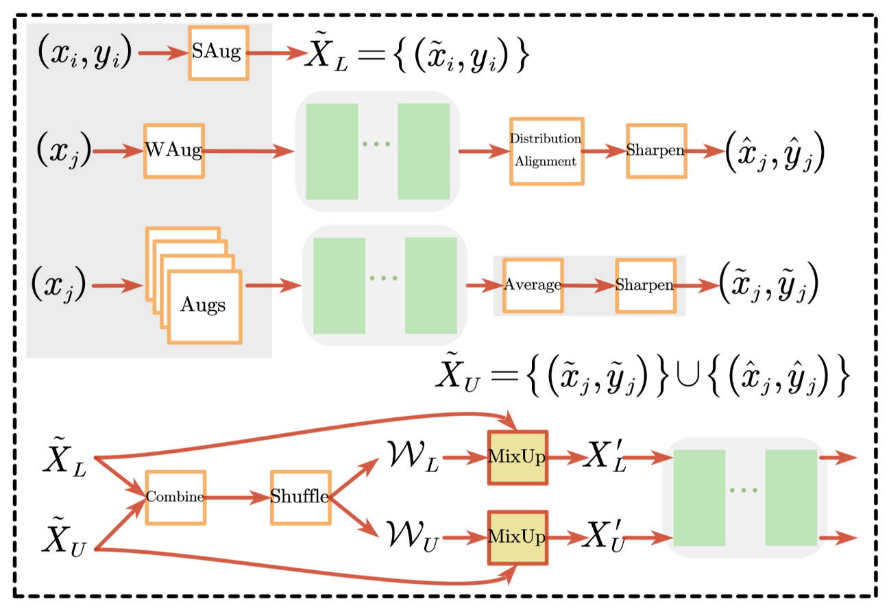

<br>

Figure 24[3]: ReMixMatch Algorithm

</div>

#### FixMatch

FixMatch[27] was proposed by Sohn et al. FixMatch also uses strong data augmentation and weak data augmentation. Unlike ReMixMatch, which uses augmented anchoring to fix pseudo-labels of unlabeled data by weak data augmentation. FixMatch pays more attention to the consistency of prediction results between weakly augmented data and strong augmented data. Similar to ReMixMatch, FixMatch also obtains hard pseudo-labels according to the prediction results of the model for weakly augmented data. After that, FixMatch augments the unlabeled data strongly to obtain the prediction results. FixMatch only uses the unlabeled data with which the model is confident for training using a threshold parameter. Only when the confidence is greater than the threshold parameter, the data will participate in the training process. FixMatch calculates the cross-entropy using the pseudo-labels obtained by the model for weakly augmented samples and the prediction results obtained by the model for strong augmented samples as unsupervised loss. Fixmatch combines the unsupervised loss and the supervised loss by a weight parameter as the final loss.

<div align=center>


<br>

Figure 25[3]: FixMatch Algorithm

</div>

#### FlexMatch

FlexMatch[28] was proposed by Zhang et al. FlexMatch is an improvement version of FixMatch and focuses on solving the unfair phenomenon between categories in semi-supervised learning. FixMatch selects unlabeled samples with high confidence and their pseudo-labels according to fixed threshold to participate in the training process. But sometimes although the original The dataset is class-balanced, due to the different learning difficulty of each class, using a fixed threshold for selecting will cause some classes which are difficult to learn to be less used in the training process than which are easy to learn. The model has lower confidence in the samples whose classes are more difficult to learn, which further exacerbates the class imbalance of the unlabeled data participating in the training. This unfairness forms a vicious circle and causes Matthew effect in Fixmatch. This unfairness forms a vicious circle, resulting in the Matthew effect, which causes the model to learn less and less well for the categories which are hard to learn. Therefore, different selecting criteria should be used for different categories to alleviate the class imbalance caused by different learning difficulties. FlexMatch uses dynamic threshold on the basis of FixMatch. It sets a lower confidence threshold for the classes that are more difficult to learn. One of the most basic methods is to set a validation dataset thresholds according to the accuracy rates on the validation dataset. However, since the labeled training data is relatively scarce, and the verification accuracy of the model is continuously updated during the training process, it will cause a large computational. Therefore, FlexMatch adopts the method of approximately evaluating the accuracy. Flexmatch firstly counts the number of times for each class that the class is consider as the pseudo-label and the confidence is greater than the threshold respectively for each batch of unlabeled data. After that, the statistics of different categories are divided by their maximum value and normalized as the evaluation of the classification difficulty. Finally, Flexmatch multiplys the fixed threshold by the classification difficulty metric of each category to get the dynamic thresholds for each category in current batch of unlabeled data. FlexMatch better alleviates the problem of class imbalance caused by different learning difficulties after unlabeled data is selected according to the confidence and does not cause excessive extra computing time and storage.

<div align=center>


<br>

Figure 26[28]: FlexMatch Algorithm

</div>

### Deep Generative Model

Generative methods use real data to model a data distribution, and this distribution can be used to generate new data. Unlike classical generative models, deep generative models generate data based on deep neural networks. Generative Adversarial Network(GAN) and Variational Autoencoder(VAE) are the most commonly used generative models.

#### ImprovedGAN

Generative Adversarial Network is divided into two parts: the generator and the discriminator, where the generator assumes that the data can be generated by low-dimensional latent variables generated from a specific distribution and is used to generate simulated data by randomly sampling from the latent variable distribution. The generator is a classifier, which is used to distinguish whether the input sample is real data or simulated data generated by the generator. The generator is optimized to make the generated samples as close as possible to the real samples to deceive the discriminator and the discriminator is optimized to distinguish real data or simulated data as accurately as possible to avoid being deceived by the generator. The two are trained together in an adversarial manner, so as to achieve the purpose of obtaining a better generator and discriminator at the same time.

ImprovedGAN[29] was proposed by Salimans et al. Classical GAN model can be trained only with unlabeled data, and its discriminator only needs to judge whether the sample is a real sample or a generated sample. ImprovedGAN adds the use of labeled data, requiring the discriminator not only to distinguish the authenticity of the samples, but also to complete the classification of the samples. So the discriminator is changed to a k+1 class classifier, where k is the number of classes in the original dataset. Both data generation and classification can be achieved through the alternate training of the generator and the discriminator.

<div align=center>

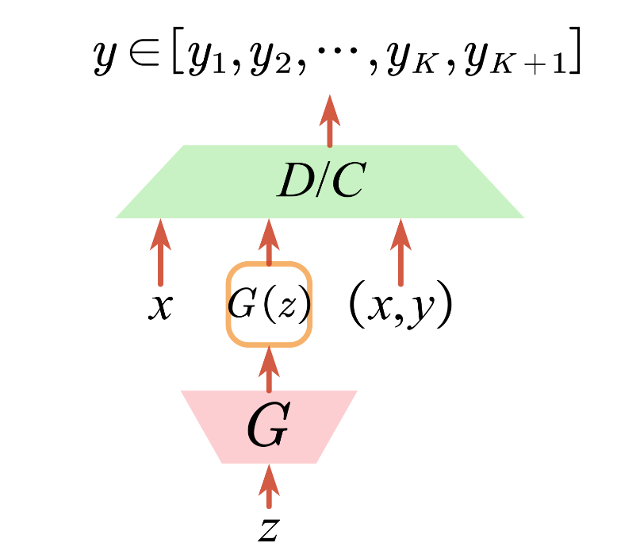

<br>

Figure 27[3]: ImprovedGAN Algorithm

</div>

#### SSVAE

Variational Autoencoder integrates the deep autoencoder into the generative model. It also assumes that there are low-dimensional latent variables generated from a specific distribution. The latent variable is used as the representation vector of the original feature, and establish the mapping of latent variables to the original features as the decoder through the deep neural network. Since the posterior probability of meta-features to latent variables cannot be directly obtained, it also needs to be approximated by a neural network. As an encoder, the learning goal is to maximize the marginal probability of the original sample. VAT can learn a distribution that approximates the true posterior distribution and using it as an encoder can get a reasonable sample representation because when the approximate posterior distribution is equal to the true posterior distribution, the marginal probability can reach its upper bound.

SSVAE[30] was proposed by Kingma et al. Classical VAE model can be trained only with unlabeled data, and its goal is to complete the learning of data representation through the encoder, and realize data generation through the decoder. SSVAE adds the application of labeled samples, and divides the encoder into two parts. The first part encodes the original data to obtain the probability distribution of the soft labels of the samples, and the second part uses the raw data and soft labels as input to obtain probability distributions of the hidden variables. The encoder of the classical VAE model only learns the representation of the data. The encoder of the SSVAE can firstly classify the samples and then can combine the sample information and the category information to learn the representation of the samples.

<div align=center>

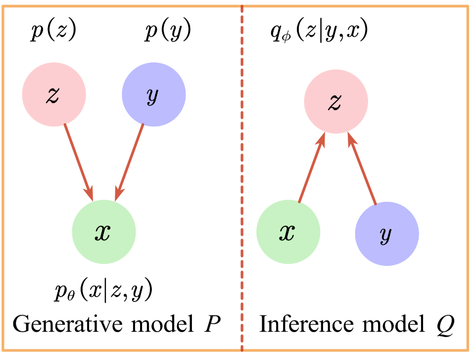

<br>

Figure 28[3]: SSVAE Algorithm

</div>

### Deep Graph Based Method

When the raw data is a graph, since the instances are not independent but connected by edges, the classical deep learning method cannot effectively utilize the structural information of the graph model, so it cannot be directly applied to the graph data. However, graph data is very common in practical applications and it is of great significance to study deep learning methods that can be used for graph data. At present, graph deep learning has achieved certain research results. The classical semi-supervised learning methods ignores the structural information of the graph, so the effect of directly applying them to graph-structured data is not ideal. In reality, graph data tasks are often semi-supervised, because the nodes to be predicted and the training nodes are on the same graph. There are both labeled data and unlabeled data in the graph.

#### SDNE

SDNE[31] was proposed by Wang et al. SDNE is a deep graph based semi-supervised learning method that can learn the embedding vector of nodes in the graph when there is no feature representation for the nodes in the graph and only graph structure information. This method adopts an autoencoder structure, takes the corresponding row of the node in the adjacency matrix as the adjacency vector of the node and inputs the adjacency vector of the node as the feature of the node into the self-encoder. SDNE obtains the embedded representation of the node through the encoder and restores the adjacency vector through the decoder. The loss function of SDNE mainly includes three items. The first item penalizes the inconsistency between the input and output of the autoencoder. In addition, unlike the classical autoencoder, the input of SDNE is an adjacency vector. Due to the sparseness of the adjacency matrix, there are a large number of zero values ​​in the input features. SDNE points out that more attention should be paid to the restoration of non-zero values, so zero and non-zero values ​​are given different weights. The second item is the Laplacian regularization which punishes the inconsistency of the hidden layer representation between adjacent nodes based on the graph structure information. The adjacency matrix is ​​used as the weight to obtain the Laplace regularization term. The third term is the L2 regularization, which penalizes the parameter complexity of the self-encoder to avoid overfitting. In SDNE, the first term of the loss function pays more attention to the characteristics of the node itself, while the second term pays more attention to the information between adjacent nodes which effectively solves the problem that the classical semi-supervised learning algorithm cannot effectively utilize the structural information of graphs.

<div align=center>

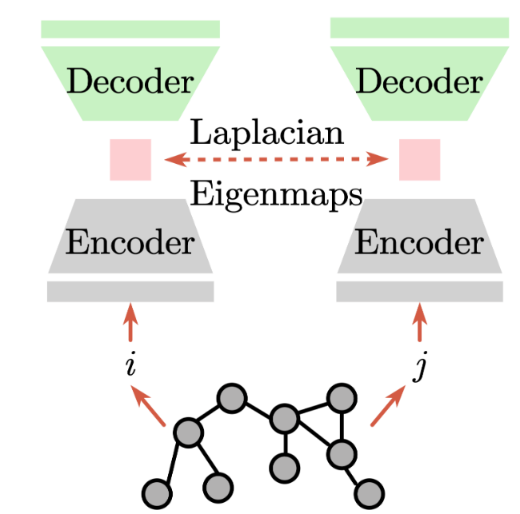

<br>

Figure 29[3]: SDNE Algorithm

</div>

#### GCN

GCN[32] was proposed by Kipf et al. Unlike SDNE, which uses the adjacency vector of the node as the node feature to learn the embedding representation, GCN is more suitable for the situation that the node itself has features. In GCN, both the feature information and graph structure information of the node itself are available, which significantly improves the performance of the model. In graph deep learning, graph neural network(GNN)[36] is the most commonly used class of methods. These methods usually take graphs with node features as input and can learn the deep representation of nodes to complete the learning assignment. The classical GNN method is divided into two steps: the first step is aggregation in which the information of the adjacent nodes are aggregated through the graph structure; the second step is update in which the nodes' representations are updated with their own representations and the information of their neighbors. By repeating these two steps, the deep representations of each node can be obtained. Due to the propagation effect of the aggregation operation, the deep representation of the node not only contains the information of the node itself, but also contains the information of the graph structure. The classical aggregation operation is linear aggregation which takes the linear combination of the representations of the neighbor nodes as the neighbor representation of the node. The classical update operation is to use the perceptron model to obtain new node representations from the nodes' own representations and their neighbor representations. The classical GNN model has some limitations. For examples, the aggregation method which linearly combines the representations of neighbor nodes makes nodes with larger numbers of degree have more influence while nodes with smaller numbers of degree have less influence on the entire training process. The GCN method directly adds the normalized neighbor representation to its own representation for each node and uses the result as the input of the perceptron to get a new representation. For each node, the normalization process divides the representation of its neighbor nodes and itself by the normalization factor, where the normalization factor of its neighbor nodes is the geometric mean of the degree of itself and its neighbor nodes while the normalization factor of itself is its own degree. GCN has excellent performance on graph structure tasks and its update process avoids the learning of linear combination weights of neighboring nodes so it has fewer parameters and higher efficiency.

<div align=center>


<br>

Figure 30[32]: GAT Algorithm

</div>

#### GAT

GAT[33] is also applicable to the case where the node itself has features. Unlike the graph convolution operation of GCN, GAT introduces the  attention mechanism. In each iteration, the attention weight of each node is calculated according to the representations of itself and its neighboring nodes and its representation is updated with the weight.

<div align=center>


<br>

Figure 31[34]: GAT Algorithm

</div>

# API

## LAMDA_SSL.Algorithm

### LAMDA_SSL.Algorithm.Classifiacation

#### LAMDA_SSL.Algorithm.Classifiacation.Assemble

> CLASS LAMDA_SSL.Algorithm.Classifiacation.Assemble.Assemble(base_model=SVC(probability=True),T=100,alpha=1,beta=0.9)
> - Parameter:
>> - base_model: A base learner for ensemble learning.
>> - T: the number of base learners. It is also the number of iterations.
>> - alpha: the weight of each sample when the sampling distribution is updated.
>> - Beta: used to initialize the sampling distribution of labeled data and unlabeled data.

#### LAMDA_SSL.Algorithm.Classifiacation.Co_Training

> CLASS LAMDA_SSL.Algorithm.Classifiacation.Co_Training.Co_Training(base_estimator, base_estimator_2=None, p=5, n=5, k=30, s=75)
> - Parameter:
>> - base_estimator: the first learner for co-training.
>> - base_estimator_2: the second learner for co-training.
>> - p: In each round, each base learner selects at most p positive samples to assign pseudo-labels.
>> - n: In each round, each base learner selects at most n negative samples to assign pseudo-labels.
>> - k: iteration rounds.
>> - s: the size of the buffer pool in each iteration.

#### LAMDA_SSL.Algorithm.Classifiacation.FixMatch

> CLASS LAMDA_SSL.Algorithm.Classifiacation.FixMatch.FixMatch(train_dataset=None,
                 valid_dataset=None,
                 test_dataset=None,
                 train_dataloader=None,
                 valid_dataloader=None,
                 test_dataloader=None,
                 augmentation=None,
                 network=None,
                 train_sampler=None,
                 train_batch_sampler=None,
                 valid_sampler=None,
                 valid_batch_sampler=None,
                 test_sampler=None,
                 test_batch_sampler=None,
                 labeled_dataset=None,
                 unlabeled_dataset=None,
                 labeled_dataloader=None,
                 unlabeled_dataloader=None,
                 labeled_sampler=None,
                 unlabeled_sampler=None,
                 labeled_batch_sampler=None,
                 unlabeled_batch_sampler=None,
                 parallel=None,
                 epoch=1,
                 num_it_epoch=None,
                 num_it_total=None,
                 eval_epoch=None,
                 eval_it=None,
                 optimizer=None,
                 weight_decay=5e-4
                 scheduler=None,
                 device='cpu',
                 evaluation=None,
                 threshold=0.95,
                 lambda_u=1.0,
                 mu=1.0,
                 ema_decay=0.999,
                 T=0.5)
> - Parameter:
>> - threshold: The confidence threshold for choosing samples.
>> - lambda_u: The weight of unsupervised loss.
>> - T: Sharpening temperature.
>> - num_classes: The number of classes for the classification task.
>> - thresh_warmup: Whether to use threshold warm-up mechanism.
>> - use_hard_labels: Whether to use hard labels in the consistency regularization.
>> - use_DA: Whether to perform distribution alignment for soft labels.
>> - p_target: p(y) based on the labeled examples seen during training.

#### LAMDA_SSL.Algorithm.Classifiacation.FlexMatch
> CLASS LAMDA_SSL.Algorithm.Classifiacation.FlexMatch.FlexMatch(train_dataset=None,
                 valid_dataset=None,
                 test_dataset=None,
                 train_dataloader=None,
                 valid_dataloader=None,
                 test_dataloader=None,
                 augmentation=None,
                 network=None,
                 train_sampler=None,
                 train_batch_sampler=None,
                 valid_sampler=None,
                 valid_batch_sampler=None,
                 test_sampler=None,
                 test_batch_sampler=None,
                 labeled_dataset=None,
                 unlabeled_dataset=None,
                 labeled_dataloader=None,
                 unlabeled_dataloader=None,
                 labeled_sampler=None,
                 unlabeled_sampler=None,
                 labeled_batch_sampler=None,
                 unlabeled_batch_sampler=None,
                 epoch=1,
                 num_it_epoch=None,
                 num_it_total=None,
                 eval_epoch=None,
                 eval_it=None,
                 optimizer=None,
                 weight_decay=5e-4,
                 scheduler=None,
                 device='cpu',
                 evaluation=None,
                 threshold=None,
                 lambda_u=None,
                 mu=None,
                 ema_decay=None,
                 T=None,
                 num_classes=10,
                 thresh_warmup=None,
                 use_hard_labels=False,
                 use_DA=False,
                 p_target=None
                 )
> - Parameter:
>> - threshold: The confidence threshold for choosing samples.
>> - lambda_u: The weight of unsupervised loss.
>> - T: Sharpening temperature.
>> - num_classes: The number of classes for the classification task.
>> - thresh_warmup: Whether to use threshold warm-up mechanism.
>> - use_hard_labels: Whether to use hard labels in the consistency regularization.
>> - use_DA: Whether to perform distribution alignment for soft labels.
>> - p_target: p(y) based on the labeled examples seen during training

#### LAMDA_SSL.Algorithm.Classifiacation.GCN
> CLASS LAMDA_SSL.Algorithm.Classifiacation.GCN.GCN(
                 dim_in=1433,
                 num_classes=7,
                 dim_hidden=16,
                 normalize=True,
                 epoch=1,
                 eval_epoch=None,
                 network=None,
                 optimizer=None,
                 weight_decay=None,
                 scheduler=None,
                 parallel=None,
                 file=None,
                 device='cpu',
                 evaluation=None
                 )
> - Parameter:
>> - dim_in: Node feature dimension.
>> - dim_hidden: the dimension of hidden layers.
>> - num_classes: Number of classes.
>> - normalize: Whether to use symmetric normalization.

#### LAMDA_SSL.Algorithm.Classifiacation.GAT
> CLASS LAMDA_SSL.Algorithm.Classifiacation.GAT.GAT(
                 dim_in=1433,
                 dim_hidden=16,
                 dropout=0,
                 heads=8,
                 epoch=1,
                 eval_epoch=None,
                 network=None,
                 optimizer=None,
                 weight_decay=None,
                 scheduler=None,
                 parallel=None,
                 file=None,
                 device='cpu',
                 evaluation=None
                 )
> - Parameter:
>> - dim_in: Node feature dimension.
>> - dim_hidden: the dimension of hidden layers.
>> - num_classes: Number of classes.
>> - dropout: The dropout rate.
>> - heads: The number of heads.

#### LAMDA_SSL.Algorithm.Classifiacation.ICT
> CLASS LAMDA_SSL.Algorithm.Classifiacation.ICT.ICT(train_dataset=None,
                 valid_dataset=None,
                 test_dataset=None,
                 train_dataloader=None,
                 valid_dataloader=None,
                 test_dataloader=None,
                 augmentation=None,
                 network=None,
                 train_sampler=None,
                 train_batch_sampler=None,
                 valid_sampler=None,
                 valid_batch_sampler=None,
                 test_sampler=None,
                 test_batch_sampler=None,
                 labeled_dataset=None,
                 unlabeled_dataset=None,
                 labeled_dataloader=None,
                 unlabeled_dataloader=None,
                 labeled_sampler=None,
                 unlabeled_sampler=None,
                 labeled_batch_sampler=None,
                 unlabeled_batch_sampler=None,
                 eval_epoch=None,
                 eval_it=None,
                 optimizer=None,
                 weight_decay=None,
                 scheduler=None,
                 device='cpu',
                 evaluation=None,
                 epoch=1,
                 num_it_epoch=None,
                 num_it_total=None,
                 ema_decay=None,
                 mu=None,
                 parallel=None,
                 file=None,
                 warmup=None,
                 lambda_u=None,
                 alpha=None)
> - Parameter:
>> - warmup: Warm up ratio for unsupervised loss.
>> - lambda_u: The weight of unsupervised loss.
>> - alpha: the parameter of Beta distribution in Mixup.

#### LAMDA_SSL.Algorithm.Classifiacation.ImprovedGAN
> CLASS LAMDA_SSL.Algorithm.Classifiacation.ImprovedGAN.ImprovedGAN(
                 train_dataset=None,
                 valid_dataset=None,
                 test_dataset=None,
                 train_dataloader=None,
                 labeled_dataloader=None,
                 unlabeled_dataloader=None,
                 valid_dataloader=None,
                 test_dataloader=None,
                 augmentation=None,
                 epoch=1,
                 network=None,
                 num_it_epoch=None,
                 num_it_total=None,
                 eval_epoch=None,
                 eval_it=None,
                 mu=None,
                 optimizer=None,
                 weight_decay=0,
                 ema_decay=None,
                 scheduler=None,
                 device=None,
                 evaluation=None,
                 train_sampler=None,
                 labeled_sampler=None,
                 unlabeled_sampler=None,
                 train_batch_sampler=None,
                 labeled_batch_sampler=None,
                 unlabeled_batch_sampler=None,
                 valid_sampler=None,
                 valid_batch_sampler=None,
                 test_sampler=None,
                 test_batch_sampler=None,
                 parallel=None,
                 file=None,
                 dim_in=(28,28),
                 num_class=10,
                 dim_z=500,
                 hidden_G=[500,500],
                 hidden_D=[1000,500,250,250,250],
                 noise_level=[0.3, 0.5, 0.5, 0.5, 0.5, 0.5],
                 activations_G=[nn.Softplus(), nn.Softplus(), nn.Softplus()],
                 activations_D=[nn.ReLU(), nn.ReLU(), nn.ReLU(), nn.ReLU(), nn.ReLU()],
                 lambda_u=1.0,
                 num_labeled=None)
> - Parameter:
>> - dim_in: The dimension of a single instance.
>> - num_classes: The number of classes.
>> - dim_z: The dimension of the latent variables used to generate the data.
>> - hidden_G: The hidden layer dimension of the neural network as the generator. If there are multiple hidden layers, it is represented by a list.
>> - hidden_D: The hidden layer dimension of the neural network as the discriminator. If there are multiple hidden layers, it is represented by a list.。
>> - noise_level: The noise level of each layer of the discriminator.
>> - activations_G: The activation function of each layer of the generator.
>> - activations_D: The activation function of each layer of the discriminator.
>> - lambda_u: The weight of unsupervised loss.
>> - num_labeled: The number of labeled samples.

#### LAMDA_SSL.Algorithm.Classifiacation.LabelPropagation
> CLASS LAMDA_SSL.Algorithm.Classifiacation.LabelPropagation.LabelPropagation(kernel="rbf",
        gamma=20,
        n_neighbors=7,
        max_iter=30,
        tol=1e-3,
        n_jobs=None,
    )
> - Parameter:
>> - kernel: The kernel function which can be inputted as a string 'rbf' or 'knn' or as a callable function.
>> - gamma: The gamma value when the kernel function is rbf kernel.
>> - n_neighbors: The n value when the kernel function is n_neighbors kernel.
>> - max_iter: The maximum number of iterations.
>> - tol: Convergence tolerance.
>> - n_jobs: The number of parallel jobs.

#### LAMDA_SSL.Algorithm.Classification.LabelSpreading
> CLASS LAMDA_SSL.Algorithm.Classification.LabelSpreading.LabelSpreading(
        kernel="rbf",
        gamma=10,
        n_neighbors=7,
        alpha=0.2,
        max_iter=30,
        tol=1e-3,
        n_jobs=None)
> - Parameter:
>> - kernel: 'rbf'、'knn' or callable. Specifies the kernel type to be used in the algorithm.
>> - gamma: The gamma value when the kernel function is rbf kernel.
>> - n_neighbors: The n value when the kernel function is n_neighbors kernel.
>> - alpha: The proportion of labels updates in each iteration.
>> - max_iter: The maximum number of iterations.
>> - tol: Convergence tolerance.
>> - n_jobs: The number of parallel jobs.

#### LAMDA_SSL.Algorithm.Classification.LadderNetwork
> CLASS LAMDA_SSL.Algorithm.Classification.LadderNetwork.LadderNetwork(train_dataset=None,
                 valid_dataset=None,
                 test_dataset=None,
                 train_dataloader=None,
                 labeled_dataloader=None,
                 unlabeled_dataloader=None,
                 valid_dataloader=None,
                 test_dataloader=None,
                 augmentation=None,
                 epoch=1,
                 network=None,
                 num_it_epoch=None,
                 num_it_total=None,
                 eval_epoch=None,
                 eval_it=None,
                 mu=None,
                 optimizer=None,
                 weight_decay=5e-4,
                 ema_decay=None,
                 scheduler=None,
                 device=None,
                 evaluation=None,
                 train_sampler=None,
                 labeled_sampler=None,
                 unlabeled_sampler=None,
                 train_batch_sampler=None,
                 labeled_batch_sampler=None,
                 unlabeled_batch_sampler=None,
                 valid_sampler=None,
                 valid_batch_sampler=None,
                 test_sampler=None,
                 test_batch_sampler=None,
                 parallel=None,
                 file=None,
                 dim_in=(28,28),
                 num_classes=10,
                 noise_std=0.2,
                 lambda_u=[0.1, 0.1, 0.1, 0.1, 0.1, 10., 1000.],
                 encoder_sizes=[1000, 500, 250, 250, 250],
                 encoder_activations=[nn.ReLU(), nn.ReLU(), nn.ReLU(), nn.ReLU(), nn.ReLU()]
                 )
> - Parameter:
>> - dim_in: The dimension of a single instance.
>> - num_classes: The number of classes.
>> - noise_std: The noise level of each layer of the discriminator.
>> - lambda_u: The proportion of consistency loss of each layer in LadderNetwork.
>> - encoder_sizes: The dimension of each layer of the encoder.
>> - encoder_activations: The activation function of each layer of the encoder.

#### LAMDA_SSL.Algorithm.Classification.LapSVM
> CLASS LAMDA_SSL.Algorithm.Classification.LapSVM.LapSVM(
distance_function = rbf_kernel,
           gamma_d=0.01,
           neighbor_mode =None,
           n_neighbor= 5,
           kernel_function= rbf_kernel,
           gamma_k=0.01,
           gamma_A= 0.03125,
           gamma_I= 0)
> - Parameter:
>> - distance_function: The distance function for building the graph. This Pamater is valid when neighbor_mode is None.
>> - gamma_d: Kernel parameters related to distance_function.
>> - neighbor_mode: The edge weight after constructing the graph model by k-nearest neighbors. There are two options 'connectivity' and 'distance', 'connectivity' returns a 0-1 matrix, and 'distance' returns a distance matrix.
>> - n_neighbor: k value of k-nearest neighbors.
>> - kernel_function: The kernel function corresponding to SVM.
>> - gamma_k: The gamma parameter corresponding to kernel_function.
>> - gamma_A: Penalty weight for function complexity.
>> - gamma_I: Penalty weight for smoothness of data distribution.

#### LAMDA_SSL.Algorithm.Classification.MeanTeacher
> CLASS LAMDA_SSL.Algorithm.Classification.MeanTeacher.MeanTeacher(
train_dataset=None,
                 valid_dataset=None,
                 test_dataset=None,
                 train_dataloader=None,
                 valid_dataloader=None,
                 test_dataloader=None,
                 labeled_dataset=None,
                 unlabeled_dataset=None,
                 labeled_dataloader=None,
                 unlabeled_dataloader=None,
                 labeled_sampler=None,
                 unlabeled_sampler=None,
                 labeled_batch_sampler=None,
                 unlabeled_batch_sampler=None,
                 augmentation=None,
                 network=None,
                 train_sampler=None,
                 train_batch_sampler=None,
                 valid_sampler=None,
                 valid_batch_sampler=None,
                 test_sampler=None,
                 test_batch_sampler=None,
                 epoch=1,
                 num_it_epoch=None,
                 num_it_total=None,
                 eval_epoch=None,
                 eval_it=None,
                 optimizer=None,
                 weight_decay=None
                 scheduler=None,
                 device='cpu',
                 evaluation=None,
                 mu=None,
                 parallel=None,
                 file=None,
                 ema_decay=None,
                 warmup=None,
                 lambda_u=None)
> - Parameter:
>> - ema_decay: Update weights for the exponential moving average.
>> - warmup: The end position of warmup. For example, num_it_total is 100 and warmup is 0.4, then warmup is performed in the first 40 iterations.
>> - lambda_u: The weight of unsupervised loss.

#### LAMDA_SSL.Algorithm.Classification.MixMatch.MixMatch
> CLASS LAMDA_SSL.Algorithm.Classification.MixMatch.MixMatch(train_dataset=None,
                 valid_dataset=None,
                 test_dataset=None,
                 train_dataloader=None,
                 valid_dataloader=None,
                 test_dataloader=None,
                 augmentation=None,
                 network=None,
                 train_sampler=None,
                 train_batch_sampler=None,
                 valid_sampler=None,
                 valid_batch_sampler=None,
                 test_sampler=None,
                 test_batch_sampler=None,
                 labeled_dataset=None,
                 unlabeled_dataset=None,
                 labeled_dataloader=None,
                 unlabeled_dataloader=None,
                 labeled_sampler=None,
                 unlabeled_sampler=None,
                 labeled_batch_sampler=None,
                 unlabeled_batch_sampler=None,
                 epoch=1,
                 num_it_epoch=None,
                 num_it_total=None,
                 warmup=None,
                 eval_epoch=None,
                 eval_it=None,
                 optimizer=None,
                 weight_decay=None,
                 scheduler=None,
                 mu=None,
                 ema_decay=None,
                 device='cpu',
                 evaluation=None,
                 parallel=None,
                 file=None,
                 lambda_u=None,
                 T=None,
                 num_classes=10,
                 alpha=None
                 )
> - Parameter:
>> - lambda_u: The weight of unsupervised loss.
>> - T: Sharpening temperature for soft labels.
>> - num_classes: The number of classes.
>> - alpha: The parameter of the beta distribution in Mixup.

#### LAMDA_SSL.Algorithm.Classification.PiModel
> CLASS LAMDA_SSL.Algorithm.Classification.PiModel.PiModel(train_dataset=None,
                 valid_dataset=None,
                 test_dataset=None,
                 train_dataloader=None,
                 valid_dataloader=None,
                 test_dataloader=None,
                 augmentation=None,
                 network=None,
                 train_sampler=None,
                 train_batch_sampler=None,
                 valid_sampler=None,
                 valid_batch_sampler=None,
                 test_sampler=None,
                 test_batch_sampler=None,
                 labeled_dataset=None,
                 unlabeled_dataset=None,
                 labeled_dataloader=None,
                 unlabeled_dataloader=None,
                 labeled_sampler=None,
                 unlabeled_sampler=None,
                 labeled_batch_sampler=None,
                 unlabeled_batch_sampler=None,
                 epoch=1,
                 num_it_epoch=None,
                 num_it_total=None,
                 eval_epoch=None,
                 eval_it=None,
                 optimizer=None,
                 weight_decay=None
                 scheduler=None,
                 device='cpu',
                 mu=None,
                 ema_decay=None,
                 evaluation=None,
                 parallel=None,
                 file=None,
                 warmup=0.4,
                 lambda_u=None,
                 )
> - Parameter:
>> - lambda_u: The weight of unsupervised loss.
>> - warmup: The end position of warmup. For example, num_it_total is 100 and warmup is 0.4, then warmup is performed in the first 40 iterations.

#### LAMDA_SSL.Algorithm.Classification.PseudoLabel
> CLASS LAMDA_SSL.Algorithm.Classification.PseudoLabel.PseudoLabel(self,train_dataset=None,
                 valid_dataset=None,
                 test_dataset=None,
                 train_dataloader=None,
                 valid_dataloader=None,
                 test_dataloader=None,
                 augmentation=None,
                 network=None,
                 train_sampler=None,
                 train_batch_sampler=None,
                 valid_sampler=None,
                 valid_batch_sampler=None,
                 test_sampler=None,
                 test_batch_sampler=None,
                 labeled_dataset=None,
                 unlabeled_dataset=None,
                 labeled_dataloader=None,
                 unlabeled_dataloader=None,
                 labeled_sampler=None,
                 unlabeled_sampler=None,
                 labeled_batch_sampler=None,
                 unlabeled_batch_sampler=None,
                 epoch=1,
                 num_it_epoch=None,
                 num_it_total=None,
                 warmup=None,
                 eval_epoch=None,
                 eval_it=None,
                 optimizer=None,
                 weight_decay=None,
                 scheduler=None,
                 device='cpu',
                 mu=None,
                 ema_decay=None,
                 evaluation=None,
                 parallel=None,
                 file=None,
                 lambda_u=None,
                 threshold=0.95
                 )
> - Parameter:
>> - lambda_u: The weight of unsupervised loss.
>> - threshold: Confidence threshold for selecting samples.

#### LAMDA_SSL.Algorithm.Classification.ReMixmatch
> CLASS LAMDA_SSL.Algorithm.Classification.ReMixmatch.ReMixmatch(train_dataset=None,
                 valid_dataset=None,
                 test_dataset=None,
                 train_dataloader=None,
                 valid_dataloader=None,
                 test_dataloader=None,
                 augmentation=None,
                 network=None,
                 train_sampler=None,
                 train_batch_sampler=None,
                 valid_sampler=None,
                 valid_batch_sampler=None,
                 test_sampler=None,
                 test_batch_sampler=None,
                 labeled_dataset=None,
                 unlabeled_dataset=None,
                 labeled_dataloader=None,
                 unlabeled_dataloader=None,
                 labeled_sampler=None,
                 unlabeled_sampler=None,
                 labeled_batch_sampler=None,
                 unlabeled_batch_sampler=None,
                 epoch=1,
                 num_it_epoch=None,
                 num_it_total=None,
                 warmup=None,
                 eval_epoch=None,
                 eval_it=None,
                 optimizer=None,
                 weight_decay=None,
                 scheduler=None,
                 device='cpu',
                 evaluation=None,
                 mu=None,
                 ema_decay=None,
                 parallel=None,
                 file=None,
                 lambda_u=None,
                 T=None,
                 num_classes=10,
                 alpha=None,
                 p_target=None,
                 lambda_s=None,
                 lambda_rot=None,
                 rotate_v_list=None
                 )
> - Parameter:
>> - lambda_u: The weight of unsupervised loss.
>> - T: Sharpening temperature for soft labels.
>> - num_classes: The number of classes.
>> - alpha: The parameter of the beta distribution in Mixup.
>> - p_target: The target distribution of labeled data.
>> - lambda_s: The weight for unsupervised loss computed based on pre-mixup data.
>> - lambda_rot: The weight of rotation angle classification loss.
>> - rotate_v_list: A list of rotation angles.

#### LAMDA_SSL.Algorithm.Classification.S4L
> CLASS LAMDA_SSL.Algorithm.Classification.S4L.S4L(train_dataset=None,
                 valid_dataset=None,
                 test_dataset=None,
                 train_dataloader=None,
                 valid_dataloader=None,
                 test_dataloader=None,
                 augmentation=None,
                 network=None,
                 train_sampler=None,
                 train_batch_sampler=None,
                 valid_sampler=None,
                 valid_batch_sampler=None,
                 test_sampler=None,
                 test_batch_sampler=None,
                 labeled_dataset=None,
                 unlabeled_dataset=None,
                 labeled_dataloader=None,
                 unlabeled_dataloader=None,
                 labeled_sampler=None,
                 unlabeled_sampler=None,
                 labeled_batch_sampler=None,
                 unlabeled_batch_sampler=None,
                 epoch=1,
                 num_it_epoch=None,
                 num_it_total=None,
                 eval_epoch=None,
                 eval_it=None,
                 optimizer=None,
                 weight_decay=None,
                 scheduler=None,
                 device='cpu',
                 mu=None,
                 ema_decay=None,
                 evaluation=None,
                 parallel=None,
                 file=None,
                 lambda_u=None,
                 num_classes=10,
                 p_target=None,
                 rotate_v_list=None,
                 labeled_usp=True,
                 all_rot=True)
> - Parameter:
>> - lambda_u: The weight of unsupervised loss.
>> - num_classes: The number of classes.
>> - p_target: The target distribution of labeled data.
>> - rotate_v_list: A list of rotation angles.
>> - labeled_usp: Whether to use labeled data when computing the unsupervised loss.
>> - all_rot: Whether to rotate samples by all angles in rotate_v_list.

#### LAMDA_SSL.Algorithm.Classification.SDNE
> CLASS LAMDA_SSL.Algorithm.Classification.SDNE.SDNE(epoch=1,
                 eval_epoch=None,
                 optimizer=None,
                 scheduler=None,
                 device='cpu',
                 evaluation=None,
                 weight_decay=None,
                 network=None,
                 parallel=None,
                 file=None,
                 xeqs=True,
                 dim_in=None,
                 num_nodes=None,
                 hidden_layers=[250, 250],
                 alpha=1e-2,
                 gamma=0.9,
                 beta=5,
                 base_estimator=None)
> - Parameter:
>> - xeqs: Whether to use the adjacency matrix as the feature matrix of the node.
>> - dim_in: The dimension of node features. It is valid when xeqs is False.
>> - num_nodes: The number of nodes.
>> - hidden_layers: Encoder hidden layer dimension.
>> - alpha: The weight of Laplacian regularization.
>> - gamma: The weight of L2 regularation.
>> - beta: The weight of the edges in the graph that are not 0 in the loss of consistency between the input and output of the autoencoder.
>> - base_estimator: A supervised learner that classifies using the node features obtained by the encoder.

<!-- #### LAMDA_SSL.Algorithm.Classification.Self_training
> CLASS LAMDA_SSL.Algorithm.Classification.Self_Training.Self_training(base_estimator,
                threshold=0.75,
                criterion="threshold",
                k_best=10,
                max_iter=10,
                verbose=False)
> - Parameter:
>> - base_estimator: Self_training算法中使用的基监督学习器。
>> - criterion: 有'threshold'和'k_best'两种形式，前者根据阈值选择样本，后者根据排名选择样本。
>> - threshold: criterion为'threshold'时，自训练中选择样本使用的阈值。
>> - k_best: criterion为'k_best'时，自训练中选择自信度前k的样本。
>> - max_iter: 迭代次数上界。
>> - verbose: 是否允许冗余输出。 -->

#### LAMDA_SSL.Algorithm.Classification.SemiBoost
> CLASS LAMDA_SSL.Algorithm.Classification.SemiBoost.SemiBoost(base_estimator =SVC(),
similarity_kernel = 'rbf',
                        n_neighbors=4, 
                        gamma=0.1, 
                        T = 300,
                        sample_percent = 0.01,
                        sigma_percentile = 90,
                        n_jobs = 1
                        )
> - Parameter:
>> - base_estimator: The base supervised learner used in the algorithm.
>> - similarity_kernel: 'rbf'、'knn' or callable. Specifies the kernel type to be used in the algorithm.
>> - n_neighbors: It is valid when the kernel function is 'knn', indicating the value of k in the k nearest neighbors.
>> - n_jobs: It is valid when the kernel function is 'knn', indicating the number of parallel jobs.
>> - gamma: It is valid when the kernel function is 'rbf', indicating the gamma value of the rbf kernel.
>> - T: The maximum number of models in the ensemble and the number of iterations.
>> - sample_percent: The number of samples sampled at each iteration as a proportion of the remaining unlabeled samples.
>> - sigma_percentile: Scale parameter used in the 'rbf' kernel.

#### LAMDA_SSL.Algorithm.Classification.SSGMM
> CLASS LAMDA_SSL.Algorithm.Classification.SSGMM.SSGMM(num_classes, tolerance=1e-8, max_iterations=300)
> - Parameter:
>> - num_classes: The number of classes.
>> - tolerance: Tolerance for iterative convergence.
>> - max_iterations: The maximum number of iterations.

#### LAMDA_SSL.Algorithm.Classification.SSVAE
> CLASS LAMDA_SSL.Algorithm.lassification.SSVAE.SSVAE(
                 alpha,
                 dim_in,
                 num_classes=10,
                 dim_z=50,
                 dim_hidden_de=[ 500,500],
                 dim_hidden_en_y=[ 500,500], dim_hidden_en_z=[ 500,500],
                 activations_de=[nn.Softplus(), nn.Softplus()],
                 activations_en_y=[nn.Softplus(), nn.Softplus()],
                 activations_en_z=[nn.Softplus(), nn.Softplus()],
                 num_labeled=None,
                 train_dataset=None,
                 valid_dataset=None,
                 test_dataset=None,
                 train_dataloader=None,
                 labeled_dataloader=None,
                 unlabeled_dataloader=None,
                 valid_dataloader=None,
                 test_dataloader=None,
                 augmentation=None,
                 epoch=1,
                 network=None,
                 num_it_epoch=None,
                 num_it_total=None,
                 eval_epoch=None,
                 eval_it=None,
                 mu=None,
                 optimizer=None,
                 weight_decay=0,
                 ema_decay=None,
                 scheduler=None,
                 device=None,
                 evaluation=None,
                 train_sampler=None,
                 labeled_sampler=None,
                 unlabeled_sampler=None,
                 train_batch_sampler=None,
                 labeled_batch_sampler=None,
                 unlabeled_batch_sampler=None,
                 valid_sampler=None,
                 valid_batch_sampler=None,
                 test_sampler=None,
                 test_batch_sampler=None,
                 parallel=None,
                 file=None)
> - Parameter:
>> - alpha: The weight of classification loss.
>> - dim_in: The dimension of the input sample.
>> - num_classes: The number of classes.
>> - dim_z: The dimension of the hidden variable z.
>> - dim_hidden_de: The hidden layer dimension of the decoder.
>> - dim_hidden_en_y: The hidden layer dimension of the encoder for y.
>> - dim_hidden_en_z: The hidden layer dimension of the encoder for z.
>> - activations_de: The activation functions of the decoder.
>> - activations_en_y: The activation functions of the encoder for y.
>> - activations_en_z: The activation functions of the encoder for z.
>> - num_labeled: The number of labeled samples.

#### LAMDA_SSL.Algorithm.Classification.TemporalEnsembling
> CLASS LAMDA_SSL.Algorithm.Classification.TemporalEnsembling.TemporalEnsembling(valid_dataset=None,
                 test_dataset=None,
                 train_dataloader=None,
                 valid_dataloader=None,
                 test_dataloader=None,
                 augmentation=None,
                 network=None,
                 train_sampler=None,
                 train_batch_sampler=None,
                 valid_sampler=None,
                 valid_batch_sampler=None,
                 test_sampler=None,
                 test_batch_sampler=None,
                 labeled_dataset=None,
                 unlabeled_dataset=None,
                 labeled_dataloader=None,
                 unlabeled_dataloader=None,
                 labeled_sampler=None,
                 unlabeled_sampler=None,
                 labeled_batch_sampler=None,
                 unlabeled_batch_sampler=None,
                 epoch=1,
                 num_it_epoch=None,
                 num_it_total=None,
                 mu=None,
                 eval_epoch=None,
                 eval_it=None,
                 optimizer=None,
                 weight_decay=None,
                 scheduler=None,
                 device='cpu',
                 evaluation=None,
                 ema_decay=None,
                 parallel=None,
                 file=None,
                 lambda_u=None,
                 warmup=None,
                 ema_weight=None,
                 num_classes=None,
                 num_samples=None
                 )
> - Parameter:
>> - lambda_u: The weight of unsupervised loss.
>> - warmup: The end position of warmup. For example, num_it_total is 100 and warmup is 0.4, then warmup is performed in the first 40 iterations.
>> - ema_weight: Update weight for exponential moving average pseudo labels。
>> - num_classes: The number of classes.
>> - num_samples: The number of samples.

#### LAMDA_SSL.Algorithm.Classification.Tri_Training
> CLASS LAMDA_SSL.Algorithm.Classification.Tri_Training.Tri_Training(base_estimator,base_estimator_2=None,base_estimator_3=None)
> - Parameter:
>> - base_estimator: The first base learner in TriTraining.
>> - base_estimator_2: The second base learner in TriTraining.
>> - base_estimator_3: The third base learner in TriTraining.

#### LAMDA_SSL.Algorithm.Classification.TSVM
> CLASS LAMDA_SSL.Algorithm.Classification.TSVM.TSVM(Cl=1.0,
            Cu=0.001,
            kernel=rbf_kernel,
            degree=3,
            gamma="scale",
            shrinking=True,
            probability=False,
            tol=1e-3,
            cache_size=200,
            class_weight=None,
            verbose=False,
            max_iter=-1,
            decision_function_shape="ovr",
            break_ties=False,
            random_state=None)
> - Parameter:
>> - Cl: The weight of labeled samples.
>> - Cu: The weight of unlabeled samples.
>> - kernel: 'rbf'、'knn' or callable. Specifies the kernel type to be used in the algorithm.
>> - degree: The polynomial order corresponding to the 'poly' kernel.
>> - gamma: The gamma parameter corresponding to the kernel. It is valid when kernel is 'rbf', 'poly' or 'sigmoid'.
>> - coef0: The constant term of the kernel function. It is valid when kernel is 'poly' or 'sigmoid'.
>> - shrinking: Whether to use the shrinking heuristic method.
>> - probability: Weights for rotation angle classification loss.
>> - tol: Tolerance to stop training, default is 1e-3.
>> - cache_size: The cache size of the Kernel function.
>> - class_weight: The weights of different classes.
>> - verbose: Whether to allow redundant output.
>> - max_iter: The maximum number of iterations. -1 for unlimited.
>> - decision_function_shape: {'ovo', 'ovr'}, default='ovr'. Whether to return a one-vs-rest ('ovr') decision function of shape(n_samples, n_classes) as all other classifiers, or the original one-vs-one ('ovo') decision function of libsvm which has shape (n_samples, n_classes * (n_classes - 1) / 2). However, one-vs-one ('ovo') is always used as multi-class strategy. The parameter is ignored for binary classification.
>> - break_ties: Whether to classify by calculating confidence in the event of a tie.
>> - random_state: A random seed for data shuffling.

#### LAMDA_SSL.Algorithm.Classification.UDA
> CLASS LAMDA_SSL.Algorithm.Classification.UDA.UDA(train_dataset=None,
                 valid_dataset=None,
                 test_dataset=None,
                 train_dataloader=None,
                 valid_dataloader=None,
                 test_dataloader=None,
                 augmentation=None,
                 network=None,
                 train_sampler=None,
                 train_batch_sampler=None,
                 valid_sampler=None,
                 valid_batch_sampler=None,
                 test_sampler=None,
                 test_batch_sampler=None,
                 labeled_dataset=None,
                 unlabeled_dataset=None,
                 labeled_dataloader=None,
                 unlabeled_dataloader=None,
                 labeled_sampler=None,
                 unlabeled_sampler=None,
                 labeled_batch_sampler=None,
                 unlabeled_batch_sampler=None,
                 epoch=1,
                 num_it_epoch=None,
                 num_it_total=None,
                 eval_epoch=None,
                 eval_it=None,
                 optimizer=None,
                 weight_decay=None,
                 scheduler=None,
                 device='cpu',
                 mu=None,
                 evaluation=None,
                 ema_decay=None,
                 parallel=None,
                 file=None,
                 lambda_u=None,
                 threshold=0.95,
                 num_classes=None,
                 tsa_schedule=None,
                 T=0.4)
> - Parameter:
>> - lambda_u: The weight of unsupervised loss.
>> - threshold: The confidence threshold for choosing samples.
>> - num_classes: The number of classes.
>> - tsa_schedule: Threshold adjustment strategy, optional 'linear', 'exp' or 'log'.
>> - T: Sharpening temperature for soft labels.

#### LAMDA_SSL.Algorithm.Classification.VAT
> CLASS LAMDA_SSL.Algorithm.Classification.VAT.VAT(train_dataset=None,
                 valid_dataset=None,
                 test_dataset=None,
                 train_dataloader=None,
                 valid_dataloader=None,
                 test_dataloader=None,
                 augmentation=None,
                 network=None,
                 train_sampler=None,
                 train_batch_sampler=None,
                 valid_sampler=None,
                 valid_batch_sampler=None,
                 test_sampler=None,
                 test_batch_sampler=None,
                 labeled_dataset=None,
                 unlabeled_dataset=None,
                 labeled_dataloader=None,
                 unlabeled_dataloader=None,
                 labeled_sampler=None,
                 unlabeled_sampler=None,
                 labeled_batch_sampler=None,
                 unlabeled_batch_sampler=None,
                 epoch=1,
                 num_it_epoch=None,
                 num_it_total=None,
                 eval_epoch=None,
                 eval_it=None,
                 optimizer=None,
                 weight_decay=None,
                 scheduler=None,
                 mu=None,
                 ema_decay=None,
                 device='cpu',
                 evaluation=None,
                 parallel=None,
                 file=None,
                 lambda_u=None,
                 num_classes=None,
                 tsa_schedule=None,
                 eps=6,
                 warmup=None,
                 it_vat=1,
                 xi=1e-6,
                 lambda_entmin=0.06)
> - Parameter:
>> - lambda_u: The weight of unsupervised loss.
>> - num_classes: The number of classes.
>> - tsa_schedule: Threshold adjustment strategy, optional 'linear', 'exp' or 'log'.
>> - eps: noise level.
>> - warmup: The end position of warmup. For example, num_it_total is 100 and warmup is 0.4, then warmup is performed in the first 40 iterations.
>> - xi:The scale parameter used when initializing the disturbance variable r, $r=\xi d$. d is a random unit vector.
>> - lambda_entmin: Entropy minimizes the weight of the loss.

### LAMDA_SSL.Algorithm.Regression

#### LAMDA_SSL.Algorithm.Regression.CoReg
> CLASS LAMDA_SSL.Algorithm.Regression.CoReg.CoReg(k1=3, k2=3, p1=2, p2=5, max_iters=100, pool_size=100)
> - Parameter:
>> - k1: The k value for the k-nearest neighbors in the first base learner.
>> - k2: The k value for the k-nearest neighbors in the second base learner.
>> - p1: The order of the distance calculated in the first base learner.
>> - p2: The order of the distance calculated in the second base learner.
>> - max_iters: The maximum number of iterations.
>> - pool_size: The size of the buffer pool.

#### LAMDA_SSL.Algorithm.Regression.ICTReg
> CLASS LAMDA_SSL.Algorithm.Regression.ICTReg.ICTReg(train_dataset=None,
                 valid_dataset=None,
                 test_dataset=None,
                 train_dataloader=None,
                 valid_dataloader=None,
                 test_dataloader=None,
                 augmentation=None,
                 network=None,
                 train_sampler=None,
                 train_batch_sampler=None,
                 valid_sampler=None,
                 valid_batch_sampler=None,
                 test_sampler=None,
                 test_batch_sampler=None,
                 labeled_dataset=None,
                 unlabeled_dataset=None,
                 labeled_dataloader=None,
                 unlabeled_dataloader=None,
                 labeled_sampler=None,
                 unlabeled_sampler=None,
                 labeled_batch_sampler=None,
                 unlabeled_batch_sampler=None,
                 eval_epoch=None,
                 eval_it=None,
                 optimizer=None,
                 weight_decay=None,
                 scheduler=None,
                 device='cpu',
                 evaluation=None,
                 epoch=1,
                 num_it_epoch=None,
                 num_it_total=None,
                 ema_decay=None,
                 mu=None,
                 parallel=None,
                 file=None,
                 warmup=None,
                 lambda_u=None,
                 alpha=None,
                 dim_in=None)
> - Parameter:
>> - warmup: Warm up ratio for unsupervised loss.
>> - lambda_u: The weight of unsupervised loss.
>> - alpha: the parameter of Beta distribution in Mixup.
>> - dim_in: the dim of the instances.

#### LAMDA_SSL.Algorithm.Regression.MeanTeacherReg
> CLASS LAMDA_SSL.Algorithm.Regression.MeanTeacherReg.MeanTeacherReg(train_dataset=None,
                 valid_dataset=None,
                 test_dataset=None,
                 train_dataloader=None,
                 valid_dataloader=None,
                 test_dataloader=None,
                 augmentation=None,
                 network=None,
                 train_sampler=None,
                 train_batch_sampler=None,
                 valid_sampler=None,
                 valid_batch_sampler=None,
                 test_sampler=None,
                 test_batch_sampler=None,
                 labeled_dataset=None,
                 unlabeled_dataset=None,
                 labeled_dataloader=None,
                 unlabeled_dataloader=None,
                 labeled_sampler=None,
                 unlabeled_sampler=None,
                 labeled_batch_sampler=None,
                 unlabeled_batch_sampler=None,
                 eval_epoch=None,
                 eval_it=None,
                 optimizer=None,
                 weight_decay=None,
                 scheduler=None,
                 device='cpu',
                 evaluation=None,
                 epoch=1,
                 num_it_epoch=None,
                 num_it_total=None,
                 ema_decay=None,
                 mu=None,
                 parallel=None,
                 file=None,
                 warmp=0.4,
                 lamda_u=0.001,
                 dim_in=None)
> - Parameter:
>> - ema_decay: Update weights for the exponential moving average.
>> - warmup: The end position of warmup. For example, num_it_total is 100 and warmup is 0.4, then warmup is performed in the first 40 iterations.
>> - lambda_u: The weight of unsupervised loss.
>> - dim_in: the dim of the instances.

#### LAMDA_SSL.Algorithm.Regression.PiModelReg
> CLASS LAMDA_SSL.Algorithm.Regression.PiModelReg.PiModelReg(train_dataset=None,
                 valid_dataset=None,
                 test_dataset=None,
                 train_dataloader=None,
                 valid_dataloader=None,
                 test_dataloader=None,
                 augmentation=None,
                 network=None,
                 train_sampler=None,
                 train_batch_sampler=None,
                 valid_sampler=None,
                 valid_batch_sampler=None,
                 test_sampler=None,
                 test_batch_sampler=None,
                 labeled_dataset=None,
                 unlabeled_dataset=None,
                 labeled_dataloader=None,
                 unlabeled_dataloader=None,
                 labeled_sampler=None,
                 unlabeled_sampler=None,
                 labeled_batch_sampler=None,
                 unlabeled_batch_sampler=None,
                 eval_epoch=None,
                 eval_it=None,
                 optimizer=None,
                 weight_decay=None,
                 scheduler=None,
                 device='cpu',
                 evaluation=None,
                 epoch=1,
                 num_it_epoch=None,
                 num_it_total=None,
                 ema_decay=None,
                 mu=None,
                 parallel=None,
                 file=None,
                 warmp=0.4,
                 lamda_u=0.001,
                 dim_in=None)
> - Parameter:
>> - lambda_u: The weight of unsupervised loss.
>> - warmup: The end position of warmup. For example, num_it_total is 100 and warmup is 0.4,
                then warmup is performed in the first 40 iterations.
>> - dim_in: the dim of the instances.

### LAMDA_SSL.Algorithm.Clustering

#### LAMDA_SSL.Algorithm.Clustering.Constrained_k_means
> CLASS LAMDA_SSL.Algorithm.Cluster.Constrained_k_means.Constrained_k_means(k, tolerance=1e-7, max_iterations=300)
> - Parameter:
>> - k: The k value for the k-means clustering algorithm.
>> - tolerance: Tolerance of iterative convergence.
>> - max_iterations: The maximum number of iterations.

#### LAMDA_SSL.Algorithm.Clustering.Constrained_Seed_k_means
> CLASS LAMDA_SSL.Algorithm.Clustering.Constrained_Seed_k_means.Constrained_Seed_k_means(k, tolerance=0.00001, max_iterations=300)
> - Parameter:
>> - k: The k value for the k-means clustering algorithm.
>> - tolerance: Tolerance of iterative convergence.
>> - max_iterations: The maximum number of iterations.

## LAMDA_SSL.Augmentation

### LAMDA_SSL.Augmentation.Tabular

#### LAMDA_SSL.Augmentation.Tabular.Noise
> CLASS LAMDA_SSL.Transform.Noise.Noise(noise_level)
> - Parameter:
>> - noise_level: the level of noise.

### LAMDA_SSL.Augmentation.Vision
#### LAMDA_SSL.Augmentation.Vision.AutoContrast
> CLASS LAMDA_SSL.Transform.AutoContrast.AutoContrast()

#### LAMDA_SSL.Augmentation.Vision.Brightness
> CLASS LAMDA_SSL.Transform.Brightness.Brightness(min_v,max_v,num_bins,magnitude,v=None)
> - Parameter:
>> - min_v: The minimum value of the augmentation.
>> - max_v: The maximum value of the augmentation.
>> - num_bins: The number of intervals  division for the value of the augmentation.
>> - magnitude: The level of the augmentation.
>> - v: Specify the value of the augmentation directly.

#### LAMDA_SSL.Augmentation.Vision.Color
> CLASS LAMDA_SSL.Augmentation.Vision.Color.Color(min_v,max_v,num_bins,magnitude,v=None)
> - Parameter:
>> - min_v: The minimum value of the augmentation.
>> - max_v: The maximum value of the augmentation.
>> - num_bins: The number of intervals  division for the value of the augmentation.
>> - magnitude: The level of the augmentation.
>> - v: Specify the value of the augmentation directly.

#### LAMDA_SSL.Augmentation.Vision.Contrast
> CLASS LAMDA_SSL.Augmentation.Vision.Contrast.Contrast(min_v,max_v,num_bins,magnitude,v=None)
> - Parameter:
>> - min_v: The minimum value of the augmentation.
>> - max_v: The maximum value of the augmentation.
>> - num_bins: The number of intervals  division for the value of the augmentation.
>> - magnitude: The level of the augmentation.
>> - v: Specify the value of the augmentation directly.

#### LAMDA_SSL.Augmentation.Vision.Equalize
> CLASS LAMDA_SSL.Augmentation.Vision.Equalize.Equalize()

#### LAMDA_SSL.Augmentation.Vision.Identity
> CLASS LAMDA_SSL.Augmentation.Vision.Identity.Identity()

#### LAMDA_SSL.Augmentation.Vision.Invert
> CLASS LAMDA_SSL.Augmentation.Vision.Invert.Invert()

#### LAMDA_SSL.Augmentation.Vision.Posterize
> CLASS LAMDA_SSL.Augmentation.Vision.Posterize.Posterize(min_v,max_v,num_bins,magnitude,v=None)
> - Parameter:
>> - min_v: The minimum value of the augmentation.
>> - max_v: The maximum value of the augmentation.
>> - num_bins: The number of intervals  division for the value of the augmentation.
>> - magnitude: The level of the augmentation.
>> - v: Specify the value of the augmentation directly.
>> - scale: Scale of image pixel values.

#### LAMDA_SSL.Augmentation.Vision.Rotate
> CLASS LAMDA_SSL.Augmentation.Vision.Rotate.Rotate(min_v=None,max_v=None,num_bins=None,magnitude=None,v=None)
> - Parameter:
>> - min_v: The minimum value of the augmentation.
>> - max_v: The maximum value of the augmentation.
>> - num_bins: The number of intervals  division for the value of the augmentation.
>> - magnitude: The level of the augmentation.
>> - v: Specify the value of the augmentation directly.

#### LAMDA_SSL.Augmentation.Vision.Sharpness
> CLASS LAMDA_SSL.Augmentation.Vision.Sharpness.Sharpness(min_v=None,max_v=None,num_bins=None,magnitude=None,v=None)
> - Parameter:
>> - min_v: The minimum value of the augmentation.
>> - max_v: The maximum value of the augmentation.
>> - num_bins: The number of intervals  division for the value of the augmentation.
>> - magnitude: The level of the augmentation.
>> - v: Specify the value of the augmentation directly.

#### LAMDA_SSL.Augmentation.Vision.ShearX
> CLASS LAMDA_SSL.Augmentation.Vision.ShearX.ShearX(min_v=None,max_v=None,num_bins=None,magnitude=None,v=None)
> - Parameter:
>> - min_v: The minimum value of the augmentation.
>> - max_v: The maximum value of the augmentation.
>> - num_bins: The number of intervals  division for the value of the augmentation.
>> - magnitude: The level of the augmentation.
>> - v: Specify the value of the augmentation directly.

#### LAMDA_SSL.Augmentation.Vision.ShearY
> CLASS LAMDA_SSL.Augmentation.Vision.ShearY.ShearY(min_v=None,max_v=None,num_bins=None,magnitude=None,v=None)
> - Parameter:
>> - min_v: The minimum value of the augmentation.
>> - max_v: The maximum value of the augmentation.
>> - num_bins: The number of intervals  division for the value of the augmentation.
>> - magnitude: The level of the augmentation.
>> - v: Specify the value of the augmentation directly.

#### LAMDA_SSL.Augmentation.Vision.Solarize
> CLASS LAMDA_SSL.Augmentation.Vision.Solarize.Solarize(min_v=None,max_v=None,num_bins=None,magnitude=None,v=None)
> - Parameter:
>> - min_v: The minimum value of the augmentation.
>> - max_v: The maximum value of the augmentation.
>> - num_bins: The number of intervals  division for the value of the augmentation.
>> - magnitude: The level of the augmentation.
>> - v: Specify the value of the augmentation directly.
>> - scale: Scale of image pixel values

#### LAMDA_SSL.Augmentation.Vision.TranslateX
> CLASS LAMDA_SSL.Augmentation.Vision.TranslateX.TranslateX(min_v=None,max_v=None,num_bins=None,magnitude=None,v=None)
> - Parameter:
>> - min_v: The minimum value of the augmentation.
>> - max_v: The maximum value of the augmentation.
>> - num_bins: The number of intervals  division for the value of the augmentation.
>> - magnitude: The level of the augmentation.
>> - v: Specify the value of the augmentation directly.

#### LAMDA_SSL.Augmentation.Vision.TranslateY
> CLASS LAMDA_SSL.Augmentation.Vision.TranslateY.TranslateY(min_v=None,max_v=None,num_bins=None,magnitude=None,v=None)
> - Parameter:
>> - min_v: The minimum value of the augmentation.
>> - max_v: The maximum value of the augmentation.
>> - num_bins: The number of intervals  division for the value of the augmentation.
>> - magnitude: The level of the augmentation.
>> - v: Specify the value of the augmentation directly.

#### LAMDA_SSL.Augmentation.Vision.RandomCrop
> CLASS LAMDA_SSL.Augmentation.Vision.RandomCrop.RandomCrop(padding=None, pad_if_needed=False, fill=0, padding_mode="constant")
> - Parameter:
>> - padding: Optional padding on each border of the image. Default is None. If a single int is provided this is used to pad all borders. If sequence of length 2 is provided this is the padding on left/right and top/bottom respectively. If a sequence of length 4 is provided this is the padding for the left, top, right and bottom borders respectively.
>> - pad_if_needed: It will pad the image if smaller than the desired size to avoid raising an exception. Since cropping is done after padding, the padding seems to be done at a random offset.
>> - fill: Pixel fill value for constant fill. Default is 0. If a tuple of length 3, it is used to fill R, G, B channels respectively. This value is only used when the padding_mode is constant. Only number is supported for torch Tensor. Only int or str or tuple value is supported for PIL Image.
>> - padding_mode: Type of padding. Should be: constant, edge, reflect or symmetric. Default is constant.

#### LAMDA_SSL.Augmentation.Vision.RandomHorizontalFlip
> CLASS LAMDA_SSL.Augmentation.Vision.RandomHorizontalFlip.RandomHorizontalFlip()

#### LAMDA_SSL.Augmentation.Vision.CutoutAbs
> CLASS LAMDA_SSL.Augmentation.Vision.CutoutAbs.CutoutAbs.CutoutAbs(v,fill,random_v)
> - Parameter:
>> - v: The absolute value of the crop size.
>> - fill: The padding value.
>> - random_v: Whether to randomly determine the crop size.

#### LAMDA_SSL.Augmentation.Vision.Cutout
> CLASS LAMDA_SSL.Augmentation.Vision.Cutout.Cutout(v,fill,random_v=True)
> - Parameter:
>> - v: The relative value of crop size.
>> - fill: The padding value.
>> - random_v: Whether to randomly determine the crop size.

#### LAMDA_SSL.Augmentation.Vision.RandAugment
> CLASS LAMDA_SSL.Augmentation.Vision.RandAugment.RandAugment(n, m, num_bins,random=False,augment_list=None)
> - Parameter:
>> - n: The times of Random augmentation.
>> - m: The magnitude of Random augmentation.
>> - num_bins: The number of intervals  division for the value of the augmentation.
>> - random: Whether to use random value for augmentation.
>> - augment_list: The list of augmentations and their minimum and maximum values.

#### LAMDA_SSL.Augmentation.Vision.Mixup
> CLASS LAMDA_SSL.Transform.Mixup.Mixup(alpha)
> - Parameter:
>> - alpha: The parameter of the beta distribution.

#### LAMDA_SSL.Augmentation.Text

#### LAMDA_SSL.Augmentation.Text.RandomDeletion
> CLASS LAMDA_SSL.Augmentation.Text.RandomDeletion.RandomDeletion(p,tokenizer=None)
> - Parameter:
>> - p: The proportion of random deletions.
>> - tokenizer: The tokenizer used when the text is not untokenized.

<!-- ### LAMDA_SSL.Augmentation.Text.RandomInsertion
> CLASS LAMDA_SSL.Augmentation.Text.RandomInsertion(n=1,tokenizer=None)
> - Parameter:
>> - n: 增加单词的次数。
>> - tokenizer: 分词方法。 -->

#### LAMDA_SSL.Augmentation.Text.RandomSwap
> CLASS LAMDA_SSL.Augmentation.Text.RandomSwap.RandomSwap(n=1,tokenizer=None)
> - Parameter:
>> - n: The number of times to swap words.
>> - tokenizer: The tokenizer used when the text is not untokenized.

#### LAMDA_SSL.Augmentation.Text.TFIDFReplacement
> CLASS LAMDA_SSL.Augmentation.Text.TFIDFReplacement.TFIDFReplacement(text,p=0.7,tokenizer=None,cache_len=100000)
> - Parameter:
>> - text: The text that needs to be augmented.
>> - p: Basic replacement probability.
>> - tokenizer: The tokenizer used when the text is not untokenized.
>> - cache_len: buffer size of Random numbers.

### LAMDA_SSL.Augmentation.Graph

#### LAMDA_SSL.Augmentation.Graph.DropNodes

> CLASS LAMDA_SSL.Augmentation.Graph.DropNodes.DropNodes(num_drop, shuffle=True, random_state=None)
> - Parameter:
>> - num_drop: The number of nodes to be dropped.
>> - shuffle: Whether to shuffle the data.
>> - random_state: The random seed.

#### LAMDA_SSL.Augmentation.Graph.DropEdges
> CLASS LAMDA_SSL.Augmentation.Graph.DropEdges.DropEdges(num_drop, shuffle=True, random_state=None)
> - Parameter:
>> - num_drop: The number of edges to be dropped.
>> - shuffle: Whether to shuffle the data.
>> - random_state: The random seed.

## LAMDA_SSL.Base

### LAMDA_SSL.Base.BaseSampler
> CLASS LAMDA_SSL.Base.BaseSampler.BaseSampler()
> - init_sampler(data_source):  Initialize the sampler with data.
>> - data_source: The data to be sampled.

### LAMDA_SSL.Base.BaseOptimizer
> CLASS LAMDA_SSL.Base.BaseOptimizer.BaseOptimizer(defaults)
> - Parameter:
>> - defaults: A dict containing default values of optimization options (used when a parameter group doesn't specify them).
> - init_optimizer(params): Put the parameters that need to be optimized into the optimizer.
>> - params: The parameters to be optimized.

### LAMDA_SSL.Base.BaseScheduler
> CLASS LAMDA_SSL.Base.BaseScheduler(last_epoch=-1, verbose=False)
> - Parameter:
>> - last_epoch: The index of last epoch.
>> - verbose: If 'True', prints a message to stdout for each update.
> - init_scheduler(optimizer): Initialize the scheduler with the optimizer.
>> - optimizer: The optimizer used by the model.

### LAMDA_SSL.Base.LambdaLR
> CLASS LAMDA_SSL.Base.LambdaLR(lr_lambda, last_epoch=-1,verbose=False)
> - Parameter:
>> - lr_lambda: A function which computes a multiplicative factor given an integer parameter epoch, or a list of such functions, one for each group in optimizer.param_groups.
>> - last_epoch: The index of last epoch.
>> - verbose: If 'True', prints a message to stdout for each update.

### LAMDA_SSL.Base.TabularMixin
> CLASS LAMDA_SSL.Base.TabularMixin.TabularMixin():
> - init_transform: Initialize the default data transformation method.

### LAMDA_SSL.Base.VisionMixin
> CLASS LAMDA_SSL.Base.VisionMixin.VisionMixin(mean=None,std=None):
> - Parameter:
>> - mean: Mean of the dataset.
>> - std: Standard deviation of the dataset.
> - init_transform: Initialize the default data transformation method.

### LAMDA_SSL.Base.TextMixin
> CLASS LAMDA_SSL.Base.TextMixin.TextMixin(word_vocab=None,vectors=None,length=300,unk_token='<unk>',pad_token='<pad>',
                 min_freq=1,special_first=True,default_index=None):
> - Parameter:
>> - word_vocab: A map that converts words to indexes.
>> - vectors: Word vectors.
>> - length: Length of each sentence.
>> - unk_token: The token used to represent unknown words.
>> - pad_token: The token used to represent padding.
>> - min_freq: The minimum frequency required for a word to be used as a token in the word_vocab. It is valid when word_vocab is None and a mapping table needs to be constructed.
>> - special_first: Whether to put special characters at the top of the mapping table.
>> - default_index: The default value that should be used when converting a word to an index if it cannot be converted.
> - init_default_transform: Initialize the data transformation method.

### LAMDA_SSL.Base.GraphMixin
> CLASS LAMDA_SSL.Base.GraphMixin.GraphMixin()
> - init_transform: Initialize the default data transformation method.

### LAMDA_SSL.Base.DeepModelMixin
> CLASS LAMDA_SSL.Base.DeepModelMixin.DeepModelMixin(train_dataset=None,
                 labeled_dataset=None,
                 unlabeled_dataset=None,
                 valid_dataset=None,
                 test_dataset=None,
                 train_dataloader=None,
                 labeled_dataloader=None,
                 unlabeled_dataloader=None,
                 valid_dataloader=None,
                 test_dataloader=None,
                 augmentation=None,
                 network=None,
                 epoch=1,
                 num_it_epoch=None,
                 num_it_total=None,
                 eval_epoch=None,
                 eval_it=None,
                 mu=None,
                 optimizer=None,
                 weight_decay=5e-4,
                 ema_decay=None,
                 scheduler=None,
                 device=None,
                 evaluation=None,
                 train_sampler=None,
                 labeled_sampler=None,
                 unlabeled_sampler=None,
                 train_batch_sampler=None,
                 labeled_batch_sampler=None,
                 unlabeled_batch_sampler=None,
                 valid_sampler=None,
                 valid_batch_sampler=None,
                 test_sampler=None,
                 test_batch_sampler=None,
                 parallel=None,
                 file=None)
> - Parameter:
>> - train_dataset: Data manager for training data.
>> - labeled_dataset: Data manager for labeled data.
>> - unlabeled_dataset: Data manager for unlabeled data.
>> - valid_dataset: Data manager for valid data.
>> - test_dataset: Data manager for test data.
>> - augmentation: Augmentation method, if there are multiple augmentation methods, you can use a dictionary or a list to pass parameters.
>> - network: The backbone neural network.
>> - epoch: Number of training epochs.
>> - num_it_epoch: The number of iterations in each round, that is, the number of batches of data.
>> - num_it_total: The total number of batches.
>> - eval_epoch: Model evaluation is performed every eval_epoch epochs.
>> - eval_it: Model evaluation is performed every eval_it iterations.
>> - mu: The ratio of the number of unlabeled data to the number of labeled data.
>> - optimizer: The optimizer used in training.
>> - weight_decay: The optimizer's learning rate decay parameter.
>> - ema_decay: The update scale for the exponential moving average of the model parameters.
>> - scheduler: Learning rate scheduler.
>> - device: Training equipment.
>> - evaluation: Model evaluation metrics. If there are multiple metrics, a dictionary or a list can be used.
>> - train_sampler: Sampler of training data.
>> - labeled_sampler=None: Sampler of labeled data.
>> - unlabeled_sampler=None: Sampler of unlabeled data.
>> - train_batch_sampler=None: Batch sampler of training data
>> - labeled_batch_sampler: Batch sampler of labeled data
>> - unlabeled_batch_sampler: Batch sampler of unlabeled data
>> - valid_sampler: sampler of valid data.
>> - valid_batch_sampler: Batch sampler of valid data.
>> - test_sampler: Sampler of test data.
>> - test_batch_sampler: Batch sampler of test data.
>> - parallel: Distributed training method.
>> - file: Output file.

### LAMDA_SSL.SemiEstimator.SemiEstimator
> CLASS LAMDA_SSL.Base.SemiEstimator.SemiEstimator()
> - fit(X,y,unlabeled_X): Train a SSL model.
>> - X: Instances of labeled data.
>> - y: Labels of labeled data.
>> - unlabeled_X: Instances of unlabeled data.

### LAMDA_SSL.InductiveEstimator.InductiveEstimator
> CLASS LAMDA_SSL.Base.InductiveEstimator.InductiveEstimator()
> - predict(X): Make predictions on the new data.
>> - X: Samples to be predicted.

### LAMDA_SSL.TransductiveEstimator.TransductiveEstimator
> CLASS LAMDA_SSL.Base.TransductiveEstimator.TransductiveEstimator()
> - predict(X=None,Transductive=True): Output the result of transductive learning or make predictions on the new data.
>> - X: The samples to be predicted. It is only valid when Transductive is False.
>> - Transductive: Whether to use transductive learning mechanism to directly output the prediction result of unlabeled_X input during fit.

### LAMDA_SSL.Base.ClassifierEvaluation
> CLASS LAMDA_SSL.Base.ClassifierEvaluation.ClassifierEvaluation()
> - scoring(y_true,y_pred=None,y_score=None): Initialize the data transformation method.
>> - y_true: Ground-truth labels.
>> - y_pred: Hard labels for model predictions.
>> - y_score: Soft labels for model predictions.

### LAMDA_SSL.Base.RegressorEvaluation
> CLASS LAMDA_SSL.Base.RegressorEvaluation.RegressorEvaluation()
> - scoring(y_true,y_pred=None): Score the performace of the model.
>> - y_true: Ground-truth labels.
>> - y_pred: The results of model's predictions.

### LAMDA_SSL.Base.ClusterEvaluation
> CLASS LAMDA_SSL.Base.ClusterEvaluation.ClusterEvaluation()
> - scoring(y_true=None,clusters=None,X=None): Initialize the data transformation method.
>> - y_true: Ground-truth labels.
>> - clusters: Clustering results.
>> - X: Sample features used in clustering.

### LAMDA_SSL.Base.Transformer
> CLASS LAMDA_SSL.Base.Transformer.Transformer()
> - fit(X,y=None): Obtain the processing function through existing data.
>> - X: Samples for learning the function of transformation.
>> - y: Labels for learning the function of transformation.
> - transform(X): Process the new data.
>> - X: Data to be converted.
> - fit_transform(X,y=None): Firstly perform fit() on the existing samples X and labels y, and then directly transform y.
>> - X: Samples for learning and transformation.
>> - y: Labels fo learning

## LAMDA_SSL.Dataloader

### LAMDA_SSL.DataLoader.LabeledDataLoader

> CLASS LAMDA_SSL.DataLoader.LabeledDataLoader.LabeledDataLoader(batch_size= 1, shuffle: bool = False,
                 sampler = None, batch_sampler= None,
                 num_workers: int = 0, collate_fn= None,
                 pin_memory: bool = False, drop_last: bool = False,
                 timeout: float = 0, worker_init_fn = None,
                 multiprocessing_context=None, generator=None,
                 prefetch_factor: int = 2, persistent_workers: bool = False)
> - Parameter:
>> - batch_size: How many samples per batch to load.
>> - shuffle: Whether to shuffle the data.
>> - sampler: The sampler used when loading data.
>> - batch_sampler: set to True to have the data reshuffled at every epoch.
>> - num_workers: How many subprocesses to use for data loading. 0 means that the data will be loaded in the main process.
>> - collate_fn: Merges a list of samples to form a mini-batch of Tensor(s).  Used when using batched loading from a map-style dataset.
>> - pin_memory: If True, the data loader will copy Tensors into CUDA pinned memory before returning them.  If your data elements are a custom type, or your attr 'collate_fn' returns a batch that is a custom type, see the example below.
>> - drop_last: Whether to discard redundant data that is not enough for a batch.
>> - timeout: If positive, the timeout value for collecting a batch from workers. Should always be non-negative.
>> - worker_init_fn: If not None, this will be called on each worker subprocess with the worker id (an int in [0, num_workers - 1]) as input, after seeding and before data loading.
>> - multiprocessing_context: The context of multiprocessing.
>> - generator: If not None, this RNG will be used by RandomSampler to generate random indexes and multiprocessing to generate base_seed for workers.
>> - prefetch_factor: Number of samples loaded in advance by each worker. '2' means there will be a total of 2 * num_workers samples prefetched across all workers.
>> - persistent_workers: If True, the data loader will not shutdown the worker processes after a dataset has been consumed once. This allows to maintain the workers 'Dataset' instances alive.

### LAMDA_SSL.DataLoader.TrainDataLoader

> CLASS LAMDA_SSL.DataLoader.TrainDataLoader.TrainDataLoader(
batch_size=1,
                 shuffle = False, sampler = None,
                 batch_sampler=None, Iterable = None,
                 num_workers = 0, collate_fn = None,
                 pin_memory = False, drop_last = True,
                 timeout = 0, worker_init_fn = None,
                 multiprocessing_context=None, generator=None,
                 prefetch_factor = 2,
                 persistent_workers= False,
                 batch_size_adjust=False,labeled_dataloader=None,unlabeled_dataloader=None)
> - Parameter:
>> - batch_size: How many samples per batch to load.
>> - shuffle: Whether to shuffle the data.
>> - sampler: The sampler used when loading data.
>> - batch_sampler: set to True to have the data reshuffled at every epoch.
>> - num_workers: How many subprocesses to use for data loading. 0 means that the data will be loaded in the main process.
>> - collate_fn: Merges a list of samples to form a mini-batch of Tensor(s).  Used when using batched loading from a map-style dataset.
>> - pin_memory: If True, the data loader will copy Tensors into CUDA pinned memory before returning them.  If your data elements are a custom type, or your attr 'collate_fn' returns a batch that is a custom type, see the example below.
>> - drop_last: Whether to discard redundant data that is not enough for a batch.
>> - timeout: If positive, the timeout value for collecting a batch from workers. Should always be non-negative.
>> - worker_init_fn: If not None, this will be called on each worker subprocess with the worker id (an int in [0, num_workers - 1]) as input, after seeding and before data loading.
>> - multiprocessing_context: The context of multiprocessing.
>> - generator: If not None, this RNG will be used by RandomSampler to generate random indexes and multiprocessing to generate base_seed for workers.
>> - prefetch_factor: Number of samples loaded in advance by each worker. '2' means there will be a total of 2 * num_workers samples prefetched across all workers.
>> - persistent_workers: If True, the data loader will not shutdown the worker processes after a dataset has been consumed once. This allows to maintain the workers 'Dataset' instances alive.
>> - batch_size_adjust: Whether to automatically adjust the batch_size of labeled_dataloader and unlabeled_dataloader according to the ratio of unlabeled samples to labeled samples.

### LAMDA_SSL.DataLoader.UnlabeledDataLoader

> CLASS LAMDA_SSL.DataLoader.UnlabeledDataLoader.UnlabeledDataLoader(batch_size= 1,
                 shuffle: bool = False, sampler = None,
                 batch_sampler= None,
                 num_workers: int = 0, collate_fn= None,
                 pin_memory: bool = False, drop_last: bool = False,
                 timeout: float = 0, worker_init_fn = None,
                 multiprocessing_context=None, generator=None,
                 prefetch_factor: int = 2,
                 persistent_workers: bool = False)
> - Parameter:
>> - batch_size: How many samples per batch to load.
>> - shuffle: Whether to shuffle the data.
>> - sampler: The sampler used when loading data.
>> - batch_sampler: set to True to have the data reshuffled at every epoch.
>> - num_workers: How many subprocesses to use for data loading. 0 means that the data will be loaded in the main process.
>> - collate_fn: Merges a list of samples to form a mini-batch of Tensor(s).  Used when using batched loading from a map-style dataset.
>> - pin_memory: If True, the data loader will copy Tensors into CUDA pinned memory before returning them.  If your data elements are a custom type, or your attr 'collate_fn' returns a batch that is a custom type, see the example below.
>> - drop_last: Whether to discard redundant data that is not enough for a batch.
>> - timeout: If positive, the timeout value for collecting a batch from workers. Should always be non-negative.
>> - worker_init_fn: If not None, this will be called on each worker subprocess with the worker id (an int in [0, num_workers - 1]) as input, after seeding and before data loading.
>> - multiprocessing_context: The context of multiprocessing.
>> - generator: If not None, this RNG will be used by RandomSampler to generate random indexes and multiprocessing to generate base_seed for workers.
>> - prefetch_factor: Number of samples loaded in advance by each worker. '2' means there will be a total of 2 * num_workers samples prefetched across all workers.
>> - persistent_workers: If True, the data loader will not shutdown the worker processes after a dataset has been consumed once. This allows to maintain the workers 'Dataset' instances alive.

## LAMDA_SSL.Dataset

### LAMDA_SSL.Dataset.LabeledDataset

> CLASS LAMDA_SSL.Dataset.LabeledDataset.LabeledDataset(transforms=None, transform=None, target_transform=None, pre_transform=None)
> - Parameter:
>> - pre_transform: The way to preprocess X before augmentation.
>> - transforms: The way to transform X and y at the same time after data augmentation.
>> - transform: The way to transform X after data augmentation.
>> - target_transform: The way to transform y after data augmentation.

### LAMDA_SSL.Dataset.UnlabeledDataset

> CLASS LAMDA_SSL.Dataset.UnlabeledDataset.UnlabeledDataset(transforms=None, transform=None, target_transform=None, pre_transform=None)
> - Parameter:
>> - pre_transform: The way to preprocess X before augmentation.
>> - transform: The way to transform X after data augmentation.

### LAMDA_SSL.Dataset.TrainDataset

> CLASS LAMDA_SSL.Dataset.TrainDataset.TrainDataset(transforms=None,
                 transform=None,
                 pre_transform=None,
                 target_transform=None,
                 unlabeled_transform=None,
                 labeled_size=None,
                 stratified=False,
                 shuffle=True,
                 random_state=None,
                 labeled_dataset=None,
                 unlabeled_dataset=None
                 )
> - Parameter:
>> - pre_transform: The way to preprocess X before augmentation.
>> - transforms: The way to transform X and y at the same time after data augmentation.
>> - transform: The way to transform X after data augmentation.
>> - target_transform: The way to transform y after data augmentation.
>> - unlabeled_transform: The way to transform unlabeled_X after data augmentation.
>> - labeled_size: The number or proportion of labeled samples.
>> - stratified: Whether to sample by class scale.
>> - shuffle: Whether to shuffle the data.
>> - random_state: The random seed.
>> - labeled_dataset: The labeled dataset.
>> - unlabeled_dataset: The unlabeled dataset.

### LAMDA_SSL.Dataset.SemiDataset

> CLASS LAMDA_SSL.Dataset.SemiDataset.SemiDataset(transforms=None,
                 transform=None,
                 pre_transform=None,
                 target_transform=None,
                 unlabeled_transform=None,
                 valid_transform=None,
                 test_transform=None,
                 test_size=None,
                 valid_size=None,
                 labeled_size=None,
                 stratified=False,
                 shuffle=True,
                 random_state=None):
> - Parameter:
>> - pre_transform: The way to preprocess X before augmentation.
>> - transforms: The way to transform X and y at the same time after data augmentation.
>> - transform: The way to transform X after data augmentation.
>> - target_transform: The way to transform y after data augmentation.
>> - unlabeled_transform: The way to transform unlabeled_X after data augmentation.
>> - valid_transform: The way to transform valid X after data augmentation.
>> - test_transform: The way to transform test X after data augmentation.
>> - test_size: The number or proportion of test samples.
>> - valid_size: The number or proportion of valid samples.
>> - labeled_size: The number or proportion of labeled samples.
>> - stratified: Whether to sample by class scale.
>> - shuffle: Whether to shuffle the data.
>> - random_state: The random seed.

## LAMDA_SSL.Distributed

### LAMDA_SSL.Distributed.DataParallel
> CLASS LAMDA_SSL.Distributed.DataParallel.DataParallel(device_ids=None, output_device=None, dim=0)
> - Parameter:
>> - device_ids: Available GPUs.
>> - output_device: The GPU where the output result is stored.
>> - dim: The dimension of data aggregation from each device.

### LAMDA_SSL.Distributed.DistributedDataParallel
> CLASS LAMDA_SSL.Distributed.DistributedDataParallel.DistributedDataParallel(device_ids=None,
        output_device=None,
        dim=0,
        broadcast_buffers=True,
        process_group=None,
        bucket_cap_mb=25,
        find_unused_parameters=False,
        gradient_as_bucket_view=False)
> - Parameter:
>> - device_ids: Available GPUs.
>> - output_device: The GPU where the output result is stored.
>> - dim: The dimension of data aggregation from each device.
>> - broadcast_buffers: Flag that enables syncing (broadcasting) buffers of the module at beginning of the 'forward' function.
>> - process_group: The process group to be used for distributed data all-reduction. If None, the default process group, which is created by func 'torch.distributed.init_process_group', will be used.
>> - bucket_cap_mb: 'DistributedDataParallel' will bucket parameters into multiple buckets so that gradient reduction of each bucket can potentially overlap with backward computation. attr 'bucket_cap_mb' controls the bucket size in MegaBytes (MB).
>> - find_unused_parameters: Traverse the autograd graph from all tensors contained in the return value of the wrapped module's 'forward' function. Parameters that don't receive gradients as part of this graph are preemptively marked as being ready to be reduced. In addition, parameters that may have been used in the wrapped module's 'forward' function but were not part of loss computation and thus would also not receive gradients are preemptively marked as ready to be reduced.
>> - gradient_as_bucket_view: When set to True, gradients will be views pointing to different offsets of 'allreduce' communication buckets. This can reduce peak memory usage, where the saved memory size will be equal to the total gradients size. Moreover, it avoids the overhead of copying between gradients and 'allreduce' communication buckets. When gradients are views, detach_() cannot be called on the gradients. If hitting such errors, please fix it by referring to the meth '~torch.optim.Optimizer.zero_grad' function in 'torch/optim/optimizer.py' as a solution.


## LAMDA_SSL.Evaluation

### LAMDA_SSL.Evaluation.Classifier

#### LAMDA_SSL.Evaluation.Classifier.Accuracy
> CLASS LAMDA_SSL.Evaluation.Classifier.Accuracy.Accuracy(normalize=True, sample_weight=None)
> - Parameter:
>> - normalize: If False, returns the number of correctly classified samples.
>> - sample_weight: The weight of each sample.

#### LAMDA_SSL.Evaluation.Classifier.Recall
> CLASS LAMDA_SSL.Evaluation.Classifier.Recall.Recall(labels=None,
                 pos_label=1,
                 average="binary",
                 sample_weight=None,
                 zero_division="warn")
> - Parameter:
> - labels: The set of contained labels.
>> - pos_label: Positive label for binary classification.
>> - average: The calculation method for multi-classification, optional 'micro', 'macro', 'samples', 'weighted', 'binary'.
>> - sample_weight: The weight of each sample.
>> - zero_division: The return value when the denominator is 0.

#### LAMDA_SSL.Evaluation.Classifier.Precision
> CLASS LAMDA_SSL.Evaluation.Classifier.Precision.Precision(labels=None,
                pos_label=1,
                average="binary",
                sample_weight=None,
                zero_division="warn")
> - Parameter:
>> - labels: The set of contained labels.
>> - pos_label: Positive label for binary classification.
>> - average: The calculation method for multi-classification, optional 'micro', 'macro', 'samples', 'weighted', 'binary'.
>> - sample_weight: The weight of each sample.
>> - zero_division: The return value when the denominator is 0.

#### LAMDA_SSL.Evaluation.Classifier.Top_k_Accurary
> CLASS LAMDA_SSL.Evaluation.Classification.Top_k_Accurary.Top_k_Accurary(k=2, normalize=True, sample_weight=None, labels=None)
> - Parameter:
>> - k: The k value of Top_k_accurary.
>> - normalize: If False, returns the number of correctly classified samples.
>> - sample_weight: The weight of each sample.
>> - labels: The set of contained labels.

#### LAMDA_SSL.Evaluation.Classifier.AUC
> CLASS LAMDA_SSL.Evaluation.Classifier.AUC.AUC(average="macro",
                 sample_weight=None,
                 max_fpr=None,
                 multi_class="raise",
                 labels=None)
> - Parameter:
>> - average: The way to calculate the AUC mean, optional 'micro', 'macro', 'samples', 'weighted' or None.
>> - sample_weight: The weight of each sample.
>> - max_fpr: Used to determine the range when only a partial AUC is calculated.
>> - multi_class: Method for handling multiple classes, optional 'raise', 'ovr', 'ovo'.
>> - labels: The set of contained labels.

#### LAMDA_SSL.Evaluation.Classifier.F1
> CLASS LAMDA_SSL.Evaluation.Classifier.F1.F1(
labels=None,
                 pos_label=1,
                 average="binary",
                 sample_weight=None,
                 zero_division="warn")
> - Parameter:
>> - labels: The set of contained labels.
>> - pos_label: Positive label for binary classification.
>> - average: The calculation method for multi-classification, optional 'micro', 'macro', 'samples', 'weighted', 'binary'.
>> - sample_weight: The weight of each sample.
>> - zero_division: The return value when the denominator is 0.

### LAMDA_SSL.Evaluation.Regressor

#### LAMDA_SSL.Evaluation.Regressor.Mean_Absolute_Error
> CLASS LAMDA_SSL.Evaluation.Regressor.Mean_Absolute_Error.Mean_Absolute_Error(sample_weight=None, multioutput="uniform_average")
> - Parameter:
>> - sample_weight: The weight of each sample.
>> - multioutput: Aggregation method for multiple outputs.

#### LAMDA_SSL.Evaluation.Regressor.Median_Absolute_Error
> CLASS LAMDA_SSL.Evaluation.Regressor.Median_Absolute_Error.Median_Absolute_Error(sample_weight=None, multioutput="uniform_average")
> - Parameter:
>> - sample_weight: The weight of each sample.
>> - multioutput: Aggregation method for multiple outputs.

#### LAMDA_SSL.Evaluation.Regressor.Mean_Squared_Error
> CLASS LAMDA_SSL.Evaluation.Regressor.Mean_Squared_Error.Mean_Squared_Error(sample_weight=None, multioutput="uniform_average",squared=True)
> - Parameter:
>> - sample_weight: The weight of each sample.
>> - multioutput: Aggregation method for multiple outputs.
>> - squared: If True, output the MSE loss, otherwise output the RMSE loss.


#### LAMDA_SSL.Evaluation.Regressor.Mean_Squared_Log_Error
> CLASS LAMDA_SSL.Evaluation.Regressor.Mean_Squared_Log_Error.Mean_Squared_Log_Error(sample_weight=None, multioutput="uniform_average")
> - Parameter
>> - sample_weight: The weight of each sample.
>> - multioutput: Aggregation method for multiple outputs.
>> - squared: If True, output the MSLE loss, otherwise output the RMSLE loss.

### LAMDA_SSL.Evaluation.Cluster

#### LAMDA_SSL.Evaluation.Cluster.Davies_Bouldin_Score
> CLASS LAMDA_SSL.Evaluation.Davies_Bouldin_Score.Davies_Bouldin_Score()

#### LAMDA_SSL.Evaluation.Cluster.Fowlkes_Mallows_Score
> CLASS LAMDA_SSL.Evaluation.Fowlkes_Mallows_Score.Fowlkes_Mallows_Score(sparse=False)
> - Parameter:
>> - sparse: Whether to use sparse matrices for computation.

#### LAMDA_SSL.Evaluation.Cluster.Rand_Score
> CLASS LAMDA_SSL.Evaluation.Rand_Score.Rand_Score()

#### LAMDA_SSL.Evaluation.Cluster.Jaccard_Score
> CLASS LAMDA_SSL.Evaluation.Jaccard_Score.Jaccard_Score(labels=None, pos_label=1,average="binary",sample_weight=None,zero_division="warn")
> - Parameter:
>> - labels: The set of contained labels.
>> - pos_label: Positive label for binary classification.
>> - average: The calculation method for multi-classification, optional 'micro', 'macro', 'samples', 'weighted', 'binary'.
>> - sample_weight: The weight of each sample.
>> - zero_division: The return value when the denominator is 0.

#### LAMDA_SSL.Evaluation.Cluster.Silhouette_Score
> CLASS LAMDA_SSL.Evaluation.Silhouette_Score.Silhouette_Score(metric="euclidean", sample_size=None, random_state=None)
> - Parameter:
>> - metric : The metric to use when calculating distance between instances in a feature array. If metric is a string, it must be one of the options allowed by <sklearn.metrics.pairwise.pairwise_distances>. If 'X' of the 'scoring' method is the distance array itself, use metric="precomputed".
>> - sample_size: The size of the sample to use when computing the Silhouette Coefficient on a random subset of the data.
>> - random_state : Determines random number generation for selecting a subset of samples.

## LAMDA_SSL.Loss
### LAMDA_SSL.LOSS.Consistency
> CLASS LAMDA_SSL.LOSS.Consistency.LOSS.Consistency.Consistency(reduction='mean',activation_1=None,activation_2=None)
>> Parameter:
>> - reduction: How to handle the output.
> - forward(logits_1,logits_2): Perform loss calculations.
>> - logits_1: The first input to compute consistency.
>> - logits_2: The second input to compute consistency.

### LAMDA_SSL.LOSS.Cross_Entropy
> CLASS LAMDA_SSL.LOSS.Cross_Entropy.Cross_Entropy(use_hard_labels=True, reduction='none')
> - Parameter:
>> - use_hard_labels: Whether to use hard labels in the consistency regularization.
>> - reduction: How to handle the output.
> - forward(logits, targets): Perform loss calculations.
>> - logits: The output of the model.
>> - targets: The target result.

### LAMDA_SSL.LOSS.KL_Divergence
> CLASS LAMDA_SSL.LOSS.KL_Divergence.KL_Divergence(softmax_1=True, softmax_2=True, reduction='mean')
> - Parameter:
>> - softmax_1: Whether to softmax the first input.
>> - softmax_2: Whether to softmax the second input.
>> - reduction: How to handle the output.
> - forward(logits_1,logits_2): Perform loss calculations.
>> - logits_1: The first input to compute consistency.
>> - logits_2: The second input to compute consistency.

### LAMDA_SSL.LOSS.MSE
> CLASS LAMDA_SSL.LOSS.MSE.MSE(reduction='mean',activation_1=None,activation_2=None)
> - Parameter:
>> - reduction: How to handle the output.
>> - activation_1: The activation function to process on the first input.
>> - activation_2: The activation function to process on the second input.
> - forward(logits_1,logits_2): Perform loss calculations.
>> - logits_1: The first input to compute consistency.
>> - logits_2: The second input to compute consistency.

### LAMDA_SSL.LOSS.EntMin
> CLASS LAMDA_SSL.LOSS.EntMin.EntMin(reduction='mean', activation=None)
> - Parameter:
>> - reduction: How to handle the output.
>> - activation: The activation function to process on the logits.
> - forward(logits): Perform loss calculations.
>> - logits: The logits to calculate the loss.

### LAMDA_SSL.LOSS.Semi_Supervised_Loss
> CLASS LAMDA_SSL.LOSS.Semi_Supervised_Loss.Semi_Supervised_Loss(lambda_u)
> - Parameter:
>> - lambda_u: The weight of unsupervised loss.
> - forward(sup_loss,unsup_loss): Perform loss calculations.
>> - sup_loss: The supervised loss.
>> - unsup_loss: The unsupervised loss.

## LAMDA_SSL.Network

### LAMDA_SSL.Network.GAT
> CLASS LAMDA_SSL.Network.GAT.GAT(dim_in,num_classes, dim_hidden=16,  heads=8, dropout=0.6)
> - Parameter:
>> - dim_in: Node feature dimension.
>> - dim_hidden: the dimension of hidden layers.
>> - num_classes: Number of classes.
>> - dropout: The dropout rate.
>> - heads: The number of heads.

### LAMDA_SSL.Network.GCN
> CLASS LAMDA_SSL.Network.GCN.GCN(dim_in,num_classes,dim_hidden=16,normalize=False)
> - Parameter:
>> - dim_in: The number of features.
>> - num_classes: The number of classes.
>> - normalize: Whether to add self-loops and compute symmetric normalization coefficients on the fly.

### LAMDA_SSL.Network.ImprovedGAN

> CLASS LAMDA_SSL.Network.ImprovedGAN.ImprovedGAN
(G=None, D=None,dim_in = 28 ** 2,
                 hidden_G=[1000,500,250,250,250],
                 hidden_D=[1000,500,250,250,250],
                 noise_level=[0.3, 0.5, 0.5, 0.5, 0.5, 0.5],
                 activations_G=[nn.Softplus(), nn.Softplus(), nn.Softplus(),nn.Softplus(), nn.Softplus(), nn.Softplus()],
                 activations_D=[nn.ReLU(), nn.ReLU(), nn.ReLU(), nn.ReLU(), nn.ReLU()],
                 output_dim = 10,z_dim=100,device='cpu')
> - Parameter:
>> - G: The neural network of generator.
>> - D: The neural network of discriminator
>> - dim_in: The dimension of the inputted samples.
>> - hidden_G: The dimension of the generator's hidden layers.
>> - hidden_D: The dimension of the discriminator's hidden layers.
>> - activations_G: The activation functions for each layer of the generator.
>> - activations_D: The activation functions for each layer of the discriminator.
>> - output_dim: The dimension of outputs.
>> - z_dim: The dimension of the hidden variable used to generate data.
>> - device: The device to train the model.

### LAMDA_SSL.Network.LadderNetwork

> CLASS LAMDA_SSL.Network.LadderNetwork.LadderNetwork
(encoder_sizes=[1000, 500, 250, 250, 250],
                 encoder_activations=[nn.ReLU(), nn.ReLU(), nn.ReLU(), nn.ReLU(), nn.ReLU()],
                 noise_std=0.2,dim_in=28*28,num_classes=10,device='cpu')
> - Parameter:
>> - encoder_sizes: The neural network of generator.
>> - encoder_activations: The activation functions of the encoder.
>> - noise_std: The standard deviation of the noise.
>> - dim_in: The dimension of the input samples。
>> - num_classes: The number of classes.
>> - device: The device to train the model.

### LAMDA_SSL.Network.MLPReg

> CLASS LAMDA_SSL.Network.MLPReg.MLPReg(dim_in = 28 ** 2,hidden_dim=[10],activations=[nn.ReLU()])
> - Parameter:
>> - input_dim: The dimension of input samples.
>> - hidden_dim: The dimension of hidden layers.
>> - activations: The activation functions used in the hidden layers.

### LAMDA_SSL.Network.ResNet50

> CLASS LAMDA_SSL.Network.ResNet50.ResNet50(block= Bottleneck,
            layers = [3, 4, 6, 3],
            num_classes = 1000,
            zero_init_residual= False,
            groups = 1,
            width_per_group = 64,
            replace_stride_with_dilation = None,
            norm_layer = None)
> - Parameter:
>> - block: The basic network module.
>> - layers: The number of repetitions of modules with hidden layers of 64, 128, 256, and 512 dimensions.
>> - num_classes: The number of classes.
>> - zero_init_residual: Whether to initialize residual with 0.
>> - groups: The number of groups to compute in parallel.
>> - width_per_group: The number of convolution kernels in each group.
>> - replace_stride_with_dilation: A list or tuple of 3 bool variables. It represents whether to perform convolution expansion for 64, 128, and 256-dimensional modules.
>> - norm_layer: Regularization method. The default is BatchNorm2d.

### LAMDA_SSL.Network.SDNE
> CLASS LAMDA_SSL.Network.SDNE.SDNE(dim_in, hidden_layers, device="cpu")
> - Parameter:
>> - input_dim: The dimension of the input samples.
>> - hidden_layers: The dimension of the hidden layers.
>> - device: The device to train the model.

### LAMDA_SSL.Network.SSVAE
> CLASS LAMDA_SSL.Network.SSVAE.SSVAE(dim_in,num_classes,dim_z,dim_hidden_de=[500,500],
                 dim_hidden_en_y=[500,500],dim_hidden_en_z=[500,500],
                 activations_de=[nn.Softplus(),nn.Softplus()],
                 activations_en_y=[nn.Softplus(),nn.Softplus()],
                 activations_en_z=[nn.Softplus(),nn.Softplus()],
                 device='cpu')
> - Parameter:
>> - dim_in: The dimension of the input sample.
>> - num_classes: The number of classes.
>> - dim_z: The dimension of the hidden variable z.
>> - dim_hidden_de: The hidden layer dimension of the decoder.
>> - dim_hidden_en_y: The hidden layer dimension of the encoder for y.
>> - dim_hidden_en_z: The hidden layer dimension of the encoder for z.
>> - activations_de: The activation functions of the decoder.
>> - activations_en_y: The activation functions of the encoder for y.
>> - activations_en_z: The activation functions of the encoder for z.
>> - device: The device to train the model.

### LAMDA_SSL.Network.TextRCNN
> CLASS LAMDA_SSL.Network.TextRCNN.TextRCNN(n_vocab,embedding_dim=300,len_seq=300, padding_idx=None, hidden_size=256, num_layers=1,
                 dropout=0.0, pretrained_embeddings=None,num_class=2)
> - Parameter:
>> - n_vocab: The size of the dictionary.
>> - embedding_dim: The dimension of the word embedding.
>> - len_seq: The length of the sentence.
>> - padding_idx: If specified, the entries at 'padding_idx' do not contribute to the gradient; therefore, the embedding vector at 'padding_idx' is not updated during training, i.e. it remains as a fixed "pad". For a newly constructed Embedding, the embedding vector at 'padding_idx' will default to all zeros, but can be updated to another value to be used as the padding vector.
>> - hidden_size: The dimension of the hidden layer.
>> - num_layers: The number of network layers.
>> - dropout: The dropout rate.
>> - pretrained_embeddings: The pretrained word embeddings.

### LAMDA_SSL.Network.WideResNet
> CLASS LAMDA_SSL.Network.WideResNet.WideResNet(num_classes=10, depth=28, widen_factor=2, drop_rate=0.0)
> - Parameter:
>> - num_classes: The number of classes.
>> - depth: The depth of network.
>> - widen_factor: The width of the network.It is used to determine hidden layer dimensions.
>> - dropout: The dropout rate.

## LAMDA_SSL.Optimizer

### LAMDA_SSL.Optimizer.Adam
> CLASS LAMDA_SSL.Optimizer.Adam.Adam(lr=1e-3, betas=(0.9, 0.999), eps=1e-8, weight_decay=0, amsgrad=False)
> - Parameter:
>> - lr: learning rate.
>> - betas: Coefficients used for computing running averages of gradient and its square.
>> - eps: Term added to the denominator to improve numerical stability
>> - weight_decay: Weight decay (L2 penalty)
>> - amsgrad: whether to use the AMSGrad variant of this algorithm from the paper 'On the Convergence of Adam and Beyond'.

### LAMDA_SSL.Optimizer.SGD
> CLASS LAMDA_SSL.Optimizer.SGD.SGD((lr=0.01, momentum=0, dampening=0, weight_decay=0, nesterov=False)
> - Parameter:
>> - lr: Learning rate.
>> - momentum: Momentum factor.
>> - dampening: Dampening for momentum.
>> - weight_decay: Weight decay (L2 penalty).
>> - nesterov: Enables Nesterov momentum.

## LAMDA_SSL.Sampler

### LAMDA_SSL.Sampler.BatchSampler
> CLASS LAMDA_SSL.Sampler.BatchSampler.BatchSampler(batch_size, drop_last)
> - Parameter:
>> - batch_size: The number of samples in each batch.
>> - drop_last: Whether to discard samples less than one batch.
> - init_sampler(sampler): Initialize batch sampler with sampler.
>> sampler: The sampler used to initial batch sampler.

### LAMDA_SSL.Sampler.SequentialSampler
> CLASS LAMDA_SSL.Sampler.SequentialSampler.SequentialSampler()
> - init_sampler(data_source):  Initialize the sampler with data.
>> - data_source: The data to be sampled.

### LAMDA_SSL.Sampler.RandomSampler
> CLASS LAMDA_SSL.Sampler.RandomSampler.RandomSampler(replacement = False, num_samples = None, generator=None)
> - Parameter:
>> - replacement: samples are drawn on-demand with replacement if True.
>> - num_samples: The number of samples
>> - generator: Generator used in sampling.

### LAMDA_SSL.Sampler.DistributedSampler
> CLASS LAMDA_SSL.Sampler.DistributedSampler.DistributedSampler(num_replicas=None, rank=None, shuffle=True, seed=0, drop_last=False)
> - Parameter:
>> - num_replicas: The Number of processes participating in distributed training.
>> - rank : Rank of the current process within 'num_replicas'.
>> - shuffle: Whether to shuffle the data.
>> - seed: The random seed.
>> - drop_last: Whether to discard samples less than one batch.

## LAMDA_SSL.Scheduler

### LAMDA_SSL.Scheduler.CosineAnnealingLR
> CLASS LAMDA_SSL.Scheduler.CosineAnnealingLR.CosineAnnealingLR(T_max, eta_min=0, last_epoch=-1, verbose=False)
> - Parameter:
>> - T_max: Maximum number of iterations.
>> - eta_min: Minimum learning rate.
>> - last_epoch: The index of last epoch.
>> - verbose: If 'True', prints a message to stdout for each update.

### LAMDA_SSL.Scheduler.StepLR
> CLASS LAMDA_SSL.Scheduler.StepLR.StepLR(step_size, gamma=0.1, last_epoch=-1, verbose=False)
> - Parameter:
>> - step_size: Period of learning rate decay.
>> - gamma: Multiplicative factor of learning rate decay.
>> - last_epoch: The index of last epoch.
>> - verbose: If 'True', prints a message to stdout for each update.

### LAMDA_SSL.Scheduler.LinearWarmup
> CLASS LAMDA_SSL.Scheduler.LinearWarmup.LinearWarmup(num_training_steps,
                 num_warmup_steps=0,
                 start_factor=0,
                 end_factor=1,
                 last_epoch=-1，verbose=True)
> - Parameter:
>> - num_training_steps: The total number of iterations for training.
>> - num_warmup_steps: The number of iterations to warm up.
>> - start_factor: The initialchange factor of the learning rate.
>> - end_factor: The final change factor of the learning rate.
>> - last_epoch: The index of the last epoch.
>> - verbose: Whether to output redundant information.

### LAMDA_SSL.Scheduler.CosineWarmup
> CLASS LAMDA_SSL.Scheduler.CosineWarmup.CosineWarmup(num_training_steps, num_training_steps, num_warmup_steps=0, num_cycles=7./16, last_epoch=-1,verbose=True) 
> - Parameter:
>> - num_training_steps: The total number of iterations for training.
>> - num_warmup_steps: The number of iterations to warm up.
>> - num_cycles: The upperbound of the multiplicative factor is num_cycles PI.
>> - last_epoch: The index of the last epoch.
>> - verbose: Whether to output redundant information.

## LAMDA_SSL.Search
### LAMDA_SSL.Search.BayesSearchCV
> CLASS LAMDA_SSL.Search.BayesSearchCV.BayesSearchCV(estimator,param_distributions,n_iter=10,random_state=None,warm_up=2,lam=3,y_max=1, xi=0.01, kappa=None,acquisition_func='PI',scoring=None,n_jobs=None,refit=True,cv=None,verbose=0,pre_dispatch="2*n_jobs",error_score=np.nan,return_train_score=True,)
> - Parameter:
>> - estimator: This is assumed to implement the scikit-learn estimator interface.
>> - param_distributions: Dictionary with parameters names ('str') as keys and distributions or lists of parameters to try. Distributions must provide a 'rvs' method for sampling (such as those from scipy.stats.distributions). If a list is given, it is sampled uniformly. If a list of dicts is given, first a dict is sampled uniformly, and then a parameter is sampled using that dict as above.
>> - n_iter: Number of iterations.
>> - random_state: The state of random seed. 
>> - warm_up: The number of times to randomly sample parameters in the initial state.
>> - lam: The number of parameter groups that need to be sampled for evaluation per iteration.
>> - y_max: Valid when acquisition_func is 'PI' and 'EI', it represents the maximum value of the score.
>> - xi: Valid when acquisition_func is 'PI' and 'EI', the parameter used to trade off exploration and explotitation.
>> - kappa: Valid when acquisition_func is 'UCB', it is used to trade off mean and variance.
>> - acquisition_func: The function to estimate the score of the parameter group, optional 'PI', 'EI' and 'UCB' or a function that can be called.
>> - scoring: Strategy to evaluate the performance of the cross-validated model on the test set.
>> - n_jobs: Number of jobs to run in parallel.
>> - refit: Refit an estimator using the best found parameters on the whole dataset.
>> - cv: Determines the cross-validation splitting strategy. Int, cross-validation generator or an iterable.
>> - verbose: Controls the verbosity: the higher, the more messages.
>> - pre_dispatch: Controls the number of jobs that get dispatched during parallel execution. Reducing this number can be useful to avoid an explosion of memory consumption when more jobs get dispatched than CPUs can process.
>> - error_score: Value to assign to the score if an error occurs in estimator fitting.
>> - return_train_score: If 'False', the 'cv_results_' attribute will not include training scores.

### LAMDA_SSL.Search.EvolutionaryStrategySearchCV
> CLASS LAMDA_SSL.Search.EvolutionaryStrategySearchCV.EvolutionaryStrategySearchCV(estimator,param_distributions,n_iter=10,random_state=None,scoring=None,n_jobs=None,refit=True,cv=None,verbose=0,pre_dispatch="2*n_jobs",error_score=np.nan,return_train_score=True,)
> - Parameter:
>> - estimator: This is assumed to implement the scikit-learn estimator interface.
>> - param_distributions: Dictionary with parameters names ('str') as keys and distributions or lists of parameters to try. Distributions must provide a 'rvs' method for sampling (such as those from scipy.stats.distributions). If a list is given, it is sampled uniformly. If a list of dicts is given, first a dict is sampled uniformly, and then a parameter is sampled using that dict as above.
>> - n_iter: Number of iterations.
>> - random_state: The state of random seed. 
>> - warm_up: The number of times to randomly sample parameters in the initial state.
>> - lam: The value of \lambda in the 1+\lambda evolution strategy, that is, the number of children in each iteration.
>> - scoring: Strategy to evaluate the performance of the cross-validated model on the test set.
>> - n_jobs: Number of jobs to run in parallel.
>> - refit: Refit an estimator using the best found parameters on the whole dataset.
>> - cv: Determines the cross-validation splitting strategy. Int, cross-validation generator or an iterable.
>> - verbose: Controls the verbosity: the higher, the more messages.
>> - pre_dispatch: Controls the number of jobs that get dispatched during parallel execution. Reducing this number can be useful to avoid an explosion of memory consumption when more jobs get dispatched than CPUs can process.
>> - error_score: Value to assign to the score if an error occurs in estimator fitting.
>> - return_train_score: If 'False', the 'cv_results_' attribute will not include training scores.

### LAMDA_SSL.Search.BayesSearchCV
> CLASS LAMDA_SSL.Search.BayesSearchCV.BayesSearchCV(estimator,param_distributions,meta_learner=SVR(),n_iter=10,random_state=None,warm_up=2,lam=3,scoring=None,n_jobs=None,refit=True,cv=None,verbose=0,pre_dispatch="2*n_jobs",error_score=np.nan,return_train_score=True,)
> - Parameter:
>> - estimator: This is assumed to implement the scikit-learn estimator interface.
>> - param_distributions: Dictionary with parameters names ('str') as keys and distributions or lists of parameters to try. Distributions must provide a 'rvs' method for sampling (such as those from scipy.stats.distributions). If a list is given, it is sampled uniformly. If a list of dicts is given, first a dict is sampled uniformly, and then a parameter is sampled using that dict as above.
>> - meta_learner: A meta-regressor for fitting parameters and scores.
>> - n_iter: Number of iterations. 
>> - random_state: The state of random seed. 
>> - warm_up: The number of times to randomly sample parameters in the initial state.
>> - lam: The number of parameter groups that need to be sampled for evaluation per iteration.
>> - scoring: Strategy to evaluate the performance of the cross-validated model on the test set.
>> - n_jobs: Number of jobs to run in parallel.
>> - refit: Refit an estimator using the best found parameters on the whole dataset.
>> - cv: Determines the cross-validation splitting strategy. Int, cross-validation generator or an iterable.
>> - verbose: Controls the verbosity: the higher, the more messages.
>> - pre_dispatch: Controls the number of jobs that get dispatched during parallel execution. Reducing this number can be useful to avoid an explosion of memory consumption when more jobs get dispatched than CPUs can process.
>> - error_score: Value to assign to the score if an error occurs in estimator fitting.
>> - return_train_score: If 'False', the 'cv_results_' attribute will not include training scores.

## LAMDA_SSL.Split

### LAMDA_SSL.Split.DataSplit
> Function LAMDA_SSL.Split.DataSplit.DataSplit(stratified, shuffle, random_state=None, X=None, y=None,labeled_size=None)
> - Parameter:
>> - stratified: Whether to stratify by classes.
>> - shuffle: Whether to shuffle the data.
>> - random_state: The random seed.
>> - X: Samples of the data to be split.
>> - y: Labels of the data to be split.
>> - labeled_size: The scale or size of the labeled data.

### LAMDA_SSL.Split.ViewSplit
> Function LAMDA_SSL.Split.ViewSplit.ViewSplit(X,num_splits=2,axis=1,shuffle=True)
> - Parameter:
>> - X: Samples of the data to be split.
>> - num_splits: The number of views
>> - axis: The axis of the dimension to be splited.
>> - shuffle: Whether to shuffle the features.

## LAMDA_SSL.Transform

### LAMDA_SSL.Transform.Tabular

#### LAMDA_SSL.Transform.Tabular.MinMaxScaler
> CLASS LAMDA_SSL.Transform.Tabular.MinMaxScaler.MinMaxScaler(min_val=None,max_val=None)
> - Parameter:
>> - min_val: The minimum value.
>> - max_val: The maximum value.

#### LAMDA_SSL.Transform.Tabular.StandardScaler
> CLASS LAMDA_SSL.Transform.Tabular.StandardScaler.StandardScaler(mean=None,std=None)
> - Parameter:
>> - mean: The value of mean.
>> - std: The value of standard deviation.

#### LAMDA_SSL.Transform.Tabular.MaxAbsScaler
> CLASS LAMDA_SSL.Transform.Tabular.MaxAbsScaler.MaxAbsScaler(max_abs=None)
> - Parameter:
>> - max_abs: The max abs value.

### LAMDA_SSL.Transform.Vision

#### LAMDA_SSL.Transform.Vision.Normalization
> CLASS LAMDA_SSL.Transform.Vision.Normalization.Normalization(mean=None,std=None)
> - Parameter:
>> - mean: The mean of normalization.
>> - std: The standard deviation of normalization.

#### LAMDA_SSL.Transform.Vision.Resize
> CLASS LAMDA_SSL.Transform.Vision.Resize.Resize(size, interpolation = InterpolationMode.BILINEAR,
max_size = None, antialias = None)
> - Parameter:
size: Desired output size. If size is a sequence like (h, w), the output size will be matched to this. If size is an int, the smaller edge of the image will be matched to this number maintaining the aspect ratio.
> - interpolation: Desired interpolation enum defined by 'torchvision.transforms.InterpolationMode'.
> - max_size: The maximum allowed for the longer edge of the resized image: if the longer edge of the image is greater than 'max_size' after being resized according to 'size', then the image is resized again so that the longer edge is equal to 'max_size'.
> - antialias: antialias flag. If 'img' is PIL Image, the flag is ignored and anti-alias is always used. If 'img' is Tensor, the flag is False by default and can be set to True for 'InterpolationMode.BILINEAR' only mode. This can help making the output for PIL images and tensors closer.

### LAMDA_SSL.Transform.Text

#### LAMDA_SSL.Transform.Text.Tokenizer

> CLASS LAMDA_SSL.Transform.Text.Tokenizer.Tokenizer(tokenizer, language='en')
> - Parameter:
>> - tokenizer: Function name for word segmentation, such as basic_english, spacy, moses, toktok, revtok, subword, etc.
>> - language: The language of the text.

#### LAMDA_SSL.Transform.Text.Vocab
> CLASS LAMDA_SSL.Transform.Text.Vocab.Vocab(word_vocab=None,vectors=None,text=None,min_freq=1,specials=["<unk>","<pad>"],special_first=True,default_index=None,tokenizer=None)
> - Parameter:
>> - word_vocab: A map that converts words to indexes.
>> - vectors: Word vectors.
>> - text: When word_vocab is None, use text to create a mapping table.
>> - min_freq: The minimum frequency required for a word to be used as a token in the word_vocab. It is valid when word_vocab is None and a mapping table needs to be constructed.
>> - specials: List of special characters.
>> - special_first: Whether to put special characters at the top of the mapping table.
>> - default_index: The default value that should be used when converting a word to an index if it cannot be converted.
>> - tokenizer: The word segmentation method used.

#### LAMDA_SSL.Transform.Text.Vectors
> CLASS LAMDA_SSL.Transform.Text.Vectors.Vectors(name, cache=None, url=None, unk_init=None,pad_init=None, max_vectors=None,lower_case_backup=True, pad_token='<pad>',unk_token='<unk>')
> - Parameter:
>> - name: The name of the word vector.
>> - cache: Directory for cached vectors。
>> - url: The download address of the word vector.
>> - unk_init: By default, initialize out-of-vocabulary word vectors to zero vectors; can be any function that takes in a Tensor and returns a Tensor of the same size.
>> - pad_init: By default, initialize out-of-vocabulary word vectors to zero vectors; can be any function that takes in a Tensor and returns a Tensor of the same size.
>> - max_vectors: The maximum number of word vectors.
>> - lower_case_backup: Whether to convert all to lowercase when looking up words.
>> - pad_token: The default padding token.
>> - unk_token: The default token represents unknown words.

#### LAMDA_SSL.Transform.Text.CharNGram
> CLASS LAMDA_SSL.Transform.Text.CharNGram.CharNGram(lower_case_backup=True,unk_init=None,pad_init=None,pad_token='<pad>',unk_token='<unk>')
> - Parameter:
>> - lower_case_backup: Whether to convert all to lowercase when looking up words.
>> - unk_init: By default, initialize out-of-vocabulary word vectors to zero vectors; can be any function that takes in a Tensor and returns a Tensor of the same size.
>> - pad_init: By default, initialize out-of-vocabulary word vectors to zero vectors; can be any function that takes in a Tensor and returns a Tensor of the same size.
>> - pad_token: The default padding token.
>> - unk_token: The default token represents unknown words.

#### LAMDA_SSL.Transform.Text.FastText
> CLASS LAMDA_SSL.Transform.Text.FastText.FastText(language="en",lower_case_backup=True,unk_init=None,pad_init=None,pad_token='<pad>',unk_token='<unk>')
> - Parameter:
>> - language: Language type.
>> - lower_case_backup: Whether to convert all to lowercase when looking up words.
>> - unk_init: By default, initialize out-of-vocabulary word vectors to zero vectors; can be any function that takes in a Tensor and returns a Tensor of the same size.
>> - pad_init: By default, initialize out-of-vocabulary word vectors to zero vectors; can be any function that takes in a Tensor and returns a Tensor of the same size.
>> - pad_token: The default padding token.
>> - unk_token: The default token represents unknown words.

#### LAMDA_SSL.Transform.Text.GloVe
> CLASS LAMDA_SSL.Transform.Text.GloVe.GloVe(name="840B", dim=300,lower_case_backup=True,unk_init=None,pad_init=None,pad_token='<pad>',unk_token='<unk>')
> - Parameter:
>> - name: The name of the word vector.
>> - dim: The dimension of the word vector.
>> - lower_case_backup: Whether to convert all to lowercase when looking up words.
>> - unk_init: By default, initialize out-of-vocabulary word vectors to zero vectors; can be any function that takes in a Tensor and returns a Tensor of the same size.
>> - pad_init: By default, initialize out-of-vocabulary word vectors to zero vectors; can be any function that takes in a Tensor and returns a Tensor of the same size.
>> - pad_token: The default padding token.
>> - unk_token: The default token represents unknown words.

#### LAMDA_SSL.Transform.Text.Truncate
> CLASS LAMDA_SSL.Transform.Text.Truncate.Truncate(length=100,pos=0)
> - Paraameter:
>> - length: The length of the truncated text.
>> - pos: The position to start truncating.

#### LAMDA_SSL.Transform.Text.PadSequence
> CLASS LAMDA_SSL.Transform.Text.PadSequence.PadSequence(length,pad_val=None)
> - Parameter:
>> - length: The length of the text after padding.
>> - pad_val: The padding value for insufficient length of text.

#### LAMDA_SSL.Transform.Text.AdjustLength
> CLASS LAMDA_SSL.Transform.Text.AdjustLength.AdjustLength(length, pad_val=None, pos=0)
> - Parameter:
>> - length: Length of adjusted sentence.
>> - pad_val: The padding value for insufficient length of text.
>> - pos；If the sentence is too long and needs to be cut, this parameter specifies the position to start cutting.

### LAMDA_SSL.Transform.Graph

#### LAMDA_SSL.Transform.Graph.NormalizeFeatures
> CLASS LAMDA_SSL.Transform.Graph.NormalizeFeatures.NormalizeFeatures(attrs=["x"])
> - Parameter:
>> - attrs: Properties that require regularization.

#### LAMDA_SSL.Transform.Graph.GDC
> CLASS LAMDA_SSL.Transform.Graph.GDC.GDC(self_loop_weight=1, normalization_in='sym',
                 normalization_out='col',
                 diffusion_kwargs=dict(method='ppr', alpha=0.15),
                 sparsification_kwargs=dict(method='threshold',avg_degree=64),
                 exact=True)
> - Parameter:
>> - self_loop_weight: Weight of the added self-loop. Set to None to add no self-loops.
>> - normalization_in: Normalization of the transition matrix on the original (input) graph. Possible values: "sym", "col", and "row".
>> - normalization_out: Normalization of the transition matrix on the transformed GDC (output) graph. Possible values: "sym", "col", and "row".
>> - diffusion_kwargs: Dictionary containing the parameters for diffusion.
>> - sparsification_kwargs: Dictionary containing the parameters for sparsification.
>> - exact: Whether to accurately calculate the diffusion matrix.

#### LAMDA_SSL.Transform.Graph.GCNNorm
> CLASS LAMDA_SSL.Transform.Graph.GCNNorm.GCNNorm(add_self_loops=True)
> - Parameter:
>> - add_self_loops: Whether to add self loops.

#### LAMDA_SSL.Transform.Graph.SVDFeatureReduction
> CLASS LAMDA_SSL.Transform.Graph.SVDFeatureReduction.SVDFeatureReduction(out_channels)
> - Parameter:
>> - out_channels: The dimensionlity of node features after reduction.

### LAMDA_SSL.Transform.ToImage
> CLASS LAMDA_SSL.Transform.ToImage.ToImage(channels=3,channels_first=True)
> - Parameter:
>> - channels: The number of channels of input images.
>> - channels_first: Whether the number of channels is before the image size.

### LAMDA_SSL.Transform.ToNumpy
> CLASS LAMDA_SSL.Transform.ToNumpy.ToNumpy()

### LAMDA_SSL.Transform.ToTensor
> CLASS LAMDA_SSL.Transform.ToTensor.ToTensor(dtype=None,image=False)
> - Parameter:
>> - dtype: The dtype of Tensor.
>> - image: Whether the X is a image.

# FAQ
1. What is the difference of interfaces between LAMDA-SSL and the semi-supervised learning module of sklearn?

The fit() method of sklearn generally has two items, X and y. The label y corresponding to the unlabeled X is represented by -1. But in many binary classification tasks, -1 represents a negative class, which is easy to conflict. So the fit() method of LAMDA-SSL has three inputs of X, y and unlabeled_X.

2. How to understand the DeepModelMixin module?

This module mainly makes deep learning and classical machine learning have the same interface. And in order to facilitate users to replace the corresponding components of deep learning, DeepModelMixin decouples components of pytorch.

# Reference

[1]	VAN ENGELEN J E, HOOS H H. A survey on semi-supervised learning[J]. Machine Learning, 2020, 109(2): 373-440.

[2]	OUALI Y, HUDELOT C, TAMI M. An Overview of Deep Semi-Supervised Learning[J/OL]. arXiv:2006.05278 [cs, stat], 2020[2022-03-01]. http://arxiv.org/abs/2006.05278.

[3]	YANG X, SONG Z, KING I, et al. A Survey on Deep Semi-supervised Learning[J/OL]. arXiv:2103.00550 [cs], 2021[2022-03-01]. http://arxiv.org/abs/2103.00550.

[4]	SHAHSHAHANI B M, LANDGREBE D A. The Effect of Unlabeled Samples in Reducing the Small Sample Size Problem and Mitigating the Hughes Phenomenon[J]. IEEE Transactions on Geoscience and remote sensing, 1994, 32(5): 1087-1095.

[5]	JOACHIMS T. Transductive Inference for Text Classi cation using Support Vector Machines[C].  International Conference on Machine Learning, 1999, 99.

[6]	BELKIN M, NIYOGI P, SINDHWANI V. Manifold Regularization: A Geometric Framework for Learning from Labeled and Unlabeled Examples[J]. Journal of machine learning research, 2006, 7(11).

[7]	ZHU X, GHAHRAMANI Z. Learning from Labeled and Unlabeled Data with Label Propagation[R], 2002.

[8]	ZHOU D, BOUSQUET O, LAL T, et al. Learning with Local and Global Consistency[C]. Advances in Neural Information Processing Systems, 2003, Vol. 16.

[9]	YAROWSKY D. Unsupervised Word Sense Disambiguation Rivaling Supervised Methods[C]. 33rd Annual Meeting of the Association for Computational Linguistics. Cambridge, Massachusetts, USA: Association for Computational Linguistics, 1995: 189-196.

[10]	BLUM A, MITCHELL T. Combining labeled and unlabeled data with co-training[C]. Proceedings of the eleventh annual conference on Computational learning theory. Conference on Learning Theory, 1998: 92-100.

[11]	ZHI-HUA ZHOU, MING LI. Tri-training: exploiting unlabeled data using three classifiers[J]. IEEE Transactions on Knowledge and Data Engineering, 2005, 17(11): 1529-1541. 

[12]	BENNETT K P, DEMIRIZ A, MACLIN R. Exploiting Unlabeled Data in Ensemble Methods[C]. Proceedings of the eighth ACM SIGKDD international conference on Knowledge discovery and data mining, 2002.

[13]	MALLAPRAGADA P K, RONG JIN, JAIN A K, et al. SemiBoost: Boosting for Semi-Supervised Learning[J]. IEEE Transactions on Pattern Analysis and Machine Intelligence, 2009, 31(11): 2000-2014.

[14]	ZHOU Z H, LI M. Semi-Supervised Regression with Co-Training[C]. International Joint Conference on Artificial Intelligence, 2005, 5.

[15]	WAGSTAFF K, CARDIE C, ROGERS S, et al. Constrained K-means Clustering with Background Knowledge[C]. International Conference on Machine Learning, 2001, 1.

[16]	BASU S, BANERJEE A, MOONEY R. Semi-supervised Clustering by Seeding[C]//In Proceedings of 19th International Conference on Machine Learning. 2002.

[17]	RASMUS A, BERGLUND M, HONKALA M, et al. Semi-supervised Learning with Ladder Networks[C]. Advances in Neural Information Processing Systems, 2015, 28.

[18]	XIE Q, DAI Z, HOVY E, et al. Unsupervised Data Augmentation for Consistency Training[C]. Advances in Neural Information Processing Systems, 2020, 33: 6256-6268.

[19]	LAINE S, AILA T. Temporal Ensembling for Semi-Supervised Learning[C]. International Conference on Learning Representations, 2017, 4(5): 6.

[20]	TARVAINEN A, VALPOLA H. Mean teachers are better role models: Weight-averaged consistency targets improve semi-supervised deep learning results[C]. Advances in Neural Information Processing Systems, 2017, 30.

[21]	MIYATO T, MAEDA S ichi, KOYAMA M, et al. Virtual Adversarial Training: A Regularization Method for Supervised and Semi-Supervised Learning[J]. IEEE transactions on pattern analysis and machine intelligence, 2018, 41(8): 1979-1993.

[22]	LEE D H. Pseudo-Label : The Simple and Efficient Semi-Supervised Learning Method for Deep Neural Networks[C]. ICML 2013 Workshop : Challenges in Representation Learning (WREPL), 2013, 3(2): 869.

[23]	ZHAI X, OLIVER A, KOLESNIKOV A, et al. S4L: Self-Supervised Semi-Supervised Learning[C]. Proceedings of the IEEE/CVF International Conference on Computer Vision. 2019: 1476-1485.

[24]	VERMA V, KAWAGUCHI K, LAMB A, et al. Interpolation Consistency Training for Semi-Supervised Learning[C]. International Joint Conference on Artificial Intelligence, 2019: 3635-3641

[25]	BERTHELOT D, CARLINI N, GOODFELLOW I, et al. MixMatch: A Holistic Approach to Semi-Supervised Learning[C]. Advances in Neural Information Processing Systems, 2019, 32.

[26]	ZHANG B, WANG Y, HOU W, et al. Flexmatch: Boosting semi-supervised learning with curriculum pseudo labeling[J]. Advances in Neural Information Processing Systems, 2021, 34.

[27]	SOHN K, BERTHELOT D, LI C L, et al. FixMatch: Simplifying Semi-Supervised Learning with Consistency and Confidence[J]. 21.

[28]	BERTHELOT D, CARLINI N, CUBUK E D, et al. ReMixMatch: Semi-Supervised Learning with Distribution Alignment and Augmentation Anchoring[J/OL]. arXiv:1911.09785 [cs, stat], 2020[2022-03-02]. http://arxiv.org/abs/1911.09785.

[29]	SALIMANS T, GOODFELLOW I, ZAREMBA W, et al. Improved Techniques for Training GANs[C]. Advances in Neural Information Processing Systems, 2016, 29.

[30]	KINGMA D P, REZENDE D J, MOHAMED S, et al. Semi-Supervised Learning with Deep Generative Models[C]. Advances in neural information processing systems, 2014, 27.

[31]	WANG D, CUI P, ZHU W. Structural Deep Network Embedding[C]. Proceedings of the 22nd ACM SIGKDD International Conference on Knowledge Discovery and Data Mining, 2016: 1225-1234.

[32]	KIPF T N, WELLING M. Semi-Supervised Classification with Graph Convolutional Networks[C]. International Conference on Learning Representations, 2017.

[33]    Velickovic, Petar, et al. Graph attention networks[C]. International Conference on Learning Representations, 2018.

[34]	PEDREGOSA F, VAROQUAUX G, GRAMFORT A, et al. Scikit-learn: Machine Learning in Python[J]. The Journal of Machine Learning Research, 2001, 12: 2825-2830.

[35]	ZHANG H, CISSE M, DAUPHIN Y N, et al. mixup: Beyond Empirical Risk Minimization[C]. International Conference on Learning Representations, 2018. 

[36]	SCARSELLI F, GORI M, TSOI A C, et al. The graph neural network model[J]. IEEE transactions on neural networks, 2008, 20(1): 61-80.

[37]	GASTEIGER J, WEISSENBERGER S, GÜNNEMANN S. Diffusion Improves Graph Learning[J/OL]. arXiv:1911.05485 [cs, stat], 2022. http://arxiv.org/abs/1911.05485.

[38]	DAVIES D, BOULDIN D. A Cluster Separation Measure[J]. IEEE Transactions on Pattern Analysis and Machine Intelligence, 1979, 2: 224-227.

[39]	FOWLKES E B, MALLOWS C L. A Method for Comparing Two Hierarchical Clusterings[J]. Journal of the American Statistical Association, 1983, 78(383): 553-569.

[40]	RAND W M. Objective Criteria for the Evaluation of Clustering Methods[J]. Journal of the American Statistical Association, 2012, 66(336): 846-850.

[41]	CUBUK E D, ZOPH B, SHLENS J, et al. Randaugment: Practical automated data augmentation with a reduced search space[C]. IEEE/CVF Conference on Computer Vision and Pattern Recognition Workshops (CVPRW), 2020: 3008-3017.