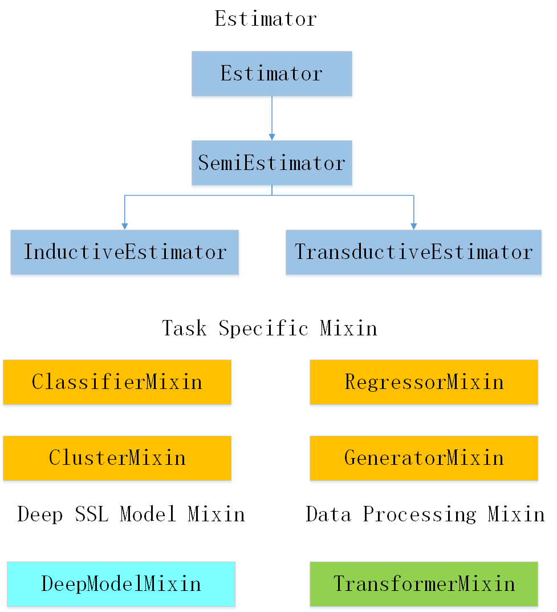

#  介绍

Semi-sklearn是一个有效易用的半监督学习工具包。目前该工具包包含30种半监督学习算法，其中基于传统机器学习模型的算法13种，基于深度神经网络模型的算法17种，可用于处理结构化数据、图像数据、文本数据、图结构数据4种数据类型，可用于分类、回归、聚类3种任务，包含数据管理、数据变换、算法应用、模型评估等多个模块，便于实现端到端的半监督学习过程，兼容目前主流的机器学习工具包scikit-learn和深度学习工具包pytorch，具备完善的功能，标准的接口和详尽的文档。

#  Base Structure

#  Data Management

#  Model

##  Classical  Method

###  Semi Supervised SVM

####  S3VM(TSVM) (√)

#### LapSVM(√)

###  Graphed Based Method

####  Label Propagation (√)

####  Label Spreading (√)

### Generative Method

####  Semi Supervised Gaussian Mixture Model (√)

###  Wrapper Method 

#### Self Training (√)

####  Co Training (√)

####  Tri Training (√)

###  Semi Supervised Cluster

#### Constrained K Means (√)

#### Constrained Seed K Means (√)

###  Semi Supervised Regression

####  CoReg (√)

###  Ensemble Learning

####  Semi Boost (√)

####  Assemble AdaBoost (√)

## Deep Learning Method

###  Consistency Regularization

####  Pi Model (√)

####  Temporal Ensembling (√)

#### Mean Teacher (√)

####  VAT (√)

####  UDA (√)

####  Ladder Network (√)

###  Pseudo Labeling

####  Pseudo Label (√)

####  S4L (√)

###  Generative Method

####  ImprovedGan (√)

####  SSVAE (√)

### Graph-based methods

####  SDNE (√)

####  GCN (√)

###  Hybrid Method

####  FixMatch (√)

####  MixMatch (√)

####  ReMixMatch (√)

#### FlexMatch (√)

####  ICT (√)

