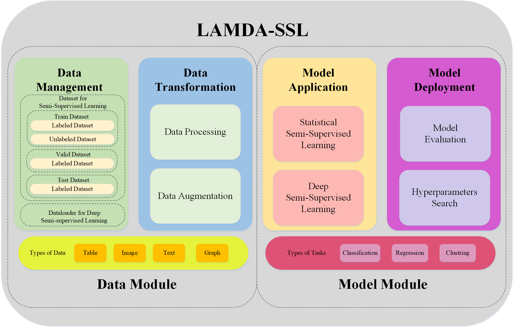
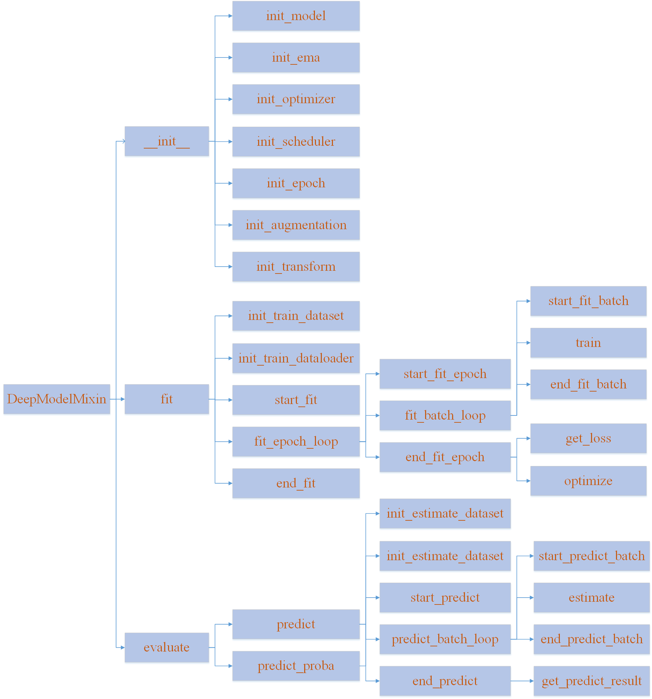
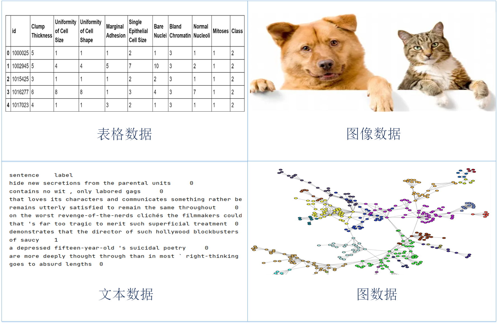
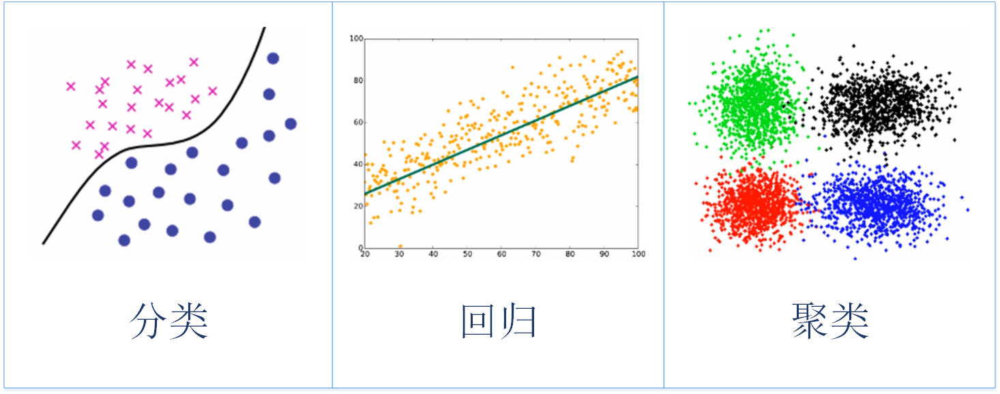
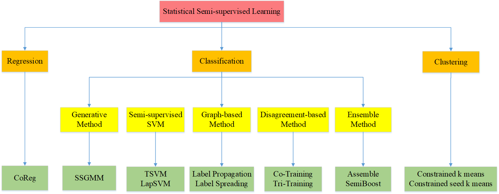
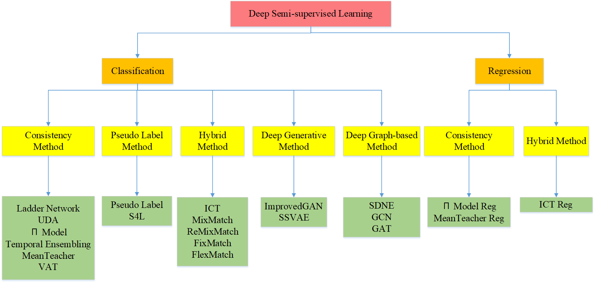
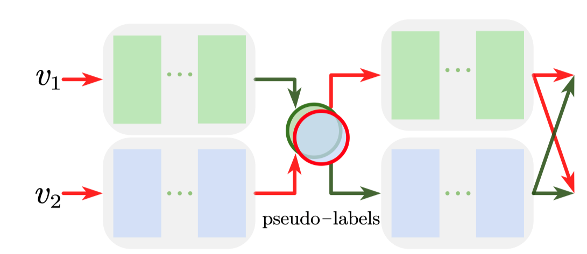
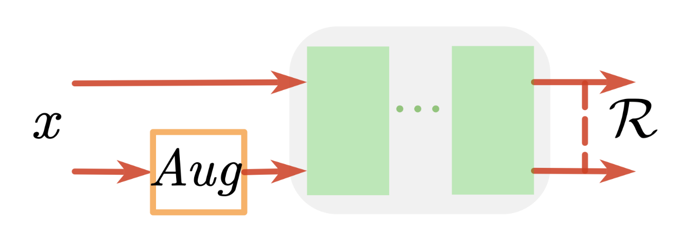
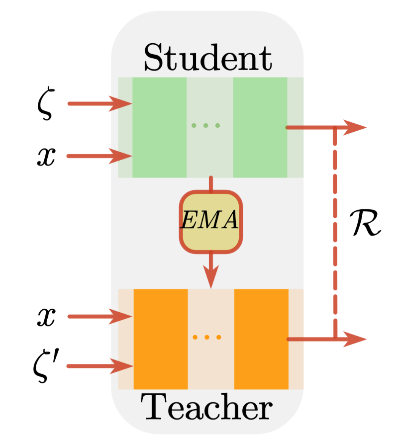
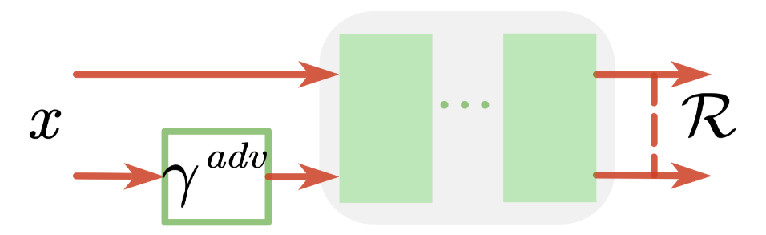

#  介绍

LAMDA-SSL是一个有效易用的半监督学习工具包。LAMDA-SSL拥有完善的功能，便捷的接口和详细的文档。它将统计机器学习算法和深度学习算法集成到同一个框架中，与流行的机器学习工具包 sklearn 和流行的深度学习工具包 pytorch 兼容。支持sklearn的Pipeline机制和参数搜索功能，也支持pytorch的GPU加速和分布式训练功能。目前，LAMDA-SSL包含30个半监督学习算法，其中包括12个基于统计机器学习模型的算法和18个基于深度学习模型的算法。LAMDA-SSL包含了多样化的数据处理和增广方法，可用于4类数据：表格、图像、文本、图。LAMDA-SSL还拥有多样化的模型评估标准，可用于3类任务：分类、回归和聚类。LAMDA-SSL包含数据管理、数据转换、模型应用、模型部署多个模块，便于完成端到端的半监督学习过程。

##  背景

机器学习（Machine Learning）致力于研究如何利用经验（数据）改善计算机系统性能，是人工 智能（Artificial Intelligence）领域的核心技术。二十一世纪以来，机器学习与人工智能技术得到了 越来越多的关注。一方面，在学术界，人工智能相关的国际顶级会议参会人数和投稿数量节节攀升， 各高校陆续建立人工智能学院，开展人工智能与机器学习相关的学科教学。另一方面，在工业界， 人工智能与机器学习技术促进各传统行业融合创新，全面提升了制造、农业、物流、金融、商务、 家居等领域的智能化水平，同时也催生出大量新兴产业，如智能机器人、无人驾驶汽车等。全球主 要国家陆续发布文件部署启动人工智能与机器学习相关工作。例如，2017 年，我国国务院印发的《新 一代人工智能发展规划》中提到“人工智能是引领未来的战略性技术，世界主要发达国家把发展人 工智能作为提升国家竞争力、维护国家安全的重大战略”，将人工智能的发展提升到国家科技战略层 面；2018 年，美国发布《国防部人工智能战略》将人工智能与机器学习技术作为未来国防军事的重 要发展方向。 典型机器学习算法利用训练数据来构建预测模型，训练数据通常由特征（Feature）和标注（Label） 两部分组成，例如，我们希望训练一个“猫”和“狗”的图像分类模型，则特征表示输入的图片像 素，标注表示每张图片属于猫还是狗。目前机器学习的研究主要关注在监督学习（Supervised  Learning）场景中，即收集大量有标注数据作为训练集提供给机器学习算法，算法通过拟合训练数 据得到训练好的模型，最终在未见环境中测试部署学习得到的模型。然而，在现实任务中，数据标 注往往耗费大量的人力、物力和财力，导致大量的数据标注是难以获取。例如，在计算机辅助医学 图像分析任务中，如果希望医学专家把影像中的病灶全都标识出来是几乎不可能的。但是，与此同 时，无标注数据往往是非常容易获得的，可以从医院收集到大量无标注的医学影像。因此，当标注 数据不足时，如何利用易于获取的无标注数据提升机器学习泛化性能成为机器学习领域一个关键性 的问题。 半监督学习（Semi-Supervised Learning，SSL）是利用无标注数据提升机器学习泛化性能的代表 性技术。自二十世纪九十年代提出以来，半监督学习一直是机器学习领域热门的研究方向。尤其是 近年来，随着深度学习的发展，模型复杂度逐渐增加，对标注数据的需求量与日俱增，半监督学习 的研究吸引了越来越多学术界和工业界的关注。例如，2017 年以来，在 ICML/NeurIPS/ICLR/CVPR  等人工智能和机器学习顶级会议上，半监督学习相关论文热度高居前三名；在《国家科学评论》 （National Science Review，NSR）2018 年 1 月份出版的机器学习专题期刊中，南京大学周志华教 授发表题为《A brief introduction to weakly supervised learning》的综述论文，指出能够利用无标注数 据辅助模型训练的半监督学习是机器学习领域亟待解决的问题；2019 年谷歌首席科学家 Vincent  Vanhoucke 发文称“能够利用少量标注数据及大量无标注数据训练机器学习模型的半监督学习革命 已经到来”。由此可见，研究半监督学习算法，降低机器学习模型对数据标注的需求，已经得到了学 术界和工业界的广泛关注，是人工智能与机器学习领域发展的关键研究问题。 尽管半监督学习近年来取得了巨大的进展，但是相较于经典的机器学习范式，半监督学习领域 的发展目前存在训练流程更复杂、算法实现更困难，参考文档更匮乏等诸多难题，导致非半监督学 习专业研究人员难以成功应用半监督学习算法解决实际问题，严重限制了半监督学习在更多现实任 务中的落地转化。因此，设计并实现便捷易用的半监督学习开源工具包，推动半监督学习算法在实 际场景中的进一步落地，是半监督学习领域走出实验室，并在工业界扎根落地的重要问题。

## 编写目的

半监督学习问题的复杂程度为工具包开发者造成了严重的知识与技能壁垒，导致目前依然缺乏便捷易用的半监督学习工具包。而为了满足在实际应用中用户对于半监督学习技术的需求，一个成熟易用的半监督学习工具包应该具备以下特点：
1）拥有先进的设计模式，同时从数据和算法角度考虑用户需求，使接口尽可能简单的同时功能尽可能强大；
2）应用范围应足够广泛，如同时支持表格、图像、文本、图等多种常见数据类型，同时支持分类、回归、聚类等多种常见任务类型；
3）拥有大量类型丰富且性能良好的算法供用户根据应用场景进行选择，可以同时支持统计机器学习算法和深度学习算法；
4）具备易用性和可拓展性，同时考虑不同用户群体的需求，针对低熟练度的用户提供便捷的使用方法、默认参数与接口，针对高熟练度的用户应支持灵活的模块更换与自定义；
5）通过大量实验验证工具包的有效性并比较算法在不同场景下的表现；
6）拥有丰富便捷的文档供用户使用与参考。

为了解决上述问题，我们开发了LAMDA-SSL这一设计模式先进、应用场景广泛、算法实现丰富、功能接口便捷、模型效果优秀、文档详尽完善的半监督学习工具包。目前该工具包涵盖30种半监督学习算法，其中基于统计机器学习模型的算法12种，基于深度神经网络模型的算法18种；包含多样的数据变换技术，可用于处理表格数据、图像数据、文本数据、图结构数据4种数据类型；包含多种模型评估方法，可用于分类、回归、聚类3种任务；包含数据管理、数据变换、模型应用、模型部署多个模块，便于实现端到端的半监督学习过程；兼容目前主流的机器学习工具包sklearn和深度学习工具包pytorch，支持sklearn的Pipeline机制和参数搜索功能，支持pytorch的GPU加速和分布式训练功能；为用户提供了便捷的工具包使用文档、详尽的API接口文档和丰富的半监督学习算法介绍文档；针对非专业用户提供了效果良好的默认参数，针对专业用户提供了便捷低耦合的模块修改与自定义接口。

LAMDA-SSL是目前包含算法数量最多、支持数据类型最多、支持任务最多、功能最丰富、接口最便捷、文档最详尽的半监督学习工具包，也是首个将统计机器学习算法与深度学习算法融入同一框架并同时兼容sklearn和pytorch的半监督学习工具包。

## 设计模式

LAMDA-SSL相较其他的半监督学习工具，在设计模式方面更加先进，具备耦合度低、灵活性高、可拓展性强、接口简单等优势。基于这些优势，LAMDA-SSL可以帮助业界使用者快速上手半监督学习技术，以近乎零成本在业务中享受半监督学习带来的性能提升。

LAMDA-SSL在设计上分为数据和模型两大模块（如图1所示），其中数据模块包含数据管理和数据变换，可用于表格、图像、文本和图四种数据类型，模型模块包含模型应用和模型部署，可用于分类、回归和聚类三种任务类型。

<div align=center>



<br>

图1: LAMDA-SSL的结构
</div>

### 数据模块

LAMDA-SSL的数据模块设计思想如图2所示。

<div align=center>


<br>

图2: LAMDA-SSL的数据模块

</div>


Dataset：在LAMDA-SSL中，所有数据集都继承自pytorch的Dataset类，同时支持直接使用或分批次加载使用。一个半监督数据集整体可以用一个SemiDataset类进行管理，SemiDataset类可以同时管理TrainDataset 、ValidDataset、TestDataset三个子数据集，分别对应了机器学习任务中的训练数据集、验证数据集和测试数据集，在底层数据集分为LabeledDataset和UnlabeledDataset两类，分别对应了半监督学习中的有标注数据与无标注数据。训练集往往同时包含有标注数据和无标注数据，因此TrainDataset同时管理LabeledDataset和UnlabeledDataset两个数据集。

Data Transformation：在sklearn中，数据转换器同时继承了sklearn中的BaseEstimator和TransformerMixin，前者为sklearn的估计器基类，后者为sklearn的数据转换器组件，这使得数据转换器普遍拥有fit()和transform()两个方法，其中fit()方法根据现有数据学习数据处理方法，transform()方法用于对新的数据进行转换，有很大一部分转换器可以省略fit()的过程直接进行数据转换，数据转换器还可以通过fit_transform()接口连续完成fit()和transform()过程。在sklearn中数据转换器拥有Pipeline机制，可以对多个处理步骤进行流式封装和管理，LAMDA-SSL中的数据处理和数据增广方法都通过继承Transformer类拥有了与sklearn的数据转换器相同的功能。在深度半监督学习中，由于数据量庞大且可能需要根据算法需求进行数据增广，通常不会在模型训练前处理完所有数据，而是需要在数据加载过程中完成对数据的处理，因此需要为数据集设置数据处理方式，对数据加载器加载到的数据自动进行处理。在工具包TorchVision中，对数据有transform、target_transform、transforms三种处理，分别为对X、对y、同时对X和y进行变换。在半监督学习中，这三种方式并不能通用于所有情况，因此LAMDA-SSL针对无标注样本、验证样本、测试样本增加了unlabeled_transform、valid_ transform和test_transform三种数据处理流程，并且针对需要在数据处理流程中进行数据增广的情况增加了pre_transform流程，pre_transform和transform分别表示在数据增广前后对数据的处理，例如对于CIFAR10数据集，原始数据类型为numpy.ndarray，在需要数据增广的情况下，需要先转换为图片类型，对图片类型数据进行增广后再转化为torch.Tensor类型，则numpy.ndarray到图片和图片到torch.Tensor的转换过程分别对应了pre_transform和transform两种变换，二者之间可以根据算法需求灵活添加用户指定的数据增广方法。

Dataloader：在深度半监督学习中，通常数据量较大，需要通过采样器分批次加载数据，即每一次迭代通过采样获得数据的下标，通过__getitem__()方法进行索引，并将索引后的数据组合成torch.Tensor作为该轮迭代的批数据。LAMDA-SSL针对LabeledDataset和UnlabeledDataset分别设计了LabeledDataloader和UnlabeledDataloader两种数据加载器，并用一个TrainDataloader类同时管理两种加载器用于半监督学习的训练过程。除同时包含两个加载器外，TrainDataloader还起到调节两个加载器之间关系的作用，如调节无标注数据与有标注数据的采样总量比例和每一批次数据中无标注数据与有标注数据的比例。

Data-specific Mixin：LAMDA-SSL可以处理表格数据、图像数据、文本数据、图数据四种现实应用中常见的数据类型，分别使用了四个与数据类型对应的组件TableMixin、VisionMixin、TextMixin、GraphMixin进行处理，对于一个数据集，可以继承与其数据类型对应的组件获得组件中的数据处理功能。例如CIFAR10同时继承了SemiDataset和VisionMixin两个模块，从而拥有了默认的图像数据处理功能。而对于自定义数据集，用户可以通过覆盖SemiDataset中的init_dataset()方法设置数据集的数据来源，通过覆盖Mixin模块的init_default_transform()方法设置默认的数据处理流程。

### 模型模块

LAMDA-SSL的模型模块设计思想如图3所示。

<div align=center>


<br>

图3: LAMDA-SSL的模型模块
</div>

Estimator：LAMDA-SSL参考了sklearn工具包的底层实现，所有算法都使用了与sklearn相似的接口。 在sklearn中学习器都继承了BaseEstimator这一父类，普遍存在fit()和predict()两个方法。fit()方法利用现有数据建立模型，对应了机器学习中的训练过程；predict()方法利用fit()过后的模型对新数据进行预测，对应了机器学习中的预测过程。LAMDA-SSL中的学习器通过继承SemiEstimator间接继承了sklearn中的BaseEstimator。由于sklearn中fit()方法的输入仅包含样本和标注两项，而在半监督学习中，模型在训练过程中需要同时使用有标注样本、标注和无标注样本三项数据，因此BaseEstimator的fit()方法接口不便于直接用于半监督学习算法。虽然sklearn中也实现了自训练方法和基于图的方法两类半监督学习算法，但是为了使用fit()方法的接口，sklearn将有标注样本与无标注样本结合在一起作为fit()方法的样本输入，并将无标注样本对应的标注记为-1，这种处理方式虽然可以适应BaseEstimator的接口，但是也存在局限性，尤其是在一些二分类场景下往往用-1表示有标注样本的负例，与无标注样本会发生冲突，因此针对半监督学习在BaseEstimatorr的基础上重新建立新类SemiEstimator具有必要性。SemiEstimator的fit()方法包含有标注样本、标注和无标注样本三部分输入，更好地契合了半监督学习的应用场景，避免了要求用户对数据进行组合处理，也避免了无标注样本与二分类负类样本的冲突，相较BaseEstimator使用起来更加便捷。半监督学习一般分为归纳式学习和直推式学习，区别在于是否直接使用待预测数据作为训练过程中的无标注数据。其中归纳式算法使用有标注数据和已知无标注数据训练一个学习器，用于对未知无标注数据的标注进行预测；而直推式学习使用有标注数据和已知无标注数据直接预测已知无标注数据的标注。直推式方法也可以通过在原有算法的基础上加入一些新的机制拓展为归纳式方法，从而可以对新的待预测样本进行预测。LAMDA-SSL中使用两个类InductiveEstimator和TransductiveEstimator分别对应了归纳式学习和直推式学习两类半监督学习范式，均继承了SemiEstimator类。其中InductiveEstimator的predict()方法需要输入新的待预测样本，而TransductiveEstimator的predict()方法通过一个BOOL类型参数‘Transductive’确定是否采用直推式预测，如果为True，则不再需要输入新的样本，直接输出直推式预测结果，否则触发拓展机制，对新输入的样本进行预测。

```python
from sklearn.base import BaseEstimator
from abc import ABC,abstractmethod
class SemiEstimator(ABC,BaseEstimator):
    @abstractmethod
    def fit(self,X,y,unlabeled_X):
        raise NotImplementedError(
            "The fit() method of SemiEstimator must be implemented."
        )
```

Task-specific Mixin：在sklearn中，为了使学习器针对不同的任务可以具备对应的功能，sklearn为学习器开发了与任务对应的组件，sklearn中的学习器往往会同时继承BaseEstimator和相应组件，从而使学习器除拥有基本的训练和预测功能外，还能拥有完成与组件对应的任务的功能。其中常用组件包括用于分类任务的ClassifierMixin、用于回归任务的RegressorMixin和用于聚类任务的ClusterMixin，在LAMDA-SSL中同样使用了这些组件。以TSVM算法为例，同时继承了TransductiveEstimator和ClassifierMixin两个模块，可用于直推式半监督分类任务。

Deep SSL Model Mixin：不同于统计机器学习中常用的sklearn框架，深度学习中经常使用pytorch框架，其接口与sklearn的接口相差较大，导致很难将深度学习算法和统计机器学习算法融入同一框架。另外pytorch各组件间存在较大的依赖关系，耦合度高。在数据方面，批采样器（BatchSampler）依赖于采样器（Sampler），采样器依赖于数据集（Dataset），数据加载器（Dataloader）同时依赖于批采样器、采样器和数据集；在模型方面，调度器（Scheduler）依赖于优化器（Optimizer），优化器和分布式训练模块（Parallel）又依赖于神经网络模型(Network)。Pytorch的逻辑和接口相较sklearn较为复杂，对用户自身要求较高。为了解决统计机器学习方法和深度学习方法难以融合于相同框架的问题，LAMDA-SSL用DeepModelMixin这一组件使基于pytorch开发的深度半监督学习模型拥有了与统计半监督学习方法相同的接口和使用方式，LAMDA-SSL中的深度半监督学习算法都继承了这一组件。DeepModelMixin对pytorch各模块进行了解耦，便于用户独立更换或自定义深度学习中的数据加载器、网络结构、优化器等模块，而不需要考虑更换对其他模块造成的影响，DeepModelMixin会自动处理这些影响，使用户可以像调用统计半监督学习算法一样便捷地调用深度半监督学习算法。另外DeepModelMixin不仅支持用户更换深度学习中的组件，还对深度半监督学习模型的训练过程进行了解构，根据数据处理、前向传播、计算损失、模型优化等过程细分为了多个模块，便于用户对已有深度半监督学习算法进行调整或自定义新的深度半监督学习算法，避免了大量重复性工作。DeepModelMixin的结构如图4所示。

<div align=center>

 

<br>

图4: LAMDA-SSL的DeepModolMixin
</div>

Task-specific Evaluation：LAMDA-SSL针对分类、回归、聚类三个任务提供了多样化的评估指标，用于对模型的评估和监控。LAMDA-SSL的模型评估有两种形式，第一种是在得到预测结果后调用评估模块，第二种是在学习器初始化时直接将评估指标作为学习器的属性，可以使模型在预测结束后直接完成评估过程，且对于深度半监督学习算法可以在模型训练过程中进行实时评估和反馈。针对三个不同任务的评估指标分别继承了ClassifierEvaluation、RegressorEvaluation、ClusterEvaluation三个基类。

## 应用场景

LAMDA-SSL应用场景广泛，可支持表格、图像、文本和图四种数据类型（如图5所示）以及分类、回归、聚类三种任务类型（如图6所示），能够在各种真实业务中发挥半监督算法的价值。

### 数据场景


<div align=center>

<br>
图5: LAMDA-SSL的数据场景
</div>

表格数据是最基本的数据形式，其特征间和样本间均不存在空间与时间上的联系，统计机器学习算法中很大一部分都是针对表格数据而设计的，这一数据类型在用户画像、股票分析、网络异常检测等应用中广泛存在。对于表格数据，sklearn中的preprocessing模块已经提供了足够丰富的处理方法，如‘StandardScaler’、‘MinMaxScaler’、‘MaxAbsScaler’等，LAMDA-SSL在其基础上进行了补充。TableMixin模块提供了对表格数据的默认处理方式，将‘StandardScaler’作为默认预变换方法，在预变换后根据需求进行数据增广，如果应用于深度学习，再将数据转换为torch.Tensor形式。为了对表格数据进行数据增广，LAMDA-SSL实现了增广方法‘Noise’，即对标准化后的数据施加服从正态分布的噪声扰动，扰动幅度由正态分布的标准差控制。

图像数据是深度学习领域最常用的数据类型之一，以张量形式被用于学习过程，其特征间存在空间位置上的联系，这一数据类型在医疗影像、自动驾驶、安防识别等领域都有广泛的应用。对于图像数据，TorchVision工具包提供了部分图像数据处理方法，如裁剪、旋转、锐化等，LAMDA-SSL在其基础上进行了补充。VisionMixin模块提供了对图像数据的默认处理方式，在预变换过程中将以其他形式存储的数据转化为图片格式，在预变换后根据需求进行数据增广，最后再由图像转化为模型可处理的数据类型。为了对图像数据进行数据增广，LAMDA-SSL提供了多种图像增广方法，包括‘RandomCrop’、‘RandomHorizontalFlip’等用于弱增广的方法以及‘RandAugment’、‘Cutout’等用于强增广的方法。

文本数据是深度学习领域的另一种具有广泛应用场景的数据类型，带动了自然语言处理领域的迅速发展，文本往往通过各种嵌入方式被转化为向量，且数据特征间存在时序上的联系，这一数据类型在机器翻译、情感分析、信息检索等方面存在较为广泛的应用。对于文本数据，TorchText工具包提供了部分文本数据处理方法，如分词、词嵌入等，LAMDA-SSL在其基础上进行了补充。TextMixin模块提供了对文本数据的默认处理方式，首先在预处理阶段对文本进行分词，之后根据需求对文本进行数据增广，最后调整文本长度、通过字典将token转化为索引，在深度学习中由索引组成Tensor作为模型的输入，并在模型中根据索引得到词嵌入。LAMDA-SSL提供了多种文本增广方法，包括随机删除、交换等用于弱增广的方法和以及‘TF-IDF_Replacement’这一强增广方法，该方法的基本思想为通过TF-IDF值判断单词对于文本的重要程度，而替换不重要的单词不会对文本语义产生过大影响。

图数据是近年来深度学习广泛关注的方向，不同于其他数据类型只在特征间存在空间与时间上的联系，图数据要考虑样本间的空间关系，即图的结构信息，这一数据类型在社交网络、药物发现、推荐系统等领域有着重要的应用前景。对于图数据，LAMDA-SSL以
torch_geometric中的图数据形式为标准，将图的结构信息、结点特征信息、结点标注信息等封装在数据集中，并通过mask的形式将结点划分为训练集、验证集和测试集，LAMDA-SSL在此基础上对训练集进行了进一步划分，增加了‘labeled_mask’和‘unlabeled_mask’。GraphMixin模块将对图中结点特征的标准化作为了默认的数据变换方式，并提供了‘Graph Diffusion Convolution’[36]、‘SVD Feature Reduction’、‘GCNNorm’等变换方法，通过在图中删除结点或边进行数据增广。

<!-- 让表格居中显示的风格 -->
<style>
.center 
{
  width: auto;
  display: table;
  margin-left: auto;
  margin-right: auto;
}
</style>

<div align=center class="center">

表1: LAMDA-SSL中的数据处理与数据增广

|数据类型|数据处理|数据增广|
|:-:|:-:|:-:|
|表格|StandardScaler<br>MinMaxScaler<br>MaxAbsScaler|Noise|
|图像|Resize<br>Normlization|RandomCrop<br>RandomHorizontalFlip<br>AutoContrast<br>Brightness<br>Color<br>Contrast<br>Rotate<br>Sharpness<br>Equalize<br>Solarize<br>Posterize<br>Invert<br>ShearX<br>ShearY<br>TranslateX<br>TranslateY<br>RandAugment<br>Cutout<br>CutoutAbs<br>Mixup|
|文本|Tokenizer<br>Truncate<br>PadSquence<br>AdjustLength<br>Vocab<br>Vectors<br>Glove<br>FastText<br>CharNGram|RandomDeletion<br>RandomSwap<br>TFIDFReplacement|
|图|GCNNorm<br> GDC<br> SVDFeatureReduction<br> NormalizeFeatures|DropNodes<br>DropEdges|

</div>

### 任务场景

<div align=center>
 
<br>
图6: LAMDA-SSL的任务场景
</div>

分类任务是机器学习领域最基本的任务之一，模型的预测结果为离散值，常用于行为预测、目标识别、内容过滤等场景。对于分类任务，LAMDA-SSL提供了大量算法，以及‘Accuracy’、‘Recall’、‘Precision’、‘F1 Score’等多种评估指标，这些指标可以利用真实标注、模型预测的硬标注以及软标注完成对模型表现的评估。

回归任务是机器学习领域另一基本任务，模型的预测结果为连续值，常用于价格预测、销量预测和信用评分等场景。目前半监督回归领域的相关研究还未成熟，可用算法较少，尤其是缺乏深度学习算法。LAMDA-SSL中除了包含半监督回归算法CoReg外，还对部分用于分类的深度半监督学习算法进行了拓展，使他们能够适用于回归任务，并提供了绝对误差、均方误差、均方对数误差多种评估指标。

聚类任务是无监督学习最经典的应用，其无法利用真实标注建立特征空间与目标空间的联系，在异常检测、客户管理、价值组合等不存在真实标注的场景下有着广泛应用。对于聚类任务，LAMDA-SSL中的算法都在原有无监督聚类的基础上引入了部分监督信息来引导聚类过程，使聚类结果与真实标注更加吻合。LAMDA-SSL提供了两类聚类评估指标，第一类是外部指标，即存在正确的参考结果，通过比较聚类结果与参考结果的差异评估模型表现，更适用于数据本身存在标注的情况，如‘Fowlkes Mallows Score’[38]、‘Rand Score’[39]等，以聚类结果和参考结果为输入；第二类是内部指标，不依赖于参考结果，仅根据样本自身特征和聚类结果评估模型表现，如‘Davies Bouldin Score’[37]、‘Silhouette Score’等，以聚类结果和样本特征为输入。

<div align=center class="center">

表2: LAMDA-SSL中的评估指标

|任务类型|评估指标|
|:-:|:-:|
|分类|Accuracy<br>Top k Accuracy<br>Recall<br>Precision<br>F1 Score<br>AUC<br>Confusion Matrix|
|回归|Mean Absolute Error<br>Mean Squared Error<br>Mean Squared Log Error|
|聚类|Davies Bouldin Score<br>Fowlkes Mallows Score<br>Jaccard Score<br>Rand Score<br>Silhouette Score|

</div>

## 算法实现

LAMDA-SSL实现了多达30中半监督学习算法，其中包括了12种统计机器学习算法和18种深度学习算法，为用户提供了多样化的选择。

### 基于统计机器学习模型的半监督学习算法

LAMDA-SSL包含12种基于统计机器学习模型的半监督学习算法（如图7所示），其中用于分类任务的算法包括生成式方法SSGMM，半监督支持向量机类方法TSVM、LapSVM，基于图的方法Label Propagation、Label Spreading，基于分歧的方法Co-Training、Tri-Training，集成方法SemiBoost、Assemble；用于回归任务的算法包括CoReg；用于聚类任务的算法包括Constrained K Means、Constrained Seed K Means。

<div align=center>

 

<br>

图7: LAMDA-SSL中的统计机器学习算法
</div>

生成式半监督学习方法基于生成式模型，其假设数据由一潜在的分布生成而来，而半监督生成式方法将无标注数据的标注视为隐变量，采用期望-最大化（EM）算法进行极大似然估计求解。SSGMM即半监督高斯混合模型，假设数据由一个高斯混合模型生成，即样本特征的边缘分布可以表示为若干个高斯分布混合在一起的结果，且通过混合参数为每个高斯分布赋予一个权重，对于无标注样本，可以将高斯混合成分与类别一一对应，并分类为权重最高的高斯混合成分对应的类别。

半监督支持向量机是支持向量机算法在半监督学习领域的推广。半监督支持向量机引入了低密度假设，即学习得到的超平面除了需要基于有标注样本使分类间隔尽可能大，也要尽可能穿过所有样本分布的低密度区域，从而合理利用无标注样本。TSVM是最基础的半监督支持向量机方法，通过在迭代过程中不断交换可能分错的异类无标注样本对的伪标注完成学习。LapSVM引入了流形正则化，构建图模型并通过Laplace正则项引导模型对于图中临近样本的预测结果尽可能一致，从而利用样本在流形上的分布使无标注样本参与学习过程。

基于图的半监督学习方法将数据集表示为一个图结构模型，图中同时存在有标注结点与无标注结点，因此基于图的半监督学习可以被视为标注在图中传播的过程。Label Propagation算法是其中最基础的方法，以Laplace正则项为优化目标，求解无标注数据的标注使优化目标取最小值。Label Spreading算法在Label Propagation算法的基础上，取消了在传递过程中模型对有标注样本的预测结果必须等于其真实标注这一限制，而是对错误结果进行了惩罚。

基于分歧的半监督学习方法需要生成具有显著分歧、性能尚可的多个学习器，利用学习器之间的分歧对无标注数据加以利用，这类方法较少受到模型假设、损失函数非凸性和数据规模问题的影响，学习方法简单有效、理论基础相对坚实、适用范围较为广泛。Co-Training算法使用两个基学习器，通过不同数据视图产生分歧，利用多视图的相容互补性互相促进训练。Tri-training使用三个基本学习器，通过“少数服从多数”产生伪标注，并将学习器进行集成产生最终预测结果。

集成学习方法将多个弱学习器结合起来，提高了模型的可靠性。在半监督学习领域，由于无标注数据的加入，单一学习器的不稳定性进一步加剧，对有效的集成学习方法有更强的依赖。Assemble即适应性半监督集成方法，是适应性提升（AdaBoost）方法的拓展，每一轮迭代通过当前集成学习器为无标注样本赋予伪标注，并根据模型预测结果与样本当前标注的差异自适应地调整样本采样权重。SemiBoost进一步考虑了样本间的关系，基于图半监督学习方法，指出应该对样本间相似度较高但目前集成学习器的预测结果不一致性较大的样本设置更大的采样权重。

半监督回归算法相较于分类算法更难提出合理的假设，研究半监督回归相较半监督分类有着更多的困难，目前这一领域还有待更多的研究成果。CoReg将Co-Training算法引入了回归任务，由于在回归任务中难以像分类任务一样通过类别分布得到自信度，CoReg将加入一个无标注样本前后均方误差的差异作为自信度的评估标准，从而完成了Co-Training的训练过程。

半监督聚类算法在原本无监督聚类的基础上引入了监督信息以辅助无监督学习的过程，其中监督信息不一定是有标注数据，也可能是其他与真实标注有关的知识。Constrained k-means在k-means聚类算法的基础上引入了称为必连（Must Link）和勿连（Connot Link）的约束作为监督信息，其中必连约束限制了一些样本必须属于同一聚类簇，而勿连约束限制了一些样本必须属于不同的聚类簇，且必连约束与勿连约束存在传递机制。Constrained Seed k-means不同于Constrained k-means将必连和勿连约束作为监督信息，而是直接将少量数据标注作为监督信息。


### 基于深度学习模型的半监督学习算法

LAMDA-SSL包含18种基于深度模型的半监督学习算法（如图8所示）：其中用于分类任务的算法包括一致性正则方法Ladder Network、Π Model、Temporal Ensembling、Mean Teacher、VAT、UDA，基于伪标注的方法Pseudo Label、S4L，混合方法ICT、MixMatch、ReMixMatch、FixMatch、FlexMatch，生成式方法ImprovedGAN、SSVAE，基于深度图模型的方法SDNE、GCN、GAT；用于回归任务的算法包括一致性正则方法Π Model Reg、Mean Teacher Reg和混合方法ICT Reg。

<div align=center>

 

<br>

图8: LAMDA-SSL中的深度机器学习算法
</div>

一致性正则方法基于一致性假设，即假设对于样本增加一定程度的扰动，其预测结果应尽可能保持不变，可以利用大量无标注数据提升模型对于噪声的稳健性。Ladder network采用了对称的自编码器结构，将数据在加噪的情况下编码后的解码结果与不加噪情况下的编码结果间每一隐层的不一致性作为无监督损失。UDA即无监督数据增广，对无标注数据进行一次数据增广之后比较增广前后模型的数据的预测结果，利用均方误差损失计算一致性正则项作为无监督损失。Π Model对数据进行两次随机数据增广，并分别将两次增广的结果作为神经网络模型的输入进行预测，将预测结果的不一致性作为无监督损失。Temporal Ensembling对Π Model进行了一些改进，将两次增广后的预测结果中的一次改为对历史伪标注的指数移动平均（EMA），缓解了模型对历史信息的遗忘并减少了算力消耗。Mean Teacher借助了知识蒸馏的思想，且教师模型并非是复杂模型，而是在学生模型的基础上对模型参数进行指数移动平均。VAT不同于其他方法对数据增加随机噪声，而是对数据增加对抗噪声，使模型在数据受一定限制条件下噪声影响时的最坏表现不会太差。

基于伪标注的方法通过为无标注数据赋以伪标注使无标注数据对学习过程产生影响。且由于模型对于不同样本的自信度不同，基于伪标注的方法通常取自信度较高的样本参与训练过程。Pseudo Label方法设置了一个自信度阈值，在每一次迭代中，对于无标注数据选择自信度高于阈值的部分计算交叉熵损失作为无监督损失。S4L利用了自监督技术，利用旋转等方式构造自监督任务，且目标任务与自监督任务共享同一表示层，以自监督标注为伪标注，使模型可以利用无标注数据学到更好的隐层表示。

混合方法不局限于仅使用一类技术，而是将一致性、伪标注技术进行结合，各取所长，从而达到更好的训练效果。由于同时使用了多种技术，混合方法往往更加具备通用性。ICT即插值一致性训练，通过Mixup数据增广方法对数据与预测结果进行线性插值，将模型对插值后样本的预测结果与模型对原始数据的预测结果的插值之间的不一致性作为无监督损失。MixMatch也用了Mixup方法，但不同于ICT仅对无标注数据的样本与伪标注进行Mixup，MixMatch将有标注数据与无标注数据混合在一起，并对混合后的数据样本及其标注或伪标注进行了Mixup。ReMixMatch是MixMatch的改进版本，其引入了两种技术：分布对齐和增广锚定，分布对齐目的在于使模型对于无标注数据预测得到的伪标注应与有标注数据的标注有相同的概率分布，增广锚定是为了使模型适应更强的数据增广，使伪标注不会随增广强度增大而改变。FixMatch对样本进行了强数据增广与弱数据增广，并将模型对弱增广数据与强增广数据预测结果的不一致性作为无监督损失。FlexMatch是对于FixMatch的改进，并注重于解决半监督学习中各类别间的不公平现象，对不同类别采用不同的阈值进行样本筛选，缓解了因学习难度不同造成的类别不平衡现象。

深度生成式方法利用真实数据对数据分布进行建模，并且可以利用这一分布生成新的数据。不同于经典的生成式方法，深度生成式方法基于深度神经网络生成数据，其中大部分工作是对生成对抗网络（GAN）和变分自编码器（VAE）的推广。ImprovedGAN的判别器不同于GAN模型，不仅需要判断样本是真实样本还是生成样本，还要完成对真实样本的分类。SSVAE将VAE模型的编码器分为了两个部分，第一部分对原始数据进行编码得到样本标注的概率分布，第二部分将原始数据与伪标注共同作为输入得到隐变量的概率分布。

基于图深度学习的方法针对原始数据是图数据的情况。图中实例之间并非独立关系，而是通过边相连。现实中的图数据任务往往都是半监督的，即图中同时存在有标注结点与无标注结点。SDNE是一种可以在图中结点没有特征表示，仅有图结构信息的情况下学习图中结点嵌入向量的半监督图深度学习方法，该方法采用了自编码器结构，通过将结点的邻接向量作为特征输入自编码器学习得到结点的嵌入表示。GCN更适用于结点本身存在特征的情况，可以同时利用结点自身的特征信息和图结构信息进行学习，通过图卷积将近邻结点的信息进行汇集并更新结点表示。GAT和GCN同样适用于结点本身存在特征的情况，不同于GCN的图卷积操作，GAT引入了注意力机制，每次迭代根据当前结点自身的表示和近邻结点的的表示计算注意力权重，并利用权重对当前结点的表示进行更新。

# 使用教程

## 数据导入

以CIFAR10数据集为例,首先导入CIFAR10类。

```python
from LAMDA_SSL.Dataset.Vision.CIFAR10 import CIFAR10
```

实例化一个封装好的CIFAR10数据集,相当于一个数据管理器，root参数表示数据集存放地址，labeled_size参数表示有标注样本的数量或比例，stratified参数表示对数据集进行划分时是否要按类别比例划分，shuffle参数表示是否需要对数据集进行打乱，download参数表示是否需要下载数据集。

```python
dataset=CIFAR10(root='..\LAMDA_SSL\Download\cifar-10-python',labeled_size=4000,stratified=False,shuffle=True,download=False)
```

可以通过访问封装数据集参数的方法获取数据集中的具体数据。

```python
labeled_X=dataset.labeled_X
labeled_y=dataset.labeled_y
unlabeled_X=dataset.unlabeled_X
unlabeled_y=dataset.unlabeled_y
test_X=dataset.test_X
test_y=dataset.test_y
```

## 数据变换

以RandAugment[40]数据增广为例，首先导入RandAugment类。

```python
from LAMDA_SSL.Augmentation.Vision.RandAugment import RandAugment
```

对RandAugment进行实例化，参数n为进行随机增广的次数，表示增广的幅度，num_bins表示幅度划分的级别数。这里设置将增广幅度划分为10个等级，并采用第10级的增广增广2次。

```python
augmentation=RandAugment(n=2,m=10,num_bins=10)
```

之后输入数据完成数据增广。有两种方式：可以调用fit_transform()方法：

```python
augmented_X=augmentation.fit_transform(X)
```

也可以直接调用__call__()方法：

```python
augmented_X=augmentation(X)
```

## Pipeline机制

LAMDA-SSL支持Pipeline机制，将多种数据处理方式以流水线的形式用于数据处理。
如在FixMatch算法中的强数据增广和弱数据增广。

```python
from sklearn.pipeline import Pipeline
from LAMDA_SSL.Augmentation.Vision.RandomHorizontalFlip import RandomHorizontalFlip
from LAMDA_SSL.Augmentation.Vision.RandomCrop import RandomCrop
from LAMDA_SSL.Augmentation.Vision.RandAugment import RandAugment
from LAMDA_SSL.Augmentation.Vision.Cutout import Cutout

weak_augmentation = Pipeline([('RandomHorizontalFlip', RandomHorizontalFlip()),
                                ('RandomCrop', RandomCrop(padding=0.125, padding_mode='reflect')),
                                ])

strong_augmentation = Pipeline([('RandAugment', RandAugment(n=2, m=5, num_bins=10, random=True)),
                                  ('Cutout', Cutout(v=0.5, fill=(127, 127, 127))),
                                  ('RandomHorizontalFlip', RandomHorizontalFlip()),
                                  ('RandomCrop', RandomCrop(padding=0.125, padding_mode='reflect')),
                                  ])
```

可以直接调用fit_transform()方法完成数据处理。

```python
weak_augmented_X=weak_augmentation.fit_transform(X)
strong_augmented_X=strong_augmentation.fit_transform(X)
```

## 训练一个归纳式统计半监督分类模型

以SSGMM算法为例，首先导入BreastCancer数据集，参数‘labeled_size’表示有标注数据集的数量(整数)或比例(浮点数)，参数‘stratified’和‘shuffle’分别表示数据集划分时是否需要按类别比划分和是否需要将数据打乱。

```python
from LAMDA_SSL.Dataset.Tabular.BreastCancer import BreastCancer
dataset=BreastCancer(test_size=0.3,labeled_size=0.1,stratified=True,shuffle=True,random_state=0)
```

对数据进行预处理。

```python
pre_transform=dataset.pre_transform
pre_transform.fit(np.vstack([labeled_X, unlabeled_X]))
labeled_X=pre_transform.transform(labeled_X)
unlabeled_X=pre_transform.transform(unlabeled_X)
test_X=pre_transform.transform(test_X)
```

调用并初始化SSGMM模型。

```python
from LAMDA_SSL.Algorithm.Classification.SSGMM import SSGMM

model=SSGMM(tolerance=0.000001)
```

调用fit()方法进行模型训练。

```python
model.fit(X=labeled_X,y=labeled_y,unlabeled_X=unlabeled_X)
```

对测试数据进行预测。

```python
pred_y=model.predict(X=test_X)
```

可以从评估模块调用准确率评估指标对模型表现进行评估。

```python
from LAMDA_SSL.Evaluation.Classifier.Accuracy import Accuracy
performance=Accuracy().scoring(test_y,result)
```

也可以通过‘predict_proba’方法得到样本属于不同类别的概率。

```python
score_y=model.predict_proba(X=test_X)
```

可以从评估模块调用AUC评估指标对模型表现进行评估。

```python
from LAMDA_SSL.Evaluation.Classifier.AUC import AUC
performance=AUC(multi_class='ovo').scoring(test_y,pred_y,score_y)
```

## 训练一个直推式统计半监督分类模型

以TSVM算法为例，首先导入BreastCancer数据集，参数‘labeled_size’表示有标注数据集的数量(整数)或比例(浮点数)，参数‘stratified’和‘shuffle’分别表示数据集划分时是否需要按类别比划分和是否需要将数据打乱。

```python
from LAMDA_SSL.Dataset.Tabular.BreastCancer import BreastCancer
dataset=BreastCancer(labeled_size=0.1, stratified=True,
shuffle=True)
labeled_X=dataset.labeled_X
labeled_y=dataset.labeled_y
unlabeled_X=dataset.unlabeled_X
unlabeled_y=dataset.unlabeled_y
```

通过sklearn的数据标准化模块对样本进行预处理。

```python
from sklearn import preprocessing
pre_transform=preprocessing.StandardScaler()
pre_transform.fit(np.vstack([labeled_X, unlabeled_X]))
labeled_X=pre_transform.transform(labeled_X)
unlabeled_X=pre_transform.transform(unlabeled_X)
```

之后导入并初始化TSVM算法，其中参数‘Cl’表示初始状态下有标注样本的权重，参数‘Cu’ 初始状态下无标注样本的权重，参数‘kernel’表示算法中使用的核函数。

```python
from LAMDA_SSL.Algorithm.Classification.TSVM import TSVM
model=TSVM(Cl=15,Cu=0.0001,kernel='linear')
```

通过fit()方法就可以完成模型训练。

```python
model.fit(X=labeled_X,y=labeled_y,unlabeled_X=unlabeled_X)
```

通过predict()方法得到预测结果，由于TSVM为直推式模型，因此predict()方法可以不输入新的数据。

```python
pred_y=model.predict()
```

最后可以从评估模块调用准确率评估指标对模型表现进行评估。

```python
from LAMDA_SSL.Evaluation.Classifier.Accuracy import Accuracy
score=Accuracy().scoring(unlabeled_y,pred_y)
```

也可以选择将直推式方法拓展为归纳式方法，需要将参数‘Transductive’设置为False。

```python
test_X=dataset.test_X
pred_y=model.predict(X=test_X, Transductive=False)
from LAMDA_SSL.Evaluation.Classifier.Accuracy import Accuracy
score=Accuracy().scoring(test_y,pred_y)
```

## 训练一个多视图统计半监督分类模型

以Co-Training算法为例，首先导入BreastCancer数据集，参数‘labeled_size’表示有标注数据集的数量(整数)或比例(浮点数)，参数‘stratified’和‘shuffle’分别表示数据集划分时是否需要按类别比划分和是否需要将数据打乱。

```python
from LAMDA_SSL.Dataset.Tabular.BreastCancer import BreastCancer
dataset=BreastCancer(labeled_size=0.1, stratified=True,
shuffle=True)
labeled_X=dataset.labeled_X
labeled_y=dataset.labeled_y
unlabeled_X=dataset.unlabeled_X
unlabeled_y=dataset.unlabeled_y
```

通过sklearn的数据标准化模块对样本进行预处理。

```python
from sklearn import preprocessing
pre_transform=preprocessing.StandardScaler()
pre_transform.fit(np.vstack([labeled_X, unlabeled_X]))
labeled_X=pre_transform.transform(labeled_X)
unlabeled_X=pre_transform.transform(unlabeled_X)
```

需要对数据进行多视图划分。

```python
from LAMDA_SSL.Split.ViewSplit import ViewSplit

split_labeled_X = ViewSplit(labeled_X, shuffle=False)
split_unlabeled_X = ViewSplit(unlabeled_X, shuffle=False)
split_test_X = ViewSplit(test_X, shuffle=False)
```

之后导入并初始化Co-Training算法。

```python
from sklearn.svm import SVC
from LAMDA_SSL.Algorithm.Classification.Co_Training import Co_Training
SVM=SVC(C=1.0,kernel='linear',probability=True,gamma='auto')
model=Co_Training(base_estimator=SVM,s=(len(labeled_X)+len(unlabeled_X))//10)
```

通过fit()方法就可以完成模型训练，可以将不同视图的数据分别传入。

```python
model.fit(X=labeled_X,y=labeled_y,unlabeled_X=unlabeled_X)
```

也可以以字典或列表形式将不同视图下的数据通过一个参数进行传递。

```python
model.fit(X=labeled_X,y=labeled_y,unlabeled_X=unlabeled_X)
```

通过predict()方法得到预测结果。

```python
pred_y=model.predict(X=test_X)
```

最后可以从评估模块调用准确率评估指标对模型表现进行评估。

```python
from LAMDA_SSL.Evaluation.Classifier.Accuracy import Accuracy
score=Accuracy().scoring(test_y,pred_y)
```

## 训练一个统计半监督回归模型

以CoReg算法为例，首先导入Boston数据集，参数‘labeled_size’表示有标注数据集的数量(整数)或比例(浮点数)，参数‘stratified’和‘shuffle’分别表示数据集划分时是否需要按类别比划分和是否需要将数据打乱。

```python
from LAMDA_SSL.Dataset.Tabular.Boston import Boston
dataset=Boston(labeled_size=0.3,test_size=0.1,stratified=False,shuffle=True,random_state=0,default_transforms=True)
labeled_X=dataset.labeled_X
labeled_y=dataset.labeled_y
unlabeled_X=dataset.unlabeled_X
unlabeled_y=dataset.unlabeled_y
test_X=dataset.test_X
test_y=dataset.test_y
```

通过sklearn的数据标准化模块对样本进行预处理。

```python
from sklearn import preprocessing
pre_transform=preprocessing.StandardScaler()
pre_transform.fit(np.vstack([labeled_X, unlabeled_X]))
labeled_X=pre_transform.transform(labeled_X)
unlabeled_X=pre_transform.transform(unlabeled_X)
```

之后导入并初始化CoReg算法。

```python
from LAMDA_SSL.Algorithm.Regression.CoReg import CoReg
model=CoReg()
```

通过fit()方法就可以完成模型训练。

```python
model.fit(X=labeled_X,y=labeled_y,unlabeled_X=unlabeled_X)
```

通过predict()方法得到预测结果。

```python
pred_y=model.predict(X=test_X)
```

最后可以从评估模块调用均方误差评估指标对模型表现进行评估。

```python
from LAMDA_SSL.Evaluation.Regressor.Mean_Squared_Error import Mean_Squared_Error

performance = Mean_Squared_Error().scoring(test_y, pred_y)
```

## 训练一个统计半监督聚类模型

以Constrained Seed k Means和Constrained k Means算法为例。首先导入Wine数据集。

```python
from LAMDA_SSL.Dataset.Tabular.Wine import Wine
dataset = Wine(labeled_size=0.2, stratified=True, shuffle=True,random_state=0,default_transforms=True)
labeled_X=dataset.labeled_X
labeled_y=dataset.labeled_y
unlabeled_X=dataset.unlabeled_X
unlabeled_y=dataset.unlabeled_y
```

通过sklearn的数据标准化模块对样本进行预处理。

```python
from sklearn import preprocessing
pre_transform=preprocessing.StandardScaler()
pre_transform.fit(np.vstack([labeled_X, unlabeled_X]))
labeled_X=pre_transform.transform(labeled_X)
unlabeled_X=pre_transform.transform(unlabeled_X)
```

之后导入并初始化Constrained Seed k Means算法。

```python
from LAMDA_SSL.Algorithm.Clustering.Constrained_Seed_k_means import Constrained_Seed_k_means

model = Constrained_Seed_k_means(k=3)
```

进行模型训练。

```python
model.fit(X=labeled_X,y=labeled_y,unlabeled_X=unlabeled_X)
```

也可以导入并初始化Constrained k means算法。

```python
from LAMDA_SSL.Algorithm.Clustering.Constrained_k_means import Constrained_k_means

model = Constrained_k_means(k=3)
```

但对于Constrained k Means算法，其监督信息为必连和勿连约束。如果有用户提供的约束信息，可以直接进行训练。

```python
model.fit(X=X,ml=ml,cl=cl)
```

如果没有用户提供的约束信息，仅有部分有标注数据，可以利用数据标注构约束信息并进行训练。

```python
ml=[]
cl=[]
for i in range(labeled_X.shape[0]):
    for j in range(i+1,labeled_X.shape[0]):
        if labeled_y[i]==labeled_y[j]:
            ml.append({i,j})
        else:
            cl.append({i,j})
model.fit(X=np.vstack((labeled_X,unlabeled_X)), ml=ml,cl=cl)
```

或是直接以标准接口的形式输入数据，模型内部会自动将有标注数据转化为约束信息。

```python
model.fit(X=labeled_X,y=labeled_y,unlabeled_X=unlabeled_X)
```

通过predict()方法得到聚类结果。

```python
pred_y=model.predict()
```

对于聚类的结果可以使用外部指标或内部指标进行评估，前者的评估需要可参考的聚类结果（如真实标注），如Fowlkes Mallows Score，后者的评估需要样本特征，如Davies Bouldin Score。

```python
from LAMDA_SSL.Evaluation.Cluster.Fowlkes_Mallows_Score import Fowlkes_Mallows_Score
from LAMDA_SSL.Evaluation.Cluster.Davies_Bouldin_Score import Davies_Bouldin_Score

outer_performence=Fowlkes_Mallows_Score()(y_true=np.hstack([labeled_y, unlabeled_y]),clusters=pred_y)

inner_performence=Davies_Bouldin_Score()(clusters=pred_y,X=np.vstack((labeled_X,unlabeled_X)))
```

## 训练一个默认配置的深度半监督模型

以FixMatch算法为例。首先导入并初始化CIFAR10数据集。

```python
from LAMDA_SSL.Dataset.Vision.CIFAR10 import CIFAR10

dataset = CIFAR10(root='..\Download\cifar-10-python',
                  labeled_size=4000, stratified=False, shuffle=True, download=True)
```

通过访问封装数据集参数的方法获取数据集中的具体数据。

```python
labeled_X=dataset.labeled_X
labeled_y=dataset.labeled_y
unlabeled_X=dataset.unlabeled_X
test_X=dataset.test_X
test_y=dataset.test_y
```

之后导入并初始化FixMatch算法。其中参数‘threshold’表示选择无标注样本参与无监督损失计算的自信度阈值，参数‘lamda_u’表示无监督损失的权重，参数‘mu’表示每一批次中无标注样本与有标注样本的比例，参数‘T’表示对软标注的锐化温度，参数‘device’表示训练模型的设备。参数‘epoch’、‘num_it_epoch’，‘num_it_total’分别表示模型训练轮次、每一轮次的迭代次数和所有轮次的总迭代次数，三者设置两个即可对另一个进行补全。其余参数与模块采用默认设置。

```python
from LAMDA_SSL.Algorithm.Classification.FixMatch import FixMatch
model=FixMatch(threshold=0.95,lambda_u=1.0,mu=7,T=0.5,epoch=1,num_it_epoch=2**20,num_it_total=2**20，device='cuda:0')
```

通过fit()方法就可以完成模型训练。

```python
model.fit(X=labeled_X,y=labeled_y,unlabeled_X=unlabeled_X)
```

通过predict()方法就可以完成对测试样本的预测。

```python
pred_y=model.predict(X=test_X)
```

最后可以从评估模块调用准确率评估指标对模型表现进行评估。

```python
from LAMDA_SSL.Evaluation.Classifier.Accuracy import Accuracy
score=Accuracy().scoring(test_y,pred_y)
```

## 训练一个自定义配置的深度半监督模型

对于pytorch中的各个组件，包括Dataset、Sampler、BatchSampler、Dataloader、Network、Optimizer、Scheduler、Parallel等，LAMDA-SSL支持用户根据需求进行灵活替换或自定义。

以FixMatch算法为例。
首先导入并初始化CIFAR10数据集。

```python
from LAMDA_SSL.Dataset.Vision.CIFAR10 import CIFAR10

dataset = CIFAR10(root='..\Download\cifar-10-python',
                  labeled_size=4000, stratified=False, shuffle=True, download=True)
```

通过访问封装数据集参数的方法获取数据集中的具体数据。

```python
labeled_X=dataset.labeled_X
labeled_y=dataset.labeled_y
unlabeled_X=dataset.unlabeled_X
test_X=dataset.test_X
test_y=dataset.test_y
```

在pytorch中，所有具体数据需要先被封装在一个Dataset内用于构建Dataloader，Dataset内应包含具体数据、数据变换方式以及索引函数等，但是在模型初始化时具体数据是未知的，直到调用fit()方法传入数据时才能构建完整的Dataset和Dataloader。因此在LAMDA-SSL中，算法初始化时Dataset作为一个深度学习组件仅是一个不包含具体数据的容器，并不需要传入具体数据，在通过fit()方法传入数据后，DeepModelMixin模块会自动构建完整的Dataset。因此用户可以在算法初始化时灵活更换Dataset模块而不受具体数据影响。

```python
from LAMDA_SSL.Dataset.LabeledDataset import LabeledDataset
from LAMDA_SSL.Dataset.UnlabeledDataset import UnlabeledDataset
from LAMDA_SSL.Transform.Vision.Normalization import Normalization
from LAMDA_SSL.Transform.ToTensor import ToTensor
from LAMDA_SSL.Transform.ToImage import ToImage

pre_transform = ToImage()
transform = Pipeline([('ToTensor', ToTensor(dtype='float',image=True)),
                      ('Normalization', Normalization(mean=dataset.mean, std=dataset.std))])
labeled_dataset = LabeledDataset(pre_transform=pre_transform, transform=transform)
unlabeled_dataset = UnLabeledDataset(pre_transform=pre_transform, transform=transform)
valid_dataset = UnlabeledDataset(pre_transform=pre_transform, transform=transform)
test_dataset = UnlabeledDataset(pre_transform=pre_transform, transform=transform)
```

LAMDA-SSL同样支持用户根据需求选择数据采样方法，可以对训练时的有标注数据和无标注数据进行随机采样，而对验证和测试数据进行序列采样。参数‘replacement’表示是否重复采样，参数‘num_samples’表示总采样数量，无标注数据的采样数量可以不指定，等到算法初始化时确定无标注样本与有标注样本的比例后由DeepModelMixin模块完成处理。

```python
from LAMDA_SSL.Sampler.RandomSampler import RandomSampler
from LAMDA_SSL.Sampler.SequentialSampler import SequentialSampler
labeled_sampler=RandomSampler(replacement=True,num_samples=64*(2**20))
unlabeled_sampler=RandomSampler(replacement=True)
valid_sampler=SequentialSampler()
test_sampler=SequentialSampler()
```

对于习惯使用BatchSampler的用户，LAMDA-SSL同样支持。

```python
labeled_sampler=RandomSampler(replacement=True,num_samples=64*(2**20))
labeled_batchsampler=BatchSampler(batch_size=64,drop_last=True)
```

Dataloader同样可以根据用户需求更换，且并不受数据集、采样器所影响。参数‘batch_size’表示每一批数据量的大小，参数‘num_workers’表示加载数据的子进程数量，参数‘drop_last’表示是否丢弃不足一个batch的数据，无标注数据的‘batch_size’同样可以暂时不指定。

```python
from LAMDA_SSL.Dataloader.LabeledDataloader import LabeledDataLoader
from LAMDA_SSL.Dataloader.UnlabeledDataloader import UnlabeledDataLoader
labeled_dataloader=LabeledDataLoader(batch_size=64,num_workers=0,drop_last=True)
unlabeled_dataloader=UnlabeledDataLoader(num_workers=0,drop_last=True)
valid_dataloader=UnlabeledDataLoader(batch_size=64,num_workers=0,drop_last=False)
test_dataloader=UnlabeledDataLoader(batch_size=64,num_workers=0,drop_last=False)
```

LAMDA-SSL支持用户根据自身需求更换或自定义神经网络结构，神经网络均由pytorch构建，继承了torch.nn.Module。这里使用了深度为28、宽度因子为2的WideResNet网络作为FixMatch分类器的骨干网络。

```python
from LAMDA_SSL.Network.WideResNet import WideResNet
network=WideResNet(num_classes=10,depth=28,widen_factor=2,drop_rate=0)
```

LAMDA-SSL支持用户使用不同的优化器完成深度半监督模型的训练，且不同于pytorch，不需要在优化器初始化时就输入需要优化的模型参数，只需确定优化器的基本信息即可，避免了优化器与网络结构的耦合。

```python
from LAMDA_SSL.Opitimizer.SGD import SGD
optimizer=SGD(lr=0.03,momentum=0.9,nesterov=True)
```

调度器也同理，可以不依赖于优化器与网络结构任意更换，所有后续处理过程都由DeepModelMixin在内部完成。

```python
from LAMDA_SSL.Scheduler.CosineAnnealingLR import CosineAnnealingLR

scheduler = CosineAnnealingLR(eta_min=0, T_max=2 ** 20)
```

对于存在数据增广的算法，用户可以自由更换数据增广流程，以适应不同的任务场景与数据类型，且数据增广与数据变换一样同时支持sklearn的Pipeline机制和pytorch的Compose机制。对于需要多种增广方式的情况，例如FixMatch中的弱增广和强增广，仅需用python中的列表、元组或字典进行传参，算法内部会完成处理。

```python
from LAMDA_SSL.Augmentation.Vision.RandomHorizontalFlip import RandomHorizontalFlip
from LAMDA_SSL.Augmentation.Vision.RandomCrop import RandomCrop
from LAMDA_SSL.Augmentation.Vision.RandAugment import RandAugment
from LAMDA_SSL.Augmentation.Vision.Cutout import Cutout

weak_augmentation = Pipeline([('RandomHorizontalFlip', RandomHorizontalFlip()),
                                ('RandomCrop', RandomCrop(padding=0.125, padding_mode='reflect'))])
strong_augmentation = Pipeline([('RandomHorizontalFlip', RandomHorizontalFlip()),
                                  ('RandomCrop', RandomCrop(padding=0.125, padding_mode='reflect')),
                                  ('RandAugment', RandAugment(n=2, m=5, num_bins=10, random=True)),
                                  ('Cutout', Cutout(v=0.5, fill=(127, 127, 127)))])
augmentation = {
    'weak_augmentation': weak_augmentation,
    'strong_augmentation': strong_augmentation
}
```

通过上述组件配置，用户可以非常灵活地根据自身需求更换组件和参数，即可组合出符合使用场景的FixMatch算法，使同一算法可以通用于更广泛的应用场景。

```python
from LAMDA_SSL.Algorithm.Classification.FixMatch import FixMatch
model=FixMatch(labeled_dataset=labeled_dataset,unlabeled_dataset=unlabeled_dataset,valid_dataset=valid_dataset,test_dataset=test_dataset,labeled_sampler=labeled_sampler,unlabeled_sampler=unlabeled_sampler,valid_sampler=valid_sampler,test_sampler=test_sampler,labeled_dataloader=labeled_dataloader,unlabeled_dataloader=unlabeled_dataloader,valid_dataloader=valid_dataloader,test_dataloader=test_dataloader,augmentation=augmentation,network=network,optimizer=optimizer,scheduler=scheduler,epoch=1,num_it_epoch=2**20,num_it_total=2**20,device='cuda:0',mu=7,T=0.5,weight_decay=5e-4,threshold=0.95,lambda_u=1.0,ema_decay=0.999)
```

为了简化参数，也可以用TrainDataset、TrainBatchSampler、TrainSampler、TrainDataloader四个训练数据模块代替原先对有标注数据模块与无标注数据模块的分别传参。训练数据模块都包含一个有标注数据模块和一个无标注数据模块，并对二者进行管理和调度。即使是对有标注数据模块与无标注数据模块分别传参，也会由DeepModelMixin自动合并为训练数据模块，这是由于训练数据模块额外具备调整有标注数据与无标注数据之间采样数量和批次大小比例的功能。在半监督学习的大多数场景下，对于有标注数据模块和无标注数据模块除采样数量和批次大小外均保持一致的情况，仅需初始化一个模块即可，且该模块采样数量和批次大小与有标注数据模块保持一致。

```python
train_dataset=TrainDataset(transform=dataset.transform,unlabeled_transform=dataset.unlabeled_transform)
train_batchsampler=BatchSampler(batch_size=64,drop_last=True)
train_sampler=RandomSampler(replacement=True,num_samples=64*(2**20))
train_dataloader=TrainDataLoader(num_workers=0)
```

对于有标注数据模块和无标注数据模块除采样数量和批次大小外还存在其他不一致的情况，可以通过列表、元组或字典进行参数传递。

```python
train_dataset=TrainDataset(transform=dataset.transform,unlabeled_transform=dataset.unlabeled_transform)
train_batchsampler=BatchSampler(batch_size=100,drop_last=True)
train_sampler={
    "Labeled":RandomSampler(replacement=True,num_samples=540*100),
    "Unlabeled":RandomSampler(replacement=False)
}
train_dataloader=TrainDataLoader(num_workers=0)
```

可以通过训练数据模块对模型进行配置，取代原先通过有标注数据模块和无标注数据进行配置的方法。

```python
from LAMDA_SSL.Algorithm.Classification.FixMatch import FixMatch
model=FixMatch(train_dataset=train_dataset,valid_dataset=valid_dataset,test_dataset=test_dataset,train_sampler=train_sampler,valid_sampler=valid_sampler,test_sampler=test_sampler,train_dataloader=train_dataloader,valid_dataloader=valid_dataloader,test_dataloader=test_dataloader,augmentation=augmentation,network=network,optimizer=optimizer,scheduler=scheduler,epoch=1,num_it_epoch=2**20,num_it_total=2**20,device='cuda:0',mu=7,T=0.5,weight_decay=5e-4,threshold=0.95,lambda_u=1.0,ema_decay=0.999)
```

通过fit()方法就可以完成模型训练。

```python
model.fit(X=labeled_X,y=labeled_y,unlabeled_X=unlabeled_X)
```

fit()方法支持直接传入完整的有标注数据集和无标注数据集进行训练。

```python
model.fit(X=dataset.labeled_dataset,unlabeled_X=dataset.unlabeled_dataset)
```

fit()方法也支持直接传入整个完整的训练数据集。

```python
model.fit(X=dataset.train_dataset)
```

通过predict()方法就可以完成对测试样本的预测。

```python
pred_y=model.predict(X=test_X)
```

predict()方法支持直接传入待预测的数据集。

```python
pred_y=model.predict(X=dataset.test_dataset)
```

最后可以从评估模块调用准确率评估指标对模型表现进行评估。

```python
from LAMDA_SSL.Evaluation.Classifier.Accuracy import Accuracy
score=Accuracy().scoring(test_y,pred_y)
```

## 训练一个深度半监督文本分类模型

以FixMatch算法为例，首先导入并初始化SST2数据集。

```python
from LAMDA_SSL.Dataset.Text.SST2 import SST2
dataset=SST2(root='..\Download\SST2',stratified=True,shuffle=True,download=False,length=50,default_transforms=True)
```

通过访问封装数据集参数的方法获取数据集中的具体数据。

```python
labeled_X=dataset.labeled_X
labeled_y=dataset.labeled_y
unlabeled_X=dataset.unlabeled_X
test_X=dataset.test_X
test_y=dataset.test_y
```

初始化数据处理流程并初始换数据集组件。这里在文本数据的预处理过程中用Tokenizer进行分词，在对文本进行增广后首先调整文本长度，使用Glove词向量，根据词典将单词映射为下标并转换为Tensor形式。

```python
from LAMDA_SSL.Transform.Text.Vocab import Vocab
from LAMDA_SSL.Transform.Text.Tokenizer import Tokenizer
from LAMDA_SSL.Transform.Text.AdjustLength import AdjustLength
from LAMDA_SSL.Transform.ToTensor import ToTensor
from LAMDA_SSL.Transform.Text.GloVe import Glove
from sklearn.pipeline import Pipeline
from LAMDA_SSL.Dataset.LabeledDataset import LabeledDataset
from LAMDA_SSL.Dataset.UnlabeledDataset import UnlabeledDataset

pre_transform = Tokenizer('basic_english')
vectors = Glove()
transform = Pipeline([('Adjust_length', Adjust_length(length=dataset.length)),
                      ('Vocab', Vocab(vectors.vec)),
                      ('ToTensor', ToTensor())])
labeled_dataset = LabeledDataset(pre_transform=pre_transform, transform=transform)

unlabeled_dataset = UnlabeledDataset(pre_transform=pre_transform, transform=transform)

valid_dataset = UnlabeledDataset(pre_transform=pre_transform, transform=transform)

test_dataset = UnlabeledDataset(pre_transform=pre_transform, transform=transform)
```

定义对于文本数据的弱数据增广和强数据增广。弱数据增广随机交换文本中相邻的单词，参数‘n’表示交换次数。强数据增广以一定概率替换文本中的单词，TF-IDF值越低的单词被替换的概率越大。

```python
from LAMDA_SSL.Augmentation.Text.RandomSwap import RandomSwap
from LAMDA_SSL.Augmentation.Text.TFIDFReplacement import TFIDFReplacement
weak_augmentation=Random_swap(n=1)

strong_augmentation=TFIDF_replacement(text=labeled_X,p=0.7)

augmentation={
    'weak_augmentation':weak_augmentation,
    'strong_augmentation':strong_augmentation
}
```

使用TextRCNN模型作为骨干网络。

```python
from LAMDA_SSL.Network.TextRCNN import TextRCNN
network=TextRCNN(n_vocab=vectors.vec.vectors.shape[0],embedding_dim=vectors.vec.vectors.shape[1],
                 pretrained_embeddings=vectors.vec.vectors,len_seq=50,
                 num_classes=2)
```

导入并初始化FixMatch算法。

```python
from LAMDA_SSL.Algorithm.Classification.FixMatch import FixMatch
model=FixMatch(labeled_dataset=labeled_dataset,unlabeled_dataset=unlabeled_dataset,valid_dataset=valid_dataset,test_dataset=test_dataset,augmentation=augmentation,network=network,mu=7,T=0.5,weight_decay=5e-4,threshold=0.95,lambda_u=1.0,epoch=1,num_it_epoch=2**20,device='cuda:0')
```

通过fit()方法就可以完成模型训练。

```python
model.fit(X=labeled_X,y=labeled_y,unlabeled_X=unlabeled_X)
```

通过predict()方法就可以完成对测试样本的预测。

```python
pred_y=model.predict(X=test_X)
```

最后可以从评估模块调用准确率评估指标对模型表现进行评估。

```python
from LAMDA_SSL.Evaluation.Classifier.Accuracy import Accuracy
score=Accuracy().scoring(test_y,pred_y)
```

## 训练一个深度半监督回归模型

以PiModelReg算法为例。首先导入Boston数据集。

```python
from LAMDA_SSL.Dataset.Tabular.Boston import Boston
dataset=Boston(test_size=0.3,labeled_size=0.1,stratified=False,shuffle=True,random_state=0,default_transforms=True)
```

通过访问封装数据集参数的方法获取数据集中的具体数据。

```python
labeled_X=dataset.labeled_X
labeled_y=dataset.labeled_y
unlabeled_X=dataset.unlabeled_X
test_X=dataset.test_X
test_y=dataset.test_y
```

用StandardScaler对数据进行预处理。

```python
from sklearn import preprocessing
pre_transform=preprocessing.StandardScaler()
pre_transform=dataset.pre_transform
pre_transform.fit(np.vstack([labeled_X, unlabeled_X]))
labeled_X=pre_transform.transform(labeled_X)
unlabeled_X=pre_transform.transform(unlabeled_X)
test_X=pre_transform.transform(test_X)
```

初始化数据处理流程并初始换数据集组件。

```python
from LAMDA_SSL.Dataset.LabeledDataset import LabeledDataset
from LAMDA_SSL.Dataset.UnlabeledDataset import UnlabeledDataset
from LAMDA_SSL.Transform.ToTensor import ToTensor
transform=ToTensor()
labeled_dataset=LabeledDataset(transform=transform)

unlabeled_dataset=UnlabeledDataset(transform=transform)

valid_dataset=UnlabeledDataset(transform=transform)

test_dataset=UnlabeledDataset(transform=transform)
```

以高斯噪声作为数据增广方法。

```python
from LAMDA_SSL.Augmentation.Tabular.Noise import Noise

augmentation = Noise(noise_level=0.01)
```

将多层感知机作为骨干神经网络。

```python
network=MLP_Reg(hidden_dim=[100,50,10],activations=[nn.ReLU(),nn.ReLU(),nn.ReLU()],dim_in=labeled_X.shape[-1])
```

导入并初始化PiModelReg算法。

```python
model=PiModelReg(labeled_dataset=labeled_dataset,
                unlabeled_dataset=unlabeled_dataset,
                valid_dataset=valid_dataset,
                test_dataset=test_dataset,
                augmentation=augmentation,
                network=network,lambda_u=0.1,
                warmup=0.4,mu=1,weight_decay=5e-4,
                epoch=1,num_it_epoch=4000,device='cuda:0')
```

通过fit()方法就可以完成模型训练。

```python
model.fit(X=labeled_X,y=labeled_y,unlabeled_X=unlabeled_X)
```

通过predict()方法就可以完成对测试样本的预测。

```python
pred_y=model.predict(X=test_X)
```

最后可以从评估模块调用均方误差指标对模型表现进行评估。

```python
from LAMDA_SSL.Evaluation.Regressor.Mean_Squared_Error import Mean_Squared_Error 
score=Mean_Squared_Error().scoring(test_y,pred_y)
```

## 训练一个深度生成式模型

以ImprovedGAN算法为例，首先导入MNIST数据集。

```python
from LAMDA_SSL.Dataset.Vision.Mnist import Mnist
dataset=Mnist(root='..\Download\mnist',labeled_size=6000,shuffle=True,download=False,random_state=0,default_transforms=True)
```

通过访问数据集属性获取具体数据。

```python
labeled_X=dataset.labeled_X
labeled_y=dataset.labeled_y
unlabeled_X=dataset.unlabeled_X
test_X=dataset.test_X
test_y=dataset.test_y
valid_X=dataset.valid_X
valid_y=dataset.valid_y
```

导入并初始化ImprovedGAN模型。

```python
from LAMDA_SSL.Algorithm.Classification.ImprovedGAN import ImprovedGAN
ImprovedGAN=ImprovedGAN(lambda_u=1,dim_z=100,dim_in=(28,28),mu=1,epoch=100,num_it_epoch=540,num_it_total=540*100,device='cuda:0')
```

对模型进行训练。

```python
model.fit(X=labeled_X,y=labeled_y,unlabeled_X=unlabeled_X)
```

对测试数据进行预测。

```python
pred_y=model.predict(X=test_X)
```

最后可以从评估模块调用准确率评估指标对模型表现进行评估。

```python
from LAMDA_SSL.Evaluation.Classifier.Accuracy import Accuracy
score=Accuracy().scoring(test_y,pred_y)
```

与其他深度半监督学习方法相比，深度生成式方法可以通过调用generate()进行数据生成。

```python
fake_X=model.generate(100)
```

## 训练一个深度图模型

LAMDA-SSL中的图数据使用了torch_geometric工具包中的torch_geometric.data.data类进行封装。该类中包含了图的结点特征、结点标注、结点间的边等信息，图数据中结点有无标注、用于训练、验证还是测试的都会通过mask的形式进行标记。以GCN算法为例，首先导入并初始化Cora数据集。

```python
from LAMDA_SSL.Dataset.Graph.Cora import Cora
dataset=Cora(labeled_size=0.2,root='..\Download\Cora',random_state=0,default_transforms=True)
```

获取图数据并对数据进行初始化。

```python
from LAMDA_SSL.Transform.Graph.NormalizeFeatures import NormalizeFeatures

transform = NormalizeFeatures
data = dataset.transform.fit_transform(dataset.data)
```

设置优化器。

```python
from LAMDA_SSL.Opitimizer.Adam import Adam
optimizer=Adam(lr=0.01)
```

导入并初始化GCN模型。

```python
from LAMDA_SSL.Algorithm.Classification.GCN import GCN
model=GCN(num_features=1433,
          normalize=True,
          epoch=2000,
          weight_decay=5e-4,
          optimizer=optimizer)
```

对模型进行训练，可以直接输入封装好的图数据。

```python
model.fit(X=data)
```

fit()方法也支持对图中的各类信息分开传参，算法会自动完成对图数据的封装。

```python
model.fit(X=data.X,y=data.y,edge_index=data.edge_index,
          labeled_mask=data.labeled_mask,
          unlabeled_mask=data.unlabeled_mask,val_mask=data.val_mask,
          test_mask=data.test_mask)
```

通过predict()方法完成预测。对于封装后具备test_mask属性的图数据不再需要传递新的参数。

```python
pred_y=model.predict()
```

对于封装后不具备test_mask属性的图数据或需要重新指定待预测结点的情况，可以输入测试结点的mask。

```python
pred_y=model.predict(X=data.test_mask)
```

最后可以从评估模块调用准确率评估指标对模型表现进行评估。

```python
from LAMDA_SSL.Evaluation.Classifier.Accuracy import Accuracy
score=Accuracy().scoring(data.y[data.test_mask],pred_y)
```

## 训练一个分布式深度半监督模型

以FixMatch算法为例，首先导入并初始化CIFAR10数据集。

```python
from LAMDA_SSL.Dataset.Vision.CIFAR10 import CIFAR10

dataset = CIFAR10(root='..\Download\cifar-10-python',
                  labeled_size=4000, stratified=False, shuffle=True, download=True)
```

通过访问封装数据集参数的方法获取数据集中的具体数据。

```python
labeled_X=dataset.labeled_X
labeled_y=dataset.labeled_y
unlabeled_X=dataset.unlabeled_X
test_X=dataset.test_X
test_y=dataset.test_y
```

之后导入DataParallel模块。以单机多卡为例，其中参数‘device_ids’表示可用的GPU设备，参数‘output_device’表示模型输出结果存放的GPU设备。

```python
from LAMDA_SSL.Distributed.DataParallel import DataParallel
parallel=DataParallel(device_ids=['cuda:0','cuda:1'],output_device='cuda:0')
```

之后导入并初始化FixMatch算法并设置parallel模块。

```python
from LAMDA_SSL.Algorithm.Classification.FixMatch import FixMatch
model=FixMatch(threshold=0.95,lambda_u=1.0,mu=7,T=0.5,device='cuda:0',parallel=parallel)
```

通过predict()方法完成预测。

```python
pred_y=model.predict(X=test_X)
```

最后可以从评估模块调用准确率评估指标对模型表现进行评估。

```python
from LAMDA_SSL.Evaluation.Classifier.Accuracy import Accuracy
score=Accuracy().scoring(test_y,pred_y)
```

## 模型评估

LAMDA-SSL支持在预测结束后对利用预测结果对模型表现进行评估。

```python
from LAMDA_SSL.Evaluation.Classifier.Accuracy import Accuracy
pred_y=model.predict(X=test_X)
score=Accuracy().scoring(test_y,pred_y)
```

也可以将评估指标作为模型的参数，这样可以用元组、列表或字典存储多个评估指标。

```python
from LAMDA_SSL.Evaluation.Classifier.Accuracy import Accuracy
from LAMDA_SSL.Evaluation.Classifier.Top_k_Accuracy import Top_k_Accurary
from LAMDA_SSL.Evaluation.Classifier.Precision import Precision
from LAMDA_SSL.Evaluation.Classifier.Recall import Recall
from LAMDA_SSL.Evaluation.Classifier.F1 import F1
from LAMDA_SSL.Evaluation.Classifier.AUC import AUC
from LAMDA_SSL.Evaluation.Classifier.Confusion_Matrix import Confusion_Matrix

evaluation={
    'Accuracy':Accuracy(),
    'Top_5_Accuracy':Top_k_Accurary(k=5),
    'Precision':Precision(average='macro'),
    'Recall':Recall(average='macro'),
    'F1':F1(average='macro'),
    'AUC':AUC(multi_class='ovo'),
    'Confusion_Matrix':Confusion_Matrix(normalize='true')
}
```

初始化包含评估模块的模型。

```python
from LAMDA_SSL.Algorithm.Classification.FixMatch import FixMatch
model=FixMatch(threshold=0.95,lambda_u=1.0,T=0.5,mu=7,ema_decay=0.999,device='cuda:0',evaluation=evaluation)
```

通过fit()方法进行模型训练。

```python
model.fit(X=labeled_X,y=labeled_y,unlabeled_X=unlabeled_X)
```

直接通过模型的evaluate()方法在完成预测的同时进行模型评估，最终返回以元组、列表或字典为形式的评估结果，形式与模型的evaluation模块对应。

```python
performance=model.evaluate(X=test_X,y=test_y)
```

evaluate()方法同样支持直接输入完整的数据集。

```python
performance=model.evaluate(X=dataset.test_dataset)
```

通过访问y_pred属性可以获得预测结果。

```python
y_pred=model.y_pred
```

## 模型验证

对于深度半监督学习模型，LAMDA-SSL支持在模型的训练过程中进行验证。

```python
from LAMDA_SSL.Evaluation.Classifier.Accuracy import Accuracy
from LAMDA_SSL.Evaluation.Classifier.Top_k_Accuracy import Top_k_Accurary
from LAMDA_SSL.Evaluation.Classifier.Precision import Precision
from LAMDA_SSL.Evaluation.Classifier.Recall import Recall
from LAMDA_SSL.Evaluation.Classifier.F1 import F1
from LAMDA_SSL.Evaluation.Classifier.AUC import AUC
from LAMDA_SSL.Evaluation.Classifier.Confusion_Matrix import Confusion_Matrix

evaluation={
    'Accuracy':Accuracy(),
    'Top_5_Accuracy':Top_k_Accurary(k=5),
    'Precision':Precision(average='macro'),
    'Recall':Recall(average='macro'),
    'F1':F1(average='macro'),
    'AUC':AUC(multi_class='ovo'),
    'Confusion_matrix':Confusion_matrix(normalize='true')
}
```

初始化含有评估模块的深度半监督模型，并且可以设置‘eval_epoch’参数，每经过‘eval_epoch’个epoch会进行模型验证。

```python
from LAMDA_SSL.Algorithm.Classification.FixMatch import FixMatch
model=FixMatch(threshold=0.95,lambda_u=1.0,T=0.5,mu=7,  ema_decay=0.999,weight_decay=5e-4,epoch=100,num_it_epoch=1000,num_it_total=100*1000,eval_epoch=10,device='cuda:0',evaluation=evaluation)
```

也可以设置‘eval_it’参数，每经过‘eval_it’次迭代会进行模型验证

```python
from LAMDA_SSL.Algorithm.Classification.FixMatch import FixMatch
model=FixMatch(threshold=0.95,lambda_u=1.0,T=0.5,mu=7,  ema_decay=0.999,weight_decay=5e-4,epoch=1,num_it_epoch=2**20,num_it_total=2**20,eval_it=2000,device='cuda:0',evaluation=evaluation)
```

在调用fit()方法是同时输入验证数据可以完成在训练过程中对模型的验证。

```python
model.fit(X=labeled_X,y=labeled_y,unlabeled_X=unlabeled_X,valid_X=valid_X,valid_y=valid_y)
```

也可以直接输入完整的验证数据集。

```python
model.fit(X=dataset.labeled_dataset,unlabeled_X=dataset.unlabeled_dataset,valid_X=dataset.valid_dataset)
```

针对深度图模型，可以以掩码的形式指定需要验证结点。

```python
model.fit(data,valid_X=data.val_mask)
```

可以访问valid_performance参数获得验证结果。

```python
valid_result=model.valid_performance
```

如果需要在模型训练过程中对验证结果进行实时追踪，可以在模型初始化时设置‘verbose’参数为True，将验证结果实时输出，且可以设置参数‘file’完成输出重定向。

```python
file = open("../Result/ImprovedGAN_MNIST.txt", "w")
model=FixMatch(threshold=0.95,lambda_u=1.0,T=0.5,mu=7,  ema_decay=0.999,weight_decay=5e-4,epoch=1,num_it_epoch=2**20,num_it_total=2**20,eval_it=2000,device='cuda:0',evaluation=evaluation,verbose=True,file=file)
```

## 参数搜索

LAMDA-SSL支持sklearn中的参数搜索机制。
首先初始化一个参数不完整的模型。

```python
from LAMDA_SSL.Algorithm.Classification.FixMatch import FixMatch
model=Fixmatch(train_dataset=train_dataset,test_dataset=test_dataset,
               train_dataloader=train_dataloader,test_dataloader=test_dataloader,
               augmentation=augmentation,network=network,epoch=1,num_it_epoch=2,num_it_total=2,
               optimizer=optimizer,scheduler=scheduler,device='cpu',eval_it=1,
               mu=7,T=1,weight_decay=0,evaluation=evaluation,train_sampler=train_sampler,
               test_sampler=test_sampler,train_batch_sampler=train_batchsampler,ema_decay=0.999)
```

以字典的形式设置待搜索参数。

```python
param_dict = {"threshold": [0.7, 1],
              "lambda_u":[0.8, 1]
              }
```

以随机搜索的方式进行参数搜索。
首先进行搜索方式初始化。

```python
from sklearn.model_selection import RandomizedSearchCV
random_search = RandomizedSearchCV(model, param_distributions=param_dict,n_iter=1, cv=4,scoring='accuracy')
```

开始参数搜索过程。

```python
random_search.fit(X=labeled_X,y=labeled_y,unlabeled_X=unlabeled_X)
```

最终通过‘best_params_’参数获得搜索结果。

```python
best_params=random_search.best_params_
```

## 保存和加载模型

可以使用pickle保存和加载半监督学习模型。
设置路径。

```python
path='../save/FixMatch.pkl'
```

保存模型。

```python
with open(path, 'wb') as f:
    pickle.dump(model, f)
```

加载模型。

```python
with open(path, 'rb') as f:
    model = pickle.load(f)
```

## 自定义数据

除了LAMDA-SSL提供的数据集，用户可以非常方便地使用自己的数据集。在需要对数据集进行划分时都可以调用LAMDA-SSL中Split模块的Data_Split函数。

```python
from LAMDA_SSL.Split.DataSplit import DataSplit

labeled_X, labeled_y, unlabeled_X, unlabeled_y = DataSplit(X=X, y=y, size_split=self.labeled_size,
                                                            stratified=self.stratified, shuffle=self.shuffle,
                                                            random_state=self.random_state)
```

在统计半监督学习算法中，直接将预处理过后的数据传入fit()方法即可。

```python
model.fit(X=labeled_X,y=labeled_y,unlabeled_X=unlabeled_X)
```

在深度半监督学习算法中，在不需要数据增广的情况下，同样可以直接将预处理过后的数据传入fit()，也可以通过设置dataset中的pre_transform、transform、transforms、target_transform等参数指定数据处理方式，这样就可以在数据被加载时再进行相应的处理。其中transforms表示对X和y同时进行处理的处理方式，target_transform表示对y进行处理的处理方式，pre_transform、transform分别表示在数据增广前后分别需要对数据进行处理的处理方式。如对于CIFAR10数据集，其原始数据为numpy.ndarray格式，需要在数据增广前转化为图片格式，对图片进行增广后需要转化为torch.Tensor格式并进行归一化。

```python
from LAMDA_SSL.Transform.Vision.Normalization import Normalization
from LAMDA_SSL.Transform.ToTensor import ToTensor
from LAMDA_SSL.Transform.ToImage import ToImage
transforms=None
target_transform=None
pre_transform=ToImage()
transform=Pipeline([('ToTensor',ImageToTensor()),
                        ('Normalization',Normalization(mean=dataset.mean,std=dataset.std))
                        ])
unlabeled_transform=Pipeline([('ToTensor',ImageToTensor()),
                        ('Normalization',Normalization(mean=dataset.mean,std=dataset.std))
                        ])
test_transform=Pipeline([('ToTensor',ImageToTensor()),
                        ('Normalization',Normalization(mean=dataset.mean,std=dataset.std))
                        ])
valid_transform=Pipeline([('ToTensor',ImageToTensor()),
                        ('Normalization',Normalization(mean=dataset.mean,std=dataset.std))
                        ])
```

用户可以将自定义的数据转换方式传入数据集模块，作为深度学习中的组件，模型在学习过程中会对原始数据进行加载和处理。

```python
labeled_dataset=LabeledDataset(pre_transform=dataset.pre_transform,transforms=dataset.transforms,
                               transform=dataset.transform,target_transform=dataset.target_transform)
unlabeled_dataset=UnlabeledDataset(pre_transform=dataset.pre_transform,transform=dataset.unlabeled_transform)
valid_dataset=UnlabeledDataset(pre_transform=dataset.pre_transform,transform=dataset.valid_transform)
test_dataset=UnlabeledDataset(pre_transform=dataset.pre_transform,transform=dataset.test_transform)

model=FixMatch(labeled_dataset=labeled_dataset,unlabeled_dataset=unlabeled_dataset,valid_dataset=valid_dataset,test_dataset=test_dataset)
```

在需要进行数据增广的情况下，用户可以自定义对自身数据的增广方法,对于需要多种增广方式的情况下，可以用元组、列表或字典进行传参。

```python
from LAMDA_SSL.Algorithm.Classification.FixMatch import FixMatch
from LAMDA_SSL.Augmentation.Vision.RandomHorizontalFlip import RandomHorizontalFlip
from LAMDA_SSL.Augmentation.Vision.RandomCrop import RandomCrop
from LAMDA_SSL.Augmentation.Vision.RandAugment import RandAugment
from LAMDA_SSL.Augmentation.Vision.Cutout import Cutout
weak_augmentation=Pipeline([('RandomHorizontalFlip',RandomHorizontalFlip()),
                              ('RandomCrop',RandomCrop(padding=0.125,padding_mode='reflect')),
                              ])

strong_augmentation=Pipeline([('RandomHorizontalFlip',RandomHorizontalFlip()),
                              ('RandomCrop',RandomCrop(padding=0.125,padding_mode='reflect')),
                              ('RandAugment',RandAugment(n=2,m=10,num_bins=10)),
                              ('Cutout',Cutout(v=0.5,fill=(127, 127, 127))),
                              ])
augmentation={
    'weak_augmentation':weak_augmentation,
    'strong_augmentation':strong_augmentation
}

model=FixMatch(augmentation=augmentation)
```

## 自定义数据变换

自定义的数据变换方法需要继承LAMDA_SSL.Transform.Transformer类。与sklearn中的数据变换模块相同，除初始化外仅需实现fit()和transform()两个方法，对于部分不需要fit()过程的变换器，可以将fit()方法省略。以Normalization为例。

```python
from torchvision.transforms import transforms
from LAMDA_SSL.Base.Transformer import Transformer


class Normalization(Transformer):
    def __init__(self, mean=None, std=None):
        super().__init__()
        self.mean = mean
        self.std = std
        self.normalize = transforms.Normalize(mean=self.mean, std=self.std)

    def transform(self, X):
        X = self.normalize(X.float())
        return X
```

## 自定义采样器

自定义的采样器需要继承LAMDA_SSL.Sampler.BaseSampler类，需要实现init_sampler()方法，通过输入真实数据集返回一个torch.utils.data.sampler.Sampler对象。以RandomSampler为例。

```python
from LAMDA_SSL.Base.BaseSampler import BaseSampler
from torch.utils.data import sampler


class RandomSampler(BaseSampler):
    def __init__(self, replacement: bool = False,
                 num_samples=None, generator=None):
        super().__init__()
        self.replacement = replacement
        self.num_samples = num_samples
        self.generator = generator

    def init_sampler(self, data_source):
        return sampler.RandomSampler(data_source=data_source, replacement=self.replacement,num_samples=self.num_samples, generator=self.generator)
```

LAMDA_SSL支持使用BatchSampler类，需要实现init_sampler()方法，可以将一个torch.utils.data.sampler.Sampler对象转换为一个torch.utils.data.sampler.BatchSampler对象。

```python
from LAMDA_SSL.Base.BaseSampler import BaseSampler
import torch.utils.data.sampler as torchsampler


class BatchSampler(BaseSampler):
    def __init__(self, batch_size: int, drop_last: bool):
        super().__init__()
        self.batch_size = batch_size
        self.drop_last = drop_last

    def init_sampler(self, sampler):
        return torchsampler.BatchSampler(sampler=sampler, batch_size=self.batch_size, drop_last=self.drop_last)
```

## 自定义优化器

自定义的采样器需要继承LAMDA_SSL.Optimizer.BaseOptimizer类，并且需要实现init_optimizer()方法，输入待优化的参数，输出一个torch.optim.optimizer.Optimizer对象。以Adam优化器为例。

```python
from LAMDA_SSL.Base.BaseOptimizer import BaseOptimizer
from torch.optim import adam


class Adam(BaseOptimizer):
    def __init__(self, lr=1e-3, betas=(0.9, 0.999), eps=1e-8, weight_decay=0, amsgrad=False):
        self.lr = lr
        self.betas = betas
        self.eps = eps
        self.weight_decay = weight_decay
        self.amsgrad = amsgrad
        defaults = dict(lr=lr, betas=betas, eps=eps,
                        weight_decay=weight_decay, amsgrad=amsgrad)
        super().__init__(defaults=defaults)

    def init_optimizer(self, params):
        return adam.Adam(params=params, lr=self.lr, betas=self.betas, eps=self.eps,
                         weight_decay=self.weight_decay, amsgrad=self.amsgrad)

```

## 自定义学习率调度器

自定义的调度器需要继承BaseScheduler类，
并且需要实现init_scheduler()方法，输入一个torch.optim.optimizer.Optimizer对象，输出一个torch.optim.lr_scheduler._LRScheduler对象。以StepLR为例。

```python
from torch.optim import lr_scheduler
from LAMDA_SSL.Base.BaseScheduler import BaseScheduler
class StepLR(BaseScheduler):
    def __init__(self,  step_size, gamma=0.1, last_epoch=-1, verbose=False):
        super().__init__(last_epoch=last_epoch,verbose=verbose)
        self.step_size=step_size
        self.gamma=gamma
        self.last_epoch=last_epoch
        self.verbose=verbose

    def init_scheduler(self,optimizer):
        return lr_scheduler.StepLR(optimizer=optimizer,step_size=self.step_size,gamma=self.gamma,last_epoch=self.last_epoch,verbose=self.verbose)

```

LAMDA-SSL支持pytorch中的LambdaLR调度器，需要继承LAMDA_SSL.Scheduler.LambdaLR类，并且需要实现_lr_lambda方法，输入当前步数，返回学习率变动因子。调整规则为$new_{lr}=lambda(current\_step)\times initial_{lr}$。以Linear_Warmup为例。

```python
from LAMDA_SSL.Base.LambdaLR import LambdaLR


class Linear_Warmup(LambdaLR):
    def __init__(self,
                 num_training_steps,
                 num_warmup_steps=0,
                 start_factor=0,
                 end_factor=1,
                 last_epoch=-1,
                 verbose=False):
        self.start_factor = start_factor
        self.end_factor = end_factor
        self.num_warmup_steps = num_warmup_steps
        self.num_training_steps = num_training_steps
        self.verbose = verbose
        super().__init__(lr_lambda=self._lr_lambda, last_epoch=last_epoch, verbose=self.verbose)

    def _lr_lambda(self, current_step):
        if current_step > self.num_warmup_steps:
            return self.start_factor + float(self.num_training_steps - current_step)
            / (self.num_training_steps - self.num_warmup_steps) * (self.end_factor - self.start_factor)
        return 1
```

## 自定义损失函数

LAMDA-SSL实现的损失函数都继承了torch.nn.Module模块，需要实现forward()方法，返回损失函数的计算结果。

```python
import torch.nn as nn
import torch.nn.functional as F
import torch

class Consistency(nn.Module):
    def __init__(self,reduction='mean'):
        super().__init__()
        self.reduction = reduction

    def forward(self,logits_1,logits_2):
        assert logits_1.size() == logits_2.size()
        return F.mse_loss(torch.softmax(logits_1, dim=-1), torch.softmax(logits_2, dim=-1), reduction='mean')
```

## 自定义评估指标

自定义的分类评估指标需要继承LAMDA_SSL.Evaluation.Classification.EvaluationClassification中的EvaluationClassification。需要实现scoring方法，输入真实标记，模型预测的硬标记或软标记进行打分。以准确率指标为例。

```python
from LAMDA_SSL.Base.ClassifierEvaluation import ClassifierEvaluation
from sklearn.metrics import accuracy_score
from LAMDA_SSL.utils import partial


class Accuracy(ClassifierEvaluation):
    def __init__(self, normalize=True, sample_weight=None):
        super().__init__()
        self.normalize = normalize
        self.sample_weight = sample_weight
        self.score = partial(accuracy_score, normalize=self.normalize, sample_weight=self.sample_weight)

    def scoring(self, y_true, y_pred=None, y_score=None):
        return self.score(y_true=y_true, y_pred=y_pred)
```

自定义的分类评估指标需要继承LAMDA_SSL.Base.RegressorEvaluation中的RegressorEvaluation。需要实现scoring方法，输入真实标记和模型预测结果进行打分。以均方误差损失为例。

```python
from LAMDA_SSL.Baes.RegressorEvaluation import RegressorEvaluation
from sklearn.metrics import mean_squared_error
from LAMDA_SSL.utils import partial

class Mean_Squared_Error(RegressorEvaluation):
    def __init__(self,sample_weight=None, multioutput="uniform_average",squared=True):
        super().__init__()
        self.sample_weight=sample_weight
        self.multioutput=multioutput
        self.squared=squared
        self.score=partial(mean_squared_error,sample_weight=self.sample_weight,
                           multioutput=self.multioutput,squared=squared)
    def scoring(self,y_true,y_pred=None):
        return self.score(y_true=y_true,y_pred=y_pred)
```

自定义的聚类评估指标需要继承LAMDA_SSL.Evaluation.Cluster.EvaluationCluster中的EvaluationCluster。需要实现scoring方法，输入真实标记、聚类结果和样本特征进行打分。以Davies_Bouldin指标为例。

```python
from LAMDA_SSL.Base.ClusterEvaluation import ClusterEvaluation
from sklearn.metrics import davies_bouldin_score
class Davies_Bouldin_Score(ClusterEvaluation):
    def __init__(self):
        super().__init__()
        self.score=davies_bouldin_score

    def scoring(self,y_true=None,clusters=None,X=None):
        return self.score(labels=clusters,X=X)
```

## 自定义统计半监督学习算法

用户可以通过LAMDA-SSL自定义新的半监督学习算法，可以通过组合LAMDA-SSL中的InductiveEstimator、TransductiveEstimator、DeepModelMixin等模块和sklearn中的ClassifierMixin、RegressorMixin、ClusterMixin等模块构建自定义的学习器，可以继承各模块对应的功能。

对于统计半监督学习算法，直接实现fit()方法和predict()方法即可，也可以进一步实现predict_proba()方法获取模型预测的软标注。以SSGMM算法为例。

```python
from LAMDA_SSL.Base.InductiveEstimator import InductiveEstimator
from sklearn.base import ClassifierMixin
import numpy as np
from LAMDA_SSL.utils import class_status
import LAMDA_SSL.Config.SSGMM as config

class SSGMM(InductiveEstimator,ClassifierMixin):
    def __init__(self,tolerance=config.tolerance, max_iterations=config.max_iterations, num_classes=config.num_classes,
                 evaluation=config.evaluation,verbose=config.verbose,file=config.file):
        self.num_classes=num_classes
        self.tolerance=tolerance
        self.max_iterations=max_iterations
        self.evaluation = evaluation
        self.verbose = verbose
        self.file = file
        self.y_pred=None
        self.y_score=None
        self._estimator_type = ClassifierMixin._estimator_type

    def normfun(self,x, mu, sigma):
        k = len(x)
        dis = np.expand_dims(x - mu, axis=0)
        pdf = np.exp(-0.5 * dis.dot(np.linalg.inv(sigma)).dot(dis.T)) / np.sqrt(
            ((2 * np.pi) ** k) * np.linalg.det(sigma))
        return pdf

    def fit(self,X,y,unlabeled_X):
        self.num_classes = self.num_classes if self.num_classes is not None else \
            class_status(y).num_classes
        L=len(X)
        U=len(unlabeled_X)
        m=L+U
        labele_set={}
        for _ in range(self.num_classes):
            labele_set[_]=set()
        for _ in range(L):
            labele_set[y[_]].add(_)
        self.mu=[]
        self.alpha=[]
        self.gamma=np.empty((U,self.num_classes))
        self.alpha = np.random.rand(self.num_classes)
        self.alpha = self.alpha / self.alpha.sum()
        self.mu = np.random.rand(self.num_classes, X.shape[1])
        self.sigma = np.empty((self.num_classes, X.shape[1], X.shape[1]))
        for i in range(self.num_classes):
            self.sigma[i] = np.eye(X.shape[1])
        for _ in range(self.max_iterations):
            # E Step
            pre=copy.copy(self.alpha)
            for j in range(U):
                _sum=0
                for i in range(self.num_classes):
                    _sum+=self.alpha[i]*self.normfun(unlabeled_X[j],self.mu[i],self.sigma[i])
                for i in range(self.num_classes):
                    self.gamma[j][i]=self.alpha[i]*self.normfun(unlabeled_X[j],self.mu[i],self.sigma[i])/_sum
            # M step
            for i in range(self.num_classes):
                _sum_mu=0
                _sum_sigma=np.zeros((X.shape[1],X.shape[1]))
                _norm=0
                _norm+=len(labele_set[i])
                for j in labele_set[i]:
                    _sum_mu+=X[j]
                for j in range(U):
                    _sum_mu+=self.gamma[j][i]*unlabeled_X[j]
                    _norm+=self.gamma[j][i]
                self.mu[i]=_sum_mu/_norm
                self.alpha[i]=_norm/m
                for j in labele_set[i]:
                    _sum_sigma+=np.outer(X[j]-self.mu[i],X[j]-self.mu[i])
                for j in range(U):
                    _sum_sigma += self.gamma[j][i]*np.outer(unlabeled_X[j] - self.mu[i], unlabeled_X[j] - self.mu[i])
                self.sigma[i]=_sum_sigma/_norm
            isOptimal = True
            for i in range(self.num_classes):
                if abs((self.alpha[i] - pre[i])/pre[i])>self.tolerance:
                    isOptimal=False
            if isOptimal:
                break
        return self

    def predict_proba(self,X):
        y_proba=np.empty((len(X),self.num_classes))
        for i in range(len(X)):
            _sum=0
            for j in range(self.num_classes):
                _sum+=self.normfun(X[i],self.mu[j],self.sigma[j])
            for j in range(self.num_classes):
                y_proba[i][j]=self.normfun(X[i],self.mu[j],self.sigma[j])/_sum
        return y_proba

    def predict(self,X):
        y_proba=self.predict_proba(X)
        y_pred=np.argmax(y_proba, axis=1)
        return y_pred
```

## 自定义深度半监督学习算法

对于深度半监督学习模型，用户可以自己实现fit()方法和predict()方法，但是这过于繁琐，可以通过直接继承DeepModelMixin简化很多重复操作。DeepModelMixin模块对深度学习模型的训练和预测过程进行了细分，并对于每一细分过程提供了默认的处理放式，用户只需替换变动的部分就可以用少量代码完成对算法的自定义。


init_model()方法需要完成神经网络初始化，包括在必要时将网络放在指定设备上或进行分布式处理。

```python
def init_model(self):
    if self.device is not None and self.device is not 'cpu':
        torch.cuda.set_device(self.device)
    self._network=self._network.to(self.device)
    if self._parallel is not None:
        self._network=self._parallel.init_parallel(self._network)
```

init_ema()方法主要针对需要对模型参数使用指数移动平滑机制的情况，当'ema_decay'参数不为None时会初始化一个EMA模型。

```python
def init_ema(self):
    if self.ema_decay is not None:
        self.ema=EMA(model=self._network,decay=self.ema_decay)
        self.ema.register()
    else:
        self.ema=None
```

init_optimizer()方法会对模型训练中使用的优化器进行初始化，在此过程中会为优化器指定待优化的模型参数。

```python
def init_optimizer(self):
    if isinstance(self._optimizer,BaseOptimizer):
        no_decay = ['bias', 'bn']
        grouped_parameters = [
            {'params': [p for n, p in self._network.named_parameters() if not any(
                nd in n for nd in no_decay)], 'weight_decay': self.weight_decay},
            {'params': [p for n, p in self._network.named_parameters() if any(
                nd in n for nd in no_decay)], 'weight_decay': 0.0}
        ]
        self._optimizer=self._optimizer.init_optimizer(params=grouped_parameters)
```

init_scheduler()方法会对模型训练中使用的学习率调度器进行初始化，在此过程中会为调度器指定待需要进行调度的优化器。

```python
def init_scheduler(self):
    if isinstance(self._scheduler,BaseScheduler):
        self._scheduler=self._scheduler.init_scheduler(optimizer=self._optimizer)
```

init_epoch()方法会对模型的epoch、num_it_epoch、num_it_total三个参数进行自适应补全。

```python
def init_epoch(self):
    if self.num_it_epoch is not None and self.epoch is not None:
        self.num_it_total=self.epoch*self.num_it_epoch
    elif self.num_it_total is not None and self.epoch is not None:
        self.num_it_epoch=ceil(self.num_it_total/self.epoch)
    elif self.num_it_total is not None and self.num_it_epoch is not None:
        self.epoch=ceil(self.num_it_total/self.num_it_epoch)
```

init_augmentation()方法会对模型的增广方式进行初始化。

```python
def init_augmentation(self):
    if self._augmentation is not None:
        if isinstance(self._augmentation, dict):
            self.weak_augmentation = self._augmentation['augmentation'] \
                if 'augmentation' in self._augmentation.keys() \
                else self._augmentation['weak_augmentation']
            if 'strong_augmentation' in self._augmentation.keys():
                self.strong_augmentation = self._augmentation['strong_augmentation']
        elif isinstance(self._augmentation, (list, tuple)):
            self.weak_augmentation = self._augmentation[0]
            if len(self._augmentation) > 1:
                self.strong_augmentation = self._augmentation[1]
        else:
            self.weak_augmentation = copy.deepcopy(self._augmentation)
        if self.strong_augmentation is None:
            self.strong_augmentation = copy.deepcopy(self.weak_augmentation)
```

init_transform()方法会对数据的变换方法进行初始化，会将数据增广加入到数据的处理流程当中。add_transform()方法表示对有标注样本增加新的处理方式。可以将LAMDA-SSL的数据处理视为一个二维列表，dim=0时表示增加横向数据处理，即在原先数据处理的基础上增加一项新的独立的数据处理流程，会使原先数据被多复制一份用于新的流程，处理后得到的数据也会较原先多出一份；dim=1时表示增加纵向数据处理，即将经过原有处理后数据再进行进一步处理，并不会复制数据使数据份数增加，x和y用于表示新加入的数据处理方式在二维列表中的位置。add_unlabeled_transform()方法表示对无标注样本增加新的处理方式，与add_transform()方法同理。

以ICT算法为例，其init_transform()方法的实现为：

```python
def init_transform(self):
    if self.weak_augmentation is not None:
        self._train_dataset.add_transform(self.weak_augmentation,dim=1,x=0,y=0)
        self._train_dataset.add_unlabeled_transform(self.weak_augmentation, dim=1, x=0, y=0)
```

原先的有标注数据处理流程和无标注数据处理流程都是：

```python
[
    [Pipeline([('ToTensor',ImageToTensor()),('Normalization',Normalization(mean=dataset.mean,std=dataset.std))])]
]
```

在首个数据处理流程的首个位置添加弱数据增广后，有标注数据处理流程和无标注数据处理流程都变为：

```python
[
    [Pipeline([('RandomHorizontalFlip',RandomHorizontalFlip()),('RandomCrop',RandomCrop(padding=0.125,padding_mode='reflect')),]), 
    Pipeline([('ToTensor',ImageToTensor()),('Normalization',Normalization(mean=dataset.mean,std=dataset.std))])]
]
```

这样在数据加载中数据被依次执行弱增广和原有变换，数据的份数没有增加。

```python
lb_X = lb_X
ulb_X = ulb_X
```

再以FixMatch算法为例，其init_transform()方法的实现为：

```python
def init_transform(self):
    self._train_dataset.add_unlabeled_transform(copy.deepcopy(self.train_dataset.unlabeled_transform),dim=0,x=1)
    self._train_dataset.add_transform(self.weak_augmentation,dim=1,x=0,y=0)
    self._train_dataset.add_unlabeled_transform(self.weak_augmentation,dim=1,x=0,y=0)
    self._train_dataset.add_unlabeled_transform(self.strong_augmentation,dim=1,x=1,y=0)
```

原先的有标注数据处理和无标注数据处理流程都是：

```python
[
    [Pipeline([('ToTensor',ImageToTensor()),('Normalization',Normalization(mean=dataset.mean,std=dataset.std))])]
]
```

FixMatch算法对有标注数据的首个数据处理流程增加了弱数据增广。其数据处理流程变为：

```python
[
    [Pipeline([('RandomHorizontalFlip',RandomHorizontalFlip()),('RandomCrop',RandomCrop(padding=0.125,padding_mode='reflect')),]), 
    Pipeline([('ToTensor',ImageToTensor()),('Normalization',Normalization(mean=dataset.mean,std=dataset.std))])]
]
```

FixMatch算法对无标注数据的首个数据处理流程进行了复制，形成了两个数据独立的处理流程，并分别增加了弱数据增广和强数据增广。其数据处理流程变为：

```python
[
    [Pipeline([('RandomHorizontalFlip',RandomHorizontalFlip()),('RandomCrop',RandomCrop(padding=0.125,padding_mode='reflect')),]), 
    Pipeline([('ToTensor',ImageToTensor()),('Normalization',Normalization(mean=dataset.mean,std=dataset.std))])],
    
    [Pipeline([('RandomHorizontalFlip',RandomHorizontalFlip()),('RandomCrop',RandomCrop(padding=0.125,padding_mode='reflect')),('RandAugment',RandAugment(n=2,m=10,num_bins=10)),('Cutout',Cutout(v=0.5,fill=(127, 127, 127)))]), 
    Pipeline([('ToTensor',ImageToTensor()),('Normalization',Normalization(mean=dataset.mean,std=dataset.std))])]
]
```

这样在数据加载中无标注数据的份数发生了增加。

```python
lb_X = lb_X
w_ulb_X, s_ulb_X = ulb_X[0], ulb_X[1]
```

DeepModelMixin的fit()方法包含了5个部分：init_train_dataset()、init_train_dataloader()、start_fit()、fit_epoch_loop()、end_fit()。

```python
def fit(self,X=None,y=None,unlabeled_X=None,valid_X=None,valid_y=None):
    self.init_train_dataset(X,y,unlabeled_X)
    self.init_train_dataloader()
    self.start_fit()
    self.fit_epoch_loop(valid_X,valid_y)
    self.end_fit()
    return self
```

init_train_dataset()方法对fit()方法输入的数据进行封装处理。最终获得一个封装好的训练数据集。

```python
def init_train_dataset(self,X=None,y=None,unlabeled_X=None, *args, **kwargs):
    if isinstance(X,TrainDataset):
        self._train_dataset=X
    elif isinstance(X,Dataset) and y is None:
        self._train_dataset.init_dataset(labeled_dataset=X, unlabeled_dataset=unlabeled_X)
    else:
        self._train_dataset.init_dataset(labeled_X=X, labeled_y=y,unlabeled_X=unlabeled_X)
```

init_train_dataloader()方法根据训练数据集、训练数据采样器、每一批次无标注数据与有标注数据的比例获得完整的数据加载器。

```python
def init_train_dataloader(self):
    if self._train_dataloader is not None:
        self._labeled_dataloader,self._unlabeled_dataloader=self._train_dataloader.init_dataloader(dataset=self._train_dataset,
                                                                                    sampler=self._train_sampler,
                                                                                    batch_sampler=self._train_batch_sampler,
                                                                                    mu=self.mu)
    else:
        self._train_dataloader=TrainDataLoader(labeled_dataloader=self._labeled_dataloader,unlabeled_dataloader=self._unlabeled_dataloader)
        self._train_sampler={'labeled':self._labeled_sampler,'unlabeled':self._unlabeled_sampler}
        self._train_batch_sampler={'labeled':self._labeled_batch_sampler,'unlabeled':self._unlabeled_batch_sampler}
        self._labeled_dataloader, self._unlabeled_dataloader = self._train_dataloader.init_dataloader(
            dataset=self._train_dataset,
            sampler=self._train_sampler,
            batch_sampler=self._train_batch_sampler,
            mu=self.mu)
```

start()方法为深度学习在通过迭代进行训练前需要完成的操作。

```python
def start_fit(self, *args, **kwargs):
    self._network.zero_grad()
    self._network.train()
```

fit_epoch_loop()方法为模型迭代训练的过程，并且需要在满足条件的情况下对模型表现进行验证。该方法实现了对于每一轮次的外部循环，对同一轮次的内部训练过程又可以分为三部分：start_fit_epoch()、fit_batch_loop()、end_fit_epoch()。

```python
def fit_epoch_loop(self,valid_X=None,valid_y=None):
    self.valid_performance={}
    self.it_total = 0
    for self._epoch in range(1,self.epoch+1):
        self.it_epoch=0
        if self.it_total >= self.num_it_total:
            break
        self.start_fit_epoch()
        self.fit_batch_loop(valid_X,valid_y)
        self.end_fit_epoch()
        if valid_X is not None and self.eval_epoch is not None and self._epoch % self.eval_epoch==0:
            self.evaluate(X=valid_X,y=valid_y,valid=True)
            self.valid_performance.update({"epoch_" + str(self._epoch) + "_it_" + str(self.it_epoch): self.performance})

    if valid_X is not None and self.epoch%self.eval_epoch!=0:
        self.evaluate(X=valid_X, y=valid_y, valid=True)
        self.valid_performance.update({"epoch_" + str(self._epoch) + "_it_" + str(self.it_epoch): self.performance})
```

start_fit_epoch()方法为在每一epoch训练开始前需要进行的操作，DeepModelMixin默认没有任何操作，可以根据算法需求进行添加。

```python
def start_fit_epoch(self, *args, **kwargs):
    pass
```

fit_batch_loop()方法为每一轮次训练的内部循环，循环的每一步处理一个Batch的数据，并在满足条件时对模型进行验证。其内部还包含了start_fit_batch()、train()、end_fit_batch()三个方法。

```python
def fit_batch_loop(self,valid_X=None,valid_y=None):
    for (lb_idx, lb_X, lb_y), (ulb_idx, ulb_X, _) in zip(self._labeled_dataloader, self._unlabeled_dataloader):
        if self.it_epoch >= self.num_it_epoch or self.it_total >= self.num_it_total:
            break
        self.start_fit_batch()
        lb_idx = to_device(lb_idx,self.device)
        lb_X = to_device(lb_X,self.device)
        lb_y = to_device(lb_y,self.device)
        ulb_idx = to_device(ulb_idx,self.device)
        ulb_X  = to_device(ulb_X,self.device)
        train_result = self.train(lb_X=lb_X, lb_y=lb_y, ulb_X=ulb_X, lb_idx=lb_idx, ulb_idx=ulb_idx)
        self.end_fit_batch(train_result)
        self.it_total += 1
        self.it_epoch += 1
        if self.verbose:
            print(self.it_total,file=self.file)
        if valid_X is not None and self.eval_it is not None and self.it_total % self.eval_it == 0:
            self.evaluate(X=valid_X, y=valid_y,valid=True)
            self.valid_performance.update({"epoch_" + str(self._epoch) + "_it_" + str(self.it_epoch): self.performance})
```

start_fit_batch()是在每一批次训练开始前的操作。DeepModelMixin默认没有任何操作，可以根据算法需求进行添加。

```python
def start_fit_batch(self, *args, **kwargs):
    pass
```

train()方法是对于每一批次数据进行训练的过程，以元组的形式返回训练结果，也是一个所有深度半监督学习算法都应该具备的过程。

```python
def train(self,lb_X=None,lb_y=None,ulb_X=None,lb_idx=None,ulb_idx=None,*args,**kwargs):
    raise NotImplementedError
```

end_fit_batch()是在每一批次训练结束后的操作，默认包含两个部分：get_loss()和optimize()。

```python
def end_fit_batch(self, train_result,*args, **kwargs):
    self.loss = self.get_loss(train_result)
    self.optimize(self.loss)
```

get_loss()是模型根据训练结果计算损失函数的过程，返会loss计算结果，这也是一个所有深度半监督学习算法都应该具备的过程。

```python
def get_loss(self,train_result,*args,**kwargs):
    raise NotImplementedError
```

optimize()方法是在获得loss后进行反向传播、参数优化和学习率调度的过程。

```python
def optimize(self,loss,*args,**kwargs):
    self._network.zero_grad()
    loss.backward()
    self._optimizer.step()
    if self._scheduler is not None:
        self._scheduler.step()
    if self.ema is not None:
        self.ema.update()
```

end_fit_epoch()方法是在每一epoch训练结束时需要进行的操作。DeepModelMixin默认没有任何操作，可以根据算法需求进行添加。

```python
def end_fit_epoch(self, *args, **kwargs):
    pass
```

end_fit()方法是在fit()方法结束时需要进行的操作。DeepModelMixin默认没有任何操作，可以根据算法需求进行添加。

```python
def end_fit(self, *args, **kwargs):
    pass
```

DeepModelMixin的predict()方法分为了5个部分：init_estimate_dataset()、init_estimate_dataloader()、start_predict()、predict_batch_loop()、end_predict()。

```python
@torch.no_grad()
def predict(self,X=None,valid=False):
    self.init_estimate_dataset(X,valid)
    self.init_estimate_dataloader(valid)
    self.start_predict()
    self.predict_batch_loop()
    self.end_predict()
    return self.y_pred
```

针对分类任务的predict_proba()方法与predict()方法具有相同的结构，但是返回值不同。

```python
@torch.no_grad()
def predict_proba(self,X=None,valid=False):
    self.init_estimate_dataset(X,valid)
    self.init_estimate_dataloader(valid)
    self.start_predict()
    self.predict_batch_loop()
    self.end_predict()
    return self.y_score
```

init_estimate_dataset()方法需要对待估计的数据进行封装，最终形成一个完整的数据集

```python
def init_estimate_dataset(self, X=None,valid=False):
    if valid:
        if isinstance(X,Dataset):
            self._valid_dataset=X
        else:
            self._valid_dataset=self._valid_dataset.init_dataset(X=X)
    else:
        if isinstance(X,Dataset):
            self._test_dataset=X
        else:
            self._test_dataset=self._test_dataset.init_dataset(X=X)
```

init_estimate_dataloader()方法根据估计数据集和估计采样器获得用于估计的数据加载器。

```python
def init_estimate_dataloader(self,valid=False):
    if valid:
        self._estimate_dataloader=self._valid_dataloader.init_dataloader(self._valid_dataset,sampler=self._valid_sampler,batch_sampler=self._valid_batch_sampler)
    else:
        self._estimate_dataloader=self._test_dataloader.init_dataloader(self._test_dataset,sampler=self._test_sampler,batch_sampler=self._test_batch_sampler)
```

start_predict()方法是算法在predict()方法开始时需要完成的操作。

```python
def start_predict(self, *args, **kwargs):
    self._network.eval()
    if self.ema is not None:
        self.ema.apply_shadow()
    self.y_est = torch.Tensor().to(self.device)
```

predict_batch_loop()方法是通过循环对所有待预测数据进行预测的过程。其内部有start_predict_batch()、estimate()、end_predict_batch()三个方法。

```python
def predict_batch_loop(self):
    with torch.no_grad():
        for idx,X,_ in self._estimate_dataloader:
            self.start_predict_batch()
            idx=to_device(idx,self.device)
            X=X[0] if isinstance(X,(list,tuple)) else X
            X=to_device(X,self.device)
            _est=self.estimate(X=X,idx=idx)
            _est = _est[0] if  isinstance(_est,(list,tuple)) else _est
            self.y_est=torch.cat((self.y_est,_est),0)
            self.end_predict_batch()
```

start_predict_batch()方法是在每一批次数据预测开始前的操作。
DeepModelMixin默认没有任何操作，可以根据算法需求进行添加。

```python
def start_predict_batch(self, *args, **kwargs):
    pass
```

estimate()方法是对于每一批次数据进行预测的过程。

```python
@torch.no_grad()
def estimate(self, X, idx=None, *args, **kwargs):
    outputs = self._network(X)
    return outputs
```

end_predict_batch()方法是在每一批次数据预测结束后的操作。
DeepModelMixin默认没有任何操作，可以根据算法需求进行添加。

```python
def end_predict_batch(self, *args, **kwargs):
    pass
```

end_predict()方法是在predict()方法结束时需要进行的操作，包含get_predict_result()方法。

```python
def end_predict(self, *args, **kwargs):
    self.y_pred = self.get_predict_result(self.y_est)
    if self.ema is not None:
        self.ema.restore()
    self._network.train()
```

get_predict_result()方法根据网络输出结果最终获得预测结果的过程。

```python
@torch.no_grad()
def get_predict_result(self, y_est, *args, **kwargs):
    if self._estimator_type == 'classifier' or 'classifier' in self._estimator_type:
        y_score = Softmax(dim=-1)(y_est)
        max_probs, y_pred = torch.max(y_score, dim=-1)
        y_pred = y_pred.cpu().detach().numpy()
        self.y_score = y_score.cpu().detach().numpy()
        return y_pred
    else:
        self.y_score = y_est.cpu().detach().numpy()
        y_pred = self.y_score
        return y_pred
```

evaluate()方法是模型的评估过程，参数‘valid’为True时用于模型训练过程中的验证，否则用于模型训练结束后的性能评估。

```python
@torch.no_grad()
def evaluate(self,X,y=None,valid=False):

    if isinstance(X,Dataset) and y is None:
        y=getattr(X,'y')

    self.y_pred=self.predict(X,valid=valid)
    self.y_score=self.y_score

    if self.evaluation is None:
        return None
    elif isinstance(self.evaluation,(list,tuple)):
        performance=[]
        for eval in self.evaluation:
            if self._estimator_type == 'classifier' or 'classifier' in self._estimator_type:
                score=eval.scoring(y,self.y_pred,self.y_score)
            else:
                score = eval.scoring(y,self.y_pred)
            performance.append(score)
            if self.verbose:
                print(score, file=self.file)
        self.performance = performance
        return performance
    elif isinstance(self.evaluation,dict):
        performance={}
        for key,val in self.evaluation.items():
            if self._estimator_type == 'classifier' or 'classifier' in self._estimator_type:
                performance[key]=val.scoring(y,self.y_pred,self.y_score)
            else:
                performance[key] = val.scoring(y, self.y_pred)
            if self.verbose:
                print(key,' ',performance[key],file=self.file)
            self.performance = performance
        return performance
    else:
        if self._estimator_type == 'classifier' or 'classifier' in self._estimator_type:
            performance=self.evaluation.scoring(y,self.y_pred,self.y_score)
        else:
            performance = self.evaluation.scoring(y, self.y_pred)
        if self.verbose:
            print(performance, file=self.file)
        self.performance=performance
        return performance
```

以FixMatch算法为例，由于继承了DeepModelMixin中的大量模块，仅变动了init_transform()、train()和get_loss()三个方法即可完成对FixMatch算法的完整实现。可见在LAMDA-SSL的框架下进行深度半监督学习算法的自定义非常便捷。

```python
import copy
from LAMDA_SSL.Base.InductiveEstimator import InductiveEstimator
from LAMDA_SSL.Base.DeepModelMixin import DeepModelMixin
from sklearn.base import ClassifierMixin
import LAMDA_SSL.Config.FixMatch as config
from LAMDA_SSL.Loss.Cross_Entropy import Cross_Entropy
from LAMDA_SSL.Loss.Semi_Supervised_Loss import Semi_supervised_loss
import torch


class FixMatch(InductiveEstimator, DeepModelMixin, ClassifierMixin):
    def __init__(self,
                 threshold=config.threshold,
                 lambda_u=config.lambda_u,
                 T=config.T,
                 mu=config.mu,
                 weight_decay=config.weight_decay,
                 ema_decay=config.ema_decay,
                 epoch=config.epoch,
                 num_it_epoch=config.num_it_epoch,
                 num_it_total=config.num_it_total,
                 eval_epoch=config.eval_epoch,
                 eval_it=config.eval_it,
                 optimizer=config.optimizer,
                 scheduler=config.scheduler,
                 device=config.device,
                 train_dataset=config.train_dataset,
                 labeled_dataset=config.labeled_dataset,
                 unlabeled_dataset=config.unlabeled_dataset,
                 valid_dataset=config.valid_dataset,
                 test_dataset=config.test_dataset,
                 train_dataloader=config.train_dataloader,
                 valid_dataloader=config.valid_dataloader,
                 test_dataloader=config.test_dataloader,
                 augmentation=config.augmentation,
                 network=config.network,
                 train_sampler=config.train_sampler,
                 train_batch_sampler=config.train_batch_sampler,
                 valid_sampler=config.valid_sampler,
                 valid_batch_sampler=config.valid_batch_sampler,
                 test_sampler=config.test_sampler,
                 test_batch_sampler=config.test_batch_sampler,
                 labeled_dataloader=config.labeled_dataloader,
                 unlabeled_dataloader=config.unlabeled_dataloader,
                 labeled_sampler=config.labeled_sampler,
                 unlabeled_sampler=config.unlabeled_sampler,
                 labeled_batch_sampler=config.labeled_batch_sampler,
                 unlabeled_batch_sampler=config.unlabeled_batch_sampler,
                 parallel=config.parallel,
                 evaluation=config.evaluation,
                 file=config.file,
                 verbose=config.verbose
                 ):
        DeepModelMixin.__init__(self, train_dataset=train_dataset,
                                valid_dataset=valid_dataset,
                                labeled_dataset=labeled_dataset,
                                unlabeled_dataset=unlabeled_dataset,
                                test_dataset=test_dataset,
                                train_dataloader=train_dataloader,
                                valid_dataloader=valid_dataloader,
                                test_dataloader=test_dataloader,
                                augmentation=augmentation,
                                network=network,
                                train_sampler=train_sampler,
                                train_batch_sampler=train_batch_sampler,
                                valid_sampler=valid_sampler,
                                valid_batch_sampler=valid_batch_sampler,
                                test_sampler=test_sampler,
                                test_batch_sampler=test_batch_sampler,
                                labeled_dataloader=labeled_dataloader,
                                unlabeled_dataloader=unlabeled_dataloader,
                                labeled_sampler=labeled_sampler,
                                unlabeled_sampler=unlabeled_sampler,
                                labeled_batch_sampler=labeled_batch_sampler,
                                unlabeled_batch_sampler=unlabeled_batch_sampler,
                                epoch=epoch,
                                num_it_epoch=num_it_epoch,
                                num_it_total=num_it_total,
                                eval_epoch=eval_epoch,
                                eval_it=eval_it,
                                mu=mu,
                                weight_decay=weight_decay,
                                ema_decay=ema_decay,
                                optimizer=optimizer,
                                scheduler=scheduler,
                                device=device,
                                evaluation=evaluation,
                                parallel=parallel,
                                file=file,
                                verbose=verbose
                                )
        self.lambda_u = lambda_u
        self.threshold = threshold
        self.T = T
        self.weight_decay = weight_decay
        self._estimator_type = ClassifierMixin._estimator_type

    def init_transform(self):
        self._train_dataset.add_unlabeled_transform(copy.deepcopy(self.train_dataset.unlabeled_transform), dim=0, x=1)
        self._train_dataset.add_transform(self.weak_augmentation, dim=1, x=0, y=0)
        self._train_dataset.add_unlabeled_transform(self.weak_augmentation, dim=1, x=0, y=0)
        self._train_dataset.add_unlabeled_transform(self.strong_augmentation, dim=1, x=1, y=0)

    def train(self, lb_X, lb_y, ulb_X, lb_idx=None, ulb_idx=None, *args, **kwargs):
        w_lb_X = lb_X[0] if isinstance(lb_X, (tuple, list)) else lb_X
        lb_y = lb_y[0] if isinstance(lb_y, (tuple, list)) else lb_y
        w_ulb_X, s_ulb_X = ulb_X[0], ulb_X[1]
        batch_size = w_lb_X.shape[0]
        inputs = torch.cat((w_lb_X, w_ulb_X, s_ulb_X))
        logits = self._network(inputs)
        lb_logits = logits[:batch_size]
        w_ulb_logits, s_ulb_logits = logits[batch_size:].chunk(2)
        train_result = (lb_logits, lb_y, w_ulb_logits, s_ulb_logits)
        return train_result

    def get_loss(self, train_result, *args, **kwargs):
        lb_logits, lb_y, w_ulb_logits, s_ulb_logits = train_result
        sup_loss = Cross_Entropy(reduction='mean')(logits=lb_logits, targets=lb_y)
        pseudo_label = torch.softmax(w_ulb_logits.detach() / self.T, dim=-1)
        max_probs, targets_u = torch.max(pseudo_label, dim=-1)
        mask = max_probs.ge(self.threshold).float()
        unsup_loss = (Cross_Entropy(reduction='none')(s_ulb_logits, targets_u) * mask).mean()
        loss = Semi_supervised_loss(lambda_u=self.lambda_u)(sup_loss, unsup_loss)
        return loss
```

# 用户指南

LAMDA-SSL实现了30种半监督学习算法，其中包含12种基于经典机器学习的算法和18种基于深度学习的算法，为用户提供了更多的选择空间。

## 基于经典机器学习的半监督学习算法

LAMDA-SSL包含12种基于统计机器学习模型的半监督学习算法，其中用于分类任务的算法包括生成式方法SSGMM，半监督支持向量机类方法TSVM、LapSVM，基于图的方法Label Propagation、Label Spreading，基于分歧的方法Co-Training、Tri-Training，集成方法SemiBoost、Assemble；用于回归任务的算法包括CoReg；用于聚类任务的算法包括Constrained K Means、Constrained Seed K Means。

### 生成式方法

生成式半监督学习方法基于生成式模型，其假设数据由一潜在的分布生成而来，生成式方法建立了样本与生成式模型参数之间的关系，而半监督生成式方法将无标注数据的标注视为模型的隐变量数据，可以采用期望-最大化（EM）算法进行极大似然估计求解。

#### SSGMM

Shahshahani等提出了SSGMM模型。SSGMM即半监督高斯混合模型，假设数据由一个高斯混合模型生成，即样本的边缘分布可以表示为若干个高斯分布混合在一起的结果，且通过混合参数为每个高斯分布赋予一个权重。SSGMM将每一个类别的样本分布对应一个高斯混合成分。对于有标注数据，其类别对应的的高斯混合成分已知，对于无标注数据，其对应的高斯混合成分用一个概率分布表示，并可以将其分类为概率最高的高斯混合成分对应的类别。SSGMM假设样本服从独立同分布，其似然函数为所有有标注数据的样本与标注联合分布与所有无标注数据样本的边缘概率分布的乘积，通过最大似然估计使似然函数最大化，得到使当前有标注数据与无标注数据共同出现概率最大的生成式模型参数，包括高斯混合模型各部分的方差、均值以及权重。由于该方法存在无标注数据的标注这一无法观测的隐变量，因此无法直接求解最大似然参数，因此SSGMM采用了EM算法解决该问题。EM算法分为两步，其中E步根据当前参数与可观测数据得到未观测数据的条件分布或期望，在SSGMM模型中，这一步利用贝叶斯公式跟据已观测样本和当前模型的参数求解了无标注数据属于每一混合成分的概率，即无标注数据类别的条件分布；M步根据当前已观测变量的值与隐变量的期望或概率分布对模型参数进行最大似然估计，即原先由于隐变量未知无法进行最大似然估计，E步之后得到了隐变量的期望或条件概率分布，最大似然估计就变得可行了，在SSGMM模型中，这一步利用已观测到的有标注样本与标注、无标注样本与E步得到的类别条件分布更新了高斯混合模型的参数。E步与M步以一种迭代的形式交替进行，直至收敛，即可实现同时利用有标注数据与无标注数据训练一个高斯混合模型，并通过贝叶斯公式即可得到基于此高斯混合模型的分类器。

<!-- #### <font color=purple size=32>Semi-supervised Support Vactor Machine</font> -->
### 半监督支持向量机方法

支持向量机是机器学习领域最具代表性的算法之一。该类算法将二分类问题视为在样本空间中寻找合适的划分超平面。在线性可分的情况下，在所有能够完成正确分类的超平面中，最优的划分超平面应尽量位于不同类样本间的中间位置，可以提高模型对于未知样本进行预测的稳健性，即将各类样本中距离超平面最近的样本称为支持向量，不同类的支持向量距离超平面的距离相等，支持向量机算法的目的在于寻找距离其对应的支持向量最近的超平面。然而，在现实任务中，往往不存在一个可以将所有训练样本正确划分的超平面，即使存在，也难免会存在过拟合现象，因此一类支持向量机方法引入了软间隔（Soft Margin）机制，即允许超平面不必将所有样本正确分类，而是在优化目标中增加了对分类错误样本的惩罚。

半监督支持向量机是支持向量机算法在半监督学习理论的推广。半监督支持向量机引入了低密度假设，即学习得到的超平面除了需要基于有标注样本使分类尽可能分开，也要尽可能穿过所有样本分布的低密度区域，从而合理利用无标注样本。LAMDA-SSL包含了两个半监督支持向量机方法：TSVM和LapSVM。

<!-- ##### <font color=blue size=16>TSVM</font> -->
### TSVM

Joachims等[5]提出的TSVM是最基础的半监督支持向量机方法（如图9所示），是一种直推式方法。TSVM需要为每个无标注样本确定其标注，并寻找一个在有标注样本和无标注样本上间隔最大化的划分超平面。由于为无标注样本分配的标注并不一定是其真实有标注，在训练的初始阶段不能将无标注样本与有标注样本一视同仁，TSVM利用参数C_l和C_u分别代表对于有标注样本和无标注样本的惩罚量级，反应了对有标注样本和无标注样本重视程度。由于所有无标注样本的标注可能情况数量随无标注样本数量的增加呈指数级别上升，无法通过穷举的方式确定无标注样本的标注寻找全局最优解，TSVM使用了一种迭代的搜索方法为优化目标寻找近似解：首先基于有标注样本训练一个SVM，并用这个SVM对无标注样本进行预测；之后初始化C_l\llC_u，并开始迭代，在迭代过程中利用所有样本求解新的超平面，并不断寻找一对可能都发生错误预测的无标注异类样本交换标注并重新训练，直到不再能找到符合条件的异类样本，通过加倍C_u的值增加对无标注样本的重视程度，开始新一轮的迭代，直到C_u与C_l相等；最后将得到的模型对无标注样本的预测结果作为无标注样本的标注，完成直推过程。
<div align=center>

<br>
图9[5]： TSVM算法
</div>

<!-- ##### <font color=blue size=56>LapSVM</font> -->
### LapSVM
Belkin等[5]基于流形假设提出了LapSVM。经典的SVM算法追求使支持向量间隔最大化，这只考虑了样本在特征空间的分布情况，然而在实际应用中，高维空间中的样本往往都分布在低维的黎曼流形上，仅依赖于样本在特征空间的间隔进行划分的支持向量机容易忽视样本分布的本质特征。LapSVM在SVM的优化目标的基础上增加了一项流形正则化项，对样本的本质分布进行了引导。LapSVM在所有样本的基础上构建了图模型，通过样本的特征间的相似性得到图模型的权重矩阵，并计算其Laplace矩阵，通过Laplace正则项引导模型对于图中临近样本的预测结果尽可能一致。不同于TSVM，LapSVM仅对有标注样本的错误分类进行惩罚，但是在构建图模型时同时使用了所有样本，从而利用样本在流形上的分布使无标注样本参与了学习的过程。

### 基于图的方法

基于图的半监督学习方法将数据集表示为一个图结构模型，以样本为节点，以样本间的关系为边，在半监督学习中，存在有标注数据与无标注数据，因此图中的结点有一部分存在标注，而另一部分没有标注，因此基于图的直推式半监督学习可以被视为标注在图中传播的过程。

#### Label Propagation

Zhu等[7]提出了Label Propagation算法。该算法以数据集中的样本为结点，样本间的关系为边进行全连接或k近邻构图，边权往往采用样本在原始数据空间或核空间（其中高斯核最为常用）的相似度进行表示。Label Propagation算法的目的在于将有标注数据的标注通过图结构向无标注数据传播，完成对无标注数据的预测，实现直推式半监督学习。Label Propagation的优化目标为模型预测结果在图结构中的Laplacian一致性正则项，即以边权为权重，将相邻节点间模型预测结果差异的加权均方误差作为优化目标。由于有标注数据的标注是固定的，因此Label Propogation仅需将Laplacian一致性正则项作为优化目标，求解无标注数据的标注使优化目标取最小值，即模型对于图上临近点的预测应该尽可能一致，使优化目标对无标注数据的标注求偏导数，使其偏导数为0，就可以得到其最优解，经证明这个通过直接计算得到的闭式最优解与不断迭代进行无限次标注传播最终收敛到的结果是一致的。通过直接的推导即可求得精确解，不需要模拟标注传递的过程，不需要为了收敛进行多次迭代，这也是Label Propagation对于其他图半监督学习方法的优势所在。

#### Label Spreading

Zhou等[8]提出了Label Spreading算法。不同于Label Propagation算法在传播过程中固定了有标注数据的标注，使其在整个传播过程中都保持不变，这保护了真实有标注数据对模型的影响，但是对于存在数据噪声的情况，Label Prapogation会存在一定的局限性，且Label Propagation算法中标注全部指向无标注数据，这可能会堵塞一些需要通过有标注数据结点进行传播的路径，使信息在图中的传播收到了一定的限制。而Label Spreading算法使标注可以在对所有临近结点进行广播，对于传播后结果与真实标注不符的有标注数据，Label Spreading会对其进行惩罚，而不是完全禁止。Label Spreading的优化目标有两项，第一项与Label Propagation的优化目标相同，但不存在模型对有标注数据预测结果必须等于其真实标注这一限制，第二项为对有标注数据预测损失的惩罚，需要设置一个惩罚参数作为其权重。由于优化目标不同，Label Propagation存在闭式解，而Label Spreading则需要通过迭代的方式求解，需要设置一个迭代折中参数，即每轮迭代都需要将本轮迭代得到的传播结果与样本的初始标注利用折中参数进行权衡作为当前预测结果。

### 基于分歧的方法

基于分歧的半监督学习方法需要生成具有显著分歧、性能尚可的多个学习器，利用学习器之间的分歧对无标注数据加以利用，这类方法较少受到模型假设、损失函数非凸性和数据规模问题的影响，学习方法简单有效、理论基础相对坚实、适用范围较为广泛。


#### Co-Training

Blum等[9]提出了Co-Training（如图10所示）。Co-Training即协同训练方法，用两个基学习器互相协同，辅助彼此的训练，即对于在一个学习器上自信度比较高的无标注样本，Co-Training会将该样本与其伪标注传递给另一个学习器，通过这种交互的形式，一个学习器上学到的知识被传递到了另一个学习器上。由于两个基学习器存在差异，其差异性决定了它们对于相同样本的学习难度会不同，Co-Training有效地利用了这种不同，使单独地学习器不仅可以使用其本身自信的伪标注，还可以使用另一个学习器自信的伪标注，加大了对无标注数据的利用程度，最后将两个学习器进行集成作为最终的预测结果。为了使两个基学习器有一定的差异，Co-Training采用了多视图假设，即基于相同数据的不同样本特征集合训练的模型应该对相同样本有相同的预测结果。Co-Training将样本的特征划分为两个集合，作为对样本从两个不同视图的观测，初始状态两个学习器的训练数据仅为不同视图下的有标注数据，在迭代过程中，在一个学习器上伪标注自信度高的无标注样本及其伪标注会被同时加入两个学习器的训练数据集，用于下一轮的训练，迭代持续至两个学习器的预测均不再发生变化为止。

<div align=center>

<br>
图10[3]：Co-Training算法
</div>

#### Tri-Training

Zhou等[10]提出了Tri-Training方法。由于Co-Training等多学习器协同训练的方法必须要求基学习器之间需要存在差异，如数据视图不同或模型不同。但在实际应用中，可能只有单一视图的数据，且人为对原始数据进行特征切割会一定程度上损失特征间关系的相关信息，且对于划分方式需要一定的专家知识，错误划分可能会导致严重的性能下降；而采用不同类型的模型进行协同训练又需要设置多个监督学习器，考虑到封装方法较其他半监督学习方法的优势在于可以直接将监督学习算法扩展到半监督学习任务，因此实际应用中使用封装方法的场景往往只有一个监督学习算法，设计额外的监督学习算法一定程度上损失了封装方法的便捷性。Tri-Training方法从数据采样角度解决了这一问题，仅使用一个监督学习算法，对数据进行多次有放回随机采样（Boostrap Sample），生成多个不同的训练数据集，从而达到用同一算法学习得到多个不同模型的目的。不同于其他封装方法采用模型对无标注样本的自信度作为是否将无标注数据纳入训练数据集的依据，但是有些情况下模型会出现对错误分类过度自信的情况，导致伪标注与真实标注间可能存在较大的偏差，Tri-Training使用三个基学习器协同训练，在一个基学习器的训练过程中，对于无标注样本可以用另外两个基学习器判断是否应该将其纳入训练数据，如果在一轮迭代中，两个学习器的共同预测错误率较低且对于该无标注样本拥有相同的预测结果，那么这一无标注数据及其伪标注更可能会对当前训练的基学习器产生积极影响，使用两个模型的预测一致性判断是否使用无标注样本的方法相较仅使用一个模型的自信度的方法更加具备稳健性。另外不同于其他封装方法被选中的无标注数据会已知存在于训练数据中，这可能会导致被错误预测的无标注样本会对学习器造成持续性影响，永远无法被纠正，在Tri-Training算法中每一轮迭代采用的无标注数据集及其伪标注都会被重新选择。Tri-Training拥有扎实的理论基础，并基于理论基础在每轮迭代中对无标注数据的利用增加了限制条件，这些限制条件主要针对一个基学习器每一轮迭代训练中另外两个学习器的共同预测错误率和无标注数据的使用数量：当另外两个基学习器的共同预测错误率较高时，即使它们的预测结果具有一致性，都应该放弃在训练过程中使用无标注数据；当满足一致性的样本数量过多时，也应避免过度使用无标注数据，而是根据理论结果得到该轮迭代中使用无标注数据的数量上界，如果超出上界则应该通过采样进行缩减。对无标注数据使用的严格约束极大程度上增加了半监督模型的安全性，可以有效缓解因错误引入无标注数据导致模型性能下降的问题。

### 集成方法

在机器学习领域，使用单个学习器容易因欠拟合或过拟合造成模型偏差或方差过高，使模型泛化能力不足，集成学习将多个弱学习器结合起来，既提高了模型对假设空间的表示能力，又减弱了因单一学习器的错误造成的影响，提高了模型的可靠性。在半监督学习领域，由于无标注数据的加入，使用单一学习器为无标注数据设置伪标注这一做法使单一学习器的不稳定性进一步加剧，对有效的集成学习方法有更强的依赖。

#### Assemble

Bennett等[11]提出了Assemble方法。Assemble即自适应监督集成，是基于自适应提升（AdaBoost）方法在半监督学习领域的扩展。提升（Boosting）方法是集成学习中的一类重要方法，这类方法通过当前集成学习器的预测效果对数据集进行采样，采样过程会更加重视目前集成学习器预测效果不佳的样本，用采样后的数据训练新一轮的学习器，这一策略使模型在每一轮新的弱学习器学习过程中可以更多关注目前集成学习器学习效果较差的样本，不断提高模型的泛化能力和稳健性。AdaBoost是Boosting类方法中最具代表性的方法，该方法根据模型预测结果与样本自身标注的差异自适应地调整样本权重，并根据样本权重对数据集进行采样用于学习下一轮迭代弱学习器的学习，并根据每一轮弱学习器的准确率确定其权重，加入到集成学习器中，其中准确率更高的弱学习器拥有更高的集成权重。ASSEMBLE通过对无标注数据添加伪标注的方法将AdaBoost方法在半监督学习领域进行了推广，初始阶段无标注样本的伪标注为与其最接近的有标注样本的标注，且无标注数据与有标注数据拥有不同的权重，在迭代过程中，每一轮无标注数据的伪标注被更新为该轮集成学习器的预测结果，随着迭代的进行，集成学习器效果越来越好，伪标注也越来越准确，进一步推动着新一轮弱学习器对集成学习器产生更有益的影响。

#### SemiBoost

Mallapragada等[12]提出了SemiBoost方法（如图11所示）。不同于Assemble方法仅将模型的预测结果与真实标注或伪标注之间的差异性作为对样本采样的依据，没有考虑样本之间的关系，SemiBoost基于图半监督学习方法，指出在采样时应该将样本间的相似度也纳入考量，应该对样本间相似度较高但目前集成学习器的预测结果不一致性较大的样本设置更大的权重，SemiBoost使集成学习器在不断迭代过程中，不仅提高了模型的泛化能力，还提高了模型对于相似样本预测的一致性，使模型更加稳健，这一过程中无标注样本发挥了更大的作用。SemiBooost每一轮迭代中对于新的弱学习器进行学习，其优化目标由两项组成，第一项以有标注样本集与无标注样本集间的相似度作为权重，惩罚了无标注数据的伪标注和与其相近的有标注数据的真实标注之间的差异性，这接近于标注传播的效果，使得模型可以根据图结构通过样本相似性和有标注数据的真实标注得到无标注数据的伪标注，使伪标注更大程度上接近真实标注；第二项以无标注样本集内部的相似度作为权重，对相似度较高的样本之间预测差异较大的无标注样本赋予更高的权重，缓解了噪声对模型的影响。

<div align=center>

<br>
图11[12]：SemiBoost算法
</div>

### 半监督回归方法

目前大多数半监督学习算法都是针对分类任务而设计的，且不能自然地扩展到回归任务，仅有少部分工作针对半监督学习回归任务，这很大程度上是因为回归任务相较分类任务更难提出合理的假设，研究半监督回归相较半监督分类有着更多的困难。目前这一领域还有待更多的研究成果，半监督回归任务在现实场景中依然具备较大的需求和应用价值。

#### CoReg

Zhou等[13]提出了CoReg方法。CoReg将Co-Training算法引入了回归任务，在原本用于分类的封装类算法中，往往假设模型越自信的样本越会对之后的训练产生积极影响，因此将模型预测结果中类别概率的最大值作为模型对该样本的自信度，根据学习器对无标注数据预测的自信度选择一部分无标注样本及其伪标注加入到训练数据中参与之后迭代的训练，但是在回归任务中难以评估模型对无标注样本的自信度，因此难以选择无标注样本加入训练过程，这也是这一类方法难以应用于回归任务的一个重要原因。CoReg解决了这一问题，从而将Co-Training算法应用在了回归任务中。CoReg使用k近邻（kNN）模型作为基学习器，对于两个基学习器，为了保持它们之间存在差异性，分别使用了不同的阶数计算闵可夫斯基（Minkowsky）距离作为k近邻模型中样本间的距离。为了度量模型对样本的自信度，对于每一无标注样本，模型先预测其实值伪标注，将其与所有参与训练的样本结合起来重新训练一个学习器，并用均方误差损失评估该样本对它的k个近邻结点产生的影响，如果这些k近邻结点的均方误差降低，说明加入该无标注样本更可能对之后的训练产生更积极的影响，因此CoReg将加入一个无标注样本前后均方误差的差异作为自信度的评估标准，每一轮迭代将一个学习器上自信度最高的无标注样本及其实值伪标注加入到另一个学习器的训练数据中，从而完成了Co-Training的训练过程。

### 半监督聚类方法

不同于半监督分类和半监督回归任务，用无标注数据辅助监督学习的过程，半监督聚类任务在原本无监督聚类的基础上引入了监督信息以辅助无监督学习的过程，其中监督信息不一定是有标注数据，也可能是其他与真实标注有关的知识，由于监督信息的不同也产生了不同多种半监督聚类方法。

#### Constrained k-means

Wagstaff等[14]提出了Constrained k-means算法。该算法在k-means聚类算法的基础上引入了称为必连（Must Link）和勿连（Connot Link）的约束作为监督信息，其中必连约束限制了一些样本必须属于同一聚类簇，而勿连约束限制了一些样本必须属于不同的聚类簇，且必连约束与勿连约束存在传递机制，如A与B必连且B与C必连则A与C必连，A与B勿连且B与C必连则A与C勿连。k-means算法将样本归属于簇中心与样本最近的簇，与之相似的是Constrained k-means算法也会优先考虑簇中心与样本最近的簇，但与之不同的是Constrained k-means算法会在将一样本归为一个簇时，会首先判断该样本与簇内样本间是否违反必连和勿连约束，如果违反，Constrained k-means会重新考虑下一个符合条件的簇，如果所有簇都不能满足约束，则会发出聚类失败的警告，需要随机选择不同的聚类中心重新初始化。

#### Constrained Seed k-means

Basu等[15]提出了Constrained Seed k-means算法。该算法不同于Constrained k-means将必连和勿连约束作为监督信息，而是直接采用了有标注数据作为监督信息。由于有了部分有标注数据，可以通过直接在有标注数据集上计算类别均值的方式计算聚类中心，这有效缓解了聚类算法中因初始聚类中心选择的随机性造成的聚类不稳定，且可以将有标注数据集上的类别数量作为聚类算法中的簇数k，不需要再人为选择k值，避免了聚类时不合理的簇数选择造成的聚类结果不理想。不同于k-means算法在迭代过程中对所有的样本根据其余目前所有簇中心的距离判断其应归属的簇，Constrained Seed k-means算法在迭代过程中仅对无标注数据所属的簇进行更新，对于有标注数据会根据其真实标注固定其所属的簇，不会因簇中心的变化而改变。使用有标注数据参于聚类过程时聚类器更加可靠，缓解了无监督聚类的盲目性，有效地减弱了聚类结果与样本真实标注间差距过大和由于随机性带来的不稳定现象。

## 基于深度学习的半监督学习算法

LAMDA-SSL包含18种基于深度模型的半监督学习算法：其中用于分类任务的算法包括一致性正则方法Ladder Network、Π Model、Temporal Ensembling、Mean Teacher、VAT、UDA，基于伪标注的方法Pseudo Label、S4L，混合方法ICT、MixMatch、ReMixMatch、FixMatch、FlexMatch，生成式方法ImprovedGAN、SSVAE，图神经网络方法SDNE、GCN、GAT；用于回归任务的算法包括一致性正则方法Π Model Reg、Mean Teacher Reg和混合方法ICT Reg。

### 一致性正则方法

深度学习方法通过设置损失函数，以梯度下降的优化方法引导模型训练的方向。一致性正则方法往往基于一致性假设，即假设对于样本增加一定程度的扰动，其预测结果应尽可能保持一致，从而在损失函数中引入了关于一致性的正则化项，使没有标注的样本也能参与到模型训练的过程中来，有助于提升模型对于噪声的稳健性。

#### Ladder Network

Rasmus等[16]提出了LadderNetwork方法（如图12所示）。该方法采用了自编码器结构，其中编码器最后一层的输出为分类软标注，即编码器同时具有分类功能，并采用两种编码方式，第一种为不带噪的编码器结构，即经典的编码器结构，第二种为带噪的编码器结构，即在经典的编码器基础上每一层的输入都会加入一定的噪声。LadderNetwork方法首先对样本分别进行带噪编码与不带噪编码，得到每个层次的带噪编码表示和不带噪编码表示；之后用解码器对带噪编码结果进行解码，得到每个层次的带噪解码表示；最后用均方误差损失（MSE）计算每一层次（包括原始输入数据作为第零层）的不带噪编码表示与带噪解码表示的不一致性，并通过原先确定的权重对各层次的不一致性进行加权作为无监督损失函数，从而利用无标注数据提升模型预测的稳健性。LadderNetwork算法的一致性正则化将带噪编码表示作为桥梁，惩罚了不带噪编码表示与带噪解码表示间的不一致性，一方面可以得到一个自编码器，使模型编码器与解码器各层次的表示可以保持一致，解码器利用编码后的结果可以尽可能地还原编码器各层表示以及原始数据；另一方面也可以使模型在存在噪声的情况下，保证隐层表示与没有噪声时尽可能一致，可以对抗微小的扰动。

<div align=center>

<br>
图12[3]：LadderNetwork算法
</div>

#### UDA

Xie等[17]提出了UDA方法（如图13所示）。不同于LadderNetwork，UDA只对输入数据进行扰动，并不对隐层进行扰动，且UDA不一定采用高斯噪声进行扰动，而是可能可以采用多样的数据增广方式对数据进行增广。相比高斯噪声，UDA使用的数据增广，如图片旋转或文本替换等会对数据产生更大的影响，可以进一步提升模型的稳健性。UDA对无标注数据进行一次数据增广，之后比较增广前后的数据的预测结果，利用均方误差损失计算一致性正则项作为无监督损失，从而使无标注数据参与训练过程。
<div align=center>

<br>
图13[3]：UDA算法
</div>

#### Pi Model

Laine等[18]提出了Pi Model方法（如图14所示）。不同于UDA将无标注数据进行一次增广后比较增广前后的数据的预测结果，计算一致性正则项，Pi Model分别对数据进行两次随机数据增广，并分别将两次增广的结果作为神经网络模型的输入进行预测，将预测结果的不一致性作为无监督损失，从而将无标注数据引入训练过程。由于增广过程的随机性，该方法两次增广会得到两项语义相似但特征可能略有不同的数据，通过一致性正则使模型对拥有一定界限的不同增广结果能产生相近的预测结果。
<div align=center>

<br>
图14[3]：Π Model算法
</div>

#### Temporal Ensembling

Laine等[18]还提出了Temporal Ensembling方法（如图15所示）。该方法对Pi Model进行了一些改进。在Pi Model中，对于每个无标注数据，Pi Model需要分别对其进行两次增广和两次伪标注预测以计算其结果的不一致性，这带来了较大的算力消耗。Temporal Ensembling方法将其中一次伪标注预测改为对历史伪标注的指数移动平滑（EMA），即对同一数据的历史预测结果进行加权平均从而将历史预测集成起来，其中每一轮的伪标注权重会随着后续轮次的增加以指数级别的速度衰减。这种集成方式在有效地保留了历史伪标注信息，通过计算当前伪标注与历史伪标注间的一致性作为得到函数，并在每一轮次结束时更新历史伪标注。EMA方法极大程度上保障了模型的稳健性，避免了模型过度受单轮预测的影响，也减慢了模型对历史信息的遗忘速度，且每一轮次中对于每个数据只需要进行一次增广和预测，历史信息仅需进行一次加权平均即可维护，相较Pi Model极大地减少了算力消耗。
<div align=center>

<br>
图15[3]：Temporal Ensembling算法
</div>

#### Mean Teacher

Tarvainen等[19]提出了Mean Teacher方法（如图16所示）。该方法借助了知识蒸馏的思想，即将教师模型的预测结果作为伪标注，用于训练学生模型，确保教师模型与学生模型预测结果的一致性，从而将知识由较为复杂的教师模型蒸馏到较为简单的学生模型。经典的知识蒸馏方法的目的在于模型的简化，即教师模型采用较为复杂的模型，学生模型采用较为简单的模型，而Mean Teacher的目的在于通过一致性使无标注数据参与学习过程并提升模型的稳健性，因此教师模型并非是复杂模型，而是在学生模型的基础上对参数进行指数移动平滑，这相对于经典的知识蒸馏方法减少了计算开销。Temporal Ensembling方法对每一轮次的预测结果进行指数移动平滑的计算，但是只有在每一轮次结束时才会对整体的历史信息进行更新，对于大型的数据集，会导致历史信息不能及时对同一训练轮次（Epoch）后续批次（Batch）的数据产生影响，会导致对历史信息的利用不够及时的问题。不同于Temporal Ensembling，Mean Teacher改为对模型参数采用指数平滑计算，在每一批次训练结束后都会及时更新模型参数的历史信息，有效地解决了历史信息更新与利用不及时的问题，这使得Mean Teacher方法更加灵活，通用性更强。
<div align=center>

<br>
图16[3]：Mean Teacher算法
</div>

#### VAT

Miyato等[20]提出了VAT（如图17所示）。不同于对数据增加随机噪声的方法，VAT的思想在于对数据增加对抗噪声，使模型在数据受一定限制条件下噪声影响时的最坏表现可以更好，这对应了博弈问题中的零和博弈问题和优化问题中的最小最大化问题。对于经典的监督对抗算法，通常将真实标注与模型预测结果之间的交叉熵损失作为对抗优化的目标，首先通过内层优化得到对于当前模型和数据使损失最大的噪声，之后通过外层优化得到在对数据施加噪声的情况下的模型参数，内外优化交替进行，使模型在应对数据噪声时可以在最坏情况下表现得不会太差。其中，外层优化为对模型参数得优化，往往通过梯度下降来进行，而内部优化是针对数据噪声的优化，该优化不存在闭式解，且因针对不同数据应采用不同的对抗噪声，不适宜用梯度优化，需要对最优噪声进行近似，在经典的监督对抗算法中常采用线性近似，即先对无噪声数据进行预测并计算损失函数的值，进行梯度回传，得到对于无噪声数据的梯度，并将归一化后的梯度与噪声上界的乘积最为对抗噪声。
不同于经典的监督对抗算法，VAT需要解决半监督场景存在无标注数据的问题，即无法通过监督计算损失后回传梯度计算对抗噪声，为了解决这一问题，VAT算法采用了一致性策略，即将监督损失改为一致性损失，将利用真实标注计算损失改为利用模型分别对无噪声数据和噪声数据进行预测得到噪声伪标注与无噪声伪标注，计算二者间的一致性作为无监督损失。在VAT算法中，不同于监督的对抗算法，对于无标注数据内层优化无法采用线性近似，这是因为在监督的对抗算法的内层优化中，首先需要计算真实标注与模型对不加噪数据预测结果间的分类损失，而VAT用伪标注代替了真实标注，导致对于不加噪数据回传的梯度始终为0，无法得到梯度方向从而无法得到对抗噪声，因此VAT采用了二阶泰勒近似代替了线性近似，将计算对抗噪声的问题转化为了计算损失函数对于噪声的海森矩阵的主特征向量的问题。由于对于d维数据噪声，计算其海森（Hessian）矩阵的特征向量需要O\left(d^3\right)的时间复杂度，为了解决计算复杂度过高的问题，VAT采用了幂迭代（Power Iteration）方法求解近似的矩阵特征向量，即先对近似特征向量进行随机采样，并不断用矩阵与当前近似特征向量相乘得到新的近似特征向量，不断进行该过程即可在较低时间消耗的情况下得到较好的近似结果，为了进一步避免对海森矩阵的直接计算，VAT采用了有限差分（Finite Difference）方法近似求解矩阵与近似特征向量的乘积。相较其他基于一致性正则的方法，VAT方法采用对抗噪声比采用随机噪声可以进一步提升模型的稳健性，避免了随机性对实验结果的过度干扰，基于对抗的方法更加可靠地保证了模型在最坏情况下的表现，具有更好的理论基础，且VAT在计算对抗噪声时通过近似方法避免了过度的额外计算开销，并解决了监督对抗算法无法直接应用于无标注数据的困境。

<div align=center>

<br>
图17[3]：VAT算法
</div>

### 伪标注方法

基于伪标注的方法通过为无标注数据赋以伪标注从而使无标注数据对学习过程产生影响。且由于模型对于不同样本的自信度不同，基于伪标注的方法通常取自信度较高的样本与其伪标注参与训练过程。

#### Pseudo Label

Lee等[21]提出了Pseudo Label方法（如图18所示）。该方法为最基础的伪标注方法，其损失函数包括两项，分别是监督损失和无监督损失，两部分都是交叉熵损失函数。其中对于无标注数据，Pseudo Label方法对神经网络输出结果进行softmax运算，得到样本属于各类别的自信度，Pseudo Label取自信度最高的类别作为样本的伪标注，用伪标注计算交叉熵损失。另外，在每一轮次中，并不是所有无标注样本都会参与训练过程，Pseudo Label设置了一个阈值，只有当本轮无标注样本的伪标注自信度大于所设阈值时，才会参加训练过程。Pseudo Label还设置了超参数用于控制监督损失与无监督损失的比重，并采用了预热（warmup）机制，刚开始训练时，无监督损失比重较低，随着训练的进行，无监督损失的比重越来越大。

<div align=center>

<br>
图18[3]：Pseudo Label算法
</div>

#### S4L

Beyer等[22]提出了S4L方法（如图19所示）。这一方法采用了自监督技术，其基本思想在于：无标注数据无法直接参与分类器的训练，但是可以利用自监督对表示层产生影响，使模型可以学到更好的隐层表示，从而有助于分类器的训练。该方法主要用于图像数据，随机取0^\circle、90○、180○、270○之一作为度数对图像进行旋转操作，将角度作为伪标注，旋转后的图像与角度即可形成数据对，可以训练一个对角度进行分类的神经网络模型，虽然神经网络最后的分类层与目标任务不同，但其学到的隐层表示有助于对真实任务的学习。对于有标注数据，S4L也会进行同样的处理，使其拥有两个标注，代表旋转度数的伪标注和用于目标任务的真实标注，S4L对有标注数据用了两个分类层，其中之一是与无标注数据共享的度数分类器，另一个是用于目标任务的真实类别分类器，两个分类层共用相同的隐层。通过上述方式，S4L在训练自监督分类器的同时，使模型可以学习到更好的表示，从而提升了模型对目标任务的分类效果。与预训练与微调范式不同，S4L不用提前训练模型，而是可以同时处理有标注数据和无标注数据，并且相互促进，且有标注数据也参与了自监督学习过程，对数据进行了更大程度的利用。S4L也可以推广到其他类型的数据，需要采用与之对应的自监督训练方法。

<div align=center>

<br>
图19[3]：S4L算法
</div>

### 混合方法

不同的半监督学习技术之间往往不会冲突，很多常用的半监督学习算法不局限于仅使用一类技术，而是将一致性、伪标注等技术进行结合，各取所长，产生新的混合方法。混合方法可以同时利用不同技术的优势，从而达到更好的训练效果。由于同时使用了多种技术，混合方法往往更加具备通用性。

#### ICT

Verma等[23]提出了ICT方法（如图20所示）。ICT即插值一致性训练，通过Mixup[34]数据增广方法对数据与预测结果进行线性插值，通过比较模型对插值后样本的预测结果与模型对原始数据的预测结果的插值之间的一致性将无标注数据引入训练过程。Mixup由Beta分布生成一个混合参数，对两项数据按这一混合参数得到线性插值，得到两项数据的混合数据，以此实现数据增广。ICT方法的损失函数分为监督损失与无监督损失两部分，其中监督损失通过交叉熵函数计算，无监督损失则要通过插值一致性计算。对于每一批次的数据，ICT首先根据Beta分布采样一个混合参数，然后将该批次样本随机打乱，将打乱的批数据与未打乱的批数据以混合参数为比例进行Mixup混合，得到混合批数据，模型对未打乱批数据和混合批数据进行预测，得到未打乱预测结果与混合预测结果，并将未打乱预测结果按样本打乱顺序重新排列得到打乱预测结果，ICT将未打乱预测结果与打乱预测结果以和样本相同的混合参数进行线性插值，并将插值结果与混合预测结果间的不一致性作为无监督损失。对于混合后的无标注数据，ICT使模型输出的软标注接近于伪标注的混合，将一致性技术与伪标注技术结合起来，使模型更加稳健。

<div align=center>

<br>
图20[3]：ICT算法
</div>

#### MixMatch

Berthelot等[24]提出了MixMatch方法（如图21所示）。该方法也用了Mixup方法，但不同于ICT仅对无标注数据的样本与伪标注进行Mixup，MixMatch对有标注数据与无标注数据进行了混合，并对混合后的数据样本及其标注与伪标注进行了Mixup。MixMatch首先对无标注数据多次增广并进行多次预测，通过对多次预测结果求均值并进行锐化得到无标注数据的伪标注，对数据进行多次不同增广使模型的伪标注更加具备可靠性，对伪标注进行锐化降低了标注分布的熵，使分类界限尽可能穿过样本的低密度区域；之后MixMatch对有标注数据与无标注数据进行了结合与打乱，使无标注数据集与有标注数据集形成了一个新的混合数据集，从混合数据集中取出与原有标注数据集相同数量的数据进行Mixup作为新的有标注数据集，将混合数据中剩余数据与无标注数据集进行Mixup得到新的无标注数据集；最后MixMatch分别对新有标注数据集和新无标注数据集进行预测，用新有标注数据集的预测结果计算交叉熵作为监督损失，用新无标注数据的预测结果计算均方误差作为无监督损失，通过权重参数将二者结合起来作为模型的损失函数。不同于其他方法将有标注数据与无标注数据分别计算损失，MixMatch将有标注数据与无标注进行了结合、打乱、重新划分，这降低了因错误的伪标注导致模型性能下降的风险。在原本仅使用伪标注训练的过程中加入真实标注，有助于利用真实标注辅助无标注数据的训练，引导无标注一致性的正确训练方向，既保障了一致性正则原有的稳健性，还能使模型不会因伪标注与真实标注不符过度偏离目标。

<div align=center>

<br>
图21[3]：MixMatch算法
</div>

#### ReMixMatch

Berthelot等[25]还提出了ReMixMatch方法（如图22所示）。ReMixMatch是MixMatch的改进版本，其引入了两种技术：分布对齐和增广锚定。分布对齐目的在于使模型对于无标注数据预测得到的伪标注应与有标注数据的标注有相同的边缘概率分布，在深度学习中，模型的预测经常偏向数量较多的类别，另外MixMatch对软标注使用了锐化操作减少了标注分布的熵以促使分类边界尽可能通过低密度区域，这都导致了有标注数据的标注分布与无标注数据的伪标注分布产生了差异，这反映了为无标注数据赋予伪标注存在类别间的不公平现象，分布对齐技术有效缓解了这样的问题。分布对齐技术计算有标注数据的真实标注分布，在每一批次的训练中，计算其输出的软标注分布，对于一个样本的软标注，使其与真实标注分布与当前批次软标注分布的比值相乘得到对齐后的软标注，将对齐后的软标注进行锐化得到样本的伪标注。增广锚定是为了使模型适应更强的数据增广，对于监督学习方法，在一定程度内，对数据施加更强的数据增广可以进一步提升模型的泛化能力，但这是以监督学习中无论对样本施加强增广还是弱增广，标注都不会发生变化为前提。在半监督学习中，往往由模型对无标注数据的预测结果得到伪标注，伪标注会随着数据增广的形式而变化，如果对样本施加较强的增广，容易使伪标注过度偏离真实标注，无法发挥监督学习中强数据增广的作用，这也导致了MixMatch方法不能与较强的数据增广方式相容，ReMixMatch通过引入增广锚定技术首先对无标注样本进行弱数据增广，将模型对其预测的结果作为伪标注，并将其作为“锚”固定下来，这使得后续无论对无标注数据进行何种数据增广，都不会使其伪标注发生变化。ReMixMatch方法对无标注数据进行了一次弱数据增广和多次强数据增广，并都以模型对弱增广数据的预测结果经对齐与锐化后作为伪标注，由弱增广和所有强增广后的数据集组成更大的无标注数据集。之后ReMixMatch采用与MixMatch相同的策略对有标注数据集和无标注数据集进行组合、打乱与重新划分。另外，ReMixMatch的损失函数与MixMatch由较大的不同，ReMixMatch的有监督损失与无监督损失均采用交叉熵进行计算，且不同于MixMatch的损失函数仅包含监督损失与无监督损失两项，ReMixMatch增加了两项损失，这是由于MixMatch仅对Mixup后的数据集进行损失计算，虽然Mixup使模型拥有了更好的泛化性能，但是仅使用Mixup后的数据可能会忽略Mixup前数据集的一些信息，因此ReMixMatch从多个Mixup前的强增广数据集中取出一个，用于计算Mixup前数据的无监督损失作为损失函数第三项；ReMixMatch还借鉴了S4L的自监督策略，对取出的Mixup前的强增广数据集进行随机旋转并对其旋转角度进行预测，自监督进一步促进了模型隐层的学习，将对旋转角度分类的交叉熵损失作为自监督损失，用作损失函数的第四项。ReMixMatch以一个更为复杂的框架将多种技术融为一体，不仅结合了各方法的优势，且因为其全面性而更加通用。

<div align=center>

<br>
图22[3]：ReMixMatch算法
</div>

#### FixMatch

Sohn等[26]提出了FixMatch方法（如图23所示）。FixMatch同样使用了强数据增广与弱数据增广，不同于ReMixMatch通过增广锚定技术利用弱数据增广固定无标注数据的伪标注，FixMatch更加关注模型对弱增广数据与强增广数据预测结果的一致性。与ReMixMatch相同的是FixMatch同样根据模型对弱增广数据的预测结果得到伪标注，FixMatch的伪标注为硬标注。之后FixMatch对无标注数据进行强增广，得到预测结果，FixMatch仅用模型自信的无标注数据进行训练，即设置一个阈值参数，仅当自信度大于阈值参数时，该数据才会参与训练过程。FixMatch利用模型对弱增广样本得到的伪标注和模型对强增广样本得到的预测结果计算交叉熵作为无监督损失，通过权重参数将无监督损失与监督损失结合起来作为FixMatch的损失函数。

<div align=center>

<br>
图23[3]：FixMatch算法
</div>

#### FlexMatch

Zhang等[27]提出了FlexMatch方法（如图24所示）。FlexMatch是对于FixMatch的改进，且注重于解决半监督学习中各类别间的不公平现象，FixMatch根据固定的阈值参数筛选自信度高的无标注样本及其伪标注参与模型训练过程，但有时虽然原始数据集是类别平衡的，但由于各类别学习难度不同，采用固定阈值进行筛选会导致一些难学习的类别相较易学习的类别更少参与训练过程，这样模型对较难学习的类别样本自信度更低，进一步加剧了参与训练的无标注数据的类别不平衡，这种不公平形成了恶性循环，造成了马太效应，导致模型对较难学习的类别学习效果越来越差，因此FlexMatch提出了对于不同的类别应采用不同的筛选标准，缓解因学习难度不同造成的类别不平衡现象。FlexMatch在FixMatch的基础上改用了动态阈值设置的方法，对较难学习的类别设置更低的自信度阈值，一种最基础的方法为设置一个验证集，根据模型在验证集上各类别的准确率设置阈值，但由于有标注的训练数据本身已较少且在训练过程中不断进行验证更新模型的验证准确率会造成较大的计算开销，因此FlexMatch采用了近似评估类别准确率的方法，首先选取自信度最高的类别作为其样本伪标注，对于每一批次的无标注数据，统计不同类别在该批数据中作为伪标注且自信度大于阈值参数的数量，之后对不同类别的统计数量除以其中的最大值进行归一化作为该类别的分类难度的评估度量，用固定阈值与该类别的分类难度度量相乘即可得到该类别在这一批次无标注数据中应使用的动态阈值。FlexMatch较好地缓解了无标注数据根据自信度进行筛选后由于学习难度不同造成的的类别不平衡问题，且没有因在训练过程中评估模型对不同类别的预测效果产生过多的额外计算时间和存储开销。
<div align=center>

<br>
图24[27]：FlexMatch算法
</div>

### 深度生成式方法

生成式方法利用真实数据对数据分布进行建模，并且可以利用这一分布生成新的数据。不同于经典的生成模型，深度生成式模型基于深度神经网络生成数据。生成对抗网络（GAN）和变分自编码器（VAE）是最常用的生成式模型。

#### ImprovedGAN

生成对抗网络模型分为两个部分：生成器和判别器，其中生成器假设数据可以由产生于某一特定的分布的低维隐变量生成，通过从隐变量分布上随机采样用于生成模拟数据，而生成器是一个分类器，用于判别输入样本是真实数据还是由生成器生成的模拟数据，生成器通过优化要使生成的样本与真实样尽可能接近以欺骗判别器，判别器通过优化要尽可能正确地区分真假样本，避免被生成器欺骗，两者以对抗地方式共同训练，从而达到同时得到较好的生成器与判别器的目的。

Salimans等提出了ImprovedGAN[30] （如图25所示）。经典的GAN模型仅利用无标注数据就可以完成训练，其判别器仅需要判断样本是真实样本还是生成样本。ImprovedGAN加入了对有标注数据的利用，要求判别器不仅要区分样本的真实性，还要完成对样本的分类，即将判别器改为k+1类分类器，其中k是原数据集的类别数量，通过生成器与判别器的交替训练，既可以实现数据生成，又可以完成分类。
<div align=center>

<br>
图25[3]：ImprovedGAN算法
</div>

#### SSVAE

变分自编码器将深度自编码器融入生成模型，同样假设存在产生于某一特定分布的低维隐变量，将隐变量作为原特征的表示向量，并通过深度神经网络建立隐变量到原特征的映射，作为解码器；由于无法直接求得原始特征到隐变量的后验概率，也需要通过神经网络来近似，作为编码器，学习的目标为做大化原始样本的边缘概率，由于当近似后验分布与真实后验分布相等时， 边缘概率可以达到其上界，因此可以学到与真实后验分布近似的祭祀后验分布，作为编码器可以得到合理的样本表示。

Kingma等提出了SSVAE[31]（如图26所示）。经典的VAE模型仅利用无标注数据就可以完成训练，其目标在于通过编码器完成对数据表示的学习，并通过解码器可以实现数据生成。SSVAE加入了对有标注样本的应用，将编码器分为了两个部分，第一部分对原始数据进行编码得到样本软标注的概率分布，第二部分将原始数据与软标注共同作为输入得到隐变量的概率分布。经典VAE模型的编码器仅对数据的表示进行学习，SSVAE的编码器首先可以用样本进行分类，之后可以结合样本信息与类别信息共同学习样本的表示。
<div align=center>

<br>
图26[3]：SSVAE算法
</div>

### 深度图方法

对于原始数据是图数据的情况，由于实例之间并非独立关系，而是通过边相连，经典的深度学习方法无法有效利用图模型的结构信息，因此无法直接将其应用于图数据。然而，图数据在实际应用中非常常见，研究可以用于图数据的深度学习方法具有重要意义，目前图深度学习已经取得了一定的研究成果。在半监督领域也是如此，经典的半监督学习方法忽略了图的结构信息，因此直接用于图结构数据效果并不理想，现实中的图数据任务往往都是半监督的，即待预测结点与训练节点在一张图上，图中同时存在有标注数据与无标注数据。

#### SDNE

Wang等[30]提出了SDNE （如图27所示）。SDNE是一种可以在图中结点没有特征表示，仅有图结构信息的情况下学习图中结点嵌入向量的半监督图深度学习方法。该方法采用了自编码器结构，取结点在邻接矩阵中对应的行作为结点的邻接向量，将结点的邻接向量作为结点的特征输入自编码器，通过编码器得到结点的嵌入表示，通过解码器还原邻接向量，对于整个图，相当于通过自编码器还原了邻接矩阵。SDNE的损失函数主要包含三项：第一项惩罚了自编码器输入与输出的不一致性，使邻自编码器的输入与输出尽可能一致，另外与经典自编码器不同的是，SDNE的输入是邻接向量，由于邻接矩阵的稀疏性，导致输入的特征中存在大量的零值，SDNE指出应该更加关注对于非零值的还原，因此赋予了零值与非零值不同的权重；第二项为拉普拉斯正则，根据图结构信息惩罚了相邻节点间隐层表示的不一致性，并将邻接矩阵作为权重，得到了拉普拉斯正则项；第三项为L2正则，惩罚了自编码器的参数复杂度，以此来避免过拟合。在SDNE方法中，损失函数的第一项更关注结点本身的特征，而第二项更关注相邻节点间的信息，即图的结构信息，有效解决了经典半监督学习算法无法有效利用图结构信息的问题。
<div align=center>

<br>
图27[3]：SDNE算法
</div>

#### GCN

Kipf等[31]提出了GCN（如图28所示）。与SDNE使用结点的邻接向量作为结点特征学习嵌入表示不同，GCN更适用于结点本身存在特征的情况，GCN可以同时利用结点本身的特征信息和图结构信息进行学习，显著地提升了模型的效果。在图深度学习中，图神经网络（GNN）[35]是最常用的一类方法，这类方法通常以存在结点特征的图作为输入，可以学习到结点的深层表示，并以此完成学习任务。经典的GNN方法分为两个步骤：第一个步骤为聚集（Aggregate），即通过图结构将近邻结点的信息进行汇集；第二个步骤为更新（Update），即根据结点自身表示与近邻结点更新结点表示。不断重复这两个步骤，可以得到每个结点的深层表示，由于聚集操作存在传播效果，结点的深层表示中不仅涵盖了节点自身信息，还涵盖了图结构信息。经典的聚集操作为线性聚集，即将近邻节点表示的线性组合作为该节点的近邻表示，经典的更新操作为使用感知机模型，由结点自身表示与近邻表示得到新的自身表示。经典的GNN模型存在一定的局限性，其对近邻节点的表示进行线性组合的聚集方式使度较大的结点更大程度地影响了其他节点，而度较小的结点对整个训练过程的影响较小。GCN方法对每一结点将标准化后的近邻表示与自身表示直接相加，并将结果作感知器的输入，得到的结果作为新的自身表示，其中标准化过程将近邻结点与自身结点的表示分别除以一个标准化因子，其中近邻结点的标准化因子为自身结点的度与近邻结点的度的几何平均，自身结点的标准化因子为自身结点的度。GCN在图结构任务上有着优异的表现，并且其更新过程避免了对近邻结点线性组合权重的学习，拥有更少的参数与更高的效率。

<div align=center>

<br>
图28[31]：GCN算法
</div>

#### GAT

Velickovic等[32]提出了GAT（如图29所示）。GAT[32]和GCN同样适用于结点本身存在特征的情况，不同于GCN的图卷积操作，GAT引入了注意力机制，每次迭代根据当前结点自身的表示和近邻结点的的表示计算注意力权重，并利用权重对当前结点的表示进行更新。

<div align=center>


<br>
图29[32]：GAT算法
</div>

# API

## LAMDA_SSL.Algorithm

### LAMDA_SSL.Algorithm.Classifiacation

#### LAMDA_SSL.Algorithm.Classifiacation.Assemble

> CLASS LAMDA_SSL.Algorithm.Classifiacation.Assemble.Assemble(base_model=SVC(probability=True),T=100,alpha=1,beta=0.9)
> - Parameter:
>> - base_model: 用于集成学习的基学习器。
>> - T: 基学习器的数量,也是迭代的轮次。
>> - alpha: 各样本在采样分布更新时的权重。
>> - Beta: 用于初始化有标注数据与无标注数据的采样分布。

#### LAMDA_SSL.Algorithm.Classifiacation.Co_Training

> CLASS LAMDA_SSL.Algorithm.Classifiacation.Co_Training.Co_Training(base_estimator, base_estimator_2=None, p=5, n=5, k=30, s=75)
> - Parameter:
>> - base_estimator: 用于协同训练的第一个学习器。
>> - base_estimator_2: 用于协同训练的第二个学习器。
>> - p: 每一轮每一个基学习器最多选取p个正样本赋予伪标注。
>> - n: 每一轮每一个基学习器最多选取n个负样本赋予伪标注。
>> - k: 迭代轮次。
>> - s: 每一轮迭代中缓冲池的大小。

#### LAMDA_SSL.Algorithm.Classifiacation.FixMatch

> CLASS LAMDA_SSL.Algorithm.Classifiacation.FixMatch.FixMatch(train_dataset=None,
                 valid_dataset=None,
                 test_dataset=None,
                 train_dataloader=None,
                 valid_dataloader=None,
                 test_dataloader=None,
                 augmentation=None,
                 network=None,
                 train_sampler=None,
                 train_batch_sampler=None,
                 valid_sampler=None,
                 valid_batch_sampler=None,
                 test_sampler=None,
                 test_batch_sampler=None,
                 labeled_dataset=None,
                 unlabeled_dataset=None,
                 labeled_dataloader=None,
                 unlabeled_dataloader=None,
                 labeled_sampler=None,
                 unlabeled_sampler=None,
                 labeled_batch_sampler=None,
                 unlabeled_batch_sampler=None,
                 parallel=None,
                 epoch=1,
                 num_it_epoch=None,
                 num_it_total=None,
                 eval_epoch=None,
                 eval_it=None,
                 optimizer=None,
                 weight_decay=5e-4
                 scheduler=None,
                 device='cpu',
                 evaluation=None,
                 threshold=0.95,
                 lambda_u=1.0,
                 mu=1.0,
                 ema_decay=0.999,
                 T=0.5)
> - Parameter:
>> - threshold: 选择样本的自信度阈值。
>> - lambda_u: 无监督损失的权重。
>> - mu: 每一批次无标注数据与有标注数据的比例。
>> - ema_decay: 指数移动平滑的更新权重。
>> - T: 标注锐化的温度。
>> - train_dataset: 训练数据的数据管理器。
>> - labeled_dataset: 有标注数据的数据管理器。
>> - unlabeled_dataset: 无标注数据的数据管理器。
>> - valid_dataset: 验证数据的数据管理器。
>> - test_dataset: 测试数据的数据管理器。
>> - augmentation: 增广方法，如果有多种增广方式，可以用字典或列表传参。
>> - network: 使用的骨干神经网络。
>> - epoch: 训练轮次数量。
>> - num_it_epoch: 每一轮次的迭代的数量，即数据的批数。
>> - num_it_total: 总batch数量。
>> - eval_epoch: 每隔eval_epoch个epoch进行一次模型效果验证。
>> - eval_it: 每隔eval_it次迭代进行一次模型效果验证。
>> - mu: 无标注数据数量与有标注数据数量的比值。
>> - optimizer: 训练中使用的优化器。
>> - weight_decay: 优化器的学习率衰减参数。
>> - ema_decay: 模型参数指数移动平滑的更新比例。
>> - scheduler: 学习率调度器。
>> - device: 训练设备。
>> - evaluation: 模型评估指标，如果有多项指标，可以使用字典或列表。
>> - train_sampler: 训练数据采样器。
>> - labeled_sampler=None: 有标注数据采样器。
>> - unlabeled_sampler=None: 无标注数据采样器。
>> - train_batch_sampler=None: 训练数据批采样器。
>> - labeled_batch_sampler: 有标注数据批采样器。
>> - unlabeled_batch_sampler: 无标注数据批采样器。
>> - valid_sampler: 验证数据采样器。
>> - valid_batch_sampler: 验证数据批采样器。
>> - test_sampler: 测试数据采样器。
>> - test_batch_sampler: 测试数据批采样器。
>> - parallel: 分布式训练方式。
>> - file: 输出文件。

#### LAMDA_SSL.Algorithm.Classifiacation.FlexMatch
> CLASS LAMDA_SSL.Algorithm.Classifiacation.FlexMatch.FlexMatch(train_dataset=None,
                 valid_dataset=None,
                 test_dataset=None,
                 train_dataloader=None,
                 valid_dataloader=None,
                 test_dataloader=None,
                 augmentation=None,
                 network=None,
                 train_sampler=None,
                 train_batch_sampler=None,
                 valid_sampler=None,
                 valid_batch_sampler=None,
                 test_sampler=None,
                 test_batch_sampler=None,
                 labeled_dataset=None,
                 unlabeled_dataset=None,
                 labeled_dataloader=None,
                 unlabeled_dataloader=None,
                 labeled_sampler=None,
                 unlabeled_sampler=None,
                 labeled_batch_sampler=None,
                 unlabeled_batch_sampler=None,
                 epoch=1,
                 num_it_epoch=None,
                 num_it_total=None,
                 eval_epoch=None,
                 eval_it=None,
                 optimizer=None,
                 weight_decay=5e-4,
                 scheduler=None,
                 device='cpu',
                 evaluation=None,
                 threshold=None,
                 lambda_u=None,
                 mu=None,
                 ema_decay=None,
                 T=None,
                 num_classes=10,
                 thresh_warmup=None,
                 use_hard_labels=False,
                 use_DA=False,
                 p_target=None
                 )
> - Parameter:
>> - threshold: 选择样本的自信度阈值。
>> - lambda_u: 无监督损失的权重。
>> - ema_decay: 指数移动平滑的更新权重。
>> - T: 标注锐化的温度。
>> - num_classes: 分类任务的类别数。
>> - thresh_warmup: 是否使用Threshold warm-up机制。
>> - use_hard_labels: 是否再一致性正则中使用硬标注。
>> - use_DA: 是否对软标注进行分布对齐。
>> - p_target: 有标注数据的标注分布。
>> - train_dataset: 训练数据的数据管理器。
>> - labeled_dataset: 有标注数据的数据管理器。
>> - unlabeled_dataset: 无标注数据的数据管理器。
>> - valid_dataset: 验证数据的数据管理器。
>> - test_dataset: 测试数据的数据管理器。
>> - augmentation: 增广方法，如果有多种增广方式，可以用字典或列表传参。
>> - network: 使用的骨干神经网络。
>> - epoch: 训练轮次数量。
>> - num_it_epoch: 每一轮次的迭代的数量，即数据的批数。
>> - num_it_total: 总batch数量。
>> - eval_epoch: 每隔eval_epoch个epoch进行一次模型效果验证。
>> - eval_it: 每隔eval_it次迭代进行一次模型效果验证。
>> - mu: 无标注数据数量与有标注数据数量的比值。
>> - optimizer: 训练中使用的优化器。
>> - weight_decay: 优化器的学习率衰减参数。
>> - ema_decay: 模型参数指数移动平滑的更新比例。
>> - scheduler: 学习率调度器。
>> - device: 训练设备。
>> - evaluation: 模型评估指标，如果有多项指标，可以使用字典或列表。
>> - train_sampler: 训练数据采样器。
>> - labeled_sampler=None: 有标注数据采样器。
>> - unlabeled_sampler=None: 无标注数据采样器。
>> - train_batch_sampler=None: 训练数据批采样器。
>> - labeled_batch_sampler: 有标注数据批采样器。
>> - unlabeled_batch_sampler: 无标注数据批采样器。
>> - valid_sampler: 验证数据采样器。
>> - valid_batch_sampler: 验证数据批采样器。 
>> - test_sampler: 测试数据采样器。
>> - test_batch_sampler: 测试数据批采样器。
>> - parallel: 分布式训练方式。
>> - file: 输出文件。

#### LAMDA_SSL.Algorithm.Classifiacation.GCN
> CLASS LAMDA_SSL.Algorithm.Classifiacation.GCN.GCN(
                 dim_in=1433,
                 num_classes=7,
                 dim_hidden=16,
                 normalize=True,
                 epoch=1,
                 eval_epoch=None,
                 network=None,
                 optimizer=None,
                 weight_decay=None,
                 scheduler=None,
                 parallel=None,
                 file=None,
                 device='cpu',
                 evaluation=None
                 )
> - Parameter:
>> - dim_in: 结点特征维度。
>> - num_classes: 类别数量。
>> - dim_hidden: 隐层维度。
>> - normalize: 是否使用对称标准化。
>> - network: 使用的骨干神经网络。
>> - epoch: 训练轮次数量。
>> - eval_epoch: 每隔eval_epoch个epoch进行一次模型效果验证。
>> - optimizer: 训练中使用的优化器。
>> - weight_decay: 优化器的学习率衰减参数。
>> - scheduler: 学习率调度器。
>> - device: 训练设备。
>> - evaluation: 模型评估指标，如果有多项指标，可以使用字典或列表。
>> - parallel: 分布式训练方式。
>> - file: 输出文件。

#### LAMDA_SSL.Algorithm.Classifiacation.GAT
> CLASS LAMDA_SSL.Algorithm.Classifiacation.GAT.GAT(
                 dim_in=1433,
                 dim_hidden=16,
                 dropout=0,
                 heads=8,
                 epoch=1,
                 eval_epoch=None,
                 network=None,
                 optimizer=None,
                 weight_decay=None,
                 scheduler=None,
                 parallel=None,
                 file=None,
                 device='cpu',
                 evaluation=None
                 )
> - Parameter:
>> - dim_in: 结点特征维度。
>> - num_classes: 类别数量。
>> - dim_hidden: 隐层维度。
>> - dropout: dropout概率。
>> - heads: 注意力机制中头的数量。
>> - network: 使用的骨干神经网络。
>> - epoch: 训练轮次数量。
>> - eval_epoch: 每隔eval_epoch个epoch进行一次模型效果验证。
>> - optimizer: 训练中使用的优化器。
>> - weight_decay: 优化器的学习率衰减参数。
>> - scheduler: 学习率调度器。
>> - device: 训练设备。
>> - evaluation: 模型评估指标，如果有多项指标，可以使用字典或列表。
>> - parallel: 分布式训练方式。
>> - file: 输出文件。

#### LAMDA_SSL.Algorithm.Classifiacation.ICT
> CLASS LAMDA_SSL.Algorithm.Classifiacation.ICT.ICT(train_dataset=None,
                 valid_dataset=None,
                 test_dataset=None,
                 train_dataloader=None,
                 valid_dataloader=None,
                 test_dataloader=None,
                 augmentation=None,
                 network=None,
                 train_sampler=None,
                 train_batch_sampler=None,
                 valid_sampler=None,
                 valid_batch_sampler=None,
                 test_sampler=None,
                 test_batch_sampler=None,
                 labeled_dataset=None,
                 unlabeled_dataset=None,
                 labeled_dataloader=None,
                 unlabeled_dataloader=None,
                 labeled_sampler=None,
                 unlabeled_sampler=None,
                 labeled_batch_sampler=None,
                 unlabeled_batch_sampler=None,
                 eval_epoch=None,
                 eval_it=None,
                 optimizer=None,
                 weight_decay=None,
                 scheduler=None,
                 device='cpu',
                 evaluation=None,
                 epoch=1,
                 num_it_epoch=None,
                 num_it_total=None,
                 ema_decay=None,
                 mu=None,
                 parallel=None,
                 file=None,
                 warmup=None,
                 lambda_u=None,
                 alpha=None)
> - Parameter:
>> - warmup: warmup的结束位置。例如num_it_total为100，warmup为0.4，则在前40次迭代中进行warmup。
>> - lambda_u: 无监督损失的比例。
>> - alpha: Mixup中Beta分布的参数。
>> - train_dataset: 训练数据的数据管理器。
>> - labeled_dataset: 有标注数据的数据管理器。
>> - unlabeled_dataset: 无标注数据的数据管理器。
>> - valid_dataset: 验证数据的数据管理器。
>> - test_dataset: 测试数据的数据管理器。
>> - augmentation: 增广方法，如果有多种增广方式，可以用字典或列表传参。
>> - network: 使用的骨干神经网络。
>> - epoch: 训练轮次数量。
>> - num_it_epoch: 每一轮次的迭代的数量，即数据的批数。
>> - num_it_total: 总batch数量。
>> - eval_epoch: 每隔eval_epoch个epoch进行一次模型效果验证。
>> - eval_it: 每隔eval_it次迭代进行一次模型效果验证。
>> - mu: 无标注数据数量与有标注数据数量的比值。
>> - optimizer: 训练中使用的优化器。
>> - weight_decay: 优化器的学习率衰减参数。
>> - ema_decay: 模型参数指数移动平滑的更新比例。
>> - scheduler: 学习率调度器。
>> - device: 训练设备。
>> - evaluation: 模型评估指标，如果有多项指标，可以使用字典或列表。
>> - train_sampler: 训练数据采样器。
>> - labeled_sampler=None: 有标注数据采样器。
>> - unlabeled_sampler=None: 无标注数据采样器。
>> - train_batch_sampler=None: 训练数据批采样器。
>> - labeled_batch_sampler: 有标注数据批采样器。
>> - unlabeled_batch_sampler: 无标注数据批采样器。
>> - valid_sampler: 验证数据采样器。
>> - valid_batch_sampler: 验证数据批采样器。
>> - test_sampler: 测试数据采样器。
>> - test_batch_sampler: 测试数据批采样器。
>> - parallel: 分布式训练方式。
>> - file: 输出文件。

#### LAMDA_SSL.Algorithm.Classifiacation.ImprovedGAN
> CLASS LAMDA_SSL.Algorithm.Classifiacation.ImprovedGAN.ImprovedGAN(
                 train_dataset=None,
                 valid_dataset=None,
                 test_dataset=None,
                 train_dataloader=None,
                 labeled_dataloader=None,
                 unlabeled_dataloader=None,
                 valid_dataloader=None,
                 test_dataloader=None,
                 augmentation=None,
                 epoch=1,
                 network=None,
                 num_it_epoch=None,
                 num_it_total=None,
                 eval_epoch=None,
                 eval_it=None,
                 mu=None,
                 optimizer=None,
                 weight_decay=0,
                 ema_decay=None,
                 scheduler=None,
                 device=None,
                 evaluation=None,
                 train_sampler=None,
                 labeled_sampler=None,
                 unlabeled_sampler=None,
                 train_batch_sampler=None,
                 labeled_batch_sampler=None,
                 unlabeled_batch_sampler=None,
                 valid_sampler=None,
                 valid_batch_sampler=None,
                 test_sampler=None,
                 test_batch_sampler=None,
                 parallel=None,
                 file=None,
                 dim_in=(28,28),
                 num_class=10,
                 dim_z=500,
                 hidden_G=[500,500],
                 hidden_D=[1000,500,250,250,250],
                 noise_level=[0.3, 0.5, 0.5, 0.5, 0.5, 0.5],
                 activations_G=[nn.Softplus(), nn.Softplus(), nn.Softplus()],
                 activations_D=[nn.ReLU(), nn.ReLU(), nn.ReLU(), nn.ReLU(), nn.ReLU()],
                 lambda_u=1.0,
                 num_labeled=None)
> - Parameter:
>> - dim_in: 输入数据中单个实例的维度.
>> - num_class: 类别数量。
>> - dim_z: 用于生成数据的隐变量的维度。
>> - hidden_G: 作为生成器的神经网络的隐层维度，如果有多个隐层，用列表表示。
>> - hidden_D: 作为判别器的神经网络的隐层维度，如果有多个隐层，用列表表示。
>> - noise_level: 判别器每一层的噪声水平。
>> - activations_G: 生成器每一层的激活函数。
>> - activations_D: 判别器每一层的激活函数。
>> - lambda_u: 无监督损失的权重。
>> - num_labeled: 有标注样本的数量。
>> - train_dataset: 训练数据的数据管理器。
>> - labeled_dataset: 有标注数据的数据管理器。
>> - unlabeled_dataset: 无标注数据的数据管理器。
>> - valid_dataset: 验证数据的数据管理器。
>> - test_dataset: 测试数据的数据管理器。
>> - augmentation: 增广方法，如果有多种增广方式，可以用字典或列表传参。
>> - network: 使用的骨干神经网络。
>> - epoch: 训练轮次数量。
>> - num_it_epoch: 每一轮次的迭代的数量，即数据的批数。
>> - num_it_total: 总batch数量。
>> - eval_epoch: 每隔eval_epoch个epoch进行一次模型效果验证。
>> - eval_it: 每隔eval_it次迭代进行一次模型效果验证。
>> - mu: 无标注数据数量与有标注数据数量的比值。
>> - optimizer: 训练中使用的优化器。
>> - weight_decay: 优化器的学习率衰减参数。
>> - ema_decay: 模型参数指数移动平滑的更新比例。
>> - scheduler: 学习率调度器。
>> - device: 训练设备。
>> - evaluation: 模型评估指标，如果有多项指标，可以使用字典或列表。
>> - train_sampler: 训练数据采样器。
>> - labeled_sampler=None: 有标注数据采样器。
>> - unlabeled_sampler=None: 无标注数据采样器。
>> - train_batch_sampler=None: 训练数据批采样器。
>> - labeled_batch_sampler: 有标注数据批采样器。
>> - unlabeled_batch_sampler: 无标注数据批采样器。
>> - valid_sampler: 验证数据采样器。
>> - valid_batch_sampler: 验证数据批采样器。
>> - test_sampler: 测试数据采样器。
>> - test_batch_sampler: 测试数据批采样器。
>> - parallel: 分布式训练方式。
>> - file: 输出文件。

#### LAMDA_SSL.Algorithm.Classifiacation.LabelPropagation
> CLASS LAMDA_SSL.Algorithm.Classifiacation.LabelPropagation.LabelPropagation(kernel="rbf",
        gamma=20,
        n_neighbors=7,
        max_iter=30,
        tol=1e-3,
        n_jobs=None,
    )
> - Parameter:
>> - kernel: 核函数，可输入字符串'rbf'或'knn'，或以函数形式输入。
>> - gamma: 当核函数为rbf核时有效。
>> - n_neighbors: 当核函数为n_neighbors核时有效。
>> - max_iter: 最大迭代次数。
>> - tol: 收敛的容忍度。
>> - n_jobs: 并行的作业数量。

#### LAMDA_SSL.Algorithm.Classification.LabelSpreading
> CLASS LAMDA_SSL.Algorithm.Classification.LabelSpreading.LabelSpreading(
        kernel="rbf",
        gamma=10,
        n_neighbors=7,
        alpha=0.2,
        max_iter=30,
        tol=1e-3,
        n_jobs=None)
> - Parameter:
>> - kernel: 核函数，可输入字符串'rbf'或'knn'，或以函数形式输入。
>> - gamma: 当核函数为rbf核时有效。
>> - n_neighbors: 当核函数为n_neighbors核时有效。
>> - alpha: 每一轮迭代中的标注更新的比重。
>> - max_iter: 最大迭代次数。
>> - tol: 收敛的容忍度。
>> - n_jobs: 并行的作业数量。

#### LAMDA_SSL.Algorithm.Classification.LadderNetwork
> CLASS LAMDA_SSL.Algorithm.Classification.LadderNetwork.LadderNetwork(train_dataset=None,
                 valid_dataset=None,
                 test_dataset=None,
                 train_dataloader=None,
                 labeled_dataloader=None,
                 unlabeled_dataloader=None,
                 valid_dataloader=None,
                 test_dataloader=None,
                 augmentation=None,
                 epoch=1,
                 network=None,
                 num_it_epoch=None,
                 num_it_total=None,
                 eval_epoch=None,
                 eval_it=None,
                 mu=None,
                 optimizer=None,
                 weight_decay=5e-4,
                 ema_decay=None,
                 scheduler=None,
                 device=None,
                 evaluation=None,
                 train_sampler=None,
                 labeled_sampler=None,
                 unlabeled_sampler=None,
                 train_batch_sampler=None,
                 labeled_batch_sampler=None,
                 unlabeled_batch_sampler=None,
                 valid_sampler=None,
                 valid_batch_sampler=None,
                 test_sampler=None,
                 test_batch_sampler=None,
                 parallel=None,
                 file=None,
                 dim_in=(28,28),
                 num_classes=10,
                 noise_std=0.2,
                 lambda_u=[0.1, 0.1, 0.1, 0.1, 0.1, 10., 1000.],
                 encoder_sizes=[1000, 500, 250, 250, 250],
                 encoder_activations=[nn.ReLU(), nn.ReLU(), nn.ReLU(), nn.ReLU(), nn.ReLU()]
                 )
> - Parameter:
>> - dim_in: 输入数据每一个实例的维度。
>> - num_classes: 类别数量。
>> - noise_std: 噪声程度。
>> - lambda_u: LadderNetwork每一层一致性损失的比重。
>> - encoder_sizes: 编码器每一层的维度。
>> - encoder_activations: 编码器每一层的激活函数。
>> - train_dataset: 训练数据的数据管理器。
>> - labeled_dataset: 有标注数据的数据管理器。
>> - unlabeled_dataset: 无标注数据的数据管理器。
>> - valid_dataset: 验证数据的数据管理器。
>> - test_dataset: 测试数据的数据管理器。
>> - augmentation: 增广方法，如果有多种增广方式，可以用字典或列表传参。
>> - network: 使用的骨干神经网络。
>> - epoch: 训练轮次数量。
>> - num_it_epoch: 每一轮次的迭代的数量，即数据的批数。
>> - num_it_total: 总batch数量。
>> - eval_epoch: 每隔eval_epoch个epoch进行一次模型效果验证。
>> - eval_it: 每隔eval_it次迭代进行一次模型效果验证。
>> - mu: 无标注数据数量与有标注数据数量的比值。
>> - optimizer: 训练中使用的优化器。
>> - weight_decay: 优化器的学习率衰减参数。
>> - ema_decay: 模型参数指数移动平滑的更新比例。
>> - scheduler: 学习率调度器。
>> - device: 训练设备。
>> - evaluation: 模型评估指标，如果有多项指标，可以使用字典或列表。
>> - train_sampler: 训练数据采样器。
>> - labeled_sampler=None: 有标注数据采样器。
>> - unlabeled_sampler=None: 无标注数据采样器。
>> - train_batch_sampler=None: 训练数据批采样器。
>> - labeled_batch_sampler: 有标注数据批采样器。
>> - unlabeled_batch_sampler: 无标注数据批采样器。
>> - valid_sampler: 验证数据采样器。
>> - valid_batch_sampler: 验证数据批采样器。 
>> - test_sampler: 测试数据采样器。
>> - test_batch_sampler: 测试数据批采样器。
>> - parallel: 分布式训练方式。
>> - file: 输出文件。

#### LAMDA_SSL.Algorithm.Classification.LapSVM
> CLASS LAMDA_SSL.Algorithm.Classification.LapSVM.LapSVM(
distance_function = rbf_kernel,
           gamma_d=0.01,
           neighbor_mode =None,
           n_neighbor= 5,
           kernel_function= rbf_kernel,
           gamma_k=0.01,
           gamma_A= 0.03125,
           gamma_I= 0)
> - Parameter:
>> - distance_function: 用于构图的距离函数，当neighbor_mode为None时有效。
>> - gamma_d: 与distance_function相关的核参数。
>> - neighbor_mode: k近邻构图后的边权，有'connectivity'和'distance'两个选项，'connectivity'返回0-1矩阵，'distance'返回距离矩阵。
>> - n_neighbor: k紧邻中k的值。
>> - kernel_function: SVM对应的核函数。
>> - gamma_k: 与kernel_function对应的gamma参数。
>> - gamma_A: 对函数复杂度的惩罚权重。
>> - gamma_I: 对数据分布平滑性的惩罚权重。

#### LAMDA_SSL.Algorithm.Classification.MeanTeacher
> CLASS LAMDA_SSL.Algorithm.Classification.MeanTeacher.MeanTeacher(
train_dataset=None,
                 valid_dataset=None,
                 test_dataset=None,
                 train_dataloader=None,
                 valid_dataloader=None,
                 test_dataloader=None,
                 labeled_dataset=None,
                 unlabeled_dataset=None,
                 labeled_dataloader=None,
                 unlabeled_dataloader=None,
                 labeled_sampler=None,
                 unlabeled_sampler=None,
                 labeled_batch_sampler=None,
                 unlabeled_batch_sampler=None,
                 augmentation=None,
                 network=None,
                 train_sampler=None,
                 train_batch_sampler=None,
                 valid_sampler=None,
                 valid_batch_sampler=None,
                 test_sampler=None,
                 test_batch_sampler=None,
                 epoch=1,
                 num_it_epoch=None,
                 num_it_total=None,
                 eval_epoch=None,
                 eval_it=None,
                 optimizer=None,
                 weight_decay=None
                 scheduler=None,
                 device='cpu',
                 evaluation=None,
                 mu=None,
                 parallel=None,
                 file=None,
                 ema_decay=None,
                 warmup=None,
                 lambda_u=None)
> - Parameter:
>> - ema_decay: 指数移动平均的更新权重。
>> - warmup: warmup的结束位置。例如num_it_total为100，warmup为0.4，则在前40次迭代中进行warmup。
>> - lambda_u: 无监督损失的权重。
>> - train_dataset: 训练数据的数据管理器。
>> - labeled_dataset: 有标注数据的数据管理器。
>> - unlabeled_dataset: 无标注数据的数据管理器。
>> - valid_dataset: 验证数据的数据管理器。
>> - test_dataset: 测试数据的数据管理器。
>> - augmentation: 增广方法，如果有多种增广方式，可以用字典或列表传参。
>> - network: 使用的骨干神经网络。
>> - epoch: 训练轮次数量。
>> - num_it_epoch: 每一轮次的迭代的数量，即数据的批数。
>> - num_it_total: 总batch数量。
>> - eval_epoch: 每隔eval_epoch个epoch进行一次模型效果验证。
>> - eval_it: 每隔eval_it次迭代进行一次模型效果验证。
>> - mu: 无标注数据数量与有标注数据数量的比值。
>> - optimizer: 训练中使用的优化器。
>> - weight_decay: 优化器的学习率衰减参数。
>> - ema_decay: 模型参数指数移动平滑的更新比例。
>> - scheduler: 学习率调度器。
>> - device: 训练设备。
>> - evaluation: 模型评估指标，如果有多项指标，可以使用字典或列表。
>> - train_sampler: 训练数据采样器。
>> - labeled_sampler=None: 有标注数据采样器。
>> - unlabeled_sampler=None: 无标注数据采样器。
>> - train_batch_sampler=None: 训练数据批采样器。
>> - labeled_batch_sampler: 有标注数据批采样器。
>> - unlabeled_batch_sampler: 无标注数据批采样器。
>> - valid_sampler: 验证数据采样器。
>> - valid_batch_sampler: 验证数据批采样器。
>> - test_sampler: 测试数据采样器。
>> - test_batch_sampler: 测试数据批采样器。
>> - parallel: 分布式训练方式。
>> - file: 输出文件。

#### LAMDA_SSL.Algorithm.Classification.MixMatch.MixMatch
> CLASS LAMDA_SSL.Algorithm.Classification.MixMatch.MixMatch(train_dataset=None,
                 valid_dataset=None,
                 test_dataset=None,
                 train_dataloader=None,
                 valid_dataloader=None,
                 test_dataloader=None,
                 augmentation=None,
                 network=None,
                 train_sampler=None,
                 train_batch_sampler=None,
                 valid_sampler=None,
                 valid_batch_sampler=None,
                 test_sampler=None,
                 test_batch_sampler=None,
                 labeled_dataset=None,
                 unlabeled_dataset=None,
                 labeled_dataloader=None,
                 unlabeled_dataloader=None,
                 labeled_sampler=None,
                 unlabeled_sampler=None,
                 labeled_batch_sampler=None,
                 unlabeled_batch_sampler=None,
                 epoch=1,
                 num_it_epoch=None,
                 num_it_total=None,
                 warmup=None,
                 eval_epoch=None,
                 eval_it=None,
                 optimizer=None,
                 weight_decay=None,
                 scheduler=None,
                 mu=None,
                 ema_decay=None,
                 device='cpu',
                 evaluation=None,
                 parallel=None,
                 file=None,
                 lambda_u=None,
                 T=None,
                 num_classes=10,
                 alpha=None
                 )
> - Parameter:
>> - lambda_u: 无监督损失的权重。
>> - T: 软标注的锐化温度。
>> - num_classes: 类别数量。
>> - alpha: Mixup中Beta分布的参数。
>> - train_dataset: 训练数据的数据管理器。
>> - labeled_dataset: 有标注数据的数据管理器。
>> - unlabeled_dataset: 无标注数据的数据管理器。
>> - valid_dataset: 验证数据的数据管理器。
>> - test_dataset: 测试数据的数据管理器。
>> - augmentation: 增广方法，如果有多种增广方式，可以用字典或列表传参。
>> - network: 使用的骨干神经网络。
>> - epoch: 训练轮次数量。
>> - num_it_epoch: 每一轮次的迭代的数量，即数据的批数。
>> - num_it_total: 总batch数量。
>> - eval_epoch: 每隔eval_epoch个epoch进行一次模型效果验证。
>> - eval_it: 每隔eval_it次迭代进行一次模型效果验证。
>> - mu: 无标注数据数量与有标注数据数量的比值。
>> - optimizer: 训练中使用的优化器。
>> - weight_decay: 优化器的学习率衰减参数。
>> - ema_decay: 模型参数指数移动平滑的更新比例。
>> - scheduler: 学习率调度器。
>> - device: 训练设备。
>> - evaluation: 模型评估指标，如果有多项指标，可以使用字典或列表。
>> - train_sampler: 训练数据采样器。
>> - labeled_sampler=None: 有标注数据采样器。
>> - unlabeled_sampler=None: 无标注数据采样器。
>> - train_batch_sampler=None: 训练数据批采样器。
>> - labeled_batch_sampler: 有标注数据批采样器。
>> - unlabeled_batch_sampler: 无标注数据批采样器。
>> - valid_sampler: 验证数据采样器。
>> - valid_batch_sampler: 验证数据批采样器。
>> - test_sampler: 测试数据采样器。
>> - test_batch_sampler: 测试数据批采样器。
>> - parallel: 分布式训练方式。
>> - file: 输出文件。

#### LAMDA_SSL.Algorithm.Classification.PiModel
> CLASS LAMDA_SSL.Algorithm.Classification.PiModel.PiModel(train_dataset=None,
                 valid_dataset=None,
                 test_dataset=None,
                 train_dataloader=None,
                 valid_dataloader=None,
                 test_dataloader=None,
                 augmentation=None,
                 network=None,
                 train_sampler=None,
                 train_batch_sampler=None,
                 valid_sampler=None,
                 valid_batch_sampler=None,
                 test_sampler=None,
                 test_batch_sampler=None,
                 labeled_dataset=None,
                 unlabeled_dataset=None,
                 labeled_dataloader=None,
                 unlabeled_dataloader=None,
                 labeled_sampler=None,
                 unlabeled_sampler=None,
                 labeled_batch_sampler=None,
                 unlabeled_batch_sampler=None,
                 epoch=1,
                 num_it_epoch=None,
                 num_it_total=None,
                 eval_epoch=None,
                 eval_it=None,
                 optimizer=None,
                 weight_decay=None
                 scheduler=None,
                 device='cpu',
                 mu=None,
                 ema_decay=None,
                 evaluation=None,
                 parallel=None,
                 file=None,
                 warmup=0.4,
                 lambda_u=None,
                 )
> - Parameter:
>> - lambda_u: 无监督损失的权重。
>> - warmup: warmup的结束位置。例如num_it_total为100，warmup为0.4，则在前40次迭代中进行warmup。
>> - train_dataset: 训练数据的数据管理器。
>> - labeled_dataset: 有标注数据的数据管理器。
>> - unlabeled_dataset: 无标注数据的数据管理器。
>> - valid_dataset: 验证数据的数据管理器。
>> - test_dataset: 测试数据的数据管理器。
>> - augmentation: 增广方法，如果有多种增广方式，可以用字典或列表传参。
>> - network: 使用的骨干神经网络。
>> - epoch: 训练轮次数量。
>> - num_it_epoch: 每一轮次的迭代的数量，即数据的批数。
>> - num_it_total: 总batch数量。
>> - eval_epoch: 每隔eval_epoch个epoch进行一次模型效果验证。
>> - eval_it: 每隔eval_it次迭代进行一次模型效果验证。
>> - mu: 无标注数据数量与有标注数据数量的比值。
>> - optimizer: 训练中使用的优化器。
>> - weight_decay: 优化器的学习率衰减参数。
>> - ema_decay: 模型参数指数移动平滑的更新比例。
>> - scheduler: 学习率调度器。
>> - device: 训练设备。
>> - evaluation: 模型评估指标，如果有多项指标，可以使用字典或列表。
>> - train_sampler: 训练数据采样器。
>> - labeled_sampler=None: 有标注数据采样器。
>> - unlabeled_sampler=None: 无标注数据采样器。
>> - train_batch_sampler=None: 训练数据批采样器。
>> - labeled_batch_sampler: 有标注数据批采样器。
>> - unlabeled_batch_sampler: 无标注数据批采样器。
>> - valid_sampler: 验证数据采样器。
>> - valid_batch_sampler: 验证数据批采样器。
>> - test_sampler: 测试数据采样器。
>> - test_batch_sampler: 测试数据批采样器。
>> - parallel: 分布式训练方式。
>> - file: 输出文件。

#### LAMDA_SSL.Algorithm.Classification.PseudoLabel
> CLASS LAMDA_SSL.Algorithm.Classification.PseudoLabel.PseudoLabel(self,train_dataset=None,
                 valid_dataset=None,
                 test_dataset=None,
                 train_dataloader=None,
                 valid_dataloader=None,
                 test_dataloader=None,
                 augmentation=None,
                 network=None,
                 train_sampler=None,
                 train_batch_sampler=None,
                 valid_sampler=None,
                 valid_batch_sampler=None,
                 test_sampler=None,
                 test_batch_sampler=None,
                 labeled_dataset=None,
                 unlabeled_dataset=None,
                 labeled_dataloader=None,
                 unlabeled_dataloader=None,
                 labeled_sampler=None,
                 unlabeled_sampler=None,
                 labeled_batch_sampler=None,
                 unlabeled_batch_sampler=None,
                 epoch=1,
                 num_it_epoch=None,
                 num_it_total=None,
                 warmup=None,
                 eval_epoch=None,
                 eval_it=None,
                 optimizer=None,
                 weight_decay=None,
                 scheduler=None,
                 device='cpu',
                 mu=None,
                 ema_decay=None,
                 evaluation=None,
                 parallel=None,
                 file=None,
                 lambda_u=None,
                 threshold=0.95
                 )
> - Parameter:
>> - lambda_u: 无监督损失的权重。
>> - threshold: 选择样本的自信度阈值。
>> - train_dataset: 训练数据的数据管理器。
>> - labeled_dataset: 有标注数据的数据管理器。
>> - unlabeled_dataset: 无标注数据的数据管理器。
>> - valid_dataset: 验证数据的数据管理器。
>> - test_dataset: 测试数据的数据管理器。
>> - augmentation: 增广方法，如果有多种增广方式，可以用字典或列表传参。
>> - network: 使用的骨干神经网络。
>> - epoch: 训练轮次数量。
>> - num_it_epoch: 每一轮次的迭代的数量，即数据的批数。
>> - num_it_total: 总batch数量。
>> - eval_epoch: 每隔eval_epoch个epoch进行一次模型效果验证。
>> - eval_it: 每隔eval_it次迭代进行一次模型效果验证。
>> - mu: 无标注数据数量与有标注数据数量的比值。
>> - optimizer: 训练中使用的优化器。
>> - weight_decay: 优化器的学习率衰减参数。
>> - ema_decay: 模型参数指数移动平滑的更新比例。
>> - scheduler: 学习率调度器。
>> - device: 训练设备。
>> - evaluation: 模型评估指标，如果有多项指标，可以使用字典或列表。
>> - train_sampler: 训练数据采样器。
>> - labeled_sampler=None: 有标注数据采样器。
>> - unlabeled_sampler=None: 无标注数据采样器。
>> - train_batch_sampler=None: 训练数据批采样器。
>> - labeled_batch_sampler: 有标注数据批采样器。
>> - unlabeled_batch_sampler: 无标注数据批采样器。
>> - valid_sampler: 验证数据采样器。
>> - valid_batch_sampler: 验证数据批采样器。
>> - test_sampler: 测试数据采样器。
>> - test_batch_sampler: 测试数据批采样器。
>> - parallel: 分布式训练方式。
>> - file: 输出文件。

#### LAMDA_SSL.Algorithm.Classification.ReMixMatch
> CLASS LAMDA_SSL.Algorithm.Classification.ReMixMatch.ReMixMatch(train_dataset=None,
                 valid_dataset=None,
                 test_dataset=None,
                 train_dataloader=None,
                 valid_dataloader=None,
                 test_dataloader=None,
                 augmentation=None,
                 network=None,
                 train_sampler=None,
                 train_batch_sampler=None,
                 valid_sampler=None,
                 valid_batch_sampler=None,
                 test_sampler=None,
                 test_batch_sampler=None,
                 labeled_dataset=None,
                 unlabeled_dataset=None,
                 labeled_dataloader=None,
                 unlabeled_dataloader=None,
                 labeled_sampler=None,
                 unlabeled_sampler=None,
                 labeled_batch_sampler=None,
                 unlabeled_batch_sampler=None,
                 epoch=1,
                 num_it_epoch=None,
                 num_it_total=None,
                 warmup=None,
                 eval_epoch=None,
                 eval_it=None,
                 optimizer=None,
                 weight_decay=None,
                 scheduler=None,
                 device='cpu',
                 evaluation=None,
                 mu=None,
                 ema_decay=None,
                 parallel=None,
                 file=None,
                 lambda_u=None,
                 T=None,
                 num_classes=10,
                 alpha=None,
                 p_target=None,
                 lambda_s=None,
                 lambda_rot=None,
                 rotate_v_list=None
                 )
> - Parameter:
>> - lambda_u: 无监督损失的权重。
>> - T: 锐化温度。
>> - num_classes: 类别数量。
>> - alpha: Mixup中的Beta分布的参数。
>> - p_target: 有标注数据的标注分布。
>> - lambda_s: 基于Mixup前的数据计算的无监督损失的权重。
>> - lambda_rot: 旋转角度分类损失的权重。
>> - rotate_v_list: 旋转角度列表。
>> - train_dataset: 训练数据的数据管理器。
>> - labeled_dataset: 有标注数据的数据管理器。
>> - unlabeled_dataset: 无标注数据的数据管理器。
>> - valid_dataset: 验证数据的数据管理器。
>> - test_dataset: 测试数据的数据管理器。
>> - augmentation: 增广方法，如果有多种增广方式，可以用字典或列表传参。
>> - network: 使用的骨干神经网络。
>> - epoch: 训练轮次数量。
>> - num_it_epoch: 每一轮次的迭代的数量，即数据的批数。
>> - num_it_total: 总batch数量。
>> - eval_epoch: 每隔eval_epoch个epoch进行一次模型效果验证。
>> - eval_it: 每隔eval_it次迭代进行一次模型效果验证。
>> - mu: 无标注数据数量与有标注数据数量的比值。
>> - optimizer: 训练中使用的优化器。
>> - weight_decay: 优化器的学习率衰减参数。
>> - ema_decay: 模型参数指数移动平滑的更新比例。
>> - scheduler: 学习率调度器。
>> - device: 训练设备。
>> - evaluation: 模型评估指标，如果有多项指标，可以使用字典或列表。
>> - train_sampler: 训练数据采样器。
>> - labeled_sampler=None: 有标注数据采样器。
>> - unlabeled_sampler=None: 无标注数据采样器。
>> - train_batch_sampler=None: 训练数据批采样器。
>> - labeled_batch_sampler: 有标注数据批采样器。
>> - unlabeled_batch_sampler: 无标注数据批采样器。
>> - valid_sampler: 验证数据采样器。
>> - valid_batch_sampler: 验证数据批采样器。
>> - test_sampler: 测试数据采样器。
>> - test_batch_sampler: 测试数据批采样器。
>> - parallel: 分布式训练方式。
>> - file: 输出文件。

#### LAMDA_SSL.Algorithm.Classification.S4L
> CLASS LAMDA_SSL.Algorithm.Classification.S4L.S4L(train_dataset=None,
                 valid_dataset=None,
                 test_dataset=None,
                 train_dataloader=None,
                 valid_dataloader=None,
                 test_dataloader=None,
                 augmentation=None,
                 network=None,
                 train_sampler=None,
                 train_batch_sampler=None,
                 valid_sampler=None,
                 valid_batch_sampler=None,
                 test_sampler=None,
                 test_batch_sampler=None,
                 labeled_dataset=None,
                 unlabeled_dataset=None,
                 labeled_dataloader=None,
                 unlabeled_dataloader=None,
                 labeled_sampler=None,
                 unlabeled_sampler=None,
                 labeled_batch_sampler=None,
                 unlabeled_batch_sampler=None,
                 epoch=1,
                 num_it_epoch=None,
                 num_it_total=None,
                 eval_epoch=None,
                 eval_it=None,
                 optimizer=None,
                 weight_decay=None,
                 scheduler=None,
                 device='cpu',
                 mu=None,
                 ema_decay=None,
                 evaluation=None,
                 parallel=None,
                 file=None,
                 lambda_u=None,
                 num_classes=10,
                 p_target=None,
                 rotate_v_list=None,
                 labeled_usp=True,
                 all_rot=True)
> - Parameter:
>> - lambda_u: 无监督损失的比重。
>> - num_classes: 类别数量。
>> - p_target: 有标注样本的类别分布。
>> - rotate_v_list: 旋转角度列表。
>> - labeled_usp: 是否在计算无监督损失时使用有标注数据。
>> - all_rot: 是否对样本进行rotate_v_list中的所有角度的旋转。
>> - train_dataset: 训练数据的数据管理器。
>> - labeled_dataset: 有标注数据的数据管理器。
>> - unlabeled_dataset: 无标注数据的数据管理器。
>> - valid_dataset: 验证数据的数据管理器。
>> - test_dataset: 测试数据的数据管理器。
>> - augmentation: 增广方法，如果有多种增广方式，可以用字典或列表传参。
>> - network: 使用的骨干神经网络。
>> - epoch: 训练轮次数量。
>> - num_it_epoch: 每一轮次的迭代的数量，即数据的批数。
>> - num_it_total: 总batch数量。
>> - eval_epoch: 每隔eval_epoch个epoch进行一次模型效果验证。
>> - eval_it: 每隔eval_it次迭代进行一次模型效果验证。
>> - mu: 无标注数据数量与有标注数据数量的比值。
>> - optimizer: 训练中使用的优化器。
>> - weight_decay: 优化器的学习率衰减参数。
>> - ema_decay: 模型参数指数移动平滑的更新比例。
>> - scheduler: 学习率调度器。
>> - device: 训练设备。
>> - evaluation: 模型评估指标，如果有多项指标，可以使用字典或列表。
>> - train_sampler: 训练数据采样器。
>> - labeled_sampler=None: 有标注数据采样器。
>> - unlabeled_sampler=None: 无标注数据采样器。
>> - train_batch_sampler=None: 训练数据批采样器。
>> - labeled_batch_sampler: 有标注数据批采样器。
>> - unlabeled_batch_sampler: 无标注数据批采样器。
>> - valid_sampler: 验证数据采样器。
>> - valid_batch_sampler: 验证数据批采样器。
>> - test_sampler: 测试数据采样器。
>> - test_batch_sampler: 测试数据批采样器。
>> - parallel: 分布式训练方式。
>> - file: 输出文件。

#### LAMDA_SSL.Algorithm.Classification.SDNE
> CLASS LAMDA_SSL.Algorithm.Classification.SDNE.SDNE(epoch=1,
                 eval_epoch=None,
                 optimizer=None,
                 scheduler=None,
                 device='cpu',
                 evaluation=None,
                 weight_decay=None,
                 network=None,
                 parallel=None,
                 file=None,
                 xeqs=True,
                 dim_in=None,
                 num_nodes=None,
                 hidden_layers=[250, 250],
                 alpha=1e-2,
                 gamma=0.9,
                 beta=5,
                 base_estimator=None)
> - Parameter:
>> - xeqs: 是否将邻接矩阵作为结点的特征矩阵。
>> - dim_in: 结点特征维度，xeqs为False时有效。
>> - num_nodes: 图中结点数量。
>> - hidden_layers: 编码器隐层维度。
>> - alpha: 拉普拉斯正则的权重。
>> - gamma: L2正则的权重。
>> - beta: 自编码器输入与输出的一致性损失中，图中不为0的边占的权重。
>> - base_estimator: 用编码器得到的结点特征进行分类的学习器。
>> - network: 使用的骨干神经网络。
>> - epoch: 训练轮次数量。
>> - eval_epoch: 每隔eval_epoch个epoch进行一次模型效果验证。
>> - optimizer: 训练中使用的优化器。
>> - weight_decay: 优化器的学习率衰减参数。
>> - scheduler: 学习率调度器。
>> - device: 训练设备。
>> - evaluation: 模型评估指标，如果有多项指标，可以使用字典或列表。
>> - parallel: 分布式训练方式。
>> - file: 输出文件。

<!-- #### LAMDA_SSL.Algorithm.Classification.Self_training
> CLASS LAMDA_SSL.Algorithm.Classification.Self_Training.Self_training(base_estimator,
                threshold=0.75,
                criterion="threshold",
                k_best=10,
                max_iter=10,
                verbose=False)
> - Parameter:
>> - base_estimator: Self_training算法中使用的基监督学习器。
>> - criterion: 有'threshold'和'k_best'两种形式，前者根据阈值选择样本，后者根据排名选择样本。
>> - threshold: criterion为'threshold'时，自训练中选择样本使用的阈值。
>> - k_best: criterion为'k_best'时，自训练中选择自信度前k的样本。
>> - max_iter: 迭代次数上界。
>> - verbose: 是否允许冗余输出。 -->

#### LAMDA_SSL.Algorithm.Classification.SemiBoost
> CLASS LAMDA_SSL.Algorithm.Classification.SemiBoost.SemiBoost(base_estimator =SVC(),
similarity_kernel = 'rbf',
                        n_neighbors=4, 
                        gamma=0.1, 
                        T = 300,
                        sample_percent = 0.01,
                        sigma_percentile = 90,
                        n_jobs = 1
                        )
> - Parameter:
>> - base_estimator: 算法中使用的基监督学习器。
>> - similarity_kernel: 算法中使用的核函数，可选'rbf'、'knn'或函数。
>> - n_neighbors: 核函数为'knn'时有效，表示k近邻中k的值。
>> - n_jobs: 核函数为'knn'时有效，表示并行作业数量。
>> - gamma: 核函数为'rbf'时有效，表示rbf核的gamma值。
>> - T: 集成中最大模型数量。
>> - sample_percent: 每次迭代采样的样本数量占剩余无标注样本的比例。
>> - sigma_percentile: 'rbf'核中使用的比例参数。

#### LAMDA_SSL.Algorithm.Classification.SSGMM
> CLASS LAMDA_SSL.Algorithm.Classification.SSGMM.SSGMM(num_classes, tolerance=1e-8, max_iterations=300)
> - Parameter:
>> - num_classes: 类别数量。
>> - tolerance: 迭代结束的容忍度。
>> - max_iterations: 最大迭代次数。

#### LAMDA_SSL.Algorithm.Classification.SSVAE
> CLASS LAMDA_SSL.Algorithm.lassification.SSVAE.SSVAE(
                 alpha,
                 dim_in,
                 num_classes=10,
                 dim_z=50,
                 dim_hidden_de=[ 500,500],
                 dim_hidden_en_y=[ 500,500], dim_hidden_en_z=[ 500,500],
                 activations_de=[nn.Softplus(), nn.Softplus()],
                 activations_en_y=[nn.Softplus(), nn.Softplus()],
                 activations_en_z=[nn.Softplus(), nn.Softplus()],
                 num_labeled=None,
                 train_dataset=None,
                 valid_dataset=None,
                 test_dataset=None,
                 train_dataloader=None,
                 labeled_dataloader=None,
                 unlabeled_dataloader=None,
                 valid_dataloader=None,
                 test_dataloader=None,
                 augmentation=None,
                 epoch=1,
                 network=None,
                 num_it_epoch=None,
                 num_it_total=None,
                 eval_epoch=None,
                 eval_it=None,
                 mu=None,
                 optimizer=None,
                 weight_decay=0,
                 ema_decay=None,
                 scheduler=None,
                 device=None,
                 evaluation=None,
                 train_sampler=None,
                 labeled_sampler=None,
                 unlabeled_sampler=None,
                 train_batch_sampler=None,
                 labeled_batch_sampler=None,
                 unlabeled_batch_sampler=None,
                 valid_sampler=None,
                 valid_batch_sampler=None,
                 test_sampler=None,
                 test_batch_sampler=None,
                 parallel=None,
                 file=None)
> - Parameter:
>> - alpha: 分类损失的权重。
>> - dim_in: 输入样本的维度。
>> - num_classes: 类别数量。
>> - dim_z: 隐变量z的维度。
>> - dim_hidden_de: 解码器隐层维度。
>> - dim_hidden_en_y: 对于y的编码器的隐层维度。
>> - dim_hidden_en_z: 对于z的编码器的隐层维度。
>> - activations_de: 解码器的激活函数。
>> - activations_en_y: 对于y的编码器的激活函数。
>> - activations_en_z: 对于z的编码器的激活函数。
>> - num_labeled: 有标注样本的数量。
>> - train_dataset: 训练数据的数据管理器。
>> - labeled_dataset: 有标注数据的数据管理器。
>> - unlabeled_dataset: 无标注数据的数据管理器。
>> - valid_dataset: 验证数据的数据管理器。
>> - test_dataset: 测试数据的数据管理器。
>> - augmentation: 增广方法，如果有多种增广方式，可以用字典或列表传参。
>> - network: 使用的骨干神经网络。
>> - epoch: 训练轮次数量。
>> - num_it_epoch: 每一轮次的迭代的数量，即数据的批数。
>> - num_it_total: 总batch数量。
>> - eval_epoch: 每隔eval_epoch个epoch进行一次模型效果验证。
>> - eval_it: 每隔eval_it次迭代进行一次模型效果验证。
>> - mu: 无标注数据数量与有标注数据数量的比值。
>> - optimizer: 训练中使用的优化器。
>> - weight_decay: 优化器的学习率衰减参数。
>> - ema_decay: 模型参数指数移动平滑的更新比例。
>> - scheduler: 学习率调度器。
>> - device: 训练设备。
>> - evaluation: 模型评估指标，如果有多项指标，可以使用字典或列表。
>> - train_sampler: 训练数据采样器。
>> - labeled_sampler=None: 有标注数据采样器。
>> - unlabeled_sampler=None: 无标注数据采样器。
>> - train_batch_sampler=None: 训练数据批采样器。
>> - labeled_batch_sampler: 有标注数据批采样器。
>> - unlabeled_batch_sampler: 无标注数据批采样器。
>> - valid_sampler: 验证数据采样器。
>> - valid_batch_sampler: 验证数据批采样器。
>> - test_sampler: 测试数据采样器。
>> - test_batch_sampler: 测试数据批采样器。
>> - parallel: 分布式训练方式。
>> - file: 输出文件。

#### LAMDA_SSL.Algorithm.Classification.TemporalEnsembling
> CLASS LAMDA_SSL.Algorithm.Classification.TemporalEnsembling.TemporalEnsembling(valid_dataset=None,
                 test_dataset=None,
                 train_dataloader=None,
                 valid_dataloader=None,
                 test_dataloader=None,
                 augmentation=None,
                 network=None,
                 train_sampler=None,
                 train_batch_sampler=None,
                 valid_sampler=None,
                 valid_batch_sampler=None,
                 test_sampler=None,
                 test_batch_sampler=None,
                 labeled_dataset=None,
                 unlabeled_dataset=None,
                 labeled_dataloader=None,
                 unlabeled_dataloader=None,
                 labeled_sampler=None,
                 unlabeled_sampler=None,
                 labeled_batch_sampler=None,
                 unlabeled_batch_sampler=None,
                 epoch=1,
                 num_it_epoch=None,
                 num_it_total=None,
                 mu=None,
                 eval_epoch=None,
                 eval_it=None,
                 optimizer=None,
                 weight_decay=None,
                 scheduler=None,
                 device='cpu',
                 evaluation=None,
                 ema_decay=None,
                 parallel=None,
                 file=None,
                 lambda_u=None,
                 warmup=None,
                 ema_weight=None,
                 num_classes=None,
                 num_samples=None
                 )
> - Parameter:
>> - lambda_u: 无监督损失的权重。
>> - warmup: warmup的结束位置。例如num_it_total为100，warmup为0.4，则在前40次迭代中进行warmup。
>> - ema_weight: 指数移动平滑伪标记的更新权重。
>> - num_classes: 类别数量。
>> - num_samples: 训练过程中使用的无标注数据数量。
>> - train_dataset: 训练数据的数据管理器。
>> - labeled_dataset: 有标注数据的数据管理器。
>> - unlabeled_dataset: 无标注数据的数据管理器。
>> - valid_dataset: 验证数据的数据管理器。
>> - test_dataset: 测试数据的数据管理器。
>> - augmentation: 增广方法，如果有多种增广方式，可以用字典或列表传参。
>> - network: 使用的骨干神经网络。
>> - epoch: 训练轮次数量。
>> - num_it_epoch: 每一轮次的迭代的数量，即数据的批数。
>> - num_it_total: 总batch数量。
>> - eval_epoch: 每隔eval_epoch个epoch进行一次模型效果验证。
>> - eval_it: 每隔eval_it次迭代进行一次模型效果验证。
>> - mu: 无标注数据数量与有标注数据数量的比值。
>> - optimizer: 训练中使用的优化器。
>> - weight_decay: 优化器的学习率衰减参数。
>> - ema_decay: 模型参数指数移动平滑的更新比例。
>> - scheduler: 学习率调度器。
>> - device: 训练设备。
>> - evaluation: 模型评估指标，如果有多项指标，可以使用字典或列表。
>> - train_sampler: 训练数据采样器。
>> - labeled_sampler=None: 有标注数据采样器。
>> - unlabeled_sampler=None: 无标注数据采样器。
>> - train_batch_sampler=None: 训练数据批采样器。
>> - labeled_batch_sampler: 有标注数据批采样器。
>> - unlabeled_batch_sampler: 无标注数据批采样器。
>> - valid_sampler: 验证数据采样器。
>> - valid_batch_sampler: 验证数据批采样器。 
>> - test_sampler: 测试数据采样器。
>> - test_batch_sampler: 测试数据批采样器。
>> - parallel: 分布式训练方式。
>> - file: 输出文件。

#### LAMDA_SSL.Algorithm.Classification.Tri_Training
> CLASS LAMDA_SSL.Algorithm.Classification.Tri_Training.Tri_Training(base_estimator,base_estimator_2=None,base_estimator_3=None)
> - Parameter:
>> - base_estimator: TriTraining中的第一个基学习器。
>> - base_estimator_2: TriTraining中的第二个基学习器。
>> - base_estimator_3: TriTraining中的第三个基学习器。

#### LAMDA_SSL.Algorithm.Classification.TSVM
> CLASS LAMDA_SSL.Algorithm.Classification.TSVM.TSVM(Cl=1.0,
            Cu=0.001,
            kernel=rbf_kernel,
            degree=3,
            gamma="scale",
            shrinking=True,
            probability=False,
            tol=1e-3,
            cache_size=200,
            class_weight=None,
            verbose=False,
            max_iter=-1,
            decision_function_shape="ovr",
            break_ties=False,
            random_state=None)
> - Parameter:
>> - Cl: 有标注样本权重。
>> - Cu: 无标注样本初始权重。
>> - kernel: 核函数，支持字符串'linear', 'poly', 'rbf', 'sigmoid', 'precomputed'或函数。
>> - degree: 'poly'核对应的多项式阶数。
>> - gamma: kernel对应的gamma参数，对于‘rbf’,‘poly’ 和‘sigmoid’有效。
>> - coef0: 核函数的常数项。对于‘poly’和 ‘sigmoid’有用。
>> - shrinking: 是否使用shrinking heuristic方法。
>> - probability: 旋转角度分类损失的权重。
>> - tol: 停止训练的容忍度大小，默认为1e-3。
>> - cache_size: 核函数cache缓存大小。
>> - class_weight: 类别的权重。
>> - verbose: 是否允许冗余输出。
>> - max_iter: 最大迭代次数。-1为无限制。
>> - decision_function_shape: 二分类时忽视，多分类时若为'ovo'，表示1对1分类，各类别两两之间完成分类；若为'ovr'，表示1对多分类，各类别与其他所有类别完成分类。
>> - break_ties: 发生平局时是否通过计算自信度选择类别。
>> - random_state: 数据打乱的随机种子。

#### LAMDA_SSL.Algorithm.Classification.UDA
> CLASS LAMDA_SSL.Algorithm.Classification.UDA.UDA(train_dataset=None,
                 valid_dataset=None,
                 test_dataset=None,
                 train_dataloader=None,
                 valid_dataloader=None,
                 test_dataloader=None,
                 augmentation=None,
                 network=None,
                 train_sampler=None,
                 train_batch_sampler=None,
                 valid_sampler=None,
                 valid_batch_sampler=None,
                 test_sampler=None,
                 test_batch_sampler=None,
                 labeled_dataset=None,
                 unlabeled_dataset=None,
                 labeled_dataloader=None,
                 unlabeled_dataloader=None,
                 labeled_sampler=None,
                 unlabeled_sampler=None,
                 labeled_batch_sampler=None,
                 unlabeled_batch_sampler=None,
                 epoch=1,
                 num_it_epoch=None,
                 num_it_total=None,
                 eval_epoch=None,
                 eval_it=None,
                 optimizer=None,
                 weight_decay=None,
                 scheduler=None,
                 device='cpu',
                 mu=None,
                 evaluation=None,
                 ema_decay=None,
                 parallel=None,
                 file=None,
                 lambda_u=None,
                 threshold=0.95,
                 num_classes=None,
                 tsa_schedule=None,
                 T=0.4)
> - Parameter:
>> - lambda_u: 无监督损失的权重。
>> - threshold: 选择样本的自信度阈值。
>> - num_classes: 类别数量。
>> - tsa_schedule: 阈值调整策略，可选'linear'、'exp'或'log'。
>> - T: 软标注的锐化温度。
>> - train_dataset: 训练数据的数据管理器。
>> - labeled_dataset: 有标注数据的数据管理器。
>> - unlabeled_dataset: 无标注数据的数据管理器。
>> - valid_dataset: 验证数据的数据管理器。
>> - test_dataset: 测试数据的数据管理器。
>> - augmentation: 增广方法，如果有多种增广方式，可以用字典或列表传参。
>> - network: 使用的骨干神经网络。
>> - epoch: 训练轮次数量。
>> - num_it_epoch: 每一轮次的迭代的数量，即数据的批数。
>> - num_it_total: 总batch数量。
>> - eval_epoch: 每隔eval_epoch个epoch进行一次模型效果验证。
>> - eval_it: 每隔eval_it次迭代进行一次模型效果验证。
>> - mu: 无标注数据数量与有标注数据数量的比值。
>> - optimizer: 训练中使用的优化器。
>> - weight_decay: 优化器的学习率衰减参数。
>> - ema_decay: 模型参数指数移动平滑的更新比例。
>> - scheduler: 学习率调度器。
>> - device: 训练设备。
>> - evaluation: 模型评估指标，如果有多项指标，可以使用字典或列表。
>> - train_sampler: 训练数据采样器。
>> - labeled_sampler=None: 有标注数据采样器。
>> - unlabeled_sampler=None: 无标注数据采样器。
>> - train_batch_sampler=None: 训练数据批采样器。
>> - labeled_batch_sampler: 有标注数据批采样器。
>> - unlabeled_batch_sampler: 无标注数据批采样器。
>> - valid_sampler: 验证数据采样器。
>> - valid_batch_sampler: 验证数据批采样器。
>> - test_sampler: 测试数据采样器。
>> - test_batch_sampler: 测试数据批采样器。
>> - parallel: 分布式训练方式。
>> - file: 输出文件。

#### LAMDA_SSL.Algorithm.Classification.VAT
> CLASS LAMDA_SSL.Algorithm.Classification.VAT.VAT(train_dataset=None,
                 valid_dataset=None,
                 test_dataset=None,
                 train_dataloader=None,
                 valid_dataloader=None,
                 test_dataloader=None,
                 augmentation=None,
                 network=None,
                 train_sampler=None,
                 train_batch_sampler=None,
                 valid_sampler=None,
                 valid_batch_sampler=None,
                 test_sampler=None,
                 test_batch_sampler=None,
                 labeled_dataset=None,
                 unlabeled_dataset=None,
                 labeled_dataloader=None,
                 unlabeled_dataloader=None,
                 labeled_sampler=None,
                 unlabeled_sampler=None,
                 labeled_batch_sampler=None,
                 unlabeled_batch_sampler=None,
                 epoch=1,
                 num_it_epoch=None,
                 num_it_total=None,
                 eval_epoch=None,
                 eval_it=None,
                 optimizer=None,
                 weight_decay=None,
                 scheduler=None,
                 mu=None,
                 ema_decay=None,
                 device='cpu',
                 evaluation=None,
                 parallel=None,
                 file=None,
                 lambda_u=None,
                 num_classes=None,
                 tsa_schedule=None,
                 eps=6,
                 warmup=None,
                 it_vat=1,
                 xi=1e-6,
                 lambda_entmin=0.06)
> - Parameter:
>> - lambda_u: 无监督损失的权重。
>> - num_classes: 类别数量。
>> - tsa_schedule: 阈值调整策略，可选'linear'、'exp'或'log'。
>> - eps: 噪声程度。
>> - warmup: warmup的结束位置。例如num_it_total为100，warmup为0.4，则在前40次迭代中进行warmup。
>> - it_vat: 幂迭代的迭代次数。
>> - xi: 初始化扰动变量r时使用的比例参数，$r=\xi d$，d是随机单位向量 。
>> - lambda_entmin: 熵最小化损失的权重。
>> - train_dataset: 训练数据的数据管理器。
>> - labeled_dataset: 有标注数据的数据管理器。
>> - unlabeled_dataset: 无标注数据的数据管理器。
>> - valid_dataset: 验证数据的数据管理器。
>> - test_dataset: 测试数据的数据管理器。
>> - augmentation: 增广方法，如果有多种增广方式，可以用字典或列表传参。
>> - network: 使用的骨干神经网络。
>> - epoch: 训练轮次数量。
>> - num_it_epoch: 每一轮次的迭代的数量，即数据的批数。
>> - num_it_total: 总batch数量。
>> - eval_epoch: 每隔eval_epoch个epoch进行一次模型效果验证。
>> - eval_it: 每隔eval_it次迭代进行一次模型效果验证。
>> - mu: 无标注数据数量与有标注数据数量的比值。
>> - optimizer: 训练中使用的优化器。
>> - weight_decay: 优化器的学习率衰减参数。
>> - ema_decay: 模型参数指数移动平滑的更新比例。
>> - scheduler: 学习率调度器。
>> - device: 训练设备。
>> - evaluation: 模型评估指标，如果有多项指标，可以使用字典或列表。
>> - train_sampler: 训练数据采样器。
>> - labeled_sampler=None: 有标注数据采样器。
>> - unlabeled_sampler=None: 无标注数据采样器。
>> - train_batch_sampler=None: 训练数据批采样器。
>> - labeled_batch_sampler: 有标注数据批采样器。
>> - unlabeled_batch_sampler: 无标注数据批采样器。
>> - valid_sampler: 验证数据采样器。
>> - valid_batch_sampler: 验证数据批采样器。
>> - test_sampler: 测试数据采样器。
>> - test_batch_sampler: 测试数据批采样器。
>> - parallel: 分布式训练方式。
>> - file: 输出文件。

### LAMDA_SSL.Algorithm.Regression

#### LAMDA_SSL.Algorithm.Regression.CoReg
> CLASS LAMDA_SSL.Algorithm.Regression.CoReg.CoReg(k1=3, k2=3, p1=2, p2=5, max_iters=100, pool_size=100)
> - Parameter:
>> - k1: 第一个基学习器中k近邻的k值。
>> - k2: 第二个基学习器中k近邻的k值。
>> - p1: 第一个基学习器中计算距离的阶数。
>> - p2: 第二个基学习器中计算距离的阶数。
>> - max_iters: 最大迭代次数。
>> - pool_size: 缓冲池大小。

#### LAMDA_SSL.Algorithm.Regression.ICTReg
> CLASS LAMDA_SSL.Algorithm.Regression.ICTReg.ICTReg(train_dataset=None,
                 valid_dataset=None,
                 test_dataset=None,
                 train_dataloader=None,
                 valid_dataloader=None,
                 test_dataloader=None,
                 augmentation=None,
                 network=None,
                 train_sampler=None,
                 train_batch_sampler=None,
                 valid_sampler=None,
                 valid_batch_sampler=None,
                 test_sampler=None,
                 test_batch_sampler=None,
                 labeled_dataset=None,
                 unlabeled_dataset=None,
                 labeled_dataloader=None,
                 unlabeled_dataloader=None,
                 labeled_sampler=None,
                 unlabeled_sampler=None,
                 labeled_batch_sampler=None,
                 unlabeled_batch_sampler=None,
                 eval_epoch=None,
                 eval_it=None,
                 optimizer=None,
                 weight_decay=None,
                 scheduler=None,
                 device='cpu',
                 evaluation=None,
                 epoch=1,
                 num_it_epoch=None,
                 num_it_total=None,
                 ema_decay=None,
                 mu=None,
                 parallel=None,
                 file=None,
                 warmup=None,
                 lambda_u=None,
                 alpha=None,
                 dim_in=None)
> - Parameter:
>> - warmup: warmup的结束位置。例如num_it_total为100，warmup为0.4，则在前40次迭代中进行warmup。
>> - lambda_u: 无监督损失的权重。
>> - alpha: 分类损失的权重。
>> - dim_in: 输入样本的维度。
>> - train_dataset: 训练数据的数据管理器。
>> - labeled_dataset: 有标注数据的数据管理器。
>> - unlabeled_dataset: 无标注数据的数据管理器。
>> - valid_dataset: 验证数据的数据管理器。
>> - test_dataset: 测试数据的数据管理器。
>> - augmentation: 增广方法，如果有多种增广方式，可以用字典或列表传参。
>> - network: 使用的骨干神经网络。
>> - epoch: 训练轮次数量。
>> - num_it_epoch: 每一轮次的迭代的数量，即数据的批数。
>> - num_it_total: 总batch数量。
>> - eval_epoch: 每隔eval_epoch个epoch进行一次模型效果验证。
>> - eval_it: 每隔eval_it次迭代进行一次模型效果验证。
>> - mu: 无标注数据数量与有标注数据数量的比值。
>> - optimizer: 训练中使用的优化器。
>> - weight_decay: 优化器的学习率衰减参数。
>> - ema_decay: 模型参数指数移动平滑的更新比例。
>> - scheduler: 学习率调度器。
>> - device: 训练设备。
>> - evaluation: 模型评估指标，如果有多项指标，可以使用字典或列表。
>> - train_sampler: 训练数据采样器。
>> - labeled_sampler=None: 有标注数据采样器。
>> - unlabeled_sampler=None: 无标注数据采样器。
>> - train_batch_sampler=None: 训练数据批采样器。
>> - labeled_batch_sampler: 有标注数据批采样器。
>> - unlabeled_batch_sampler: 无标注数据批采样器。
>> - valid_sampler: 验证数据采样器。
>> - valid_batch_sampler: 验证数据批采样器。
>> - test_sampler: 测试数据采样器。
>> - test_batch_sampler: 测试数据批采样器。
>> - parallel: 分布式训练方式。
>> - file: 输出文件。

#### LAMDA_SSL.Algorithm.Regression.MeanTeacherReg
> CLASS LAMDA_SSL.Algorithm.Regression.MeanTeacherReg.MeanTeacherReg(train_dataset=None,
                 valid_dataset=None,
                 test_dataset=None,
                 train_dataloader=None,
                 valid_dataloader=None,
                 test_dataloader=None,
                 augmentation=None,
                 network=None,
                 train_sampler=None,
                 train_batch_sampler=None,
                 valid_sampler=None,
                 valid_batch_sampler=None,
                 test_sampler=None,
                 test_batch_sampler=None,
                 labeled_dataset=None,
                 unlabeled_dataset=None,
                 labeled_dataloader=None,
                 unlabeled_dataloader=None,
                 labeled_sampler=None,
                 unlabeled_sampler=None,
                 labeled_batch_sampler=None,
                 unlabeled_batch_sampler=None,
                 eval_epoch=None,
                 eval_it=None,
                 optimizer=None,
                 weight_decay=None,
                 scheduler=None,
                 device='cpu',
                 evaluation=None,
                 epoch=1,
                 num_it_epoch=None,
                 num_it_total=None,
                 ema_decay=None,
                 mu=None,
                 parallel=None,
                 file=None,
                 warmp=0.4,
                 lamda_u=0.001,
                 dim_in=None)
> - Parameter:
>> - warmup: warmup的结束位置。例如num_it_total为100，warmup为0.4，则在前40次迭代中进行warmup。
>> - lambda_u: 无监督损失的权重。
>> - dim_in: 输入样本的维度。
>> - train_dataset: 训练数据的数据管理器。
>> - labeled_dataset: 有标注数据的数据管理器。
>> - unlabeled_dataset: 无标注数据的数据管理器。
>> - valid_dataset: 验证数据的数据管理器。
>> - test_dataset: 测试数据的数据管理器。
>> - augmentation: 增广方法，如果有多种增广方式，可以用字典或列表传参。
>> - network: 使用的骨干神经网络。
>> - epoch: 训练轮次数量。
>> - num_it_epoch: 每一轮次的迭代的数量，即数据的批数。
>> - num_it_total: 总batch数量。
>> - eval_epoch: 每隔eval_epoch个epoch进行一次模型效果验证。
>> - eval_it: 每隔eval_it次迭代进行一次模型效果验证。
>> - mu: 无标注数据数量与有标注数据数量的比值。
>> - optimizer: 训练中使用的优化器。
>> - weight_decay: 优化器的学习率衰减参数。
>> - ema_decay: 模型参数指数移动平滑的更新比例。
>> - scheduler: 学习率调度器。
>> - device: 训练设备。
>> - evaluation: 模型评估指标，如果有多项指标，可以使用字典或列表。
>> - train_sampler: 训练数据采样器。
>> - labeled_sampler=None: 有标注数据采样器。
>> - unlabeled_sampler=None: 无标注数据采样器。
>> - train_batch_sampler=None: 训练数据批采样器。
>> - labeled_batch_sampler: 有标注数据批采样器。
>> - unlabeled_batch_sampler: 无标注数据批采样器。
>> - valid_sampler: 验证数据采样器。
>> - valid_batch_sampler: 验证数据批采样器。
>> - test_sampler: 测试数据采样器。
>> - test_batch_sampler: 测试数据批采样器。
>> - parallel: 分布式训练方式。
>> - file: 输出文件。

#### LAMDA_SSL.Algorithm.Regression.PiModelReg
> CLASS LAMDA_SSL.Algorithm.Regression.PiModelReg.PiModelReg(train_dataset=None,
                 valid_dataset=None,
                 test_dataset=None,
                 train_dataloader=None,
                 valid_dataloader=None,
                 test_dataloader=None,
                 augmentation=None,
                 network=None,
                 train_sampler=None,
                 train_batch_sampler=None,
                 valid_sampler=None,
                 valid_batch_sampler=None,
                 test_sampler=None,
                 test_batch_sampler=None,
                 labeled_dataset=None,
                 unlabeled_dataset=None,
                 labeled_dataloader=None,
                 unlabeled_dataloader=None,
                 labeled_sampler=None,
                 unlabeled_sampler=None,
                 labeled_batch_sampler=None,
                 unlabeled_batch_sampler=None,
                 eval_epoch=None,
                 eval_it=None,
                 optimizer=None,
                 weight_decay=None,
                 scheduler=None,
                 device='cpu',
                 evaluation=None,
                 epoch=1,
                 num_it_epoch=None,
                 num_it_total=None,
                 ema_decay=None,
                 mu=None,
                 parallel=None,
                 file=None,
                 warmp=0.4,
                 lamda_u=0.001,
                 dim_in=None)
> - Parameter:
>> - warmup: warmup的结束位置。例如num_it_total为100，warmup为0.4，则在前40次迭代中进行warmup。
>> - lambda_u: 无监督损失的权重。
>> - dim_in: 输入样本的维度。
>> - train_dataset: 训练数据的数据管理器。
>> - labeled_dataset: 有标注数据的数据管理器。
>> - unlabeled_dataset: 无标注数据的数据管理器。
>> - valid_dataset: 验证数据的数据管理器。
>> - test_dataset: 测试数据的数据管理器。
>> - augmentation: 增广方法，如果有多种增广方式，可以用字典或列表传参。
>> - network: 使用的骨干神经网络。
>> - epoch: 训练轮次数量。
>> - num_it_epoch: 每一轮次的迭代的数量，即数据的批数。
>> - num_it_total: 总batch数量。
>> - eval_epoch: 每隔eval_epoch个epoch进行一次模型效果验证。
>> - eval_it: 每隔eval_it次迭代进行一次模型效果验证。
>> - mu: 无标注数据数量与有标注数据数量的比值。
>> - optimizer: 训练中使用的优化器。
>> - weight_decay: 优化器的学习率衰减参数。
>> - ema_decay: 模型参数指数移动平滑的更新比例。
>> - scheduler: 学习率调度器。
>> - device: 训练设备。
>> - evaluation: 模型评估指标，如果有多项指标，可以使用字典或列表。
>> - train_sampler: 训练数据采样器。
>> - labeled_sampler=None: 有标注数据采样器。
>> - unlabeled_sampler=None: 无标注数据采样器。
>> - train_batch_sampler=None: 训练数据批采样器。
>> - labeled_batch_sampler: 有标注数据批采样器。
>> - unlabeled_batch_sampler: 无标注数据批采样器。
>> - valid_sampler: 验证数据采样器。
>> - valid_batch_sampler: 验证数据批采样器。 
>> - test_sampler: 测试数据采样器。
>> - test_batch_sampler: 测试数据批采样器。
>> - parallel: 分布式训练方式。
>> - file: 输出文件。

### LAMDA_SSL.Algorithm.Clustering
#### LAMDA_SSL.Algorithm.Clustering.Constrained_k_means
> CLASS LAMDA_SSL.Algorithm.Cluster.Constrained_k_means.Constrained_k_means(k, tolerance=1e-7, max_iterations=300)
> - Parameter:
>> - k: k-means聚类算法的k值。
>> - tolerance: 迭代结束的容忍度。
>> - max_iterations: 最大迭代次数。

#### LAMDA_SSL.Algorithm.Clustering.Constrained_Seed_k_means
> CLASS LAMDA_SSL.Algorithm.Clustering.Constrained_Seed_k_means.Constrained_Seed_k_means(k, tolerance=0.00001, max_iterations=300)
> - Parameter:
>> - k: k-means聚类算法的k值。
>> - tolerance: 迭代结束的容忍度。
>> - max_iterations: 最大迭代次数。

## LAMDA_SSL.Augmentation

### LAMDA_SSL.Augmentation.Tabular

#### LAMDA_SSL.Augmentation.Tabular.Noise
> CLASS LAMDA_SSL.Transform.Noise.Noise(noise_level)
> - Parameter:
>> - noise_level: 噪声幅度。

### LAMDA_SSL.Augmentation.Vision
#### LAMDA_SSL.Augmentation.Vision.AutoContrast
> CLASS LAMDA_SSL.Transform.AutoContrast.AutoContrast()

#### LAMDA_SSL.Augmentation.Vision.Brightness
> CLASS LAMDA_SSL.Transform.Brightness.Brightness(min_v,max_v,num_bins,magnitude,v=None)
> - Parameter:
>> - min_v: 增广幅度最小值。
>> - max_v: 增广幅度最大值。
>> - num_bins: 增广幅度划分的间隔数量。
>> - magnitude: 增广级别。
>> - v: 直接指定增广幅度。

#### LAMDA_SSL.Augmentation.Vision.Color
> CLASS LAMDA_SSL.Augmentation.Vision.Color.Color(min_v,max_v,num_bins,magnitude,v=None)
> - Parameter:
>> - min_v: 增广幅度最小值。
>> - max_v: 增广幅度最大值。
>> - num_bins: 增广幅度划分的间隔数量。
>> - magnitude: 增广级别。
>> - v: 直接指定增广幅度。

#### LAMDA_SSL.Augmentation.Vision.Contrast
> CLASS LAMDA_SSL.Augmentation.Vision.Contrast.Contrast(min_v,max_v,num_bins,magnitude,v=None)
> - Parameter:
>> - min_v: 增广幅度最小值。
>> - max_v: 增广幅度最大值。
>> - num_bins: 增广幅度划分的间隔数量。
>> - magnitude: 增广级别。
>> - v: 直接指定增广幅度。

#### LAMDA_SSL.Augmentation.Vision.Equalize
> CLASS LAMDA_SSL.Augmentation.Vision.Equalize.Equalize()

#### LAMDA_SSL.Augmentation.Vision.Identity
> CLASS LAMDA_SSL.Augmentation.Vision.Identity.Identity()

#### LAMDA_SSL.Augmentation.Vision.Invert
> CLASS LAMDA_SSL.Augmentation.Vision.Invert.Invert()

#### LAMDA_SSL.Augmentation.Vision.Posterize
> CLASS LAMDA_SSL.Augmentation.Vision.Posterize.Posterize(min_v,max_v,num_bins,magnitude,v=None)
> - Parameter:
>> - min_v: 增广幅度最小值。
>> - max_v: 增广幅度最大值。
>> - num_bins: 增广幅度划分的间隔数量。
>> - magnitude: 增广级别。
>> - v: 直接指定增广幅度。

#### LAMDA_SSL.Augmentation.Vision.Rotate
> CLASS LAMDA_SSL.Augmentation.Vision.Rotate.Rotate(min_v=None,max_v=None,num_bins=None,magnitude=None,v=None)
> - Parameter:
>> - min_v: 增广幅度最小值。
>> - max_v: 增广幅度最大值。
>> - num_bins: 增广幅度划分的间隔数量。
>> - magnitude: 增广级别。
>> - v: 直接指定增广幅度。

#### LAMDA_SSL.Augmentation.Vision.Sharpness
> CLASS LAMDA_SSL.Augmentation.Vision.Sharpness.Sharpness(min_v=None,max_v=None,num_bins=None,magnitude=None,v=None)
> - Parameter:
>> - min_v: 增广幅度最小值。
>> - max_v: 增广幅度最大值。
>> - num_bins: 增广幅度划分的间隔数量。
>> - magnitude: 增广级别。
>> - v: 直接指定增广幅度。

#### LAMDA_SSL.Augmentation.Vision.ShearX
> CLASS LAMDA_SSL.Augmentation.Vision.ShearX.ShearX(min_v=None,max_v=None,num_bins=None,magnitude=None,v=None)
> - Parameter:
>> - min_v: 增广幅度最小值。
>> - max_v: 增广幅度最大值。
>> - num_bins: 增广幅度划分的间隔数量。
>> - magnitude: 增广级别。
>> - v: 直接指定增广幅度。

#### LAMDA_SSL.Augmentation.Vision.ShearY
> CLASS LAMDA_SSL.Augmentation.Vision.ShearY.ShearY(min_v=None,max_v=None,num_bins=None,magnitude=None,v=None)
> - Parameter:
>> - min_v: 增广幅度最小值。
>> - max_v: 增广幅度最大值。
>> - num_bins: 增广幅度划分的间隔数量。
>> - magnitude: 增广级别。
>> - v: 直接指定增广幅度。

#### LAMDA_SSL.Augmentation.Vision.Solarize
> CLASS LAMDA_SSL.Augmentation.Vision.Solarize.Solarize(min_v=None,max_v=None,num_bins=None,magnitude=None,v=None)
> - Parameter:
>> - min_v: 增广幅度最小值。 
>> - max_v: 增广幅度最大值。
>> - num_bins: 增广幅度划分的间隔数量。
>> - magnitude: 增广级别。
>> - v: 直接指定增广幅度。

#### LAMDA_SSL.Augmentation.Vision.TranslateX
> CLASS LAMDA_SSL.Augmentation.Vision.TranslateX.TranslateX(min_v=None,max_v=None,num_bins=None,magnitude=None,v=None)
> - Parameter:
>> - min_v: 增广幅度最小值。 
>> - max_v: 增广幅度最大值。
>> - num_bins: 增广幅度划分的间隔数量。
>> - magnitude: 增广级别。
>> - v: 直接指定增广幅度。

#### LAMDA_SSL.Augmentation.Vision.TranslateY
> CLASS LAMDA_SSL.Augmentation.Vision.TranslateY.TranslateY(min_v=None,max_v=None,num_bins=None,magnitude=None,v=None)
> - Parameter:
>> - min_v: 增广幅度最小值。 
>> - max_v: 增广幅度最大值。
>> - num_bins: 增广幅度划分的间隔数量。
>> - magnitude: 增广级别。
>> - v: 直接指定增广幅度。

#### LAMDA_SSL.Augmentation.Vision.RandomCrop
> CLASS LAMDA_SSL.Augmentation.Vision.RandomCrop.RandomCrop(padding=None, pad_if_needed=False, fill=0, padding_mode="constant")
> - Parameter:
>> - padding: 填充的位置。
>> - pad_if_needed: 是否在图片小于预期大小时进行填充。
>> - fill: 用于填充的像素。
>> - padding_mode: 填充空白值的模式。

#### LAMDA_SSL.Augmentation.Vision.RandomHorizontalFlip
> CLASS LAMDA_SSL.Augmentation.Vision.RandomHorizontalFlip.RandomHorizontalFlip()

#### LAMDA_SSL.Augmentation.Vision.CutoutAbs
> CLASS LAMDA_SSL.Augmentation.Vision.CutoutAbs.CutoutAbs.CutoutAbs(v,fill,random_v)
> - Parameter:
>> - v: 裁剪大小的绝对值。
>> - fill: 裁剪后的填充值。
>> - random_v: 是否随机确定裁剪大小。

#### LAMDA_SSL.Augmentation.Vision.Cutout
> CLASS LAMDA_SSL.Augmentation.Vision.Cutout.Cutout(v,fill,random_v=True)
> - Parameter:
>> - v: 裁剪大小的相对值。
>> - fill: 裁剪后的填充值。
>> - random_v: 是否随机确定裁剪大小。

#### LAMDA_SSL.Augmentation.Vision.RandAugment
> CLASS LAMDA_SSL.Augmentation.Vision.RandAugment.RandAugment(n, m, num_bins,random=False,augment_list=None)
> - Parameter:
>> - n: 随即增广次数。
>> - m: 随即增广幅度。
>> - num_bins: 增广幅度划分。
>> - random: 是否采用随机增广幅度。
>> - augment_list: 增广方法和幅度的最小和最大值。

#### LAMDA_SSL.Augmentation.Vision.Mixup
> CLASS LAMDA_SSL.Transform.Mixup.Mixup(alpha)
> - Parameter:
>> - alpha: Beta分布的参数。

#### LAMDA_SSL.Augmentation.Text

#### LAMDA_SSL.Augmentation.Text.RandomDeletion
> CLASS LAMDA_SSL.Augmentation.Text.RandomDeletion.RandomDeletion(p,tokenizer=None)
> - Parameter:
>> - p: 随机删除的比例。
>> - tokenizer: 分词方法。

<!-- ### LAMDA_SSL.Augmentation.Text.RandomInsertion
> CLASS LAMDA_SSL.Augmentation.Text.RandomInsertion(n=1,tokenizer=None)
> - Parameter:
>> - n: 增加单词的次数。
>> - tokenizer: 分词方法。 -->

#### LAMDA_SSL.Augmentation.Text.RandomSwap
> CLASS LAMDA_SSL.Augmentation.Text.RandomSwap.RandomSwap(n=1,tokenizer=None)
> - Parameter:
>> - n: 交换单词的次数。
>> - tokenizer: 分词方法。

#### LAMDA_SSL.Augmentation.Text.TFIDFReplacement
> CLASS LAMDA_SSL.Augmentation.Text.TFIDFReplacement.TFIDFReplacement(text,p=0.7,tokenizer=None,cache_len=100000)
> - Parameter:
>> - text: 文本。
>> - p: 基本替换概率。
>> - tokenizer: 分词方法。
>> - cache_len: 随机数缓冲区大小。

### LAMDA_SSL.Augmentation.Graph

#### LAMDA_SSL.Augmentation.Graph.DropNodes

> CLASS LAMDA_SSL.Augmentation.Graph.DropNodes.DropNodes(num_drop, shuffle=True, random_state=None)
> - Parameter:
>> - num_drop: 丢弃结点的数量。
>> - shuffle: 是否打乱。
>> - random_stare: 随机状态。

#### LAMDA_SSL.Augmentation.Graph.DropEdges
> CLASS LAMDA_SSL.Augmentation.Graph.DropEdges.DropEdges(num_drop, shuffle=True, random_state=None)
> - Parameter:
>> - num_drop: 丢弃边的数量。
>> - shuffle: 是否打乱。
>> - random_stare: 随机状态。

## LAMDA_SSL.Base

### LAMDA_SSL.Base.BaseSampler
> CLASS LAMDA_SSL.Base.BaseSampler.BaseSampler()
> - init_sampler(data_source):  通过数据对采样器进行初始化。
>> - data_source: 待采样数据。

### LAMDA_SSL.Base.BaseOptimizer
> CLASS LAMDA_SSL.Base.BaseOptimizer.BaseOptimizer(defaults)
> - Parameter:
>> - defaults: 包含优化选项默认值的字典。
>> init_optimizer(params): 将需要优化的参数放入优化器。
>> - params: 待优化的参数。

### LAMDA_SSL.Base.BaseScheduler
> CLASS LAMDA_SSL.Base.BaseScheduler(last_epoch=-1, verbose=False)
> - Parameter:
>> - last_epoch: 最后一个轮次的索引。
>> - verbose: 是否输出冗余信息。
> - init_scheduler(optimizer): 利用优化器初始化调度器。
>> - optimizer: 模型使用的优化器。

### LAMDA_SSL.Base.LambdaLR
> CLASS LAMDA_SSL.Base.LambdaLR(lr_lambda, last_epoch=-1,verbose=False)
> - Parameter:
>> - lr_lambda: 自定义的学习率调度方法。
>> - last_epoch: 最后一个轮次的索引。
>> - verbose: 是否输出冗余信息。

### LAMDA_SSL.Base.TabularMixin
> CLASS LAMDA_SSL.Base.TabularMixin.TabularMixin():
> - init_transform: 对数据变换方式进行初始化。

### LAMDA_SSL.Base.VisionMixin
> CLASS LAMDA_SSL.Base.VisionMixin.VisionMixin(mean=None,std=None):
> - Parameter:
>> - mean: 数据集均值。
>> - std: 数据集方差。
> - init_transform: 对数据变换方式进行初始化。

### LAMDA_SSL.Base.TextMixin
> CLASS LAMDA_SSL.Base.TextMixin.TextMixin(word_vocab=None,vectors=None,length=300,unk_token='<unk>',pad_token='<pad>',
                 min_freq=1,special_first=True,default_index=None):
> - Parameter:
>> - word_vocab:  将单词转变为下标的映射表。
>> - vectors: 词向量。
>> - length: 句长。
>> - unk_token: 用于表示未知单词的token。
>> - pad_token: 用于表示填充的token。
>> - min_freq: 当word_vocab为None，需要构建映射表时，单词可作为token的最低出现频率要求。
>> - special_first: 是否将特殊字符放在映射表最前面。
>> - default_index: 将单词转变为下标时如果无法转变应使用的默认值。

### LAMDA_SSL.Base.GraphMixin
> CLASS LAMDA_SSL.Base.GraphMixin.GraphMixin()
> - init_transform: 对数据变换方式进行初始化。

### LAMDA_SSL.Base.DeepModelMixin
> CLASS LAMDA_SSL.Base.DeepModelMixin.DeepModelMixin(train_dataset=None,
                 labeled_dataset=None,
                 unlabeled_dataset=None,
                 valid_dataset=None,
                 test_dataset=None,
                 train_dataloader=None,
                 labeled_dataloader=None,
                 unlabeled_dataloader=None,
                 valid_dataloader=None,
                 test_dataloader=None,
                 augmentation=None,
                 network=None,
                 epoch=1,
                 num_it_epoch=None,
                 num_it_total=None,
                 eval_epoch=None,
                 eval_it=None,
                 mu=None,
                 optimizer=None,
                 weight_decay=5e-4,
                 ema_decay=None,
                 scheduler=None,
                 device=None,
                 evaluation=None,
                 train_sampler=None,
                 labeled_sampler=None,
                 unlabeled_sampler=None,
                 train_batch_sampler=None,
                 labeled_batch_sampler=None,
                 unlabeled_batch_sampler=None,
                 valid_sampler=None,
                 valid_batch_sampler=None,
                 test_sampler=None,
                 test_batch_sampler=None,
                 parallel=None,
                 file=None)
> - Parameter:
>> - train_dataset: 训练数据的数据管理器。
>> - labeled_dataset: 有标注数据的数据管理器。
>> - unlabeled_dataset: 无标注数据的数据管理器。
>> - valid_dataset: 验证数据的数据管理器。
>> - test_dataset: 测试数据的数据管理器。
>> - augmentation: 增广方法，如果有多种增广方式，可以用字典或列表传参。
>> - network: 使用的骨干神经网络。
>> - epoch: 训练轮次数量。
>> - num_it_epoch: 每一轮次的迭代的数量，即数据的批数。
>> - num_it_total: 总batch数量。
>> - eval_epoch: 每隔eval_epoch个epoch进行一次模型效果验证。
>> - eval_it: 每隔eval_it次迭代进行一次模型效果验证。
>> - mu: 无标注数据数量与有标注数据数量的比值。
>> - optimizer: 训练中使用的优化器。
>> - weight_decay: 优化器的学习率衰减参数。
>> - ema_decay: 模型参数指数移动平滑的更新比例。
>> - scheduler: 学习率调度器。
>> - device: 训练设备。
>> - evaluation: 模型评估指标，如果有多项指标，可以使用字典或列表。
>> - train_sampler: 训练数据采样器。
>> - labeled_sampler=None: 有标注数据采样器。
>> - unlabeled_sampler=None: 无标注数据采样器。
>> - train_batch_sampler=None: 训练数据批采样器。
>> - labeled_batch_sampler: 有标注数据批采样器。
>> - unlabeled_batch_sampler: 无标注数据批采样器。
>> - valid_sampler: 验证数据采样器。
>> - valid_batch_sampler: 验证数据批采样器。 
>> - test_sampler: 测试数据采样器。
>> - test_batch_sampler: 测试数据批采样器。
>> - parallel: 分布式训练方式。
>> - file: 输出文件。

### LAMDA_SSL.SemiEstimator.SemiEstimator
> CLASS LAMDA_SSL.Base.SemiEstimator.SemiEstimator()
> - fit(X,y,unlabeled_X): 进行半监督学习模型训练。
>> - X: 有标注数据的样本。
>> - y: 有标注数据的标注。
>> - unlabeled_X: 无标注数据的样本。

### LAMDA_SSL.InductiveEstimator.InductiveEstimator
> CLASS LAMDA_SSL.Base.InductiveEstimator.InductiveEstimator()
> - predict(X): 对待预测数据进行预测。
>> - X: 待预测的样本。

### LAMDA_SSL.TransductiveEstimator.TransductiveEstimator
> CLASS LAMDA_SSL.Base.TransductiveEstimator.TransductiveEstimator()
> - predict(X=None,Transductive=True): 输出直推学习的结果或对待预测数据进行预测。
>> - X: 待预测的样本，仅在Transductive为False时有效。
>> - Transductive: 是否使用直推学习机制，直接输出fit时输入的unlabeled_X的预测结果。

### LAMDA_SSL.Base.ClassifierEvaluation
> CLASS LAMDA_SSL.Base.ClassifierEvaluation.ClassifierEvaluation()
> - scoring(y_true,y_pred=None,y_score=None): 对模型进行评分。
>> - y_true: 真实的样本标注。
>> - y_pred: 模型预测结果的硬标注。
>> - y_score: 模型预测结果的软标注。

### LAMDA_SSL.Base.RegressorEvaluation
> CLASS LAMDA_SSL.Base.RegressorEvaluation.RegressorEvaluation()
> - scoring(y_true,y_pred=None): 对模型进行评分。
>> - y_true: 真实标注。
>> - y_pred: 模型预测结果。

### LAMDA_SSL.Base.ClusterEvaluation
> CLASS LAMDA_SSL.Base.ClusterEvaluation.ClusterEvaluation()
> - scoring(y_true=None,clusters=None,X=None): 对模型进行评分。
>> - y_true: 真实标注。
>> - clusters: 聚类结果。
>> - X: 聚类时使用的样本特征。

### LAMDA_SSL.Base.Transformer
> CLASS LAMDA_SSL.Base.Transformer.Transformer()
> - fit(X,y=None): 通过已有数据获取处理方式。
>> - X: 用于学习处理方式的样本。
>> - y: 用于学习处理方式的标注.
> - transform(X): 对新的数据进行处理。
>> - X: 待转换的数据。
> - fit_transform(X,y=None): 首先对已有数据和标注X和y进行fit()再直接对y进行转换。
>> - X: 用于学习和转换的样本。
>> - y: 用于学习的标注。

## LAMDA_SSL.Dataloader

### LAMDA_SSL.DataLoader.LabeledDataLoader

> CLASS LAMDA_SSL.DataLoader.LabeledDataLoader.LabeledDataLoader(batch_size= 1, shuffle: bool = False,
                 sampler = None, batch_sampler= None,
                 num_workers: int = 0, collate_fn= None,
                 pin_memory: bool = False, drop_last: bool = False,
                 timeout: float = 0, worker_init_fn = None,
                 multiprocessing_context=None, generator=None,
                 prefetch_factor: int = 2, persistent_workers: bool = False)
> - Parameter:
>> - batch_size: 每一批数据的数量。
>> - shuffle: 是否对数据进行洗牌。
>> - sampler: 加载时使用的采样器。
>> - batch_sampler: 加载时使用的批采样器。
>> - num_workers: 数据加载时使用的子进程数量。
>> - collate_fn: 将列表中的样本转变为Tensor的方法。
>> - pin_memory: 如果为“True”，数据加载器将在返回之前将张量复制到 CUDA 固定内存中。
>> - drop_last: 对于冗余的不够一批次的数据是否丢除。
>> - timeout: 收集一批次数据的超时值。
>> - worker_init_fn: 如果不是None，将在每个工作子进程上调用的函数。
>> - multiprocessing_context: 多进程上下文。
>> - generator: 如果不是None，采样器为RandomSampler时用来生成随机索引。
>> - prefetch_factor: 每个进程预先加载的样本数。
>> - persistent_workers: 如果为“True”，数据加载器将不会在数据集被使用一次后关闭工作进程。 这允许维持工作人员的“数据集”实例处于活动状态。

### LAMDA_SSL.DataLoader.TrainDataLoader

> CLASS LAMDA_SSL.DataLoader.TrainDataLoader.TrainDataLoader(
batch_size=1,
                 shuffle = False, sampler = None,
                 batch_sampler=None, Iterable = None,
                 num_workers = 0, collate_fn = None,
                 pin_memory = False, drop_last = True,
                 timeout = 0, worker_init_fn = None,
                 multiprocessing_context=None, generator=None,
                 prefetch_factor = 2,
                 persistent_workers= False,
                 batch_size_adjust=False,labeled_dataloader=None,unlabeled_dataloader=None)
> - Parameter:
>> - batch_size: 每一批数据的数量。
>> - shuffle: 是否对数据进行洗牌。
>> - sampler: 加载时使用的采样器。
>> - batch_sampler: 加载时使用的批采样器。
>> - num_workers: 数据加载时使用的子进程数量。
>> - collate_fn: 将列表中的样本转变为Tensor的方法。
>> - pin_memory: 如果为“True”，数据加载器将在返回之前将张量复制到 CUDA 固定内存中。
>> - drop_last: 对于冗余的不够一批次的数据是否丢除。
>> - timeout: 收集一批次数据的超时值。
>> - worker_init_fn: 如果不是None，将在每个工作子进程上调用的函数。
>> - multiprocessing_context: 多进程上下文。
>> - generator: 如果不是None，采样器为RandomSampler时用来生成随机索引。
>> - prefetch_factor: 每个进程预先加载的样本数。
>> - persistent_workers: 如果为“True”，数据加载器将不会在数据集被使用一次后关闭工作进程。 这允许维持工作人员的“数据集”实例处于活动状态。
>> - batch_size_adjust: 是否根据无标注样本与有标注样本的比例自动调整labeled_dataloader和unlabeled_dataloader的batch_size的大小。
>> - labeled_dataloader: 有标注数据的加载器。
>> - unlabeled_dataloader: 无标注数据的加载器。

### LAMDA_SSL.DataLoader.UnlabeledDataLoader

> CLASS LAMDA_SSL.DataLoader.UnlabeledDataLoader.UnlabeledDataLoader(batch_size= 1,
                 shuffle: bool = False, sampler = None,
                 batch_sampler= None,
                 num_workers: int = 0, collate_fn= None,
                 pin_memory: bool = False, drop_last: bool = False,
                 timeout: float = 0, worker_init_fn = None,
                 multiprocessing_context=None, generator=None,
                 prefetch_factor: int = 2,
                 persistent_workers: bool = False)
> - Parameter:
>> - batch_size: 每一批数据的数量。
>> - shuffle: 是否对数据进行洗牌。
>> - sampler: 加载时使用的采样器。
>> - batch_sampler: 加载时使用的批采样器。
>> - num_workers: 数据加载时使用的子进程数量。
>> - collate_fn: 将列表中的样本转变为Tensor的方法。
>> - pin_memory: 如果为“True”，数据加载器将在返回之前将张量复制到 CUDA 固定内存中。
>> - drop_last: 对于冗余的不够一批次的数据是否丢除。
>> - timeout: 收集一批次数据的超时值。
>> - worker_init_fn: 如果不是None，将在每个工作子进程上调用的函数。
>> - multiprocessing_context: 多进程上下文。
>> - generator: 如果不是None，采样器为RandomSampler时用来生成随机索引。
>> - prefetch_factor: 每个进程预先加载的样本数。
>> - persistent_workers: 如果为“True”，数据加载器将不会在数据集被使用一次后关闭工作进程。 这允许维持工作人员的“数据集”实例处于活动状态。

## LAMDA_SSL.Dataset

### LAMDA_SSL.Dataset.LabeledDataset

> CLASS LAMDA_SSL.Dataset.LabeledDataset.LabeledDataset(transforms=None, transform=None, target_transform=None, pre_transform=None)
> - Parameter:
>> - pre_transform: 在增广前对X进行预处理的方式。
>> - transforms: 在数据增广后同时对X和y进行变换的方式。
>> - transform: 在数据增广后对X进行变换的方式。
>> - target_transform: 在数据增广后对y进行变换的方式。

### LAMDA_SSL.Dataset.UnlabeledDataset

> CLASS LAMDA_SSL.Dataset.UnlabeledDataset.UnlabeledDataset(transforms=None, transform=None, target_transform=None, pre_transform=None)
> - Parameter:
>> - pre_transform: 在增广前对X进行预处理的方式。
>> - transform: 在数据增广后对X进行变换的方式。

### LAMDA_SSL.Dataset.TrainDataset

> CLASS LAMDA_SSL.Dataset.TrainDataset.TrainDataset(transforms=None,
                 transform=None,
                 pre_transform=None,
                 target_transform=None,
                 unlabeled_transform=None,
                 labeled_size=None,
                 stratified=False,
                 shuffle=True,
                 random_state=None,
                 labeled_dataset=None,
                 unlabeled_dataset=None
                 )
> - Parameter:
>> - pre_transform: 在增广前对X进行预处理的方式。
>> - transforms: 在数据增广后同时对X和y进行变换的方式。
>> - transform: 在数据增广后对X进行变换的方式。
>> - target_transform: 在数据增广后对y进行变换的方式。
>> - unlabeled_transform: 在增广后对unlabeled_X进行处理的方式。
>> - labeled_size: 有标注样本的个数或比例。
>> - stratified: 是否按类别比例采样。
>> - shuffle: 是否对数据进行洗牌。
>> - random_state: 随机种子。
>> - labeled_dataset: 有标注数据集。
>> - unlabeled_dataset: 无标注数据集。

### LAMDA_SSL.Dataset.SemiDataset

> CLASS LAMDA_SSL.Dataset.SemiDataset.SemiDataset(transforms=None,
                 transform=None,
                 pre_transform=None,
                 target_transform=None,
                 unlabeled_transform=None,
                 valid_transform=None,
                 test_transform=None,
                 test_size=None,
                 valid_size=None,
                 labeled_size=None,
                 stratified=False,
                 shuffle=True,
                 random_state=None):
> - Parameter:
>> - pre_transform: 在增广前对X进行预处理的方式。
>> - transforms: 在数据增广后同时对X和y进行变换的方式。
>> - transform: 在数据增广后对X进行变换的方式。
>> - target_transform: 在数据增广后对y进行变换的方式。
>> - unlabeled_transform: 在增广后对unlabeled_X进行处理的方式。
>> - valid_transform: 在增广后对验证数据的X进行处理的方式。
>> - test_transform: 在增广后对测试数据的X进行处理的方式。
>> - test_size: 测试样本的个数或比例。
>> - valid_size: 验证样本的个数或比例。
>> - labeled_size: 有标注样本的个数或比例。
>> - stratified: 是否按类别比例采样。
>> - shuffle: 是否对数据进行洗牌。
>> - random_state: 随机种子。

## LAMDA_SSL.Distributed

### LAMDA_SSL.Distributed.DataParallel
> CLASS LAMDA_SSL.Distributed.DataParallel.DataParallel(device_ids=None, output_device=None, dim=0)
> - Parameter:
>> - device_ids: 可使用的gpu卡号。
>> - output_device: 模型输出结果存放的卡号。
>> - dim: 各设备上数据聚集的维度。

### LAMDA_SSL.Distributed.DistributedDataParallel
> CLASS LAMDA_SSL.Distributed.DistributedDataParallel.DistributedDataParallel(device_ids=None,
        output_device=None,
        dim=0,
        broadcast_buffers=True,
        process_group=None,
        bucket_cap_mb=25,
        find_unused_parameters=False,
        gradient_as_bucket_view=False)
> - Parameter:
>> - device_ids: 可使用的gpu卡号。
>> - output_device: 模型输出结果存放的卡号。
>> - dim: 各设备上数据聚集的维度。
>> - broadcast_buffers: 是否在“forward”函数开始时启用模块的同步缓冲区。
>> - process_group: 用于分布式数据全归约的进程组。 如果为“None”，将使用由torch.distributed.init_process_group 创建的默认进程组。
>> - bucket_cap_mb: DistributedDataParallel将参数分到多个桶中，以便每个桶中参数的梯度减少与反向传播计算重叠。
>> - find_unused_parameters: 是否对forward函数返回的Tensor遍历autograd图，并简化没有被用到的参数。
>> - gradient_as_bucket_view: 梯度是否是指向'allreduce' 通信桶的不同偏移量的视图。


## LAMDA_SSL.Evaluation

### LAMDA_SSL.Evaluation.Classifier

#### LAMDA_SSL.Evaluation.Classifier.Accuracy
> CLASS LAMDA_SSL.Evaluation.Classifier.Accuracy.Accuracy(normalize=True, sample_weight=None)
> - Parameter:
>> - normalize: 如果为False，返回正确分类的样本数量。
>> - sample_weight: 样本权重。

#### LAMDA_SSL.Evaluation.Classifier.Recall
> CLASS LAMDA_SSL.Evaluation.Classifier.Recall.Recall(labels=None,
                 pos_label=1,
                 average="binary",
                 sample_weight=None,
                 zero_division="warn")
> - Parameter:
>> - labels: 包含的标注集合。
>> - pos_label: 二分类时的正类标注。
>> - average: 多分类时的计算方法，可选'micro', 'macro', 'samples', 'weighted', 'binary'。
>> - sample_weight: 样本权重。
>> - zero_division: 分母为0时的返回值。

#### LAMDA_SSL.Evaluation.Classifier.Precision
> CLASS LAMDA_SSL.Evaluation.Classifier.Precision.Precision(labels=None,
                pos_label=1,
                average="binary",
                sample_weight=None,
                zero_division="warn")
> - Parameter:
>> - labels: 包含的标注集合。
>> - pos_label: 二分类时的正类标注。
>> - average: 多分类时的计算方法，可选'micro', 'macro', 'samples', 'weighted', 'binary'。
>> - sample_weight: 样本权重。
>> - zero_division: 分母为0时的返回值。

#### LAMDA_SSL.Evaluation.Classifier.Top_k_Accurary
> CLASS LAMDA_SSL.Evaluation.Classification.Top_k_Accurary.Top_k_Accurary(k=2, normalize=True, sample_weight=None, labels=None)
> - Parameter:
>> - k: k的取值。
>> - normalize: 如果为False，返回正确分类的样本数量。
>> - sample_weight: 样本权重。
>> - labels: 包含的标注集合。

#### LAMDA_SSL.Evaluation.Classifier.AUC
> CLASS LAMDA_SSL.Evaluation.Classifier.AUC.AUC(average="macro",
                 sample_weight=None,
                 max_fpr=None,
                 multi_class="raise",
                 labels=None)
> - Parameter:
>> - average: 计算AUC均值的方式，可选'micro', 'macro', 'samples', 'weighted'或None。
>> - sample_weight: 样本权重。
>> - max_fpr: 当只计算部分AUC时用于确定范围。
>> - multi_class: 处理多分类的方法，可选'raise', 'ovr', 'ovo'。
>> - labels: 包含的标注集合。

#### LAMDA_SSL.Evaluation.Classifier.F1
> CLASS LAMDA_SSL.Evaluation.Classifier.F1.F1(
labels=None,
                 pos_label=1,
                 average="binary",
                 sample_weight=None,
                 zero_division="warn")
> - Parameter:
>> - labels: 包含的标注集合。
>> - pos_label: 二分类时的正类标注。
>> - average: 多分类时的计算方法，可选'micro', 'macro', 'samples', 'weighted', 'binary'。
>> - sample_weight: 样本权重。
>> - zero_division: 分母为0时的返回值。

### LAMDA_SSL.Evaluation.Regressor

#### LAMDA_SSL.Evaluation.Regressor.Mean_Absolute_Error
> CLASS LAMDA_SSL.Evaluation.Regressor.Mean_Absolute_Error.Mean_Absolute_Error(sample_weight=None, multioutput="uniform_average")
> - Parameter:
>> - sample_weight: 样本权重。
>> - multioutput: 对于多个输出的聚合方法。

#### LAMDA_SSL.Evaluation.Regressor.Mean_Squared_Error
> CLASS LAMDA_SSL.Evaluation.Regressor.Mean_Squared_Error.Mean_Squared_Error(sample_weight=None, multioutput="uniform_average",squared=True)
> - Parameter:
>> - sample_weight: 样本权重。
>> - multioutput: 对于多个输出的聚合方法。
>> - squared: 如果是True，输出MSE损失，否则输出RMSE损失。


#### LAMDA_SSL.Evaluation.Regressor.Mean_Squared_Log_Error
> CLASS LAMDA_SSL.Evaluation.Regressor.Mean_Squared_Log_Error.Mean_Squared_Log_Error(sample_weight=None, multioutput="uniform_average")
> - Parameter:
>> - sample_weight: 样本权重。
>> - multioutput: 对于多个输出的聚合方法。
>> - squared: 如果是True，输出MSLE损失，否则输出RMSLE损失。

### LAMDA_SSL.Evaluation.Cluster

#### LAMDA_SSL.Evaluation.Cluster.Davies_Bouldin_Score
> CLASS LAMDA_SSL.Evaluation.Davies_Bouldin_Score.Davies_Bouldin_Score()

#### LAMDA_SSL.Evaluation.Cluster.Fowlkes_Mallows_Score
> CLASS LAMDA_SSL.Evaluation.Fowlkes_Mallows_Score.Fowlkes_Mallows_Score(sparse=False)
> - Parameter:
>> - sparse: 是否使用稀疏矩阵进行计算

#### LAMDA_SSL.Evaluation.Cluster.Rand_Score
> CLASS LAMDA_SSL.Evaluation.Rand_Score.Rand_Score()

#### LAMDA_SSL.Evaluation.Cluster.Jaccard_Score
> CLASS LAMDA_SSL.Evaluation.Jaccard_Score.Jaccard_Score(labels=None, pos_label=1,average="binary",sample_weight=None,zero_division="warn")
> - Parameter:
>> - labels: 包含的标注集合。
>> - pos_label: 二分类时的正类标注。
>> - average: 多分类时的计算方法，可选'micro', 'macro', 'samples', 'weighted', 'binary'。
>> - sample_weight: 样本权重。
>> - zero_division: 分母为0时的返回值。

#### LAMDA_SSL.Evaluation.Cluster.Silhouette_Score
> CLASS LAMDA_SSL.Evaluation.Silhouette_Score.Silhouette_Score(metric="euclidean", sample_size=None, random_state=None)
> - Parameter:
>> - metric : 用于计算实例间距离的指标.
>> - sample_size: 采样大小。
>> - random_state: 随机状态。

## LAMDA_SSL.Loss
### LAMDA_SSL.LOSS.Consistency
> CLASS LAMDA_SSL.LOSS.Consistency.LOSS.Consistency.Consistency(reduction='mean',activation_1=None,activation_2=None)
>> Parameter
>> - reduction: 对输出的处理方式。
>> forward(logits_1,logits_2): 进行损失计算。
>> - logits_1: 计算一致性的第一个输入。
>> - logits_2: 计算一致性的第二个输入。

### LAMDA_SSL.LOSS.Cross_Entropy
> CLASS LAMDA_SSL.LOSS.Cross_Entropy.Cross_Entropy(use_hard_labels=True, reduction='none')
> - Parameter:
>> - use_hard_labels: 目标是否为硬标注。
>> - reduction: 对输出的处理方式。
> - forward(logits, targets): 进行损失计算。
>> - logits: 模型输出的结果。
>> - targets: 目标结果。

### LAMDA_SSL.LOSS.KL_Divergence
> CLASS LAMDA_SSL.LOSS.KL_Divergence.KL_Divergence(softmax_1=True, softmax_2=True)
> - Parameter:
>> - softmax_1: 是否对第一个输入进行softmax。
>> - softmax_2: 是否对第二个输入进行softmax。
> - forward(logits_1,logits_2): 进行损失计算。
>> - logits_1: 第一个输入。
>> - logits_2: 第二个输入。

### LAMDA_SSL.LOSS.MSE
> CLASS LAMDA_SSL.LOSS.MSE.MSE(reduction='mean',activation_1=None,activation_2=None)
> - Parameter:
>> - reduction: 对输出的处理方式。
>> - activation_1: 对于第一个输入进行处理的激活函数。
>> - activation_2: 对于第二个输入进行处理的激活函数。
> - forward(logits_1,logits_2): 进行损失计算。
>> - logits_1: 第一个输入。
>> - logits_2: 第二个输入。

### LAMDA_SSL.LOSS.EntMin
> CLASS LAMDA_SSL.LOSS.EntMin.EntMin(reduction='mean', activation=None)
> - Parameter:
>> - reduction: 对输出的处理方式。
>> - activation: 对于处理logits的激活函数。
> - forward(logits): 进行损失计算。
>> - logits: 模型输出的结果。

### LAMDA_SSL.LOSS.Semi_Supervised_Loss
> CLASS LAMDA_SSL.LOSS.Semi_Supervised_Loss.Semi_Supervised_Loss(lambda_u)
> - Parameter:
>> - lambda_u: 无监督算是的权重。
> - forward(sup_loss,unsup_loss): 进行损失计算。
>> - sup_loss: 监督损失。
>> - unsup_loss: 无监督损失。

## LAMDA_SSL.Network

### LAMDA_SSL.Network.GAT
> CLASS LAMDA_SSL.Network.GAT.GAT(dim_in,num_classes, dim_hidden=16,  heads=8, dropout=0.6)
> - Parameter:
>> - dim_in: 特征维度。
>> - dim_hidden: 隐层维度。
>> - num_classes: 类别数量。
>> - heads: 注意力机制中头的数量。
>> - dropout: dropout概率。

### LAMDA_SSL.Network.GCN
> CLASS LAMDA_SSL.Network.GCN.GCN(dim_in,num_classes,dim_hidden=16,normalize=False)
> - Parameter:
>> - dim_in: 特征维度。
>> - num_classes: 类别数量。
>> - dim_hidden: 隐层维度。
>> - normalize: 是否添加自环并即时计算对称归一化系数。

### LAMDA_SSL.Network.ImprovedGAN

> CLASS LAMDA_SSL.Network.ImprovedGAN.ImprovedGAN
(G=None, D=None,dim_in = 28 ** 2,
                 hidden_G=[1000,500,250,250,250],
                 hidden_D=[1000,500,250,250,250],
                 noise_level=[0.3, 0.5, 0.5, 0.5, 0.5, 0.5],
                 activations_G=[nn.Softplus(), nn.Softplus(), nn.Softplus(),nn.Softplus(), nn.Softplus(), nn.Softplus()],
                 activations_D=[nn.ReLU(), nn.ReLU(), nn.ReLU(), nn.ReLU(), nn.ReLU()],
                 output_dim = 10,z_dim=100,device='cpu')
> - Parameter:
>> - G: 生成器网络。
>> - D: 判别器网络。
>> - dim_in: 输入的样本维度。
>> - hidden_G: 生成器的隐层维度。
>> - hidden_D: 判别器的隐层维度。
>> - noise_level: 每一层的噪声级别。
>> - activations_G: 生成器每一层的激活函数。
>> - activations_D: 判别器每一层的激活函数。
>> - output_dim: 输出维度。
>> - z_dim: 用于生成数据的隐变量维度。
>> - device: 训练模型的设备。

### LAMDA_SSL.Network.LadderNetwork

> CLASS LAMDA_SSL.Network.LadderNetwork.LadderNetwork
(encoder_sizes=[1000, 500, 250, 250, 250],
                 encoder_activations=[nn.ReLU(), nn.ReLU(), nn.ReLU(), nn.ReLU(), nn.ReLU()],
                 noise_std=0.2,dim_in=28*28,num_classes=10,device='cpu')
> - Parameter:
>> - encoder_sizes: 生成器网络。
>> - encoder_activations: 编码器的激活函数。
>> - noise_std: 噪声的方差。
>> - dim_in: 样本输入的维度。
>> - num_classes: 类别数量。
>> - device: 设备。

### LAMDA_SSL.Network.MLPReg

> CLASS LAMDA_SSL.Network.MLPReg.MLPReg(dim_in = 28 ** 2,hidden_dim=[10],activations=[nn.ReLU()])
> - Parameter:
>> - dim_in: 输入样本维度。
>> - hidden_dim: 隐层维度。
>> - activations: 隐层使用的激活函数。

### LAMDA_SSL.Network.ResNet50

> CLASS LAMDA_SSL.Network.ResNet50.ResNet50(block= Bottleneck,
            layers = [3, 4, 6, 3],
            num_classes = 1000,
            zero_init_residual= False,
            groups = 1,
            width_per_group = 64,
            replace_stride_with_dilation = None,
            norm_layer = None)
> - Parameter:
>> - block: 基本网络模块。
>> - layers: 隐层为64、128、256、512维的模块的重复次数。
>> - num_classes: 类别数量。
>> - zero_init_residual: 是否用0初始化residual。
>> - groups: 并行计算的组数。
>> - width_per_group: 每个组内的卷积核个数
>> - replace_stride_with_dilation: 含3个bool变量的列表或元组，针对64、128、256维的模块是否进行卷积扩张。
>> - norm_layer: 正则化方法，默认为BatchNorm2d。

### LAMDA_SSL.Network.SDNE
> CLASS LAMDA_SSL.Network.SDNE.SDNE(dim_in, hidden_layers, device="cpu")
> - Parameter:
>> - dim_in: 输入样本维度。
>> - hidden_layers: 隐层维度。
>> - device: 设备。

### LAMDA_SSL.Network.SSVAE
> CLASS LAMDA_SSL.Network.SSVAE.SSVAE(dim_in,num_classes,dim_z,dim_hidden_de=[500,500],
                 dim_hidden_en_y=[500,500],dim_hidden_en_z=[500,500],
                 activations_de=[nn.Softplus(),nn.Softplus()],
                 activations_en_y=[nn.Softplus(),nn.Softplus()],
                 activations_en_z=[nn.Softplus(),nn.Softplus()],
                 device='cpu')
> - Parameter:
>> - dim_in: 样本输入维度。
>> - num_classes: 类别数量。
>> - dim_z: 隐变量的维度。
>> - dim_hidden_de: 解码器隐层维度。
>> - dim_hidden_en_y: 对于y的编码器的隐层维度。
>> - dim_hidden_en_z: 对于z的编码器的隐层维度。
>> - activations_de: 解码器各层的激活函数。
>> - activations_en_y: 对于y的编码器的激活函数。
>> - activations_en_z: 对于z的编码器的激活函数。
>> - device: 设备。

### LAMDA_SSL.Network.TextRCNN
> CLASS LAMDA_SSL.Network.TextRCNN.TextRCNN(n_vocab,embedding_dim=300,len_seq=300, padding_idx=None, hidden_size=256, num_layers=1,
                 dropout=0.0, pretrained_embeddings=None,num_class=2)
> - Parameter:
>> - n_vocab: 字典大小。
>> - embedding_dim: 词嵌入维度。
>> - len_seq: 句长。
>> - padding_idx: 填充值的坐标，不会对梯度产生影响，也不会被更新。
>> - hidden_size: 隐层的维度。
>> - num_layers: 网络层数。
>> - dropout: 神经元丢弃率。
>> - pretrained_embeddings: 预训练的词嵌入。

### LAMDA_SSL.Network.WideResNet
> CLASS LAMDA_SSL.Network.WideResNet.WideResNet(num_classes=10, depth=28, widen_factor=2, drop_rate=0.0)
> - Parameter:
>> - num_classes: 类别数量。
>> - depth: 网络深度。
>> - widen_factor: 网络宽度，用于确定隐层维度。
>> - dropout: 神经元丢弃率。

## LAMDA_SSL.Optimizer

### LAMDA_SSL.Optimizer.Adam
> CLASS LAMDA_SSL.Optimizer.Adam.Adam(lr=1e-3, betas=(0.9, 0.999), eps=1e-8, weight_decay=0, amsgrad=False)
> - Parameter:
>> - lr: 初始学习率。
>> - betas: 用于计算梯度平均值及其平方的的系数。
>> - eps: 添加到分母以提高数值稳定性的项。
>> - weight_decay: L2正则对应的权重。
>> - amsgrad: 是否使用amsgrad技术。

### LAMDA_SSL.Optimizer.SGD
> CLASS LAMDA_SSL.Optimizer.SGD.SGD((lr=0.01, momentum=0, dampening=0, weight_decay=0, nesterov=False)
> - Parameter:
>> - lr: 初始学习率。
>> - momentum: 冲量。
>> - dampening: 冲量的阻尼。
>> - weight_decay: L2正则对应的权重。
>> - nesterov: 是否使用nesterov冲量。

## LAMDA_SSL.Sampler

### LAMDA_SSL.Sampler.BatchSampler
> CLASS LAMDA_SSL.Sampler.BatchSampler.BatchSampler(batch_size, drop_last)
> - Parameter:
>> - batch_size: 批数据大小。
>> - drop_last: 是否丢弃不足一个batch的数据。
> - init_sampler(sampler): 通过采样器初始化批采样器。
>> sampler: 使用的基本采样器。

### LAMDA_SSL.Sampler.SequentialSampler
> CLASS LAMDA_SSL.Sampler.SequentialSampler.SequentialSampler()
> - init_sampler(data_source):  通过数据对采样器进行初始化。
>> - data_source: 待采样数据。

### LAMDA_SSL.Sampler.RandomSampler
> CLASS LAMDA_SSL.Sampler.RandomSampler.RandomSampler(replacement = False, num_samples = None, generator=None)
> - Parameter:
>> - replacement: 是否重复采样。
>> - num_samples: 采样总量。
>> - generator: 同于生产采样序列的生成器。
> - init_sampler(data_source):  通过数据对采样器进行初始化。
>> - data_source: 待采样数据。

### LAMDA_SSL.Sampler.DistributedSampler
> CLASS LAMDA_SSL.Sampler.DistributedSampler.DistributedSampler(num_replicas=None, rank=None, shuffle=True, seed=0, drop_last=False)
> - Parameter:
>> - num_replicas: 参与分布式训练的进程数。
>> - rank: 当前进程在num_replicas的排序。
>> - shuffle: 采样是否打乱。
>> - seed: 打乱过程中使用的随机种子。
>> - drop_last: 对于冗余的不够一批次的数据是否丢除。
> - init_sampler(data_source):  通过数据对采样器进行初始化。
>> - data_source: 待采样数据。

## LAMDA_SSL.Scheduler

### LAMDA_SSL.Scheduler.CosineAnnealingLR
> CLASS LAMDA_SSL.Scheduler.CosineAnnealingLR.CosineAnnealingLR(T_max, eta_min=0, last_epoch=-1, verbose=False)
> - Parameter:
>> - T_max: 最大迭代次数。
>> - eta_min: 最小学习率。
>> - last_epoch: 最后一个轮次的索引。
>> - verbose: 是否输出冗余信息。

### LAMDA_SSL.Scheduler.StepLR
> CLASS LAMDA_SSL.Scheduler.StepLR.StepLR(step_size, gamma=0.1, last_epoch=-1, verbose=False)
> - Parameter:
>> - step_size: 学习率衰减期。
>> - gamma: 学习率衰减的因子。
>> - last_epoch: 最后一个轮次的索引。
>> - verbose: 是否输出冗余信息。

### LAMDA_SSL.Scheduler.LinearWarmup
> CLASS LAMDA_SSL.Scheduler.LinearWarmup.LinearWarmup(num_training_steps,
                 num_warmup_steps=0,
                 start_factor=0,
                 end_factor=1,
                 last_epoch=-1，verbose=True)
> - Parameter:
>> - num_training_steps: 训练总迭代次数。
>> - num_warmup_steps: 预热的迭代次数。
>> - start_factor: 初始的学习率变动因子。
>> - end_factor: 最终的学习率变动因子。
>> - last_epoch: 最后一个轮次的索引。
>> - verbose: 是否输出冗余信息。

### LAMDA_SSL.Scheduler.CosineWarmup
> CLASS LAMDA_SSL.Scheduler.CosineWarmup.CosineWarmup(num_training_steps, num_training_steps, num_warmup_steps=0, num_cycles=7./16, last_epoch=-1,verbose=True) 
> - Parameter:
>> - num_training_steps: 训练总迭代次数。
>> - num_warmup_steps: 预热的迭代次数。
>> - num_cycles: 用于确定学习力变动因子的上界。
>> - last_epoch:最后一个轮次的索引。
>> - verbose: 是否输出冗余信息。

## LAMDA_SSL.Search
### LAMDA_SSL.Search.BayesSearchCV
> CLASS LAMDA_SSL.Search.BayesSearchCV.BayesSearchCV(estimator,param_distributions,n_iter=10,random_state=None,warm_up=2,lam=3,y_max=1, xi=0.01, kappa=None,acquisition_func='PI',scoring=None,n_jobs=None,refit=True,cv=None,verbose=0,pre_dispatch="2*n_jobs",error_score=np.nan,return_train_score=True,)
> - Parameter:
>> - estimator: 需要搜索参数的估计器。
>> - param_distributions: 字典形式，key为待搜索参数名，value为取值范围或分布。
>> - n_iter: 迭代次数。
>> - random_state: 随机种子状态。
>> - warm_up: 初始状态下随机采样参数的次数。
>> - lam: 每次迭代需要采样评估的参数组数。
>> - y_max: acquisition_func为'PI'和'EI'时有效，表示得分的最大值。
>> - xi: acquisition_func为'PI'和'EI'时有效，用于权衡探索和利用的参数。
>> - kappa: acquisition_func为'UCB'时有效，用于权衡均值与方差。
>> - acquisition_func: 预估参数得分的函数，可选'PI'，'EI'和'UCB'或者可以调用的函数。
>> - scoring: 评估参数优劣的函数。
>> - n_jobs: 搜索时并行程序的个数。
>> - refit: 搜索结束后是否用最优参数和所有数据重新fit估计器。
>> - cv: k折交叉验证中k的取值或用于交叉验证的数据生成器或迭代器。
>> - verbose: 管理输出，越大输出信息越多。
>> - pre_dispatch: 控制在并行执行期间分派的作业数。
>> - error_score: 如果出现错误如何对score赋值。
>> - return_train_score: 结果中是否包含训练得分。

### LAMDA_SSL.Search.EvolutionaryStrategySearchCV
> CLASS LAMDA_SSL.Search.EvolutionaryStrategySearchCV.EvolutionaryStrategySearchCV(estimator,param_distributions,n_iter=10,random_state=None,scoring=None,n_jobs=None,refit=True,cv=None,verbose=0,pre_dispatch="2*n_jobs",error_score=np.nan,return_train_score=True,)
> - Parameter:
>> - estimator: 需要搜索参数的估计器。
>> - param_distributions: 字典形式，key为待搜索参数名，value为取值范围或分布。
>> - n_iter: 迭代次数。
>> - random_state: 随机种子状态。
>> - warm_up: 初始状态下随机采样参数的次数。
>> - lam: 1+\lambda演化策略中\lambda的取值，即每次迭代中子代的数量。
>> - scoring: 评估参数优劣的函数。
>> - n_jobs: 搜索时并行程序的个数。
>> - refit: 搜索结束后是否用最优参数和所有数据重新fit估计器。
>> - cv: k折交叉验证中k的取值或用于交叉验证的数据生成器或迭代器。
>> - verbose: 管理输出，越大输出信息越多。
>> - pre_dispatch: 控制在并行执行期间分派的作业数。
>> - error_score: 如果出现错误如何对score赋值。
>> - return_train_score: 结果中是否包含训练得分。

### LAMDA_SSL.Search.BayesSearchCV
> CLASS LAMDA_SSL.Search.BayesSearchCV.BayesSearchCV(estimator,param_distributions,meta_learner=SVR(),n_iter=10,random_state=None,warm_up=2,lam=3,scoring=None,n_jobs=None,refit=True,cv=None,verbose=0,pre_dispatch="2*n_jobs",error_score=np.nan,return_train_score=True,)
> - Parameter:
>> - estimator: 需要搜索参数的估计器。
>> - param_distributions: 字典形式，key为待搜索参数名，value为取值范围或分布。
>> - meta_learner: 用于拟合参数和分数的元回归器。
>> - n_iter: 迭代次数。
>> - random_state: 随机种子状态。
>> - warm_up: 初始状态下随机采样参数的次数。
>> - lam: 每次迭代需要采样评估的参数组数。
>> - scoring: 评估参数优劣的函数。
>> - n_jobs: 搜索时并行程序的个数。
>> - refit: 搜索结束后是否用最优参数和所有数据重新fit估计器。
>> - cv: k折交叉验证中k的取值或用于交叉验证的数据生成器或迭代器。
>> - verbose: 管理输出，越大输出信息越多。
>> - pre_dispatch: 控制在并行执行期间分派的作业数。
>> - error_score: 如果出现错误如何对score赋值。
>> - return_train_score: 结果中是否包含训练得分。

## LAMDA_SSL.Split
### LAMDA_SSL.Split.DataSplit
> Function LAMDA_SSL.Split.DataSplit.DataSplit(stratified, shuffle, random_state=None, X=None, y=None,labeled_size=None)
> - Parameter:
>> - stratified: 是否按类别分层。
>> - shuffle: 是否对样本进行打乱。
>> - random_state: 随机种子。
>> - X: 待分割的数据样本。
>> - y: 待分割的数据标注。
>> - labeled_size: 有标注数据的比例或大小。

### LAMDA_SSL.Split.ViewSplit
> Function LAMDA_SSL.Split.ViewSplit.ViewSplit(X,num_splits=2,axis=1,shuffle=True)
> - Parameter:
>> - X: 待分割的数据样本。
>> - num_splits: 分割后得到的视图数量。
>> - axis: 分割特征维度的坐标。
>> - shuffle: 是否对特征进行打乱。

## LAMDA_SSL.Transform

### LAMDA_SSL.Transform.Tabular

#### LAMDA_SSL.Transform.Tabular.MinMaxScaler
> CLASS LAMDA_SSL.Transform.Tabular.MinMaxScaler.MinMaxScaler(min_val=None,max_val=None)
> - Parameter:
>> - min_val: 最小值。
>> - max_val: 最大值。

#### LAMDA_SSL.Transform.Tabular.StandardScaler
> CLASS LAMDA_SSL.Transform.Tabular.StandardScaler.StandardScaler(mean=None,std=None)
> - Parameter:
>> - mean: 均值。
>> - std: 方差。

#### LAMDA_SSL.Transform.Tabular.MaxAbsScaler
> CLASS LAMDA_SSL.Transform.Tabular.MaxAbsScaler.MaxAbsScaler(max_abs=None)
> - Parameter:
>> - max_abs: 绝对值的最大值。

### LAMDA_SSL.Transform.Vision

#### LAMDA_SSL.Transform.Vision.Normalization
> CLASS LAMDA_SSL.Transform.Vision.Normalization.Normalization(mean=None,std=None)
> - Parameter:
>> - mean: 均值。
>> - std: 方差。

#### LAMDA_SSL.Transform.Vision.Resize
> CLASS LAMDA_SSL.Transform.Vision.Resize.Resize(size, interpolation = InterpolationMode.BILINEAR,
max_size = None, antialias = None)
> - Parameter:
>> - size: 调整后的图像大小。
>> - interpolation: 插值方法。
>> - max_size: 调整图像后允许的的较长边长度的最大值
>> - antialias: 抗锯齿标志。

### LAMDA_SSL.Transform.Text

#### LAMDA_SSL.Transform.Text.Tokenizer

> CLASS LAMDA_SSL.Transform.Text.Tokenizer.Tokenizer(tokenizer, language='en')
> - Parameter:
>> - tokenizer: 用于分词的函数名，如basic_english, spacy, moses, toktok, revtok, subword等。
>> - language: 文本的语言。

#### LAMDA_SSL.Transform.Text.Vocab
> CLASS LAMDA_SSL.Transform.Text.Vocab.Vocab(word_vocab=None,vectors=None,text=None,min_freq=1,specials=["<unk>","<pad>"],special_first=True,default_index=None,tokenizer=None)
> - Parameter:
>> - word_vocab: 词到下标的映射表。
>> - vectors: 词向量。
>> - text: word_vocab为None时，利用text建立映射表。
>> - min_freq: word_vocab为None时，建立映射表时可用token的最低频率。
>> - specials: 特殊字符列表。
>> - special_first: 是否将特殊字符放在映射表最前面。
>> - default_index: 对于无法得到下标的单词使用的默认下标。
>> - tokenizer: 使用的分词方法。

#### LAMDA_SSL.Transform.Text.Vectors
> CLASS LAMDA_SSL.Transform.Text.Vectors.Vectors(name, cache=None, url=None, unk_init=None,pad_init=None, max_vectors=None,lower_case_backup=True, pad_token='<pad>',unk_token='<unk>')
> - Parameter:
>> - name: 词向量的名字。
>> - cache: 缓存向量的目录。
>> - url: 词向量下载地址。
>> - unk_init: 默认情况下，将词汇表外的词向量初始化为零向量； 可以是任何接受张量并返回相同大小的张量的函数。
>> - pad_init: 默认情况下，将待填充的词向量初始化为零向量； 可以是任何接受张量并返回相同大小的张量的函数。
>> - max_vectors: 词向量的最大数量。
>> - lower_case_backup: 是否在查找单词时全部转化为小写。
>> - pad_token: 默认的填充token。
>> - unk_token: 默认的未知单词填充token。

#### LAMDA_SSL.Transform.Text.CharNGram
> CLASS LAMDA_SSL.Transform.Text.CharNGram.CharNGram(lower_case_backup=True,unk_init=None,pad_init=None,pad_token='<pad>',unk_token='<unk>')
> - Parameter:
>> - lower_case_backup: 是否在查找单词时全部转化为小写。
>> - unk_init: 默认情况下，将词汇表外的词向量初始化为零向量； 可以是任何接受张量并返回相同大小的张量的函数。
>> - pad_init: 默认情况下，将待填充的词向量初始化为零向量； 可以是任何接受张量并返回相同大小的张量的函数。
>> - pad_token: 默认的填充token。
>> - unk_token: 默认的未知单词填充token。

#### LAMDA_SSL.Transform.Text.FastText
> CLASS LAMDA_SSL.Transform.Text.FastText.FastText(language="en",lower_case_backup=True,unk_init=None,pad_init=None,pad_token='<pad>',unk_token='<unk>')
> - Parameter:
>> - language: 文本语言类型。
>> - lower_case_backup: 是否在查找单词时全部转化为小写。
>> - unk_init: 默认情况下，将词汇表外的词向量初始化为零向量； 可以是任何接受张量并返回相同大小的张量的函数。
>> - pad_init: 默认情况下，将待填充的词向量初始化为零向量； 可以是任何接受张量并返回相同大小的张量的函数。
>> - pad_token: 默认的填充token。
>> - unk_token: 默认的未知单词填充token。

#### LAMDA_SSL.Transform.Text.GloVe
> CLASS LAMDA_SSL.Transform.Text.GloVe.GloVe(name="840B", dim=300,lower_case_backup=True,unk_init=None,pad_init=None,pad_token='<pad>',unk_token='<unk>')
> - Parameter:
>> - name: 词向量的名字。
>> - dim: 词向量的维度。
>> - lower_case_backup: 是否在查找单词时全部转化为小写。
>> - unk_init: 默认情况下，将词汇表外的词向量初始化为零向量； 可以是任何接受张量并返回相同大小的张量的函数。
>> - pad_init: 默认情况下，将待填充的词向量初始化为零向量； 可以是任何接受张量并返回相同大小的张量的函数。
>> - pad_token: 默认的填充token。
>> - unk_token: 默认的未知单词填充token。

#### LAMDA_SSL.Transform.Text.Truncate
> CLASS LAMDA_SSL.Transform.Text.Truncate.Truncate(length=100,pos=0)
> - Parameter:
>> - length: 裁剪后的文本长度。
>> - pos: 开始裁剪的位置。

#### LAMDA_SSL.Transform.Text.PadSequence
> CLASS LAMDA_SSL.Transform.Text.PadSequence.PadSequence(length,pad_val=None)
> - Parameter:
>> - length: 文本填充后的长度。
>> - pad_val: 填充值。

#### LAMDA_SSL.Transform.Text.AdjustLength
> CLASS LAMDA_SSL.Transform.Text.AdjustLength.AdjustLength(length, pad_val=None, pos=0)
> - Parameter:
>> - length: 调整后的句长。
>> - pad_val: 对于不足长度的文本进行填充。
>> - pos；如果句长过长，需要切割，则该参数指明开始切割的位置。

### LAMDA_SSL.Transform.Graph

#### LAMDA_SSL.Transform.Graph.NormalizeFeatures
> CLASS LAMDA_SSL.Transform.Graph.NormalizeFeatures.NormalizeFeatures(attrs=["x"])
> - Parameter:
>> - attrs: 需要正则化的属性。

#### LAMDA_SSL.Transform.Graph.GDC
> CLASS LAMDA_SSL.Transform.Graph.GDC.GDC(self_loop_weight=1, normalization_in='sym',
                 normalization_out='col',
                 diffusion_kwargs=dict(method='ppr', alpha=0.15),
                 sparsification_kwargs=dict(method='threshold',avg_degree=64),
                 exact=True)
> - Parameter:
>> - self_loop_weight: 添加自环的权重。
>> - normalization_in: 原始（输入）图上转换矩阵的归一化方法，可选"sym"，"col"和"row"。
>> - normalization_out: 转换后的 GDC（输出）图上转换矩阵的归一化方法，可选"sym"，"col"和"row"。
>> - diffusion_kwargs: 包含扩散参数的字典。
>> - sparsification_kwargs: 包含稀疏化参数的字典。
>> - exact: 是否精确计算扩散矩阵。

#### LAMDA_SSL.Transform.Graph.GCNNorm
> CLASS LAMDA_SSL.Transform.Graph.GCNNorm.GCNNorm(add_self_loops=True)
> - Parameter:
>> - add_self_loops: 是否增加自环。

#### LAMDA_SSL.Transform.Graph.SVDFeatureReduction
> CLASS LAMDA_SSL.Transform.Graph.SVDFeatureReduction.SVDFeatureReduction(out_channels)
> - Parameter:
>> - out_channels: 降维后的维度。

### LAMDA_SSL.Transform.ToImage
> CLASS LAMDA_SSL.Transform.ToImage.ToImage(channels=3,channels_first=True)
> - Parameter:
>> - out_channels: 图片的通道数。
>> - channels_first: 对于输入数据的维度，通道数是否在图片大小之前。

### LAMDA_SSL.Transform.ToNumpy
> CLASS LAMDA_SSL.Transform.ToNumpy.ToNumpy()

### LAMDA_SSL.Transform.ToTensor
> CLASS LAMDA_SSL.Transform.ToTensor.ToTensor(dtype=None,image=False)
> - Parameter:
>> - dtype: 转换后Tensor中数据的类型。
>> - image: 输入是否是图片。

# 常见问题

1. LAMDA-SSL的接口和sklearn半监督学习模块的接口有什么不同？

sklearn的接口的fit()方法一般有X和y两项，无标注的X对应的标注y用-1表示。但是在很多二分类任务中，-1表示负类，容易冲突，因此LAMDA-SSL的fit()方法有X,y和unlabeled_X三项输入。

2. DeepModelMixin模块如何理解？

这一模块主要是使深度学习与经典机器学习拥有相同的接口，并且为了便于用户更换深度学习种对应的组件，DeepModelMixin对pytorch进行了解耦。

# 参考文献


[1]	VAN ENGELEN J E, HOOS H H. A survey on semi-supervised learning[J]. Machine Learning, 2020, 109(2): 373-440.

[2]	OUALI Y, HUDELOT C, TAMI M. An Overview of Deep Semi-Supervised Learning[J/OL]. arXiv:2006.05278 [cs, stat], 2020[2022-03-01]. http://arxiv.org/abs/2006.05278.

[3]	YANG X, SONG Z, KING I, et al. A Survey on Deep Semi-supervised Learning[J/OL]. arXiv:2103.00550 [cs], 2021[2022-03-01]. http://arxiv.org/abs/2103.00550.

[4]	SHAHSHAHANI B M, LANDGREBE D A. The Effect of Unlabeled Samples in Reducing the Small Sample Size Problem and Mitigating the Hughes Phenomenon[J]. IEEE Transactions on Geoscience and remote sensing, 1994, 32(5): 1087-1095.

[5]	JOACHIMS T. Transductive Inference for Text Classi cation using Support Vector Machines[C].  International Conference on Machine Learning, 1999, 99.

[6]	BELKIN M, NIYOGI P, SINDHWANI V. Manifold Regularization: A Geometric Framework for Learning from Labeled and Unlabeled Examples[J]. Journal of machine learning research, 2006, 7(11).

[7]	ZHU X, GHAHRAMANI Z. Learning from Labeled and Unlabeled Data with Label Propagation[R], 2002.

[8]	ZHOU D, BOUSQUET O, LAL T, et al. Learning with Local and Global Consistency[C]. Advances in Neural Information Processing Systems, 2003, Vol. 16.

[9]	BLUM A, MITCHELL T. Combining labeled and unlabeled data with co-training[C]. Proceedings of the eleventh annual conference on Computational learning theory. Conference on Learning Theory, 1998: 92-100.

[10]	ZHI-HUA ZHOU, MING LI. Tri-training: exploiting unlabeled data using three classifiers[J]. IEEE Transactions on Knowledge and Data Engineering, 2005, 17(11): 1529-1541. 

[11]	BENNETT K P, DEMIRIZ A, MACLIN R. Exploiting Unlabeled Data in Ensemble Methods[C]. Proceedings of the eighth ACM SIGKDD international conference on Knowledge discovery and data mining, 2002.

[12]	MALLAPRAGADA P K, RONG JIN, JAIN A K, et al. SemiBoost: Boosting for Semi-Supervised Learning[J]. IEEE Transactions on Pattern Analysis and Machine Intelligence, 2009, 31(11): 2000-2014.

[13]	ZHOU Z H, LI M. Semi-Supervised Regression with Co-Training[C]. International Joint Conference on Artificial Intelligence, 2005, 5.

[14]	WAGSTAFF K, CARDIE C, ROGERS S, et al. Constrained K-means Clustering with Background Knowledge[C]. International Conference on Machine Learning, 2001, 1.

[15]	BASU S, BANERJEE A, MOONEY R. Semi-supervised Clustering by Seeding[C]//In Proceedings of 19th International Conference on Machine Learning. 2002.

[16]	RASMUS A, BERGLUND M, HONKALA M, et al. Semi-supervised Learning with Ladder Networks[C]. Advances in Neural Information Processing Systems, 2015, 28.

[17]	XIE Q, DAI Z, HOVY E, et al. Unsupervised Data Augmentation for Consistency Training[C]. Advances in Neural Information Processing Systems, 2020, 33: 6256-6268.

[18]	LAINE S, AILA T. Temporal Ensembling for Semi-Supervised Learning[C]. International Conference on Learning Representations, 2017, 4(5): 6.

[19]	TARVAINEN A, VALPOLA H. Mean teachers are better role models: Weight-averaged consistency targets improve semi-supervised deep learning results[C]. Advances in Neural Information Processing Systems, 2017, 30.

[20]	MIYATO T, MAEDA S ichi, KOYAMA M, et al. Virtual Adversarial Training: A Regularization Method for Supervised and Semi-Supervised Learning[J]. IEEE transactions on pattern analysis and machine intelligence, 2018, 41(8): 1979-1993.

[21]	LEE D H. Pseudo-Label : The Simple and Efficient Semi-Supervised Learning Method for Deep Neural Networks[C]. ICML 2013 Workshop : Challenges in Representation Learning (WREPL), 2013, 3(2): 869.

[22]	ZHAI X, OLIVER A, KOLESNIKOV A, et al. S4L: Self-Supervised Semi-Supervised Learning[C]. Proceedings of the IEEE/CVF International Conference on Computer Vision. 2019: 1476-1485.

[23]	VERMA V, KAWAGUCHI K, LAMB A, et al. Interpolation Consistency Training for Semi-Supervised Learning[C]. International Joint Conference on Artificial Intelligence, 2019: 3635-3641

[24]	BERTHELOT D, CARLINI N, GOODFELLOW I, et al. MixMatch: A Holistic Approach to Semi-Supervised Learning[C]. Advances in Neural Information Processing Systems, 2019, 32.

[25]	BERTHELOT D, CARLINI N, CUBUK E D, et al. ReMixMatch: Semi-Supervised Learning with Distribution Alignment and Augmentation Anchoring[J/OL]. arXiv:1911.09785 [cs, stat], 2020[2022-03-02]. http://arxiv.org/abs/1911.09785.

[26]	SOHN K, BERTHELOT D, LI C L, et al. FixMatch: Simplifying Semi-Supervised Learning with Consistency and Confidence[J]. 21.

[27]	ZHANG B, WANG Y, HOU W, et al. Flexmatch: Boosting semi-supervised learning with curriculum pseudo labeling[J]. Advances in Neural Information Processing Systems, 2021, 34.

[28]	SALIMANS T, GOODFELLOW I, ZAREMBA W, et al. Improved Techniques for Training GANs[C]. Advances in Neural Information Processing Systems, 2016, 29.

[29]	KINGMA D P, REZENDE D J, MOHAMED S, et al. Semi-Supervised Learning with Deep Generative Models[C]. Advances in neural information processing systems, 2014, 27.

[30]	WANG D, CUI P, ZHU W. Structural Deep Network Embedding[C]. Proceedings of the 22nd ACM SIGKDD International Conference on Knowledge Discovery and Data Mining, 2016: 1225-1234.

[31]	KIPF T N, WELLING M. Semi-Supervised Classification with Graph Convolutional Networks[C]. International Conference on Learning Representations, 2017.

[32]    Velickovic, Petar, et al. Graph attention networks[C]. International Conference on Learning Representations, 2018.

[33]	PEDREGOSA F, VAROQUAUX G, GRAMFORT A, et al. Scikit-learn: Machine Learning in Python[J]. The Journal of Machine Learning Research, 2001, 12: 2825-2830.

[34]	ZHANG H, CISSE M, DAUPHIN Y N, et al. mixup: Beyond Empirical Risk Minimization[C]. International Conference on Learning Representations, 2018. 

[35]	SCARSELLI F, GORI M, TSOI A C, et al. The graph neural network model[J]. IEEE transactions on neural networks, 2008, 20(1): 61-80.

[36]	GASTEIGER J, WEISSENBERGER S, GÜNNEMANN S. Diffusion Improves Graph Learning[J/OL]. arXiv:1911.05485 [cs, stat], 2022. http://arxiv.org/abs/1911.05485.

[37]	DAVIES D, BOULDIN D. A Cluster Separation Measure[J]. IEEE Transactions on Pattern Analysis and Machine Intelligence, 1979, 2: 224-227.

[38]	FOWLKES E B, MALLOWS C L. A Method for Comparing Two Hierarchical Clusterings[J]. Journal of the American Statistical Association, 1983, 78(383): 553-569.

[39]	RAND W M. Objective Criteria for the Evaluation of Clustering Methods[J]. Journal of the American Statistical Association, 2012, 66(336): 846-850.

[40]	CUBUK E D, ZOPH B, SHLENS J, et al. Randaugment: Practical automated data augmentation with a reduced search space[C]. IEEE/CVF Conference on Computer Vision and Pattern Recognition Workshops (CVPRW), 2020: 3008-3017.
